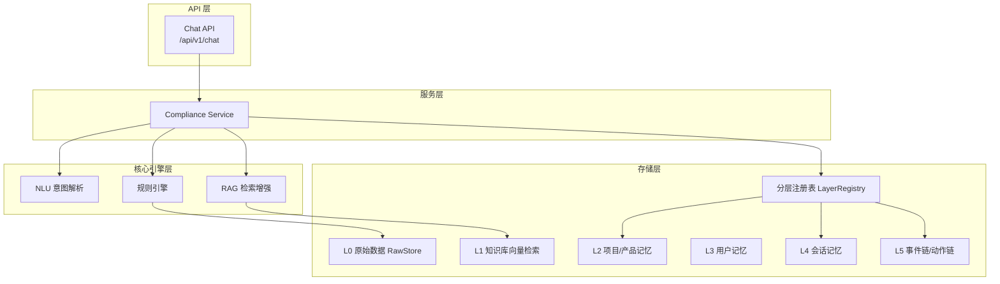
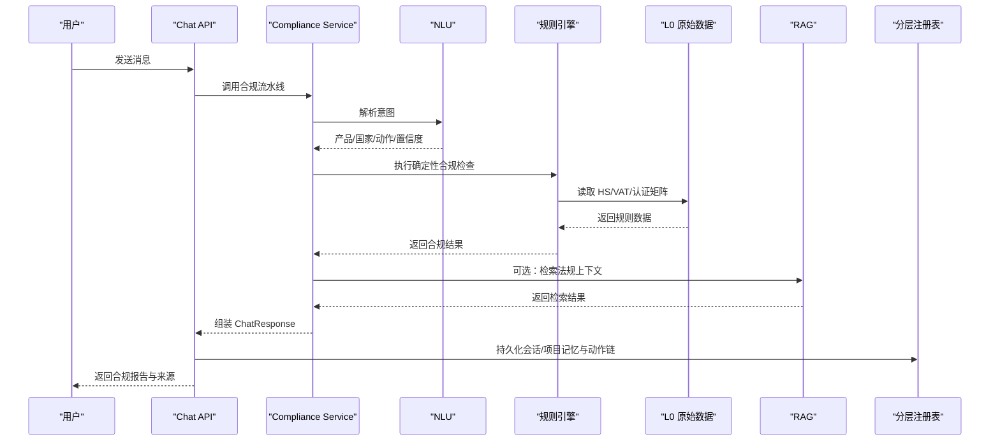
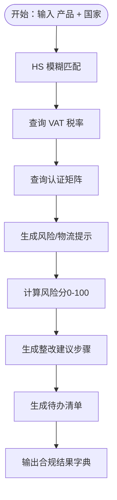
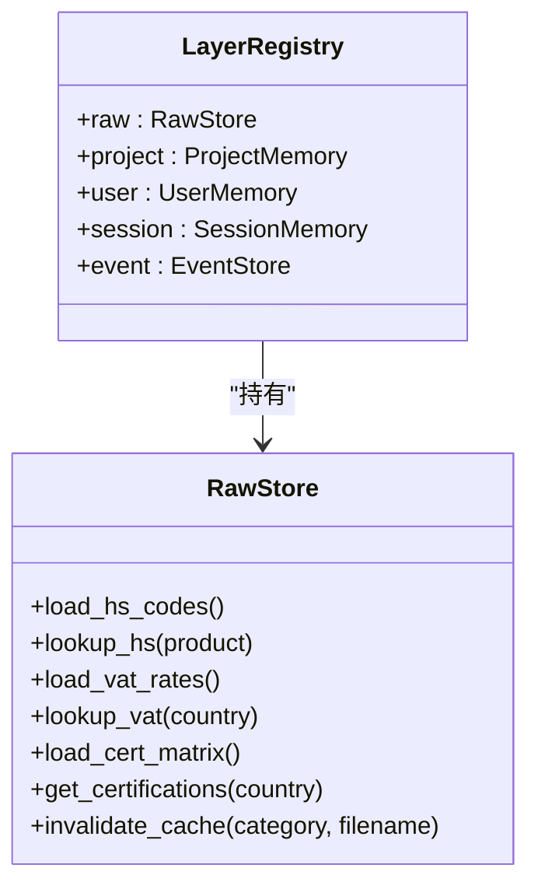
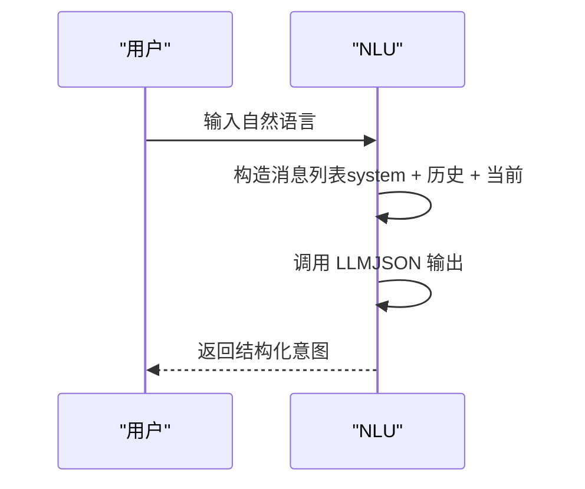
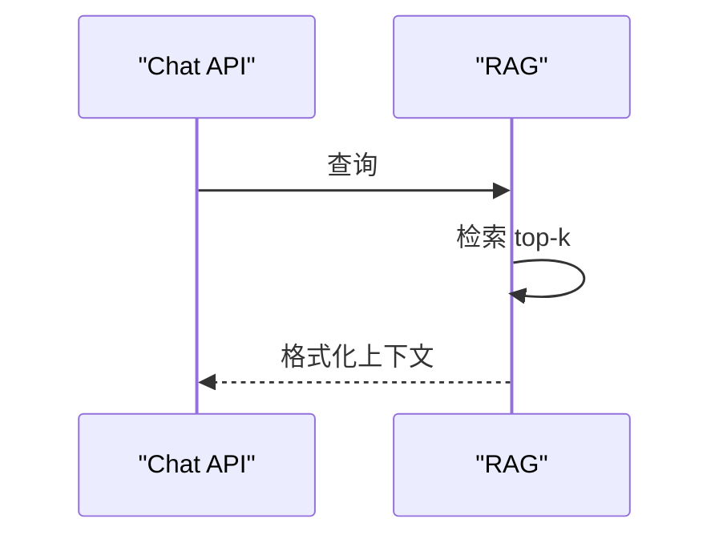
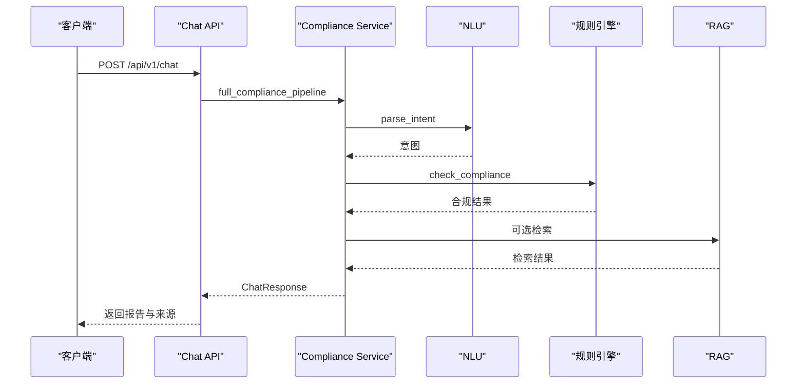
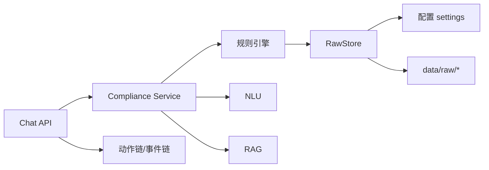

# 规则引擎系统

<cite>
**本文档引用的文件**
- [backend/app/core/rule_engine.py](file://backend/app/core/rule_engine.py)
- [backend/app/services/compliance.py](file://backend/app/services/compliance.py)
- [backend/app/storage/layer_registry.py](file://backend/app/storage/layer_registry.py)
- [backend/app/storage/raw_store.py](file://backend/app/storage/raw_store.py)
- [backend/app/core/nlu.py](file://backend/app/core/nlu.py)
- [backend/app/core/rag.py](file://backend/app/core/rag.py)
- [backend/app/api/chat.py](file://backend/app/api/chat.py)
- [backend/app/models/schemas.py](file://backend/app/models/schemas.py)
- [backend/app/main.py](file://backend/app/main.py)
- [backend/data/vat_rates.json](file://backend/data/vat_rates.json)
- [backend/data/raw/hs_codes/_all.json](file://backend/data/raw/hs_codes/_all.json)
- [backend/data/raw/certifications/cert_matrix.json](file://backend/data/raw/certifications/cert_matrix.json)
- [backend/tests/test_rule_engine.py](file://backend/tests/test_rule_engine.py)
- [backend/app/config.py](file://backend/app/config.py)
</cite>

## 目录
1. [简介](#简介)
2. [项目结构](#项目结构)
3. [核心组件](#核心组件)
4. [架构总览](#架构总览)
5. [详细组件分析](#详细组件分析)
6. [依赖分析](#依赖分析)
7. [性能考虑](#性能考虑)
8. [故障排查指南](#故障排查指南)
9. [结论](#结论)
10. [附录](#附录)

## 简介
本文件系统性梳理“规则引擎系统”的设计与实现，聚焦合规检查规则的组织结构、匹配算法与执行流程，阐述HS编码规则、VAT税率规则、认证要求规则等核心业务逻辑，并给出规则配置示例、自定义规则开发指南、性能优化策略、缓存机制、错误处理、调试技巧与常见问题解决方案。同时说明规则引擎与NLU、RAG系统的协同工作机制。

## 项目结构
后端采用分层与职责分离的组织方式：
- API 层：对外提供交互接口，负责请求接入、会话与记忆持久化、动作链记录与回溯。
- 服务层：编排 NLU、规则引擎、RAG 等能力，形成端到端合规检查流水线。
- 核心引擎层：规则引擎（Deterministic）、NLU（Intent Parsing）、RAG（检索增强）。
- 存储层：分层注册表统一访问 L0-L5 各层数据，其中 L0 为静态规则数据，L5 为事件链与动作链。

图表来源
- [backend/app/api/chat.py:1-200](file://backend/app/api/chat.py#L1-L200)
- [backend/app/services/compliance.py:1-35](file://backend/app/services/compliance.py#L1-L35)
- [backend/app/core/rule_engine.py:1-247](file://backend/app/core/rule_engine.py#L1-L247)
- [backend/app/core/nlu.py:1-99](file://backend/app/core/nlu.py#L1-L99)
- [backend/app/core/rag.py:1-59](file://backend/app/core/rag.py#L1-L59)
- [backend/app/storage/layer_registry.py:1-45](file://backend/app/storage/layer_registry.py#L1-L45)
- [backend/app/storage/raw_store.py:1-134](file://backend/app/storage/raw_store.py#L1-L134)

章节来源
- [backend/app/main.py:1-76](file://backend/app/main.py#L1-L76)
- [backend/app/api/chat.py:1-200](file://backend/app/api/chat.py#L1-L200)
- [backend/app/services/compliance.py:1-35](file://backend/app/services/compliance.py#L1-L35)

## 核心组件
- 规则引擎（Rule Engine）：提供确定性合规检查，包括 HS 编码模糊匹配、VAT 税率查询、认证矩阵查询、风险与物流提示、文化注意事项、风险评分与整改建议生成。
- 分层注册表（LayerRegistry）：统一暴露 L0-L5 各层存储，规则引擎通过 registry.raw 读取 L0 静态规则数据。
- 原始数据存储（RawStore）：在模块加载时缓存 data/raw 下的 HS、VAT、认证矩阵等静态数据，后续读取走内存缓存。
- NLU（意图解析）：将用户自然语言解析为结构化意图（产品、目标国家、动作、置信度），支持热加载系统提示词。
- RAG（检索增强）：从知识库检索相关法规片段，格式化为上下文供 LLM 使用。
- API 与服务编排：Chat API 将 NLU → RuleEngine → RAG 的流水线串联，记录动作链并持久化会话与项目记忆。

章节来源
- [backend/app/core/rule_engine.py:1-247](file://backend/app/core/rule_engine.py#L1-L247)
- [backend/app/storage/layer_registry.py:1-45](file://backend/app/storage/layer_registry.py#L1-L45)
- [backend/app/storage/raw_store.py:1-134](file://backend/app/storage/raw_store.py#L1-L134)
- [backend/app/core/nlu.py:1-99](file://backend/app/core/nlu.py#L1-L99)
- [backend/app/core/rag.py:1-59](file://backend/app/core/rag.py#L1-L59)
- [backend/app/api/chat.py:1-200](file://backend/app/api/chat.py#L1-L200)

## 架构总览
规则引擎以“高频率、确定性”为核心定位，NLU 负责意图抽取，RAG 提供开放问答与法规引用。三者边界清晰，互不交叉，保证确定性检查的稳定性与可预测性。

图表来源
- [backend/app/api/chat.py:339-483](file://backend/app/api/chat.py#L339-L483)
- [backend/app/services/compliance.py:11-34](file://backend/app/services/compliance.py#L11-L34)
- [backend/app/core/rule_engine.py:197-247](file://backend/app/core/rule_engine.py#L197-L247)
- [backend/app/core/nlu.py:59-99](file://backend/app/core/nlu.py#L59-L99)
- [backend/app/core/rag.py:10-59](file://backend/app/core/rag.py#L10-L59)
- [backend/app/storage/layer_registry.py:23-45](file://backend/app/storage/layer_registry.py#L23-L45)

## 详细组件分析

### 规则引擎（Rule Engine）
- HS 编码规则：基于 L0 静态数据进行模糊匹配，支持别名映射（如“锂电池”→“锂离子蓄电池”、“灯”→“LED灯具”等），提升召回质量。
- VAT 税率规则：按国家查询标准税率，未知国家默认 0.0。
- 认证要求规则：按国家返回所需认证列表，未知国家回退至德国标准（保守策略）。
- 风险与物流提示：内置高风险关键词与国家特定风险，以及电池/电子产品等物流特殊要求。
- 文化注意事项：按目标市场提供标签与宣传合规建议。
- 风险评分与整改建议：综合 HS 匹配、认证数量、风险与物流提示、产品类别等因素计算 0-100 风险分，并生成优先级整改步骤。
- 完整合规检查：串联 HS/VAT/认证/风险/物流/文化/文档清单/风险评分/整改建议/待办清单，输出标准化结果。

图表来源
- [backend/app/core/rule_engine.py:197-247](file://backend/app/core/rule_engine.py#L197-L247)

章节来源
- [backend/app/core/rule_engine.py:17-247](file://backend/app/core/rule_engine.py#L17-L247)
- [backend/data/vat_rates.json:1-13](file://backend/data/vat_rates.json#L1-L13)
- [backend/data/raw/hs_codes/_all.json:1-1](file://backend/data/raw/hs_codes/_all.json#L1-L1)
- [backend/data/raw/certifications/cert_matrix.json:1-14](file://backend/data/raw/certifications/cert_matrix.json#L1-L14)

### 分层注册表与原始数据存储
- 分层注册表：集中暴露 L0（RawStore）、L2（ProjectMemory）、L3（UserMemory）、L4（SessionMemory）、L5（EventStore）。
- 原始数据存储：模块加载时缓存 data/raw 下的 JSON 文件，后续读取走内存缓存；提供 HS/VAT/认证矩阵的读取与别名映射、默认回退策略。

图表来源
- [backend/app/storage/layer_registry.py:23-45](file://backend/app/storage/layer_registry.py#L23-L45)
- [backend/app/storage/raw_store.py:19-134](file://backend/app/storage/raw_store.py#L19-L134)

章节来源
- [backend/app/storage/layer_registry.py:1-45](file://backend/app/storage/layer_registry.py#L1-L45)
- [backend/app/storage/raw_store.py:1-134](file://backend/app/storage/raw_store.py#L1-L134)

### NLU（意图解析）
- 通过系统提示词与 LLM 结构化输出，解析用户输入中的产品、目标国家、动作与置信度。
- 支持历史上下文注入，限制助手消息长度，避免污染上下文。
- 支持热加载系统提示词与禁用思考模式以降低延迟。

图表来源
- [backend/app/core/nlu.py:59-99](file://backend/app/core/nlu.py#L59-L99)

章节来源
- [backend/app/core/nlu.py:1-99](file://backend/app/core/nlu.py#L1-L99)

### RAG（检索增强）
- 从知识库检索与查询相关的法规片段，格式化为带来源标注的上下文字符串。
- 当知识库为空时返回占位提示，保证流程稳定。

图表来源
- [backend/app/core/rag.py:10-59](file://backend/app/core/rag.py#L10-L59)

章节来源
- [backend/app/core/rag.py:1-59](file://backend/app/core/rag.py#L1-L59)

### API 与服务编排
- Chat API：接收用户消息，编排 NLU → RuleEngine → RAG，组装 ChatResponse，记录动作链与会话/项目记忆。
- Compliance Service：在 MVP 阶段委托规则引擎，未来扩展 RAG 与多代理协调。

图表来源
- [backend/app/api/chat.py:339-483](file://backend/app/api/chat.py#L339-L483)
- [backend/app/services/compliance.py:11-34](file://backend/app/services/compliance.py#L11-L34)

章节来源
- [backend/app/api/chat.py:1-200](file://backend/app/api/chat.py#L1-L200)
- [backend/app/services/compliance.py:1-35](file://backend/app/services/compliance.py#L1-L35)

## 依赖分析
- 规则引擎依赖分层注册表访问 L0 原始数据，确保数据来源单一、可追踪。
- 服务层依赖 NLU 与规则引擎，RAG 作为可选增强。
- API 层依赖动作链与会话/项目记忆持久化，保障审计与回溯。

图表来源
- [backend/app/core/rule_engine.py:13-14](file://backend/app/core/rule_engine.py#L13-L14)
- [backend/app/storage/raw_store.py:22-24](file://backend/app/storage/raw_store.py#L22-L24)
- [backend/app/config.py:45-46](file://backend/app/config.py#L45-L46)
- [backend/app/api/chat.py:14-25](file://backend/app/api/chat.py#L14-L25)

章节来源
- [backend/app/core/rule_engine.py:1-247](file://backend/app/core/rule_engine.py#L1-L247)
- [backend/app/storage/layer_registry.py:1-45](file://backend/app/storage/layer_registry.py#L1-L45)
- [backend/app/storage/raw_store.py:1-134](file://backend/app/storage/raw_store.py#L1-L134)
- [backend/app/api/chat.py:1-200](file://backend/app/api/chat.py#L1-L200)

## 性能考虑
- L0 缓存：原始规则数据在模块加载时一次性读取并缓存，后续查询 O(1) 内存命中，避免频繁磁盘 IO。
- HS 模糊匹配：通过产品词拆分与别名映射提升召回，复杂度与规则集规模线性相关，建议控制别名数量与匹配层级。
- NLU/RAG：通过禁用思考模式、限制历史上下文长度、结构化 JSON 输出等方式降低延迟与上下文污染。
- 动作链与持久化：仅在必要时写入 L5，避免阻塞主流程；异常捕获确保用户体验不受存储失败影响。
- 并发与限流：建议在 API 层增加速率限制与队列缓冲，防止突发流量冲击 LLM 与检索服务。

## 故障排查指南
- 产品未识别：检查 NLU 是否正确解析意图，若 LLM Key 未配置则回落到关键词提取，但准确性下降。
- HS 未匹配：确认产品名称是否包含规则中的关键词或别名；必要时在规则中添加别名映射。
- VAT 为 0：未知国家默认返回 0.0，确认国家名称是否在数据集中。
- 认证列表为空：未知国家回退至德国标准，确认国家名称与认证矩阵一致。
- 风险评分异常：检查产品关键词与国家列表是否触发了额外加分项。
- RAG 无结果：确认知识库是否已构建；当知识库为空时返回占位提示属预期行为。
- 动作链缺失：检查 API 是否成功保存动作链与会话记忆；异常会被吞并以保证响应可用。

章节来源
- [backend/tests/test_rule_engine.py:1-112](file://backend/tests/test_rule_engine.py#L1-L112)
- [backend/app/core/rule_engine.py:197-247](file://backend/app/core/rule_engine.py#L197-L247)
- [backend/app/core/rag.py:16-18](file://backend/app/core/rag.py#L16-L18)

## 结论
规则引擎系统以“确定性 + 可解释”的方式支撑高频合规检查，结合 NLU 的意图解析与 RAG 的法规检索，形成从意图到规则再到知识的完整闭环。通过 L0 缓存、动作链与记忆持久化、错误降级与热加载等机制，系统在性能、可观测性与可维护性方面具备良好平衡。未来可在服务层引入 RAG 增强与多代理协作，进一步提升开放场景下的回答质量与覆盖面。

## 附录

### 规则配置示例
- HS 编码：位于 data/raw/hs_codes/_all.json，包含编码、中文描述、英文描述与类别。
- VAT 税率：位于 data/raw/vat_rates/_all.json，包含标准/减免税率与货币。
- 认证矩阵：位于 data/raw/certifications/cert_matrix.json，按国家列出所需认证。

章节来源
- [backend/data/raw/hs_codes/_all.json:1-1](file://backend/data/raw/hs_codes/_all.json#L1-L1)
- [backend/data/vat_rates.json:1-13](file://backend/data/vat_rates.json#L1-L13)
- [backend/data/raw/certifications/cert_matrix.json:1-14](file://backend/data/raw/certifications/cert_matrix.json#L1-L14)

### 自定义规则开发指南
- 新增国家/地区：在认证矩阵中添加国家与认证列表；在 VAT 数据中补充税率。
- 新增产品别名：在规则引擎的别名映射中添加关键词与别名集合。
- 新增风险提示：在风险/物流/文化函数中按国家或产品关键词扩展提示列表。
- 新增 HS 类别：在 HS 数据中补充类别字段，便于后续扩展分类统计与报表。
- 热加载：通过 RawStore.invalidate_cache(category, filename) 清除缓存后自动重新加载。

章节来源
- [backend/app/storage/raw_store.py:43-53](file://backend/app/storage/raw_store.py#L43-L53)
- [backend/app/core/rule_engine.py:54-145](file://backend/app/core/rule_engine.py#L54-L145)

### 数据模型与接口
- 合规结果模型：包含 HS 编码、VAT 税率、认证列表、风险等级与分、风险提示、物流提示、清关建议、文化注意事项、整改步骤与待办清单。
- ChatResponse：封装合规报告、来源摘要、会话与动作链 ID、NLU 意图等。

章节来源
- [backend/app/models/schemas.py:79-104](file://backend/app/models/schemas.py#L79-L104)
- [backend/app/models/schemas.py:95-104](file://backend/app/models/schemas.py#L95-L104)