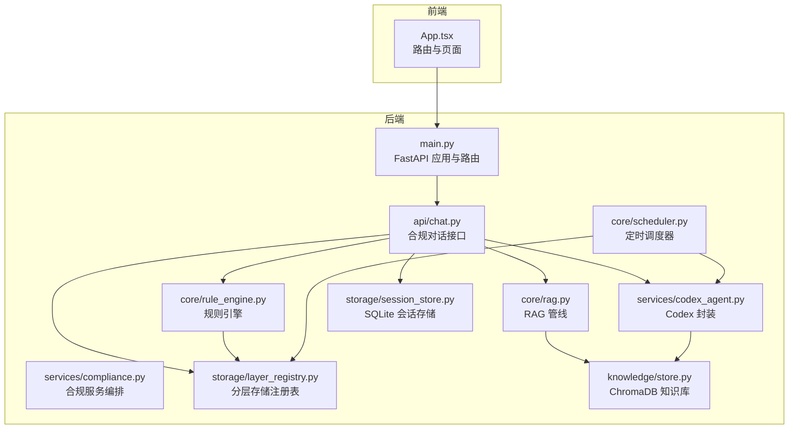
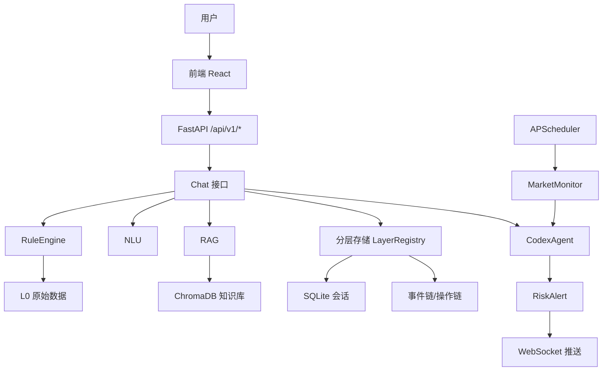
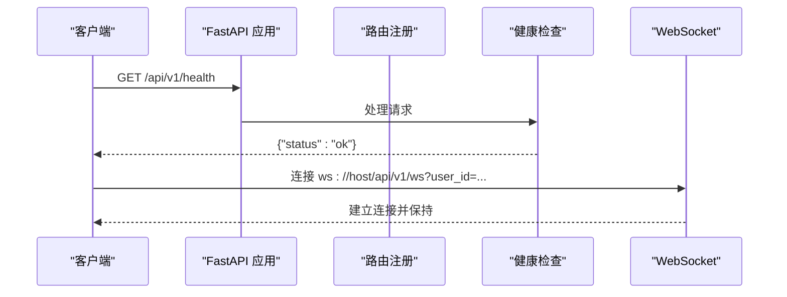
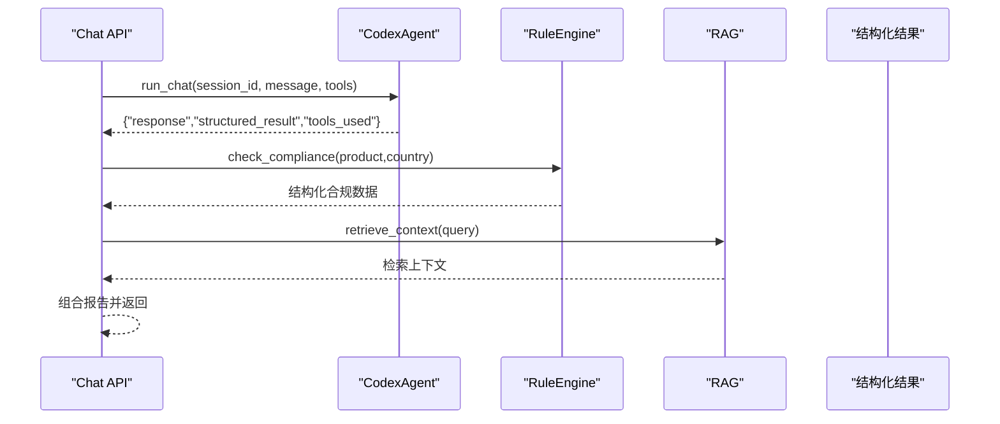
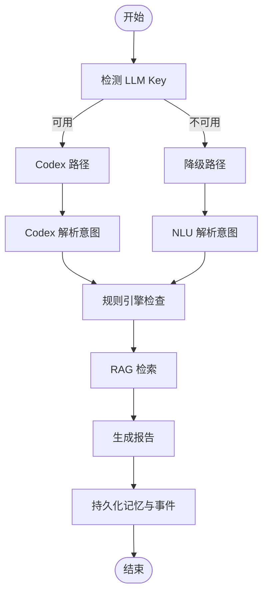
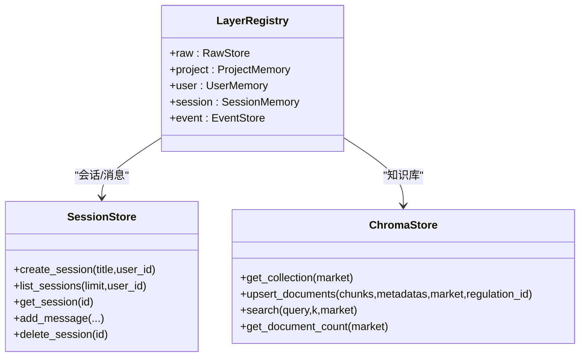
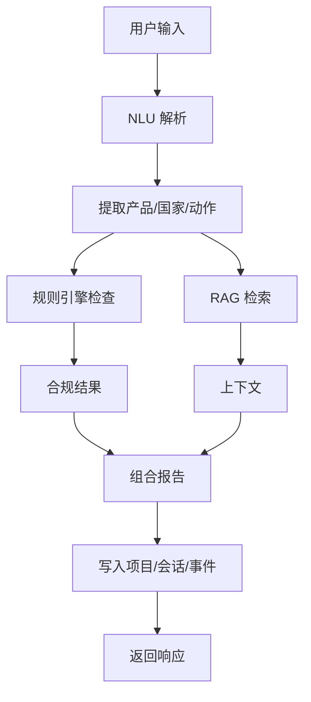
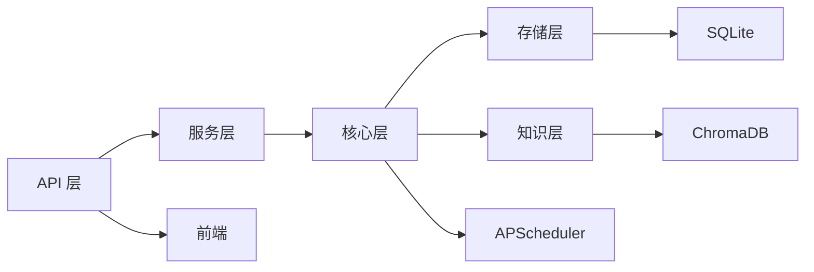

# 系统概览

<cite>
**本文档引用的文件**
- [README.md](file://README.md)
- [DEVELOPMENT_PLAN.md](file://DEVELOPMENT_PLAN.md)
- [backend/app/main.py](file://backend/app/main.py)
- [backend/app/config.py](file://backend/app/config.py)
- [backend/app/api/chat.py](file://backend/app/api/chat.py)
- [backend/app/core/rule_engine.py](file://backend/app/core/rule_engine.py)
- [backend/app/core/rag.py](file://backend/app/core/rag.py)
- [backend/app/services/compliance.py](file://backend/app/services/compliance.py)
- [backend/app/storage/session_store.py](file://backend/app/storage/session_store.py)
- [backend/app/storage/layer_registry.py](file://backend/app/storage/layer_registry.py)
- [backend/app/knowledge/store.py](file://backend/app/knowledge/store.py)
- [backend/app/core/scheduler.py](file://backend/app/core/scheduler.py)
- [backend/app/services/codex_agent.py](file://backend/app/services/codex_agent.py)
- [backend/data/数据流转.md](file://backend/data/数据流转.md)
- [frontend/src/App.tsx](file://frontend/src/App.tsx)
</cite>

## 目录
1. [引言](#引言)
2. [项目结构](#项目结构)
3. [核心组件](#核心组件)
4. [架构总览](#架构总览)
5. [详细组件分析](#详细组件分析)
6. [依赖分析](#依赖分析)
7. [性能考虑](#性能考虑)
8. [故障排除指南](#故障排除指南)
9. [结论](#结论)
10. [附录](#附录)

## 引言
避风港是一个面向中小出海企业的“大模型出海合规自动化”系统，目标是以秒级响应生成产品出口目标国家的 HS 编码、税率、认证清单与合规报告。系统采用“确定性规则引擎 + 检索增强生成（RAG）+ 多智能体（Codex）”三位一体架构，结合分层存储与定时调度，提供从用户输入到合规报告输出的完整闭环。

- 系统目标
  - 以自然语言交互为核心，快速完成“产品+国家”的合规查询
  - 通过规则引擎保证高频确定性场景的准确性与时效性
  - 通过 RAG 与 Codex 联网搜索补充复杂与开放性问题的答案
  - 通过风险监控与预警机制，持续跟踪目标市场的法规变化

- 核心价值主张
  - 低门槛：中文自然语言输入，无需专业合规背景
  - 高效率：秒级生成结构化合规报告与待办清单
  - 可靠性：规则引擎 + RAG + 多智能体三层保障，支持降级与回溯
  - 可运营：事件链与操作链记录，支持审计与优化

**章节来源**
- [README.md:1-316](file://README.md#L1-L316)

## 项目结构
后端采用 FastAPI，前端采用 React 19 + TypeScript，数据与知识库通过分层存储与 ChromaDB 向量库支撑。系统按“API 层、服务层、核心层、存储层、基础设施层”分层组织，模块间通过清晰的边界与依赖注入实现解耦。

**图表来源**
- [backend/app/main.py:1-76](file://backend/app/main.py#L1-L76)
- [backend/app/api/chat.py:1-541](file://backend/app/api/chat.py#L1-L541)
- [backend/app/core/rule_engine.py:1-247](file://backend/app/core/rule_engine.py#L1-L247)
- [backend/app/core/rag.py:1-59](file://backend/app/core/rag.py#L1-L59)
- [backend/app/services/compliance.py:1-35](file://backend/app/services/compliance.py#L1-L35)
- [backend/app/services/codex_agent.py:1-370](file://backend/app/services/codex_agent.py#L1-L370)
- [backend/app/storage/session_store.py:1-251](file://backend/app/storage/session_store.py#L1-L251)
- [backend/app/storage/layer_registry.py:1-45](file://backend/app/storage/layer_registry.py#L1-L45)
- [backend/app/knowledge/store.py:1-227](file://backend/app/knowledge/store.py#L1-L227)
- [backend/app/core/scheduler.py:1-152](file://backend/app/core/scheduler.py#L1-L152)
- [frontend/src/App.tsx:1-75](file://frontend/src/App.tsx#L1-L75)

**章节来源**
- [README.md:92-200](file://README.md#L92-L200)
- [DEVELOPMENT_PLAN.md:43-100](file://DEVELOPMENT_PLAN.md#L43-L100)

## 核心组件
- API 层（FastAPI）
  - 路由注册与健康检查、WebSocket 实时推送、生命周期钩子
  - 负责对外暴露端点，协调服务层与核心层

- 服务层（services）
  - CodexAgent：封装 Codex CLI，提供 run_chat/run_task 与工具调用
  - ComplianceService：编排规则引擎 + RAG 的合规检查流程
  - PromptLoader、WSManager、Shopify 等：支撑提示模板热加载、WebSocket 推送与电商集成

- 核心层（core）
  - RuleEngine：基于 L0 原始数据的确定性合规检查（HS/VAT/认证/风险）
  - RAG：ChromaDB 向量检索与上下文格式化
  - NLU：意图解析与关键词兜底
  - MarketMonitor、RiskAlert、Metrics、ActionChain、EventChain：风险监控、预警生成与审计追踪

- 存储层（storage）
  - LayerRegistry：统一访问 L0-L5 分层存储
  - RawStore、ProjectMemory、UserMemory、SessionMemory、EventStore：按层级隔离的数据读写
  - SessionStore：SQLite 会话持久化

- 知识层（knowledge）
  - ChromaDB 多集合（eu/us/jp/kr）向量库，按市场路由检索

- 基础设施（config、scheduler）
  - Settings：集中配置（LLM、Chroma、JWT、Shopify 等）
  - APScheduler：定时轮询市场、聚合指标、触发风险扫描

**章节来源**
- [backend/app/api/chat.py:1-541](file://backend/app/api/chat.py#L1-L541)
- [backend/app/services/compliance.py:1-35](file://backend/app/services/compliance.py#L1-L35)
- [backend/app/services/codex_agent.py:1-370](file://backend/app/services/codex_agent.py#L1-L370)
- [backend/app/core/rule_engine.py:1-247](file://backend/app/core/rule_engine.py#L1-L247)
- [backend/app/core/rag.py:1-59](file://backend/app/core/rag.py#L1-L59)
- [backend/app/storage/layer_registry.py:1-45](file://backend/app/storage/layer_registry.py#L1-L45)
- [backend/app/storage/session_store.py:1-251](file://backend/app/storage/session_store.py#L1-L251)
- [backend/app/knowledge/store.py:1-227](file://backend/app/knowledge/store.py#L1-L227)
- [backend/app/core/scheduler.py:1-152](file://backend/app/core/scheduler.py#L1-L152)
- [backend/app/config.py:1-75](file://backend/app/config.py#L1-L75)

## 架构总览
系统采用“API 层 → 服务层 → 核心层 → 存储层”的分层设计，辅以“前端 → 后端 → 知识库/数据库”的数据通路。核心特性包括：
- 双路径对话：Codex 驱动（skills + MCP 工具 + 联网搜索）与降级路径（NLU → RuleEngine → RAG）
- 多智能体与工具：CodexAgent 通过 MCP 工具实现 HS/VAT/认证/RAG 等结构化能力
- 分层存储：L0（确定性数据）→ L1（ChromaDB）→ L2/L3/L4/L5（记忆与事件）
- 定时调度：市场监控、指标聚合、风险扫描与预警推送

**图表来源**
- [backend/app/main.py:1-76](file://backend/app/main.py#L1-L76)
- [backend/app/api/chat.py:228-377](file://backend/app/api/chat.py#L228-L377)
- [backend/app/services/codex_agent.py:110-160](file://backend/app/services/codex_agent.py#L110-L160)
- [backend/app/core/rule_engine.py:197-247](file://backend/app/core/rule_engine.py#L197-L247)
- [backend/app/core/rag.py:10-59](file://backend/app/core/rag.py#L10-L59)
- [backend/app/storage/layer_registry.py:23-45](file://backend/app/storage/layer_registry.py#L23-L45)
- [backend/app/storage/session_store.py:74-131](file://backend/app/storage/session_store.py#L74-L131)
- [backend/app/core/scheduler.py:68-131](file://backend/app/core/scheduler.py#L68-L131)

**章节来源**
- [README.md:7-31](file://README.md#L7-L31)
- [backend/data/数据流转.md:10-38](file://backend/data/数据流转.md#L10-L38)

## 详细组件分析

### API 层（FastAPI）
- 路由与中间件
  - 注册 /api/v1/* 下的所有子路由（chat、chains、shopify、risk、sessions、auth、users、model-config、agent-config）
  - CORS 配置允许前端本地开发域访问
- 健康检查与 WebSocket
  - /api/v1/health 返回服务状态
  - /api/v1/ws 提供实时推送通道，按 user_id 维持连接
- 生命周期
  - startup：启动调度器、初始化默认管理员、默认模型配置、默认 Agent
  - shutdown：停止调度器

**图表来源**
- [backend/app/main.py:33-56](file://backend/app/main.py#L33-L56)

**章节来源**
- [backend/app/main.py:1-76](file://backend/app/main.py#L1-L76)

### 服务层（CodexAgent 与合规服务）
- CodexAgent
  - run_chat：多轮会话，支持 skills + MCP 工具 + 联网搜索，维护持久化 Thread
  - run_task：单次任务，适合批处理与结构化输出
  - 工具调用：通过 MCP 工具集（HS/VAT/认证/RAG 等）扩展能力
  - 降级：未启用时返回模拟响应
- ComplianceService
  - 当前 MVP 阶段主要委托 RuleEngine；未来将整合 RAG 与多智能体

**图表来源**
- [backend/app/api/chat.py:269-377](file://backend/app/api/chat.py#L269-L377)
- [backend/app/services/codex_agent.py:110-160](file://backend/app/services/codex_agent.py#L110-L160)
- [backend/app/core/rule_engine.py:197-247](file://backend/app/core/rule_engine.py#L197-L247)
- [backend/app/core/rag.py:10-59](file://backend/app/core/rag.py#L10-L59)

**章节来源**
- [backend/app/services/compliance.py:1-35](file://backend/app/services/compliance.py#L1-L35)
- [backend/app/services/codex_agent.py:1-370](file://backend/app/services/codex_agent.py#L1-L370)

### 核心层（规则引擎、RAG、NLU、调度）
- 规则引擎（RuleEngine）
  - 读取 L0 原始数据（HS/VAT/认证矩阵），生成确定性合规结果
  - 输出风险评分、整改建议、待办清单等
- RAG
  - ChromaDB 多集合检索，格式化为 LLM 上下文
  - 支持市场路由与全库回退
- NLU
  - LLM 意图解析 + 关键词兜底，支持降级路径
- 调度器（APScheduler）
  - 定时轮询市场、聚合指标、触发风险扫描与预警推送

**图表来源**
- [backend/app/api/chat.py:93-101](file://backend/app/api/chat.py#L93-L101)
- [backend/app/api/chat.py:415-541](file://backend/app/api/chat.py#L415-L541)
- [backend/app/core/rule_engine.py:197-247](file://backend/app/core/rule_engine.py#L197-L247)
- [backend/app/core/rag.py:10-59](file://backend/app/core/rag.py#L10-L59)

**章节来源**
- [backend/app/core/rule_engine.py:1-247](file://backend/app/core/rule_engine.py#L1-L247)
- [backend/app/core/rag.py:1-59](file://backend/app/core/rag.py#L1-L59)
- [backend/app/core/scheduler.py:1-152](file://backend/app/core/scheduler.py#L1-L152)

### 存储层（分层存储与会话）
- LayerRegistry
  - 统一暴露 L0（Raw）、L2（Project）、L3（User）、L4（Session）、L5（Event）访问入口
- SessionStore
  - SQLite 表结构：sessions、messages，支持会话列表、详情、消息增删
  - 会话上下文用于多轮对话与降级路径
- 知识库（ChromaDB）
  - 多集合按市场隔离，懒加载嵌入模型，支持自动路由与全库回退

**图表来源**
- [backend/app/storage/layer_registry.py:23-45](file://backend/app/storage/layer_registry.py#L23-L45)
- [backend/app/storage/session_store.py:74-131](file://backend/app/storage/session_store.py#L74-L131)
- [backend/app/knowledge/store.py:54-79](file://backend/app/knowledge/store.py#L54-L79)

**章节来源**
- [backend/app/storage/layer_registry.py:1-45](file://backend/app/storage/layer_registry.py#L1-L45)
- [backend/app/storage/session_store.py:1-251](file://backend/app/storage/session_store.py#L1-L251)
- [backend/app/knowledge/store.py:1-227](file://backend/app/knowledge/store.py#L1-L227)

### 数据流与事件链
系统以“用户输入 → 意图解析 → 规则引擎 → RAG → 报告生成 → 记忆与事件写入”为主线，同时通过定时调度与 Codex 联网搜索实现风险监控与预警推送。

**图表来源**
- [backend/data/数据流转.md:272-298](file://backend/data/数据流转.md#L272-L298)
- [backend/app/api/chat.py:228-377](file://backend/app/api/chat.py#L228-L377)

**章节来源**
- [backend/data/数据流转.md:1-361](file://backend/data/数据流转.md#L1-L361)

## 依赖分析
- 组件耦合与内聚
  - API 层仅负责编排，核心逻辑集中在服务层与核心层，耦合度低
  - 存储层通过 LayerRegistry 解耦上层与底层实现
  - CodexAgent 与 MCP 工具形成可插拔的能力扩展
- 外部依赖
  - LLM：OpenRouter 或自定义 LLM，支持主/备用配置
  - 向量库：ChromaDB（本地嵌入模型）
  - 认证：JWT + bcrypt
  - 定时：APScheduler
  - 基础设施：Docker Compose（PostgreSQL、Chroma）

**图表来源**
- [backend/app/config.py:5-75](file://backend/app/config.py#L5-L75)
- [backend/app/main.py:1-76](file://backend/app/main.py#L1-L76)

**章节来源**
- [backend/app/config.py:1-75](file://backend/app/config.py#L1-L75)
- [README.md:282-296](file://README.md#L282-L296)

## 性能考虑
- 响应延迟
  - Codex 路径：优先使用结构化工具与联网搜索，减少 LLM 生成成本
  - 降级路径：NLU + RuleEngine + RAG，避免 LLM 调用瓶颈
- 检索效率
  - ChromaDB 多集合按市场路由，必要时回退全库
  - 懒加载嵌入模型，避免启动时阻塞
- 存储与并发
  - SQLite 会话存储支持高并发写入，消息与会话分离
  - 分层存储按用户/产品隔离，降低锁竞争
- 可扩展性
  - LayerRegistry 便于新增存储层
  - CodexAgent 工具与 Prompt 模板可热加载
  - 调度器支持动态任务与间隔配置

[本节为通用指导，无需特定文件引用]

## 故障排除指南
- 健康检查失败
  - 检查 /api/v1/health 是否返回正常状态
  - 确认后端进程与 WebSocket 端点可用
- 会话异常
  - 使用 /api/v1/sessions 接口列出与查询会话
  - 检查 SQLite 数据库文件是否存在与权限
- 知识库检索为空
  - 确认 ChromaDB 集合已初始化且文档数量大于 0
  - 检查 market 路由与查询关键词
- Codex 不可用
  - 检查配置中的 codex_enabled 与 API Key
  - 查看降级路径是否正常工作
- 风险预警未推送
  - 检查调度器是否启动与任务是否执行
  - 确认 WebSocket 连接与用户在线状态

**章节来源**
- [backend/app/main.py:33-56](file://backend/app/main.py#L33-L56)
- [backend/app/storage/session_store.py:74-131](file://backend/app/storage/session_store.py#L74-L131)
- [backend/app/knowledge/store.py:195-211](file://backend/app/knowledge/store.py#L195-L211)
- [backend/app/core/scheduler.py:24-64](file://backend/app/core/scheduler.py#L24-L64)

## 结论
避风港通过“规则引擎 + RAG + 多智能体”的分层架构，实现了从自然语言输入到合规报告输出的高效闭环。系统在确定性与灵活性之间取得平衡，具备良好的可扩展性与可运维性。随着功能演进，可进一步引入多 Agent 协同、信息采集与灰度发布等能力，持续提升合规服务能力。

[本节为总结性内容，无需特定文件引用]

## 附录
- 快速开始
  - 启动基础设施：docker compose up -d
  - 初始化知识库：python scripts/init_knowledge.py
  - 启动后端：uvicorn app.main:app --reload --port 8000
  - 启动前端：npm run dev
- 默认账号
  - 首次登录：admin / admin123（建议登录后修改密码）

**章节来源**
- [README.md:33-87](file://README.md#L33-L87)