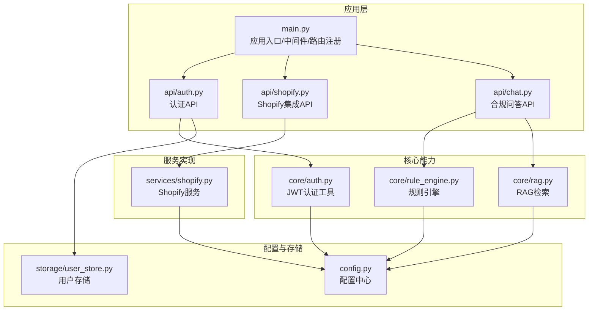
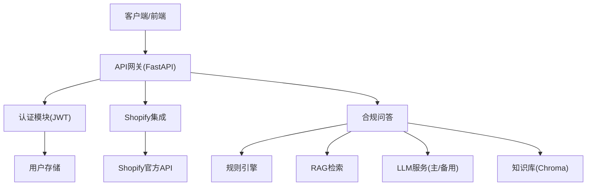
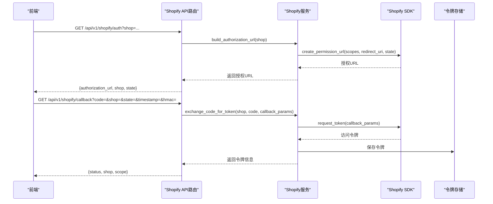
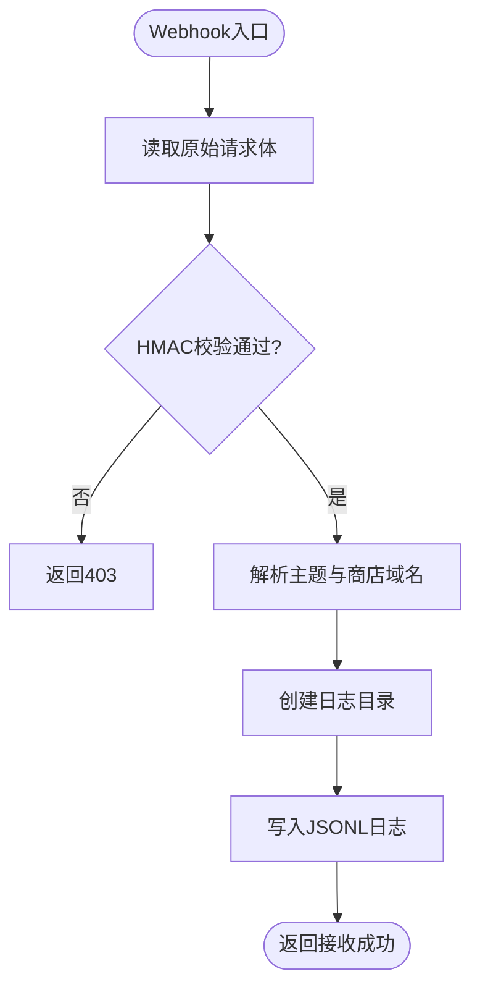
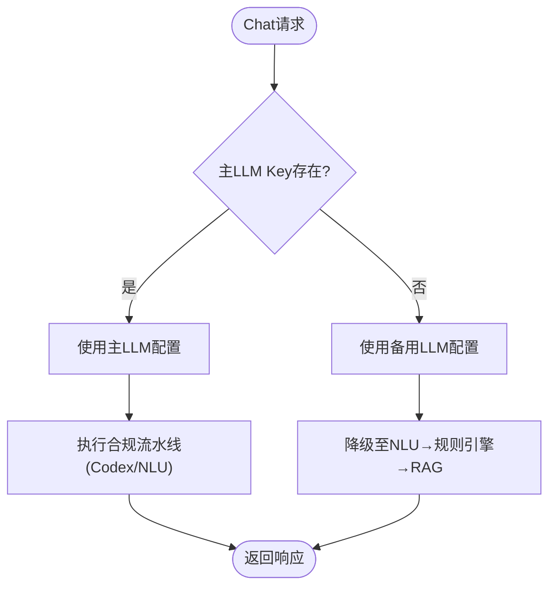
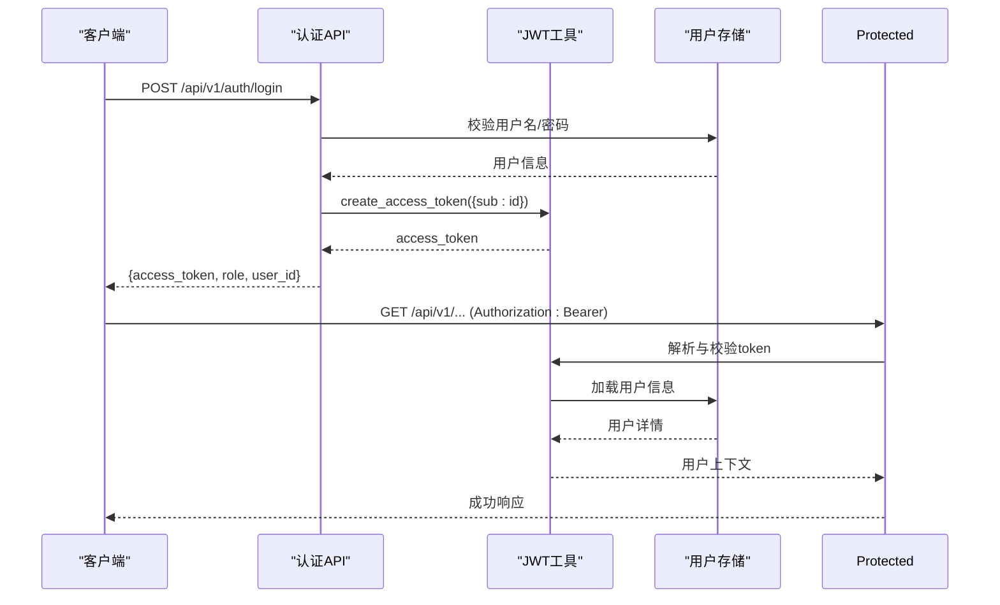
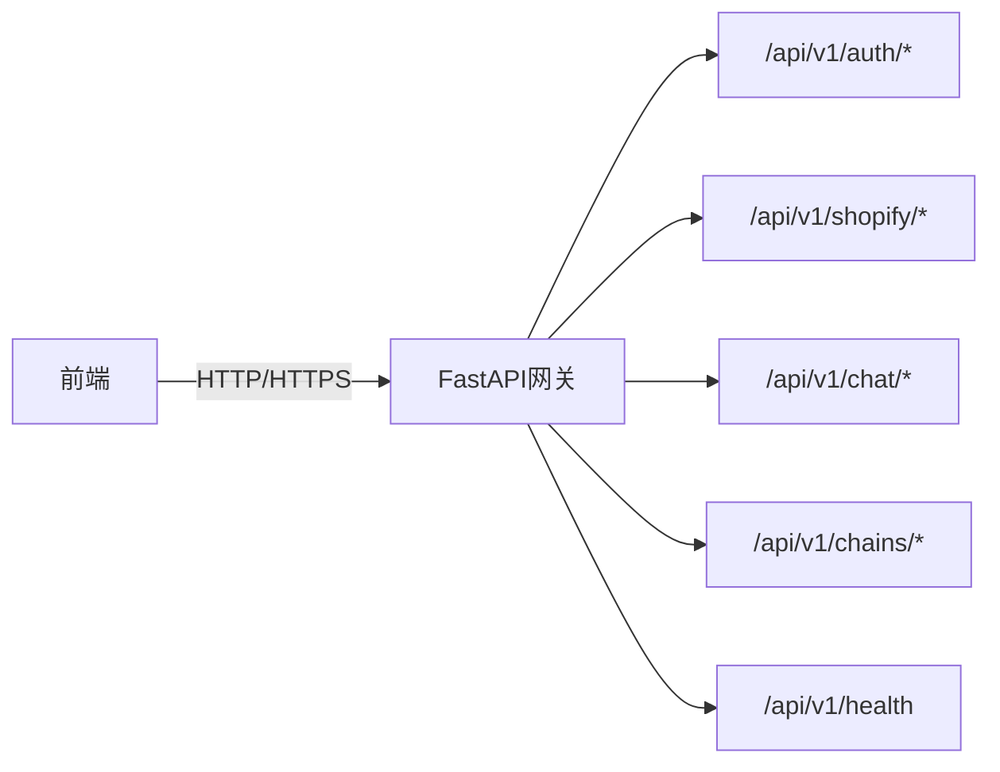
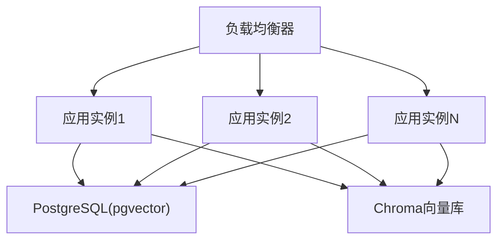
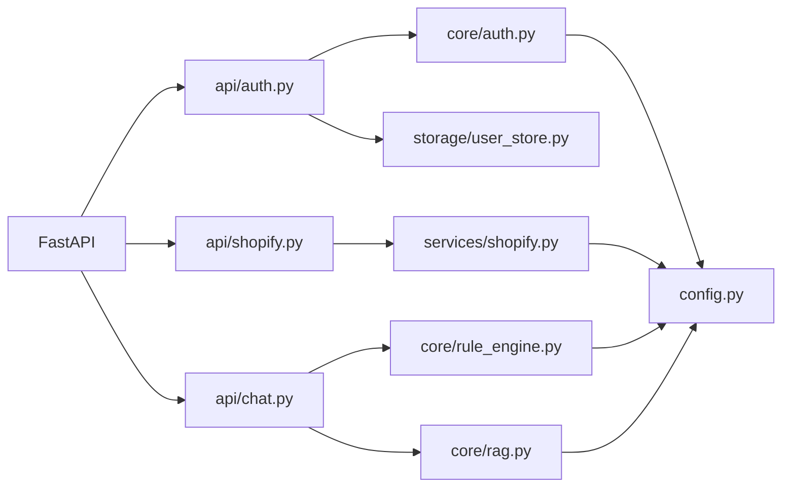

# 集成模式设计

<cite>
**本文档引用的文件**
- [backend/app/main.py](file://backend/app/main.py)
- [backend/app/config.py](file://backend/app/config.py)
- [backend/app/api/auth.py](file://backend/app/api/auth.py)
- [backend/app/core/auth.py](file://backend/app/core/auth.py)
- [backend/app/api/shopify.py](file://backend/app/api/shopify.py)
- [backend/app/services/shopify.py](file://backend/app/services/shopify.py)
- [backend/app/models/schemas.py](file://backend/app/models/schemas.py)
- [backend/app/api/chat.py](file://backend/app/api/chat.py)
- [backend/app/core/rule_engine.py](file://backend/app/core/rule_engine.py)
- [backend/app/core/rag.py](file://backend/app/core/rag.py)
- [backend/app/storage/user_store.py](file://backend/app/storage/user_store.py)
- [backend/docker-compose.yml](file://backend/docker-compose.yml)
- [backend/requirements.txt](file://backend/requirements.txt)
</cite>

## 目录
1. [引言](#引言)
2. [项目结构](#项目结构)
3. [核心组件](#核心组件)
4. [架构总览](#架构总览)
5. [详细组件分析](#详细组件分析)
6. [依赖分析](#依赖分析)
7. [性能考量](#性能考量)
8. [故障排查指南](#故障排查指南)
9. [结论](#结论)
10. [附录](#附录)

## 引言
本设计文档聚焦“避风港”项目的系统集成模式，围绕以下外部服务与能力展开：
- Shopify API 集成：OAuth 授权、产品数据同步、Webhook 接收与验证
- 外部 LLM 服务集成：主 LLM 与备用 LLM 的配置与降级策略
- 第三方认证服务集成：JWT 认证体系与用户权限控制
- API 网关与代理模式：统一入口、路由聚合与跨域策略
- 服务发现与负载均衡：容器编排与健康检查
- 错误处理与重试机制：异常传播、降级与可观测性
- 安全与访问控制：认证、授权、HMAC 校验与 CORS

## 项目结构
后端采用 FastAPI 应用，通过主程序集中注册各模块路由，形成清晰的 API 分层：
- 应用入口与中间件：统一注册路由、CORS、健康检查、WebSocket
- 配置中心：集中管理 LLM、Shopify、JWT 等外部服务凭据与行为开关
- 认证模块：JWT 令牌签发与校验、FastAPI 依赖注入、管理员权限
- 集成模块：Shopify API 路由与服务实现、合规检查流水线
- 核心能力：规则引擎、RAG 检索、操作链追踪
- 存储模块：用户存储、会话存储、知识库检索

**图表来源**
- [backend/app/main.py:1-76](file://backend/app/main.py#L1-L76)
- [backend/app/api/auth.py:1-108](file://backend/app/api/auth.py#L1-L108)
- [backend/app/api/shopify.py:1-257](file://backend/app/api/shopify.py#L1-L257)
- [backend/app/api/chat.py:1-541](file://backend/app/api/chat.py#L1-L541)
- [backend/app/core/auth.py:1-60](file://backend/app/core/auth.py#L1-L60)
- [backend/app/core/rule_engine.py:1-247](file://backend/app/core/rule_engine.py#L1-L247)
- [backend/app/core/rag.py:1-59](file://backend/app/core/rag.py#L1-L59)
- [backend/app/services/shopify.py:1-427](file://backend/app/services/shopify.py#L1-L427)
- [backend/app/config.py:1-75](file://backend/app/config.py#L1-L75)
- [backend/app/storage/user_store.py:1-133](file://backend/app/storage/user_store.py#L1-L133)

**章节来源**
- [backend/app/main.py:1-76](file://backend/app/main.py#L1-L76)
- [backend/app/config.py:1-75](file://backend/app/config.py#L1-L75)

## 核心组件
- 配置中心（Settings）：集中管理 LLM、Shopify、JWT、数据库等外部服务配置，支持环境变量注入与属性别名（主 LLM 优先于备用 LLM）
- 认证与授权（JWT）：基于 HS256 的 JWT 签发与校验，FastAPI 依赖注入实现请求级鉴权与管理员权限校验
- Shopify 集成：OAuth 授权、令牌持久化、产品数据同步、Webhook 验证与落盘
- 合规检查流水线：NLU/规则引擎/RAG 三段式，支持 Codex Agent 驱动与降级路径
- API 网关与代理：通过 FastAPI 路由聚合与中间件实现统一入口、CORS、健康检查与 WebSocket 实时推送

**章节来源**
- [backend/app/config.py:5-75](file://backend/app/config.py#L5-L75)
- [backend/app/core/auth.py:14-60](file://backend/app/core/auth.py#L14-L60)
- [backend/app/api/shopify.py:12-38](file://backend/app/api/shopify.py#L12-L38)
- [backend/app/api/chat.py:228-265](file://backend/app/api/chat.py#L228-L265)

## 架构总览
系统采用“API 网关 + 业务模块 + 外部服务”的分层架构：
- API 网关：FastAPI 应用负责路由、中间件、健康检查与实时推送
- 业务模块：认证、Shopify 集成、合规流水线、知识库检索、规则引擎
- 外部服务：Shopify 官方 API、LLM 服务（主/备用）、数据库与向量存储

**图表来源**
- [backend/app/main.py:7-35](file://backend/app/main.py#L7-L35)
- [backend/app/api/auth.py:54-108](file://backend/app/api/auth.py#L54-L108)
- [backend/app/api/shopify.py:41-257](file://backend/app/api/shopify.py#L41-L257)
- [backend/app/api/chat.py:228-541](file://backend/app/api/chat.py#L228-L541)
- [backend/app/core/rule_engine.py:197-247](file://backend/app/core/rule_engine.py#L197-L247)
- [backend/app/core/rag.py:10-59](file://backend/app/core/rag.py#L10-L59)
- [backend/app/config.py:20-38](file://backend/app/config.py#L20-L38)

## 详细组件分析

### Shopify 集成模式
- OAuth 授权与回调：通过 SDK 生成授权 URL，回调时 SDK 自动校验 HMAC，成功后持久化令牌
- 产品数据同步：基于 SDK 产品查询接口，限制批量大小，异步执行避免阻塞
- Webhook 接收与验证：校验 HMAC 签名，记录事件日志，支持多主题事件
- 数据模型与序列化：产品与令牌的 Pydantic 模型，便于接口契约与持久化

**图表来源**
- [backend/app/api/shopify.py:41-94](file://backend/app/api/shopify.py#L41-L94)
- [backend/app/services/shopify.py:144-200](file://backend/app/services/shopify.py#L144-L200)

**图表来源**
- [backend/app/api/shopify.py:208-257](file://backend/app/api/shopify.py#L208-L257)
- [backend/app/services/shopify.py:367-393](file://backend/app/services/shopify.py#L367-L393)

**章节来源**
- [backend/app/api/shopify.py:41-257](file://backend/app/api/shopify.py#L41-L257)
- [backend/app/services/shopify.py:144-427](file://backend/app/services/shopify.py#L144-L427)
- [backend/app/models/schemas.py:10-63](file://backend/app/models/schemas.py#L10-L63)

### 外部 LLM 服务集成
- 配置优先级：主 LLM（llm_api_key/llm_base_url）优先于备用 LLM（openrouter_api_key/openrouter_base_url）
- 降级策略：当主 LLM 未配置时，Chat API 提供通用回复提示与降级路径（NLU → 规则引擎 → RAG）
- 代理模式：通过统一的 base_url 与 model 配置，便于替换不同供应商的 API

**图表来源**
- [backend/app/config.py:20-38](file://backend/app/config.py#L20-L38)
- [backend/app/api/chat.py:251-265](file://backend/app/api/chat.py#L251-L265)
- [backend/app/api/chat.py:381-413](file://backend/app/api/chat.py#L381-L413)

**章节来源**
- [backend/app/config.py:20-38](file://backend/app/config.py#L20-L38)
- [backend/app/api/chat.py:251-413](file://backend/app/api/chat.py#L251-L413)

### 第三方认证服务集成（JWT）
- 令牌签发：基于 HS256 算法，支持过期时间配置
- 令牌校验：FastAPI 依赖注入自动解析与校验，无效或过期返回 401
- 权限控制：管理员角色校验，仅允许特定端点访问

**图表来源**
- [backend/app/api/auth.py:54-108](file://backend/app/api/auth.py#L54-L108)
- [backend/app/core/auth.py:19-60](file://backend/app/core/auth.py#L19-L60)
- [backend/app/storage/user_store.py:48-133](file://backend/app/storage/user_store.py#L48-L133)

**章节来源**
- [backend/app/api/auth.py:54-108](file://backend/app/api/auth.py#L54-L108)
- [backend/app/core/auth.py:19-60](file://backend/app/core/auth.py#L19-L60)
- [backend/app/storage/user_store.py:48-133](file://backend/app/storage/user_store.py#L48-L133)

### API 网关与代理模式
- 路由聚合：主程序集中注册各模块路由，统一前缀与标签
- 中间件：CORS 配置允许前端开发与生产环境访问
- 健康检查：/api/v1/health 用于探活与负载均衡
- 代理模式：通过配置中心的 base_url 与 API Key，实现对外部 LLM 与 Shopify 的统一代理

**图表来源**
- [backend/app/main.py:21-35](file://backend/app/main.py#L21-L35)

**章节来源**
- [backend/app/main.py:21-35](file://backend/app/main.py#L21-L35)

### 服务发现与负载均衡策略
- 容器编排：docker-compose 定义数据库与向量存储服务，提供健康检查
- 负载均衡：通过反向代理（如 Nginx/Ingress）与多实例部署实现水平扩展
- 健康检查：/api/v1/health 端点用于探活，结合容器健康检查提升可用性

**图表来源**
- [backend/docker-compose.yml:1-31](file://backend/docker-compose.yml#L1-L31)
- [backend/app/main.py:33-35](file://backend/app/main.py#L33-L35)

**章节来源**
- [backend/docker-compose.yml:1-31](file://backend/docker-compose.yml#L1-L31)
- [backend/app/main.py:33-35](file://backend/app/main.py#L33-L35)

### 集成示例与最佳实践
- Shopify 集成
  - 发起授权：GET /api/v1/shopify/auth?shop=your-store.myshopify.com
  - 处理回调：GET /api/v1/shopify/callback?code=&shop=&state=&timestamp=&hmac=
  - 同步产品：GET /api/v1/shopify/{shop}/products?max_count=50
  - 合规检查：POST /api/v1/shopify/{shop}/check/{product_id}
  - 接收 Webhook：POST /api/v1/shopify/webhook（需携带 HMAC 头）
- LLM 集成
  - 配置主 LLM：设置 llm_api_key 与 llm_base_url
  - 降级提示：未配置时 Chat API 返回引导信息
- 认证集成
  - 登录获取令牌：POST /api/v1/auth/login
  - 访问受保护资源：在 Authorization 头中携带 Bearer 令牌
  - 管理员操作：需要 admin 角色

**章节来源**
- [backend/app/api/shopify.py:41-257](file://backend/app/api/shopify.py#L41-L257)
- [backend/app/api/chat.py:228-541](file://backend/app/api/chat.py#L228-L541)
- [backend/app/api/auth.py:54-108](file://backend/app/api/auth.py#L54-L108)

### 错误处理与重试机制
- 异常传播：Shopify 未授权、回调失败、产品不存在等场景返回明确 HTTP 状态码
- 降级路径：Codex 调用失败自动切换到 NLU → 规则引擎 → RAG
- 重试策略：建议在网关或上游代理层实现指数退避重试，避免雪崩效应
- 观测性：操作链记录每一步动作与状态，便于回溯与审计

**章节来源**
- [backend/app/api/shopify.py:84-125](file://backend/app/api/shopify.py#L84-L125)
- [backend/app/api/chat.py:251-265](file://backend/app/api/chat.py#L251-L265)

### 安全考虑与访问控制
- 认证与授权：JWT HS256，依赖注入校验，管理员角色限制
- CORS：白名单允许开发与生产前端域名
- Shopify HMAC：Webhook 接收严格校验签名，防止伪造
- 令牌存储：Shopify 访问令牌以文件形式持久化，建议在生产环境启用加密与最小权限

**章节来源**
- [backend/app/core/auth.py:19-60](file://backend/app/core/auth.py#L19-L60)
- [backend/app/main.py:13-19](file://backend/app/main.py#L13-L19)
- [backend/app/services/shopify.py:367-393](file://backend/app/services/shopify.py#L367-L393)

## 依赖分析
- 外部依赖：FastAPI、ShopifyAPI、OpenAI、Chroma、APScheduler、PyYAML 等
- 内部耦合：API 层依赖服务层与核心能力模块；服务层依赖配置中心；认证模块依赖用户存储

**图表来源**
- [backend/requirements.txt:1-27](file://backend/requirements.txt#L1-L27)
- [backend/app/api/auth.py:1-108](file://backend/app/api/auth.py#L1-L108)
- [backend/app/api/shopify.py:1-257](file://backend/app/api/shopify.py#L1-L257)
- [backend/app/api/chat.py:1-541](file://backend/app/api/chat.py#L1-L541)
- [backend/app/core/auth.py:1-60](file://backend/app/core/auth.py#L1-L60)
- [backend/app/services/shopify.py:1-427](file://backend/app/services/shopify.py#L1-L427)
- [backend/app/core/rule_engine.py:1-247](file://backend/app/core/rule_engine.py#L1-L247)
- [backend/app/core/rag.py:1-59](file://backend/app/core/rag.py#L1-L59)
- [backend/app/config.py:1-75](file://backend/app/config.py#L1-L75)
- [backend/app/storage/user_store.py:1-133](file://backend/app/storage/user_store.py#L1-L133)

**章节来源**
- [backend/requirements.txt:1-27](file://backend/requirements.txt#L1-L27)

## 性能考量
- 异步执行：Shopify SDK 调用通过线程池异步执行，避免阻塞事件循环
- 批量限制：产品查询限制最大数量，减少 API 压力
- 缓存与检索：RAG 检索命中数与相关度控制，避免超长上下文
- 负载均衡：多实例部署与健康检查，提升吞吐与可用性

[本节为通用指导，无需特定文件来源]

## 故障排查指南
- Shopify 授权失败：检查 shop 参数格式、回调参数完整性与 HMAC 校验
- 未授权访问：确认令牌是否已保存、作用域是否包含读写产品权限
- Chat API 未返回结构化结果：检查主 LLM Key 配置，必要时启用备用 LLM
- 认证失败：确认 Authorization 头格式、令牌未过期、用户存在且角色正确
- Webhook 未接收：检查 HMAC 头与签名计算一致性、日志目录权限

**章节来源**
- [backend/app/api/shopify.py:51-94](file://backend/app/api/shopify.py#L51-L94)
- [backend/app/services/shopify.py:206-250](file://backend/app/services/shopify.py#L206-L250)
- [backend/app/api/chat.py:381-413](file://backend/app/api/chat.py#L381-L413)
- [backend/app/core/auth.py:28-59](file://backend/app/core/auth.py#L28-L59)

## 结论
本设计文档总结了“避风港”项目在外部服务集成方面的策略与实现要点：以配置中心统一管理外部凭据与行为开关，通过 FastAPI 实现 API 网关与代理模式，采用 JWT 实现认证与授权，结合 Shopify 官方 SDK 完成 OAuth、数据同步与 Webhook 验证；在 LLM 集成上提供主/备用双通道与降级路径；通过操作链与日志实现可观测性与可追溯性。建议在生产环境中强化令牌与密钥管理、引入网关层重试与熔断、完善监控告警与审计日志。

[本节为总结性内容，无需特定文件来源]

## 附录
- 环境变量与配置项：参考配置中心 Settings 类定义
- 依赖包清单：参考 requirements.txt
- Docker 编排：参考 docker-compose.yml

**章节来源**
- [backend/app/config.py:5-75](file://backend/app/config.py#L5-L75)
- [backend/requirements.txt:1-27](file://backend/requirements.txt#L1-L27)
- [backend/docker-compose.yml:1-31](file://backend/docker-compose.yml#L1-L31)