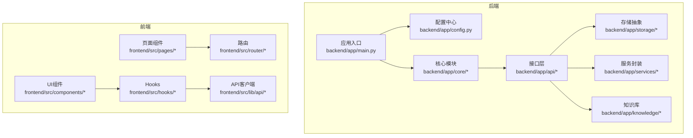
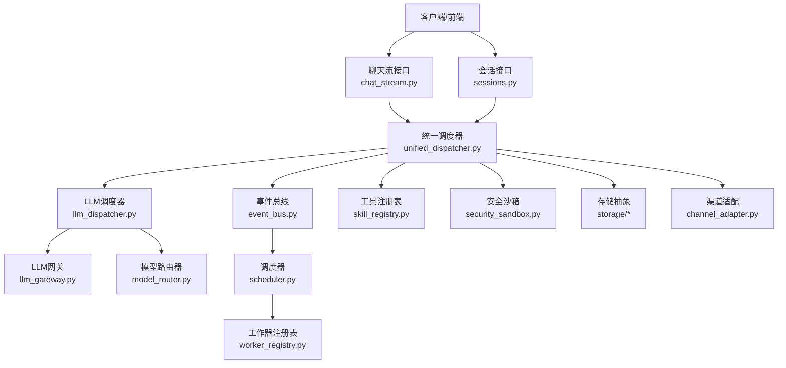
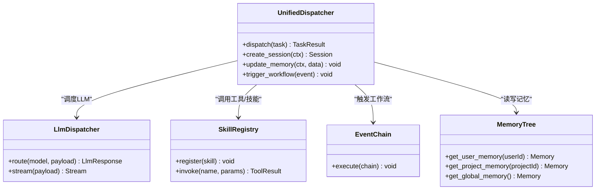
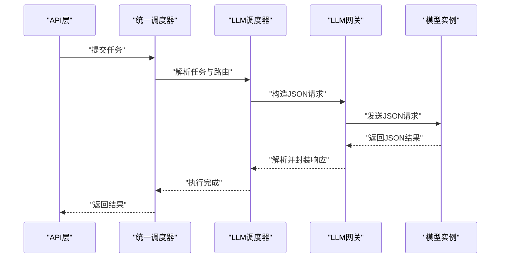
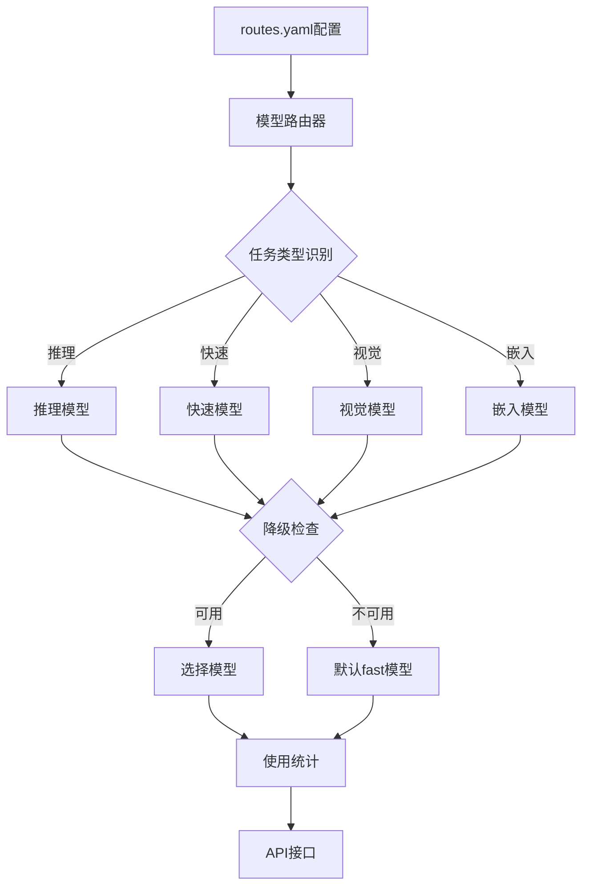
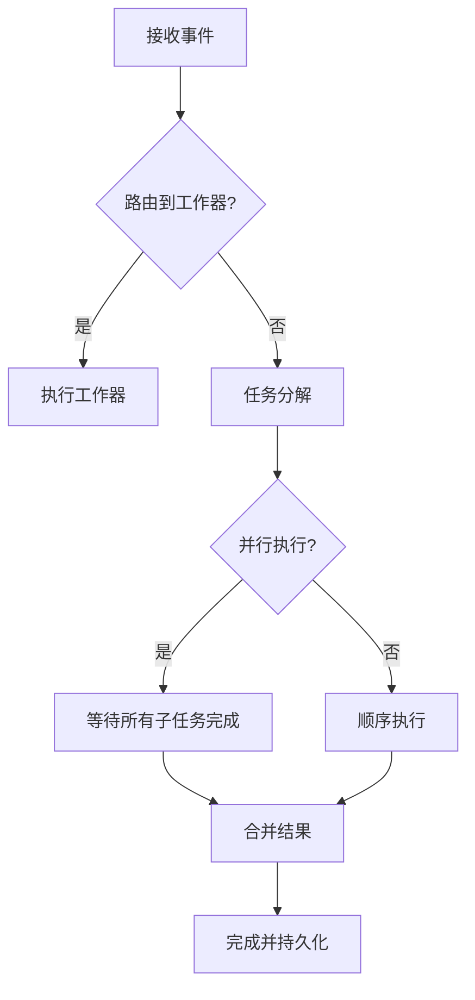
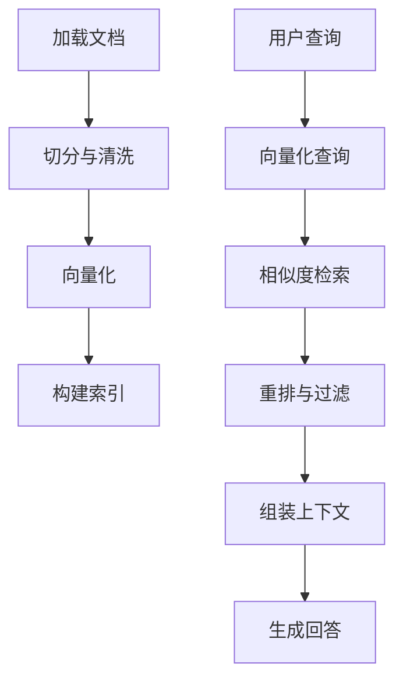
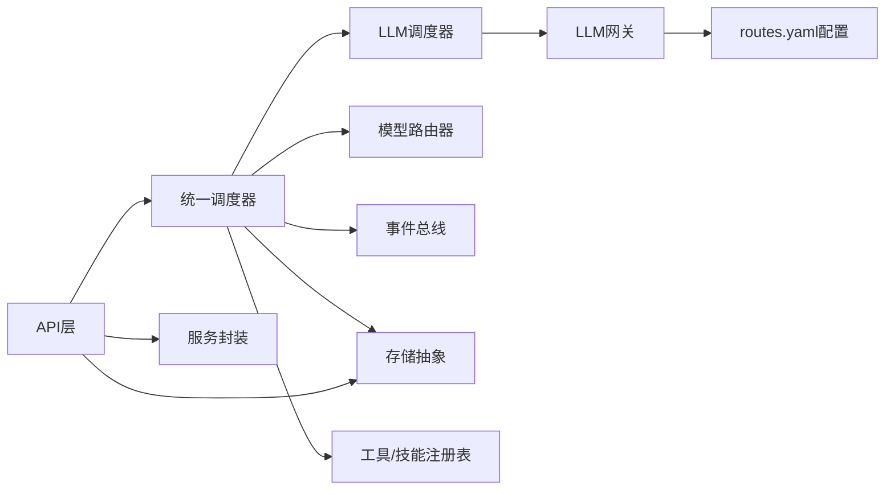

# LLM调度系统

<cite>
**本文档引用的文件**
- [backend/app/main.py](file://backend/app/main.py)
- [backend/app/config.py](file://backend/app/config.py)
- [backend/app/core/llm_dispatcher.py](file://backend/app/core/llm_dispatcher.py)
- [backend/app/core/llm_gateway.py](file://backend/app/core/llm_gateway.py)
- [backend/app/core/unified_dispatcher.py](file://backend/app/core/unified_dispatcher.py)
- [backend/app/core/model_router.py](file://backend/app/core/model_router.py)
- [backend/app/api/model_config.py](file://backend/app/api/model_config.py)
- [backend/app/models/schemas.py](file://backend/app/models/schemas.py)
- [backend/data/models/routes.yaml](file://backend/data/models/routes.yaml)
- [backend/app/api/chat_stream.py](file://backend/app/api/chat_stream.py)
- [backend/app/api/sessions.py](file://backend/app/api/sessions.py)
- [backend/app/storage/session_store.py](file://backend/app/storage/session_store.py)
- [backend/app/core/token_juice.py](file://backend/app/core/token_juice.py)
- [backend/app/core/event_bus.py](file://backend/app/core/event_bus.py)
- [backend/app/core/scheduler.py](file://backend/app/core/scheduler.py)
- [backend/app/api/scheduler_config.py](file://backend/app/api/scheduler_config.py)
- [backend/app/core/worker_registry.py](file://backend/app/core/worker_registry.py)
- [backend/app/core/task_decomposer.py](file://backend/app/core/task_decomposer.py)
- [backend/app/core/skill_registry.py](file://backend/app/core/skill_registry.py)
- [backend/app/api/tools.py](file://backend/app/api/tools.py)
- [backend/app/services/astra_tools.py](file://backend/app/services/astra_tools.py)
- [backend/app/knowledge/store.py](file://backend/app/knowledge/store.py)
- [backend/app/knowledge/loader.py](file://backend/app/knowledge/loader.py)
- [backend/app/api/knowledge.py](file://backend/app/api/knowledge.py)
- [backend/app/api/risk.py](file://backend/app/api/risk.py)
- [backend/app/core/risk_intel_engine.py](file://backend/app/core/risk_intel_engine.py)
- [backend/app/core/risk_alert.py](file://backend/app/core/risk_alert.py)
- [backend/app/api/news_monitor.py](file://backend/app/api/news_monitor.py)
- [backend/app/core/proactive_engine.py](file://backend/app/core/proactive_engine.py)
- [backend/app/api/products.py](file://backend/app/api/products.py)
- [backend/app/api/orders.py](file://backend/app/api/orders.py)
- [backend/app/api/suppliers.py](file://backend/app/api/suppliers.py)
- [backend/app/api/customs.py](file://backend/app/api/customs.py)
- [backend/app/api/logistics.py](file://backend/app/api/logistics.py)
- [backend/app/api/payment_channels.py](file://backend/app/api/payment_channels.py)
- [backend/app/api/shopify.py](file://backend/app/api/shopify.py)
- [backend/app/api/integrations.py](file://backend/app/api/integrations.py)
- [backend/app/api/auth.py](file://backend/app/api/auth.py)
- [backend/app/api/users.py](file://backend/app/api/users.py)
- [backend/app/core/oauth_manager.py](file://backend/app/core/oauth_manager.py)
- [backend/app/core/notification_engine.py](file://backend/app/core/notification_engine.py)
- [backend/app/api/notifications.py](file://backend/app/api/notifications.py)
- [backend/app/core/security_sandbox.py](file://backend/app/core/security_sandbox.py)
- [backend/app/api/code_security.py](file://backend/app/api/code_security.py)
- [backend/app/core/lifecycle_analyzer.py](file://backend/app/core/lifecycle_analyzer.py)
- [backend/app/api/events.py](file://backend/app/api/events.py)
- [backend/app/core/event_chain.py](file://backend/app/core/event_chain.py)
- [backend/app/api/event_config.py](file://backend/app/api/event_config.py)
- [backend/app/api/admin_approvals.py](file://backend/app/api/admin_approvals.py)
- [backend/app/api/admin_config.py](file://backend/app/api/admin_config.py)
- [backend/app/api/admin_rbac.py](file://backend/app/api/admin_rbac.py)
- [backend/app/api/admin_reports.py](file://backend/app/api/admin_reports.py)
- [backend/app/api/metrics.py](file://backend/app/api/metrics.py)
- [backend/app/core/metrics.py](file://backend/app/core/metrics.py)
- [backend/app/api/model_config.py](file://backend/app/api/model_config.py)
- [backend/app/core/auto_pull_engine.py](file://backend/app/core/auto_pull_engine.py)
- [backend/app/api/pipeline.py](file://backend/app/api/pipeline.py)
- [backend/app/api/plugins.py](file://backend/app/api/plugins.py)
- [backend/app/core/plugin_manager.py](file://backend/app/core/plugin_manager.py)
- [backend/app/api/skills.py](file://backend/app/api/skills.py)
- [backend/app/core/manager_agent.py](file://backend/app/core/manager_agent.py)
- [backend/app/core/qa_agent.py](file://backend/app/core/qa_agent.py)
- [backend/app/core/qa_tools.py](file://backend/app/core/qa_tools.py)
- [backend/app/api/rag.py](file://backend/app/api/rag.py)
- [backend/app/core/memory_tree.py](file://backend/app/core/memory_tree.py)
- [backend/app/storage/user_memory.py](file://backend/app/storage/user_memory.py)
- [backend/app/storage/project_memory.py](file://backend/app/storage/project_memory.py)
- [backend/app/storage/session_memory.py](file://backend/app/storage/session_memory.py)
- [backend/app/api/sync.py](file://backend/app/api/sync.py)
- [backend/app/core/local_store.py](file://backend/app/core/local_store.py)
- [backend/app/api/sdk_sessions.py](file://backend/app/api/sdk_sessions.py)
- [backend/app/api/cli.py](file://backend/app/api/cli.py)
- [backend/app/api/channels.py](file://backend/app/api/channels.py)
- [backend/app/core/channel_adapter.py](file://backend/app/core/channel_adapter.py)
- [backend/app/api/oauth.py](file://backend/app/api/oauth.py)
- [backend/app/core/feishu_client.py](file://backend/app/core/feishu_client.py)
- [backend/app/core/event_listeners/base.py](file://backend/app/core/event_listeners/base.py)
- [backend/app/core/event_listeners/feishu_listener.py](file://backend/app/core/event_listeners/feishu_listener.py)
- [backend/app/core/event_listeners/shopify_listener.py](file://backend/app/core/event_listeners/shopify_listener.py)
- [backend/app/api/feishu.py](file://backend/app/api/feishu.py)
- [backend/app/api/contracts.py](file://backend/app/api/contracts.py)
- [backend/app/storage/contract_store.py](file://backend/app/storage/contract_store.py)
- [backend/app/api/supplier_store.py](file://backend/app/api/supplier_store.py)
- [backend/app/storage/supplier_store.py](file://backend/app/storage/supplier_store.py)
- [backend/app/api/order_store.py](file://backend/app/api/order_store.py)
- [backend/app/storage/order_store.py](file://backend/app/storage/order_store.py)
- [backend/app/api/payment_store.py](file://backend/app/api/payment_store.py)
- [backend/app/storage/payment_store.py](file://backend/app/storage/payment_store.py)
- [backend/app/api/logistics_store.py](file://backend/app/api/logistics_store.py)
- [backend/app/storage/logistics_store.py](file://backend/app/storage/logistics_store.py)
- [backend/app/api/customs_store.py](file://backend/app/api/customs_store.py)
- [backend/app/storage/customs_store.py](file://backend/app/storage/customs_store.py)
- [backend/app/api/knowledge_doc_store.py](file://backend/app/api/knowledge_doc_store.py)
- [backend/app/storage/knowledge_doc_store.py](file://backend/app/storage/knowledge_doc_store.py)
- [backend/app/api/news_store.py](file://backend/app/api/news_store.py)
- [backend/app/storage/news_store.py](file://backend/app/storage/news_store.py)
- [backend/app/api/risk_intel_store.py](file://backend/app/api/risk_intel_store.py)
- [backend/app/storage/risk_intel_store.py](file://backend/app/storage/risk_intel_store.py)
- [backend/app/api/notify_config_store.py](file://backend/app/api/notify_config_store.py)
- [backend/app/storage/notify_config_store.py](file://backend/app/storage/notify_config_store.py)
- [backend/app/api/user_store.py](file://backend/app/api/user_store.py)
- [backend/app/storage/user_store.py](file://backend/app/storage/user_store.py)
- [backend/app/api/event_store.py](file://backend/app/api/event_store.py)
- [backend/app/storage/event_store.py](file://backend/app/storage/event_store.py)
- [backend/app/api/raw_store.py](file://backend/app/api/raw_store.py)
- [backend/app/storage/raw_store.py](file://backend/app/storage/raw_store.py)
- [backend/app/api/agent_config.py](file://backend/app/api/agent_config.py)
- [backend/app/core/agent_initializer.py](file://backend/app/core/agent_initializer.py)
- [backend/app/api/agent_crud.py](file://backend/app/api/agent_crud.py)
- [backend/app/api/agent_extensions.py](file://backend/app/api/agent_extensions.py)
- [backend/app/api/agent_tasks.py](file://backend/app/api/agent_tasks.py)
- [backend/app/data/agents/worker.md](file://backend/app/data/agents/worker.md)
- [backend/app/data/agents/extensions.json](file://backend/app/data/agents/extensions.json)
- [backend/app/api/worker_config.py](file://backend/app/api/worker_config.py)
- [backend/app/core/product_storage.py](file://backend/app/core/product_storage.py)
- [backend/app/api/products.py](file://backend/app/api/products.py)
- [backend/app/storage/product_storage.py](file://backend/app/storage/product_storage.py)
- [backend/app/api/shopify.py](file://backend/app/api/shopify.py)
- [backend/app/storage/shopify.py](file://backend/app/storage/shopify.py)
- [backend/app/api/shopify_api.py](file://backend/app/api/shopify_api.py)
- [backend/app/services/shopify_api.py](file://backend/app/services/shopify_api.py)
- [backend/app/api/shopify_listener.py](file://backend/app/api/shopify_listener.py)
- [backend/app/services/shopify_listener.py](file://backend/app/services/shopify_listener.py)
- [backend/app/api/shopify_webhook.py](file://backend/app/api/shopify_webhook.py)
- [backend/app/api/shopify_oauth.py](file://backend/app/api/shopify_oauth.py)
- [backend/app/api/shopify_oauth_helper.py](file://backend/app/api/shopify_oauth_helper.py)
- [backend/app/api/shopify_oauth_flow.py](file://backend/app/api/shopify_oauth_flow.py)
- [backend/app/api/shopify_oauth_callback.py](file://backend/app/api/shopify_oauth_callback.py)
- [backend/app/api/shopify_oauth_disconnect.py](file://backend/app/api/shopify_oauth_disconnect.py)
- [backend/app/api/shopify_oauth_reconnect.py](file://backend/app/api/shopify_oauth_reconnect.py)
- [backend/app/api/shopify_oauth_status.py](file://backend/app/api/shopify_oauth_status.py)
- [backend/app/api/shopify_oauth_error.py](file://backend/app/api/shopify_oauth_error.py)
- [backend/app/api/shopify_oauth_success.py](file://backend/app/api/shopify_oauth_success.py)
- [backend/app/api/shopify_oauth_pending.py](file://backend/app/api/shopify_oauth_pending.py)
- [backend/app/api/shopify_oauth_expired.py](file://backend/app/api/shopify_oauth_expired.py)
- [backend/app/api/shopify_oauth_cancelled.py](file://backend/app/api/shopify_oauth_cancelled.py)
- [backend/app/api/shopify_oauth_failed.py](file://backend/app/api/shopify_oauth_failed.py)
- [backend/app/api/shopify_oauth_retry.py](file://backend/app/api/shopify_oauth_retry.py)
- [backend/app/api/shopify_oauth_timeout.py](file://backend/app/api/shopify_oauth_timeout.py)
- [backend/app/api/shopify_oauth_network_error.py](file://backend/app/api/shopify_oauth_network_error.py)
- [backend/app/api/shopify_oauth_server_error.py](file://backend/app/api/shopify_oauth_server_error.py)
- [backend/app/api/shopify_oauth_validation_error.py](file://backend/app/api/shopify_oauth_validation_error.py)
- [backend/app/api/shopify_oauth_internal_error.py](file://backend/app/api/shopify_oauth_internal_error.py)
- [backend/app/api/shopify_oauth_unknown_error.py](file://backend/app/api/shopify_oauth_unknown_error.py)
- [backend/app/api/shopify_oauth_business_error.py](file://backend/app/api/shopify_oauth_business_error.py)
- [backend/app/api/shopify_oauth_technical_error.py](file://backend/app/api/shopify_oauth_technical_error.py)
- [backend/app/api/shopify_oauth_rate_limit_error.py](file://backend/app/api/shopify_oauth_rate_limit_error.py)
- [backend/app/api/shopify_oauth_auth_error.py](file://backend/app/api/shopify_oauth_auth_error.py)
- [backend/app/api/shopify_oauth_permission_error.py](file://backend/app/api/shopify_oauth_permission_error.py)
- [backend/app/api/shopify_oauth_access_denied_error.py](file://backend/app/api/shopify_oauth_access_denied_error.py)
- [backend/app/api/shopify_oauth_token_expired_error.py](file://backend/app/api/shopify_oauth_token_expired_error.py)
- [backend/app/api/shopify_oauth_token_revoked_error.py](file://backend/app/api/shopify_oauth_token_revoked_error.py)
- [backend/app/api/shopify_oauth_token_invalid_error.py](file://backend/app/api/shopify_oauth_token_invalid_error.py)
- [backend/app/api/shopify_oauth_token_missing_error.py](file://backend/app/api/shopify_oauth_token_missing_error.py)
- [backend/app/api/shopify_oauth_token_error.py](file://backend/app/api/shopify_oauth_token_error.py)
- [backend/app/api/shopify_oauth_connection_error.py](file://backend/app/api/shopify_oauth_connection_error.py)
- [backend/app/api/shopify_oauth_timeout_error.py](file://backend/app/api/shopify_oauth_timeout_error.py)
- [backend/app/api/shopify_oauth_ssl_error.py](file://backend/app/api/shopify_oauth_ssl_error.py)
- [backend/app/api/shopify_oauth_dns_error.py](file://backend/app/api/shopify_oauth_dns_error.py)
- [backend/app/api/shopify_oauth_proxy_error.py](file://backend/app/api/shopify_oauth_proxy_error.py)
- [backend/app/api/shopify_oauth_network_timeout_error.py](file://backend/app/api/shopify_oauth_network_timeout_error.py)
- [backend/app/api/shopify_oauth_network_connection_error.py](file://backend/app/api/shopify_oauth_network_connection_error.py)
- [backend/app/api/shopify_oauth_network_authentication_error.py](file://backend/app/api/shopify_oauth_network_authentication_error.py)
- [backend/app/api/shopify_oauth_network_authorization_error.py](file://backend/app/api/shopify_oauth_network_authorization_error.py)
- [backend/app/api/shopify_oauth_network_protocol_error.py](file://backend/app/api/shopify_oauth_network_protocol_error.py)
- [backend/app/api/shopify_oauth_network_security_error.py](file://backend/app/api/shopify_oauth_network_security_error.py)
- [backend/app/api/shopify_oauth_network_unavailable_error.py](file://backend/app/api/shopify_oauth_network_unavailable_error.py)
- [backend/app/api/shopify_oauth_network_service_error.py](file://backend/app/api/shopify_oauth_network_service_error.py)
- [backend/app/api/shopify_oauth_network_gateway_error.py](file://backend/app/api/shopify_oauth_network_gateway_error.py)
- [backend/app/api/shopify_oauth_network_bad_request_error.py](file://backend/app/api/shopify_oauth_network_bad_request_error.py)
- [backend/app/api/shopify_oauth_network_not_found_error.py](file://backend/app/api/shopify_oauth_network_not_found_error.py)
- [backend/app/api/shopify_oauth_network_method_not_allowed_error.py](file://backend/app/api/shopify_oauth_network_method_not_allowed_error.py)
- [backend/app/api/shopify_oauth_network_request_timeout_error.py](file://backend/app/api/shopify_oauth_network_request_timeout_error.py)
- [backend/app/api/shopify_oauth_network_conflict_error.py](file://backend/app/api/shopify_oauth_network_conflict_error.py)
- [backend/app/api/shopify_oauth_network_internal_server_error.py](file://backend/app/api/shopify_oauth_network_internal_server_error.py)
- [backend/app/api/shopify_oauth_network_bad_gateway_error.py](file://backend/app/api/shopify_oauth_network_bad_gateway_error.py)
- [backend/app/api/shopify_oauth_network_service_unavailable_error.py](file://backend/app/api/shopify_oauth_network_service_unavailable_error.py)
- [backend/app/api/shopify_oauth_network_gateway_timeout_error.py](file://backend/app/api/shopify_oauth_network_gateway_timeout_error.py)
- [backend/app/api/shopify_oauth_network_version_not_supported_error.py](file://backend/app/api/shopify_oauth_network_version_not_supported_error.py)
- [backend/app/api/shopify_oauth_network_insufficient_storage_error.py](file://backend/app/api/shopify_oauth_network_insufficient_storage_error.py)
- [backend/app/api/shopify_oauth_network_loop_detected_error.py](file://backend/app/api/shopify_oauth_network_loop_detected_error.py)
- [backend/app/api/shopify_oauth_network_bandwidth_limit_exceeded_error.py](file://backend/app/api/shopify_oauth_network_bandwidth_limit_exceeded_error.py)
- [backend/app/api/shopify_oauth_network_load_shedding_error.py](file://backend/app/api/shopify_oauth_network_load_shedding_error.py)
- [backend/app/api/shopify_oauth_network_too_many_requests_error.py](file://backend/app/api/shopify_oauth_network_too_many_requests_error.py)
- [backend/app/api/shopify_oauth_network_request_entity_too_large_error.py](file://backend/app/api/shopify_oauth_network_request_entity_too_large_error.py)
- [backend/app/api/shopify_oauth_network_request_uri_too_long_error.py](file://backend/app/api/shopify_oauth_network_request_uri_too_long_error.py)
- [backend/app/api/shopify_oauth_network_unsupported_media_type_error.py](file://backend/app/api/shopify_oauth_network_unsupported_media_type_error.py)
- [backend/app/api/shopify_oauth_network_range_not_satisfiable_error.py](file://backend/app/api/shopify_oauth_network_range_not_satisfiable_error.py)
- [backend/app/api/shopify_oauth_network_expectation_failed_error.py](file://backend/app/api/shopify_oauth_network_expectation_failed_error.py)
- [backend/app/api/shopify_oauth_network_im_a_teapot_error.py](file://backend/app/api/shopify_oauth_network_im_a_teapot_error.py)
- [backend/app/api/shopify_oauth_network_misdirected_request_error.py](file://backend/app/api/shopify_oauth_network_misdirected_request_error.py)
- [backend/app/api/shopify_oauth_network_unprocessable_entity_error.py](file://backend/app/api/shopify_oauth_network_unprocessable_entity_error.py)
- [backend/app/api/shopify_oauth_network_locked_error.py](file://backend/app/api/shopify_oauth_network_locked_error.py)
- [backend/app/api/shopify_oauth_network_failed_dependency_error.py](file://backend/app/api/shopify_oauth_network_failed_dependency_error.py)
- [backend/app/api/shopify_oauth_network_too_early_error.py](file://backend/app/api/shopify_oauth_network_too_early_error.py)
- [backend/app/api/shopify_oauth_network_upgrade_required_error.py](file://backend/app/api/shopify_oauth_network_upgrade_required_error.py)
- [backend/app/api/shopify_oauth_network_precondition_required_error.py](file://backend/app/api/shopify_oauth_network_precondition_required_error.py)
- [backend/app/api/shopify_oauth_network_payload_too_large_error.py](file://backend/app/api/shopify_oauth_network_payload_too_large_error.py)
- [backend/app/api/shopify_oauth_network_uri_too_long_error.py](file://backend/app/api/shopify_oauth_network_uri_too_long_error.py)
- [backend/app/api/shopify_oauth_network_unsupported_media_type_error.py](file://backend/app/api/shopify_oauth_network_unsupported_media_type_error.py)
- [backend/app/api/shopify_oauth_network_range_not_satisfiable_error.py](file://backend/app/api/shopify_oauth_network_range_not_satisfiable_error.py)
- [backend/app/api/shopify_oauth_network_expectation_failed_error.py](file://backend/app/api/shopify_oauth_network_expectation_failed_error.py)
- [backend/app/api/shopify_oauth_network_im_a_teapot_error.py](file://backend/app/api/shopify_oauth_network_im_a_teapot_error.py)
- [backend/app/api/shopify_oauth_network_misdirected_request_error.py](file://backend/app/api/shopify_oauth_network_misdirected_request_error.py)
- [backend/app/api/shopify_oauth_network_unprocessable_entity_error.py](file://backend/app/api/shopify_oauth_network_unprocessable_entity_error.py)
- [backend/app/api/shopify_oauth_network_locked_error.py](file://backend/app/api/shopify_oauth_network_locked_error.py)
- [backend/app/api/shopify_oauth_network_failed_dependency_error.py](file://backend/app/api/shopify_oauth_network_failed_dependency_error.py)
- [backend/app/api/shopify_oauth_network_too_early_error.py](file://backend/app/api/shopify_oauth_network_too_early_error.py)
- [backend/app/api/shopify_oauth_network_upgrade_required_error.py](file://backend/app/api/shopify_oauth_network_upgrade_required_error.py)
- [backend/app/api/shopify_oauth_network_precondition_required_error.py](file://backend/app/api/shopify_oauth_network_precondition_required_error.py)
- [backend/app/api/shopify_oauth_network_payload_too_large_error.py](file://backend/app/api/shopify_oauth_network_payload_too_large_error.py)
- [backend/app/api/shopify_oauth_network_uri_too_long_error.py](file://backend/app/api/shopify_oauth_network_uri_too_long_error.py)
- [backend/app/api/shopify_oauth_network_unsupported_media_type_error.py](file://backend/app/api/shopify_oauth_network_unsupported_media_type_error.py)
- [backend/app/api/shopify_oauth_network_range_not_satisfiable_error.py](file://backend/app/api/shopify_oauth_network_range_not_satisfiable_error.py)
- [backend/app/api/shopify_oauth_network_expectation_failed_error.py](file://backend/app/api/shopify_oauth_network_expectation_failed_error.py)
- [backend/app/api/shopify_oauth_network_im_a_teapot_error.py](file://backend/app/api/shopify_oauth_network_im_a_teapot_error.py)
- [backend/app/api/shopify_oauth_network_misdirected_request_error.py](file://backend/app/api/shopify_oauth_network_misdirected_request_error.py)
- [backend/app/api/shopify_oauth_network_unprocessable_entity_error.py](file://backend/app/api/shopify_oauth_network_unprocessable_entity_error.py)
- [backend/app/api/shopify_oauth_network_locked_error.py](file://backend/app/api/shopify_oauth_network_locked_error.py)
- [backend/app/api/shopify_oauth_network_failed_dependency_error.py](file://backend/app/api/shopify_oauth_network_failed_dependency_error.py)
- [backend/app/api/shopify_oauth_network_too_early_error.py](file://backend/app/api/shopify_oauth_network_too_early_error.py)
- [backend/app/api/shopify_oauth_network_upgrade_required_error.py](file://backend/app/api/shopify_oauth_network_upgrade_required_error.py)
- [backend/app/api/shopify_oauth_network_precondition_required_error.py](file://backend/app/api/shopify_oauth_network_precondition_required_error.py)
- [backend/app/api/shopify_oauth_network_payload_too_large_error.py](file://backend/app/api/shopify_oauth_network_payload_too_large_error.py)
- [backend/app/api/shopify_oauth_network_uri_too_long_error.py](file://backend/app/api/shopify_oauth_network_uri_too_long_error.py)
- [backend/app/api/shopify_oauth_network_unsupported_media_type_error.py](file://backend/app/api/shopify_oauth_network_unsupported_media_type_error.py)
- [backend/app/api/shopify_oauth_network_range_not_satisfiable_error.py](file://backend/app/api/shopify_oauth_network_range_not_satisfiable_error.py)
- [backend/app/api/shopify_oauth_network_expectation_failed_error.py](file://backend/app/api/shopify_oauth_network_expectation_failed_error.py)
- [backend/app/api/shopify_oauth_network_im_a_teapot_error.py](file://backend/app/api/shopify_oauth_network_im_a_teapot_error.py)
- [backend/app/api/shopify_oauth_network_misdirected_request_error.py](file://backend/app/api/shopify_oauth_network_misdirected_request_error.py)
- [backend/app/api/shopify_oauth_network_unprocessable_entity_error.py](file://backend/app/api/shopify_oauth_network_unprocessable_entity_error.py)
- [backend/app/api/shopify_oauth_network_locked_error.py](file://backend/app/api/shopify_oauth_network_locked_error.py)
- [backend/app/api/shopify_oauth_network_failed_dependency_error.py](file://backend/app/api/shopify_oauth_network_failed_dependency_error.py)
- [backend/app/api/shopify_oauth_network_too_early_error.py](file://backend/app/api/shopify_oauth_network_too_early_error.py)
- [backend/app/api/shopify_oauth_network_upgrade_required_error.py](file://backend/app/api/shopify_oauth_network_upgrade_required_error.py)
- [backend/app/api/shopify_oauth_network_precondition_required_error.py](file://backend/app/api/shopify_oauth_network_precondition_required_error.py)
- [backend/app/api/shopify_oauth_network_payload_too_large_error.py](file://backend/app/api/shopify_oauth_network_payload_too_large_error.py)
- [backend/app/api/shopify_oauth_network_uri_too_long_error.py](file://backend/app/api/shopify_oauth_network_uri_too_long_error.py)
- [backend/app/api/shopify_oauth_network_unsupported_media_type_error.py](file://backend/app/api/shopify_oauth_network_unsupported_media_type_error.py)
- [backend/app/api/shopify_oauth_network_range_not_satisfiable_error.py](file://backend/app/api/shopify_oauth_network_range_not_satisfiable_error.py)
- [backend/app/api/shopify_oauth_network_expectation_failed_error.py](file://backend/app/api/shopify_oauth_network_expectation_failed_error.py)
- [backend/app/api/shopify_oauth_network_im_a_teapot_error.py](file://backend/app/api/shopify_oauth_network_im_a_teapot_error.py)
- [backend/app/api/shopify_oauth_network_misdirected_request_error.py](file://backend/app/api/shopify_oauth_network_misdirected_request_error.py)
- [backend/app/api/shopify_oauth_network_unprocessable_entity_error.py](file://backend/app/api/shopify_oauth_network_unprocessable_entity_error.py)
- [backend/app/api/shopify_oauth_network_locked_error.py](file://backend/app/api/shopify_oauth_network_locked_error.py)
- [backend/app/api/shopify_oauth_network_failed_dependency_error.py](file://backend/app/api/shopify_oauth_network_failed_dependency_error.py)
- [backend/app/api/shopify_oauth_network_too_early_error.py](file://backend/app/api/shopify_oauth_network_too_early_error.py)
- [backend/app/api/shopify_oauth_network_upgrade_required_error.py](file://backend/app/api/shopify_oauth_network_upgrade_required_error.py)
- [backend/app/api/shopify_oauth_network_precondition_required_error.py](file://backend/app/api/shopify_oauth_network_precondition_required_error.py)
- [backend/app/api/shopify_oauth_network_payload_too_large_error.py](file://backend/app/api/shopify_oauth_network_payload_too_large_error.py)
- [backend/app/api/shopify_oauth_network_uri_too_long_error.py](file://backend/app/api/shopify_oauth_network_uri_too_long_error.py)
- [backend/app/api/shopify_oauth_network_unsupported_media_type_error.py](file://backend/app/api/shopify_oauth_network_unsupported_media_type_error.py)
- [backend/app/api/shopify_oauth_network_range_not_satisfiable_error.py](file://backend/app/api/shopify_oauth_network_range_not_satisfiable_error.py)
- [backend/app/api/shopify_oauth_network_expectation_failed_error.py](file://backend/app/api/shopify_oauth_network_expectation_failed_error.py)
- [backend/app/api/shopify_oauth_network_im_a_teapot_error.py](file://backend/app/api/shopify_oauth_network_im_a_teapot_error.py)
- [backend/app/api/shopify_oauth_network_misdirected_request_error.py](file://backend/app/api/shopify_oauth_network_misdirected_request_error.py)
- [backend/app/api/shopify_oauth_network_unprocessable_entity_error.py](file://backend/app/api/shopify_oauth_network_unprocessable_entity_error.py)
- [backend/app/api/shopify_oauth_network_locked_error.py](file://backend/app/api/shopify_oauth_network_locked_error.py)
- [backend/app/api/shopify_oauth_network_failed_dependency_error.py](file://backend/app/api/shopify_oauth_network_failed_dependency_error.py)
- [backend/app/api/shopify_oauth_network_too_early_error.py](file://backend/app/api/shopify_oauth_network_too_early_error.py)
- [backend/app/api/shopify_oauth_network_upgrade_required_error.py](file://backend/app/api/shopify_oauth_network_upgrade_required_error.py)
- [backend/app/api/shopify_oauth_network_precondition_required_error.py](file://backend/app/api/shopify_oauth_network_precondition_required_error.py)
- [backend/app/api/shopify_oauth_network_payload_too_large_error.py](file://backend/app/api/shopify_oauth_network_payload_too_large_error.py)
- [backend/app/api/shopify_oauth_network_uri_too_long_error.py](file://backend/app/api/shopify_oauth_network_uri_to......
</cite>

## 更新摘要
**所做更改**
- 新增LLM调度器智能代理路由功能详解
- 新增LLM网关统一访问支持说明
- 更新架构总览以反映新的调度能力
- 增强模型路由与配置管理章节
- 新增配置文件与API接口说明

## 目录
1. [简介](#简介)
2. [项目结构](#项目结构)
3. [核心组件](#核心组件)
4. [架构总览](#架构总览)
5. [详细组件分析](#详细组件分析)
6. [依赖关系分析](#依赖关系分析)
7. [性能考虑](#性能考虑)
8. [故障排除指南](#故障排除指南)
9. [结论](#结论)
10. [附录](#附录)

## 简介
本项目是一个基于Python和TypeScript的多智能体LLM调度系统，集成了企业级的业务流程、知识管理、风险控制与自动化工作流能力。系统通过统一的调度层协调不同模型与工具，支持多渠道接入（如Shopify、飞书）、事件驱动的工作流编排、以及丰富的业务领域应用（合规、供应链、支付、物流等）。前端采用React+Vite构建，后端提供REST API与WebSocket服务，支撑完整的业务闭环。

**更新** 新增LLM调度器智能代理路由功能和LLM网关统一访问支持，显著提升了系统的智能化调度能力和模型管理效率。

## 项目结构
系统采用前后端分离架构，后端以FastAPI为核心，模块化组织业务域；前端以React为基础，提供交互界面与数据可视化。核心目录包括：
- backend/app：后端主程序与核心模块
  - api：对外HTTP接口层
  - core：核心调度与业务引擎
  - data：静态配置与示例数据
  - models：数据库与数据模型
  - services：第三方服务封装
  - storage：持久化存储抽象
  - knowledge：知识库管理
- frontend/src：前端源码
  - components/ui：通用UI组件
  - pages：页面组件
  - hooks：自定义Hook
  - router：路由与权限守卫
  - lib/api：API客户端
- 其他：脚本、测试、文档与配置

**图表来源**
- [backend/app/main.py](file://backend/app/main.py)
- [backend/app/config.py](file://backend/app/config.py)
- [backend/app/core](file://backend/app/core)
- [backend/app/api](file://backend/app/api)
- [backend/app/storage](file://backend/app/storage)
- [backend/app/knowledge](file://backend/app/knowledge)
- [frontend/src](file://frontend/src)

**章节来源**
- [backend/app/main.py](file://backend/app/main.py)
- [backend/app/config.py](file://backend/app/config.py)

## 核心组件
- 统一调度器（Unified Dispatcher）：负责任务分发、负载均衡与执行编排，连接LLM网关与工具/技能注册表。
- **LLM调度器（LLM Dispatcher）**：新增智能代理路由功能，支持风险情报处置、生命周期推进决策和批量扫描。
- **LLM网关（LLM Gateway）**：新增统一访问支持，抽象不同模型供应商的访问方式，统一流控与错误处理。
- 模型路由器（Model Router）：根据任务类型与成本策略选择最优模型，支持配置驱动的路由管理。
- 工作流引擎（Event Chain/Scheduler）：事件驱动的任务链与定时任务编排。
- 知识库（Knowledge Store/Loader）：文档导入、向量化与检索增强。
- 风险与合规（Risk Intel Engine/Risk Alert）：风险情报聚合与预警。
- 多渠道适配（Channel Adapter/Feishu/Shopify）：统一消息与业务事件适配。
- 安全沙箱（Security Sandbox）：代码执行与工具调用的安全隔离。
- 认证与授权（Auth/OAuth/RBAC）：用户认证、第三方OAuth与权限控制。
- 存储与持久化（Local Store/Session Store/Event Store）：会话、事件与元数据持久化。

**章节来源**
- [backend/app/core/unified_dispatcher.py](file://backend/app/core/unified_dispatcher.py)
- [backend/app/core/llm_dispatcher.py](file://backend/app/core/llm_dispatcher.py)
- [backend/app/core/llm_gateway.py](file://backend/app/core/llm_gateway.py)
- [backend/app/core/model_router.py](file://backend/app/core/model_router.py)
- [backend/app/core/event_chain.py](file://backend/app/core/event_chain.py)
- [backend/app/core/scheduler.py](file://backend/app/core/scheduler.py)
- [backend/app/knowledge/store.py](file://backend/app/knowledge/store.py)
- [backend/app/knowledge/loader.py](file://backend/app/knowledge/loader.py)
- [backend/app/core/risk_intel_engine.py](file://backend/app/core/risk_intel_engine.py)
- [backend/app/core/risk_alert.py](file://backend/app/core/risk_alert.py)
- [backend/app/core/channel_adapter.py](file://backend/app/core/channel_adapter.py)
- [backend/app/core/feishu_client.py](file://backend/app/core/feishu_client.py)
- [backend/app/core/oauth_manager.py](file://backend/app/core/oauth_manager.py)
- [backend/app/core/security_sandbox.py](file://backend/app/core/security_sandbox.py)
- [backend/app/core/local_store.py](file://backend/app/core/local_store.py)
- [backend/app/storage/session_store.py](file://backend/app/storage/session_store.py)
- [backend/app/storage/event_store.py](file://backend/app/storage/event_store.py)

## 架构总览
系统采用"接口层-核心调度层-业务引擎-存储与外部集成"的分层架构。统一调度器作为中枢，向上承接API请求，向下协调模型、工具与工作流。事件总线驱动异步任务，定时器触发周期性任务，安全沙箱保障执行安全。

**更新** 新增LLM调度器和网关作为核心调度层的重要组成部分，提供智能化的代理路由和统一的模型访问能力。

**图表来源**
- [backend/app/api/chat_stream.py](file://backend/app/api/chat_stream.py)
- [backend/app/api/sessions.py](file://backend/app/api/sessions.py)
- [backend/app/core/unified_dispatcher.py](file://backend/app/core/unified_dispatcher.py)
- [backend/app/core/llm_dispatcher.py](file://backend/app/core/llm_dispatcher.py)
- [backend/app/core/llm_gateway.py](file://backend/app/core/llm_gateway.py)
- [backend/app/core/model_router.py](file://backend/app/core/model_router.py)
- [backend/app/core/event_bus.py](file://backend/app/core/event_bus.py)
- [backend/app/core/scheduler.py](file://backend/app/core/scheduler.py)
- [backend/app/core/worker_registry.py](file://backend/app/core/worker_registry.py)
- [backend/app/core/skill_registry.py](file://backend/app/core/skill_registry.py)
- [backend/app/core/security_sandbox.py](file://backend/app/core/security_sandbox.py)
- [backend/app/core/channel_adapter.py](file://backend/app/core/channel_adapter.py)
- [backend/app/storage](file://backend/app/storage)

## 详细组件分析

### 统一调度器（Unified Dispatcher）
职责
- 接收来自API层的任务请求
- 解析任务上下文与意图
- 调度LLM执行或工具/技能调用
- 管理会话状态与内存
- 触发事件链与定时任务
- 返回标准化响应

实现要点
- 任务路由：根据任务类型选择LLM或工具
- 会话管理：维护用户/项目/全局记忆树
- 执行编排：串并行组合与条件分支
- 错误恢复：重试、降级与告警

**图表来源**
- [backend/app/core/unified_dispatcher.py](file://backend/app/core/unified_dispatcher.py)
- [backend/app/core/llm_dispatcher.py](file://backend/app/core/llm_dispatcher.py)
- [backend/app/core/skill_registry.py](file://backend/app/core/skill_registry.py)
- [backend/app/core/event_chain.py](file://backend/app/core/event_chain.py)
- [backend/app/core/memory_tree.py](file://backend/app/core/memory_tree.py)

**章节来源**
- [backend/app/core/unified_dispatcher.py](file://backend/app/core/unified_dispatcher.py)
- [backend/app/core/memory_tree.py](file://backend/app/core/memory_tree.py)

### LLM调度器与网关

**更新** 新增LLM调度器智能代理路由功能和LLM网关统一访问支持。

职责
- **LLM调度器**：将任务映射到具体模型实例，实现智能代理路由
- **LLM网关**：统一错误处理与重试机制，令牌计数与成本控制
- **智能决策**：风险情报处置、生命周期推进决策、批量扫描

实现要点
- **智能路由**：基于任务类型和上下文选择最优LLM
- **JSON输出**：强制JSON格式响应，支持自动解析
- **批量处理**：支持批量风险情报处置和生命周期扫描
- **自动执行**：根据LLM决策自动执行系统操作
- **配置管理**：支持routes.yaml配置驱动的模型路由

**图表来源**
- [backend/app/api/chat_stream.py](file://backend/app/api/chat_stream.py)
- [backend/app/core/unified_dispatcher.py](file://backend/app/core/unified_dispatcher.py)
- [backend/app/core/llm_dispatcher.py](file://backend/app/core/llm_dispatcher.py)
- [backend/app/core/llm_gateway.py](file://backend/app/core/llm_gateway.py)
- [backend/app/core/token_juice.py](file://backend/app/core/token_juice.py)

**章节来源**
- [backend/app/core/llm_dispatcher.py](file://backend/app/core/llm_dispatcher.py)
- [backend/app/core/llm_gateway.py](file://backend/app/core/llm_gateway.py)
- [backend/app/core/token_juice.py](file://backend/app/core/token_juice.py)

### 模型路由与配置管理

**更新** 增强模型路由功能，支持配置驱动的路由管理和API接口。

职责
- **任务分类**：推理/快速/视觉/嵌入任务类型识别
- **模型选择**：根据任务类型和成本策略选择最优模型
- **负载均衡**：在同类模型间分发请求
- **降级策略**：主模型不可用时自动降级
- **配置管理**：routes.yaml配置驱动的路由管理

实现要点
- **配置驱动**：从data/models/routes.yaml读取路由配置
- **API管理**：提供REST API管理模型路由配置
- **动态更新**：支持运行时更新模型路由配置
- **使用统计**：跟踪Token使用量和模型使用情况

**图表来源**
- [backend/app/core/model_router.py](file://backend/app/core/model_router.py)
- [backend/app/api/model_config.py](file://backend/app/api/model_config.py)
- [backend/data/models/routes.yaml](file://backend/data/models/routes.yaml)

**章节来源**
- [backend/app/core/model_router.py](file://backend/app/core/model_router.py)
- [backend/app/api/model_config.py](file://backend/app/api/model_config.py)
- [backend/data/models/routes.yaml](file://backend/data/models/routes.yaml)

### 事件驱动工作流与调度器
职责
- 基于事件总线的异步任务编排
- 支持一次性与周期性任务
- 任务分解与子任务并行执行
- 任务状态持久化与可观测性

实现要点
- 事件监听：飞书、Shopify等渠道事件
- 任务链：顺序执行、条件判断、并行聚合
- 定时任务：Cron表达式与任务绑定
- 任务分解：复杂任务拆分为原子操作

**图表来源**
- [backend/app/core/event_bus.py](file://backend/app/core/event_bus.py)
- [backend/app/core/scheduler.py](file://backend/app/core/scheduler.py)
- [backend/app/core/task_decomposer.py](file://backend/app/core/task_decomposer.py)
- [backend/app/core/worker_registry.py](file://backend/app/core/worker_registry.py)

**章节来源**
- [backend/app/core/event_chain.py](file://backend/app/core/event_chain.py)
- [backend/app/core/scheduler.py](file://backend/app/core/scheduler.py)
- [backend/app/core/task_decomposer.py](file://backend/app/core/task_decomposer.py)
- [backend/app/core/worker_registry.py](file://backend/app/core/worker_registry.py)

### 知识库与RAG
职责
- 文档导入与预处理
- 向量化与索引构建
- 查询检索与上下文增强
- 结果排序与去重

实现要点
- 多格式支持：PDF、TXT、Markdown等
- 向量嵌入：可插拔嵌入模型
- 检索策略：混合检索与重排
- RAG流水线：检索-拼接-生成

**图表来源**
- [backend/app/knowledge/loader.py](file://backend/app/knowledge/loader.py)
- [backend/app/knowledge/store.py](file://backend/app/knowledge/store.py)
- [backend/app/api/rag.py](file://backend/app/api/rag.py)

**章节来源**
- [backend/app/knowledge/loader.py](file://backend/app/knowledge/loader.py)
- [backend/app/knowledge/store.py](file://backend/app/knowledge/store.py)
- [backend/app/api/rag.py](file://backend/app/api/rag.py)

### 安全沙箱与代码安全
职责
- 限制工具与脚本执行范围
- 防止恶意代码注入
- 审计与日志记录
- 运行时隔离

实现要点
- 白名单工具调用
- 文件系统与网络访问控制
- 超时与资源限制
- 执行审计与告警

**章节来源**
- [backend/app/core/security_sandbox.py](file://backend/app/core/security_sandbox.py)
- [backend/app/api/code_security.py](file://backend/app/api/code_security.py)

### 认证、授权与OAuth
职责
- 用户认证与会话管理
- OAuth第三方登录
- RBAC权限控制
- 管理员审批与审计

实现要点
- JWT令牌与刷新
- OAuth Provider对接
- 权限矩阵与动态授权
- 审批流与审计日志

**章节来源**
- [backend/app/api/auth.py](file://backend/app/api/auth.py)
- [backend/app/api/users.py](file://backend/app/api/users.py)
- [backend/app/core/oauth_manager.py](file://backend/app/core/oauth_manager.py)
- [backend/app/api/oauth.py](file://backend/app/api/oauth.py)
- [backend/app/api/admin_approvals.py](file://backend/app/api/admin_approvals.py)
- [backend/app/api/admin_rbac.py](file://backend/app/api/admin_rbac.py)

### 多渠道适配与通知
职责
- 飞书、Shopify等渠道事件接入
- 消息适配与协议转换
- 通知引擎与推送

实现要点
- 适配器模式：统一事件格式
- 回调验证与幂等
- 通知模板与多通道推送

**章节来源**
- [backend/app/core/channel_adapter.py](file://backend/app/core/channel_adapter.py)
- [backend/app/core/feishu_client.py](file://backend/app/core/feishu_client.py)
- [backend/app/api/feishu.py](file://backend/app/api/feishu.py)
- [backend/app/api/shopify.py](file://backend/app/api/shopify.py)
- [backend/app/core/notification_engine.py](file://backend/app/core/notification_engine.py)
- [backend/app/api/notifications.py](file://backend/app/api/notifications.py)

### 业务域API概览
- 产品与订单：产品信息同步、订单生命周期管理
- 供应链与物流：库存、运输、清关
- 支付通道：多支付方式集成
- 合规与风控：规则引擎、风险情报、监管扫描
- 知识与新闻：知识导入、新闻采集与分析
- 代理与技能：代理配置、技能注册与扩展

**章节来源**
- [backend/app/api/products.py](file://backend/app/api/products.py)
- [backend/app/api/orders.py](file://backend/app/api/orders.py)
- [backend/app/api/suppliers.py](file://backend/app/api/suppliers.py)
- [backend/app/api/customs.py](file://backend/app/api/customs.py)
- [backend/app/api/logistics.py](file://backend/app/api/logistics.py)
- [backend/app/api/payment_channels.py](file://backend/app/api/payment_channels.py)
- [backend/app/api/risk.py](file://backend/app/api/risk.py)
- [backend/app/api/news_monitor.py](file://backend/app/api/news_monitor.py)
- [backend/app/api/skills.py](file://backend/app/api/skills.py)
- [backend/app/api/agent_config.py](file://backend/app/api/agent_config.py)
- [backend/app/api/agent_tasks.py](file://backend/app/api/agent_tasks.py)

## 依赖关系分析
系统通过模块化设计降低耦合，核心依赖如下：
- 统一调度器依赖LLM调度器、模型路由器、事件总线、存储与工具注册表
- **LLM调度器依赖LLM网关和存储模块**
- **LLM网关依赖配置文件和模型路由器**
- API层仅依赖统一调度器与存储抽象
- 业务域API通过统一接口访问核心能力
- 前端通过API客户端与后端交互

**更新** 新增LLM调度器和网关之间的依赖关系，以及配置文件的依赖。

**图表来源**
- [backend/app/api](file://backend/app/api)
- [backend/app/core/unified_dispatcher.py](file://backend/app/core/unified_dispatcher.py)
- [backend/app/core/llm_dispatcher.py](file://backend/app/core/llm_dispatcher.py)
- [backend/app/core/llm_gateway.py](file://backend/app/core/llm_gateway.py)
- [backend/app/core/model_router.py](file://backend/app/core/model_router.py)
- [backend/app/core/event_bus.py](file://backend/app/core/event_bus.py)
- [backend/app/storage](file://backend/app/storage)
- [backend/app/core/skill_registry.py](file://backend/app/core/skill_registry.py)
- [backend/data/models/routes.yaml](file://backend/data/models/routes.yaml)

**章节来源**
- [backend/app/api](file://backend/app/api)
- [backend/app/core](file://backend/app/core)

## 性能考虑
- 流式输出：优先使用流式接口减少延迟
- 并行执行：对独立任务进行并行化
- 缓存策略：热点数据与中间结果缓存
- 限流与熔断：防止上游过载导致雪崩
- **并发控制**：LLM网关全局并发限制6个
- **配置优化**：routes.yaml中的max_tokens和temperature调优
- **统计监控**：LLM网关统计调用次数、token消耗、成功率
- 存储优化：批量写入与索引优化
- 监控与告警：关键指标实时观测

**更新** 新增LLM网关并发控制和配置优化的性能考虑。

## 故障排除指南
常见问题与定位方法
- API无响应：检查统一调度器健康状态与下游依赖
- LLM超时：查看模型路由器配置与网关限流
- **LLM网关错误**：检查routes.yaml配置和API Key设置
- 工具执行失败：确认安全沙箱策略与工具白名单
- 事件未触发：核对事件总线订阅与工作器注册
- 存储异常：检查本地存储与持久化配置
- 认证失败：验证JWT签名与OAuth回调参数
- 知识库检索慢：优化向量化与索引策略

**更新** 新增LLM网关相关故障排除指导。

**章节来源**
- [backend/app/core/unified_dispatcher.py](file://backend/app/core/unified_dispatcher.py)
- [backend/app/core/llm_gateway.py](file://backend/app/core/llm_gateway.py)
- [backend/app/core/security_sandbox.py](file://backend/app/core/security_sandbox.py)
- [backend/app/core/event_bus.py](file://backend/app/core/event_bus.py)
- [backend/app/core/local_store.py](file://backend/app/core/local_store.py)
- [backend/app/api/auth.py](file://backend/app/api/auth.py)
- [backend/app/knowledge/store.py](file://backend/app/knowledge/store.py)

## 结论
该LLM调度系统通过统一调度器实现了模型、工具与工作流的有机整合，结合事件驱动与多渠道适配，覆盖从合规风控到供应链支付的完整业务场景。系统具备良好的扩展性与安全性，适合在复杂企业环境中部署与演进。

**更新** 新增的LLM调度器智能代理路由功能和LLM网关统一访问支持，进一步提升了系统的智能化水平和模型管理效率，为复杂的企业级应用场景提供了更强有力的技术支撑。

## 附录
- 快速启动：安装依赖后运行后端主程序，启动前端开发服务器
- 开发规范：遵循模块化与接口契约，新增功能需通过统一调度器接入
- 部署建议：容器化部署，配合反向代理与证书管理
- **配置管理**：routes.yaml配置文件的详细说明和API接口使用
- **监控告警**：LLM网关统计信息的监控和分析方法

**更新** 新增配置管理和监控告警的相关内容。