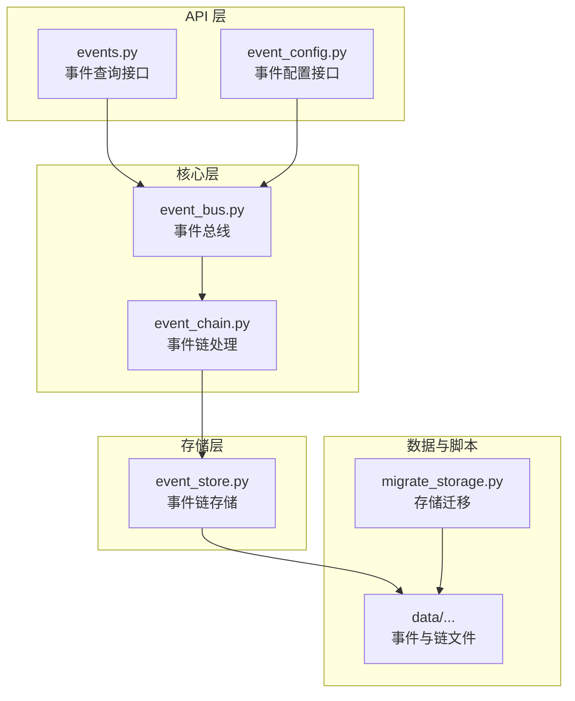
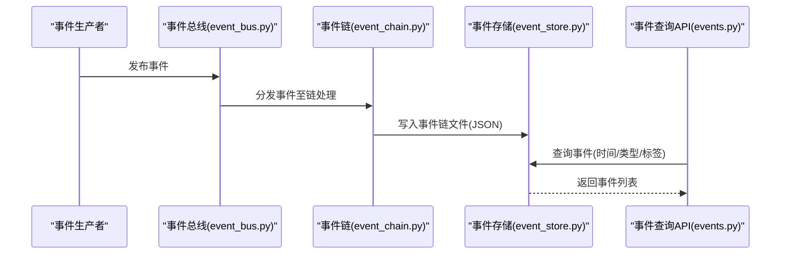
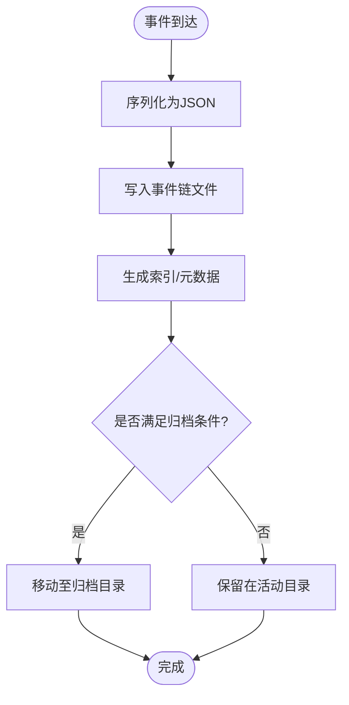
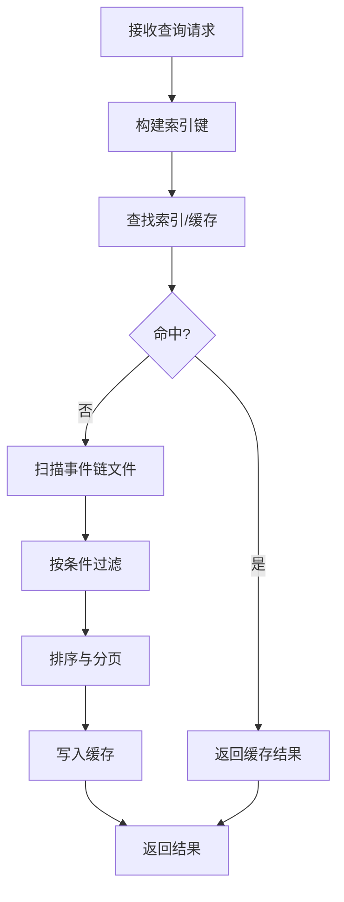
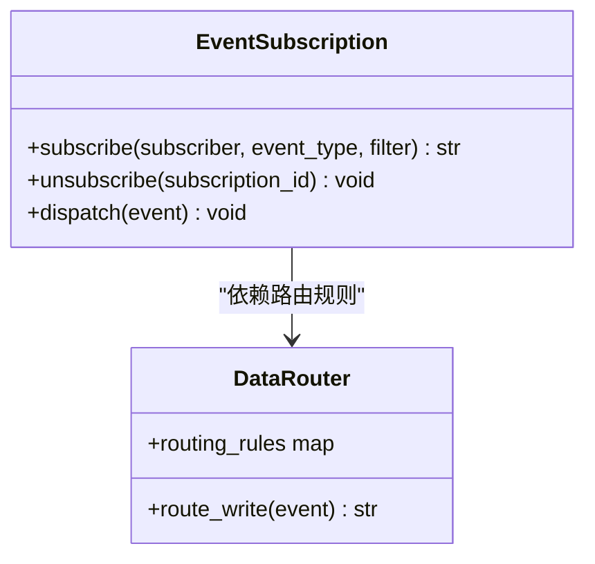
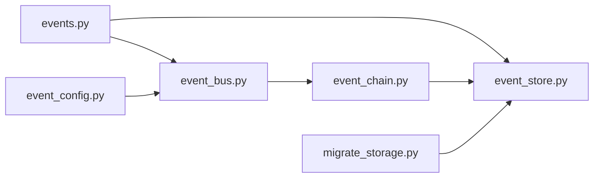

# 事件存储系统

<cite>
**本文引用的文件**   
- [event_store.py](file://backend/app/storage/event_store.py)
- [events.py](file://backend/app/api/events.py)
- [event_bus.py](file://backend/app/core/event_bus.py)
- [event_chain.py](file://backend/app/core/event_chain.py)
- [event_config.py](file://backend/app/api/event_config.py)
- [migrate_storage.py](file://backend/scripts/migrate_storage.py)
- [README.md](file://README.md)
- [后端变更路线图.md](file://后端变更路线图.md)
</cite>

## 目录
1. [简介](#简介)
2. [项目结构](#项目结构)
3. [核心组件](#核心组件)
4. [架构总览](#架构总览)
5. [详细组件分析](#详细组件分析)
6. [依赖关系分析](#依赖关系分析)
7. [性能考量](#性能考量)
8. [故障排查指南](#故障排查指南)
9. [结论](#结论)
10. [附录](#附录)

## 简介
本文件面向避风港平台的事件存储系统，系统性梳理事件存储架构设计与实现，覆盖全局事件存储、产品级事件存储与归档机制；阐明事件数据模型（EventRecord 结构、字段与类型），解释存储策略（文件系统组织、JSON 序列化与压缩）、查询优化（索引、缓存与调优）、事件检索能力（时间范围、分类与条件搜索）、配置项（容量、清理与备份）以及存储 API 使用指南与最佳实践。

## 项目结构
事件存储相关代码主要分布在以下模块：
- 存储层：backend/app/storage/event_store.py 提供事件链存储能力，支持系统事件与用户动作链事件的持久化与读取。
- API 层：backend/app/api/events.py 定义事件查询与检索接口，提供时间范围、类型与标签等筛选能力。
- 核心引擎：backend/app/core/event_bus.py 与 backend/app/core/event_chain.py 实现事件总线与事件链处理逻辑，支撑事件路由与分发。
- 配置与迁移：backend/app/api/event_config.py 提供事件配置接口；backend/scripts/migrate_storage.py 提供存储迁移脚本。
- 文档与路线图：README.md 与后端变更路线图.md 提供系统背景与演进规划。

**图表来源**
- [events.py](file://backend/app/api/events.py)
- [event_config.py](file://backend/app/api/event_config.py)
- [event_bus.py](file://backend/app/core/event_bus.py)
- [event_chain.py](file://backend/app/core/event_chain.py)
- [event_store.py](file://backend/app/storage/event_store.py)
- [migrate_storage.py](file://backend/scripts/migrate_storage.py)

**章节来源**
- [events.py](file://backend/app/api/events.py)
- [event_store.py](file://backend/app/storage/event_store.py)
- [event_bus.py](file://backend/app/core/event_bus.py)
- [event_chain.py](file://backend/app/core/event_chain.py)
- [event_config.py](file://backend/app/api/event_config.py)
- [migrate_storage.py](file://backend/scripts/migrate_storage.py)

## 核心组件
- 事件存储（EventStore）
  - 支持系统事件与用户动作链事件的写入与读取，采用 JSON 文件持久化，路径按系统/用户维度组织。
  - 提供系统事件添加方法，返回事件 ID；支持用户链事件读取与遍历。
- 事件总线（EventBus）
  - 负责事件的发布与订阅，支持多订阅者与条件过滤，是事件路由与分发的核心。
- 事件链（EventChain）
  - 处理事件在不同阶段的流转与合并，确保系统与用户事件的有序记录与回溯。
- 事件查询 API（Events API）
  - 提供基于时间范围、事件类型、标签与用户 ID 的检索能力，支持分页与排序。
- 事件配置 API（EventConfig API）
  - 提供事件类型、标签与严重度等配置的管理接口，支撑事件分类与检索策略。
- 存储迁移（Migrate Storage）
  - 提供历史数据迁移与归档策略，保障数据一致性与可维护性。

**章节来源**
- [event_store.py](file://backend/app/storage/event_store.py)
- [event_bus.py](file://backend/app/core/event_bus.py)
- [event_chain.py](file://backend/app/core/event_chain.py)
- [events.py](file://backend/app/api/events.py)
- [event_config.py](file://backend/app/api/event_config.py)
- [migrate_storage.py](file://backend/scripts/migrate_storage.py)

## 架构总览
事件从产生到持久化与检索的整体流程如下：

**图表来源**
- [event_bus.py](file://backend/app/core/event_bus.py)
- [event_chain.py](file://backend/app/core/event_chain.py)
- [event_store.py](file://backend/app/storage/event_store.py)
- [events.py](file://backend/app/api/events.py)

## 详细组件分析

### 事件数据模型与存储策略
- EventRecord 结构与字段
  - 字段概览：事件 ID、事件类型、来源、自然语言描述、严重度、载荷、标签、用户 ID、时间戳。
  - 类型约束：字符串、数值、布尔、字典与列表等，确保 JSON 可序列化。
  - 字段语义：用于唯一标识事件、分类事件、标注影响范围、关联用户与产品，并记录发生时间。
- 存储策略
  - 文件系统组织：事件链文件按“系统事件”与“用户动作链”两类目录存放，路径以链 ID 或用户 ID 命名。
  - JSON 序列化：事件对象序列化为 JSON 并落盘，便于跨语言读取与版本兼容。
  - 数据压缩：当前实现未见显式压缩逻辑，建议在大体量场景下引入 Gzip/Brotli 压缩或分块存储以降低 IO 开销。
- 归档机制
  - 迁移脚本提供归档与迁移能力，建议结合时间阈值与容量阈值制定自动归档策略（例如超过 N 天的历史事件移动至归档目录）。

**图表来源**
- [event_store.py](file://backend/app/storage/event_store.py)
- [migrate_storage.py](file://backend/scripts/migrate_storage.py)

**章节来源**
- [event_store.py](file://backend/app/storage/event_store.py)
- [migrate_storage.py](file://backend/scripts/migrate_storage.py)

### 查询优化与检索能力
- 索引设计
  - 建议在事件链目录中维护索引文件（如按时间、类型、标签建立倒排索引），避免全量扫描。
  - 索引应包含事件 ID、时间戳、类型、标签与用户 ID 的映射，支持快速定位与过滤。
- 缓存策略
  - 对高频查询（如最近 N 条事件、特定产品/用户事件）进行内存缓存，设置 TTL 与失效策略。
  - 缓存键建议采用“查询参数哈希”，避免重复计算。
- 性能调优
  - 分页与游标：对长列表查询采用游标分页，减少 OFFSET 开销。
  - 并发控制：限制并发写入与查询，避免磁盘争用。
  - I/O 批量化：批量读取与写入，减少系统调用次数。
- 检索能力
  - 时间范围查询：基于时间戳字段过滤。
  - 分类筛选：基于事件类型与标签集合过滤。
  - 条件搜索：支持按用户 ID、产品 ID、严重度等字段组合过滤。

**图表来源**
- [events.py](file://backend/app/api/events.py)
- [event_store.py](file://backend/app/storage/event_store.py)

**章节来源**
- [events.py](file://backend/app/api/events.py)
- [event_store.py](file://backend/app/storage/event_store.py)

### 事件检索 API 使用指南
- 接口职责
  - 提供事件查询、分页、排序与过滤能力，支持时间范围、事件类型、标签与用户 ID 等条件。
- 使用建议
  - 明确查询边界：优先限定时间范围与事件类型，减少扫描范围。
  - 合理分页：使用游标分页，避免深分页导致的性能问题。
  - 缓存复用：对相同查询参数的结果进行缓存，提升响应速度。
- 最佳实践
  - 对高频查询建立索引与缓存。
  - 对大字段（如 payload）采用延迟加载或分页返回。
  - 对复杂条件组合进行预计算与物化视图优化。

**章节来源**
- [events.py](file://backend/app/api/events.py)

### 事件配置与路由
- 事件配置 API
  - 提供事件类型、标签与严重度等配置的增删改查，支撑事件分类与检索策略。
- 数据路由（DataRouter）
  - 根据事件类型自动选择写入层与读取层，确保不同类型事件进入合适的存储层级。
- 订阅管理（EventSubscription）
  - 支持精准订阅、批量订阅、全局订阅与条件订阅，按订阅规则分发事件。

**图表来源**
- [后端变更路线图.md](file://后端变更路线图.md)

**章节来源**
- [event_config.py](file://backend/app/api/event_config.py)
- [后端变更路线图.md](file://后端变更路线图.md)

## 依赖关系分析
事件存储系统的关键依赖关系如下：

**图表来源**
- [events.py](file://backend/app/api/events.py)
- [event_config.py](file://backend/app/api/event_config.py)
- [event_bus.py](file://backend/app/core/event_bus.py)
- [event_chain.py](file://backend/app/core/event_chain.py)
- [event_store.py](file://backend/app/storage/event_store.py)
- [migrate_storage.py](file://backend/scripts/migrate_storage.py)

**章节来源**
- [events.py](file://backend/app/api/events.py)
- [event_config.py](file://backend/app/api/event_config.py)
- [event_bus.py](file://backend/app/core/event_bus.py)
- [event_chain.py](file://backend/app/core/event_chain.py)
- [event_store.py](file://backend/app/storage/event_store.py)
- [migrate_storage.py](file://backend/scripts/migrate_storage.py)

## 性能考量
- I/O 优化
  - 采用批量写入与异步 I/O，减少磁盘等待。
  - 对热数据与冷数据分区存储，热数据驻留内存或高速存储。
- 索引与缓存
  - 建立时间、类型、标签与用户 ID 的二级索引，配合内存缓存提升查询性能。
- 并发与限流
  - 控制写入并发度，避免写放大；对查询进行限流与排队，防止资源争用。
- 存储扩展
  - 引入分片与副本策略，支持水平扩展；定期清理过期数据，控制存储增长。

## 故障排查指南
- 常见问题
  - 事件丢失：检查事件链文件写入状态与权限，确认异常捕获与重试机制。
  - 查询缓慢：核查索引是否缺失、缓存命中率低或查询条件未命中索引。
  - 存储膨胀：评估归档策略与清理任务，检查大字段是否合理拆分。
- 排查步骤
  - 核对事件链目录结构与文件命名，确认路径拼接正确。
  - 查看 API 日志与错误码，定位查询参数与过滤条件问题。
  - 使用迁移脚本验证数据完整性与一致性。

**章节来源**
- [event_store.py](file://backend/app/storage/event_store.py)
- [events.py](file://backend/app/api/events.py)
- [migrate_storage.py](file://backend/scripts/migrate_storage.py)

## 结论
避风港平台事件存储系统通过清晰的分层架构与文件化存储，实现了事件的高效写入与检索。结合索引、缓存与路由策略，系统可在大规模场景下保持稳定性能。建议进一步完善压缩、分片与自动化归档机制，持续优化查询与写入性能，确保平台长期可维护性与可扩展性。

## 附录
- 术语
  - 事件链：由系统事件与用户动作链组成的事件序列，支持回溯与审计。
  - 路由规则：根据事件类型选择写入层与读取层的规则集。
  - 归档：将历史事件迁移至低成本存储的策略。
- 参考
  - 系统背景与路线图参见 README 与后端变更路线图。

**章节来源**
- [README.md](file://README.md)
- [后端变更路线图.md](file://后端变更路线图.md)