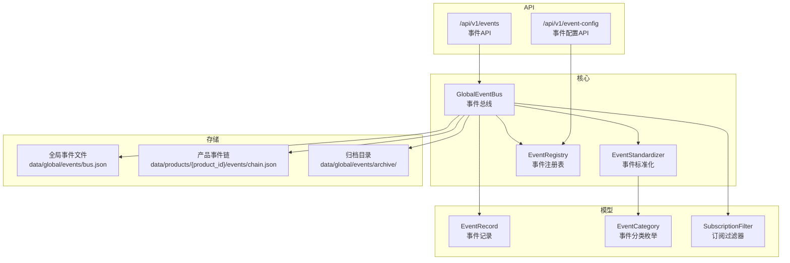
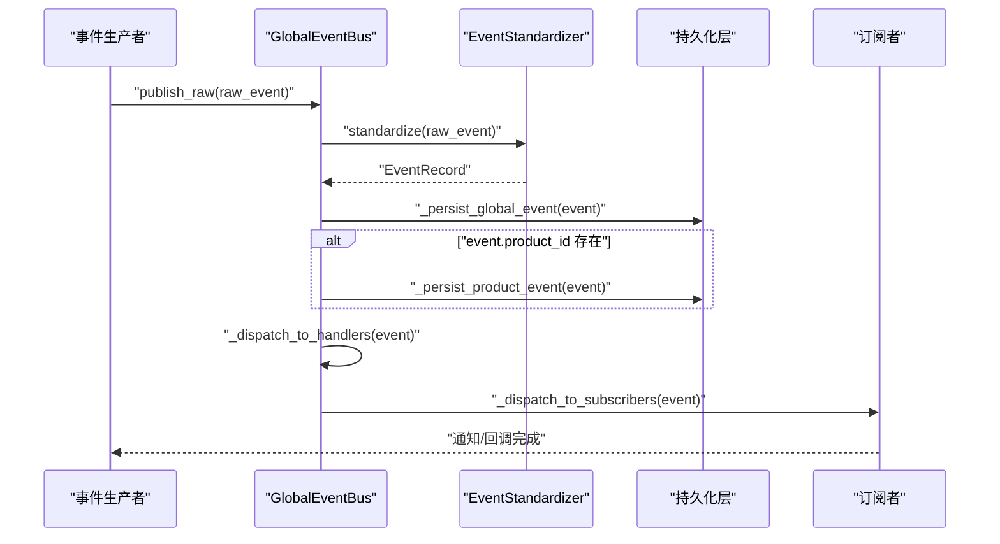
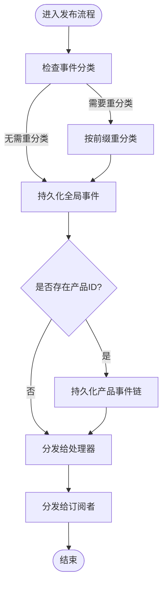
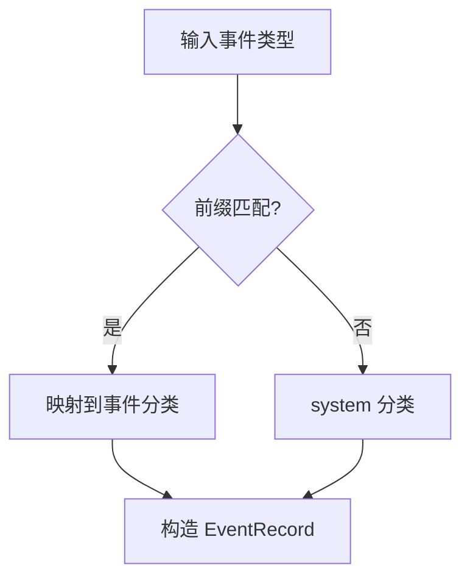
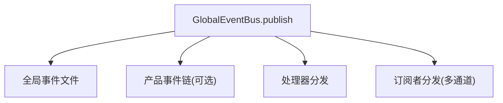
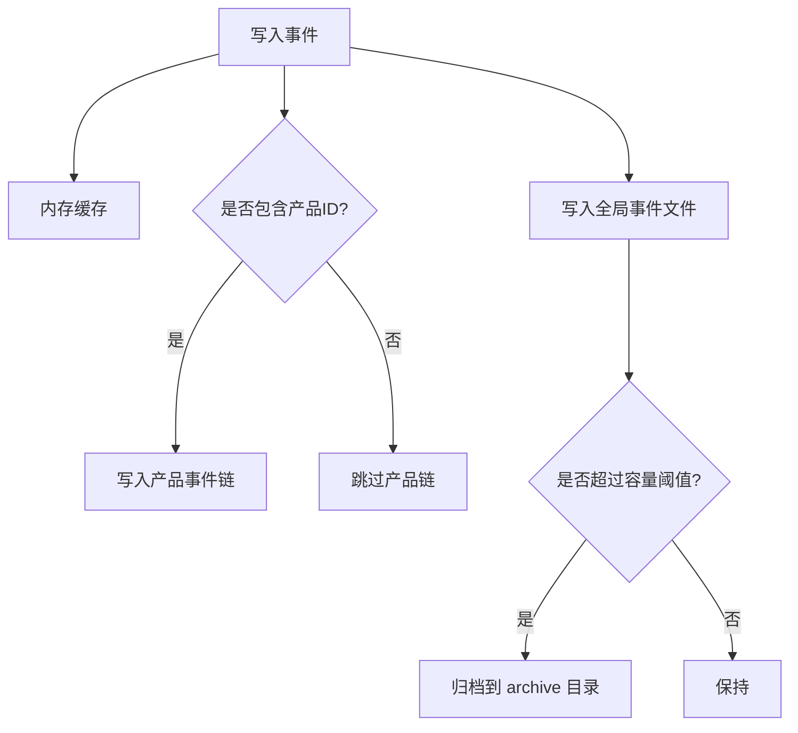
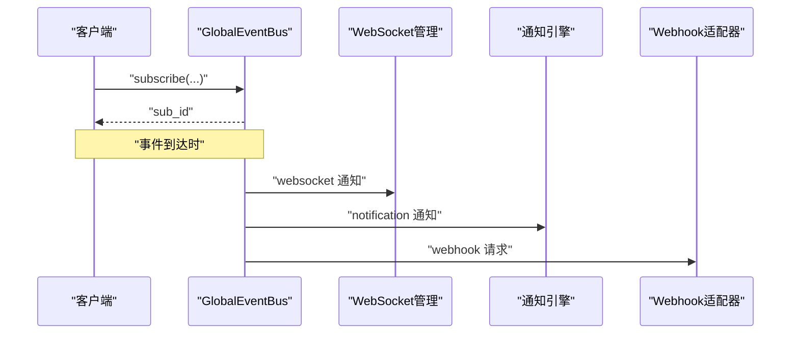
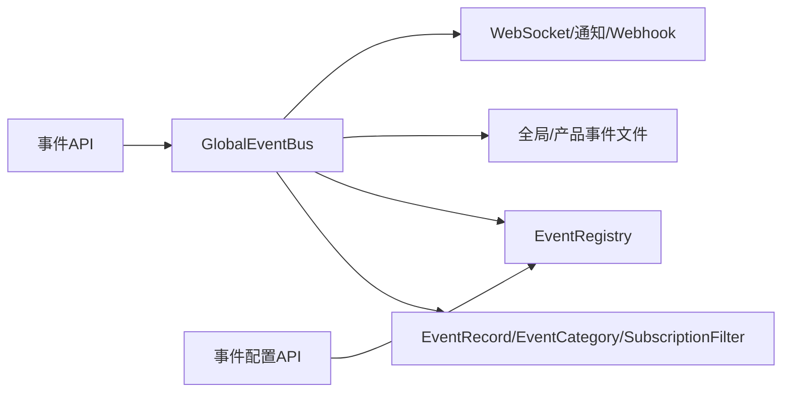

# 事件总线核心

<cite>
**本文引用的文件**
- [event_bus.py](file://backend/app/core/event_bus.py)
- [event_store.py](file://backend/app/storage/event_store.py)
- [events.py](file://backend/app/api/events.py)
- [schemas.py](file://backend/app/models/schemas.py)
- [event_config.py](file://backend/app/api/event_config.py)
</cite>

## 目录
1. [简介](#简介)
2. [项目结构](#项目结构)
3. [核心组件](#核心组件)
4. [架构总览](#架构总览)
5. [详细组件分析](#详细组件分析)
6. [依赖分析](#依赖分析)
7. [性能考虑](#性能考虑)
8. [故障排除指南](#故障排除指南)
9. [结论](#结论)
10. [附录](#附录)

## 简介
本文件面向避风港平台的事件总线核心组件，系统性梳理 GlobalEventBus 的设计与实现，重点覆盖：
- 事件标准化管道：raw_event → 类型归类 → 元数据提取 → 格式化 → EventRecord
- 事件发布机制：标准化、持久化、路由分发与订阅通知
- 处理器注册系统与订阅管理：处理器注册、通配符匹配、订阅过滤与多通道分发
- 事件分类体系：8类事件的自动归类规则
- 事件路由分发：产品级事件隔离、全局事件广播、跨产品事件传播
- 事件存储策略：内存缓存、文件持久化与归档机制
- 完整API使用示例：事件发布、订阅创建、处理器注册与查询
- 性能优化建议与故障排除指南

## 项目结构
事件总线核心位于后端模块 app/core，配套的事件存储与API在 app/storage 与 app/api 下，模型定义集中在 app/models/schemas 中。

图表来源
- [event_bus.py:115-516](file://backend/app/core/event_bus.py#L115-L516)
- [event_store.py:59-221](file://backend/app/storage/event_store.py#L59-L221)
- [events.py:1-109](file://backend/app/api/events.py#L1-L109)
- [schemas.py:296-561](file://backend/app/models/schemas.py#L296-L561)

章节来源
- [event_bus.py:115-516](file://backend/app/core/event_bus.py#L115-L516)
- [event_store.py:59-221](file://backend/app/storage/event_store.py#L59-L221)
- [events.py:1-109](file://backend/app/api/events.py#L1-L109)
- [schemas.py:296-561](file://backend/app/models/schemas.py#L296-L561)

## 核心组件
- GlobalEventBus：全局事件总线，负责事件标准化、持久化、路由分发与订阅通知；提供处理器注册、订阅管理与查询能力。
- EventStandardizer：事件标准化器，负责事件类型前缀到8类事件的自动归类与EventRecord构造。
- EventRegistry：事件注册表，从配置文件加载事件定义，支持动态增删改与归档。
- EventRecord：OS级全局事件总线核心数据结构，承载事件类型、分类、来源、产品ID、业务阶段、数据载荷、严重级别等。
- API层：提供事件发布、查询、订阅管理与事件配置管理的REST接口。

章节来源
- [event_bus.py:115-516](file://backend/app/core/event_bus.py#L115-L516)
- [schemas.py:296-356](file://backend/app/models/schemas.py#L296-L356)

## 架构总览
事件总线采用“标准化 → 路由 → 分发”的流水线式处理，结合内存缓存与文件持久化，实现全局事件广播与产品级事件隔离。

图表来源
- [event_bus.py:184-187](file://backend/app/core/event_bus.py#L184-L187)
- [event_bus.py:294-372](file://backend/app/core/event_bus.py#L294-L372)
- [event_bus.py:376-444](file://backend/app/core/event_bus.py#L376-L444)

## 详细组件分析

### GlobalEventBus 设计与实现
- 职责边界
  - 事件标准化与分类
  - 全局事件与产品事件的持久化
  - 处理器注册与通配符匹配
  - 订阅过滤与多通道分发（WebSocket、通知引擎、Webhook）
  - 查询接口：最近事件、时间线、统计
- 关键数据结构
  - 处理器映射：按事件类型与通配符索引
  - 全局处理器列表
  - 最近事件内存缓存（上限控制）
  - 订阅字典：sub_id → {subscriber, filter, channels}
- 发布流程
  - 若事件分类为 system 且非 system:unknown，则依据事件类型前缀重新分类
  - 追加至内存缓存并持久化到全局事件文件
  - 如存在 product_id，则同步持久化到产品事件链
  - 并行分发给全局处理器与特定处理器（含通配符）
  - 并行分发给匹配的订阅者（多通道）
- 订阅匹配
  - 支持精准订阅（按产品ID）、批量订阅（按标签）、条件订阅（AST安全表达式）、全局订阅
  - 支持事件类型、严重级别过滤
- 条件表达式评估
  - 使用AST白名单限制节点类型，避免任意代码执行
  - 安全变量集合包含事件类型、严重级别、分类、产品ID、来源与事件数据中的标量字段

图表来源
- [event_bus.py:150-182](file://backend/app/core/event_bus.py#L150-L182)
- [event_bus.py:294-372](file://backend/app/core/event_bus.py#L294-L372)
- [event_bus.py:376-444](file://backend/app/core/event_bus.py#L376-L444)

章节来源
- [event_bus.py:115-516](file://backend/app/core/event_bus.py#L115-L516)

### EventStandardizer 事件分类逻辑
- 8类事件体系：lifecycle、compliance、certification、order、regulation、risk_alert、system、user_action
- 自动归类规则：基于事件类型前缀映射，若无匹配则归类为 system
- 标准化流程：补充分类、来源、产品ID、业务阶段、数据载荷、严重级别、数据血缘、时间戳等字段

图表来源
- [event_bus.py:44-113](file://backend/app/core/event_bus.py#L44-L113)

章节来源
- [event_bus.py:44-113](file://backend/app/core/event_bus.py#L44-L113)

### 事件路由分发机制
- 产品级事件隔离：仅当事件携带 product_id 时，同步持久化到产品事件链，并在产品维度展示时间线
- 全局事件广播：所有事件均持久化到全局事件文件，供全局查询与统计
- 跨产品事件传播：通过订阅系统实现跨产品事件的条件分发，支持多通道通知

图表来源
- [event_bus.py:150-182](file://backend/app/core/event_bus.py#L150-L182)
- [event_bus.py:333-372](file://backend/app/core/event_bus.py#L333-L372)
- [event_bus.py:392-444](file://backend/app/core/event_bus.py#L392-L444)

章节来源
- [event_bus.py:150-182](file://backend/app/core/event_bus.py#L150-L182)
- [event_bus.py:333-372](file://backend/app/core/event_bus.py#L333-L372)
- [event_bus.py:392-444](file://backend/app/core/event_bus.py#L392-L444)

### 事件存储策略
- 内存缓存：最近事件列表，支持上限控制，便于快速查询与统计
- 文件持久化：
  - 全局事件：data/global/events/bus.json，保留最近2000条，超出部分归档到 data/global/events/archive/
  - 产品事件：data/products/{product_id}/events/chain.json，保留最近500条，维护时间线
- 归档机制：超过容量阈值时，将最早一批事件归档到按月命名的归档文件

图表来源
- [event_bus.py:294-331](file://backend/app/core/event_bus.py#L294-L331)
- [event_bus.py:333-372](file://backend/app/core/event_bus.py#L333-L372)

章节来源
- [event_bus.py:294-331](file://backend/app/core/event_bus.py#L294-L331)
- [event_bus.py:333-372](file://backend/app/core/event_bus.py#L333-L372)

### 处理器注册系统与订阅管理
- 处理器注册
  - on(event_type, handler)：注册特定事件类型的处理器
  - on_all(handler)：注册全局处理器（接收所有事件）
  - off(event_type, handler)：移除处理器
  - 通配符匹配：以 * 结尾的模式匹配前缀
- 订阅管理
  - subscribe(subscriber, subscription_type, filter_config, channels)：创建订阅，返回 sub_id
  - unsubscribe(sub_id)：取消订阅
  - get_subscriptions()：获取所有订阅
  - 订阅过滤：产品ID、标签、事件类型、严重级别、条件表达式
  - 分发通道：websocket、notification、webhook

图表来源
- [event_bus.py:206-243](file://backend/app/core/event_bus.py#L206-L243)
- [event_bus.py:392-444](file://backend/app/core/event_bus.py#L392-L444)

章节来源
- [event_bus.py:191-203](file://backend/app/core/event_bus.py#L191-L203)
- [event_bus.py:206-243](file://backend/app/core/event_bus.py#L206-L243)
- [event_bus.py:392-444](file://backend/app/core/event_bus.py#L392-L444)

### 事件查询与统计
- get_recent_events(limit, category, product_id, severity)：按条件查询最近事件
- get_event_timeline(limit)：生成自然语言事件时间线
- get_event_stats()：统计事件总数、按分类与严重级别的分布、订阅数量

章节来源
- [event_bus.py:247-290](file://backend/app/core/event_bus.py#L247-L290)

### 事件注册表 EventRegistry
- 配置文件驱动：从 data/config/events/ 目录加载事件定义（Markdown表格）
- 默认事件：当配置目录不存在时，注册一组默认事件定义
- 动态管理：支持注册、更新、删除事件类型，并写回配置文件或归档到 _archive 目录
- 查询接口：按业务阶段、分类、事件编码查询事件定义

章节来源
- [event_bus.py:518-793](file://backend/app/core/event_bus.py#L518-L793)

### API 使用示例
- 事件发布
  - POST /api/v1/events：发布事件到全局总线
  - 参数：type、category、source、product_id、business_stage、data、severity
- 事件查询
  - GET /api/v1/events：获取最近全局事件（支持 limit、category、product_id、severity）
  - GET /api/v1/events/timeline：获取事件时间线
  - GET /api/v1/events/stats：获取事件统计
- 事件定义查询
  - GET /api/v1/events/registry：列出事件定义（支持 stage、category 过滤）
  - GET /api/v1/events/registry/{event_code}：获取指定事件定义
- 订阅管理
  - POST /api/v1/events/subscribe：创建订阅
  - DELETE /api/v1/events/subscribe/{sub_id}：取消订阅
  - GET /api/v1/events/subscriptions：列出所有订阅
- 事件配置管理（QAAgent）
  - GET /api/v1/event-config：列出事件配置
  - GET /api/v1/event-config/{event_code}：获取事件配置
  - POST /api/v1/event-config：注册新事件类型
  - PUT /api/v1/event-config/{event_code}：更新事件类型
  - DELETE /api/v1/event-config/{event_code}：删除事件类型（归档）

章节来源
- [events.py:12-109](file://backend/app/api/events.py#L12-L109)
- [event_config.py:13-93](file://backend/app/api/event_config.py#L13-L93)

## 依赖分析
- GlobalEventBus 依赖
  - 模型：EventRecord、EventCategory、SubscriptionFilter
  - 存储：全局事件文件、产品事件链、归档目录
  - 服务：WebSocket管理、通知引擎、Webhook适配器
  - 注册表：EventRegistry（用于标准化时补充事件定义）
- EventRegistry 依赖
  - 配置文件：Markdown表格事件定义
  - 归档目录：事件删除时归档
- API 依赖
  - 事件API：/api/v1/events
  - 事件配置API：/api/v1/event-config

图表来源
- [event_bus.py:115-516](file://backend/app/core/event_bus.py#L115-L516)
- [schemas.py:296-561](file://backend/app/models/schemas.py#L296-L561)
- [events.py:12-109](file://backend/app/api/events.py#L12-L109)
- [event_config.py:13-93](file://backend/app/api/event_config.py#L13-L93)

章节来源
- [event_bus.py:115-516](file://backend/app/core/event_bus.py#L115-L516)
- [schemas.py:296-561](file://backend/app/models/schemas.py#L296-L561)
- [events.py:12-109](file://backend/app/api/events.py#L12-L109)
- [event_config.py:13-93](file://backend/app/api/event_config.py#L13-L93)

## 性能考虑
- 内存缓存与容量控制
  - 全局最近事件上限：500 条，避免内存膨胀
  - 全局事件文件容量：2000 条，超出部分归档，减少单文件体积
  - 产品事件链容量：500 条，维持时间线长度
- 异步处理
  - 发布与分发均为异步，提升吞吐
  - 多通道分发并行进行，单通道失败不影响其他通道
- 处理器异常隔离
  - 处理器执行异常被捕获，不影响其他处理器
- 条件表达式安全
  - AST白名单限制，避免任意代码执行，降低安全与性能风险

## 故障排除指南
- 事件未被持久化
  - 检查 data/global/events 与 data/products/{product_id}/events 目录权限与磁盘空间
  - 查看持久化异常日志（当前实现中异常被静默处理，建议在生产环境增强日志）
- 订阅未收到通知
  - 确认订阅类型与过滤条件是否匹配事件
  - 检查订阅通道（websocket/notification/webhook）可用性
  - 确认订阅ID有效且未被取消
- 处理器未被调用
  - 检查事件类型是否正确注册
  - 对于通配符处理器，确认事件类型前缀匹配
- 事件分类不正确
  - 确认事件类型前缀是否符合 EventStandardizer 的映射规则
  - 必要时通过 EventRegistry 补充事件定义以获得更准确的分类与严重级别

章节来源
- [event_bus.py:294-331](file://backend/app/core/event_bus.py#L294-L331)
- [event_bus.py:392-444](file://backend/app/core/event_bus.py#L392-L444)
- [event_bus.py:484-516](file://backend/app/core/event_bus.py#L484-L516)

## 结论
避风港平台事件总线通过标准化管道、产品级隔离与全局广播、多通道订阅分发以及完善的存储与归档策略，实现了高扩展、低耦合的事件基础设施。配合事件注册表与API，系统具备良好的可运维性与可演进性。建议在生产环境中进一步完善持久化异常日志与处理器执行监控，以提升可观测性与稳定性。

## 附录
- 事件分类映射参考
  - lifecycle：product:、lifecycle:
  - compliance：compliance:
  - certification：certification:、cert:
  - order：order:、fulfillment:
  - regulation：regulation:、market:
  - risk_alert：risk:
  - system：system:、sync:
  - user_action：user:

章节来源
- [event_bus.py:48-70](file://backend/app/core/event_bus.py#L48-L70)