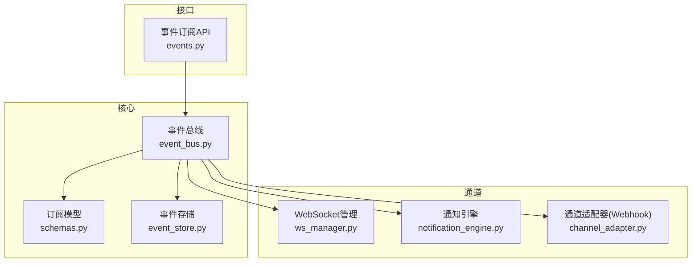
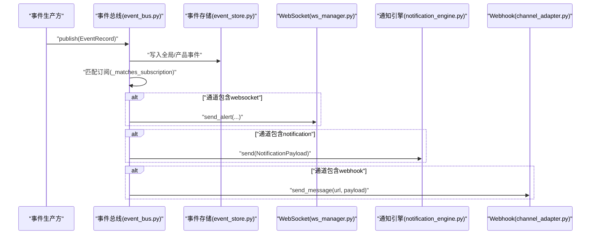
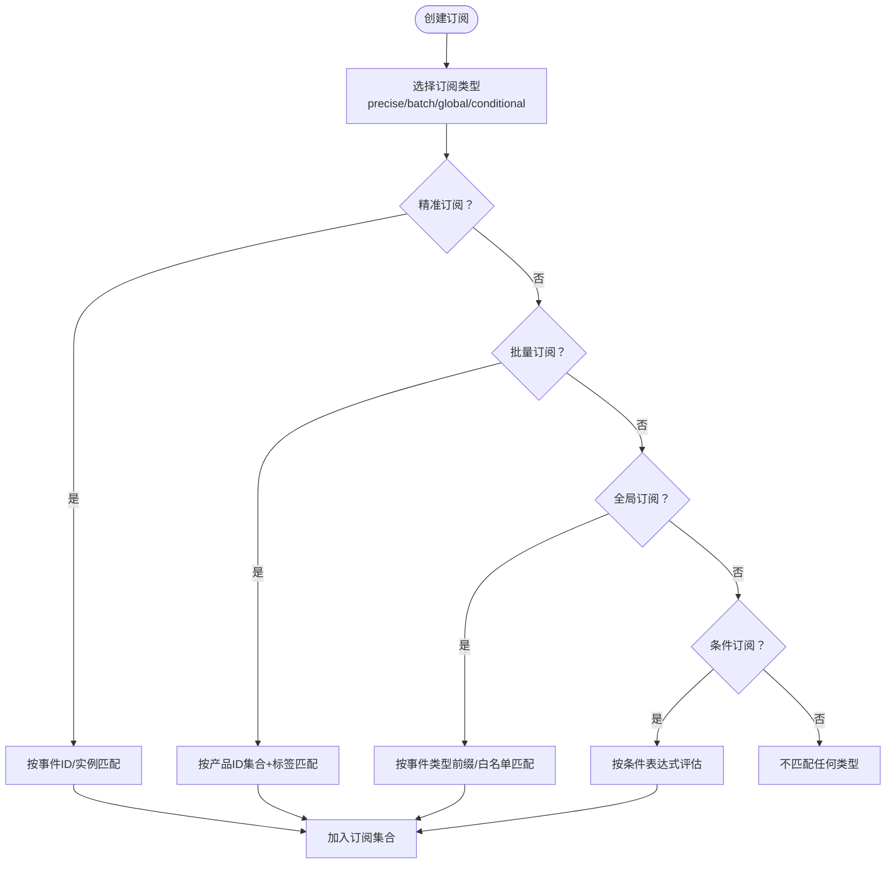
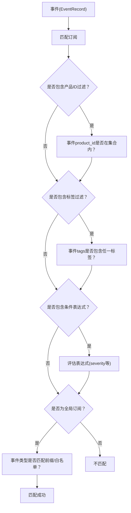
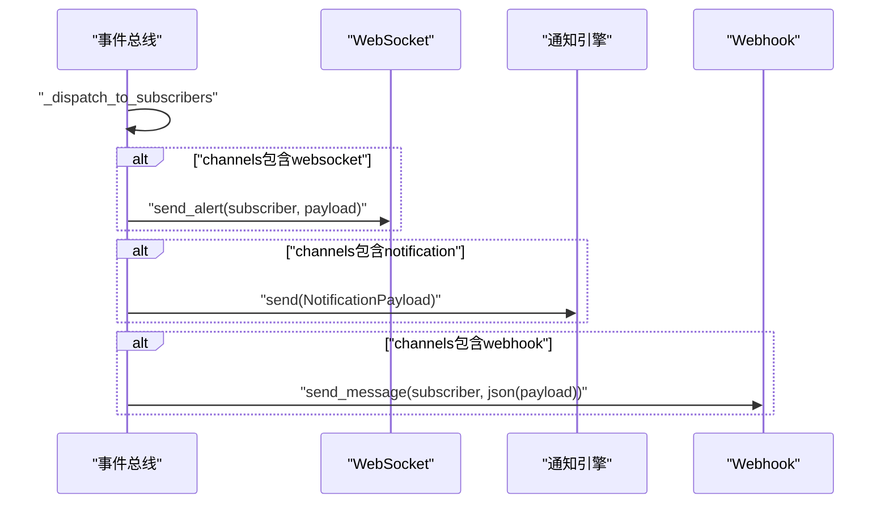
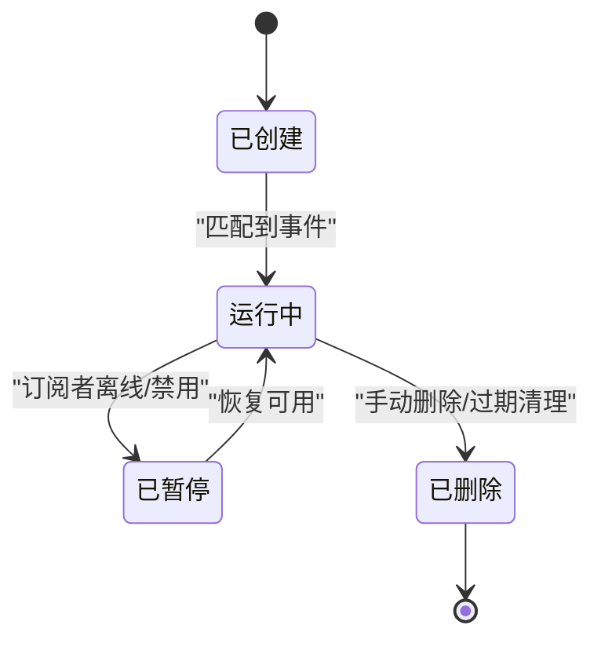
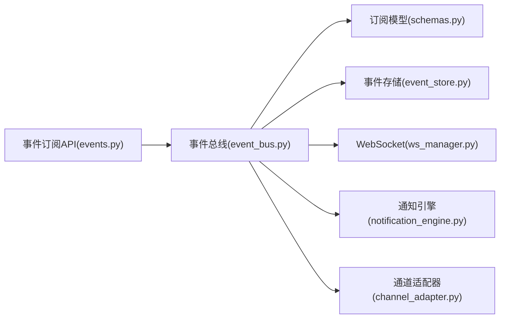

# 事件订阅系统

<cite>
**本文引用的文件**
- [event_bus.py](file://backend/app/core/event_bus.py)
- [schemas.py](file://backend/app/models/schemas.py)
- [events.py](file://backend/app/api/events.py)
- [notification_engine.py](file://backend/app/core/notification_engine.py)
- [channel_adapter.py](file://backend/app/core/channel_adapter.py)
- [ws_manager.py](file://backend/app/services/ws_manager.py)
- [event_store.py](file://backend/app/storage/event_store.py)
- [test_all_phases.py](file://backend/tests/test_all_phases.py)
- [test_phase1.py](file://backend/tests/test_phase1.py)
- [后端api.md](file://后端api.md)
</cite>

## 目录
1. [简介](#简介)
2. [项目结构](#项目结构)
3. [核心组件](#核心组件)
4. [架构总览](#架构总览)
5. [详细组件分析](#详细组件分析)
6. [依赖关系分析](#依赖关系分析)
7. [性能考虑](#性能考虑)
8. [故障排查指南](#故障排查指南)
9. [结论](#结论)
10. [附录](#附录)

## 简介
本文件面向避风港平台的事件订阅系统，围绕“订阅类型设计、订阅过滤机制、订阅通道管理、订阅生命周期管理、安全机制、订阅API与性能优化”等方面进行系统化梳理与说明。通过对事件总线、订阅模型、通道适配器与通知引擎的深入分析，帮助开发者与运维人员快速理解并高效使用该系统。

## 项目结构
事件订阅系统主要分布在后端核心模块与API层：
- 核心事件总线负责事件标准化、路由与订阅分发
- 订阅模型定义了订阅类型与过滤规则
- 通道适配器支持WebSocket推送、通知引擎集成与Webhook适配
- API层提供订阅创建、查询与状态管理接口
- 测试用例覆盖多种订阅场景

图表来源
- [event_bus.py:1-166](file://backend/app/core/event_bus.py#L1-L166)
- [schemas.py](file://backend/app/models/schemas.py)
- [events.py](file://backend/app/api/events.py)
- [notification_engine.py](file://backend/app/core/notification_engine.py)
- [channel_adapter.py](file://backend/app/core/channel_adapter.py)
- [ws_manager.py](file://backend/app/services/ws_manager.py)
- [event_store.py:59-86](file://backend/app/storage/event_store.py#L59-L86)

章节来源
- [event_bus.py:1-166](file://backend/app/core/event_bus.py#L1-L166)
- [schemas.py](file://backend/app/models/schemas.py)
- [events.py](file://backend/app/api/events.py)
- [notification_engine.py](file://backend/app/core/notification_engine.py)
- [channel_adapter.py](file://backend/app/core/channel_adapter.py)
- [ws_manager.py](file://backend/app/services/ws_manager.py)
- [event_store.py:59-86](file://backend/app/storage/event_store.py#L59-L86)

## 核心组件
- 事件总线：负责事件标准化、路由分发、订阅匹配与多通道推送
- 订阅模型：定义订阅类型、过滤规则与通道配置
- 通道适配器：统一处理WebSocket、通知引擎与Webhook三种推送方式
- API层：对外暴露订阅创建、查询与状态管理接口
- 事件存储：持久化系统事件与产品事件，支撑订阅与审计

章节来源
- [event_bus.py:148-439](file://backend/app/core/event_bus.py#L148-L439)
- [schemas.py](file://backend/app/models/schemas.py)
- [events.py](file://backend/app/api/events.py)
- [event_store.py:59-86](file://backend/app/storage/event_store.py#L59-L86)

## 架构总览
事件从生产方进入事件总线，经过标准化与路由后，写入全局与产品事件存储，并根据订阅规则分发至WebSocket、通知引擎或Webhook通道。

图表来源
- [event_bus.py:148-439](file://backend/app/core/event_bus.py#L148-L439)
- [event_store.py:59-86](file://backend/app/storage/event_store.py#L59-L86)
- [ws_manager.py](file://backend/app/services/ws_manager.py)
- [notification_engine.py](file://backend/app/core/notification_engine.py)
- [channel_adapter.py](file://backend/app/core/channel_adapter.py)

## 详细组件分析

### 订阅类型设计
- 精准订阅（precise）：基于事件ID或具体事件实例进行定向推送
- 批量订阅（batch）：按产品ID集合与标签集合进行聚合匹配
- 全局订阅（global）：按事件类型前缀或特定类型进行全站广播
- 条件订阅（conditional）：通过条件表达式对事件属性进行动态过滤

图表来源
- [event_bus.py:206-232](file://backend/app/core/event_bus.py#L206-L232)
- [event_bus.py:392-439](file://backend/app/core/event_bus.py#L392-L439)

章节来源
- [event_bus.py:206-232](file://backend/app/core/event_bus.py#L206-L232)
- [event_bus.py:392-439](file://backend/app/core/event_bus.py#L392-L439)
- [test_all_phases.py:328-350](file://backend/tests/test_all_phases.py#L328-L350)
- [test_phase1.py:283-311](file://backend/tests/test_phase1.py#L283-L311)

### 订阅过滤机制
- 产品ID过滤：在批量订阅中通过产品ID集合限定事件来源
- 标签匹配：在批量订阅中通过标签集合进行二次过滤
- 条件表达式评估：在条件订阅中对事件属性进行动态判断
- 事件类型筛选：在全局订阅中通过事件类型前缀或白名单控制范围

图表来源
- [event_bus.py:392-439](file://backend/app/core/event_bus.py#L392-L439)
- [schemas.py](file://backend/app/models/schemas.py)

章节来源
- [event_bus.py:392-439](file://backend/app/core/event_bus.py#L392-L439)
- [schemas.py](file://backend/app/models/schemas.py)

### 订阅通道管理
- WebSocket推送：通过ws_manager向指定连接推送事件
- 通知引擎集成：通过notification_engine发送系统通知
- Webhook适配：通过channel_adapter调用外部URL推送事件

图表来源
- [event_bus.py:392-439](file://backend/app/core/event_bus.py#L392-L439)
- [ws_manager.py](file://backend/app/services/ws_manager.py)
- [notification_engine.py](file://backend/app/core/notification_engine.py)
- [channel_adapter.py](file://backend/app/core/channel_adapter.py)

章节来源
- [event_bus.py:392-439](file://backend/app/core/event_bus.py#L392-L439)
- [ws_manager.py](file://backend/app/services/ws_manager.py)
- [notification_engine.py](file://backend/app/core/notification_engine.py)
- [channel_adapter.py](file://backend/app/core/channel_adapter.py)

### 订阅生命周期管理
- 订阅创建：生成唯一订阅ID，记录订阅者、类型、过滤器与通道
- 状态监控：通过事件总线内部状态与通道反馈进行监控
- 自动清理：未使用的订阅可结合业务策略定期清理（建议）

图表来源
- [event_bus.py:206-232](file://backend/app/core/event_bus.py#L206-L232)
- [event_bus.py:392-439](file://backend/app/core/event_bus.py#L392-L439)

章节来源
- [event_bus.py:206-232](file://backend/app/core/event_bus.py#L206-L232)
- [event_bus.py:392-439](file://backend/app/core/event_bus.py#L392-L439)

### 安全机制
- 条件表达式白名单：建议在系统中限制可执行表达式集合，避免任意代码注入
- 输入验证：对订阅请求参数进行严格校验（类型、长度、格式）
- 异常处理：通道发送异常不影响其他通道；处理器异常不影响其他处理器

章节来源
- [event_bus.py:386-391](file://backend/app/core/event_bus.py#L386-L391)

### 订阅API文档
- 接口路径：/events/subscribe
- 方法：POST
- 请求体字段
  - subscriber：订阅者标识（WebSocket连接ID或Webhook URL）
  - subscription_type：订阅类型（precise/batch/global/conditional）
  - filter：订阅过滤器（见下节）
  - channels：通知渠道列表（websocket/notification/webhook）
- 返回值
  - subscription_id：订阅唯一标识

请求体示例（来自测试用例）
- 精准订阅：包含订阅者、订阅类型与过滤器
- 批量订阅：包含产品ID集合与标签集合
- 全局订阅：包含事件类型白名单
- 条件订阅：包含条件表达式

章节来源
- [events.py](file://backend/app/api/events.py)
- [test_all_phases.py:328-350](file://backend/tests/test_all_phases.py#L328-L350)
- [test_phase1.py:283-311](file://backend/tests/test_phase1.py#L283-L311)
- [后端api.md](file://后端api.md)

## 依赖关系分析
事件总线与各子系统之间的耦合关系如下：

图表来源
- [events.py](file://backend/app/api/events.py)
- [event_bus.py:148-439](file://backend/app/core/event_bus.py#L148-L439)
- [schemas.py](file://backend/app/models/schemas.py)
- [event_store.py:59-86](file://backend/app/storage/event_store.py#L59-L86)
- [ws_manager.py](file://backend/app/services/ws_manager.py)
- [notification_engine.py](file://backend/app/core/notification_engine.py)
- [channel_adapter.py](file://backend/app/core/channel_adapter.py)

章节来源
- [event_bus.py:148-439](file://backend/app/core/event_bus.py#L148-L439)
- [schemas.py](file://backend/app/models/schemas.py)
- [events.py](file://backend/app/api/events.py)
- [event_store.py:59-86](file://backend/app/storage/event_store.py#L59-L86)
- [ws_manager.py](file://backend/app/services/ws_manager.py)
- [notification_engine.py](file://backend/app/core/notification_engine.py)
- [channel_adapter.py](file://backend/app/core/channel_adapter.py)

## 性能考虑
- 订阅匹配复杂度：建议对产品ID集合与标签集合建立索引，降低匹配时间
- 并发分发：通道发送采用异步并发，避免阻塞主事件循环
- 缓存与限流：对高频Webhook URL实施限流与重试退避策略
- 存储优化：事件存储采用分层目录结构，便于归档与查询
- 监控指标：建议采集订阅创建/删除、匹配命中率、通道发送成功率与延迟

## 故障排查指南
- WebSocket推送失败：检查ws_manager连接状态与订阅者ID有效性
- 通知引擎异常：查看notification_engine日志，确认通知负载结构
- Webhook调用失败：检查URL可达性、超时与重试策略
- 订阅未生效：核对订阅类型与过滤器配置，确保事件类型与产品ID匹配
- 处理器异常：事件总线已捕获单个处理器异常，不影响其他处理器

章节来源
- [event_bus.py:386-391](file://backend/app/core/event_bus.py#L386-L391)
- [ws_manager.py](file://backend/app/services/ws_manager.py)
- [notification_engine.py](file://backend/app/core/notification_engine.py)
- [channel_adapter.py](file://backend/app/core/channel_adapter.py)

## 结论
事件订阅系统以事件总线为核心，通过标准化事件与灵活的订阅类型实现多维度的事件分发。配合WebSocket、通知引擎与Webhook三大通道，满足不同场景下的实时与异步通知需求。建议在生产环境中完善条件表达式白名单、输入校验与异常处理策略，并结合监控指标持续优化性能与稳定性。

## 附录
- 订阅类型与过滤器字段参考：见订阅模型与测试用例中的请求体示例
- API接口定义：见事件订阅API与后端API文档

章节来源
- [schemas.py](file://backend/app/models/schemas.py)
- [test_all_phases.py:328-350](file://backend/tests/test_all_phases.py#L328-L350)
- [test_phase1.py:283-311](file://backend/tests/test_phase1.py#L283-L311)
- [后端api.md](file://后端api.md)