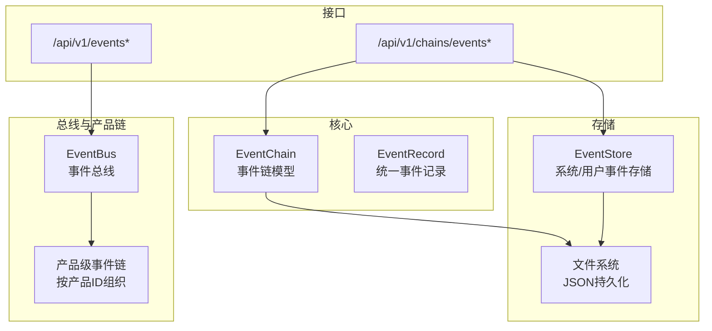
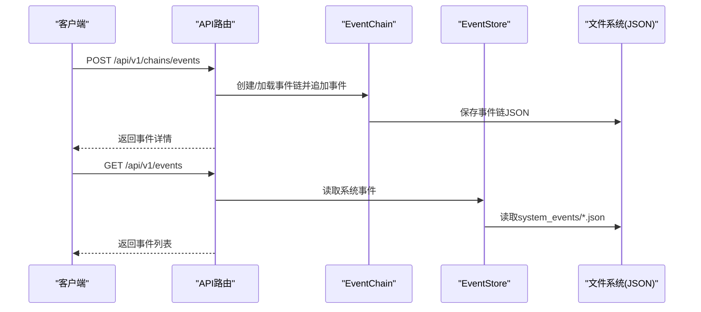
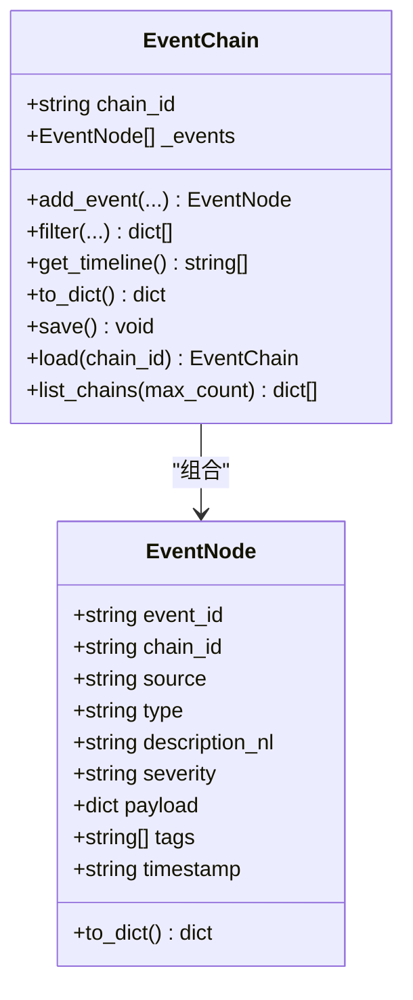
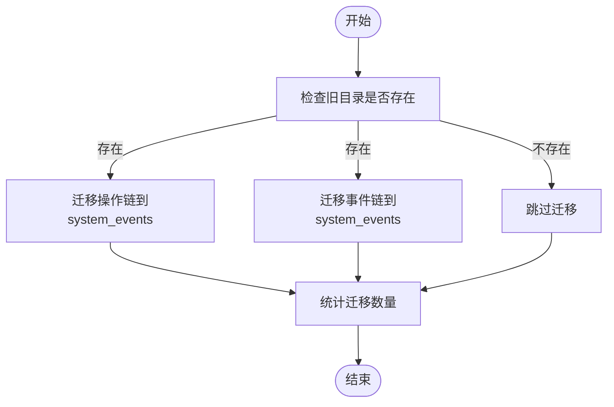
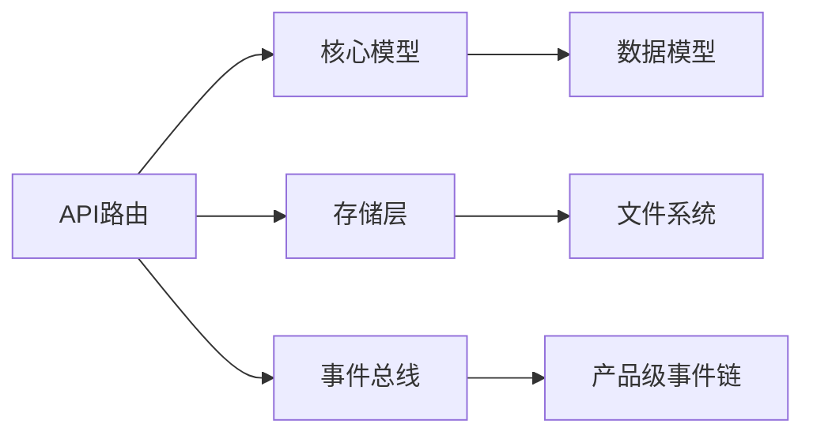

# 事件链管理

<cite>
**本文引用的文件**
- [event_chain.py](file://backend/app/core/event_chain.py)
- [event_store.py](file://backend/app/storage/event_store.py)
- [chains.py](file://backend/app/api/chains.py)
- [events.py](file://backend/app/api/events.py)
- [schemas.py](file://backend/app/models/schemas.py)
- [event_bus.py](file://backend/app/core/event_bus.py)
- [lifecycle_events.md](file://backend/data/config/events/lifecycle_events.md)
- [后端变更路线图.md](file://后端变更路线图.md)
</cite>

## 目录
1. [简介](#简介)
2. [项目结构](#项目结构)
3. [核心组件](#核心组件)
4. [架构总览](#架构总览)
5. [组件详解](#组件详解)
6. [依赖关系分析](#依赖关系分析)
7. [性能考量](#性能考量)
8. [故障排查指南](#故障排查指南)
9. [结论](#结论)
10. [附录](#附录)

## 简介
本文件面向避风港平台的事件链管理系统，系统性梳理事件链的数据结构设计、编排机制、持久化存储、查询与分析能力，并给出最佳实践、API 文档与使用案例。事件链用于记录系统内外部发生的各类重要事件，支持按来源/类型/严重度等维度筛选与回溯，形成可追溯的时间线，服务于审计、监控与决策回溯。

## 项目结构
事件链相关代码主要分布在以下模块：
- 核心模型与编排：backend/app/core/event_chain.py
- 统一存储与迁移：backend/app/storage/event_store.py
- API 路由：backend/app/api/chains.py、backend/app/api/events.py
- 数据模型与枚举：backend/app/models/schemas.py
- 事件总线与产品级事件链：backend/app/core/event_bus.py
- 事件配置与Schema参考：backend/data/config/events/lifecycle_events.md
- 变更与历史参考：后端变更路线图.md

图表来源
- [event_chain.py:1-215](file://backend/app/core/event_chain.py#L1-L215)
- [event_store.py:1-269](file://backend/app/storage/event_store.py#L1-L269)
- [chains.py:1-282](file://backend/app/api/chains.py#L1-L282)
- [events.py:1-109](file://backend/app/api/events.py#L1-L109)
- [event_bus.py:322-354](file://backend/app/core/event_bus.py#L322-L354)

章节来源
- [event_chain.py:1-215](file://backend/app/core/event_chain.py#L1-L215)
- [event_store.py:1-269](file://backend/app/storage/event_store.py#L1-L269)
- [chains.py:1-282](file://backend/app/api/chains.py#L1-L282)
- [events.py:1-109](file://backend/app/api/events.py#L1-L109)
- [event_bus.py:322-354](file://backend/app/core/event_bus.py#L322-L354)

## 核心组件
- 事件节点 EventNode：封装单个事件的标识、来源、类型、描述、严重度、载荷、标签与时间戳。
- 事件链 EventChain：按链ID组织事件序列，支持追加事件、筛选、生成自然语言时间线、持久化与加载。
- 统一事件记录 EventRecord：跨组件统一的事件结构，支持系统事件与用户操作事件。
- 事件存储 EventStore：负责系统事件与用户事件的持久化、读取、筛选与迁移。
- 事件总线 EventBus：负责事件发布、订阅、聚合与产品级事件链持久化。
- API 路由：提供事件链与事件的查询、筛选、创建与订阅管理接口。

章节来源
- [event_chain.py:24-116](file://backend/app/core/event_chain.py#L24-L116)
- [event_chain.py:117-215](file://backend/app/core/event_chain.py#L117-L215)
- [event_store.py:22-158](file://backend/app/storage/event_store.py#L22-L158)
- [event_store.py:159-269](file://backend/app/storage/event_store.py#L159-L269)
- [event_bus.py:322-354](file://backend/app/core/event_bus.py#L322-L354)

## 架构总览
事件链系统采用“核心模型 + 统一存储 + API路由 + 事件总线”的分层设计：
- 核心模型层：EventChain 提供事件序列组织与时间线生成；EventNode 提供事件节点结构。
- 存储层：EventStore 将系统事件与用户事件统一落盘，支持按链ID与用户ID组织。
- 接口层：FastAPI 路由提供事件链与事件的增删改查、筛选与订阅管理。
- 总线层：EventBus 负责事件聚合、产品级事件链持久化与订阅分发。

图表来源
- [chains.py:140-161](file://backend/app/api/chains.py#L140-L161)
- [event_chain.py:110-116](file://backend/app/core/event_chain.py#L110-L116)
- [event_store.py:162-170](file://backend/app/storage/event_store.py#L162-L170)

## 组件详解

### 事件链数据结构设计
- 事件节点 EventNode
  - 字段：事件ID、所属链ID、来源、类型、自然语言描述、严重度、载荷、标签、时间戳。
  - 序列化：to_dict 输出标准化字典，便于持久化与传输。
- 事件链 EventChain
  - 字段：链ID、事件列表。
  - 方法：add_event 追加事件；filter 按来源/类型/严重度/标签筛选；get_timeline 生成展示用时间线；to_dict 汇总输出；load/list_chains 支持加载与列举。
- 时间线构建
  - 依据事件时间戳降序排列，结合严重度映射表情符号，形成“图标+严重度+时间+描述”的可读字符串列表。

图表来源
- [event_chain.py:24-116](file://backend/app/core/event_chain.py#L24-L116)
- [event_chain.py:160-215](file://backend/app/core/event_chain.py#L160-L215)

章节来源
- [event_chain.py:24-116](file://backend/app/core/event_chain.py#L24-L116)
- [event_chain.py:117-215](file://backend/app/core/event_chain.py#L117-L215)

### 事件链编排机制
- 事件顺序控制
  - 通过事件时间戳排序，确保时间线的正确性。
- 条件触发逻辑
  - 事件链本身不内置条件触发，但可通过筛选接口按来源/类型/严重度/标签进行条件查询与展示。
- 依赖处理策略
  - 事件链以线性序列组织，不直接表达事件间的依赖关系；若需表达依赖，可在事件载荷中携带上游事件ID并在应用层解析。

章节来源
- [event_chain.py:143-158](file://backend/app/core/event_chain.py#L143-L158)
- [event_chain.py:123-141](file://backend/app/core/event_chain.py#L123-L141)

### 事件链持久化存储
- JSON格式设计
  - 事件链：包含链ID、事件总数、事件数组、时间线预览。
  - 事件节点：包含事件ID、链ID、来源、类型、自然语言描述、严重度、载荷、标签、时间戳。
  - 统一事件记录：包含事件ID、事件类型、来源、自然语言描述、严重度、载荷、标签、用户ID、时间戳。
- 文件组织结构
  - 事件链：按链ID命名的JSON文件，存放于数据根目录下的 chains/events。
  - 统一存储：系统事件存于 event_chain/system_events，用户事件存于 event_chain/action_chains。
- 数据迁移方案
  - 从旧目录 data/chains/actions 与 data/chains/events 迁移至新目录 event_chain/system_events 与 event_chain/action_chains，自动补齐缺失链文件并统计迁移数量。

图表来源
- [event_store.py:224-269](file://backend/app/storage/event_store.py#L224-L269)

章节来源
- [event_chain.py:109-116](file://backend/app/core/event_chain.py#L109-L116)
- [event_store.py:198-221](file://backend/app/storage/event_store.py#L198-L221)
- [event_store.py:224-269](file://backend/app/storage/event_store.py#L224-L269)

### 事件链查询与分析
- 事件检索
  - API：GET /api/v1/chains/events/{chain_id} 获取完整事件链；GET /api/v1/chains/events/{chain_id}/filter 支持多维筛选。
  - 存储：EventStore 提供按类型/来源/严重度筛选系统事件的能力。
- 统计分析
  - API：GET /api/v1/events/stats 获取事件统计；GET /api/v1/events/timeline 获取事件时间线。
  - 存储：EventStore 维护 total_events 与 updated_at，便于快速统计与排序。
- 趋势预测
  - 当前实现未内置趋势预测算法；建议在前端或上层服务基于时间线与统计结果进行可视化分析。

章节来源
- [chains.py:84-138](file://backend/app/api/chains.py#L84-L138)
- [event_store.py:172-189](file://backend/app/storage/event_store.py#L172-L189)
- [events.py:42-54](file://backend/app/api/events.py#L42-L54)

### 事件链管理最佳实践
- 链式设计原则
  - 明确事件来源与类型，使用语义化标签；在事件载荷中保留上下文信息以便回溯。
- 性能优化
  - 控制事件链长度与筛选上限；避免频繁大文件写入；必要时对时间线进行缓存。
- 错误处理
  - 对文件读写异常进行捕获与降级；API层对缺失资源返回明确错误码。

章节来源
- [event_chain.py:110-116](file://backend/app/core/event_chain.py#L110-L116)
- [event_store.py:111-115](file://backend/app/storage/event_store.py#L111-L115)
- [chains.py:93-96](file://backend/app/api/chains.py#L93-L96)

### 事件链API文档

- 事件链API
  - GET /api/v1/chains/events：列出最近事件链摘要
  - GET /api/v1/chains/events/{chain_id}：获取事件链完整内容
  - GET /api/v1/chains/events/{chain_id}/timeline：获取事件时间线
  - GET /api/v1/chains/events/{chain_id}/filter：按来源/类型/严重度/标签筛选事件
  - POST /api/v1/chains/events：创建事件
- 事件API
  - GET /api/v1/events：获取最近全局事件
  - POST /api/v1/events：发布事件到全局总线
  - GET /api/v1/events/timeline：获取事件时间线
  - GET /api/v1/events/stats：获取事件统计
  - GET /api/v1/events/registry：列出事件定义
  - GET /api/v1/events/registry/{event_code}：获取事件定义
  - POST /api/v1/events/subscribe：创建事件订阅
  - DELETE /api/v1/events/subscribe/{sub_id}：取消事件订阅
  - GET /api/v1/events/subscriptions：列出所有订阅

章节来源
- [chains.py:74-161](file://backend/app/api/chains.py#L74-L161)
- [events.py:12-109](file://backend/app/api/events.py#L12-L109)

### 实际使用案例
- 案例1：创建并查看事件链
  - 步骤：POST /api/v1/chains/events 创建事件；GET /api/v1/chains/events/{chain_id} 获取链内容；GET /api/v1/chains/events/{chain_id}/timeline 查看时间线。
- 案例2：按条件筛选事件
  - 步骤：GET /api/v1/chains/events/{chain_id}/filter?severity=high&tags=欧盟,合规。
- 案例3：发布全局事件并订阅
  - 步骤：POST /api/v1/events 发布事件；POST /api/v1/events/subscribe 创建订阅；DELETE /api/v1/events/subscribe/{sub_id} 取消订阅。

章节来源
- [chains.py:140-161](file://backend/app/api/chains.py#L140-L161)
- [chains.py:113-138](file://backend/app/api/chains.py#L113-L138)
- [events.py:26-39](file://backend/app/api/events.py#L26-L39)
- [events.py:81-101](file://backend/app/api/events.py#L81-L101)

## 依赖关系分析
- 组件耦合
  - EventChain 与 EventNode 强内聚，通过组合关系管理事件序列。
  - EventStore 与文件系统弱耦合，通过路径与JSON读写实现持久化。
  - API 路由依赖核心模型与存储，提供REST接口。
  - EventBus 与产品级事件链解耦，通过产品ID目录组织事件。
- 外部依赖
  - FastAPI 路由框架；Python 标准库 json/pathlib/datetime/uuid。
- 循环依赖
  - 未发现循环导入；模块职责清晰。

图表来源
- [chains.py:1-282](file://backend/app/api/chains.py#L1-L282)
- [event_chain.py:1-215](file://backend/app/core/event_chain.py#L1-L215)
- [event_store.py:1-269](file://backend/app/storage/event_store.py#L1-L269)
- [event_bus.py:322-354](file://backend/app/core/event_bus.py#L322-L354)

章节来源
- [chains.py:1-282](file://backend/app/api/chains.py#L1-L282)
- [event_chain.py:1-215](file://backend/app/core/event_chain.py#L1-L215)
- [event_store.py:1-269](file://backend/app/storage/event_store.py#L1-L269)
- [event_bus.py:322-354](file://backend/app/core/event_bus.py#L322-L354)

## 性能考量
- I/O 优化
  - 将事件链保存为单文件JSON，减少碎片化；批量写入优于频繁小写入。
- 查询优化
  - 对事件链进行分页与上限控制；对时间线进行缓存以降低重复计算。
- 存储扩展
  - 当事件规模增长时，考虑引入索引或数据库替代纯文本存储。

## 故障排查指南
- 事件链不存在
  - 现象：GET /api/v1/chains/events/{chain_id} 返回404。
  - 处理：确认链ID是否正确；检查数据目录是否存在对应JSON文件。
- 文件写入失败
  - 现象：事件保存后无法读取或API报错。
  - 处理：检查数据目录权限；确认磁盘空间；查看日志定位异常。
- 事件订阅无效
  - 现象：订阅创建成功但未收到事件。
  - 处理：核对订阅过滤器与通道配置；确认事件总线运行状态。

章节来源
- [chains.py:93-96](file://backend/app/api/chains.py#L93-L96)
- [event_store.py:111-115](file://backend/app/storage/event_store.py#L111-L115)
- [events.py:94-101](file://backend/app/api/events.py#L94-L101)

## 结论
事件链管理系统以简洁的JSON结构实现了事件的线性组织与可追溯展示，配合统一存储与API路由，满足审计、监控与回溯需求。未来可在事件依赖建模、趋势分析与存储扩展方面进一步演进。

## 附录

### 事件Schema与分类
- 事件分类（EventCategory）
  - 生命周期、合规、认证、订单、法规、风险预警、系统、用户动作。
- 事件Schema参考
  - 事件编码、事件名称、业务阶段、触发条件、关联Worker、严重级别、通知策略、描述、数据Schema。

章节来源
- [schemas.py:296-311](file://backend/app/models/schemas.py#L296-L311)
- [lifecycle_events.md:27-48](file://backend/data/config/events/lifecycle_events.md#L27-L48)
- [后端变更路线图.md:517-548](file://后端变更路线图.md#L517-L548)