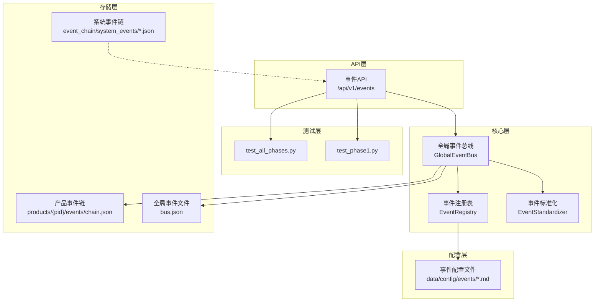
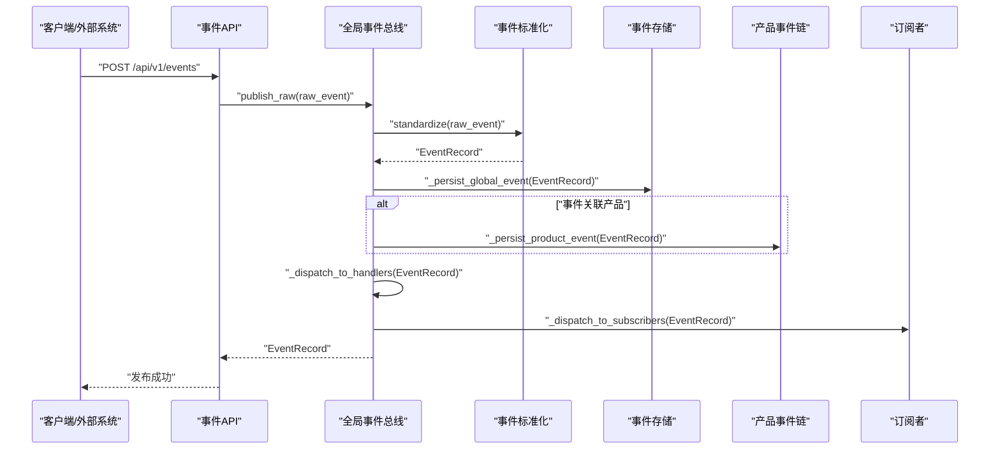
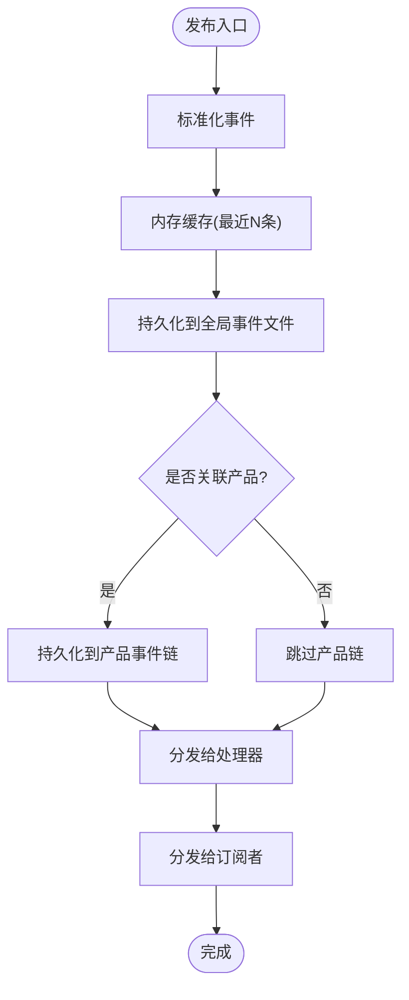
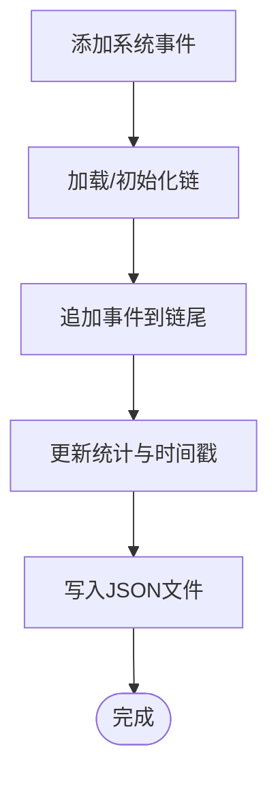
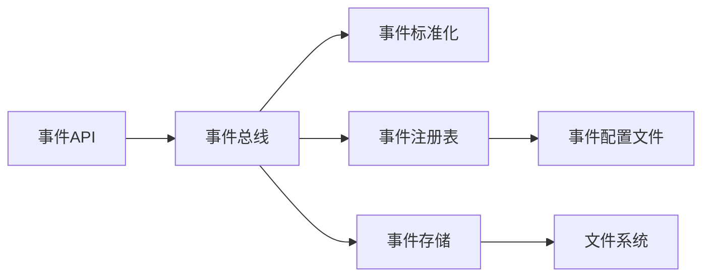

# 事件驱动系统

<cite>
**本文引用的文件**
- [event_bus.py](file://backend/app/core/event_bus.py)
- [events.py](file://backend/app/api/events.py)
- [event_store.py](file://backend/app/storage/event_store.py)
- [schemas.py](file://backend/app/models/schemas.py)
- [test_phase1.py](file://backend/tests/test_phase1.py)
- [test_all_phases.py](file://backend/tests/test_all_phases.py)
- [README.md](file://README.md)
- [后端变更路线图.md](file://后端变更路线图.md)
- [lifecycle_events.md](file://backend/data/config/events/lifecycle_events.md)
- [system_events.md](file://backend/data/config/events/system_events.md)
- [regulation_events.md](file://backend/data/config/events/regulation_events.md)
- [risk_alert_events.md](file://backend/data/config/events/risk_alert_events.md)
- [certification_events.md](file://backend/data/config/events/certification_events.md)
- [order_events.md](file://backend/data/config/events/order_events.md)
- [user_action_events.md](file://backend/data/config/events/user_action_events.md)
- [custom_events.md](file://backend/data/config/events/custom_events.md)
</cite>

## 目录
1. [简介](#简介)
2. [项目结构](#项目结构)
3. [核心组件](#核心组件)
4. [架构总览](#架构总览)
5. [详细组件分析](#详细组件分析)
6. [依赖关系分析](#依赖关系分析)
7. [性能考量](#性能考量)
8. [故障排查指南](#故障排查指南)
9. [结论](#结论)
10. [附录](#附录)

## 简介
本文件为避风港平台事件驱动系统的综合技术文档，围绕“事件总线”“事件链管理”“事件存储”“异步处理”“事件过滤与路由策略”“最佳实践与API参考”六个维度展开，帮助开发者与运维人员快速理解并高效使用该系统。

## 项目结构
事件驱动系统主要由以下层次构成：
- API层：提供事件查询、发布、订阅管理等REST接口
- 核心层：事件总线、事件标准化、订阅分发、处理器注册
- 存储层：全局事件总线文件、产品级事件链、系统事件链
- 配置层：事件类型定义、订阅过滤器Schema、事件注册表
- 测试层：覆盖事件发布、订阅、过滤与路由的关键路径

图表来源
- [event_bus.py:1-354](file://backend/app/core/event_bus.py#L1-L354)
- [events.py:1-108](file://backend/app/api/events.py#L1-L108)
- [event_store.py:59-115](file://backend/app/storage/event_store.py#L59-L115)
- [后端变更路线图.md:467-769](file://后端变更路线图.md#L467-L769)

章节来源
- [event_bus.py:1-354](file://backend/app/core/event_bus.py#L1-L354)
- [events.py:1-108](file://backend/app/api/events.py#L1-L108)
- [event_store.py:59-115](file://backend/app/storage/event_store.py#L59-L115)
- [后端变更路线图.md:467-769](file://后端变更路线图.md#L467-L769)

## 核心组件
- 全局事件总线（GlobalEventBus）：负责事件标准化、持久化、路由到产品级事件链、分发给处理器与订阅者
- 事件标准化（EventStandardizer）：将原始事件转换为标准格式，补充分类与元数据
- 事件注册表（EventRegistry）：集中管理事件类型定义与Schema
- 事件存储（EventStore）：系统事件链与用户事件链的统一存储
- 事件API（/api/v1/events）：提供事件查询、发布、订阅管理等接口

章节来源
- [event_bus.py:148-187](file://backend/app/core/event_bus.py#L148-L187)
- [event_bus.py:189-203](file://backend/app/core/event_bus.py#L189-L203)
- [event_bus.py:205-232](file://backend/app/core/event_bus.py#L205-L232)
- [event_bus.py:292-354](file://backend/app/core/event_bus.py#L292-L354)
- [event_store.py:59-115](file://backend/app/storage/event_store.py#L59-L115)
- [events.py:12-108](file://backend/app/api/events.py#L12-L108)

## 架构总览
事件从外部源产生后，进入事件总线的标准化与持久化流程，并按需路由到产品级事件链；随后分发给已注册的处理器与订阅者。API层提供查询与管理能力，配置层支撑事件类型与订阅策略。

图表来源
- [event_bus.py:150-187](file://backend/app/core/event_bus.py#L150-L187)
- [event_bus.py:294-354](file://backend/app/core/event_bus.py#L294-L354)
- [events.py:26-39](file://backend/app/api/events.py#L26-L39)

章节来源
- [event_bus.py:150-187](file://backend/app/core/event_bus.py#L150-L187)
- [events.py:26-39](file://backend/app/api/events.py#L26-L39)

## 详细组件分析

### 事件总线设计与实现
- 发布流程：标准化 → 内存缓存（最近N条）→ 全局持久化 → 产品级持久化（可选）→ 分发处理器 → 分发订阅者
- 处理器注册：支持按事件类型与“全部事件”两类处理器
- 订阅管理：支持精准、批量、全局、条件四种订阅类型，基于过滤器与通道进行分发
- 统计与时间线：提供事件统计与自然语言时间线，便于前端展示

图表来源
- [event_bus.py:150-187](file://backend/app/core/event_bus.py#L150-L187)
- [event_bus.py:294-354](file://backend/app/core/event_bus.py#L294-L354)
- [event_bus.py:438-472](file://backend/app/core/event_bus.py#L438-L472)

章节来源
- [event_bus.py:148-187](file://backend/app/core/event_bus.py#L148-L187)
- [event_bus.py:189-203](file://backend/app/core/event_bus.py#L189-L203)
- [event_bus.py:205-232](file://backend/app/core/event_bus.py#L205-L232)
- [event_bus.py:266-290](file://backend/app/core/event_bus.py#L266-L290)

### 事件链管理系统
- 事件链存储：系统事件链与用户事件链分别存放于独立目录，支持按链ID读写
- 事件追加：向链尾追加事件并更新统计信息
- 事件查询：通过API获取事件时间线与统计信息

图表来源
- [event_store.py:76-115](file://backend/app/storage/event_store.py#L76-L115)

章节来源
- [event_store.py:59-115](file://backend/app/storage/event_store.py#L59-L115)

### 事件存储机制
- 全局事件：内存缓存最近N条，落盘到全局事件文件，支持归档
- 产品事件：按产品ID隔离存储，独立维护事件链
- 系统事件：系统级事件链，供全局展示与回溯

章节来源
- [event_bus.py:294-354](file://backend/app/core/event_bus.py#L294-L354)
- [event_store.py:59-115](file://backend/app/storage/event_store.py#L59-L115)

### 异步处理模式
- 异步发布：事件发布与持久化均采用异步I/O，避免阻塞
- 并发控制：订阅分发时逐通道发送，单通道异常不影响其他通道
- 错误恢复：持久化失败不阻断事件分发；订阅匹配失败静默忽略
- 性能优化：内存缓存限制大小；批量聚合写入；通道并行发送

章节来源
- [event_bus.py:150-187](file://backend/app/core/event_bus.py#L150-L187)
- [event_bus.py:438-444](file://backend/app/core/event_bus.py#L438-L444)

### 事件过滤与路由策略
- 订阅类型与过滤器
  - 精准订阅：按产品ID精确匹配
  - 批量订阅：按标签集合匹配
  - 全局订阅：按事件类型白名单匹配
  - 条件订阅：按表达式动态匹配事件字段
- 路由策略：事件类型、严重度、产品ID、标签、自定义字段均可参与过滤

章节来源
- [event_bus.py:205-232](file://backend/app/core/event_bus.py#L205-L232)
- [event_bus.py:445-472](file://backend/app/core/event_bus.py#L445-L472)
- [后端变更路线图.md:1787-1819](file://后端变更路线图.md#L1787-L1819)

### 事件API文档与使用示例
- 获取最近事件
  - 方法与路径：GET /api/v1/events
  - 查询参数：limit、category、product_id、severity
  - 返回：事件数组与总数
- 发布事件
  - 方法与路径：POST /api/v1/events
  - 请求体：事件类型、来源、分类、产品ID、业务阶段、数据、严重度
  - 返回：发布的事件记录
- 获取事件时间线
  - 方法与路径：GET /api/v1/events/timeline
  - 查询参数：limit
  - 返回：自然语言时间线
- 获取事件统计
  - 方法与路径：GET /api/v1/events/stats
  - 返回：事件总量、按分类与严重度的分布、订阅数量
- 列出事件定义
  - 方法与路径：GET /api/v1/events/registry
  - 查询参数：stage、category
  - 返回：事件定义列表
- 获取事件定义
  - 方法与路径：GET /api/v1/events/registry/{event_code}
  - 返回：指定事件定义
- 创建订阅
  - 方法与路径：POST /api/v1/events/subscribe
  - 请求体：subscriber、subscription_type、filter、channels
  - 返回：subscription_id
- 取消订阅
  - 方法与路径：DELETE /api/v1/events/subscribe/{sub_id}
  - 返回：成功状态
- 列出订阅
  - 方法与路径：GET /api/v1/events/subscriptions
  - 返回：订阅列表

章节来源
- [events.py:12-108](file://backend/app/api/events.py#L12-L108)

## 依赖关系分析
- 事件API依赖事件总线与事件注册表
- 事件总线依赖事件标准化与事件注册表
- 事件总线与事件存储通过文件系统耦合
- 事件注册表依赖事件配置文件

图表来源
- [events.py:6-8](file://backend/app/api/events.py#L6-L8)
- [event_bus.py:144-146](file://backend/app/core/event_bus.py#L144-L146)
- [event_store.py:59-115](file://backend/app/storage/event_store.py#L59-L115)

章节来源
- [events.py:6-8](file://backend/app/api/events.py#L6-L8)
- [event_bus.py:144-146](file://backend/app/core/event_bus.py#L144-L146)
- [event_store.py:59-115](file://backend/app/storage/event_store.py#L59-L115)

## 性能考量
- 内存缓存：限制最近事件条数，降低查询成本
- 异步I/O：发布与持久化采用异步，提升吞吐
- 并行分发：订阅分发按通道并行，提高响应速度
- 文件写入：批量写入与归档策略减少磁盘压力
- 查询优化：按分类、严重度、产品ID等维度筛选，避免全量扫描

章节来源
- [event_bus.py:138-142](file://backend/app/core/event_bus.py#L138-L142)
- [event_bus.py:150-187](file://backend/app/core/event_bus.py#L150-L187)
- [event_bus.py:438-444](file://backend/app/core/event_bus.py#L438-L444)

## 故障排查指南
- 事件未被持久化
  - 检查全局事件文件写入权限与磁盘空间
  - 查看持久化异常日志（持久化失败不影响分发）
- 订阅未收到事件
  - 核对订阅类型与过滤器配置
  - 确认事件字段与条件表达式匹配
  - 检查订阅通道可用性（如WebSocket连接）
- 事件重复或丢失
  - 核对内存缓存上限与归档策略
  - 检查产品事件链文件完整性
- API返回404（订阅或事件定义不存在）
  - 确认订阅ID或事件编码正确
  - 检查事件注册表配置文件

章节来源
- [event_bus.py:329-331](file://backend/app/core/event_bus.py#L329-L331)
- [events.py:94-101](file://backend/app/api/events.py#L94-L101)
- [后端变更路线图.md:1787-1819](file://后端变更路线图.md#L1787-L1819)

## 结论
避风港平台事件驱动系统以“全局事件总线”为核心，结合“事件标准化”“订阅过滤”“多级存储”与“异步分发”，实现了跨产品、跨用户的事件编排与可视化。通过清晰的API与完善的配置体系，系统既满足高并发场景下的稳定性，又具备良好的可扩展性与可观测性。

## 附录

### 事件类型与配置
- 产品生命周期事件：涵盖创建、状态变更、上架、下架等阶段
- 系统事件：系统运行、告警、维护等
- 法规事件：法规变更、合规提醒等
- 风险预警事件：高风险事件告警
- 认证事件：认证状态变更
- 订单事件：订单相关事件
- 用户行为事件：用户操作与交互
- 自定义事件：支持用户扩展

章节来源
- [lifecycle_events.md](file://backend/data/config/events/lifecycle_events.md)
- [system_events.md](file://backend/data/config/events/system_events.md)
- [regulation_events.md](file://backend/data/config/events/regulation_events.md)
- [risk_alert_events.md](file://backend/data/config/events/risk_alert_events.md)
- [certification_events.md](file://backend/data/config/events/certification_events.md)
- [order_events.md](file://backend/data/config/events/order_events.md)
- [user_action_events.md](file://backend/data/config/events/user_action_events.md)
- [custom_events.md](file://backend/data/config/events/custom_events.md)

### 订阅类型与过滤器Schema
- 订阅类型
  - 精准订阅：按产品ID精确匹配
  - 批量订阅：按标签集合匹配
  - 全局订阅：按事件类型白名单匹配
  - 条件订阅：按表达式匹配事件字段
- 过滤器Schema
  - 支持产品ID列表、事件类型列表、标签集合、条件表达式等

章节来源
- [后端变更路线图.md:1787-1819](file://后端变更路线图.md#L1787-L1819)
- [schemas.py:545-560](file://backend/app/models/schemas.py#L545-L560)

### 测试用例要点（订阅与过滤）
- 精准订阅：返回subscription_id
- 批量订阅：按产品ID与标签集合匹配
- 全局订阅：按事件类型白名单匹配
- 条件订阅：按表达式过滤（如severity == 'critical'）

章节来源
- [test_phase1.py:283-311](file://backend/tests/test_phase1.py#L283-L311)
- [test_all_phases.py:328-350](file://backend/tests/test_all_phases.py#L328-L350)