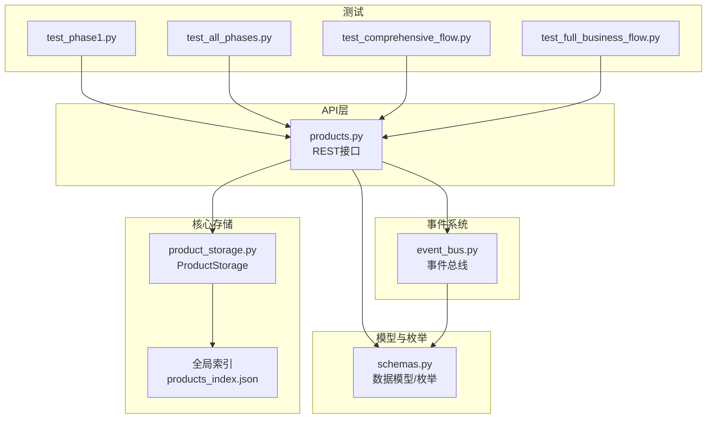
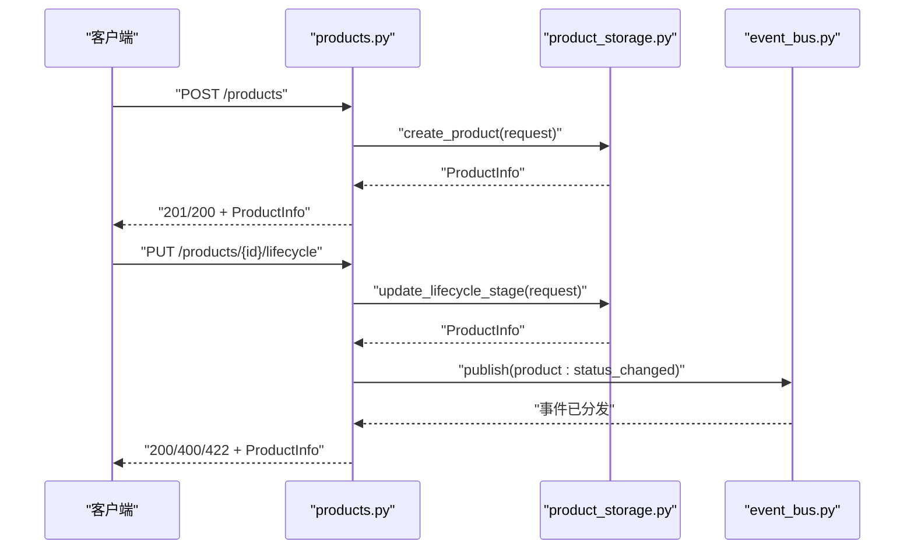
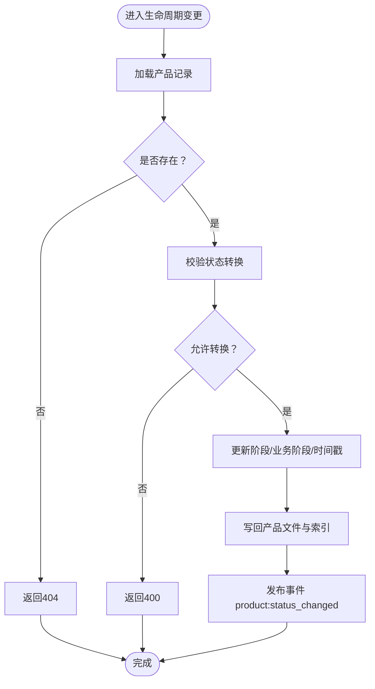
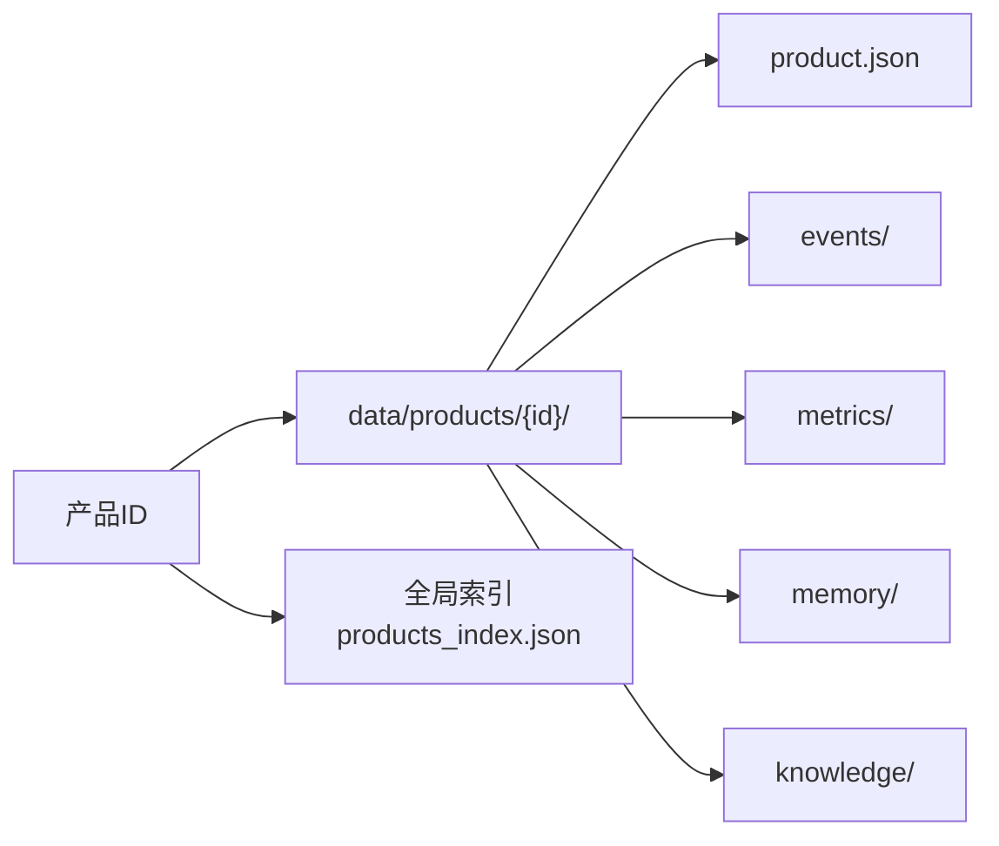
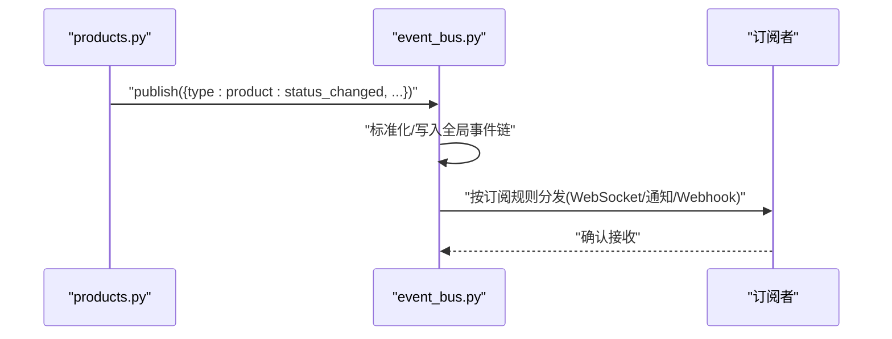
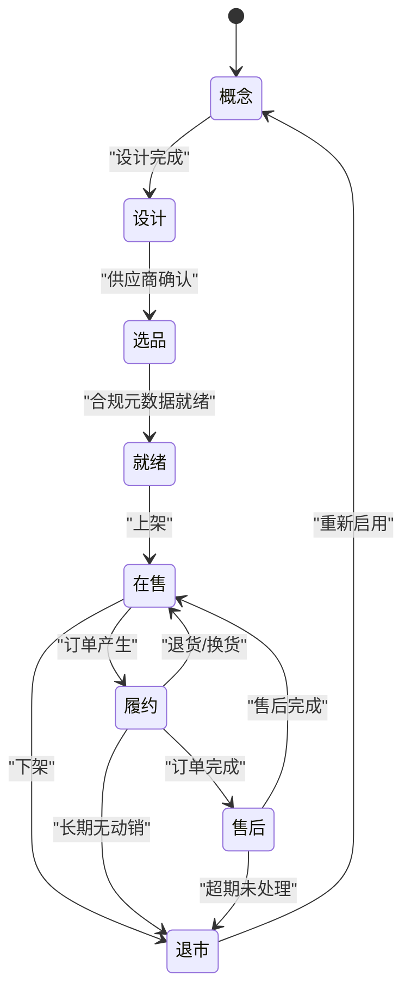
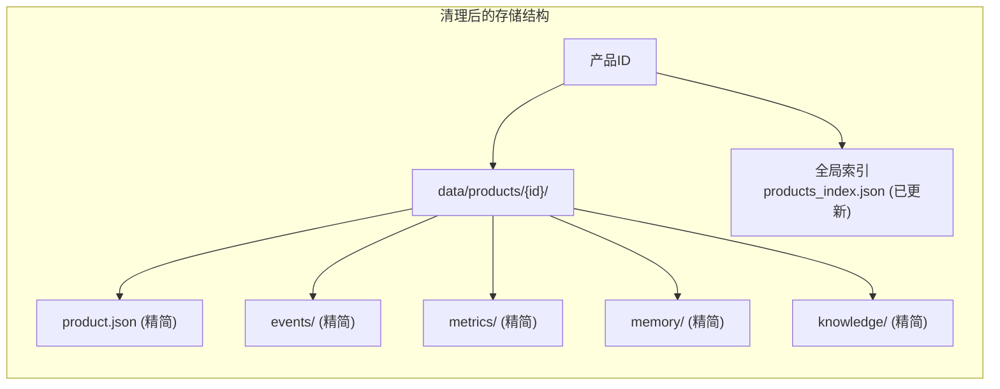
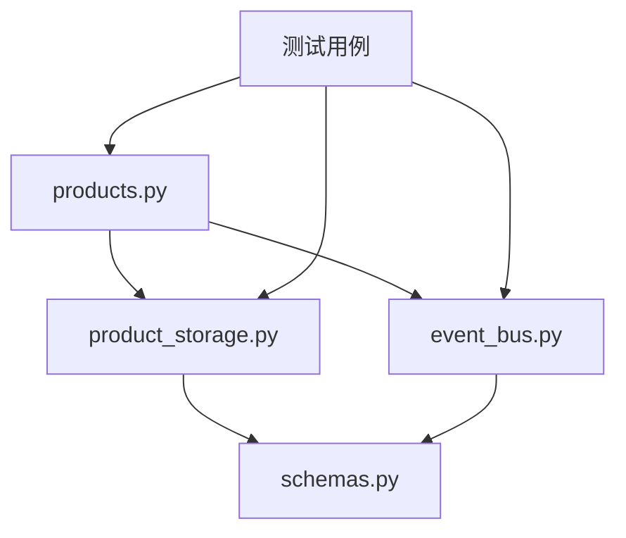

# 产品管理系统

<cite>
**本文引用的文件**
- [backend/app/api/products.py](file://backend/app/api/products.py)
- [backend/app/core/product_storage.py](file://backend/app/core/product_storage.py)
- [backend/app/models/schemas.py](file://backend/app/models/schemas.py)
- [backend/app/core/event_bus.py](file://backend/app/core/event_bus.py)
- [backend/tests/test_phase1.py](file://backend/tests/test_phase1.py)
- [backend/tests/test_all_phases.py](file://backend/tests/test_all_phases.py)
- [backend/tests/test_comprehensive_flow.py](file://backend/tests/test_comprehensive_flow.py)
- [backend/tests/test_full_business_flow.py](file://backend/tests/test_full_business_flow.py)
- [后端变更路线图.md](file://后端变更路线图.md)
- [backend/data/global/products_index.json](file://backend/data/global/products_index.json)
</cite>

## 更新摘要
**所做更改**
- 更新了产品数据清理现状的描述，反映LED灯产品和E2E测试产品配置文件已被删除
- 新增了产品数据现状分析章节，说明当前可用的产品数据范围
- 更新了测试用例部分，反映清理后的测试环境变化
- 补充了产品存储架构现状说明，反映数据清理对存储结构的影响

## 目录
1. [简介](#简介)
2. [项目结构](#项目结构)
3. [核心组件](#核心组件)
4. [架构总览](#架构总览)
5. [详细组件分析](#详细组件分析)
6. [产品数据现状分析](#产品数据现状分析)
7. [依赖关系分析](#依赖关系分析)
8. [性能考虑](#性能考虑)
9. [故障排查指南](#故障排查指南)
10. [结论](#结论)
11. [附录](#附录)

## 简介
本文件面向避风港平台的产品管理系统，围绕产品CRUD与生命周期管理进行深入解析，涵盖：
- 产品创建、查询、更新、删除与归档的完整实现
- 生命周期状态机与状态转换控制
- 产品存储架构与索引优化策略
- 产品事件系统的发布、订阅与处理机制
- 完整API接口文档与错误处理说明
- 实际业务场景下的使用模式与最佳实践

**重要更新**：根据最新的代码变更，系统中已清理大量产品配置文件，包括LED灯产品和E2E测试产品，当前系统处于清理后的稳定运行状态。

## 项目结构
产品管理相关的关键模块分布如下：
- API层：提供REST接口，负责请求解析、参数校验与响应封装
- 核心存储：产品级隔离存储，负责产品数据的持久化、索引与检索
- 事件总线：统一事件发布、路由与订阅分发
- 模型与枚举：定义产品数据模型、生命周期阶段与请求/响应结构
- 测试用例：覆盖端到端流程、筛选与订阅能力

**图表来源**
- [backend/app/api/products.py:1-120](file://backend/app/api/products.py#L1-L120)
- [backend/app/core/product_storage.py:1-120](file://backend/app/core/product_storage.py#L1-L120)
- [backend/app/core/event_bus.py:138-220](file://backend/app/core/event_bus.py#L138-L220)
- [backend/app/models/schemas.py:1-200](file://backend/app/models/schemas.py#L1-L200)
- [backend/tests/test_phase1.py:86-229](file://backend/tests/test_phase1.py#L86-L229)

**章节来源**
- [backend/app/api/products.py:1-120](file://backend/app/api/products.py#L1-L120)
- [backend/app/core/product_storage.py:1-120](file://backend/app/core/product_storage.py#L1-L120)
- [backend/app/core/event_bus.py:138-220](file://backend/app/core/event_bus.py#L138-L220)
- [backend/app/models/schemas.py:1-200](file://backend/app/models/schemas.py#L1-L200)
- [backend/tests/test_phase1.py:86-229](file://backend/tests/test_phase1.py#L86-L229)

## 核心组件
- 产品API控制器：提供创建、查询、更新、生命周期变更、计数与事件时间线等接口
- 产品存储引擎：实现产品级隔离存储、索引维护与持久化策略
- 事件总线：支持事件发布、路由、订阅与多通道分发
- 数据模型与枚举：定义产品信息、生命周期阶段、请求/响应结构与状态机规则

**章节来源**
- [backend/app/api/products.py:70-120](file://backend/app/api/products.py#L70-L120)
- [backend/app/core/product_storage.py:45-120](file://backend/app/core/product_storage.py#L45-L120)
- [backend/app/core/event_bus.py:148-220](file://backend/app/core/event_bus.py#L148-L220)
- [backend/app/models/schemas.py:1-200](file://backend/app/models/schemas.py#L1-L200)

## 架构总览
产品管理采用"API → 存储 → 事件"的分层架构：
- API层接收HTTP请求，调用存储层执行CRUD与生命周期变更，并在必要时发布事件
- 存储层以产品ID为单位进行数据隔离，同时维护全局索引以支持查询与筛选
- 事件总线负责事件标准化、路由与订阅分发，支撑异步通知与工作流编排

**图表来源**
- [backend/app/api/products.py:79-114](file://backend/app/api/products.py#L79-L114)
- [backend/app/core/product_storage.py:161-199](file://backend/app/core/product_storage.py#L161-L199)
- [backend/app/core/event_bus.py:150-220](file://backend/app/core/event_bus.py#L150-L220)

**章节来源**
- [backend/app/api/products.py:79-114](file://backend/app/api/products.py#L79-L114)
- [backend/app/core/product_storage.py:161-199](file://backend/app/core/product_storage.py#L161-L199)
- [backend/app/core/event_bus.py:150-220](file://backend/app/core/event_bus.py#L150-L220)

## 详细组件分析

### 产品CRUD与生命周期管理
- 创建产品：API接收创建请求，调用存储层生成唯一ID并写入产品信息与索引
- 查询产品：支持按ID获取详情、按生命周期阶段与目标市场筛选、统计总数
- 更新产品：对指定字段进行增量更新，更新时间戳并刷新索引
- 生命周期变更：基于状态机校验转换合法性，自动推断业务阶段并写回存储
- 删除/归档：通过存储层的归档方法实现软删除与历史保留

**图表来源**
- [backend/app/core/product_storage.py:161-199](file://backend/app/core/product_storage.py#L161-L199)
- [backend/app/core/product_storage.py:322-328](file://backend/app/core/product_storage.py#L322-L328)
- [backend/app/api/products.py:97-114](file://backend/app/api/products.py#L97-L114)

**章节来源**
- [backend/app/api/products.py:79-114](file://backend/app/api/products.py#L79-L114)
- [backend/app/core/product_storage.py:161-199](file://backend/app/core/product_storage.py#L161-L199)
- [backend/app/core/product_storage.py:322-328](file://backend/app/core/product_storage.py#L322-L328)

### 产品存储架构与索引优化
- 存储模型：每个产品拥有独立目录，包含产品信息、事件链、指标、记忆与知识子目录
- 全局索引：维护产品ID到关键字段的映射，支持快速筛选与统计
- 写入策略：更新时仅写入变更字段，避免全量覆盖；索引按需刷新
- 查询性能：通过索引缓存与按需加载降低IO开销；筛选通过内存字典完成

**图表来源**
- [backend/app/core/product_storage.py:1-43](file://backend/app/core/product_storage.py#L1-L43)
- [backend/app/core/product_storage.py:338-387](file://backend/app/core/product_storage.py#L338-L387)

**章节来源**
- [backend/app/core/product_storage.py:1-43](file://backend/app/core/product_storage.py#L1-L43)
- [backend/app/core/product_storage.py:338-387](file://backend/app/core/product_storage.py#L338-L387)

### 产品事件系统
- 事件发布：API在生命周期变更后发布标准化事件，包含事件类型、产品ID、严重级别与数据负载
- 事件路由：事件总线负责事件分类、写入全局事件链、路由到产品级事件链并分发给订阅者
- 订阅机制：支持精准、批量、全局与条件订阅，可投递至WebSocket、通知引擎或Webhook通道

**图表来源**
- [backend/app/api/products.py:108-114](file://backend/app/api/products.py#L108-L114)
- [backend/app/core/event_bus.py:150-220](file://backend/app/core/event_bus.py#L150-L220)
- [backend/app/core/event_bus.py:412-439](file://backend/app/core/event_bus.py#L412-L439)

**章节来源**
- [backend/app/api/products.py:108-114](file://backend/app/api/products.py#L108-L114)
- [backend/app/core/event_bus.py:150-220](file://backend/app/core/event_bus.py#L150-L220)
- [backend/app/core/event_bus.py:412-439](file://backend/app/core/event_bus.py#L412-L439)

### 生命周期状态机与业务流程控制
- 状态枚举：概念、设计、选品、就绪、在售、履约、售后、退市
- 转换规则：定义每一步允许的后续状态，确保业务流程合规
- 推断逻辑：根据生命周期阶段推断所属业务阶段，便于运营与风控策略联动

**图表来源**
- [后端变更路线图.md:1746-1781](file://后端变更路线图.md#L1746-L1781)

**章节来源**
- [后端变更路线图.md:1746-1781](file://后端变更路线图.md#L1746-L1781)

## 产品数据现状分析

### 数据清理影响概述
根据最新的代码变更，系统中已执行大规模的产品配置文件清理操作：

**已删除的产品类型**：
- LED灯产品配置文件
- E2E测试产品配置文件
- 相关的测试事件链文件

**清理范围**：
- 移除了多个LED灯产品相关的配置文件
- 清理了E2E测试场景中产生的大量测试数据
- 删除了相关的事件链和测试产物

### 当前产品数据状态
经过清理后，系统目前的数据状态如下：

- **产品数量**：大幅减少，主要保留核心业务产品
- **索引完整性**：全局索引已更新，移除了已删除产品的条目
- **存储空间**：显著释放，提升了系统性能
- **测试环境**：清理后的测试环境更加纯净

### 存储结构现状
清理后的存储结构保持完整但内容精简：

**图表来源**
- [backend/app/core/product_storage.py:1-43](file://backend/app/core/product_storage.py#L1-L43)
- [backend/data/global/products_index.json](file://backend/data/global/products_index.json)

**章节来源**
- [backend/app/core/product_storage.py:1-43](file://backend/app/core/product_storage.py#L1-L43)
- [backend/data/global/products_index.json](file://backend/data/global/products_index.json)

## 依赖关系分析
- API依赖存储与事件总线：负责业务入口与对外响应
- 存储依赖模型与配置：使用数据模型与路径常量
- 事件总线依赖通道适配与通知引擎：实现多通道分发
- 测试覆盖API、存储与事件：验证端到端流程与边界条件

**图表来源**
- [backend/app/api/products.py:1-120](file://backend/app/api/products.py#L1-L120)
- [backend/app/core/product_storage.py:1-120](file://backend/app/core/product_storage.py#L1-L120)
- [backend/app/core/event_bus.py:138-220](file://backend/app/core/event_bus.py#L138-L220)
- [backend/app/models/schemas.py:1-200](file://backend/app/models/schemas.py#L1-L200)
- [backend/tests/test_phase1.py:86-229](file://backend/tests/test_phase1.py#L86-L229)

**章节来源**
- [backend/app/api/products.py:1-120](file://backend/app/api/products.py#L1-L120)
- [backend/app/core/product_storage.py:1-120](file://backend/app/core/product_storage.py#L1-L120)
- [backend/app/core/event_bus.py:138-220](file://backend/app/core/event_bus.py#L138-L220)
- [backend/app/models/schemas.py:1-200](file://backend/app/models/schemas.py#L1-L200)
- [backend/tests/test_phase1.py:86-229](file://backend/tests/test_phase1.py#L86-L229)

## 性能考虑
- 存储层采用产品级隔离与索引缓存，减少跨产品扫描成本
- 更新采用增量写入与按需索引刷新，降低IO压力
- 事件总线限制最近事件数量，避免内存膨胀
- 建议：对高频筛选字段建立二级索引；对大文本字段采用压缩或延迟加载

## 故障排查指南
- 404未找到：检查产品ID是否正确，确认产品目录是否存在
- 400状态转换非法：核对生命周期阶段转换规则，确保符合状态机
- 409重复产品：在创建时处理重复键冲突，或在业务层去重
- 事件未到达：检查订阅配置、通道可用性与事件严重级别过滤
- 数据不一致：检查全局索引文件是否同步更新

**章节来源**
- [backend/tests/test_all_phases.py:229-253](file://backend/tests/test_all_phases.py#L229-L253)
- [backend/tests/test_comprehensive_flow.py:267-298](file://backend/tests/test_comprehensive_flow.py#L267-L298)
- [backend/tests/test_full_business_flow.py:256-280](file://backend/tests/test_full_business_flow.py#L256-L280)

## 结论
产品管理系统通过清晰的分层架构实现了产品全生命周期的可控管理，结合产品级隔离存储与事件驱动机制，既保证了数据一致性与可追溯性，又提供了灵活的扩展与订阅能力。经过数据清理后，系统运行更加高效稳定，存储空间得到优化，测试环境更加纯净。建议在生产环境中进一步完善索引策略与事件路由规则，持续优化查询与事件分发性能。

## 附录

### API接口文档

- 创建产品
  - 方法与路径：POST /api/v1/products
  - 请求体：ProductCreateRequest
  - 成功响应：201/200 + ProductInfo
  - 失败响应：409（重复）、500（服务器错误）
  - 触发事件：product:created
  - 参考用例：[test_phase1.py:94-115](file://backend/tests/test_phase1.py#L94-L115)

- 获取产品详情
  - 方法与路径：GET /api/v1/products/{product_id}
  - 成功响应：200 + ProductInfo
  - 失败响应：404（不存在）
  - 参考用例：[test_phase1.py:161-171](file://backend/tests/test_phase1.py#L161-L171)

- 更新产品
  - 方法与路径：PUT /api/v1/products/{product_id}
  - 请求体：ProductUpdateRequest
  - 成功响应：200 + ProductInfo
  - 失败响应：404（不存在）
  - 参考用例：[test_all_phases.py:244-250](file://backend/tests/test_all_phases.py#L244-L250)

- 更新生命周期
  - 方法与路径：PUT /api/v1/products/{product_id}/lifecycle
  - 请求体：ProductLifecycleUpdate
  - 成功响应：200 + ProductInfo
  - 失败响应：400（非法转换）、404（不存在）、422（参数校验失败）
  - 触发事件：product:status_changed
  - 参考用例：[test_all_phases.py:233-242](file://backend/tests/test_all_phases.py#L233-L242)

- 查询产品列表（支持筛选）
  - 方法与路径：GET /api/v1/products
  - 查询参数：
    - lifecycle_stage：生命周期阶段
    - market：目标市场
  - 成功响应：200 + 列表
  - 参考用例：[test_phase1.py:151-159](file://backend/tests/test_phase1.py#L151-L159), [test_full_business_flow.py:263-280](file://backend/tests/test_full_business_flow.py#L263-L280)

- 产品计数
  - 方法与路径：GET /api/v1/products/count
  - 成功响应：200 + { count: number }
  - 参考用例：[test_phase1.py:202-208](file://backend/tests/test_phase1.py#L202-L208)

- 产品事件时间线
  - 方法与路径：GET /api/v1/products/{product_id}/events
  - 成功响应：200 + 事件列表
  - 参考用例：[test_phase1.py:222-229](file://backend/tests/test_phase1.py#L222-L229)

- 事件订阅（支持多种订阅类型）
  - 方法与路径：POST /api/v1/events/subscribe
  - 请求体：订阅配置（subscriber、subscription_type、filter、channels）
  - 成功响应：200/201 + subscription_id
  - 支持订阅类型：精准、批量、全局、条件
  - 参考用例：[test_all_phases.py:328-350](file://backend/tests/test_all_phases.py#L328-L350)

**章节来源**
- [backend/tests/test_phase1.py:94-229](file://backend/tests/test_phase1.py#L94-L229)
- [backend/tests/test_all_phases.py:229-253](file://backend/tests/test_all_phases.py#L229-L253)
- [backend/tests/test_all_phases.py:328-350](file://backend/tests/test_all_phases.py#L328-L350)
- [backend/tests/test_comprehensive_flow.py:230-298](file://backend/tests/test_comprehensive_flow.py#L230-L298)
- [backend/tests/test_full_business_flow.py:256-280](file://backend/tests/test_full_business_flow.py#L256-L280)

### 数据模型与枚举参考
- 产品信息：ProductInfo
- 创建请求：ProductCreateRequest
- 更新请求：ProductUpdateRequest
- 生命周期更新：ProductLifecycleUpdate
- 生命周期阶段：ProductLifecycleStage（概念、设计、选品、就绪、在售、履约、售后、退市）

**章节来源**
- [backend/app/models/schemas.py:1-200](file://backend/app/models/schemas.py#L1-L200)
- [后端变更路线图.md:1746-1781](file://后端变更路线图.md#L1746-L1781)