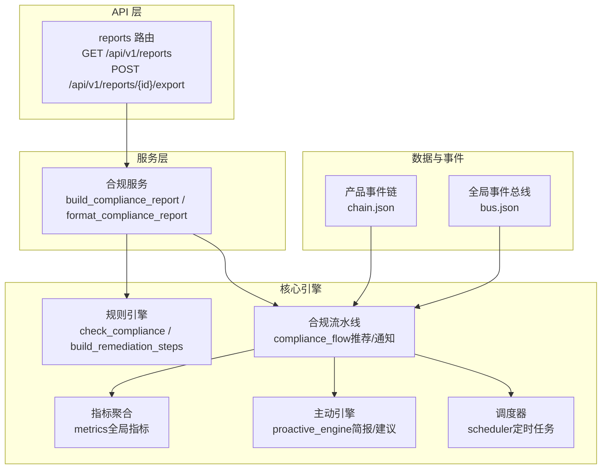
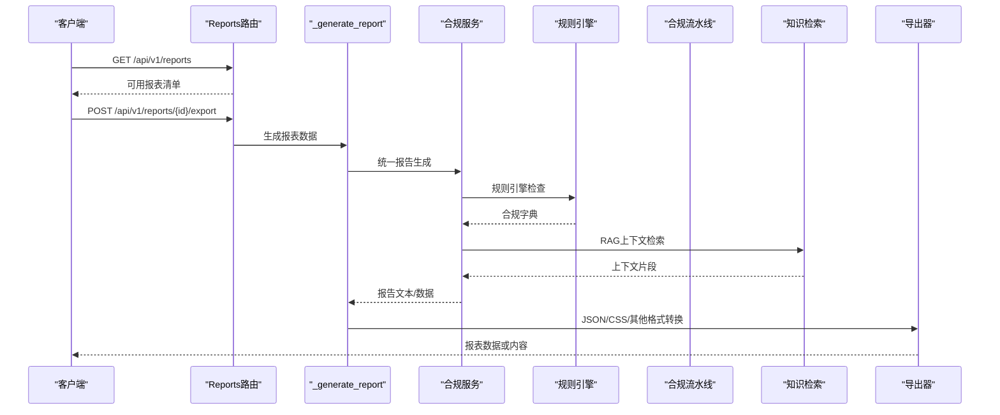
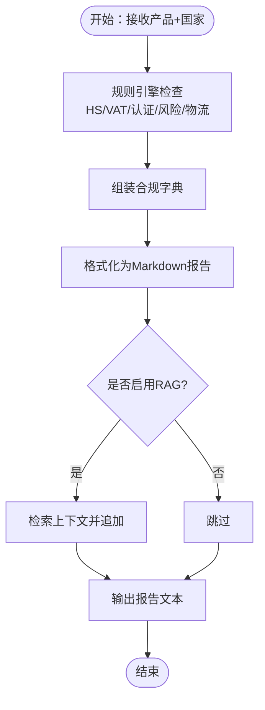
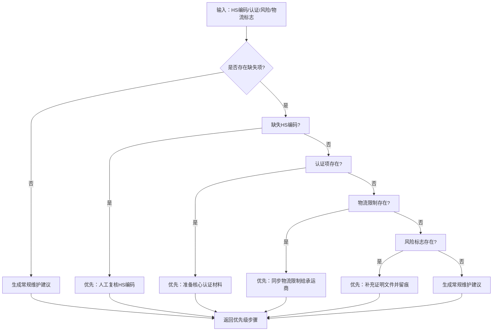
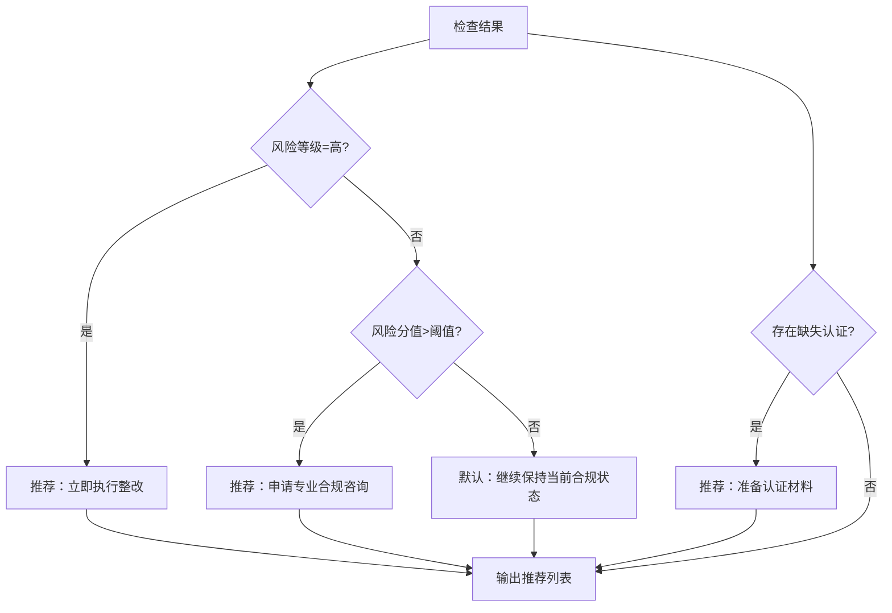
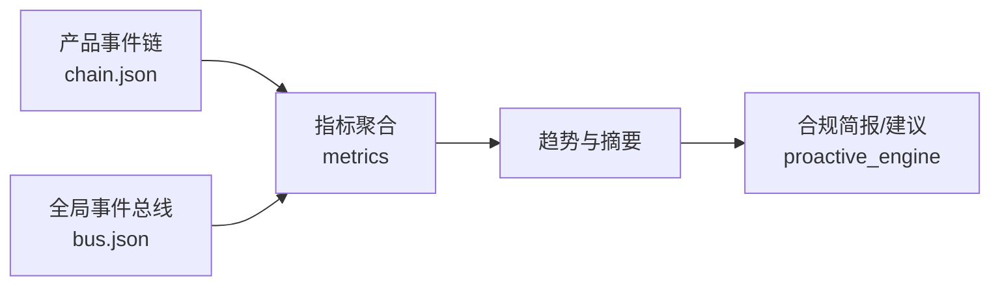
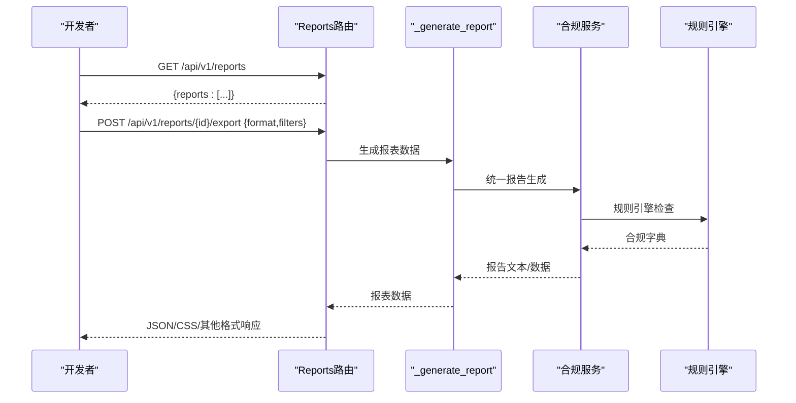
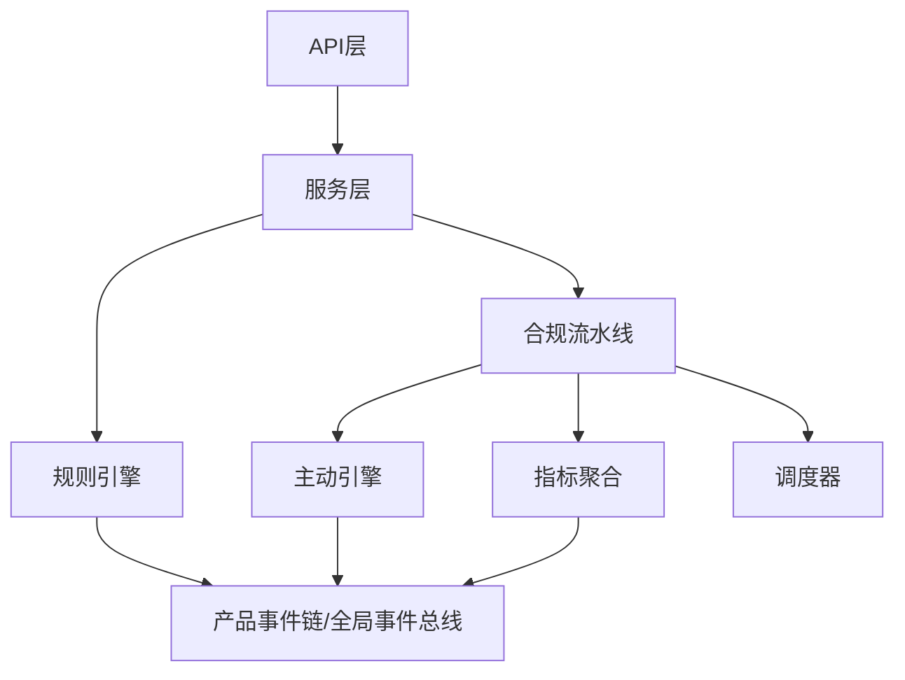

# 合规报告生成

<cite>
**本文引用的文件**
- [backend/app/api/admin.py](file://backend/app/api/admin.py)
- [backend/app/services/compliance.py](file://backend/app/services/compliance.py)
- [backend/app/core/rule_engine.py](file://backend/app/core/rule_engine.py)
- [backend/app/core/compliance_flow.py](file://backend/app/core/compliance_flow.py)
- [backend/app/core/metrics.py](file://backend/app/core/metrics.py)
- [backend/app/core/proactive_engine.py](file://backend/app/core/proactive_engine.py)
- [backend/app/core/scheduler.py](file://backend/app/core/scheduler.py)
- [backend/tests/test_comprehensive_flow.py](file://backend/tests/test_comprehensive_flow.py)
- [backend/tests/test_all_phases.py](file://backend/tests/test_all_phases.py)
- [backend/data/products/p_LED灯_14adc1cc/events/chain.json](file://backend/data/products/p_LED灯_14adc1cc/events/chain.json)
- [backend/data/global/events/bus.json](file://backend/data/global/events/bus.json)
</cite>

## 目录
1. [简介](#简介)
2. [项目结构](#项目结构)
3. [核心组件](#核心组件)
4. [架构总览](#架构总览)
5. [详细组件分析](#详细组件分析)
6. [依赖关系分析](#依赖关系分析)
7. [性能考量](#性能考量)
8. [故障排查指南](#故障排查指南)
9. [结论](#结论)
10. [附录](#附录)

## 简介
本文件面向避风港平台的合规报告生成功能，系统化阐述报告模板体系、检查清单生成机制、合规建议算法、数据聚合与趋势分析、以及报告输出格式与API集成方式。目标是帮助开发者快速理解并扩展报告能力，实现标准化、可定制、可自动化、可审计的合规报告流水线。

## 项目结构
围绕合规报告的关键代码分布在后端API层、服务层、核心引擎与测试用例中，形成“请求入口—业务服务—规则引擎—知识检索—数据聚合—输出导出”的闭环。

图表来源
- [backend/app/api/admin.py:295-347](file://backend/app/api/admin.py#L295-L347)
- [backend/app/services/compliance.py:28-230](file://backend/app/services/compliance.py#L28-L230)
- [backend/app/core/rule_engine.py:176-207](file://backend/app/core/rule_engine.py#L176-L207)
- [backend/app/core/compliance_flow.py:233-303](file://backend/app/core/compliance_flow.py#L233-L303)
- [backend/app/core/metrics.py:200-240](file://backend/app/core/metrics.py#L200-L240)
- [backend/app/core/proactive_engine.py:250-282](file://backend/app/core/proactive_engine.py#L250-L282)
- [backend/app/core/scheduler.py:582-601](file://backend/app/core/scheduler.py#L582-L601)
- [backend/data/products/p_LED灯_14adc1cc/events/chain.json:48-98](file://backend/data/products/p_LED灯_14adc1cc/events/chain.json#L48-L98)
- [backend/data/global/events/bus.json:3749-3803](file://backend/data/global/events/bus.json#L3749-L3803)

章节来源
- [backend/app/api/admin.py:295-347](file://backend/app/api/admin.py#L295-L347)
- [backend/app/services/compliance.py:1-26](file://backend/app/services/compliance.py#L1-L26)

## 核心组件
- 报表API与清单
  - 列表端点返回可用报表类型与支持格式；导出端点根据report_id生成对应报表数据。
- 合规服务
  - 提供统一报告生成入口，封装规则引擎检查、报告格式化、RAG上下文补充与产品ID构建。
- 规则引擎
  - 执行确定性合规检查，产出HS编码、税率、认证要求、风险标志、物流限制等，并生成整改步骤。
- 合规流水线
  - 基于检查结果生成推荐动作（如立即整改、申请咨询、准备认证材料），并触发通知。
- 指标聚合与主动引擎
  - 聚合全局合规指标，生成每日合规简报与建议。
- 调度器
  - 注册定时任务，如跨产品洞察、全局指标聚合等，支撑周期性报告生成。

章节来源
- [backend/app/api/admin.py:298-347](file://backend/app/api/admin.py#L298-L347)
- [backend/app/services/compliance.py:169-230](file://backend/app/services/compliance.py#L169-L230)
- [backend/app/core/rule_engine.py:176-207](file://backend/app/core/rule_engine.py#L176-L207)
- [backend/app/core/compliance_flow.py:233-303](file://backend/app/core/compliance_flow.py#L233-L303)
- [backend/app/core/metrics.py:200-240](file://backend/app/core/metrics.py#L200-L240)
- [backend/app/core/proactive_engine.py:250-282](file://backend/app/core/proactive_engine.py#L250-L282)
- [backend/app/core/scheduler.py:582-601](file://backend/app/core/scheduler.py#L582-L601)

## 架构总览
下图展示从API请求到报告导出的端到端流程，包括数据来源、处理节点与输出形态。

图表来源
- [backend/app/api/admin.py:298-347](file://backend/app/api/admin.py#L298-L347)
- [backend/app/services/compliance.py:169-230](file://backend/app/services/compliance.py#L169-L230)
- [backend/app/core/rule_engine.py:176-207](file://backend/app/core/rule_engine.py#L176-L207)
- [backend/app/core/compliance_flow.py:233-303](file://backend/app/core/compliance_flow.py#L233-L303)

## 详细组件分析

### 报告模板系统与动态填充
- 标准化报告格式
  - 使用Markdown结构化输出，包含标题、商品归类、税率、认证要求、风险提示、物流与运输、清关材料建议等模块。
- 动态内容填充
  - 依据规则引擎返回的合规字典动态拼接字段，如HS编码、风险评分、认证项列表、风险标志、物流限制等。
- 样式定制
  - 采用语义化标题层级与分节，便于前端渲染或后续PDF转换时保持一致的视觉层次。
- RAG上下文补充
  - 在报告末尾追加检索到的法规/政策上下文，增强建议的时效性与权威性。

图表来源
- [backend/app/services/compliance.py:28-62](file://backend/app/services/compliance.py#L28-L62)
- [backend/app/services/compliance.py:169-230](file://backend/app/services/compliance.py#L169-L230)
- [backend/app/core/rule_engine.py:176-207](file://backend/app/core/rule_engine.py#L176-L207)

章节来源
- [backend/app/services/compliance.py:28-62](file://backend/app/services/compliance.py#L28-L62)
- [backend/app/services/compliance.py:169-230](file://backend/app/services/compliance.py#L169-L230)

### 检查清单生成机制
- 关键步骤提取
  - 依据缺失的HS编码、认证项、物流限制、风险标志等，生成优先级整改步骤，确保从高风险到低风险、从必需到辅助的顺序。
- 优先级排序
  - 优先处理缺失HS编码（避免整体路径偏移）、核心认证材料准备、物流限制同步与风险提示补充。
- 完整性验证
  - 通过规则引擎返回的字段集合进行完整性校验，确保报告涵盖所有必要模块。

图表来源
- [backend/app/core/rule_engine.py:176-194](file://backend/app/core/rule_engine.py#L176-L194)

章节来源
- [backend/app/core/rule_engine.py:176-194](file://backend/app/core/rule_engine.py#L176-L194)

### 合规建议生成算法
- 推荐动作生成
  - 当风险等级为高或风险分值超过阈值时，生成“立即执行整改”“申请专业合规咨询”等高置信度动作。
  - 根据缺失的认证项（如CE/认证）推荐“准备认证材料”，并设定技能与预期结果。
- 通知与传播
  - 将推荐动作与检查结果推送到通知引擎，支持多渠道传播与跟踪。

图表来源
- [backend/app/core/compliance_flow.py:249-290](file://backend/app/core/compliance_flow.py#L249-L290)

章节来源
- [backend/app/core/compliance_flow.py:249-290](file://backend/app/core/compliance_flow.py#L249-L290)

### 报告数据聚合逻辑
- 多源数据整合
  - 产品事件链（chain.json）记录合规检查失败、流水线完成等事件；全局事件总线（bus.json）承载系统级事件与告警。
- 统计分析
  - 指标聚合模块计算高风险产品比率、证书到期密度、订单一致性率、平均耗时、拒付率等，并给出趋势判断。
- 趋势预测
  - 主动引擎基于摘要与SDK生成的简报，结合待处理预警数量，提出优先处理建议，形成趋势性洞察。

图表来源
- [backend/data/products/p_LED灯_14adc1cc/events/chain.json:48-98](file://backend/data/products/p_LED灯_14adc1cc/events/chain.json#L48-L98)
- [backend/data/global/events/bus.json:3749-3803](file://backend/data/global/events/bus.json#L3749-L3803)
- [backend/app/core/metrics.py:200-240](file://backend/app/core/metrics.py#L200-L240)
- [backend/app/core/proactive_engine.py:250-282](file://backend/app/core/proactive_engine.py#L250-L282)

章节来源
- [backend/app/core/metrics.py:200-240](file://backend/app/core/metrics.py#L200-L240)
- [backend/app/core/proactive_engine.py:250-282](file://backend/app/core/proactive_engine.py#L250-L282)
- [backend/data/products/p_LED灯_14adc1cc/events/chain.json:48-98](file://backend/data/products/p_LED灯_14adc1cc/events/chain.json#L48-L98)
- [backend/data/global/events/bus.json:3749-3803](file://backend/data/global/events/bus.json#L3749-L3803)

### 报告输出格式支持
- JSON
  - 直接返回结构化数据，便于前端渲染或二次处理。
- CSV
  - 对列表型报表数据进行序列化输出，适配表格展示与导入。
- PDF/Excel（扩展）
  - 导出器对未知格式返回“数据已就绪，等待转换”，开发者可在此基础上接入PDF/Excel转换库，实现统一导出通道。

章节来源
- [backend/app/api/admin.py:331-346](file://backend/app/api/admin.py#L331-L346)

### 报告生成API与集成示例
- API清单
  - GET /api/v1/reports：返回可用报表清单（含ID、名称、描述、支持格式）。
  - POST /api/v1/reports/{report_id}/export：导出指定报表，支持JSON/CSS/其他格式。
- 集成要点
  - 使用报表清单端点发现可用报表与格式；
  - 调用导出端点传入过滤条件与格式参数；
  - 对于复杂格式（PDF/Excel），在导出端点返回数据后进行二次转换。

图表来源
- [backend/app/api/admin.py:298-347](file://backend/app/api/admin.py#L298-L347)
- [backend/app/services/compliance.py:169-230](file://backend/app/services/compliance.py#L169-L230)
- [backend/app/core/rule_engine.py:176-207](file://backend/app/core/rule_engine.py#L176-L207)

章节来源
- [backend/app/api/admin.py:298-347](file://backend/app/api/admin.py#L298-L347)
- [backend/tests/test_all_phases.py:1046-1063](file://backend/tests/test_all_phases.py#L1046-L1063)
- [backend/tests/test_openapi_contract.py:422-427](file://backend/tests/test_openapi_contract.py#L422-L427)

## 依赖关系分析
- 松耦合设计
  - API层仅负责路由与格式化输出，业务逻辑集中在服务层；服务层依赖规则引擎与合规流水线，二者通过事件与指标相互解耦。
- 数据流依赖
  - 产品事件链与全局事件总线为指标聚合与简报生成提供事实依据；规则引擎与RAG共同决定报告内容与建议质量。
- 外部依赖
  - PDF/Excel导出依赖外部转换器；知识检索依赖知识存储；通知引擎依赖通知规则配置。

图表来源
- [backend/app/api/admin.py:295-347](file://backend/app/api/admin.py#L295-L347)
- [backend/app/services/compliance.py:1-26](file://backend/app/services/compliance.py#L1-L26)
- [backend/app/core/rule_engine.py:176-207](file://backend/app/core/rule_engine.py#L176-L207)
- [backend/app/core/compliance_flow.py:233-303](file://backend/app/core/compliance_flow.py#L233-L303)
- [backend/app/core/metrics.py:200-240](file://backend/app/core/metrics.py#L200-L240)
- [backend/app/core/proactive_engine.py:250-282](file://backend/app/core/proactive_engine.py#L250-L282)
- [backend/app/core/scheduler.py:582-601](file://backend/app/core/scheduler.py#L582-L601)
- [backend/data/products/p_LED灯_14adc1cc/events/chain.json:48-98](file://backend/data/products/p_LED灯_14adc1cc/events/chain.json#L48-L98)
- [backend/data/global/events/bus.json:3749-3803](file://backend/data/global/events/bus.json#L3749-L3803)

章节来源
- [backend/app/api/admin.py:295-347](file://backend/app/api/admin.py#L295-L347)
- [backend/app/services/compliance.py:1-26](file://backend/app/services/compliance.py#L1-L26)

## 性能考量
- 异步与超时控制
  - 知识检索设置超时保护，避免阻塞导出流程；合规流水线中的通知与RAG调用应考虑异步化与降级策略。
- 批量与缓存
  - 指标聚合与报表生成可引入缓存与批量处理，减少重复计算；对高频查询结果进行短期缓存。
- 输出优化
  - JSON/CSS导出直接返回结构化数据，避免不必要的中间格式转换；PDF/Excel转换建议在后置队列中异步执行。

## 故障排查指南
- 报表导出失败
  - 检查报表ID是否在可用清单中；确认导出端点返回的错误信息；核对过滤条件与格式参数。
- 报告内容为空或不完整
  - 核查规则引擎是否抛出异常并回退为空合规字典；确认RAG检索是否成功；检查产品事件链与全局事件总线是否存在关键事件。
- 性能问题
  - 关注知识检索超时与合规流水线阻塞点；对高频报表增加缓存与限流；优化指标聚合算法的时间复杂度。

章节来源
- [backend/app/api/admin.py:324-347](file://backend/app/api/admin.py#L324-L347)
- [backend/app/services/compliance.py:141-166](file://backend/app/services/compliance.py#L141-L166)
- [backend/app/core/compliance_flow.py:233-245](file://backend/app/core/compliance_flow.py#L233-L245)

## 结论
避风港平台的合规报告生成功能以“规则引擎+合规流水线+知识检索+指标聚合+主动引擎”为核心，实现了从数据到报告的自动化闭环。通过标准化模板、动态填充与优先级建议，既能满足日常合规管理需求，也为扩展高级格式与智能分析提供了清晰的架构边界与扩展点。

## 附录
- 测试覆盖
  - 报表列表与导出端点的契约测试；合规流水线阶段数、健康度与指标隔离的综合测试，验证了报告生成与聚合的稳定性与正确性。

章节来源
- [backend/tests/test_all_phases.py:1046-1063](file://backend/tests/test_all_phases.py#L1046-L1063)
- [backend/tests/test_comprehensive_flow.py:516-1371](file://backend/tests/test_comprehensive_flow.py#L516-L1371)