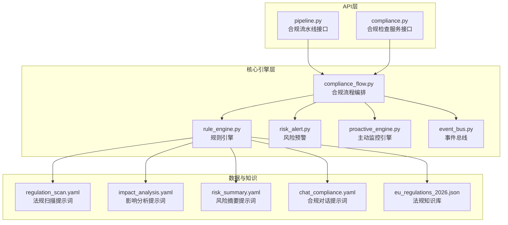
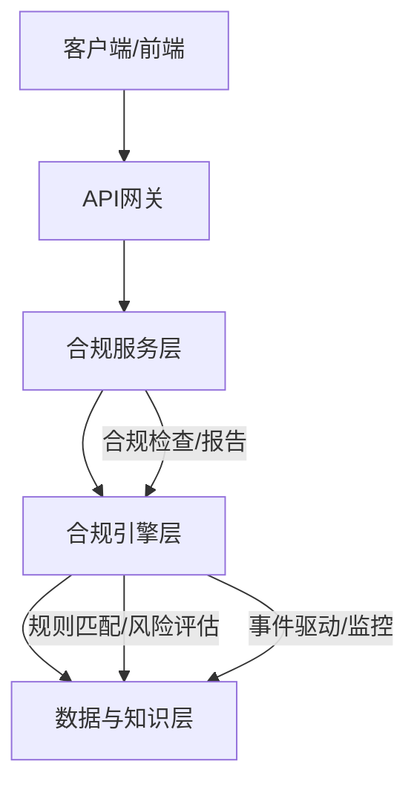
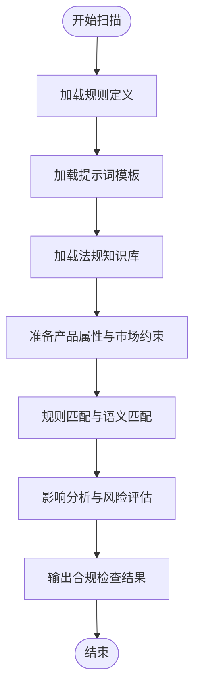
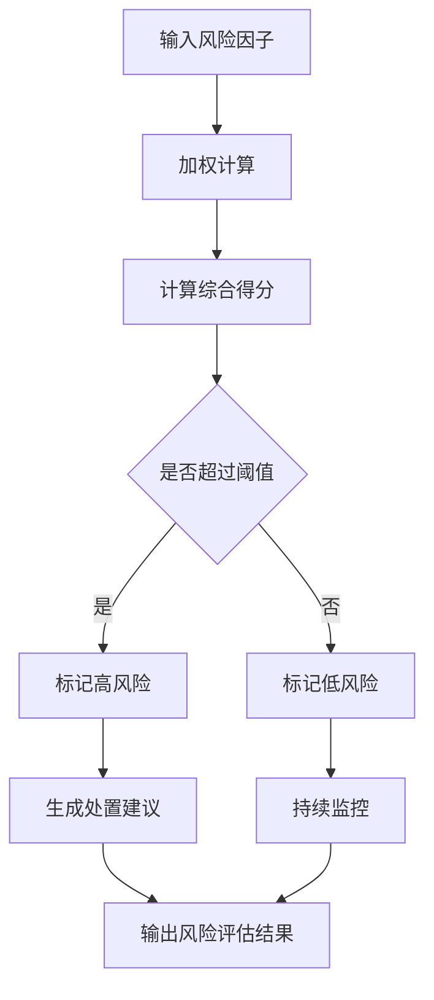
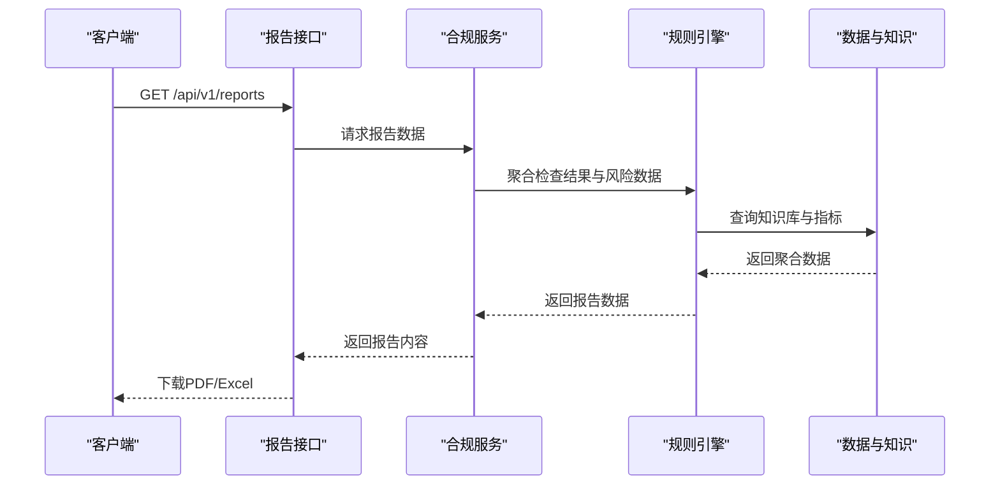
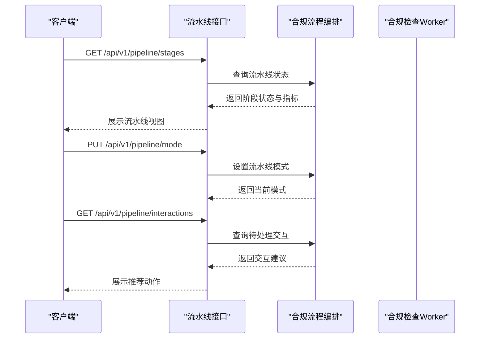
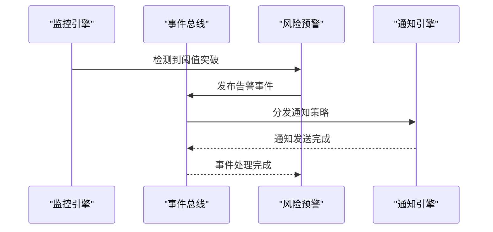
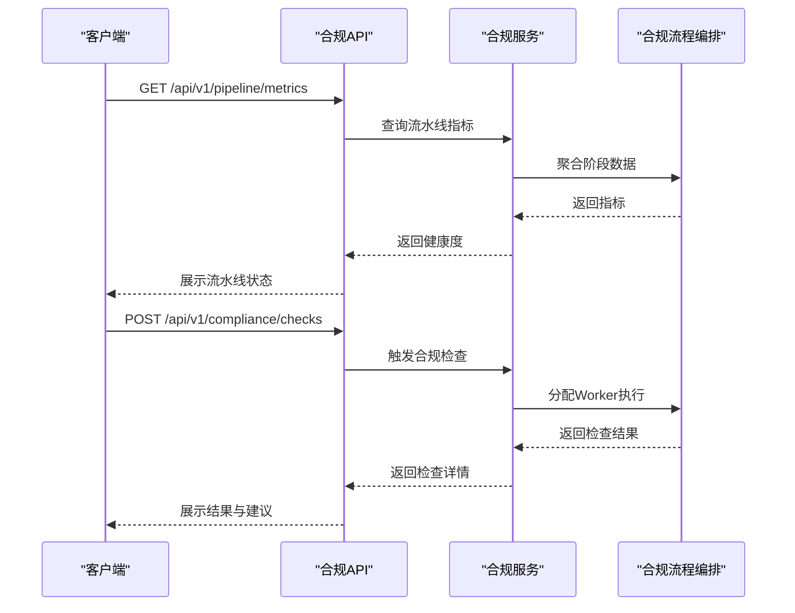
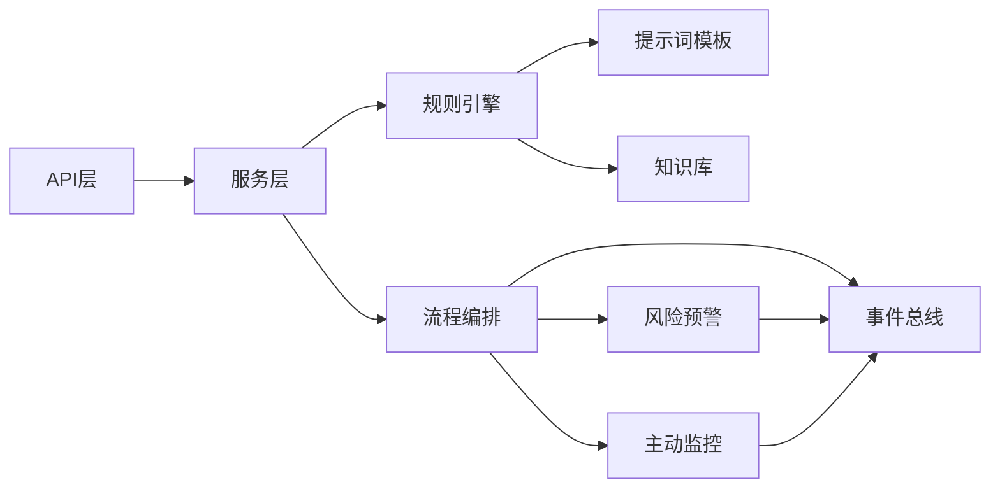

# 合规检查系统

<cite>
**本文档引用的文件**
- [后端变更路线图.md](file://后端变更路线图.md)
- [compliance_flow.py](file://backend/app/core/compliance_flow.py)
- [rule_engine.py](file://backend/app/core/rule_engine.py)
- [risk_alert.py](file://backend/app/core/risk_alert.py)
- [compliance.py](file://backend/app/services/compliance.py)
- [pipeline.py](file://backend/app/api/pipeline.py)
- [proactive_engine.py](file://backend/app/core/proactive_engine.py)
- [event_bus.py](file://backend/app/core/event_bus.py)
- [test_comprehensive_flow.py](file://backend/tests/test_comprehensive_flow.py)
- [regulation_scan.yaml](file://backend/data/prompts/regulation_scan.yaml)
- [impact_analysis.yaml](file://backend/data/prompts/impact_analysis.yaml)
- [risk_summary.yaml](file://backend/data/prompts/risk_summary.yaml)
- [chat_compliance.yaml](file://backend/data/prompts/chat_compliance.yaml)
- [eu_regulations_2026.json](file://backend/data/chroma/eu_regulations_2026.json)
- [eu_regulations_2026.json](file://backend/data/chroma/eu_regulations_2026.json)
- [eu_regulations_2026.json](file://backend/data/chroma/eu_regulations_2026.json)
</cite>

## 目录
1. [引言](#引言)
2. [项目结构](#项目结构)
3. [核心组件](#核心组件)
4. [架构概览](#架构概览)
5. [详细组件分析](#详细组件分析)
6. [依赖关系分析](#依赖关系分析)
7. [性能考虑](#性能考虑)
8. [故障排除指南](#故障排除指南)
9. [结论](#结论)
10. [附录](#附录)

## 引言
本文件为避风港平台的合规检查系统提供综合性技术文档。系统围绕法规扫描引擎、风险评估算法、合规报告生成、流程编排与监控预警五大核心能力构建，旨在为跨境电商业务提供自动化、可扩展、可观测的合规保障体系。

## 项目结构
后端采用模块化分层设计，关键合规相关模块分布如下：
- 核心引擎层：合规流程编排、规则引擎、风险预警、主动监控
- 服务层：合规检查服务封装
- API层：合规流水线、合规检查、规则管理、报告导出等对外接口
- 数据与知识：法规知识库、事件总线、全局指标与记忆

**图表来源**
- [pipeline.py:37-75](file://backend/app/api/pipeline.py#L37-L75)
- [compliance.py](file://backend/app/services/compliance.py)
- [compliance_flow.py](file://backend/app/core/compliance_flow.py)
- [rule_engine.py](file://backend/app/core/rule_engine.py)
- [risk_alert.py](file://backend/app/core/risk_alert.py)
- [proactive_engine.py:84-117](file://backend/app/core/proactive_engine.py#L84-L117)
- [event_bus.py:633-654](file://backend/app/core/event_bus.py#L633-L654)
- [regulation_scan.yaml](file://backend/data/prompts/regulation_scan.yaml)
- [impact_analysis.yaml](file://backend/data/prompts/impact_analysis.yaml)
- [risk_summary.yaml](file://backend/data/prompts/risk_summary.yaml)
- [chat_compliance.yaml](file://backend/data/prompts/chat_compliance.yaml)
- [eu_regulations_2026.json](file://backend/data/chroma/eu_regulations_2026.json)

**章节来源**
- [后端变更路线图.md:2570-2792](file://后端变更路线图.md#L2570-L2792)
- [pipeline.py:37-75](file://backend/app/api/pipeline.py#L37-L75)
- [compliance_flow.py](file://backend/app/core/compliance_flow.py)
- [rule_engine.py](file://backend/app/core/rule_engine.py)
- [risk_alert.py](file://backend/app/core/risk_alert.py)
- [proactive_engine.py:84-117](file://backend/app/core/proactive_engine.py#L84-L117)
- [event_bus.py:633-654](file://backend/app/core/event_bus.py#L633-L654)

## 核心组件
- 法规扫描引擎：基于规则引擎与提示词模板，对产品属性与市场约束进行匹配，输出合规检查结果与影响分析。
- 风险评估算法：结合多维风险因子（认证状态、法规变更、指标异常）计算风险分值，进行等级判定与处置建议。
- 合规报告生成：聚合检查结果、风险汇总与处置记录，支持PDF/Excel导出。
- 合规流程编排：以10阶段流水线为核心，串联各Worker与检查项，提供模式切换、交互推荐与状态跟踪。
- 风险监控与预警：基于阈值与规则触发事件，通过事件总线分发通知策略，实现跨产品洞察与主动提醒。

**章节来源**
- [后端变更路线图.md:2570-2792](file://后端变更路线图.md#L2570-L2792)
- [compliance_flow.py](file://backend/app/core/compliance_flow.py)
- [rule_engine.py](file://backend/app/core/rule_engine.py)
- [risk_alert.py](file://backend/app/core/risk_alert.py)
- [proactive_engine.py:84-117](file://backend/app/core/proactive_engine.py#L84-L117)
- [event_bus.py:633-654](file://backend/app/core/event_bus.py#L633-L654)

## 架构概览
系统采用"服务-引擎-数据"三层架构，API层负责对外暴露能力，核心引擎层承载业务逻辑，数据与知识层提供规则、提示词与知识库支撑。

**图表来源**
- [后端变更路线图.md:2570-2792](file://后端变更路线图.md#L2570-L2792)
- [compliance.py](file://backend/app/services/compliance.py)
- [compliance_flow.py](file://backend/app/core/compliance_flow.py)
- [rule_engine.py](file://backend/app/core/rule_engine.py)
- [risk_alert.py](file://backend/app/core/risk_alert.py)

## 详细组件分析

### 法规扫描引擎
- 数据结构
  - 规则定义：通过规则引擎加载与执行，支持条件表达式与权重配置。
  - 提示词模板：包含法规扫描、影响分析、风险摘要与合规对话等模板，驱动LLM进行语义匹配与推理。
  - 知识库：法规知识库以JSON形式存储，支持按市场/品类检索与向量化检索。
- 匹配算法
  - 产品属性与市场约束输入，经规则引擎解析为布尔条件或数值阈值。
  - 结合提示词模板与知识库，进行语义相似度匹配与影响范围评估。
- 扫描策略
  - 周期性扫描：基于主动监控引擎定期拉取新法规并触发扫描。
  - 事件驱动：法规生效、指标异常等事件触发即时扫描。

**图表来源**
- [rule_engine.py](file://backend/app/core/rule_engine.py)
- [regulation_scan.yaml](file://backend/data/prompts/regulation_scan.yaml)
- [impact_analysis.yaml](file://backend/data/prompts/impact_analysis.yaml)
- [eu_regulations_2026.json](file://backend/data/chroma/eu_regulations_2026.json)

**章节来源**
- [rule_engine.py](file://backend/app/core/rule_engine.py)
- [regulation_scan.yaml](file://backend/data/prompts/regulation_scan.yaml)
- [impact_analysis.yaml](file://backend/data/prompts/impact_analysis.yaml)
- [eu_regulations_2026.json](file://backend/data/chroma/eu_regulations_2026.json)

### 风险评估算法
- 风险因子
  - 认证状态：如WEEE、CE等证书有效期与状态。
  - 法规变更：新法规对产品的影响程度与覆盖范围。
  - 指标异常：销售、退款、拒付等关键指标偏离阈值。
- 权重分配
  - 不同因子根据严重程度赋予不同权重，支持动态调整。
- 风险等级判定
  - 综合得分映射到低/中/高风险等级，并生成处置建议与升级策略。

**图表来源**
- [risk_alert.py](file://backend/app/core/risk_alert.py)
- [proactive_engine.py:84-117](file://backend/app/core/proactive_engine.py#L84-L117)

**章节来源**
- [risk_alert.py](file://backend/app/core/risk_alert.py)
- [proactive_engine.py:84-117](file://backend/app/core/proactive_engine.py#L84-L117)

### 合规报告生成机制
- 报告模板
  - 使用风险摘要与合规对话提示词模板，确保报告结构化与一致性。
- 数据聚合
  - 聚合各阶段检查结果、风险汇总、处置记录与指标趋势。
- 输出格式
  - 支持PDF与Excel导出，便于审计与汇报。

**图表来源**
- [后端变更路线图.md:2599-2602](file://后端变更路线图.md#L2599-L2602)
- [risk_summary.yaml](file://backend/data/prompts/risk_summary.yaml)
- [chat_compliance.yaml](file://backend/data/prompts/chat_compliance.yaml)

**章节来源**
- [后端变更路线图.md:2599-2602](file://后端变更路线图.md#L2599-L2602)
- [risk_summary.yaml](file://backend/data/prompts/risk_summary.yaml)
- [chat_compliance.yaml](file://backend/data/prompts/chat_compliance.yaml)

### 合规流程编排系统
- 流程定义
  - 10阶段流水线：涵盖建站、选品、供应商、上架、支付、订单、报关、清关、售后、财务等阶段。
  - Worker职责：合规检查Worker在全阶段执行规则执行与风险评估。
- 执行控制
  - 支持5步/6步模式切换，动态调整检查强度。
  - 待处理交互推荐：基于当前状态推荐下一步动作。
- 状态跟踪
  - 记录各阶段通过率、风险产品数与待办数量，提供整体健康度指标。

**图表来源**
- [pipeline.py:37-75](file://backend/app/api/pipeline.py#L37-L75)
- [compliance_flow.py](file://backend/app/core/compliance_flow.py)
- [后端变更路线图.md:816-816](file://后端变更路线图.md#L816-L816)

**章节来源**
- [pipeline.py:37-75](file://backend/app/api/pipeline.py#L37-L75)
- [compliance_flow.py](file://backend/app/core/compliance_flow.py)
- [后端变更路线图.md:816-816](file://后端变更路线图.md#L816-L816)

### 风险监控与预警机制
- 阈值设置
  - 关键指标阈值可配置，支持动态调整。
- 告警规则
  - 基于事件总线定义告警事件类型，如"新法规生效"、"风险阈值突破"、"指标异常"等。
- 通知策略
  - 通过事件总线分发到仪表盘、邮件、IM等通知渠道。

**图表来源**
- [event_bus.py:633-654](file://backend/app/core/event_bus.py#L633-L654)
- [risk_alert.py](file://backend/app/core/risk_alert.py)
- [proactive_engine.py:84-117](file://backend/app/core/proactive_engine.py#L84-L117)

**章节来源**
- [event_bus.py:633-654](file://backend/app/core/event_bus.py#L633-L654)
- [risk_alert.py](file://backend/app/core/risk_alert.py)
- [proactive_engine.py:84-117](file://backend/app/core/proactive_engine.py#L84-L117)

### 合规检查API文档与使用示例
- API总览
  - 合规流水线：获取阶段状态、设置流水线模式、查询待处理交互。
  - 合规检查：执行检查、查询检查详情、重新检查。
  - 规则管理：查询规则列表、更新规则。
  - 报表导出：列出报表、导出PDF/Excel。
- 使用示例
  - 获取流水线健康度指标与阶段统计。
  - 执行合规检查并获取结果。
  - 导出月度合规报告。

**图表来源**
- [后端变更路线图.md:2585-2598](file://后端变更路线图.md#L2585-L2598)
- [pipeline.py:37-75](file://backend/app/api/pipeline.py#L37-L75)
- [compliance.py](file://backend/app/services/compliance.py)

**章节来源**
- [后端变更路线图.md:2585-2598](file://后端变更路线图.md#L2585-L2598)
- [pipeline.py:37-75](file://backend/app/api/pipeline.py#L37-L75)
- [compliance.py](file://backend/app/services/compliance.py)

## 依赖关系分析
合规系统各模块间存在清晰的依赖关系：API层依赖服务层；服务层依赖流程编排与规则引擎；规则引擎依赖提示词模板与知识库；事件总线贯穿监控与通知；主动监控引擎提供周期性任务与洞察。

**图表来源**
- [pipeline.py:37-75](file://backend/app/api/pipeline.py#L37-L75)
- [compliance.py](file://backend/app/services/compliance.py)
- [compliance_flow.py](file://backend/app/core/compliance_flow.py)
- [rule_engine.py](file://backend/app/core/rule_engine.py)
- [risk_alert.py](file://backend/app/core/risk_alert.py)
- [proactive_engine.py:84-117](file://backend/app/core/proactive_engine.py#L84-L117)
- [event_bus.py:633-654](file://backend/app/core/event_bus.py#L633-L654)

**章节来源**
- [pipeline.py:37-75](file://backend/app/api/pipeline.py#L37-L75)
- [compliance.py](file://backend/app/services/compliance.py)
- [compliance_flow.py](file://backend/app/core/compliance_flow.py)
- [rule_engine.py](file://backend/app/core/rule_engine.py)
- [risk_alert.py](file://backend/app/core/risk_alert.py)
- [proactive_engine.py:84-117](file://backend/app/core/proactive_engine.py#L84-L117)
- [event_bus.py:633-654](file://backend/app/core/event_bus.py#L633-L654)

## 性能考虑
- 规则引擎优化：缓存规则解析结果与热点数据，减少重复计算。
- 知识库检索：对高频查询建立索引，支持向量化检索加速。
- 并发控制：合理设置Worker并发度与资源限制，避免资源争用。
- 监控与告警：通过主动监控引擎定期自检，及时发现性能瓶颈。

## 故障排除指南
- 系统心跳自检：检查事件总线、规则引擎、代理注册表、内存树等组件健康状态。
- 认证到期预警：核对证书有效期与预警阈值，确认通知策略是否正确分发。
- 流水线状态异常：检查阶段通过率、风险产品数与待办数量，定位瓶颈环节。
- 规则执行失败：验证规则定义、提示词模板与知识库完整性，确认错误日志。

**章节来源**
- [test_comprehensive_flow.py:810-828](file://backend/tests/test_comprehensive_flow.py#L810-L828)
- [test_comprehensive_flow.py:795-808](file://backend/tests/test_comprehensive_flow.py#L795-L808)
- [event_bus.py:633-654](file://backend/app/core/event_bus.py#L633-L654)

## 结论
避风港平台的合规检查系统通过规则引擎、风险评估、流程编排与主动监控的协同，实现了从法规扫描到风险处置再到报告输出的闭环。系统具备良好的扩展性与可观测性，能够满足跨境电商业务在复杂监管环境下的合规需求。

## 附录
- Worker配置示例：合规检查Worker在全阶段执行规则执行与风险评估，优先级为3，资源限制为CPU 2核、内存2Gi。
- API路由总览：涵盖产品管理、合规流水线、合规检查、规则管理、报表导出、事件管理、指标监控、通知管理等接口。

**章节来源**
- [后端变更路线图.md:816-816](file://后端变更路线图.md#L816-L816)
- [后端变更路线图.md:2570-2792](file://后端变更路线图.md#L2570-L2792)