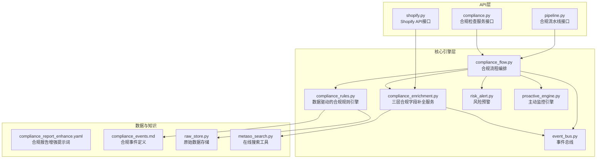
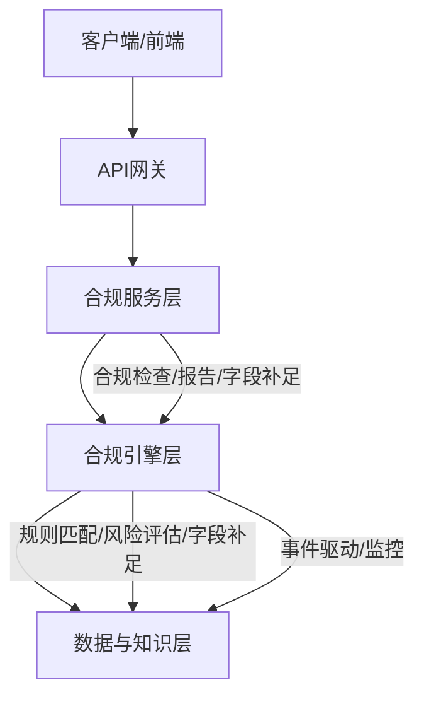
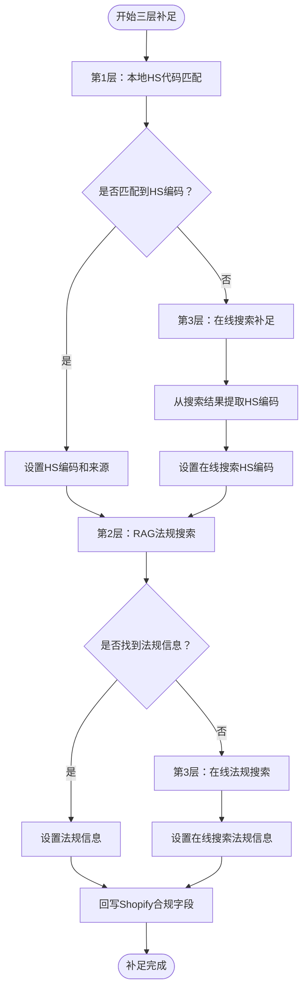
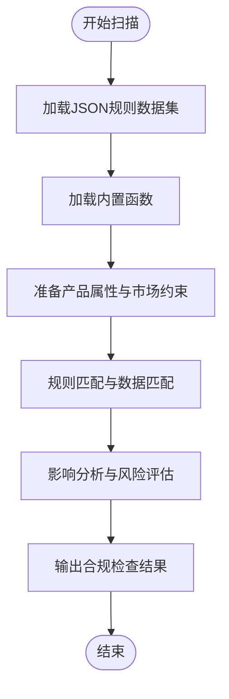
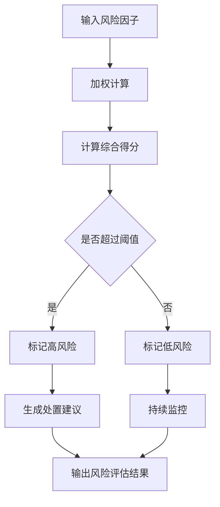
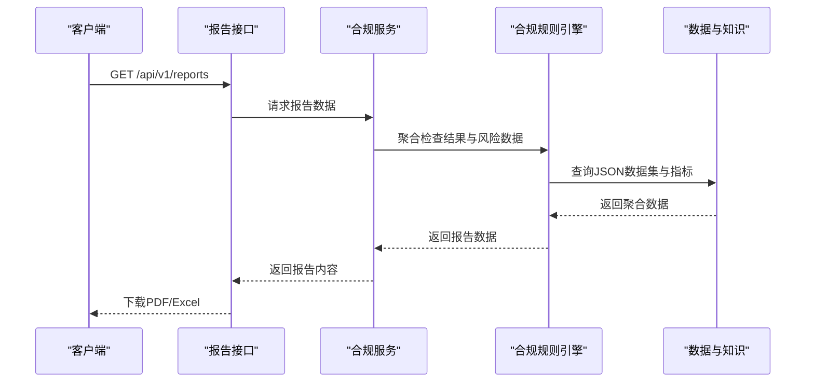
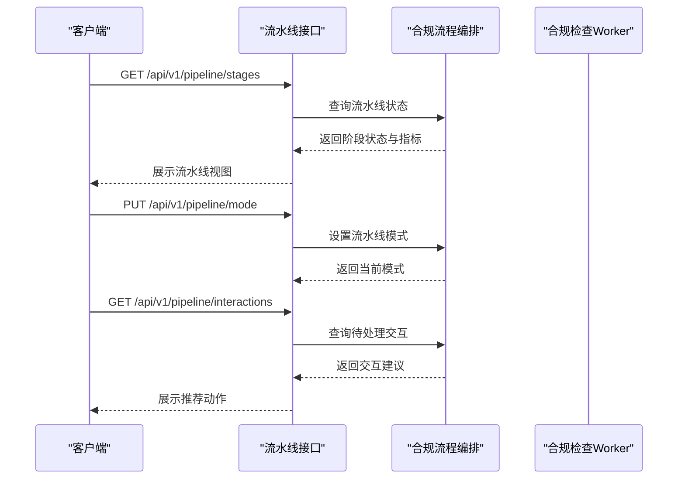
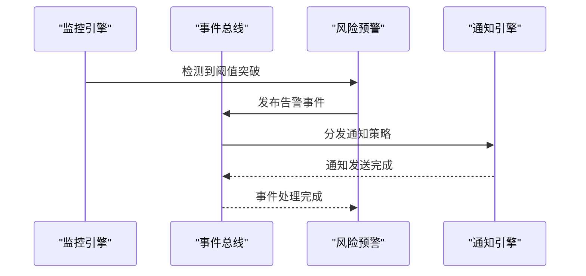
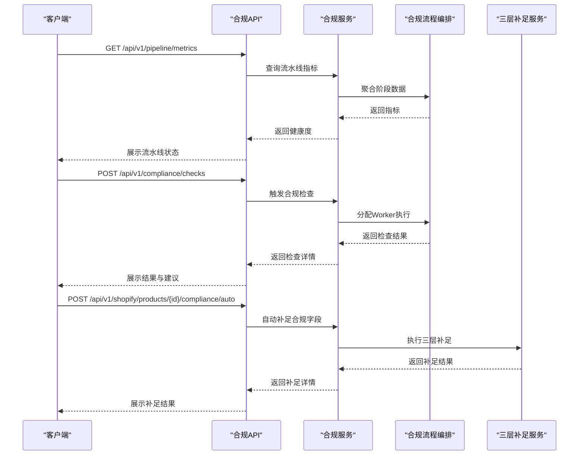
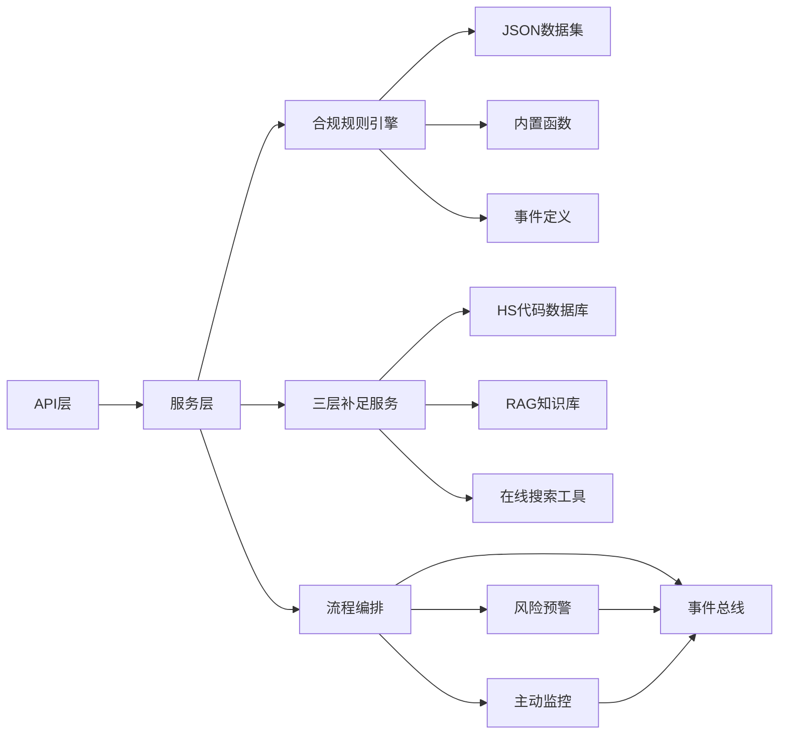

# 合规检查系统

<cite>
**本文档引用的文件**
- [后端变更路线图.md](file://后端变更路线图.md)
- [compliance_flow.py](file://backend/app/core/compliance_flow.py)
- [compliance_rules.py](file://backend/app/core/compliance_rules.py)
- [risk_alert.py](file://backend/app/core/risk_alert.py)
- [compliance.py](file://backend/app/services/compliance.py)
- [pipeline.py](file://backend/app/api/pipeline.py)
- [proactive_engine.py](file://backend/app/core/proactive_engine.py)
- [event_bus.py](file://backend/app/core/event_bus.py)
- [compliance_enrichment.py](file://backend/app/services/compliance_enrichment.py)
- [shopify.py](file://backend/app/api/shopify.py)
- [metaso_search.py](file://backend/app/services/metaso_search.py)
- [test_compliance_rules.py](file://backend/tests/test_compliance_rules.py)
- [compliance_report_enhance.yaml](file://backend/data/prompts/compliance_report_enhance.yaml)
- [compliance_events.md](file://backend/data/events/builtin/compliance_events.md)
- [raw_store.py](file://backend/app/storage/raw_store.py)
</cite>

## 更新摘要
**所做更改**
- 新增三层合规字段补全服务架构分析
- 更新合规检查API文档以包含新的三层补全流程
- 添加HS代码本地库匹配、RAG法规搜索和在线搜索的详细说明
- 更新合规流程编排系统以反映新的三层补足策略
- 新增Metaso在线搜索工具的集成说明
- 新增产品创建时自动触发合规补足功能

## 目录
1. [引言](#引言)
2. [项目结构](#项目结构)
3. [核心组件](#核心组件)
4. [架构概览](#架构概览)
5. [详细组件分析](#详细组件分析)
6. [依赖关系分析](#依赖关系分析)
7. [性能考虑](#性能考虑)
8. [故障排除指南](#故障排除指南)
9. [结论](#结论)
10. [附录](#附录)

## 引言
本文件为避风港平台的合规检查系统提供综合性技术文档。系统围绕三层合规字段补全服务、数据驱动的合规规则引擎、风险评估算法、合规报告生成、流程编排与监控预警五大核心能力构建，旨在为跨境电商业务提供自动化、可扩展、可观测的合规保障体系。

**更新** 系统现已采用全新的三层合规字段补全服务架构，从本地HS代码数据库到RAG法规搜索再到在线搜索的完整流程，替代了旧的合规检查架构。新增的产品创建时自动触发机制和手动应用功能，进一步提升了系统的实用性和灵活性。

## 项目结构
后端采用模块化分层设计，关键合规相关模块分布如下：
- 核心引擎层：三层合规字段补全服务、合规流程编排、数据驱动的合规规则引擎、风险预警、主动监控
- 服务层：合规检查服务封装、Shopify API集成
- API层：合规流水线、合规检查、规则管理、报告导出、商品合规字段管理等对外接口
- 数据与知识：合规规则数据集、事件总线、全局指标与记忆、HS代码数据库、RAG知识库

**图表来源**
- [pipeline.py:37-75](file://backend/app/api/pipeline.py#L37-L75)
- [compliance.py](file://backend/app/services/compliance.py)
- [shopify.py](file://backend/app/api/shopify.py)
- [compliance_flow.py](file://backend/app/core/compliance_flow.py)
- [compliance_rules.py](file://backend/app/core/compliance_rules.py)
- [compliance_enrichment.py](file://backend/app/services/compliance_enrichment.py)
- [risk_alert.py](file://backend/app/core/risk_alert.py)
- [proactive_engine.py:84-117](file://backend/app/core/proactive_engine.py#L84-L117)
- [event_bus.py:633-654](file://backend/app/core/event_bus.py#L633-L654)
- [compliance_report_enhance.yaml](file://backend/data/prompts/compliance_report_enhance.yaml)
- [compliance_events.md](file://backend/data/events/builtin/compliance_events.md)
- [raw_store.py](file://backend/app/storage/raw_store.py)
- [metaso_search.py](file://backend/app/services/metaso_search.py)

**章节来源**
- [后端变更路线图.md:2570-2792](file://后端变更路线图.md#L2570-L2792)
- [pipeline.py:37-75](file://backend/app/api/pipeline.py#L37-L75)
- [compliance.py](file://backend/app/services/compliance.py)
- [shopify.py](file://backend/app/api/shopify.py)
- [compliance_flow.py](file://backend/app/core/compliance_flow.py)
- [compliance_rules.py](file://backend/app/core/compliance_rules.py)
- [compliance_enrichment.py](file://backend/app/services/compliance_enrichment.py)
- [risk_alert.py](file://backend/app/core/risk_alert.py)
- [proactive_engine.py:84-117](file://backend/app/core/proactive_engine.py#L84-L117)
- [event_bus.py:633-654](file://backend/app/core/event_bus.py#L633-L654)

## 核心组件
- 三层合规字段补全服务：基于HS代码本地库匹配、RAG法规搜索和在线搜索的三层策略，自动补足商品合规字段。
- 数据驱动的合规规则引擎：基于JSON数据文件和内置函数，对产品属性与市场约束进行规则匹配，输出合规检查结果与影响分析。
- 风险评估算法：结合多维风险因子（认证状态、法规变更、指标异常）计算风险分值，进行等级判定与处置建议。
- 合规报告生成：聚合检查结果、风险汇总与处置记录，支持PDF/Excel导出。
- 合规流程编排：以10阶段流水线为核心，串联各Worker与检查项，提供模式切换、交互推荐与状态跟踪。
- 风险监控与预警：基于阈值与规则触发事件，通过事件总线分发通知策略，实现跨产品洞察与主动提醒。

**更新** 新增三层合规字段补全服务，提供从本地HS代码数据库到RAG法规搜索再到在线搜索的完整补足流程。系统现在支持在产品创建时自动触发合规补足，并可手动应用于现有产品。

**章节来源**
- [后端变更路线图.md:2570-2792](file://后端变更路线图.md#L2570-L2792)
- [compliance_enrichment.py](file://backend/app/services/compliance_enrichment.py)
- [compliance_flow.py](file://backend/app/core/compliance_flow.py)
- [compliance_rules.py](file://backend/app/core/compliance_rules.py)
- [risk_alert.py](file://backend/app/core/risk_alert.py)
- [proactive_engine.py:84-117](file://backend/app/core/proactive_engine.py#L84-L117)
- [event_bus.py:633-654](file://backend/app/core/event_bus.py#L633-L654)

## 架构概览
系统采用"服务-引擎-数据"三层架构，API层负责对外暴露能力，核心引擎层承载业务逻辑，数据与知识层提供规则、提示词与知识库支撑。新增的三层合规字段补全服务作为核心引擎的重要组成部分，提供了完整的合规字段自动补足能力。

**图表来源**
- [后端变更路线图.md:2570-2792](file://后端变更路线图.md#L2570-L2792)
- [compliance.py](file://backend/app/services/compliance.py)
- [compliance_enrichment.py](file://backend/app/services/compliance_enrichment.py)
- [compliance_flow.py](file://backend/app/core/compliance_flow.py)
- [compliance_rules.py](file://backend/app/core/compliance_rules.py)
- [risk_alert.py](file://backend/app/core/risk_alert.py)

## 详细组件分析

### 三层合规字段补全服务
- 三层策略架构
  - 第一层：本地HS代码库匹配（hs_codes.json）— 快速、无需网络
  - 第二层：RAG知识库搜索（法规/认证要求）— 已有ChromaDB
  - 第三层：在线搜索（Metaso）— 补足未知产品
- 匹配算法
  - 本地HS代码匹配：采用精确匹配、关键词匹配和全文匹配的三级策略
  - RAG法规搜索：基于ChromaDB的知识库检索适用的法规和认证要求
  - 在线搜索：通过Metaso工具进行互联网搜索补充信息
- 补足流程
  - 自动执行：本地HS匹配 → RAG法规搜索 → 在线搜索补足 → Shopify回写
  - 支持人工确认：当无法确定时标记"需人工确认"

**图表来源**
- [compliance_enrichment.py](file://backend/app/services/compliance_enrichment.py)
- [metaso_search.py](file://backend/app/services/metaso_search.py)

**章节来源**
- [compliance_enrichment.py](file://backend/app/services/compliance_enrichment.py)
- [metaso_search.py](file://backend/app/services/metaso_search.py)

### 数据驱动的合规规则引擎
- 数据结构
  - 规则数据集：通过JSON文件存储，包括HS编码规则、VAT税率、认证要求、风险关键词、物流规则等。
  - 内置函数：提供HS编码查找、VAT税率查询、认证要求获取、风险标志检测等功能。
  - 事件定义：通过compliance_events.md定义合规检查相关的事件类型和触发条件。
- 匹配算法
  - 产品属性与市场约束输入，经规则引擎解析为布尔条件或数值阈值。
  - 结合内置函数与JSON数据集，进行精确匹配与模糊匹配。
- 扫描策略
  - 周期性扫描：基于主动监控引擎定期拉取新法规并触发扫描。
  - 事件驱动：法规生效、指标异常等事件触发即时扫描。

**图表来源**
- [compliance_rules.py](file://backend/app/core/compliance_rules.py)
- [compliance_events.md](file://backend/data/events/builtin/compliance_events.md)
- [raw_store.py](file://backend/app/storage/raw_store.py)

**章节来源**
- [compliance_rules.py](file://backend/app/core/compliance_rules.py)
- [compliance_events.md](file://backend/data/events/builtin/compliance_events.md)
- [raw_store.py](file://backend/app/storage/raw_store.py)

### 风险评估算法
- 风险因子
  - 认证状态：如WEEE、CE等证书有效期与状态。
  - 法规变更：新法规对产品的影响程度与覆盖范围。
  - 指标异常：销售、退款、拒付等关键指标偏离阈值。
- 权重分配
  - 不同因子根据严重程度赋予不同权重，支持动态调整。
- 风险等级判定
  - 综合得分映射到低/中/高风险等级，并生成处置建议与升级策略。

**图表来源**
- [risk_alert.py](file://backend/app/core/risk_alert.py)
- [proactive_engine.py:84-117](file://backend/app/core/proactive_engine.py#L84-L117)

**章节来源**
- [risk_alert.py](file://backend/app/core/risk_alert.py)
- [proactive_engine.py:84-117](file://backend/app/core/proactive_engine.py#L84-L117)

### 合规报告生成机制
- 报告模板
  - 使用合规报告增强提示词模板，确保报告结构化与一致性。
- 数据聚合
  - 聚合各阶段检查结果、风险汇总、处置记录与指标趋势。
- 输出格式
  - 支持PDF与Excel导出，便于审计与汇报。

**图表来源**
- [后端变更路线图.md:2599-2602](file://后端变更路线图.md#L2599-L2602)
- [compliance_report_enhance.yaml](file://backend/data/prompts/compliance_report_enhance.yaml)

**章节来源**
- [后端变更路线图.md:2599-2602](file://后端变更路线图.md#L2599-L2602)
- [compliance_report_enhance.yaml](file://backend/data/prompts/compliance_report_enhance.yaml)

### 合规流程编排系统
- 流程定义
  - 10阶段流水线：涵盖建站、选品、供应商、上架、支付、订单、报关、清关、售后、财务等阶段。
  - Worker职责：合规检查Worker在全阶段执行规则执行与风险评估。
- 执行控制
  - 支持5步/6步模式切换，动态调整检查强度。
  - 待处理交互推荐：基于当前状态推荐下一步动作。
- 状态跟踪
  - 记录各阶段通过率、风险产品数与待办数量，提供整体健康度指标。

**图表来源**
- [pipeline.py:37-75](file://backend/app/api/pipeline.py#L37-L75)
- [compliance_flow.py](file://backend/app/core/compliance_flow.py)

**章节来源**
- [pipeline.py:37-75](file://backend/app/api/pipeline.py#L37-L75)
- [compliance_flow.py](file://backend/app/core/compliance_flow.py)

### 风险监控与预警机制
- 阈值设置
  - 关键指标阈值可配置，支持动态调整。
- 告警规则
  - 基于事件总线定义告警事件类型，如"新法规生效"、"风险阈值突破"、"指标异常"等。
- 通知策略
  - 通过事件总线分发到仪表盘、邮件、IM等通知渠道。

**图表来源**
- [event_bus.py:633-654](file://backend/app/core/event_bus.py#L633-L654)
- [risk_alert.py](file://backend/app/core/risk_alert.py)
- [proactive_engine.py:84-117](file://backend/app/core/proactive_engine.py#L84-L117)

**章节来源**
- [event_bus.py:633-654](file://backend/app/core/event_bus.py#L633-L654)
- [risk_alert.py](file://backend/app/core/risk_alert.py)
- [proactive_engine.py:84-117](file://backend/app/core/proactive_engine.py#L84-L117)

### 合规检查API文档与使用示例
- API总览
  - 合规流水线：获取阶段状态、设置流水线模式、查询待处理交互。
  - 合规检查：执行检查、查询检查详情、重新检查。
  - 规则管理：查询规则列表、更新规则。
  - 报表导出：列出报表、导出PDF/Excel。
  - 商品合规字段管理：自动补足合规字段、手动更新合规字段。
- 使用示例
  - 获取流水线健康度指标与阶段统计。
  - 执行合规检查并获取结果。
  - 导出月度合规报告。
  - 自动补足商品合规字段（HS编码、原产国、认证要求等）。
  - **新增**：产品创建时自动触发合规补足，支持手动应用到现有产品。

**更新** 新增三层合规字段补全服务的API使用示例，包括自动补足和手动更新功能。系统现在支持在产品创建时自动触发合规补足，并可手动应用于现有产品。

**图表来源**
- [后端变更路线图.md:2585-2598](file://后端变更路线图.md#L2585-L2598)
- [pipeline.py:37-75](file://backend/app/api/pipeline.py#L37-L75)
- [compliance.py](file://backend/app/services/compliance.py)
- [shopify.py](file://backend/app/api/shopify.py)
- [compliance_enrichment.py](file://backend/app/services/compliance_enrichment.py)

**章节来源**
- [后端变更路线图.md:2585-2598](file://后端变更路线图.md#L2585-L2598)
- [pipeline.py:37-75](file://backend/app/api/pipeline.py#L37-L75)
- [compliance.py](file://backend/app/services/compliance.py)
- [shopify.py](file://backend/app/api/shopify.py)
- [compliance_enrichment.py](file://backend/app/services/compliance_enrichment.py)

## 依赖关系分析
合规系统各模块间存在清晰的依赖关系：API层依赖服务层；服务层依赖流程编排与合规规则引擎；合规规则引擎依赖JSON数据集与内置函数；三层合规字段补全服务依赖HS代码数据库、RAG知识库和在线搜索工具；事件总线贯穿监控与通知；主动监控引擎提供周期性任务与洞察。

**图表来源**
- [pipeline.py:37-75](file://backend/app/api/pipeline.py#L37-L75)
- [compliance.py](file://backend/app/services/compliance.py)
- [compliance_flow.py](file://backend/app/core/compliance_flow.py)
- [compliance_rules.py](file://backend/app/core/compliance_rules.py)
- [compliance_enrichment.py](file://backend/app/services/compliance_enrichment.py)
- [risk_alert.py](file://backend/app/core/risk_alert.py)
- [proactive_engine.py:84-117](file://backend/app/core/proactive_engine.py#L84-L117)
- [event_bus.py:633-654](file://backend/app/core/event_bus.py#L633-L654)

**章节来源**
- [pipeline.py:37-75](file://backend/app/api/pipeline.py#L37-L75)
- [compliance.py](file://backend/app/services/compliance.py)
- [compliance_flow.py](file://backend/app/core/compliance_flow.py)
- [compliance_rules.py](file://backend/app/core/compliance_rules.py)
- [compliance_enrichment.py](file://backend/app/services/compliance_enrichment.py)
- [risk_alert.py](file://backend/app/core/risk_alert.py)
- [proactive_engine.py:84-117](file://backend/app/core/proactive_engine.py#L84-L117)
- [event_bus.py:633-654](file://backend/app/core/event_bus.py#L633-L654)

## 性能考虑
- 数据缓存：缓存JSON规则数据集和HS代码数据库，减少重复I/O操作。
- 函数优化：内置函数采用高效的数据结构和算法，支持快速查找。
- 并发控制：合理设置Worker并发度与资源限制，避免资源争用。
- 监控与告警：通过主动监控引擎定期自检，及时发现性能瓶颈。
- 三层补足优化：本地HS匹配优先执行，减少网络请求；RAG搜索限制结果数量，提高响应速度。

**更新** 新增三层合规字段补全服务的性能优化考虑，包括本地缓存、网络请求优化和并发控制。

## 故障排除指南
- 系统心跳自检：检查事件总线、合规规则引擎、代理注册表、内存树等组件健康状态。
- 认证到期预警：核对证书有效期与预警阈值，确认通知策略是否正确分发。
- 流水线状态异常：检查阶段通过率、风险产品数与待办数量，定位瓶颈环节。
- 规则执行失败：验证JSON数据集完整性、内置函数可用性和事件定义正确性，确认错误日志。
- 三层补足失败：检查HS代码数据库完整性、RAG知识库索引状态、在线搜索API密钥配置。
- Shopify回写失败：验证API凭证、商品ID有效性、合规字段格式正确性。

**更新** 新增三层合规字段补全服务的故障排除指南，包括数据库、知识库和API配置问题的排查方法。

**章节来源**
- [test_compliance_rules.py:1-53](file://backend/tests/test_compliance_rules.py#L1-L53)
- [event_bus.py:633-654](file://backend/app/core/event_bus.py#L633-L654)
- [compliance_enrichment.py](file://backend/app/services/compliance_enrichment.py)

## 结论
避风港平台的合规检查系统通过三层合规字段补全服务、数据驱动的合规规则引擎、风险评估、流程编排与主动监控的协同，实现了从规则匹配到风险处置再到报告输出的完整闭环。新的三层补全服务架构提供了从本地HS代码数据库到RAG法规搜索再到在线搜索的完整解决方案，显著提升了合规字段补足的准确性和效率。系统具备良好的扩展性与可观测性，能够满足跨境电商业务在复杂监管环境下的合规需求。

**更新** 系统现已采用全新的三层合规字段补全服务架构，提供了更全面、更准确的合规字段自动补足能力，为跨境电商业务提供了更强有力的技术支撑。新增的产品创建时自动触发机制和手动应用功能，进一步增强了系统的实用性和灵活性。

## 附录
- Worker配置示例：合规检查Worker在全阶段执行规则执行与风险评估，三层补足Worker负责自动补足商品合规字段。
- API路由总览：涵盖产品管理、合规流水线、合规检查、规则管理、报表导出、事件管理、指标监控、通知管理、商品合规字段管理等接口。
- JSON数据集示例：包括HS编码规则、VAT税率、认证要求、风险关键词、物流规则等数据结构。
- 三层补足策略：本地HS匹配（最快）、RAG法规搜索（最准）、在线搜索（最全）的三层互补策略。
- Metaso在线搜索：基于外部搜索引擎的合规信息补充工具，需要配置API密钥和URL参数。
- **新增**：产品创建时自动触发合规补足机制，支持手动应用到现有产品的完整流程。

**更新** 新增三层补足策略和Metaso在线搜索工具的相关配置和使用说明，以及产品创建时自动触发合规补足功能的详细说明。

**章节来源**
- [后端变更路线图.md:816-816](file://后端变更路线图.md#L816-L816)
- [后端变更路线图.md:2570-2792](file://后端变更路线图.md#L2570-L2792)
- [test_compliance_rules.py:1-53](file://backend/tests/test_compliance_rules.py#L1-L53)
- [compliance_enrichment.py](file://backend/app/services/compliance_enrichment.py)
- [metaso_search.py](file://backend/app/services/metaso_search.py)