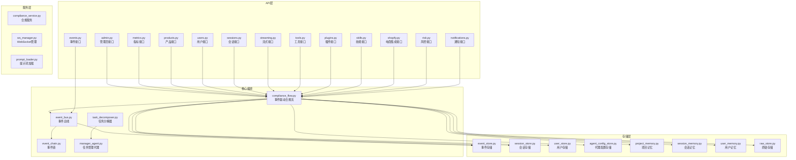
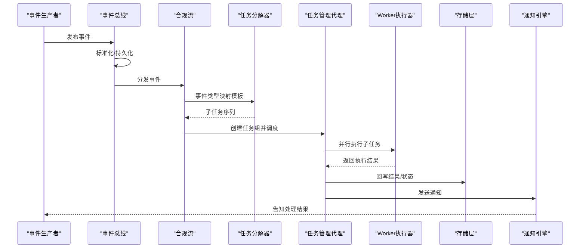
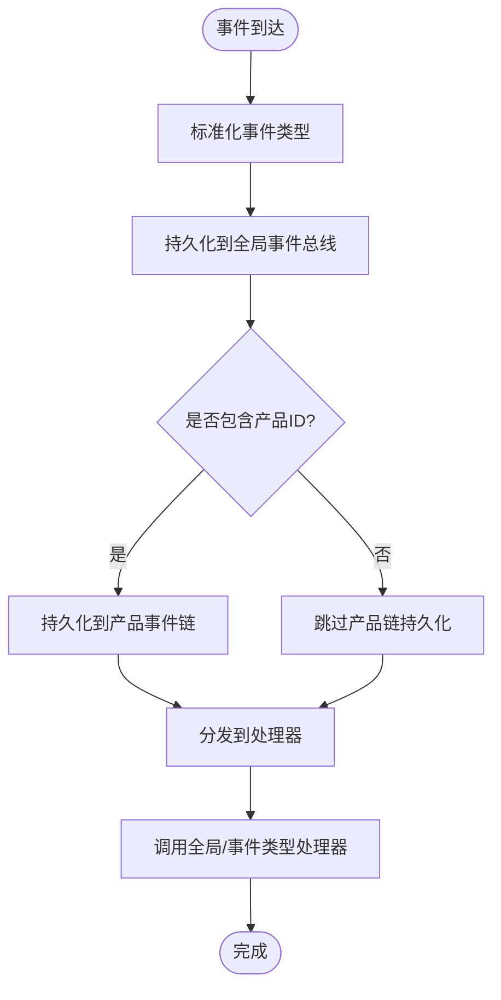
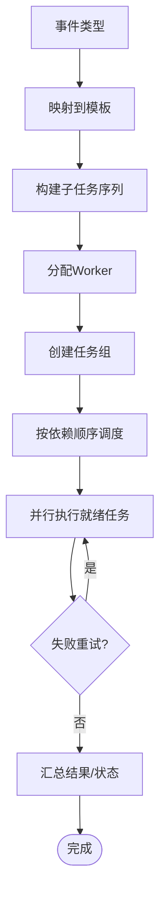
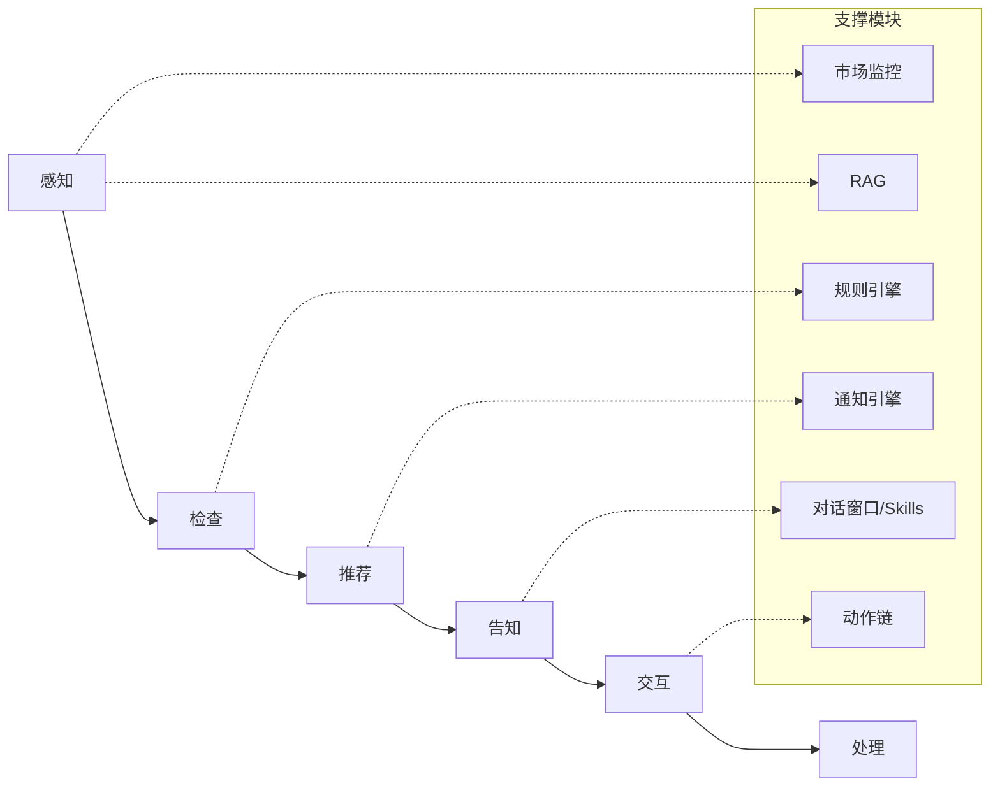
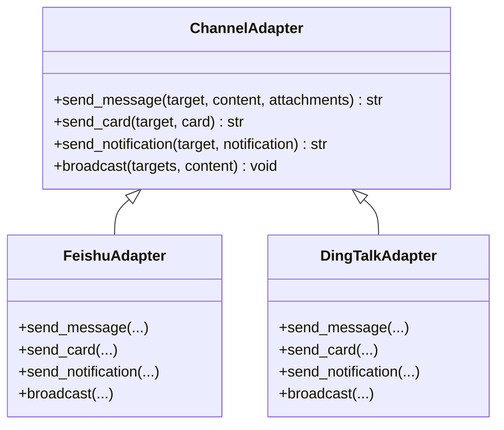
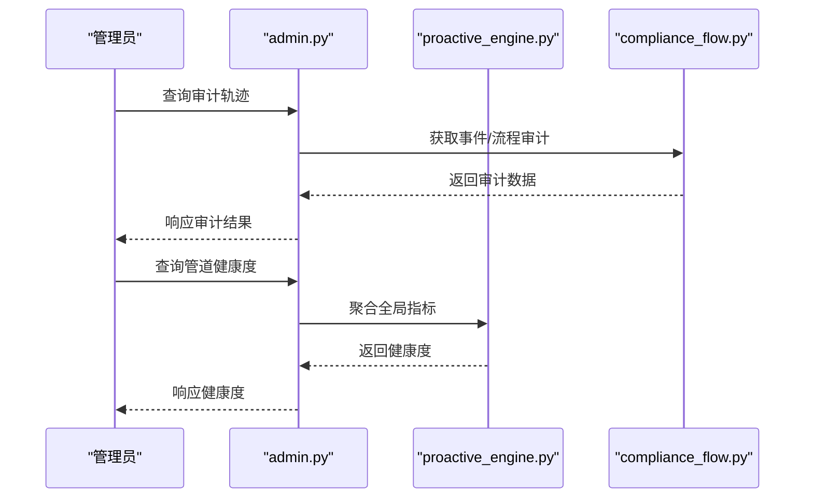
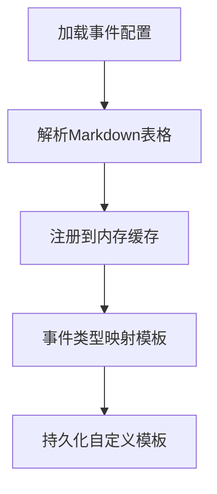
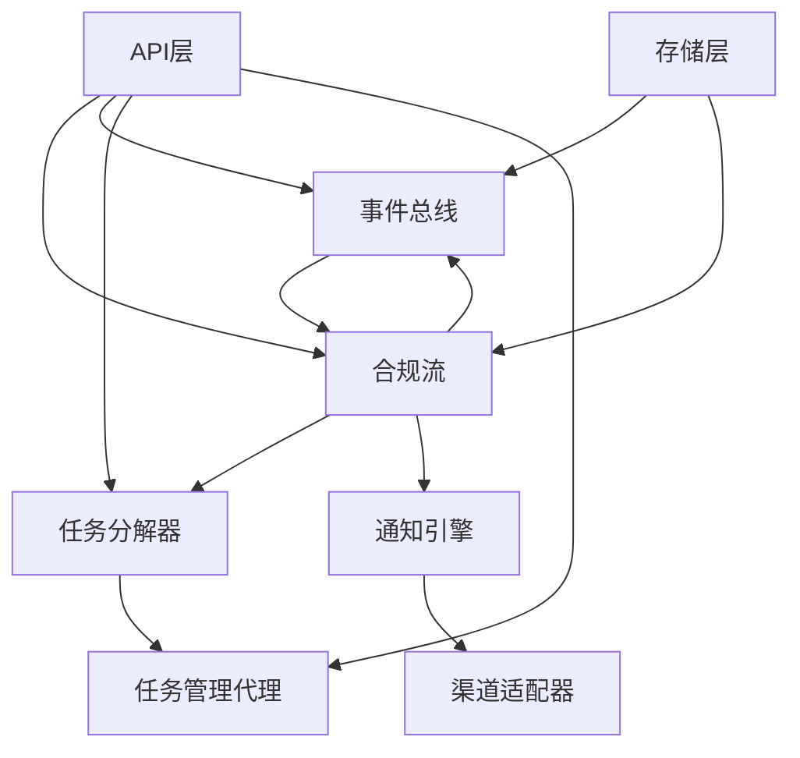

# 合规流程编排

<cite>
**本文引用的文件**
- [compliance_flow.py](file://backend/app/core/compliance_flow.py)
- [event_bus.py](file://backend/app/core/event_bus.py)
- [event_chain.py](file://backend/app/core/event_chain.py)
- [task_decomposer.py](file://backend/app/core/task_decomposer.py)
- [manager_agent.py](file://backend/app/core/manager_agent.py)
- [admin.py](file://backend/app/api/admin.py)
- [test_comprehensive_flow.py](file://backend/tests/test_comprehensive_flow.py)
- [后端变更路线图.md](file://后端变更路线图.md)
- [event_store.py](file://backend/storage/event_store.py)
- [event_config.py](file://backend/app/api/event_config.py)
- [events.py](file://backend/app/api/events.py)
- [metrics.py](file://backend/app/api/metrics.py)
- [proactive_engine.py](file://backend/app/core/proactive_engine.py)
- [channel_adapter.py](file://backend/app/core/channel_adapter.py)
- [notification_engine.py](file://backend/app/core/notification_engine.py)
- [worker_registry.py](file://backend/app/core/worker_registry.py)
- [rule_engine.py](file://backend/app/core/rule_engine.py)
- [action_chain.py](file://backend/app/core/action_chain.py)
- [knowledge.py](file://backend/app/api/knowledge.py)
- [rag.py](file://backend/app/core/rag.py)
- [market_monitor.py](file://backend/app/core/market_monitor.py)
- [scheduler.py](file://backend/app/core/scheduler.py)
- [auto_pull_engine.py](file://backend/app/core/auto_pull_engine.py)
- [integrations.py](file://backend/app/api/integrations.py)
- [products.py](file://backend/app/api/products.py)
- [users.py](file://backend/app/api/users.py)
- [sessions.py](file://backend/app/api/sessions.py)
- [streaming.py](file://backend/app/api/streaming.py)
- [tools.py](file://backend/app/api/tools.py)
- [plugins.py](file://backend/app/api/plugins.py)
- [skills.py](file://backend/app/api/skills.py)
- [shopify.py](file://backend/app/api/shopify.py)
- [risk.py](file://backend/app/api/risk.py)
- [notifications.py](file://backend/app/api/notifications.py)
- [metrics_api.py](file://backend/app/api/metrics.py)
- [compliance_service.py](file://backend/services/compliance.py)
- [prompt_loader.py](file://backend/services/prompt_loader.py)
- [ws_manager.py](file://backend/services/ws_manager.py)
- [event_store.py](file://backend/storage/event_store.py)
- [session_store.py](file://backend/storage/session_store.py)
- [user_store.py](file://backend/storage/user_store.py)
- [agent_config_store.py](file://backend/storage/agent_config_store.py)
- [project_memory.py](file://backend/storage/project_memory.py)
- [session_memory.py](file://backend/storage/session_memory.py)
- [user_memory.py](file://backend/storage/user_memory.py)
- [raw_store.py](file://backend/storage/raw_store.py)
- [database.py](file://backend/models/database.py)
- [schemas.py](file://backend/models/schemas.py)
- [main.py](file://backend/app/main.py)
</cite>

## 目录
1. [引言](#引言)
2. [项目结构](#项目结构)
3. [核心组件](#核心组件)
4. [架构总览](#架构总览)
5. [详细组件分析](#详细组件分析)
6. [依赖关系分析](#依赖关系分析)
7. [性能考虑](#性能考虑)
8. [故障排查指南](#故障排查指南)
9. [结论](#结论)
10. [附录](#附录)

## 引言
本技术文档面向避风港平台的合规流程编排系统，系统以“事件驱动”为核心，围绕“感知—检查—推荐—告知—交互—处理”的六阶段闭环，构建可配置、可观测、可扩展的工作流编排引擎。本文重点阐述：
- 流程定义与执行机制：流程图设计、节点控制、分支逻辑
- 事件链管理：事件触发、异步处理、状态跟踪
- 工作流编排引擎：任务分解、并行执行、错误恢复
- 流程监控与审计：执行日志、性能指标、异常处理
- 流程定制与扩展：自定义流程定义、节点扩展、集成点配置
- 完整的流程编排API与使用示例

## 项目结构
后端采用“核心模块 + API层 + 存储层 + 服务层”的分层组织，核心编排能力集中在 core 目录，API 层提供对外接口，storage 提供持久化能力，services 提供业务服务。

**图表来源**
- [compliance_flow.py](file://backend/app/core/compliance_flow.py)
- [event_bus.py](file://backend/app/core/event_bus.py)
- [event_chain.py](file://backend/app/core/event_chain.py)
- [task_decomposer.py](file://backend/app/core/task_decomposer.py)
- [manager_agent.py](file://backend/app/core/manager_agent.py)
- [admin.py](file://backend/app/api/admin.py)
- [event_store.py](file://backend/storage/event_store.py)

**章节来源**
- [main.py](file://backend/app/main.py)

## 核心组件
- 事件驱动合规流：负责将事件转化为合规流程，协调规则引擎、RAG、通知引擎、动作链等模块，形成闭环。
- 事件总线：统一接收、标准化、持久化事件，支持订阅与分发。
- 事件链：按产品维度维护事件时间线，支持历史追溯与可视化。
- 任务分解器：根据事件类型映射到预置或自定义工作流模板，生成子任务序列。
- 任务管理代理：调度子任务执行，支持并行、依赖排序、重试与失败隔离。
- 存储层：提供事件、会话、用户、记忆、原始数据等持久化能力。
- API层：提供管理员、事件、指标、产品、用户、会话、流式、工具、插件、技能、电商集成、风控、通知等接口。
- 服务层：封装合规服务、WebSocket管理、提示词加载等。

**章节来源**
- [compliance_flow.py](file://backend/app/core/compliance_flow.py)
- [event_bus.py](file://backend/app/core/event_bus.py)
- [event_chain.py](file://backend/app/core/event_chain.py)
- [task_decomposer.py](file://backend/app/core/task_decomposer.py)
- [manager_agent.py](file://backend/app/core/manager_agent.py)
- [event_store.py](file://backend/storage/event_store.py)

## 架构总览
系统以事件为驱动，事件进入事件总线后被标准化并持久化，随后根据事件类型路由到相应的合规流程。流程内部通过任务分解器生成子任务，交由任务管理代理进行并行执行与依赖控制，最终通过动作链回写结果并通知相关方。

**图表来源**
- [event_bus.py](file://backend/app/core/event_bus.py)
- [compliance_flow.py](file://backend/app/core/compliance_flow.py)
- [task_decomposer.py](file://backend/app/core/task_decomposer.py)
- [manager_agent.py](file://backend/app/core/manager_agent.py)
- [notification_engine.py](file://backend/app/core/notification_engine.py)

## 详细组件分析

### 事件总线与事件链
- 事件总线负责事件的发布、标准化、持久化与分发，支持全局处理器与按事件类型的处理器匹配，同时将事件写入产品级事件链以便追溯。
- 事件链按产品维度维护事件时间线，记录事件严重级别、类型与时间戳，限制最近500条以控制内存占用。

**图表来源**
- [event_bus.py](file://backend/app/core/event_bus.py)
- [event_chain.py](file://backend/app/core/event_chain.py)

**章节来源**
- [event_bus.py](file://backend/app/core/event_bus.py)
- [event_chain.py](file://backend/app/core/event_chain.py)

### 任务分解与工作流编排
- 任务分解器根据事件类型映射到预置模板，支持自定义模板注册与持久化；模板以步骤列表形式描述，包含超时、重试等参数。
- 任务管理代理负责创建任务组、分配Worker、构建执行顺序、并行执行、失败重试与状态汇总。

**图表来源**
- [task_decomposer.py](file://backend/app/core/task_decomposer.py)
- [manager_agent.py](file://backend/app/core/manager_agent.py)

**章节来源**
- [task_decomposer.py](file://backend/app/core/task_decomposer.py)
- [manager_agent.py](file://backend/app/core/manager_agent.py)

### 事件驱动合规流
- 合规流作为全局单例，将事件驱动的六阶段闭环串联起来：感知（市场监控/RAG）、检查（规则引擎）、推荐（技能推荐器）、告知（通知引擎）、交互（对话窗口/Skills）、处理（动作链回写）。
- 提供健康度评估接口，返回整体与各阶段评分。

**图表来源**
- [compliance_flow.py](file://backend/app/core/compliance_flow.py)
- [后端变更路线图.md](file://后端变更路线图.md)

**章节来源**
- [compliance_flow.py](file://backend/app/core/compliance_flow.py)
- [后端变更路线图.md](file://后端变更路线图.md)

### 通知与多渠道适配
- 通知引擎负责根据事件严重级别与业务阶段生成通知负载，支持飞书/钉钉等多渠道适配器，具备卡片消息与广播能力。

**图表来源**
- [channel_adapter.py](file://backend/app/core/channel_adapter.py)

**章节来源**
- [channel_adapter.py](file://backend/app/core/channel_adapter.py)
- [notification_engine.py](file://backend/app/core/notification_engine.py)

### API与监控审计
- 管理员接口提供审计轨迹与管道健康度查询，结合主动引擎聚合指标，支撑运营与合规监控。
- 指标接口提供系统健康度、任务执行统计等关键指标。

**图表来源**
- [admin.py](file://backend/app/api/admin.py)
- [proactive_engine.py](file://backend/app/core/proactive_engine.py)
- [compliance_flow.py](file://backend/app/core/compliance_flow.py)

**章节来源**
- [admin.py](file://backend/app/api/admin.py)
- [metrics_api.py](file://backend/app/api/metrics.py)
- [proactive_engine.py](file://backend/app/core/proactive_engine.py)

### 流程定制与扩展
- 事件注册表支持从配置文件加载事件定义，提供新增、修改、删除与按阶段筛选能力，便于业务侧快速扩展事件类型。
- 任务分解器支持自定义模板注册与持久化，模板以YAML/JSON形式存储，便于版本化管理与复用。

**图表来源**
- [后端变更路线图.md](file://后端变更路线图.md)
- [task_decomposer.py](file://backend/app/core/task_decomposer.py)

**章节来源**
- [后端变更路线图.md](file://后端变更路线图.md)
- [task_decomposer.py](file://backend/app/core/task_decomposer.py)

## 依赖关系分析
- 组件耦合：事件总线与合规流强耦合，任务分解器与任务管理代理强耦合；通知引擎与渠道适配器弱耦合，便于扩展。
- 外部依赖：存储层提供事件与记忆持久化，API层提供对外接口，服务层提供合规与通信能力。
- 循环依赖：核心模块间通过接口与单例避免循环依赖，API层仅依赖核心模块接口。

**图表来源**
- [event_bus.py](file://backend/app/core/event_bus.py)
- [compliance_flow.py](file://backend/app/core/compliance_flow.py)
- [task_decomposer.py](file://backend/app/core/task_decomposer.py)
- [manager_agent.py](file://backend/app/core/manager_agent.py)
- [notification_engine.py](file://backend/app/core/notification_engine.py)
- [channel_adapter.py](file://backend/app/core/channel_adapter.py)

**章节来源**
- [event_bus.py](file://backend/app/core/event_bus.py)
- [compliance_flow.py](file://backend/app/core/compliance_flow.py)
- [task_decomposer.py](file://backend/app/core/task_decomposer.py)
- [manager_agent.py](file://backend/app/core/manager_agent.py)
- [notification_engine.py](file://backend/app/core/notification_engine.py)
- [channel_adapter.py](file://backend/app/core/channel_adapter.py)

## 性能考虑
- 并行执行：任务管理代理使用并发执行已就绪子任务，提升吞吐；同时通过依赖关系避免阻塞无关任务。
- 内存控制：事件总线限制最近事件数量，事件链限制时间线长度，防止内存膨胀。
- 指标监控：主动引擎聚合系统健康度与任务执行指标，辅助容量规划与性能优化。
- 存储优化：事件与产品链采用增量追加与截断策略，降低IO压力。

[本节为通用性能建议，无需具体文件分析]

## 故障排查指南
- 事件未被处理：检查事件总线处理器注册、事件类型映射与订阅过滤条件。
- 任务执行失败：查看任务管理代理的重试次数与错误记录，定位失败子任务。
- 通知未送达：核对通知引擎配置与渠道适配器可用性。
- 审计与健康度：通过管理员接口查询审计轨迹与管道健康度，结合指标接口定位瓶颈。

**章节来源**
- [admin.py](file://backend/app/api/admin.py)
- [event_bus.py](file://backend/app/core/event_bus.py)
- [manager_agent.py](file://backend/app/core/manager_agent.py)
- [notification_engine.py](file://backend/app/core/notification_engine.py)

## 结论
避风港平台的合规流程编排系统以事件驱动为核心，通过事件总线、任务分解与工作流编排引擎，实现了从事件感知到处理回写的完整闭环。系统具备良好的可配置性、可观测性与扩展性，能够支撑复杂合规检查流程与自动化工作流的设计与落地。

[本节为总结性内容，无需具体文件分析]

## 附录

### API与使用示例（概念性）
- 事件接口：发布事件、查询事件链、按阶段筛选事件
- 管理员接口：审计轨迹查询、管道健康度查询
- 指标接口：系统健康度、任务执行统计
- 产品/用户/会话/流式/工具/插件/技能/电商集成/风控/通知等接口

[本节为概念性说明，无需具体文件分析]

### 流程编排最佳实践
- 使用事件注册表定义事件类型与触发条件，确保事件语义清晰。
- 为高风险事件配置通知策略与严重级别，保障及时响应。
- 将复杂流程拆分为可复用的模板，通过任务分解器进行组合。
- 在生产环境启用健康度监控与审计日志，持续优化流程性能。

[本节为通用指导，无需具体文件分析]