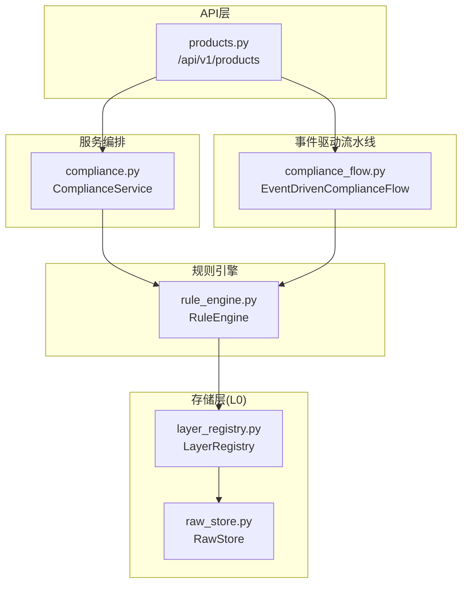
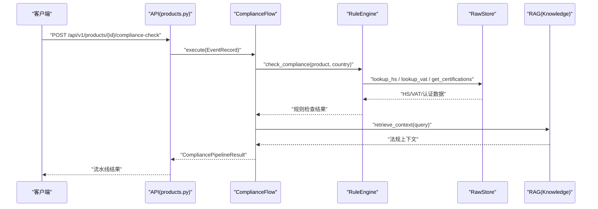
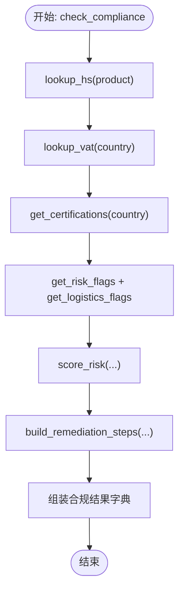
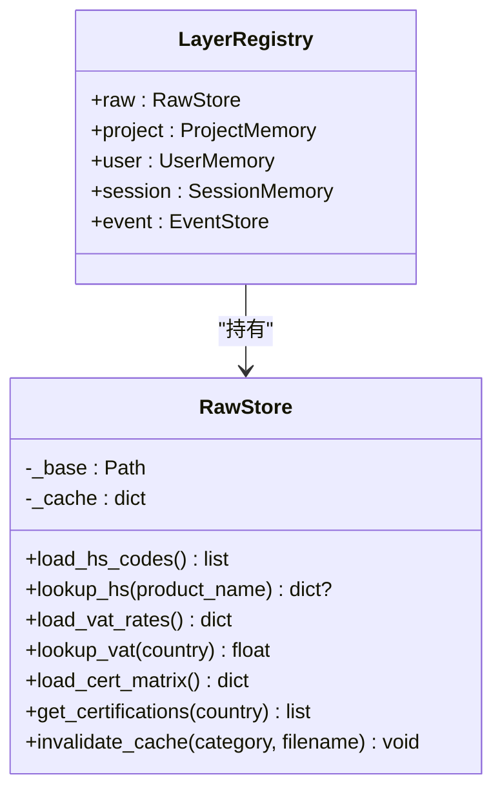
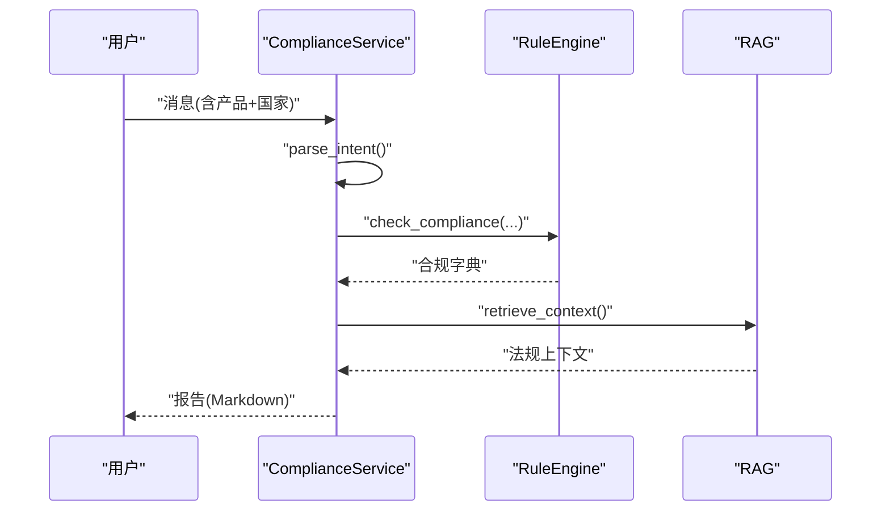
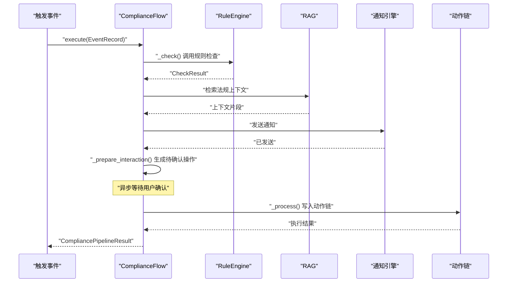
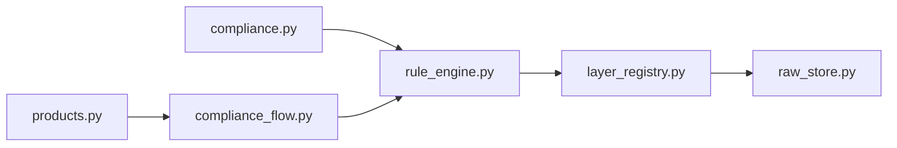

# 法规扫描引擎

<cite>
**本文引用的文件**
- [rule_engine.py](file://backend/app/core/rule_engine.py)
- [compliance_flow.py](file://backend/app/core/compliance_flow.py)
- [compliance.py](file://backend/app/services/compliance.py)
- [layer_registry.py](file://backend/app/storage/layer_registry.py)
- [raw_store.py](file://backend/app/storage/raw_store.py)
- [products.py](file://backend/app/api/products.py)
- [test_rule_engine.py](file://backend/tests/test_rule_engine.py)
</cite>

## 目录
1. [简介](#简介)
2. [项目结构](#项目结构)
3. [核心组件](#核心组件)
4. [架构总览](#架构总览)
5. [详细组件分析](#详细组件分析)
6. [依赖分析](#依赖分析)
7. [性能考量](#性能考量)
8. [故障排查指南](#故障排查指南)
9. [结论](#结论)
10. [附录](#附录)

## 简介
本文件为避风港平台“法规扫描引擎”的技术文档，聚焦于规则引擎的确定性检查原则与数据流处理机制，详解以下能力：
- HS编码匹配算法：模糊匹配策略、产品名称解析与编码查找逻辑
- VAT税率查询系统：国家映射、税率获取与缓存机制
- 认证矩阵查询：国家-产品匹配、认证要求提取与过滤逻辑
- 事件驱动合规流水线：从感知、检查、推荐、告知、交互到处理的六阶段闭环
- API接口：参数规范、返回值格式与错误处理
- 实际使用示例与最佳实践

## 项目结构
法规扫描引擎位于后端模块，核心代码分布如下：
- 规则引擎：负责高频确定性合规检查（HS、VAT、认证矩阵、风险与物流提示、文化提示等）
- 存储层：L0原始数据（RawStore）提供HS/VAT/认证矩阵的只读缓存
- 服务编排：ComplianceService负责NLU意图解析、规则引擎调用、RAG增强与报告生成
- 事件驱动流水线：ComplianceFlow实现六阶段闭环，支持交互与处理
- API：对外提供产品与合规检查的REST接口

**图表来源**
- [products.py:151-173](file://backend/app/api/products.py#L151-L173)
- [compliance.py:19-21](file://backend/app/services/compliance.py#L19-L21)
- [rule_engine.py:13-14](file://backend/app/core/rule_engine.py#L13-L14)
- [layer_registry.py:23-44](file://backend/app/storage/layer_registry.py#L23-L44)
- [raw_store.py:19-53](file://backend/app/storage/raw_store.py#L19-L53)
- [compliance_flow.py:33-473](file://backend/app/core/compliance_flow.py#L33-L473)

**章节来源**
- [products.py:1-173](file://backend/app/api/products.py#L1-L173)
- [compliance.py:1-296](file://backend/app/services/compliance.py#L1-L296)
- [rule_engine.py:1-247](file://backend/app/core/rule_engine.py#L1-L247)
- [layer_registry.py:1-45](file://backend/app/storage/layer_registry.py#L1-L45)
- [raw_store.py:1-134](file://backend/app/storage/raw_store.py#L1-L134)
- [compliance_flow.py:1-473](file://backend/app/core/compliance_flow.py#L1-L473)

## 核心组件
- 规则引擎（RuleEngine）
  - 提供HS编码模糊匹配、VAT税率查询、认证矩阵查询、风险与物流提示、文化提示、风险评分与整改建议生成
  - 数据来源：L0原始数据（通过LayerRegistry.raw）
- 存储层（RawStore）
  - 缓存读取data/raw下的静态JSON文件，提供HS编码、VAT税率、认证矩阵
  - 支持缓存失效与热加载
- 服务编排（ComplianceService）
  - 将NLU意图解析、规则引擎、RAG增强与报告生成整合为端到端管线
  - 负责合规结果持久化到记忆树、会话与项目层
- 事件驱动流水线（ComplianceFlow）
  - 六阶段闭环：感知→检查→推荐→告知→交互→处理
  - 支持5/6阶段模式切换、用户交互确认、动作链记录与流水线健康度统计

**章节来源**
- [rule_engine.py:17-247](file://backend/app/core/rule_engine.py#L17-L247)
- [raw_store.py:56-130](file://backend/app/storage/raw_store.py#L56-L130)
- [compliance.py:113-225](file://backend/app/services/compliance.py#L113-L225)
- [compliance_flow.py:52-126](file://backend/app/core/compliance_flow.py#L52-L126)

## 架构总览
规则引擎采用“确定性检查优先”的SOP原则，高频、可确定的合规判断由规则引擎承担；不确定或需要外部知识的场景由RAG补充。数据流自L0原始数据进入，经规则引擎与RAG，最终写入L2/L5层并回写事件。

**图表来源**
- [products.py:151-173](file://backend/app/api/products.py#L151-L173)
- [compliance_flow.py:200-247](file://backend/app/core/compliance_flow.py#L200-L247)
- [rule_engine.py:197-247](file://backend/app/core/rule_engine.py#L197-L247)
- [raw_store.py:61-130](file://backend/app/storage/raw_store.py#L61-L130)

## 详细组件分析

### 规则引擎（RuleEngine）
- HS编码匹配
  - 输入：产品中文名称
  - 策略：全量扫描HS编码描述，支持关键词拆分与别名映射（如“锂电池”→“锂离子蓄电池”、“灯”→“LED灯具”）
  - 返回：匹配到的HS条目或None
- VAT税率查询
  - 输入：国家名称
  - 机制：从缓存的VAT字典中按国家键取标准税率，未知返回0.0
- 认证矩阵查询
  - 输入：国家（可选产品提示）
  - 机制：从认证矩阵表中取国家对应的认证列表，未知国家回退至德国标准
- 风险与提示
  - 高风险关键词（医疗、电池、食品、药品、化妆品、儿童、玩具等）触发风险提示
  - 物流与运输提示（电池/电子类、欧盟/美国等地区）
  - 文化与标签注意事项（德/法/日/韩/美等）
- 风险评分与整改建议
  - 基于是否命中HS、认证数量、风险提示数、物流限制数与高风险类别计算0-100分
  - 生成优先级整改步骤

**图表来源**
- [rule_engine.py:197-247](file://backend/app/core/rule_engine.py#L197-L247)

**章节来源**
- [rule_engine.py:17-247](file://backend/app/core/rule_engine.py#L17-L247)
- [raw_store.py:61-130](file://backend/app/storage/raw_store.py#L61-L130)

### 存储层（LayerRegistry + RawStore）
- LayerRegistry统一暴露L0-L5层，其中L0通过RawStore读取data/raw下的静态JSON
- RawStore
  - 缓存策略：首次读取后常驻内存，后续直接命中缓存
  - HS匹配：遍历HS条目，支持别名映射与关键词拆分
  - VAT查询：按国家键取标准税率
  - 认证矩阵：按国家键取认证列表，未知回退至德国

**图表来源**
- [layer_registry.py:23-44](file://backend/app/storage/layer_registry.py#L23-L44)
- [raw_store.py:19-134](file://backend/app/storage/raw_store.py#L19-L134)

**章节来源**
- [layer_registry.py:1-45](file://backend/app/storage/layer_registry.py#L1-L45)
- [raw_store.py:1-134](file://backend/app/storage/raw_store.py#L1-L134)

### 服务编排（ComplianceService）
- NLU意图解析：从用户消息中抽取产品与目标国家
- 规则引擎调用：执行check_compliance，得到确定性合规结果
- RAG增强：检索相关法规上下文，拼接到报告
- 报告生成：Markdown格式输出，包含HS、VAT、认证、风险、物流、清关材料、文化提示、整改建议与待办清单
- 记忆持久化：写入会话、项目与记忆树，非阻断式

**图表来源**
- [compliance.py:113-225](file://backend/app/services/compliance.py#L113-L225)
- [rule_engine.py:197-247](file://backend/app/core/rule_engine.py#L197-L247)

**章节来源**
- [compliance.py:1-296](file://backend/app/services/compliance.py#L1-L296)

### 事件驱动合规流水线（ComplianceFlow）
- 六阶段闭环
  - 感知：补充产品与市场上下文
  - 检查：RuleEngine + RAG检索
  - 推荐：基于风险与缺失认证生成操作建议
  - 告知：推送通知到仪表盘等渠道
  - 交互：生成待确认操作，异步等待用户确认
  - 处理：用户确认后写入动作链并记录结果
- 5/6阶段模式：可合并“推荐+告知”
- 流水线健康度：按产品生命周期阶段统计通过率与风险产品数

**图表来源**
- [compliance_flow.py:52-126](file://backend/app/core/compliance_flow.py#L52-L126)
- [compliance_flow.py:200-376](file://backend/app/core/compliance_flow.py#L200-L376)

**章节来源**
- [compliance_flow.py:1-473](file://backend/app/core/compliance_flow.py#L1-L473)

### API接口文档
- 产品合规检查
  - 方法与路径：POST /api/v1/products/{product_id}/compliance-check
  - 请求参数
    - 路径参数
      - product_id: 字符串，必填，产品ID
    - 查询参数
      - target_market: 字符串，默认“欧盟”，目标市场
  - 成功响应
    - 返回：CompliancePipelineResult（包含事件、流水线模式、状态、检查结果、推荐、通知、处理结果等）
  - 错误处理
    - 404：产品不存在
    - 异常：流水线状态置为error，返回错误信息
  - 示例
    - 请求：POST /api/v1/products/p_12345678/compliance-check?target_market=德国
    - 响应：包含risk_level、risk_score、certifications、remediation_steps等字段

**章节来源**
- [products.py:151-173](file://backend/app/api/products.py#L151-L173)

## 依赖分析
- 组件耦合
  - RuleEngine仅依赖LayerRegistry.raw，耦合度低，便于替换数据源
  - ComplianceService聚合RuleEngine与RAG，负责报告与持久化
  - ComplianceFlow依赖RuleEngine、RAG、通知引擎与动作链，承担编排职责
- 外部依赖
  - FastAPI路由（products.py）
  - 事件总线与动作链（由ComplianceFlow内部导入）
- 循环依赖
  - 未发现循环依赖，模块职责清晰

**图表来源**
- [rule_engine.py:13-14](file://backend/app/core/rule_engine.py#L13-L14)
- [layer_registry.py:23-44](file://backend/app/storage/layer_registry.py#L23-L44)
- [raw_store.py:19-53](file://backend/app/storage/raw_store.py#L19-L53)
- [compliance.py:19-21](file://backend/app/services/compliance.py#L19-L21)
- [compliance_flow.py:33-473](file://backend/app/core/compliance_flow.py#L33-L473)
- [products.py:1-173](file://backend/app/api/products.py#L1-L173)

**章节来源**
- [rule_engine.py:1-247](file://backend/app/core/rule_engine.py#L1-L247)
- [compliance.py:1-296](file://backend/app/services/compliance.py#L1-L296)
- [compliance_flow.py:1-473](file://backend/app/core/compliance_flow.py#L1-L473)
- [products.py:1-173](file://backend/app/api/products.py#L1-L173)

## 性能考量
- L0缓存命中：RawStore在进程启动后缓存静态数据，避免重复磁盘IO
- 超时保护：RAG检索设置超时（约5秒），防止阻塞主流程
- 非阻断持久化：记忆树与会话写入异常不中断主流程
- 风险评分与提示：纯内存计算，复杂度低，适合高频调用

[本节为通用性能讨论，无需特定文件来源]

## 故障排查指南
- HS匹配不到编码
  - 现象：返回“需人工核实”的描述
  - 排查：确认产品名称是否包含HS描述中的关键词；必要时增加别名映射
  - 参考
    - [rule_engine.py:213-213](file://backend/app/core/rule_engine.py#L213-L213)
    - [raw_store.py:81-92](file://backend/app/storage/raw_store.py#L81-L92)
- VAT为0
  - 现象：未知国家返回0.0
  - 排查：确认国家名称是否存在于VAT数据；若不存在，考虑回退策略
  - 参考
    - [raw_store.py:109-111](file://backend/app/storage/raw_store.py#L109-L111)
- 认证列表为空
  - 现象：未知国家返回德国标准
  - 排查：确认认证矩阵中是否存在该国家；若不存在，建议补充
  - 参考
    - [raw_store.py:128-129](file://backend/app/storage/raw_store.py#L128-L129)
- API返回404
  - 现象：产品不存在
  - 排查：确认product_id是否正确；检查产品是否被归档或删除
  - 参考
    - [products.py:156-157](file://backend/app/api/products.py#L156-L157)
- 流水线异常
  - 现象：状态为error
  - 排查：查看process_result.error；检查RuleEngine/RAG/通知引擎是否可用
  - 参考
    - [compliance_flow.py:111-115](file://backend/app/core/compliance_flow.py#L111-L115)

**章节来源**
- [rule_engine.py:213-213](file://backend/app/core/rule_engine.py#L213-L213)
- [raw_store.py:109-111](file://backend/app/storage/raw_store.py#L109-L111)
- [raw_store.py:128-129](file://backend/app/storage/raw_store.py#L128-L129)
- [products.py:156-157](file://backend/app/api/products.py#L156-L157)
- [compliance_flow.py:111-115](file://backend/app/core/compliance_flow.py#L111-L115)

## 结论
法规扫描引擎以规则引擎为核心，结合L0缓存与RAG增强，形成“确定性优先、不确定性补充”的合规检查体系。通过事件驱动流水线实现从感知到处理的闭环，配合API与报告生成，满足高频、可追溯、可扩展的合规需求。建议在生产环境中：
- 完善HS/VAT/认证矩阵的数据质量与覆盖范围
- 对RAG检索设置合理的超时与降级策略
- 利用交互与动作链提升合规执行的可追踪性

[本节为总结性内容，无需特定文件来源]

## 附录

### HS编码匹配算法细节
- 关键点
  - 全量扫描HS描述，支持关键词拆分与别名映射
  - 匹配成功即返回首个匹配条目
- 最佳实践
  - 产品命名尽量包含HS描述中的关键词
  - 对高频别名（如“锂电池”“灯”）保持一致的命名习惯

**章节来源**
- [raw_store.py:81-92](file://backend/app/storage/raw_store.py#L81-L92)

### VAT税率查询与缓存
- 关键点
  - 从缓存字典中按国家键取标准税率
  - 未知国家返回0.0，建议在上游做兜底处理
- 最佳实践
  - 在数据加载阶段校验关键国家键的完整性
  - 对频繁查询的国家建立预热策略

**章节来源**
- [raw_store.py:109-111](file://backend/app/storage/raw_store.py#L109-L111)

### 认证矩阵查询与过滤
- 关键点
  - 未知国家回退至德国标准，确保保守合规
  - 可结合产品提示进一步筛选认证项
- 最佳实践
  - 定期校准认证矩阵，确保与最新法规一致
  - 对高风险产品增加额外认证建议

**章节来源**
- [raw_store.py:128-129](file://backend/app/storage/raw_store.py#L128-L129)

### API使用示例
- 场景：对产品p_12345678在目标市场“德国”发起合规检查
- 请求
  - POST /api/v1/products/p_12345678/compliance-check?target_market=德国
- 响应要点
  - risk_level、risk_score、certifications、remediation_steps、checklist等
- 注意
  - 若产品不存在，返回404
  - 若流水线异常，返回error字段

**章节来源**
- [products.py:151-173](file://backend/app/api/products.py#L151-L173)

### 测试用例参考
- 不明产品名称的优雅降级
  - 断言：返回合规字典且描述包含“需人工核实”
- 电池类产品的物流与清关提示
  - 断言：包含UN38.3与MSDS相关提示
- 市场本地化提示（如法国）
  - 断言：文化提示包含法语与儿童相关建议

**章节来源**
- [test_rule_engine.py:95-111](file://backend/tests/test_rule_engine.py#L95-L111)