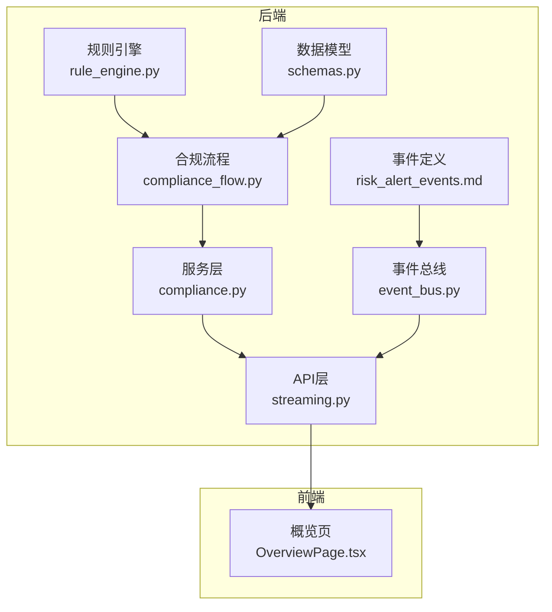
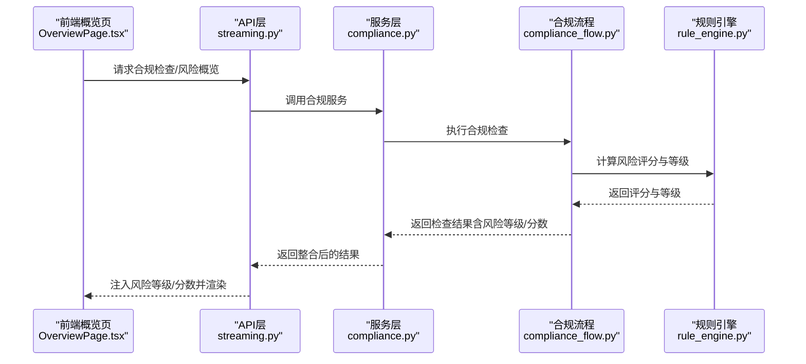
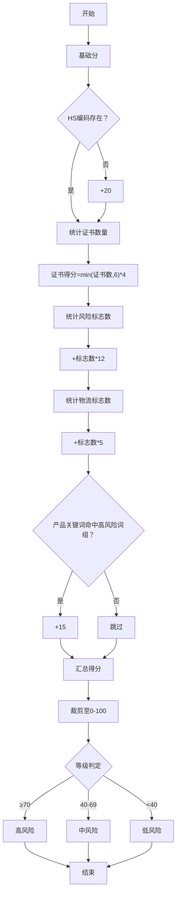
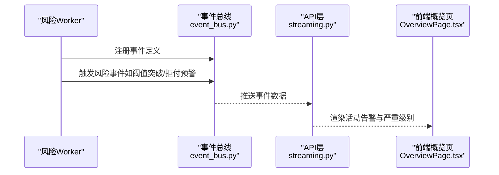
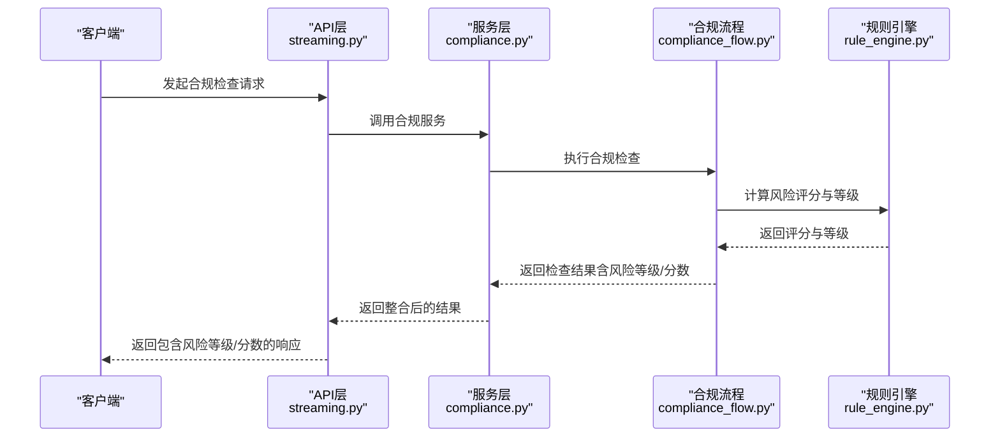
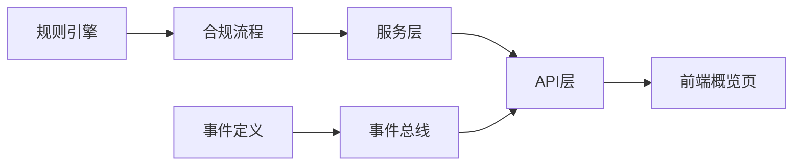

# 风险评估算法

<cite>
**本文引用的文件**
- [rule_engine.py](file://backend/app/core/rule_engine.py)
- [compliance_flow.py](file://backend/app/core/compliance_flow.py)
- [risk_alert_events.md](file://backend/data/config/events/risk_alert_events.md)
- [event_bus.py](file://backend/app/core/event_bus.py)
- [schemas.py](file://backend/app/models/schemas.py)
- [compliance.py](file://backend/app/services/compliance.py)
- [streaming.py](file://backend/app/api/streaming.py)
- [test_rule_engine.py](file://backend/tests/test_rule_engine.py)
- [OverviewPage.tsx](file://frontend/src/pages/OverviewPage.tsx)
</cite>

## 目录
1. [简介](#简介)
2. [项目结构](#项目结构)
3. [核心组件](#核心组件)
4. [架构总览](#架构总览)
5. [详细组件分析](#详细组件分析)
6. [依赖关系分析](#依赖关系分析)
7. [性能考量](#性能考量)
8. [故障排查指南](#故障排查指南)
9. [结论](#结论)
10. [附录](#附录)

## 简介
本文件面向避风港平台的风险评估算法，系统化梳理从规则引擎到合规流程、风险预警与前端展示的完整链路。重点覆盖：
- 风险评分计算模型：评分公式、权重分配与等级映射
- 风险标志检测机制：高风险类别识别、国家特定风险与产品特殊风险
- 物流风险评估：电池/电子产品运输与国际物流要求
- 风险等级阈值与UI显示逻辑
- 风险预警触发机制：阈值、规则与通知策略
- 风险评估API与集成示例路径

## 项目结构
风险评估相关代码主要分布在后端核心模块与前端页面中：
- 核心算法：规则引擎（评分、标志、证书、HS码等）
- 合规流程：将规则结果转化为检查项、风险等级与通过判定
- 风险事件：事件定义、严重级别与通知策略
- 数据模型：风险评分字段约束
- 服务层：整合合规结果并输出风险评分
- API层：在流式接口中注入风险等级/分数
- 前端：概览页展示活动告警与严重级别筛选

图表来源
- [rule_engine.py:147-173](file://backend/app/core/rule_engine.py#L147-L173)
- [compliance_flow.py:200-310](file://backend/app/core/compliance_flow.py#L200-L310)
- [risk_alert_events.md:1-27](file://backend/data/config/events/risk_alert_events.md#L1-L27)
- [event_bus.py:633-654](file://backend/app/core/event_bus.py#L633-L654)
- [schemas.py:113](file://backend/app/models/schemas.py#L113)
- [compliance.py:270-290](file://backend/app/services/compliance.py#L270-L290)
- [streaming.py:370-400](file://backend/app/api/streaming.py#L370-L400)
- [OverviewPage.tsx:246-279](file://frontend/src/pages/OverviewPage.tsx#L246-L279)

章节来源
- [rule_engine.py:112-125](file://backend/app/core/rule_engine.py#L112-L125)
- [compliance_flow.py:200-310](file://backend/app/core/compliance_flow.py#L200-L310)
- [risk_alert_events.md:1-27](file://backend/data/config/events/risk_alert_events.md#L1-L27)
- [event_bus.py:633-654](file://backend/app/core/event_bus.py#L633-L654)
- [schemas.py:113](file://backend/app/models/schemas.py#L113)
- [compliance.py:270-290](file://backend/app/services/compliance.py#L270-L290)
- [streaming.py:370-400](file://backend/app/api/streaming.py#L370-L400)
- [OverviewPage.tsx:246-279](file://frontend/src/pages/OverviewPage.tsx#L246-L279)

## 核心组件
- 规则引擎（风险评分与等级映射）
  - 评分函数：基于HS编码可查性、证书数量、风险标志数、物流标志数与产品关键词进行加权累加，最终裁剪至0-100区间
  - 等级映射：70及以上为高风险，40-69为中风险，低于40为低风险
- 风险标志检测
  - 国家特定：如欧盟GPSR等
  - 产品特殊：电池/锂/医疗/食品/药品/化妆品/儿童/玩具等关键词触发额外加分
- 物流风险评估
  - 电池类：强制附加MSDS、UN38.3测试报告、危险品/非危鉴定书
  - 玩具/儿童：附加玩具安全测试报告（EN71/CPSIA等，按市场适用）
  - 包装法/EPR：部分欧洲国家需提供相应注册信息
- 风险预警与通知
  - 事件类型：阈值突破、指标预警、拒付预警、认证到期批量、法规冲突、欺诈检测、供应链风险、合规评分下降
  - 严重级别：low/medium/high/critical
  - 通知策略：仪表盘、WebSocket、邮件等
- 数据模型与API
  - 风险评分字段约束：0-100整数
  - API层在合规检查事件中注入风险等级与分数

章节来源
- [rule_engine.py:147-173](file://backend/app/core/rule_engine.py#L147-L173)
- [rule_engine.py:112-125](file://backend/app/core/rule_engine.py#L112-L125)
- [risk_alert_events.md:8-18](file://backend/data/config/events/risk_alert_events.md#L8-L18)
- [event_bus.py:633-654](file://backend/app/core/event_bus.py#L633-L654)
- [schemas.py:113](file://backend/app/models/schemas.py#L113)
- [streaming.py:370-400](file://backend/app/api/streaming.py#L370-L400)

## 架构总览
下图展示从规则引擎到前端展示的端到端流程。

图表来源
- [compliance.py:270-290](file://backend/app/services/compliance.py#L270-L290)
- [compliance_flow.py:200-310](file://backend/app/core/compliance_flow.py#L200-L310)
- [rule_engine.py:147-173](file://backend/app/core/rule_engine.py#L147-L173)
- [streaming.py:370-400](file://backend/app/api/streaming.py#L370-L400)
- [OverviewPage.tsx:246-279](file://frontend/src/pages/OverviewPage.tsx#L246-L279)

## 详细组件分析

### 风险评分与等级映射
- 评分公式要点
  - 基础分：固定基础分
  - HS编码缺失：+20
  - 证书数量：每本证书最多+4，上限6本
  - 风险标志数：每个+12
  - 物流标志数：每个+5
  - 产品关键词：命中任一高风险词组额外+15
  - 最终裁剪：0-100
- 等级映射
  - ≥70：高风险
  - 40-69：中风险
  - <40：低风险

图表来源
- [rule_engine.py:147-173](file://backend/app/core/rule_engine.py#L147-L173)

章节来源
- [rule_engine.py:147-173](file://backend/app/core/rule_engine.py#L147-L173)

### 风险标志检测机制
- 国家特定风险
  - 欧盟市场（如法国）：可能触发GPSR等合规标志
- 产品特殊风险
  - 电池/锂/医疗/食品/药品/化妆品/儿童/玩具等关键词触发高风险加分
- 物流与包装要求
  - 电池类产品：强制附加MSDS、UN38.3测试报告、危险品/非危鉴定书
  - 玩具/儿童：附加EN71/CPSIA等适用测试报告
  - 包装法/EPR：部分欧洲国家需提供相应注册信息

章节来源
- [rule_engine.py:112-125](file://backend/app/core/rule_engine.py#L112-L125)
- [test_rule_engine.py:65-79](file://backend/tests/test_rule_engine.py#L65-L79)

### 风险预警触发机制
- 事件类型与阈值
  - 风险阈值突破：合规指标超过预设阈值
  - 指标预警：自定义指标异常波动
  - 拒付预警：拒付率超过阈值（默认2%）
  - 批量认证到期：多个产品认证同期即将到期
  - 法规冲突：产品同时出口多市场时法规要求冲突
  - 欺诈检测：订单欺诈风险评分异常
  - 供应链风险：供应商合规状态异常
  - 合规评分下降：产品合规评分显著下降
- 严重级别与通知策略
  - 严重级别：low/medium/high/critical
  - 通知策略：仪表盘、WebSocket、邮件等

图表来源
- [risk_alert_events.md:8-18](file://backend/data/config/events/risk_alert_events.md#L8-L18)
- [event_bus.py:633-654](file://backend/app/core/event_bus.py#L633-L654)
- [streaming.py:370-400](file://backend/app/api/streaming.py#L370-L400)
- [OverviewPage.tsx:246-279](file://frontend/src/pages/OverviewPage.tsx#L246-L279)

章节来源
- [risk_alert_events.md:8-18](file://backend/data/config/events/risk_alert_events.md#L8-L18)
- [event_bus.py:633-654](file://backend/app/core/event_bus.py#L633-L654)
- [OverviewPage.tsx:246-279](file://frontend/src/pages/OverviewPage.tsx#L246-L279)

### 风险等级映射与UI显示逻辑
- 等级阈值
  - 低风险：0-30
  - 中风险：31-60
  - 高风险：61-80
  - 严重风险：81-100
- UI展示
  - 概览页支持按严重级别筛选活动告警
  - 展示未处理告警数量与“查看全部”入口

章节来源
- [risk_alert_events.md:19-26](file://backend/data/config/events/risk_alert_events.md#L19-L26)
- [OverviewPage.tsx:246-279](file://frontend/src/pages/OverviewPage.tsx#L246-L279)

### 风险评估API与使用示例
- API集成点
  - 在合规检查事件中注入风险等级与分数
  - 根据风险等级决定事件类型（通过/失败）
- 使用示例路径
  - 服务层整合合规结果并输出风险评分
  - API层在流式接口中携带风险等级/分数返回给前端

图表来源
- [compliance.py:270-290](file://backend/app/services/compliance.py#L270-L290)
- [compliance_flow.py:200-310](file://backend/app/core/compliance_flow.py#L200-L310)
- [rule_engine.py:147-173](file://backend/app/core/rule_engine.py#L147-L173)
- [streaming.py:370-400](file://backend/app/api/streaming.py#L370-L400)

章节来源
- [streaming.py:370-400](file://backend/app/api/streaming.py#L370-L400)
- [compliance.py:270-290](file://backend/app/services/compliance.py#L270-L290)
- [compliance_flow.py:200-310](file://backend/app/core/compliance_flow.py#L200-L310)
- [rule_engine.py:147-173](file://backend/app/core/rule_engine.py#L147-L173)

## 依赖关系分析
- 组件耦合
  - 规则引擎独立负责评分与等级映射，被合规流程调用
  - 合规流程将规则结果转化为检查项并通过判定
  - 服务层整合结果并输出风险评分
  - API层在事件中注入风险等级/分数
  - 事件总线管理风险事件与通知策略
- 外部依赖
  - 事件定义来源于配置文件
  - 前端依赖API返回的风险等级/分数进行展示

图表来源
- [rule_engine.py:147-173](file://backend/app/core/rule_engine.py#L147-L173)
- [compliance_flow.py:200-310](file://backend/app/core/compliance_flow.py#L200-L310)
- [compliance.py:270-290](file://backend/app/services/compliance.py#L270-L290)
- [streaming.py:370-400](file://backend/app/api/streaming.py#L370-L400)
- [risk_alert_events.md:8-18](file://backend/data/config/events/risk_alert_events.md#L8-L18)
- [event_bus.py:633-654](file://backend/app/core/event_bus.py#L633-L654)
- [OverviewPage.tsx:246-279](file://frontend/src/pages/OverviewPage.tsx#L246-L279)

章节来源
- [rule_engine.py:147-173](file://backend/app/core/rule_engine.py#L147-L173)
- [compliance_flow.py:200-310](file://backend/app/core/compliance_flow.py#L200-L310)
- [compliance.py:270-290](file://backend/app/services/compliance.py#L270-L290)
- [streaming.py:370-400](file://backend/app/api/streaming.py#L370-L400)
- [risk_alert_events.md:8-18](file://backend/data/config/events/risk_alert_events.md#L8-L18)
- [event_bus.py:633-654](file://backend/app/core/event_bus.py#L633-L654)
- [OverviewPage.tsx:246-279](file://frontend/src/pages/OverviewPage.tsx#L246-L279)

## 性能考量
- 评分计算为纯逻辑运算，时间复杂度低，适合高频调用
- 风险标志检测基于字符串匹配与集合操作，建议对产品关键词与国家列表做缓存以降低重复开销
- 事件总线与通知策略涉及I/O，建议异步化处理并限制并发

## 故障排查指南
- 风险等级异常
  - 检查评分函数输入参数是否正确（HS是否存在、证书数量、风险标志数、物流标志数、产品关键词）
  - 确认等级映射阈值是否被意外修改
- 事件未触发或通知未送达
  - 核对事件定义与严重级别配置
  - 检查事件总线注册与通知策略
- UI未显示风险等级/分数
  - 确认API层是否正确注入风险等级/分数
  - 检查前端组件是否正确解析并渲染

章节来源
- [rule_engine.py:147-173](file://backend/app/core/rule_engine.py#L147-L173)
- [risk_alert_events.md:8-18](file://backend/data/config/events/risk_alert_events.md#L8-L18)
- [event_bus.py:633-654](file://backend/app/core/event_bus.py#L633-L654)
- [streaming.py:370-400](file://backend/app/api/streaming.py#L370-L400)
- [OverviewPage.tsx:246-279](file://frontend/src/pages/OverviewPage.tsx#L246-L279)

## 结论
避风港平台的风险评估算法以规则引擎为核心，结合国家特定风险与产品特殊风险，形成可解释、可扩展的评分体系；通过事件驱动的预警机制与前端可视化，实现从评分到处置的闭环。建议在实际部署中关注关键词缓存、事件异步化与阈值校准，以提升稳定性与可维护性。

## 附录
- 关键实现路径参考
  - 评分与等级映射：[rule_engine.py:147-173](file://backend/app/core/rule_engine.py#L147-L173)
  - 风险标志与物流要求：[rule_engine.py:112-125](file://backend/app/core/rule_engine.py#L112-L125)
  - 合规流程与通过判定：[compliance_flow.py:200-310](file://backend/app/core/compliance_flow.py#L200-L310)
  - 风险事件定义与通知策略：[risk_alert_events.md:8-18](file://backend/data/config/events/risk_alert_events.md#L8-L18)
  - 事件总线注册：[event_bus.py:633-654](file://backend/app/core/event_bus.py#L633-L654)
  - 数据模型约束：[schemas.py:113](file://backend/app/models/schemas.py#L113)
  - 服务层整合与输出：[compliance.py:270-290](file://backend/app/services/compliance.py#L270-L290)
  - API层注入风险等级/分数：[streaming.py:370-400](file://backend/app/api/streaming.py#L370-L400)
  - 前端展示与筛选：[OverviewPage.tsx:246-279](file://frontend/src/pages/OverviewPage.tsx#L246-L279)