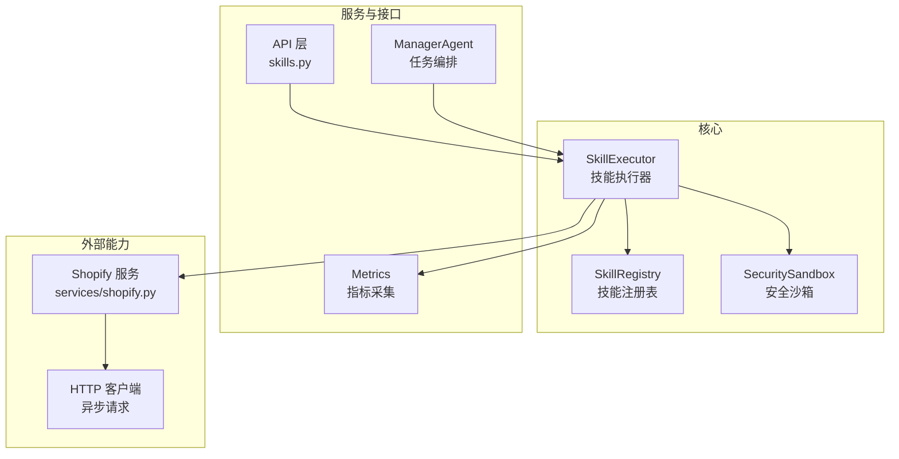
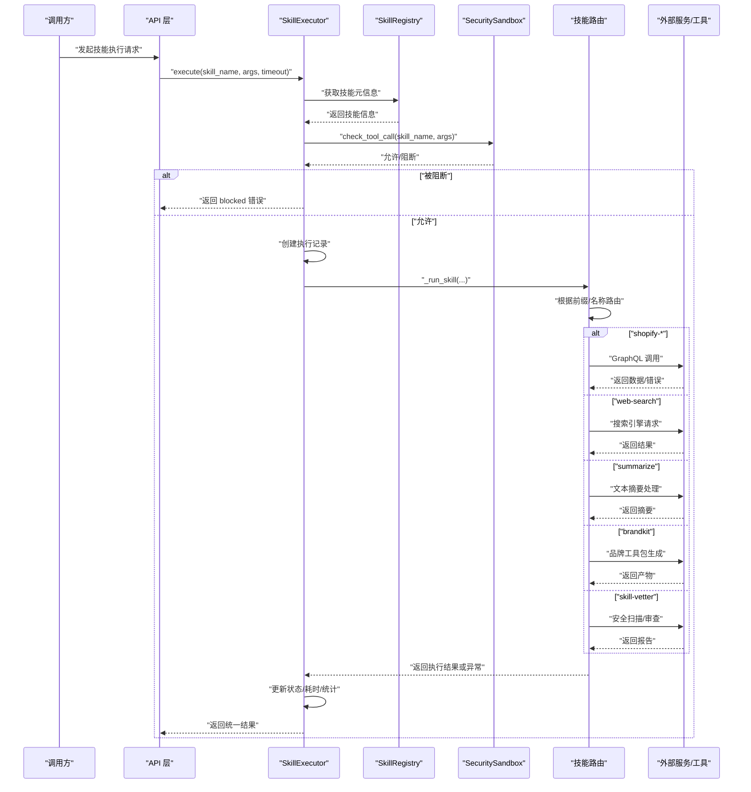
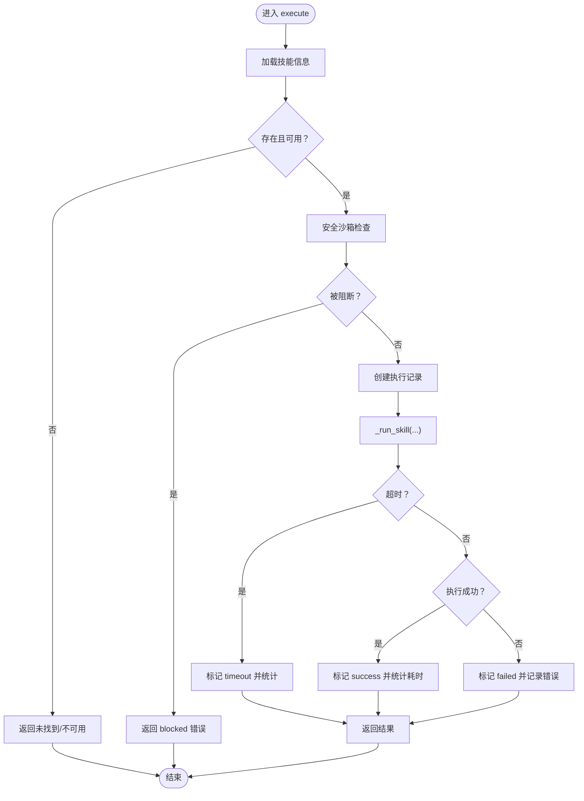
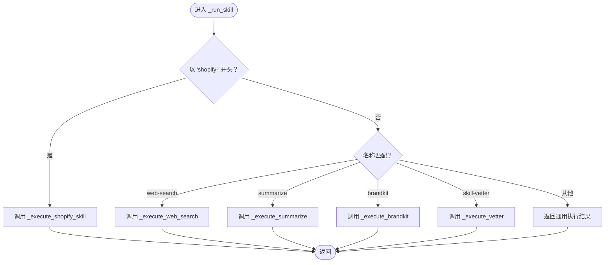
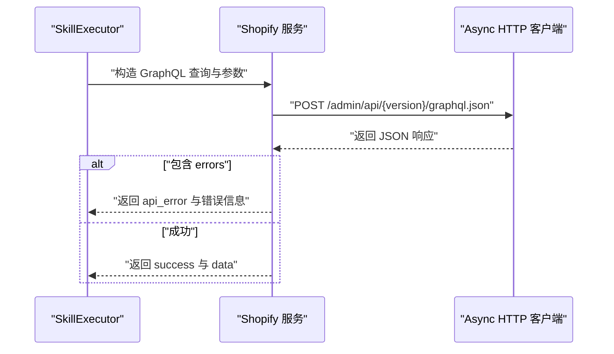
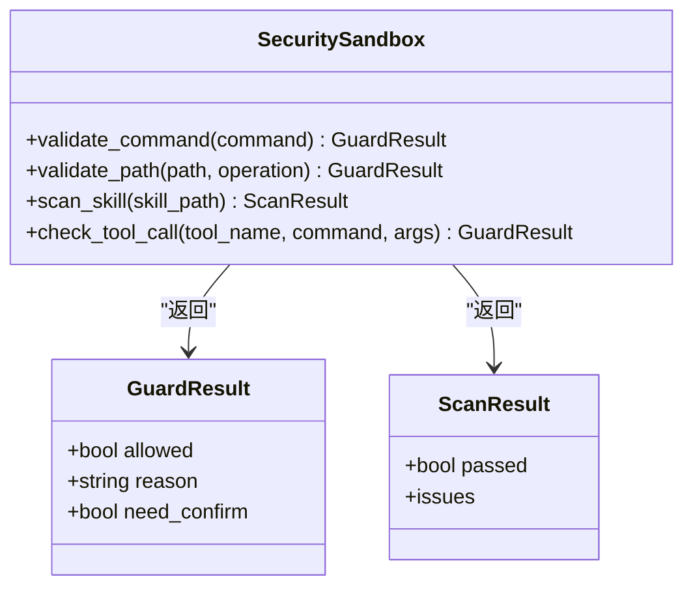
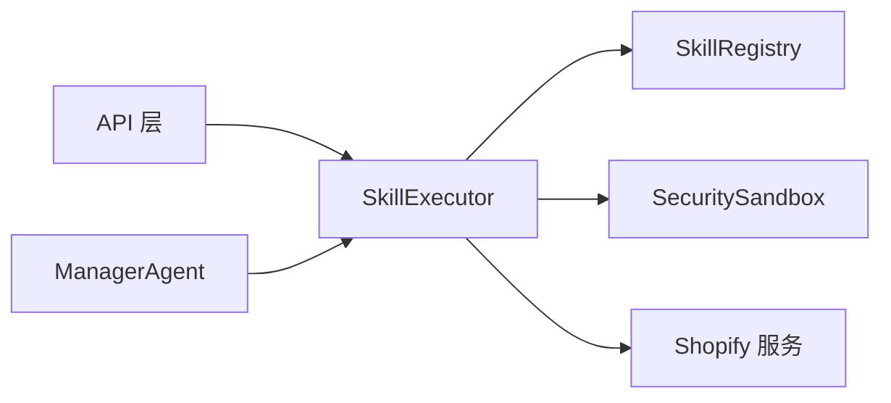

# 技能执行器

<cite>
**本文引用的文件**
- [skill_registry.py](file://backend/app/core/skill_registry.py)
- [security_sandbox.py](file://backend/app/core/security_sandbox.py)
- [manager_agent.py](file://backend/app/core/manager_agent.py)
- [skills.py](file://backend/app/api/skills.py)
- [metrics.py](file://backend/app/core/metrics.py)
- [metrics.py](file://backend/app/api/metrics.py)
- [shopify.py](file://backend/app/services/shopify.py)
- [SKILL.md](file://backend/.agents/skills/brandkit/SKILL.md)
</cite>

## 目录
1. [简介](#简介)
2. [项目结构](#项目结构)
3. [核心组件](#核心组件)
4. [架构总览](#架构总览)
5. [详细组件分析](#详细组件分析)
6. [依赖关系分析](#依赖关系分析)
7. [性能与监控](#性能与监控)
8. [使用指南](#使用指南)
9. [故障排除](#故障排除)
10. [结论](#结论)

## 简介
本文件面向避风港平台的“技能执行器”模块，系统性阐述 SkillExecutor 的执行架构与流程，包括异步执行、超时控制、错误处理；技能路由机制（shopify 系列、web-search、summarize、brandkit、skill-vetter）；安全检查（沙箱与权限验证）；内置技能实现（Shopify GraphQL 调用、Web 搜索、内容摘要、品牌工具包生成）；以及性能监控与统计收集机制。同时提供使用指南与故障排除建议。

## 项目结构
技能执行器位于后端核心层，围绕 SkillRegistry 组织技能清单与路由，结合 SecuritySandbox 提供安全检查，并通过 ManagerAgent 或 API 触发执行。

图表来源
- [skill_registry.py:238-275](file://backend/app/core/skill_registry.py#L238-L275)
- [skill_registry.py:413-478](file://backend/app/core/skill_registry.py#L413-L478)
- [security_sandbox.py:483-560](file://backend/app/core/security_sandbox.py#L483-L560)
- [manager_agent.py:521-543](file://backend/app/core/manager_agent.py#L521-L543)
- [skills.py:88-120](file://backend/app/api/skills.py#L88-L120)

章节来源
- [skill_registry.py:238-275](file://backend/app/core/skill_registry.py#L238-L275)
- [skill_registry.py:413-478](file://backend/app/core/skill_registry.py#L413-L478)
- [security_sandbox.py:483-560](file://backend/app/core/security_sandbox.py#L483-L560)
- [manager_agent.py:521-543](file://backend/app/core/manager_agent.py#L521-L543)
- [skills.py:88-120](file://backend/app/api/skills.py#L88-L120)

## 核心组件
- SkillRegistry：维护内置与注册技能清单，提供技能元信息与阶段映射。
- SkillExecutor：统一调度入口，负责安全检查、超时控制、错误处理、统计上报与结果封装。
- SecuritySandbox：对工具调用进行安全评估与拦截，支持命令校验、路径访问、技能扫描等。
- ManagerAgent：在工作流中回退到 SkillExecutor 执行具体技能。
- API 层：对外暴露技能执行接口，接收参数并返回标准化结果。
- Shopify 服务：为 shopify 系列技能提供 GraphQL 访问能力。

章节来源
- [skill_registry.py:238-275](file://backend/app/core/skill_registry.py#L238-L275)
- [skill_registry.py:413-478](file://backend/app/core/skill_registry.py#L413-L478)
- [security_sandbox.py:483-560](file://backend/app/core/security_sandbox.py#L483-L560)
- [manager_agent.py:521-543](file://backend/app/core/manager_agent.py#L521-L543)
- [skills.py:88-120](file://backend/app/api/skills.py#L88-L120)
- [shopify.py](file://backend/app/services/shopify.py)

## 架构总览
SkillExecutor 的执行链路如下：
- 接收技能名与参数，解析技能元信息。
- 进行安全检查（沙箱），若被阻断则返回阻断结果。
- 创建执行记录，设置状态为 running。
- 异步执行技能路由分支，按超时时间限制执行。
- 成功/超时/异常分别更新状态、耗时与统计。
- 返回统一格式的结果对象。

图表来源
- [skill_registry.py:422-478](file://backend/app/core/skill_registry.py#L422-L478)
- [skill_registry.py:480-502](file://backend/app/core/skill_registry.py#L480-L502)
- [security_sandbox.py:520-560](file://backend/app/core/security_sandbox.py#L520-L560)

章节来源
- [skill_registry.py:422-478](file://backend/app/core/skill_registry.py#L422-L478)
- [skill_registry.py:480-502](file://backend/app/core/skill_registry.py#L480-L502)
- [security_sandbox.py:520-560](file://backend/app/core/security_sandbox.py#L520-L560)

## 详细组件分析

### SkillExecutor 类与执行流程
- 异步执行：使用 asyncio.wait_for 包裹内部执行逻辑，确保超时可控。
- 超时控制：默认超时常量，支持调用方传入覆盖；超时抛出 TimeoutError，由上层捕获并返回 timeout 结果。
- 错误处理：捕获异常并标记 failed，记录错误信息；成功时计算耗时并更新统计。
- 统一结果：返回包含状态、技能名、结果体、耗时等字段的对象，便于上层消费。

图表来源
- [skill_registry.py:422-478](file://backend/app/core/skill_registry.py#L422-L478)

章节来源
- [skill_registry.py:413-478](file://backend/app/core/skill_registry.py#L413-L478)

### 技能路由机制
SkillExecutor 根据技能名进行分支路由，当前支持：
- shopify 系列：以 “shopify-” 开头，调用对应的 GraphQL 能力。
- web-search：执行网络搜索。
- summarize：执行内容摘要。
- brandkit：生成品牌工具包。
- skill-vetter：执行安全审查/扫描。

图表来源
- [skill_registry.py:480-502](file://backend/app/core/skill_registry.py#L480-L502)

章节来源
- [skill_registry.py:480-502](file://backend/app/core/skill_registry.py#L480-L502)

### Shopify GraphQL 执行
- 参数要求：域名、访问令牌、可选 API 版本。
- 路径选择：根据域名与版本拼接 Admin GraphQL 端点。
- 超时与错误：内部设置较短超时，捕获超时与异常并返回结构化错误。
- 成功响应：提取 data 字段作为结果，包含 shop 与 data。

图表来源
- [skill_registry.py:625-660](file://backend/app/core/skill_registry.py#L625-L660)
- [shopify.py](file://backend/app/services/shopify.py)

章节来源
- [skill_registry.py:625-660](file://backend/app/core/skill_registry.py#L625-L660)
- [shopify.py](file://backend/app/services/shopify.py)

### Web 搜索执行
- 功能定位：执行网络搜索，返回结构化结果。
- 实现要点：通过异步 HTTP 客户端发起请求，解析响应并封装结果。

章节来源
- [skill_registry.py:504-520](file://backend/app/core/skill_registry.py#L504-L520)

### 内容摘要执行
- 功能定位：对输入文本进行摘要生成。
- 实现要点：调用内部摘要处理能力，返回摘要结果。

章节来源
- [skill_registry.py:520-540](file://backend/app/core/skill_registry.py#L520-L540)

### 品牌工具包生成
- 功能定位：生成品牌工具包产物。
- 实现要点：调用品牌工具包生成逻辑，返回产物信息。

章节来源
- [skill_registry.py:540-560](file://backend/app/core/skill_registry.py#L540-L560)
- [SKILL.md](file://backend/.agents/skills/brandkit/SKILL.md)

### 技能安全审查（skill-vetter）
- 功能定位：对技能进行安全扫描与审查。
- 实现要点：调用安全扫描逻辑，返回扫描报告与风险等级。

章节来源
- [skill_registry.py:560-580](file://backend/app/core/skill_registry.py#L560-L580)

### 安全检查机制
- 工具调用检查：SecuritySandbox 对工具调用进行安全评估，必要时阻断。
- 路径与命令校验：禁止危险命令与敏感路径访问。
- 技能扫描：检测提示注入、命令注入、硬编码密钥、数据外泄风险等。
- 事件与统计：记录安全事件与拦截统计，支持查询与可视化。

图表来源
- [security_sandbox.py:483-560](file://backend/app/core/security_sandbox.py#L483-L560)

章节来源
- [security_sandbox.py:483-560](file://backend/app/core/security_sandbox.py#L483-L560)

### 性能监控与统计
- 执行耗时：记录开始/结束时间，计算毫秒级耗时。
- 统计更新：成功/失败/超时分别更新技能统计。
- 指标采集：核心指标与 API 指标模块提供采集与查询能力。

章节来源
- [skill_registry.py:458-466](file://backend/app/core/skill_registry.py#L458-L466)
- [metrics.py](file://backend/app/core/metrics.py)
- [metrics.py](file://backend/app/api/metrics.py)

## 依赖关系分析
- SkillExecutor 依赖 SkillRegistry 获取技能元信息，依赖 SecuritySandbox 进行安全检查，依赖外部服务（如 Shopify）执行具体能力。
- ManagerAgent 在 SDK 执行失败时回退到 SkillExecutor。
- API 层负责参数校验与结果封装。

图表来源
- [skills.py:88-120](file://backend/app/api/skills.py#L88-L120)
- [skill_registry.py:413-478](file://backend/app/core/skill_registry.py#L413-L478)
- [security_sandbox.py:483-560](file://backend/app/core/security_sandbox.py#L483-L560)
- [manager_agent.py:521-543](file://backend/app/core/manager_agent.py#L521-L543)

章节来源
- [skills.py:88-120](file://backend/app/api/skills.py#L88-L120)
- [skill_registry.py:413-478](file://backend/app/core/skill_registry.py#L413-L478)
- [security_sandbox.py:483-560](file://backend/app/core/security_sandbox.py#L483-L560)
- [manager_agent.py:521-543](file://backend/app/core/manager_agent.py#L521-L543)

## 性能与监控
- 超时策略：默认超时常量，可通过调用方传入覆盖；超时即刻返回，避免长时间占用资源。
- 统计维度：按技能 ID 维度记录成功/失败/超时次数与耗时分布，便于趋势分析与告警。
- 指标接口：提供指标采集与查询接口，支持业务侧监控看板。

章节来源
- [skill_registry.py:416-417](file://backend/app/core/skill_registry.py#L416-L417)
- [skill_registry.py:468-472](file://backend/app/core/skill_registry.py#L468-L472)
- [metrics.py](file://backend/app/core/metrics.py)
- [metrics.py](file://backend/app/api/metrics.py)

## 使用指南
- 通过 API 执行技能：调用技能执行接口，传入技能名与参数，等待返回统一结果对象。
- 超时设置：根据技能复杂度合理设置超时，避免过长阻塞。
- 安全前置：确保技能已通过安全扫描与权限审批，避免被沙箱阻断。
- 结果解析：根据返回状态与字段进行后续处理，如继续编排或展示。

章节来源
- [skills.py:88-120](file://backend/app/api/skills.py#L88-L120)
- [skill_registry.py:422-478](file://backend/app/core/skill_registry.py#L422-L478)
- [security_sandbox.py:520-560](file://backend/app/core/security_sandbox.py#L520-L560)

## 故障排除
- 未找到技能：检查技能名是否正确，确认技能已在注册表中启用。
- 技能不可用：检查技能状态是否为 disabled/available，需先启用。
- 被阻断：查看沙箱检查结果与原因，修正参数或申请放行。
- 超时：适当提高超时阈值，或优化技能实现；关注外部依赖延迟。
- 外部 API 错误：针对 Shopify 等外部服务，检查凭据、域名与版本配置。

章节来源
- [skill_registry.py:425-431](file://backend/app/core/skill_registry.py#L425-L431)
- [skill_registry.py:436-440](file://backend/app/core/skill_registry.py#L436-L440)
- [skill_registry.py:467-472](file://backend/app/core/skill_registry.py#L467-L472)
- [skill_registry.py:658-660](file://backend/app/core/skill_registry.py#L658-L660)

## 结论
SkillExecutor 以统一的异步执行模型、严格的超时控制与完善的错误处理为基础，结合安全沙箱与技能路由，实现了对多种内置技能的稳定执行。通过指标与统计体系，平台能够持续观测技能表现并优化整体执行效率与安全性。