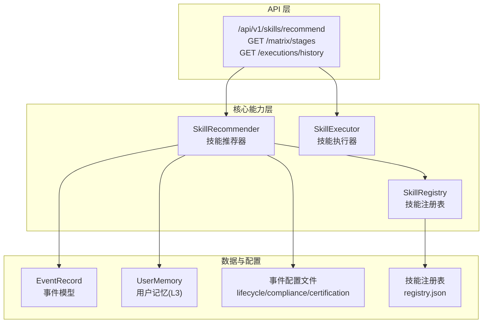
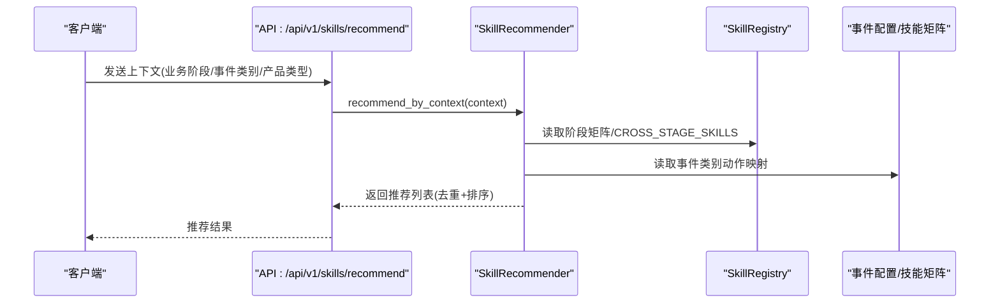
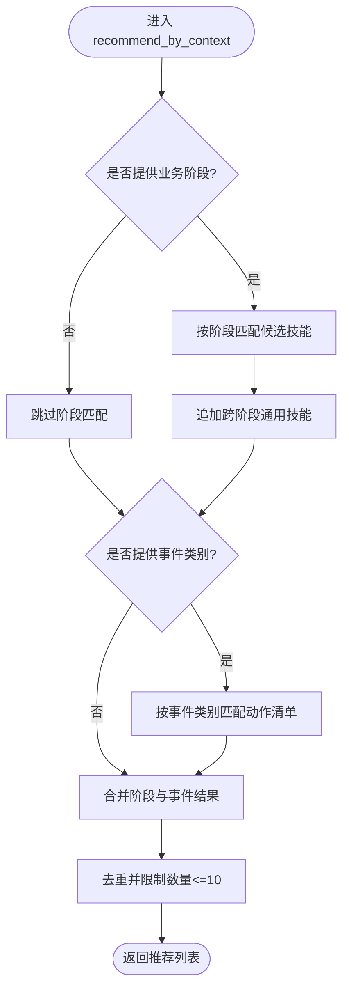
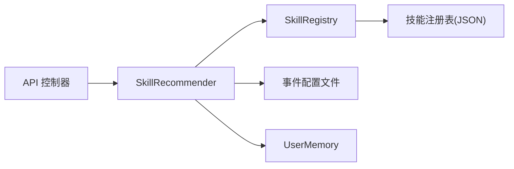

# 技能推荐器

<cite>
**本文引用的文件**
- [skill_registry.py](file://backend/app/core/skill_registry.py)
- [skills.py](file://backend/app/api/skills.py)
- [schemas.py](file://backend/app/models/schemas.py)
- [user_memory.py](file://backend/app/storage/user_memory.py)
- [test_comprehensive_flow.py](file://backend/tests/test_comprehensive_flow.py)
- [后端变更路线图.md](file://后端变更路线图.md)
- [lifecycle_events.md](file://backend/data/config/events/lifecycle_events.md)
- [compliance_events.md](file://backend/data/config/events/compliance_events.md)
- [certification_events.md](file://backend/data/config/events/certification_events.md)
- [registry.json](file://backend/data/config/skills/registry.json)
</cite>

## 目录
1. [引言](#引言)
2. [项目结构](#项目结构)
3. [核心组件](#核心组件)
4. [架构总览](#架构总览)
5. [详细组件分析](#详细组件分析)
6. [依赖分析](#依赖分析)
7. [性能考虑](#性能考虑)
8. [故障排查指南](#故障排查指南)
9. [结论](#结论)
10. [附录](#附录)

## 引言
本文件面向避风港平台的“技能推荐器”模块，系统化阐述其设计原理与实现细节，重点覆盖：
- 基于事件类型与业务阶段的推荐机制
- EVENT_ACTION_MAP 的设计与使用
- 技能匹配算法（事件到技能的匹配规则、评分与排序）
- 跨阶段通用技能（CROSS_STAGE_SKILLS）的应用场景
- 个性化推荐（用户偏好学习与历史行为分析）
- 配置指南与效果评估方法

## 项目结构
技能推荐器位于后端服务的“核心能力层”，通过 API 提供对外接口，并与事件模型、用户记忆、技能注册表等模块协同工作。

图表来源
- [skills.py:139-161](file://backend/app/api/skills.py#L139-L161)
- [skill_registry.py:885-951](file://backend/app/core/skill_registry.py#L885-L951)
- [schemas.py:2409-2437](file://backend/app/models/schemas.py#L2409-L2437)
- [user_memory.py:18-83](file://backend/app/storage/user_memory.py#L18-L83)

章节来源
- [skills.py:139-161](file://backend/app/api/skills.py#L139-L161)
- [skill_registry.py:885-951](file://backend/app/core/skill_registry.py#L885-L951)
- [schemas.py:2409-2437](file://backend/app/models/schemas.py#L2409-L2437)
- [user_memory.py:18-83](file://backend/app/storage/user_memory.py#L18-L83)

## 核心组件
- 技能推荐器（SkillRecommender）
  - 支持按业务阶段推荐、按事件类别推荐、按上下文综合推荐
  - 输出包含技能名、推荐理由、来源与类型等字段
- 技能注册表（SkillRegistry）
  - 维护技能配置、启用/禁用、持久化
  - 提供 Skills×阶段映射矩阵与跨阶段通用技能集合
- API 控制器（skills.py）
  - 对外暴露推荐接口、阶段矩阵查询、执行历史查询
- 事件模型（EventRecord）
  - 标准化事件结构，包含事件类型、分类、业务阶段、严重级别等
- 用户记忆（UserMemory）
  - 存储用户画像、偏好与历史，支持个性化增强
- 事件配置文件
  - lifecycle/compliance/certification 等事件配置，定义事件类别与触发条件

章节来源
- [skill_registry.py:885-951](file://backend/app/core/skill_registry.py#L885-L951)
- [skills.py:139-161](file://backend/app/api/skills.py#L139-L161)
- [schemas.py:2409-2437](file://backend/app/models/schemas.py#L2409-L2437)
- [user_memory.py:18-83](file://backend/app/storage/user_memory.py#L18-L83)

## 架构总览
技能推荐器的处理链路如下：
- 输入：业务阶段、事件类别、产品类型等上下文
- 处理：阶段匹配 + 事件类别匹配 + 跨阶段通用技能 + 去重与排序
- 输出：技能推荐列表（含置信度、来源、类型）

图表来源
- [skills.py:139-161](file://backend/app/api/skills.py#L139-L161)
- [skill_registry.py:885-951](file://backend/app/core/skill_registry.py#L885-L951)

## 详细组件分析

### 1) 技能推荐算法与匹配机制
- 阶段匹配（recommend_by_stage）
  - 依据业务阶段从 Skills×阶段映射矩阵中选取候选技能
  - 若提供事件类型，优先精确匹配事件到技能的事件列表
  - 默认追加跨阶段通用技能（如 skill-vetter、web-search）
- 事件类别匹配（recommend_by_event）
  - 通过 EVENT_ACTION_MAP 获取事件类别对应的推荐动作清单
- 上下文综合推荐（recommend_by_context）
  - 同时考虑业务阶段与事件类别，进行去重与数量限制（最多10项）
  - 输出包含技能名、原因、来源与类型等字段

图表来源
- [skill_registry.py:888-931](file://backend/app/core/skill_registry.py#L888-L931)

章节来源
- [skill_registry.py:888-931](file://backend/app/core/skill_registry.py#L888-L931)

### 2) EVENT_ACTION_MAP 设计与事件类别策略
- EVENT_ACTION_MAP 为事件类别到“技能/CLI/API 三层动作”的映射
- 不同事件类别（如 lifecycle、compliance、certification 等）对应不同的推荐策略与动作清单
- 推荐器通过该映射为用户提供三层动作建议，便于快速响应

章节来源
- [skill_registry.py:885-886](file://backend/app/core/skill_registry.py#L885-L886)
- [后端变更路线图.md:2438-2450](file://后端变更路线图.md#L2438-L2450)

### 3) 技能匹配规则、评分与排序
- 匹配规则
  - 精确匹配：当提供事件类型时，优先匹配事件到技能的事件列表
  - 默认匹配：按业务阶段返回阶段矩阵中的技能
  - 通用匹配：追加跨阶段通用技能
- 评分与排序
  - 推荐器内部未实现显式的打分函数；当前排序主要依赖“先阶段后事件”的顺序与去重策略
  - 建议在后续版本引入基于事件重要性、技能历史成功率、用户偏好等维度的加权评分

章节来源
- [skill_registry.py:888-931](file://backend/app/core/skill_registry.py#L888-L931)

### 4) 跨阶段通用技能（CROSS_STAGE_SKILLS）
- 应用场景
  - 安装前安全审查（skill-vetter）
  - 风险扫描（skill-vetter）
  - 市场情报检索（web-search）
- 实现要点
  - 在阶段匹配基础上追加固定数量的跨阶段技能，确保平台安全与信息获取能力

章节来源
- [skill_registry.py:900-901](file://backend/app/core/skill_registry.py#L900-L901)
- [后端变更路线图.md:2273-2291](file://后端变更路线图.md#L2273-L2291)

### 5) 个性化推荐：用户偏好与历史行为
- 用户记忆（L3）
  - 存储用户画像、偏好市场、近期搜索等
  - 可用于增强推荐的个性化程度（例如按偏好市场调整推荐权重）
- 历史行为
  - 执行历史接口可查询技能执行记录，为个性化与效果评估提供依据
- 建议扩展
  - 引入用户偏好学习：基于历史执行结果与反馈构建偏好向量
  - 结合产品类型、目标市场等上下文动态调整推荐权重

章节来源
- [user_memory.py:18-83](file://backend/app/storage/user_memory.py#L18-L83)
- [skills.py:157-161](file://backend/app/api/skills.py#L157-L161)

### 6) API 与数据模型
- 推荐接口
  - GET /api/v1/skills/recommend：按上下文返回技能推荐
- 阶段矩阵
  - GET /api/v1/skills/matrix/stages：返回 Skills×阶段映射矩阵与跨阶段技能
- 执行历史
  - GET /api/v1/skills/executions/history：返回技能执行历史
- 事件模型
  - EventRecord：标准化事件结构，包含事件类型、分类、业务阶段、严重级别等

章节来源
- [skills.py:139-161](file://backend/app/api/skills.py#L139-L161)
- [schemas.py:2409-2437](file://backend/app/models/schemas.py#L2409-L2437)

### 7) 事件配置与推荐联动
- 生命周期事件（lifecycle）
  - 定义产品生命周期状态变更事件与触发条件
- 合规事件（compliance）
  - 定义合规检查相关事件与严重级别
- 认证事件（certification）
  - 定义认证到期/变更事件与管理动作
- 推荐联动
  - 推荐器通过事件类别映射到具体技能动作，形成闭环

章节来源
- [lifecycle_events.md:517-548](file://backend/data/config/events/lifecycle_events.md#L517-L548)
- [compliance_events.md:...](file://backend/data/config/events/compliance_events.md#L...)
- [certification_events.md:...](file://backend/data/config/events/certification_events.md#L...)
- [后端变更路线图.md:2451-2465](file://后端变更路线图.md#L2451-L2465)

### 8) 技能注册表与持久化
- 注册表
  - 维护技能配置、启用/禁用状态、更新时间
  - 提供阶段矩阵与跨阶段技能查询
- 持久化
  - 通过本地文件（registry.json）持久化技能配置

章节来源
- [skill_registry.py:376-407](file://backend/app/core/skill_registry.py#L376-L407)
- [registry.json:...](file://backend/data/config/skills/registry.json#L...)

## 依赖分析
- 组件耦合
  - SkillRecommender 依赖 SkillRegistry（阶段矩阵、跨阶段技能）、事件配置与用户记忆
  - API 控制器仅作为入口，不承载复杂逻辑
- 外部依赖
  - 事件配置文件（Markdown/YAML）定义事件类别与触发条件
  - 技能注册表（JSON）定义技能配置与可用性

图表来源
- [skills.py:139-161](file://backend/app/api/skills.py#L139-L161)
- [skill_registry.py:885-951](file://backend/app/core/skill_registry.py#L885-L951)
- [registry.json:...](file://backend/data/config/skills/registry.json#L...)

章节来源
- [skills.py:139-161](file://backend/app/api/skills.py#L139-L161)
- [skill_registry.py:885-951](file://backend/app/core/skill_registry.py#L885-L951)

## 性能考虑
- 推荐复杂度
  - 阶段匹配与事件匹配均为线性扫描，整体复杂度 O(N+M)，N 为阶段技能数，M 为事件动作数
- 去重与裁剪
  - 推荐结果去重与上限控制（最多10项）可有效降低输出膨胀
- 建议优化
  - 引入索引（按事件类型、业务阶段）加速匹配
  - 将跨阶段技能缓存至内存，减少重复拼接开销
  - 引入评分函数与缓存热门组合，提升响应速度

## 故障排查指南
- 推荐为空
  - 检查业务阶段参数是否正确传入
  - 确认事件类别是否在 EVENT_ACTION_MAP 中存在
- 推荐重复
  - 确保去重逻辑生效（按技能名去重）
- 执行历史缺失
  - 检查技能执行器是否正确记录执行历史
  - 确认查询参数（技能名、数量）是否合理
- 单元测试参考
  - 可参考综合测试用例中的技能推荐断言与执行结果校验

章节来源
- [test_comprehensive_flow.py:1184-1217](file://backend/tests/test_comprehensive_flow.py#L1184-L1217)

## 结论
技能推荐器通过“阶段匹配 + 事件类别匹配 + 跨阶段通用技能”的组合策略，实现了对不同业务场景的快速响应。结合用户记忆与事件配置，推荐器具备良好的可扩展性与可维护性。建议后续引入评分与缓存机制，进一步提升个性化与性能表现。

## 附录

### A. 推荐接口定义
- GET /api/v1/skills/recommend
  - 请求参数：business_stage、event_category、product_type
  - 返回：recommendations 列表（含 skill、reason、source、type 等）
- GET /api/v1/skills/matrix/stages
  - 返回：matrix（阶段矩阵）、cross_stage（跨阶段技能）
- GET /api/v1/skills/executions/history
  - 请求参数：skill_name（可选）、limit（默认50）
  - 返回：executions 列表（执行历史）

章节来源
- [skills.py:139-161](file://backend/app/api/skills.py#L139-L161)

### B. 事件类别与动作映射参考
- lifecycle_events → 对应动作：更新产品元字段
- compliance_events → 对应动作：执行合规检查
- certification_events → 对应动作：管理认证到期
- order_events → 对应动作：订单合规审核
- regulation_events → 对应动作：查询新法规原文
- risk_alert_events → 对应动作：风险扫描
- system_events → 对应动作：生成系统报告
- user_action_events → 对应动作：生成审计报表

章节来源
- [后端变更路线图.md:2438-2450](file://后端变更路线图.md#L2438-L2450)

### C. 事件配置文件清单
- lifecycle_events → lifecycle_events.md
- compliance_events → compliance_events.md
- certification_events → certification_events.md
- 其他事件类别 → 待补充

章节来源
- [后端变更路线图.md:2451-2465](file://后端变更路线图.md#L2451-L2465)