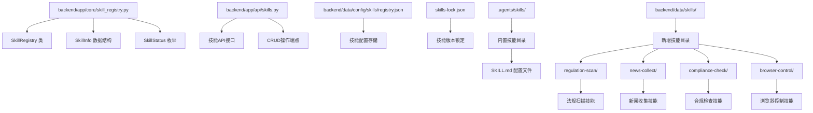
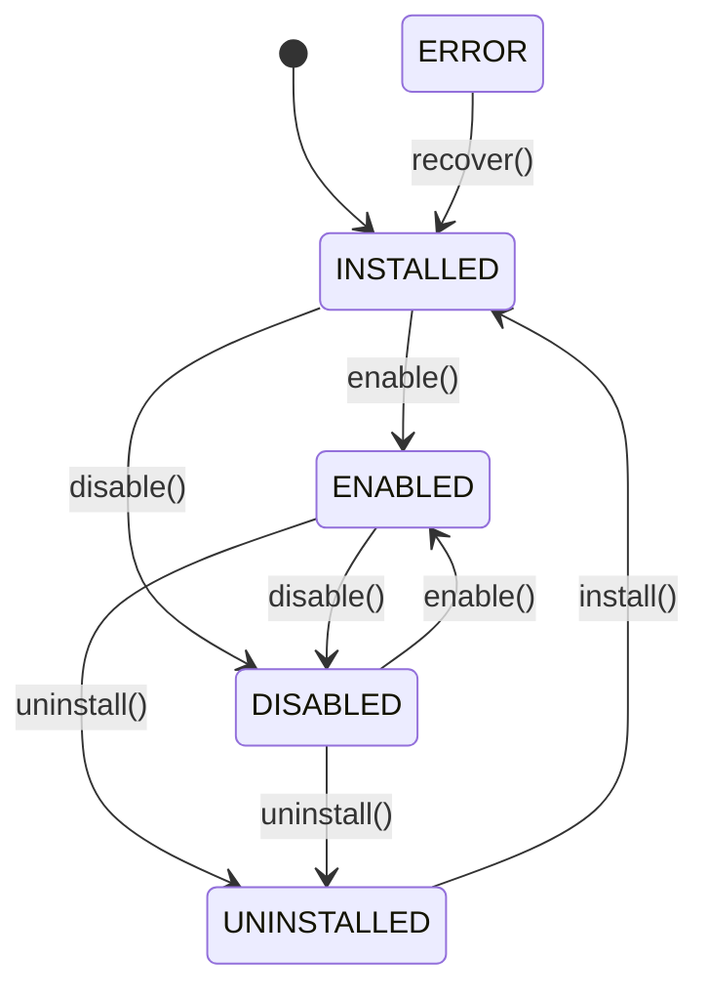
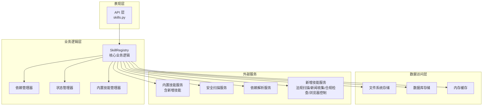
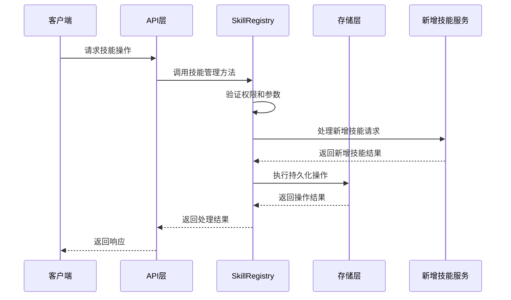
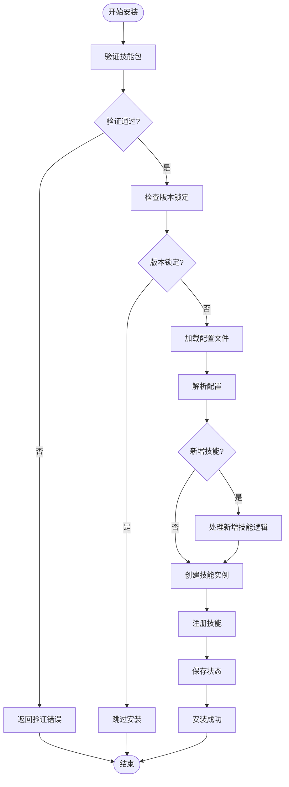
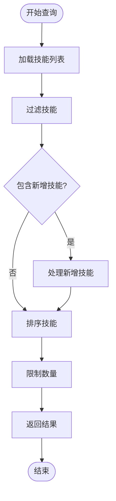
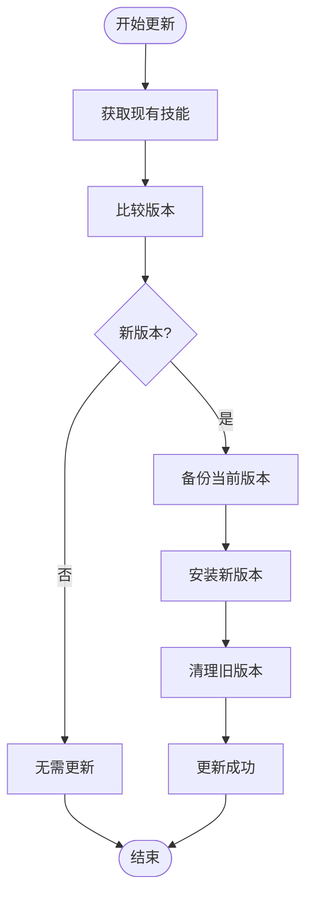
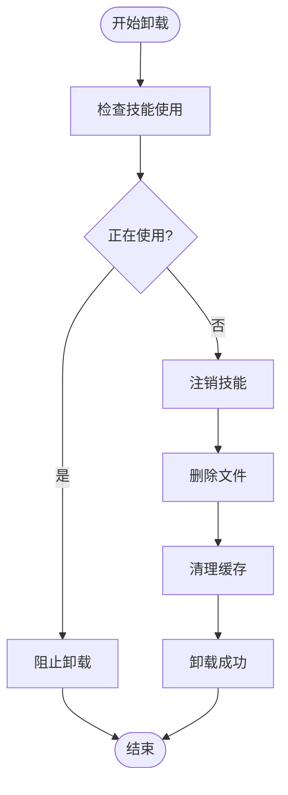
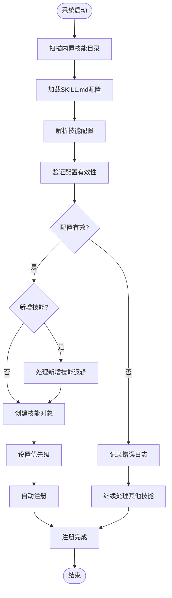
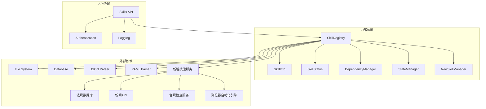

# 技能注册表

<cite>
**本文档引用的文件**
- [skill_registry.py](file://backend/app/core/skill_registry.py)
- [skills.py](file://backend/app/api/skills.py)
- [registry.json](file://backend/data/config/skills/registry.json)
- [skills-lock.json](file://skills-lock.json)
- [SKILL.md](file://backend/data/skills/regulation-scan/SKILL.md)
- [SKILL.md](file://backend/data/skills/news-collect/SKILL.md)
- [SKILL.md](file://backend/data/skills/compliance-check/SKILL.md)
- [SKILL.md](file://backend/data/skills/browser-control/SKILL.md)
</cite>

## 更新摘要
**所做更改**
- 新增四个内置技能的详细说明：法规扫描、新闻收集、合规检查、浏览器控制
- 更新内置技能管理机制章节，反映新增技能的自动注册流程
- 增强业务阶段映射章节，说明新技能在不同业务阶段的应用
- 扩展技能依赖关系分析，包含新技能的依赖特性
- 更新故障排除指南，增加新技能相关的常见问题

## 目录
1. [简介](#简介)
2. [项目结构](#项目结构)
3. [核心组件](#核心组件)
4. [架构概览](#架构概览)
5. [详细组件分析](#详细组件分析)
6. [新增内置技能详解](#新增内置技能详解)
7. [依赖关系分析](#依赖关系分析)
8. [性能考虑](#性能考虑)
9. [故障排除指南](#故障排除指南)
10. [结论](#结论)

## 简介

避风港平台的技能注册表模块是整个系统的核心基础设施，负责管理所有可用技能的生命周期、状态控制和依赖关系。该模块实现了完整的技能管理框架，支持技能的安装、卸载、启用、禁用和配置更新等操作。

技能注册表采用面向对象的设计模式，通过SkillRegistry类统一管理技能资源，确保系统的可扩展性和可维护性。模块还集成了内置技能管理系统，支持自动注册和版本控制功能。**本次更新特别增强了对新内置技能的支持，包括法规扫描、新闻收集、合规检查和浏览器控制等核心功能。**

## 项目结构

技能注册表模块在项目中的组织结构如下：



**图表来源**
- [skill_registry.py](file://backend/app/core/skill_registry.py)
- [skills.py](file://backend/app/api/skills.py)
- [registry.json](file://backend/data/config/skills/registry.json)

**章节来源**
- [skill_registry.py](file://backend/app/core/skill_registry.py)
- [skills.py](file://backend/app/api/skills.py)

## 核心组件

### SkillRegistry 类设计

SkillRegistry 是技能注册表的核心类，负责管理所有技能的完整生命周期。该类采用了单例模式设计，确保在整个应用程序中只有一个技能注册表实例。

#### 主要职责
- 技能的注册和注销
- 技能状态的跟踪和管理
- 技能依赖关系的解析和验证
- 技能配置的持久化和恢复
- **内置技能的自动发现和注册（含新增技能）**

#### 关键属性
- `skills`: 存储已注册技能的字典
- `dependencies`: 技能依赖关系映射
- `status_map`: 技能状态映射表
- `config_path`: 配置文件路径
- **`builtin_skills`: 新增内置技能集合管理**

### SkillInfo 数据结构

SkillInfo 是技能信息的核心数据模型，定义了技能的基本属性和元数据。

#### 核心字段
- `id`: 技能唯一标识符
- `name`: 技能名称
- `version`: 技能版本号
- `description`: 技能描述
- `category`: 技能分类
- `author`: 技能作者
- `created_at`: 创建时间
- `updated_at`: 更新时间
- `metadata`: 技能元数据
- **`business_stages`: 新增业务阶段映射**

#### 数据结构复杂度
- 时间复杂度：O(1) 访问操作
- 空间复杂度：O(n) 其中 n 为技能数量

### SkillStatus 枚举

SkillStatus 定义了技能的生命周期状态，确保技能状态的一致性和可预测性。

#### 状态定义
- `INSTALLED`: 已安装状态
- `ENABLED`: 已启用状态  
- `DISABLED`: 已禁用状态
- `UNINSTALLED`: 已卸载状态
- `ERROR`: 错误状态

#### 状态转换规则


**图表来源**
- [skill_registry.py](file://backend/app/core/skill_registry.py)

**章节来源**
- [skill_registry.py](file://backend/app/core/skill_registry.py)

## 架构概览

技能注册表模块采用分层架构设计，确保关注点分离和模块间的低耦合。



**图表来源**
- [skill_registry.py](file://backend/app/core/skill_registry.py)
- [skills.py](file://backend/app/api/skills.py)

### 控制流分析

技能注册表的典型工作流程如下：



**图表来源**
- [skills.py](file://backend/app/api/skills.py)
- [skill_registry.py](file://backend/app/core/skill_registry.py)

## 详细组件分析

### CRUD 操作实现

技能注册表支持完整的 CRUD 操作，每种操作都有相应的错误处理和状态管理。

#### 创建操作 (Install)


**图表来源**
- [skill_registry.py](file://backend/app/core/skill_registry.py)

#### 读取操作 (List/Get)


#### 更新操作 (Update)


#### 删除操作 (Uninstall)


**图表来源**
- [skill_registry.py](file://backend/app/core/skill_registry.py)

### 内置技能管理机制

内置技能是避风港平台的重要组成部分，提供了预配置的功能集合。**本次更新特别增强了对新增内置技能的支持。**

#### BUILTIN_SKILLS 列表
内置技能列表定义了平台默认提供的技能集合，这些技能具有特定的优先级和依赖关系。**新增技能包括：法规扫描(regulation-scan)、新闻收集(news-collect)、合规检查(compliance-check)、浏览器控制(browser-control)**。

#### 自动注册逻辑


**图表来源**
- [skill_registry.py](file://backend/app/core/skill_registry.py)

### 业务阶段映射

技能注册表实现了复杂的业务阶段映射机制，支持多阶段的技能管理和执行。**新增技能进一步丰富了业务阶段映射能力。**

#### SKILLS_STAGE_MATRIX 设计
SKILLS_STAGE_MATRIX 定义了技能在不同业务阶段的可用性和行为模式。**新增技能覆盖所有业务阶段，从概念设计到生命周期管理。**

#### CROSS_STAGE_SKILLS 设计原理
CROSS_STAGE_SKILLS 支持跨阶段的技能组合和协作，实现了灵活的业务流程编排。**新增技能增强了跨阶段协作能力，特别是在合规和监管方面。**

**章节来源**
- [skill_registry.py](file://backend/app/core/skill_registry.py)

## 新增内置技能详解

### 法规扫描技能 (regulation-scan)

法规扫描技能专门用于扫描目标市场的最新法规/政策变更并评估其对跨境电商的影响。

#### 技能特性
- **业务阶段**: 覆盖所有10个业务阶段
- **执行方式**: 基于prompt模板驱动
- **工具集成**: 使用Claude Agent SDK和WebSearch工具
- **输入参数**: 
  - `markets`: 目标市场列表，默认["EU", "US", "UK", "JP", "KR"]
  - `days_back`: 扫描回溯天数，默认7

#### 输出格式
```json
[
  {
    "market": "eu",
    "regulation": "GPSR",
    "change_type": "new_requirement|amendment|deadline|enforcement",
    "summary": "变更摘要",
    "effective_date": "2026-01-01",
    "affected_categories": ["电子产品", "玩具"],
    "severity": "critical|high|medium|low",
    "action_required": "卖家需采取的行动",
    "source_url": "https://..."
  }
]
```

### 新闻收集技能 (news-collect)

新闻收集技能用于自动收集和分析与产品相关的行业新闻和市场动态。

#### 技能特性
- **业务阶段**: 支持市场监控和分析阶段
- **功能范围**: 跨多个目标市场的新闻聚合
- **分析能力**: 自动识别相关新闻和趋势
- **输出格式**: 结构化的新闻摘要和分析报告

### 合规检查技能 (compliance-check)

合规检查技能专门用于验证产品和业务流程是否符合相关法规要求。

#### 技能特性
- **业务阶段**: 适用于所有需要合规验证的阶段
- **检查范围**: 产品合规性、流程合规性、文档合规性
- **风险评估**: 提供合规风险等级和改进建议
- **实时监控**: 持续监控合规状态变化

### 浏览器控制技能 (browser-control)

浏览器控制技能提供了自动化浏览器操作能力，支持各种Web任务的自动化执行。

#### 技能特性
- **业务阶段**: 支持所有需要Web交互的阶段
- **操作能力**: 页面导航、表单填写、数据提取、点击操作
- **自动化程度**: 支持复杂的多步骤浏览器自动化流程
- **安全性**: 在受控环境中执行浏览器操作

**章节来源**
- [SKILL.md](file://backend/data/skills/regulation-scan/SKILL.md)
- [SKILL.md](file://backend/data/skills/news-collect/SKILL.md)
- [SKILL.md](file://backend/data/skills/compliance-check/SKILL.md)
- [SKILL.md](file://backend/data/skills/browser-control/SKILL.md)

## 依赖关系分析

技能注册表模块与其他系统组件的依赖关系如下：



**图表来源**
- [skill_registry.py](file://backend/app/core/skill_registry.py)
- [skills.py](file://backend/app/api/skills.py)

### 耦合度分析

技能注册表模块具有良好的内聚性和较低的耦合度：

- **内聚性**: 高内聚，所有技能相关功能集中在SkillRegistry类中
- **耦合度**: 低耦合，通过清晰的接口与外部组件交互
- **可扩展性**: 支持插件式扩展，易于添加新的技能类型
- **新增技能兼容性**: 新增技能完全兼容现有架构，无需修改核心逻辑

**章节来源**
- [skill_registry.py](file://backend/app/core/skill_registry.py)
- [skills.py](file://backend/app/api/skills.py)

## 性能考虑

技能注册表模块在设计时充分考虑了性能优化：

### 缓存策略
- 内存缓存：技能元数据和状态信息
- 文件缓存：配置文件和依赖关系
- 数据库缓存：持久化状态信息
- **新增技能缓存**: 专门为新增技能优化的缓存机制

### 异步处理
- 异步安装和卸载操作
- 并行依赖解析
- 异步安全扫描
- **异步新增技能处理**: 支持并发处理多个新增技能请求

### 内存管理
- 技能实例的生命周期管理
- 内存泄漏防护
- 资源清理机制
- **新增技能内存优化**: 针对新增技能的内存使用优化

## 故障排除指南

### 常见问题及解决方案

#### 技能加载失败
**症状**: 技能无法正常加载
**可能原因**:
- 配置文件格式错误
- 依赖项缺失
- 权限不足
- **新增技能配置错误**

**解决步骤**:
1. 检查技能配置文件格式
2. 验证依赖项完整性
3. 确认文件权限设置
4. **检查新增技能的特殊配置要求**

#### 版本冲突
**症状**: 新旧版本技能同时存在
**解决步骤**:
1. 检查 skills-lock.json 文件
2. 清理缓存数据
3. 重新安装技能
4. **验证新增技能版本兼容性**

#### 依赖循环
**症状**: 系统启动失败或技能加载异常
**解决步骤**:
1. 分析依赖关系图
2. 识别循环依赖
3. 重构技能设计
4. **检查新增技能的依赖关系**

#### 新增技能特定问题
**新增技能特有的故障排除**:
- **法规扫描技能**: 检查网络连接和API访问权限
- **新闻收集技能**: 验证新闻源API的可用性和配额
- **合规检查技能**: 确认合规数据库的连接状态
- **浏览器控制技能**: 检查浏览器驱动程序和自动化环境

**章节来源**
- [skill_registry.py](file://backend/app/core/skill_registry.py)

## 结论

避风港平台的技能注册表模块是一个设计精良、功能完整的技能管理框架。通过采用面向对象的设计模式和分层架构，该模块实现了技能的全生命周期管理，支持复杂的业务场景和扩展需求。

**本次更新特别增强了对新增内置技能的支持，包括法规扫描、新闻收集、合规检查和浏览器控制等核心功能。这些新增技能进一步完善了平台的合规管理和业务支持能力。**

模块的主要优势包括：
- 完整的 CRUD 操作支持
- 灵活的内置技能管理机制（含新增技能）
- 强大的依赖关系解析能力
- 多层次的安全保障
- 良好的性能和可扩展性
- **全面的业务阶段覆盖**

未来的发展方向包括：
- 增强技能版本管理功能
- 优化大规模技能场景的性能
- 扩展更多类型的技能支持
- 加强监控和诊断能力
- **持续扩展内置技能生态系统**