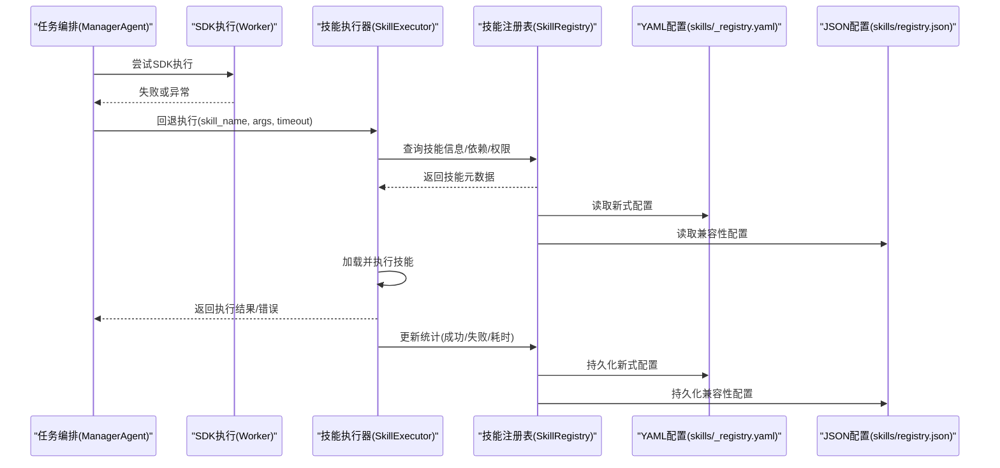
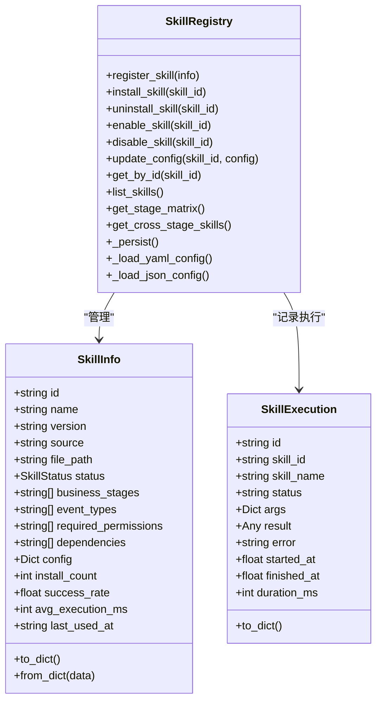
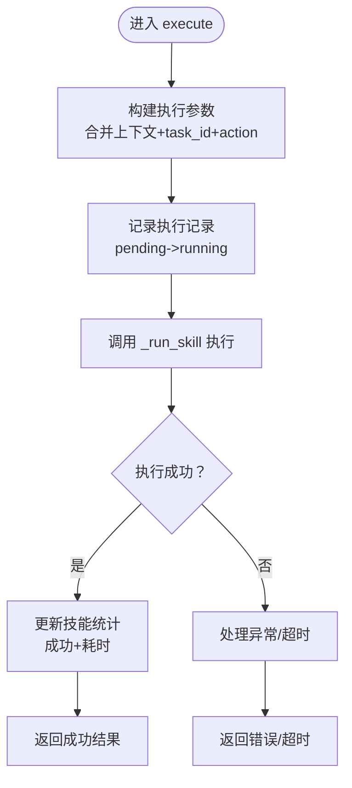
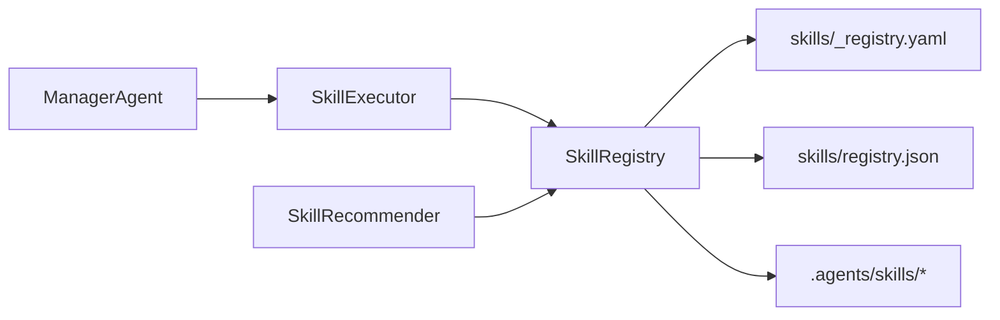

# 技能管理系统

<cite>
**本文引用的文件**
- [skill_registry.py](file://backend/app/core/skill_registry.py)
- [manager_agent.py](file://backend/app/core/manager_agent.py)
- [skills/_registry.yaml](file://backend/data/skills/_registry.yaml)
- [skills/registry.json](file://backend/data/skills/registry.json)
- [SKILL.md 示例](file://.agents/skills/gpt-taste/SKILL.md)
- [后端api.md](file://后端api.md)
- [前后端api交互.md](file://前后端api交互.md)
</cite>

## 更新摘要
**所做更改**
- 更新了技能注册表架构，从复杂的 registry.json 简化为更直接的配置方式
- 新增了 YAML 配置文件 _registry.yaml 的说明
- 更新了技能注册表的持久化机制和配置管理方式
- 修订了技能配置管理和扩展机制的相关内容

## 目录
1. [引言](#引言)
2. [项目结构](#项目结构)
3. [核心组件](#核心组件)
4. [架构总览](#架构总览)
5. [详细组件分析](#详细组件分析)
6. [依赖分析](#依赖分析)
7. [性能考虑](#性能考虑)
8. [故障排查指南](#故障排查指南)
9. [结论](#结论)
10. [附录](#附录)

## 引言
本文件面向避风港平台的技能管理系统，围绕技能注册表、技能执行器与技能推荐器进行系统性技术文档化，覆盖技能元数据管理、版本控制、依赖关系、执行流程、推荐策略、配置管理、扩展机制以及开发与集成实践。文档以代码为依据，结合架构图与流程图帮助读者快速理解并高效使用该系统。

**更新** 技能注册表已从复杂的 JSON 配置文件简化为更直接的 YAML 配置方式，提高了配置的可读性和维护效率。

## 项目结构
技能系统主要由三部分构成：
- 核心注册与执行：位于 backend/app/core/skill_registry.py，包含技能注册表、技能执行器、技能推荐器及阶段映射矩阵等。
- 业务编排接入：位于 backend/app/core/manager_agent.py，负责在任务执行中回退到技能执行器。
- 配置与技能资产：位于 backend/data/skills/_registry.yaml 作为新的技能注册表配置；backend/data/skills/registry.json 作为兼容性保留；.agents/skills 下存放各技能的 SKILL.md 描述文件。

```mermaid
graph TB
subgraph "后端核心"
SR["SkillRegistry<br/>技能注册表"]
SE["SkillExecutor<br/>技能执行器"]
RE["SkillRecommender<br/>技能推荐器"]
MM["ManagerAgent<br/>任务编排"]
end
subgraph "配置与资产"
CFG["skills/_registry.yaml<br/>新式配置文件"]
JSON["skills/registry.json<br/>兼容性保留"]
ASSET[".agents/skills/*<br/>SKILL.md 描述文件"]
end
MM --> SE
SE --> SR
RE --> SR
SR <- --> CFG
SR <- --> JSON
SR <- --> ASSET
```

**图表来源**
- [skill_registry.py:1-966](file://backend/app/core/skill_registry.py#L1-L966)
- [manager_agent.py:509-543](file://backend/app/core/manager_agent.py#L509-L543)
- [skills/_registry.yaml](file://backend/data/skills/_registry.yaml)
- [skills/registry.json](file://backend/data/skills/registry.json)
- [SKILL.md 示例](file://.agents/skills/gpt-taste/SKILL.md)

**章节来源**
- [skill_registry.py:1-966](file://backend/app/core/skill_registry.py#L1-L966)
- [manager_agent.py:509-543](file://backend/app/core/manager_agent.py#L509-L543)
- [skills/_registry.yaml](file://backend/data/skills/_registry.yaml)
- [skills/registry.json](file://backend/data/skills/registry.json)
- [SKILL.md 示例](file://.agents/skills/gpt-taste/SKILL.md)

## 核心组件
- 技能注册表（SkillRegistry）：负责技能的注册、安装、卸载、启用/禁用、查询、配置更新、状态与统计维护，并支持 YAML 和 JSON 两种配置格式的持久化。
- 技能执行器（SkillExecutor）：负责加载技能、传递参数、执行并处理结果，支持超时控制与执行统计更新。
- 技能推荐器（SkillRecommender）：基于事件类型、业务阶段与上下文进行技能推荐，支持阶段映射矩阵与跨阶段通用技能。
- 任务编排接入：ManagerAgent 在 SDK 执行失败时回退到技能执行器，统一对外输出标准化结果。

**章节来源**
- [skill_registry.py:1-966](file://backend/app/core/skill_registry.py#L1-L966)
- [manager_agent.py:509-543](file://backend/app/core/manager_agent.py#L509-L543)

## 架构总览
下图展示从任务编排到技能执行的整体流程，以及技能注册表与外部资产的交互。



**图表来源**
- [manager_agent.py:521-535](file://backend/app/core/manager_agent.py#L521-L535)
- [skill_registry.py:410-476](file://backend/app/core/skill_registry.py#L410-L476)
- [skills/_registry.yaml](file://backend/data/skills/_registry.yaml)
- [skills/registry.json](file://backend/data/skills/registry.json)

## 详细组件分析

### 技能注册表（SkillRegistry）
职责与能力
- 元数据管理：维护技能的标识、名称、描述、版本、作者、来源、文件路径、状态、适用阶段、事件类型、权限、依赖、配置、统计指标等。
- 生命周期管理：安装、卸载、启用、禁用、查询、配置更新。
- 统计与追踪：记录安装次数、成功率、平均耗时、最后使用时间等。
- **更新** 多格式持久化：支持 YAML 和 JSON 两种配置格式的读写，确保向后兼容性。

关键数据结构
- SkillInfo：技能元数据与统计字段的数据类。
- SkillExecution：执行记录，包含状态、参数、结果、错误、起止时间与耗时。

实现要点
- 版本控制：通过 version 字段与 source/source_url 表征来源与版本，便于升级与回滚。
- 依赖关系：dependencies 字段声明前置技能，执行前可按需校验或排序。
- 权限与安全：required_permissions 字段用于安全扫描与授权控制；security_scan 记录扫描结果。
- 阶段映射：SKILLS_STAGE_MATRIX 提供阶段到技能的映射，CROSS_STAGE_SKILLS 提供跨阶段通用技能。
- **更新** 配置兼容性：同时支持 _registry.yaml 和 registry.json 两种格式，新系统优先使用 YAML 格式。



**图表来源**
- [skill_registry.py:33-96](file://backend/app/core/skill_registry.py#L33-L96)

**章节来源**
- [skill_registry.py:33-408](file://backend/app/core/skill_registry.py#L33-L408)
- [skills/_registry.yaml](file://backend/data/skills/_registry.yaml)
- [skills/registry.json](file://backend/data/skills/registry.json)

### 技能执行器（SkillExecutor）
职责与能力
- 技能加载：根据技能名定位 SKILL.md 或本地资源，解析执行入口与参数。
- 参数传递：接收任务上下文参数，注入 task_id、action 等关键字段。
- 执行与结果处理：异步执行技能，捕获超时、异常，返回标准化结果。
- 统计更新：根据执行结果更新技能的成功率、平均耗时与最后使用时间。

执行流程


**图表来源**
- [skill_registry.py:442-476](file://backend/app/core/skill_registry.py#L442-L476)
- [skill_registry.py:855-866](file://backend/app/core/skill_registry.py#L855-L866)

**章节来源**
- [skill_registry.py:410-476](file://backend/app/core/skill_registry.py#L410-L476)
- [skill_registry.py:855-866](file://backend/app/core/skill_registry.py#L855-L866)

### 技能推荐器（SkillRecommender）
职责与能力
- 事件驱动推荐：根据事件类别返回三层动作（Skill/CLI/API）建议。
- 阶段驱动推荐：根据业务阶段返回阶段技能清单，若提供事件类型则精确匹配，否则附加跨阶段通用技能。
- 上下文综合推荐：整合业务阶段、事件类别、产品类型等上下文生成多源推荐。

推荐策略
- 阶段映射矩阵：SKILLS_STAGE_MATRIX 按阶段组织技能，EVENT_ACTION_MAP 提供事件到动作映射。
- 跨阶段通用：CROSS_STAGE_SKILLS 保证通用能力在各阶段可用。

**章节来源**
- [skill_registry.py:874-917](file://backend/app/core/skill_registry.py#L874-L917)

### 任务编排回退机制（ManagerAgent）
当 SDK 执行失败时，ManagerAgent 自动回退到技能执行器，统一输出结构包含 worker、task_type、sdk_executed 标记、状态与错误信息，确保上层调用的一致性。

**章节来源**
- [manager_agent.py:515-543](file://backend/app/core/manager_agent.py#L515-L543)

## 依赖分析
- 内部耦合
  - SkillExecutor 依赖 SkillRegistry 进行技能查询与统计更新。
  - SkillRecommender 依赖 SkillRegistry 的阶段映射与通用技能列表。
  - ManagerAgent 依赖 SkillExecutor 进行回退执行。
- 外部依赖
  - 技能资产：.agents/skills 下的 SKILL.md 描述文件，提供技能元数据与执行入口。
  - **更新** 配置文件：skills/_registry.yaml 提供新式配置，skills/registry.json 保持兼容性。



**图表来源**
- [manager_agent.py:521-535](file://backend/app/core/manager_agent.py#L521-L535)
- [skill_registry.py:949-966](file://backend/app/core/skill_registry.py#L949-L966)
- [skills/_registry.yaml](file://backend/data/skills/_registry.yaml)
- [skills/registry.json](file://backend/data/skills/registry.json)
- [.agents/skills](file://.agents/skills)

**章节来源**
- [manager_agent.py:509-543](file://backend/app/core/manager_agent.py#L509-L543)
- [skill_registry.py:949-966](file://backend/app/core/skill_registry.py#L949-L966)

## 性能考虑
- 超时控制：执行器默认超时可配置，避免长时间阻塞；超时即刻返回，降低任务堆积风险。
- 统计驱动优化：通过成功率与平均耗时指导技能选择与重试策略，减少失败开销。
- 并发与隔离：执行器内部采用异步执行与独立的执行记录，避免相互干扰。
- **更新** 配置读取优化：新式 YAML 配置文件具有更好的解析性能，同时保持 JSON 兼容性以确保平滑迁移。

## 故障排查指南
常见问题与定位
- 技能未找到或加载失败
  - 检查技能是否已安装且状态为 active。
  - 核对 file_path 与 SKILL.md 是否存在。
  - 查看执行记录中的错误信息与耗时。
- 权限不足或安全扫描失败
  - 检查 required_permissions 与 security_scan 结果。
  - 确认执行环境具备所需权限。
- 超时或执行异常
  - 调整执行器超时阈值。
  - 分析执行统计，优先选择成功率高、耗时短的技能。
- 推荐不准确
  - 核对业务阶段与事件类型是否正确传入。
  - 检查阶段映射矩阵与跨阶段通用技能配置。
- **更新** 配置文件问题
  - 确认 YAML 配置文件格式正确，优先使用 _registry.yaml。
  - 如遇兼容性问题，检查 registry.json 是否存在且格式有效。

**章节来源**
- [skill_registry.py:467-476](file://backend/app/core/skill_registry.py#L467-L476)
- [skill_registry.py:855-866](file://backend/app/core/skill_registry.py#L855-L866)

## 结论
避风港平台的技能管理系统以 SkillRegistry 为核心，配合 SkillExecutor 与 SkillRecommender 实现了从技能注册、配置、执行到推荐的完整闭环。**更新** 新的 YAML 配置方式简化了技能注册表的管理，提高了配置的可读性和维护效率。通过阶段映射矩阵与跨阶段通用技能，系统在不同业务阶段提供一致的能力支撑；通过统计与安全扫描，保障执行质量与合规性。结合 ManagerAgent 的回退机制，系统在复杂场景下仍能稳定运行。

## 附录

### 技能配置管理
- 技能参数设置
  - 使用 update_config 动态更新技能配置，适用于运行时调整行为。
- 执行环境配置
  - 通过 required_permissions 与 security_scan 控制执行环境与安全策略。
- 安全控制
  - 依赖权限检查与安全扫描结果，必要时拒绝执行或降级处理。
- **更新** 配置格式选择
  - 新系统推荐使用 YAML 格式的 _registry.yaml 文件，提供更好的可读性。
  - 保持 registry.json 兼容性，确保平滑过渡。

**章节来源**
- [skill_registry.py:376-383](file://backend/app/core/skill_registry.py#L376-L383)
- [skill_registry.py:56-63](file://backend/app/core/skill_registry.py#L56-L63)
- [skills/_registry.yaml](file://backend/data/skills/_registry.yaml)
- [skills/registry.json](file://backend/data/skills/registry.json)

### 技能扩展机制
- 自定义技能开发
  - 在 .agents/skills 下新增目录与 SKILL.md 描述文件，遵循技能元数据规范。
- 插件化架构
  - 注册表支持多种来源（builtin/local/github），便于插件化扩展。
- 动态加载
  - 执行器按技能名解析资源路径，支持本地与远程资源动态加载。
- **更新** 配置文件管理
  - 新增技能时，优先在 _registry.yaml 中添加配置条目。
  - 保持与现有 JSON 配置的兼容性。

**章节来源**
- [SKILL.md 示例](file://.agents/skills/gpt-taste/SKILL.md)
- [skill_registry.py:50-52](file://backend/app/core/skill_registry.py#L50-L52)
- [skills/_registry.yaml](file://backend/data/skills/_registry.yaml)

### 开发与集成指南
- 技能编写规范
  - 明确技能元数据（name/version/source/file_path/status/events/permissions/dependencies/config）。
  - 在 SKILL.md 中定义执行入口与参数说明。
- 测试方法
  - 使用执行器的 execute 方法进行单元测试，覆盖正常、超时、异常分支。
  - 基于执行记录与统计指标评估性能与稳定性。
- 部署流程
  - 将技能资产放入 .agents/skills 对应目录。
  - 通过注册表进行 register/install/enable，确保状态为 active。
  - **更新** 优先使用 _registry.yaml 进行配置管理，保持 registry.json 兼容性。
  - 重启后生效。

**章节来源**
- [后端api.md](file://后端api.md)
- [前后端api交互.md](file://前后端api交互.md)
- [skills/_registry.yaml](file://backend/data/skills/_registry.yaml)
- [skills/registry.json](file://backend/data/skills/registry.json)

### API 文档与使用案例
- API 参考
  - 注册表接口：register_skill、install_skill、uninstall_skill、enable_skill、disable_skill、update_config、get_by_id、list_skills、get_stage_matrix、get_cross_stage_skills。
  - 执行器接口：execute（技能名、参数、超时）。
  - 推荐器接口：recommend_by_event、recommend_by_stage、recommend_by_context。
- 使用案例
  - 事件驱动：根据事件类别推荐三层动作，快速响应。
  - 阶段驱动：在特定业务阶段自动推荐适用技能，提升自动化水平。
  - 上下文驱动：结合业务阶段与产品类型生成个性化推荐，提高命中率。
- **更新** 配置管理案例
  - 新式配置：使用 YAML 格式在 _registry.yaml 中添加技能配置。
  - 兼容性迁移：逐步将现有 JSON 配置迁移到新的 YAML 格式。

**章节来源**
- [后端api.md](file://后端api.md)
- [skill_registry.py:883-917](file://backend/app/core/skill_registry.py#L883-L917)
- [skills/_registry.yaml](file://backend/data/skills/_registry.yaml)
- [skills/registry.json](file://backend/data/skills/registry.json)