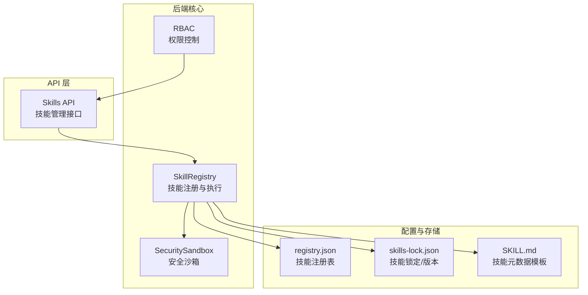
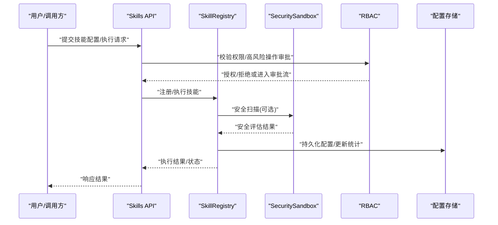
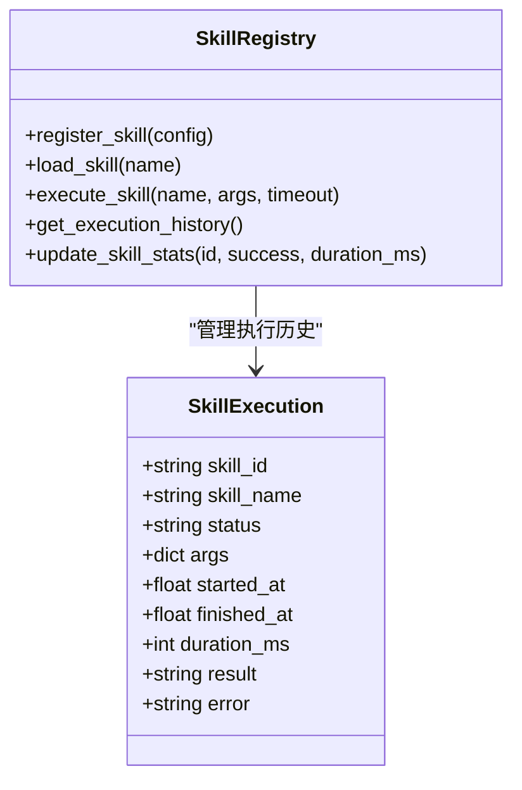
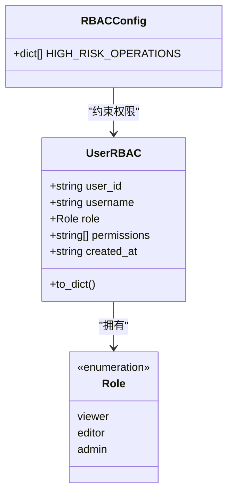
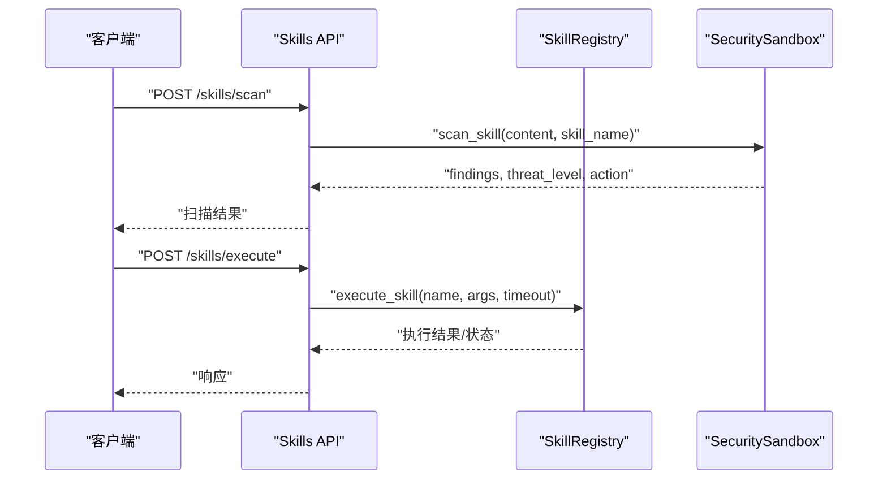
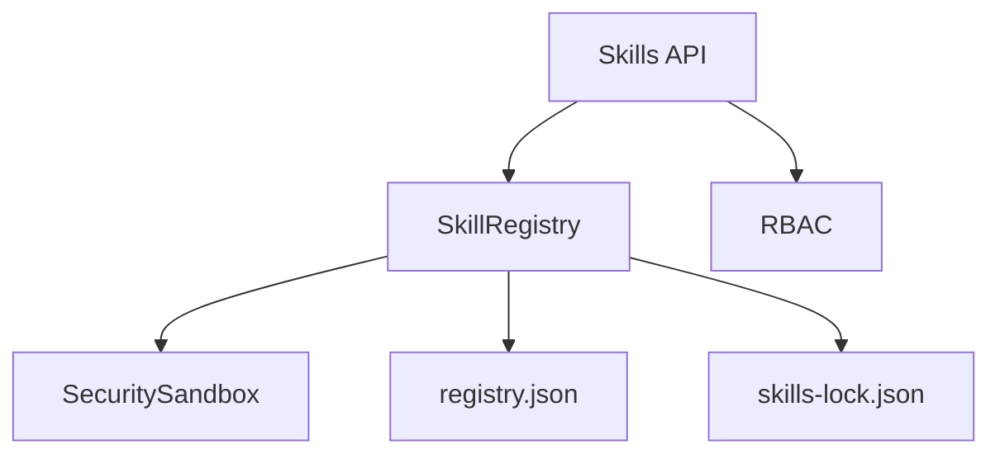

# 技能配置管理

<cite>
**本文引用的文件**
- [skill_registry.py](file://backend/app/core/skill_registry.py)
- [rbac.py](file://backend/app/core/rbac.py)
- [security_sandbox.py](file://backend/app/core/security_sandbox.py)
- [skills.py](file://backend/app/api/skills.py)
- [registry.json](file://backend/data/config/skills/registry.json)
- [skills-lock.json](file://skills-lock.json)
- [SKILL.md](file://.agents/skills/stitch-design-taste/SKILL.md)
</cite>

## 目录
1. [简介](#简介)
2. [项目结构](#项目结构)
3. [核心组件](#核心组件)
4. [架构总览](#架构总览)
5. [详细组件分析](#详细组件分析)
6. [依赖关系分析](#依赖关系分析)
7. [性能考虑](#性能考虑)
8. [故障排查指南](#故障排查指南)
9. [结论](#结论)
10. [附录](#附录)

## 简介
本文件面向避风港平台的“技能配置管理”模块，系统性阐述技能配置的数据结构、验证与持久化机制，技能参数的动态配置与环境注入，执行环境的依赖与版本管理，安全配置与权限控制，以及技能配置的导入导出与迁移策略。文档同时提供最佳实践与安全建议，帮助开发者与运维人员高效、安全地管理平台技能生态。

## 项目结构
技能配置管理涉及后端核心模块、API 层、配置存储与前端页面等多部分协作：
- 核心执行与注册：backend/app/core/skill_registry.py
- 权限与安全：backend/app/core/rbac.py、backend/app/core/security_sandbox.py
- API 接口：backend/app/api/skills.py
- 配置存储：backend/data/config/skills/registry.json
- 锁定与版本：skills-lock.json
- 技能模板：.agents/skills/*/SKILL.md



**图表来源**
- [skill_registry.py](file://backend/app/core/skill_registry.py)
- [rbac.py](file://backend/app/core/rbac.py)
- [security_sandbox.py](file://backend/app/core/security_sandbox.py)
- [skills.py](file://backend/app/api/skills.py)
- [registry.json](file://backend/data/config/skills/registry.json)
- [skills-lock.json](file://skills-lock.json)
- [SKILL.md](file://.agents/skills/stitch-design-taste/SKILL.md)

**章节来源**
- [skill_registry.py](file://backend/app/core/skill_registry.py)
- [skills.py](file://backend/app/api/skills.py)
- [registry.json](file://backend/data/config/skills/registry.json)
- [skills-lock.json](file://skills-lock.json)
- [SKILL.md](file://.agents/skills/stitch-design-taste/SKILL.md)

## 核心组件
- 技能注册与执行器：负责技能的加载、参数解析、执行、统计与超时处理，并维护执行历史。
- 安全沙箱：对技能内容进行注入检测、权限声明审查、敏感信息识别与网络访问检查，生成威胁等级与处置动作。
- RBAC 权限模型：定义资源与动作，声明高风险操作清单，提供用户角色与权限映射。
- API 层：对外暴露技能配置、安装、执行、查询与安全扫描等接口。
- 配置存储：以 JSON 形式持久化技能注册表；通过 skills-lock.json 实现版本锁定与迁移。

**章节来源**
- [skill_registry.py](file://backend/app/core/skill_registry.py)
- [rbac.py](file://backend/app/core/rbac.py)
- [security_sandbox.py](file://backend/app/core/security_sandbox.py)
- [skills.py](file://backend/app/api/skills.py)
- [registry.json](file://backend/data/config/skills/registry.json)
- [skills-lock.json](file://skills-lock.json)

## 架构总览
技能配置管理的端到端流程如下：
- 配置阶段：读取 SKILL.md 元数据，写入 registry.json；必要时通过 skills-lock.json 锁定版本。
- 审核阶段：安全沙箱扫描技能内容，生成安全事件与处置建议。
- 权限阶段：RBAC 校验操作者权限，对高风险操作触发审批流程。
- 执行阶段：API 调用 SkillRegistry 执行技能，支持运行时参数注入与环境变量注入。
- 统计阶段：记录执行状态、耗时与错误，更新技能统计。



**图表来源**
- [skills.py](file://backend/app/api/skills.py)
- [skill_registry.py](file://backend/app/core/skill_registry.py)
- [security_sandbox.py](file://backend/app/core/security_sandbox.py)
- [rbac.py](file://backend/app/core/rbac.py)
- [registry.json](file://backend/data/config/skills/registry.json)

## 详细组件分析

### 技能注册与执行（SkillRegistry）
- 注册与加载：从配置存储读取技能元数据，构建可执行单元；支持按名称检索与版本匹配。
- 参数与环境：接收运行时参数字典，合并默认参数与环境变量，形成最终执行上下文。
- 执行与超时：异步执行技能逻辑，设置默认超时时间；记录执行状态、耗时与错误。
- 统计与追踪：维护技能执行次数、成功率与平均耗时；记录每次执行的开始/结束时间与结果。



**图表来源**
- [skill_registry.py](file://backend/app/core/skill_registry.py)

**章节来源**
- [skill_registry.py](file://backend/app/core/skill_registry.py)

### 安全沙箱（SecuritySandbox）
- 注入检测：基于正则模式检测潜在的提示词注入风险，限制匹配数量以避免噪声。
- 权限声明审查：识别高风险权限声明，触发不同级别的处置动作（允许/警告/阻断）。
- 敏感信息识别：扫描可能泄露的敏感信息片段，纳入安全事件。
- 网络访问检查：识别网络访问相关模式，标记低风险发现。
- 威胁等级与处置：根据发现严重程度自动分级并决定放行、警告或阻断。

```mermaid
flowchart TD
Start(["开始扫描"]) --> Inject["注入检测"]
Inject --> Perm["权限声明审查"]
Perm --> Sensitive["敏感信息识别"]
Sensitive --> Network["网络访问检查"]
Network --> Merge["汇总发现"]
Merge --> Severity{"严重级别判定"}
Severity --> |critical| Block["阻断并记录"]
Severity --> |high| Approve["需要审批"]
Severity --> |medium| Warn["发出警告"]
Severity --> |none| Allow["允许执行"]
Block --> End(["结束"])
Approve --> End
Warn --> End
Allow --> End
```



**图表来源**
- [security_sandbox.py](file://backend/app/core/security_sandbox.py)

**章节来源**
- [security_sandbox.py](file://backend/app/core/security_sandbox.py)

### 权限控制（RBAC）
- 资源与动作：定义产品、合规、配置、用户、技能、插件、集成等资源的动作集合。
- 高风险操作清单：明确需要审批的操作类型，如删除、生命周期变更、覆盖结果、更新配置、安装技能/插件、新建第三方连接等。
- 用户权限模型：以角色为基础，映射具体权限字符串，支持读取、更新、删除、执行等细粒度控制。



**图表来源**
- [rbac.py](file://backend/app/core/rbac.py)

**章节来源**
- [rbac.py](file://backend/app/core/rbac.py)

### API 层（Skills API）
- 技能管理接口：提供技能注册、更新、删除、查询与执行入口；支持批量导入/导出配置。
- 安全扫描接口：对技能内容进行安全扫描，返回评估报告与处置建议。
- 事件与统计：提供安全事件日志与统计信息查询，便于审计与监控。



**图表来源**
- [skills.py](file://backend/app/api/skills.py)
- [skill_registry.py](file://backend/app/core/skill_registry.py)
- [security_sandbox.py](file://backend/app/core/security_sandbox.py)

**章节来源**
- [skills.py](file://backend/app/api/skills.py)

### 配置存储与版本控制
- 注册表（registry.json）：以 JSON 结构存储技能元数据、依赖、参数模板与执行配置。
- 锁定与迁移（skills-lock.json）：通过版本锁定确保环境一致性；支持迁移脚本与版本升级策略。

```mermaid
graph LR
REG["registry.json"] <- --> |读写| SR["SkillRegistry"]
LOCK["skills-lock.json"] <- --> |版本锁定| SR
SR --> |执行| SKILLMD["SKILL.md"]
```

**图表来源**
- [registry.json](file://backend/data/config/skills/registry.json)
- [skills-lock.json](file://skills-lock.json)
- [skill_registry.py](file://backend/app/core/skill_registry.py)
- [SKILL.md](file://.agents/skills/stitch-design-taste/SKILL.md)

**章节来源**
- [registry.json](file://backend/data/config/skills/registry.json)
- [skills-lock.json](file://skills-lock.json)
- [skill_registry.py](file://backend/app/core/skill_registry.py)
- [SKILL.md](file://.agents/skills/stitch-design-taste/SKILL.md)

## 依赖关系分析
- 组件耦合：API 层依赖 SkillRegistry；SkillRegistry 依赖 SecuritySandbox 与配置存储；RBAC 提供权限前置校验。
- 外部依赖：技能执行可能依赖外部服务或文件系统，需通过安全沙箱与 RBAC 控制访问范围。
- 版本与迁移：skills-lock.json 与 registry.json 协同，确保配置变更的可追溯与可回滚。



**图表来源**
- [skills.py](file://backend/app/api/skills.py)
- [skill_registry.py](file://backend/app/core/skill_registry.py)
- [security_sandbox.py](file://backend/app/core/security_sandbox.py)
- [rbac.py](file://backend/app/core/rbac.py)
- [registry.json](file://backend/data/config/skills/registry.json)
- [skills-lock.json](file://skills-lock.json)

**章节来源**
- [skills.py](file://backend/app/api/skills.py)
- [skill_registry.py](file://backend/app/core/skill_registry.py)
- [security_sandbox.py](file://backend/app/core/security_sandbox.py)
- [rbac.py](file://backend/app/core/rbac.py)
- [registry.json](file://backend/data/config/skills/registry.json)
- [skills-lock.json](file://skills-lock.json)

## 性能考虑
- 异步执行与超时：通过异步执行与超时控制避免阻塞；合理设置超时阈值，结合统计指标优化执行路径。
- 缓存与复用：对频繁使用的技能元数据与扫描结果进行缓存，减少重复计算。
- 并发与队列：在高并发场景下引入队列与限流，保障系统稳定性。
- 存储优化：采用分层存储与增量更新策略，降低 registry.json 的写放大。

## 故障排查指南
- 执行失败：检查 SkillExecution 记录中的错误字段与耗时统计，定位参数、依赖或超时问题。
- 安全阻断：查看安全沙箱的 findings 与威胁等级，优先处理 critical 级别问题；对 high 级别触发审批。
- 权限不足：确认用户角色与权限映射，核对高风险操作是否已进入审批流程。
- 配置不一致：比对 skills-lock.json 与 registry.json 的版本号，执行迁移脚本修复。

**章节来源**
- [skill_registry.py](file://backend/app/core/skill_registry.py)
- [security_sandbox.py](file://backend/app/core/security_sandbox.py)
- [rbac.py](file://backend/app/core/rbac.py)
- [registry.json](file://backend/data/config/skills/registry.json)
- [skills-lock.json](file://skills-lock.json)

## 结论
避风港平台的技能配置管理通过“注册-审核-权限-执行-统计”的闭环设计，实现了对技能的全生命周期治理。结合安全沙箱与 RBAC 的双重保障，既能保证执行效率，又能有效控制风险。配合 registry.json 与 skills-lock.json 的版本化管理，可实现稳定的批量配置与平滑迁移。

## 附录
- 最佳实践
  - 在 SKILL.md 中明确声明依赖与权限需求，便于安全扫描与权限校验。
  - 使用 skills-lock.json 锁定关键技能版本，避免环境漂移。
  - 对高风险技能启用审批流程，记录安全事件与处置过程。
  - 定期清理与归档执行历史与扫描报告，保持系统可观测性。
- 安全建议
  - 严格限制技能对文件系统与网络的访问，仅授予最小必要权限。
  - 对外部输入进行严格的参数校验与白名单过滤，防范注入攻击。
  - 定期更新安全规则库，提升对新型威胁的识别能力。