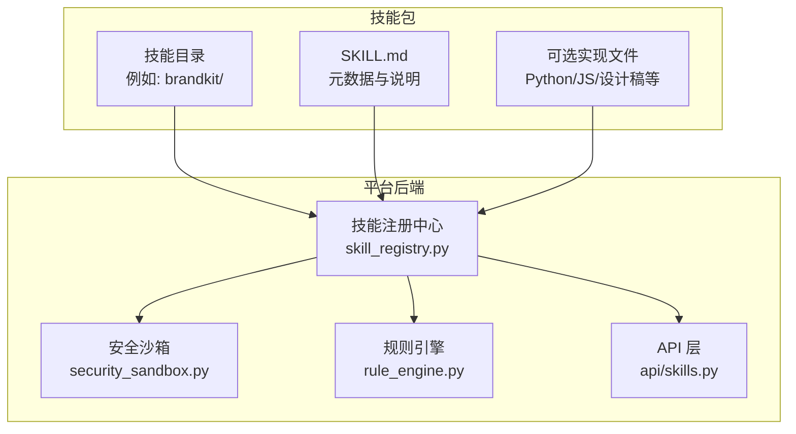
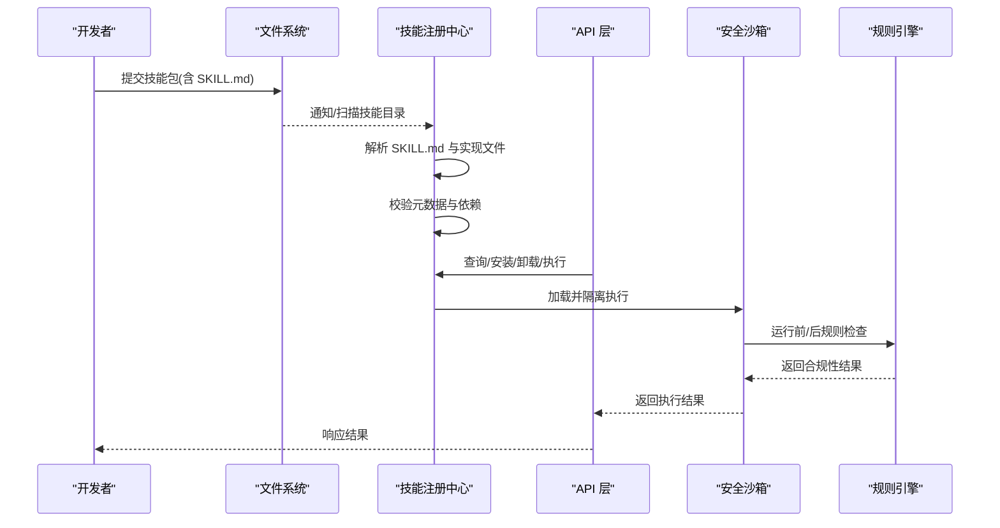
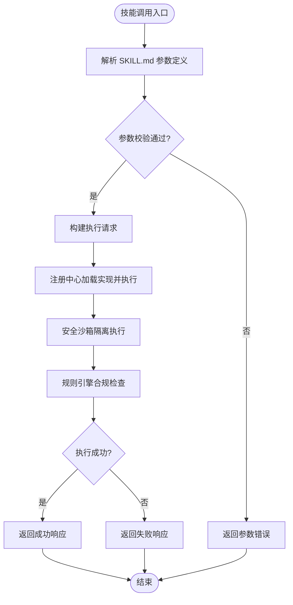
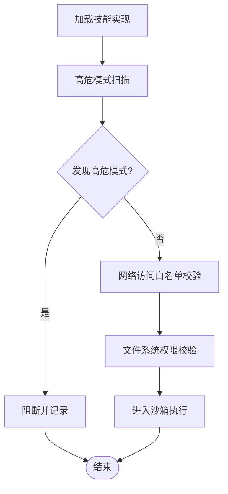
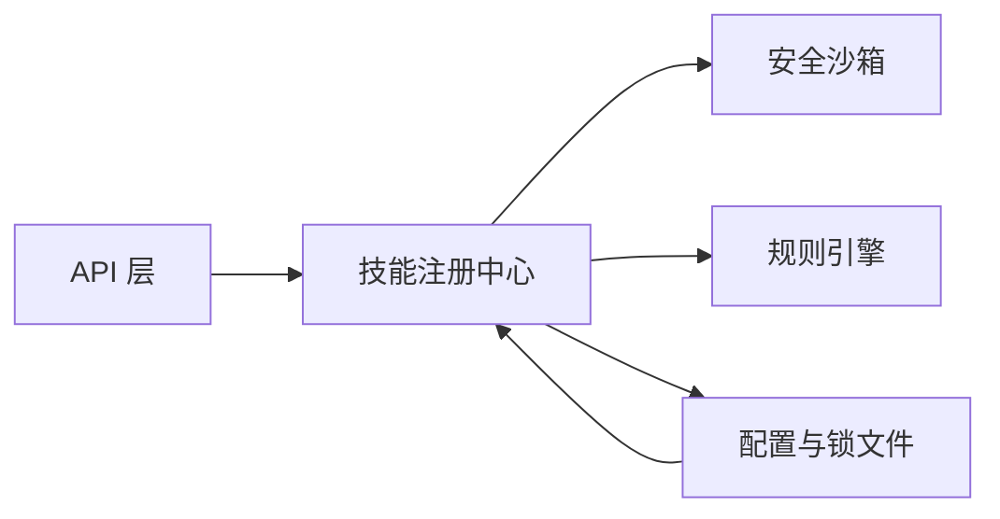

# 自定义技能开发

<cite>
**本文引用的文件**
- [backend/app/core/skill_registry.py](file://backend/app/core/skill_registry.py)
- [backend/data/config/skills/registry.json](file://backend/data/config/skills/registry.json)
- [.agents/skills/brandkit/SKILL.md](file://.agents/skills/brandkit/SKILL.md)
- [.agents/skills/design-taste-frontend/SKILL.md](file://.agents/skills/design-taste-frontend/SKILL.md)
- [.agents/skills/high-end-visual-design/SKILL.md](file://.agents/skills/high-end-visual-design/SKILL.md)
- [skills-lock.json](file://skills-lock.json)
- [backend/tests/测试规范.md](file://backend/tests/测试规范.md)
- [backend/app/api/skills.py](file://backend/app/api/skills.py)
- [backend/app/core/security_sandbox.py](file://backend/app/core/security_sandbox.py)
- [backend/app/api/code_security.py](file://backend/app/api/code_security.py)
- [backend/app/core/rule_engine.py](file://backend/app/core/rule_engine.py)
- [backend/app/api/tools.py](file://backend/app/api/tools.py)
- [backend/app/core/plugin_manager.py](file://backend/app/core/plugin_manager.py)
- [backend/app/core/task_decomposer.py](file://backend/app/core/task_decomposer.py)
- [backend/app/api/cli.py](file://backend/app/api/cli.py)
- [backend/app/main.py](file://backend/app/main.py)
</cite>

## 目录
1. [简介](#简介)
2. [项目结构](#项目结构)
3. [核心组件](#核心组件)
4. [架构总览](#架构总览)
5. [详细组件分析](#详细组件分析)
6. [依赖关系分析](#依赖关系分析)
7. [性能考虑](#性能考虑)
8. [故障排查指南](#故障排查指南)
9. [结论](#结论)
10. [附录](#附录)

## 简介
本文件面向避风港平台的自定义技能开发者，系统性阐述技能开发的规范与标准，涵盖 SKILL.md 元数据定义、目录结构、实现接口、安全要求、测试方法与调试技巧。通过结合平台现有技能样例与核心注册、安全与规则引擎，帮助开发者快速构建符合平台规范的高质量技能。

## 项目结构
自定义技能以“技能包”形式组织，每个技能包包含一个必需的 SKILL.md 元数据文件，以及可选的实现文件（如 Python 脚本、设计文档等）。平台通过技能注册中心统一管理技能清单与加载流程；同时在后端提供安全沙箱与代码审查机制，确保技能运行的安全性与合规性。

图表来源
- [backend/app/core/skill_registry.py:1-100](file://backend/app/core/skill_registry.py#L1-L100)
- [backend/app/core/security_sandbox.py:1-100](file://backend/app/core/security_sandbox.py#L1-L100)
- [backend/app/core/rule_engine.py:1-100](file://backend/app/core/rule_engine.py#L1-L100)
- [backend/app/api/skills.py:1-100](file://backend/app/api/skills.py#L1-L100)

章节来源
- [backend/app/core/skill_registry.py:1-100](file://backend/app/core/skill_registry.py#L1-L100)
- [backend/data/config/skills/registry.json:1-200](file://backend/data/config/skills/registry.json#L1-L200)

## 核心组件
- 技能注册中心：负责扫描技能包、解析 SKILL.md、校验元数据、加载实现文件、维护技能索引与版本信息。
- 安全沙箱：对技能执行环境进行隔离与限制，阻断高危操作与敏感资源访问。
- 规则引擎：基于预设规则对技能行为进行合规性检查与风险评估。
- API 层：对外暴露技能查询、安装、卸载与执行接口，协调注册中心与沙箱。
- 配置与锁定：通过 registry.json 与 skills-lock.json 统一管理技能清单与版本锁定。

章节来源
- [backend/app/core/skill_registry.py:1-200](file://backend/app/core/skill_registry.py#L1-L200)
- [backend/app/core/security_sandbox.py:1-120](file://backend/app/core/security_sandbox.py#L1-L120)
- [backend/app/core/rule_engine.py:1-120](file://backend/app/core/rule_engine.py#L1-L120)
- [backend/app/api/skills.py:1-120](file://backend/app/api/skills.py#L1-L120)
- [backend/data/config/skills/registry.json:1-200](file://backend/data/config/skills/registry.json#L1-L200)
- [skills-lock.json:1-80](file://skills-lock.json#L1-L80)

## 架构总览
下图展示了从技能包到执行的完整链路：技能注册中心解析 SKILL.md 并加载实现；API 层接收请求后调用注册中心；安全沙箱与规则引擎在执行前后进行拦截与校验；最终返回结果给调用方。

图表来源
- [backend/app/core/skill_registry.py:500-800](file://backend/app/core/skill_registry.py#L500-L800)
- [backend/app/api/skills.py:1-200](file://backend/app/api/skills.py#L1-L200)
- [backend/app/core/security_sandbox.py:1-120](file://backend/app/core/security_sandbox.py#L1-L120)
- [backend/app/core/rule_engine.py:1-120](file://backend/app/core/rule_engine.py#L1-L120)

## 详细组件分析

### SKILL.md 元数据规范与目录结构
- 必需文件
  - SKILL.md：技能元数据与说明文档，注册中心会读取并解析其中的关键字段（如名称、版本、作者、描述、依赖、入口脚本等）。
- 可选文件
  - 实现脚本（如 Python/JS）、设计文档（DESIGN.md）、配置文件、测试用例等。
- 目录组织建议
  - 每个技能独立目录，避免与其他技能混杂。
  - 将实现文件与文档分离，便于维护与审计。
  - 使用版本化命名（如 skill-name-v1），便于回溯与替换。

章节来源
- [backend/app/core/skill_registry.py:700-800](file://backend/app/core/skill_registry.py#L700-L800)
- [.agents/skills/brandkit/SKILL.md:1-200](file://.agents/skills/brandkit/SKILL.md#L1-L200)
- [.agents/skills/design-taste-frontend/SKILL.md:1-200](file://.agents/skills/design-taste-frontend/SKILL.md#L1-L200)
- [.agents/skills/high-end-visual-design/SKILL.md:1-200](file://.agents/skills/high-end-visual-design/SKILL.md#L1-L200)

### 技能实现接口与数据流
- 输入参数
  - 由 SKILL.md 中的参数定义决定，注册中心在加载时会校验参数类型与必填项。
  - API 层接收外部请求后，将参数封装为技能可识别的数据结构。
- 输出格式
  - 统一为结构化 JSON 或文本响应，包含状态码、消息与业务数据。
  - 失败场景需返回明确的错误码与错误信息，便于前端与上层系统处理。
- 错误处理规范
  - 明确区分业务错误与系统错误，前者包含参数校验失败、权限不足等；后者包含资源不可用、超时等。
  - 在 API 层与注册中心均需捕获异常并转换为标准错误响应。

图表来源
- [backend/app/core/skill_registry.py:500-800](file://backend/app/core/skill_registry.py#L500-L800)
- [backend/app/api/skills.py:1-200](file://backend/app/api/skills.py#L1-L200)

章节来源
- [backend/app/api/skills.py:1-200](file://backend/app/api/skills.py#L1-L200)
- [backend/app/core/skill_registry.py:500-800](file://backend/app/core/skill_registry.py#L500-L800)

### 安全要求与沙箱限制
- 沙箱限制
  - 仅允许有限的系统调用与网络访问，禁止直接文件写入、进程创建、敏感端口监听等高危操作。
  - 对外部依赖进行白名单控制，避免引入不受信任的库。
- 代码审查标准
  - 注册中心内置高危模式检测，扫描 SKILL.md 与实现文件中的可疑模式（如系统命令拼接、文件写入、网络外发等）。
  - 审查重点：输入验证、资源清理、日志脱敏、错误处理完备性。
- 规则引擎
  - 在执行前后触发规则检查，对异常行为进行阻断或告警。

图表来源
- [backend/app/core/skill_registry.py:700-800](file://backend/app/core/skill_registry.py#L700-L800)
- [backend/app/core/security_sandbox.py:1-120](file://backend/app/core/security_sandbox.py#L1-L120)
- [backend/app/core/rule_engine.py:1-120](file://backend/app/core/rule_engine.py#L1-L120)

章节来源
- [backend/app/core/skill_registry.py:700-800](file://backend/app/core/skill_registry.py#L700-L800)
- [backend/app/core/security_sandbox.py:1-120](file://backend/app/core/security_sandbox.py#L1-L120)
- [backend/app/api/code_security.py:1-120](file://backend/app/api/code_security.py#L1-L120)

### 测试方法与编写指南
- 单元测试
  - 针对 SKILL.md 中定义的参数与边界条件编写测试用例，覆盖正常、异常与边界场景。
  - 使用平台提供的测试框架与规范，确保测试可重复与可维护。
- 集成测试
  - 在沙箱与规则引擎环境下进行端到端测试，验证技能在真实执行环境中的行为。
  - 包含安全场景测试（如拒绝高危操作、网络访问限制等）。
- 测试规范参考
  - 平台提供了通用测试规范文档，建议在编写测试前先阅读并遵循其约定。

章节来源
- [backend/tests/测试规范.md:1-200](file://backend/tests/测试规范.md#L1-L200)

### 开发示例与调试技巧
- 示例参考
  - 平台内置多个技能包作为参考，可对比其 SKILL.md 的元数据组织与实现结构。
- 调试技巧
  - 使用最小化参数集快速定位问题，逐步增加复杂度。
  - 关注注册中心的日志输出，定位元数据解析与加载阶段的问题。
  - 在沙箱与规则引擎层面观察拦截日志，判断是否触发了安全策略。
  - 利用锁文件 skills-lock.json 校验技能路径与版本一致性。

章节来源
- [skills-lock.json:1-80](file://skills-lock.json#L1-L80)
- [backend/app/core/skill_registry.py:1-200](file://backend/app/core/skill_registry.py#L1-L200)

## 依赖关系分析
技能开发涉及多层依赖：API 层依赖注册中心；注册中心依赖安全沙箱与规则引擎；配置文件与锁文件影响技能的可见性与版本稳定性。

图表来源
- [backend/app/api/skills.py:1-200](file://backend/app/api/skills.py#L1-L200)
- [backend/app/core/skill_registry.py:1-200](file://backend/app/core/skill_registry.py#L1-L200)
- [backend/data/config/skills/registry.json:1-200](file://backend/data/config/skills/registry.json#L1-L200)
- [skills-lock.json:1-80](file://skills-lock.json#L1-L80)

章节来源
- [backend/app/api/skills.py:1-200](file://backend/app/api/skills.py#L1-L200)
- [backend/app/core/skill_registry.py:1-200](file://backend/app/core/skill_registry.py#L1-L200)
- [backend/data/config/skills/registry.json:1-200](file://backend/data/config/skills/registry.json#L1-L200)
- [skills-lock.json:1-80](file://skills-lock.json#L1-L80)

## 性能考虑
- 加载性能
  - 控制 SKILL.md 与实现文件大小，避免过大的依赖包导致加载时间过长。
  - 合理拆分功能模块，减少一次性初始化成本。
- 执行性能
  - 在沙箱内限制并发与资源占用，防止技能互相影响。
  - 对高频调用的技能进行缓存与批处理优化。
- 监控与可观测性
  - 记录执行耗时、错误率与资源使用情况，定期评估与优化。

## 故障排查指南
- 元数据解析失败
  - 检查 SKILL.md 的字段完整性与格式正确性；参考平台内置示例进行对照。
- 安全拦截
  - 查看沙箱与规则引擎的拦截日志，确认是否触发了高危模式或网络/文件访问限制。
- 版本不一致
  - 对照 skills-lock.json 与 registry.json，确保技能路径与版本匹配。
- 接口调用异常
  - 检查 API 层的错误响应与状态码，定位参数传递与处理环节的问题。

章节来源
- [backend/app/core/skill_registry.py:700-800](file://backend/app/core/skill_registry.py#L700-L800)
- [backend/app/core/security_sandbox.py:1-120](file://backend/app/core/security_sandbox.py#L1-L120)
- [backend/app/core/rule_engine.py:1-120](file://backend/app/core/rule_engine.py#L1-L120)
- [skills-lock.json:1-80](file://skills-lock.json#L1-L80)

## 结论
通过严格遵循 SKILL.md 元数据规范、合理的目录组织、完善的接口与错误处理、以及全面的安全与测试实践，开发者可以高效地在避风港平台上构建高质量的自定义技能。平台的注册中心、安全沙箱与规则引擎为技能的生命周期管理提供了坚实保障。

## 附录
- 相关文件路径与职责概览
  - 技能注册中心：负责扫描、解析与加载技能
  - 安全沙箱：执行隔离与资源限制
  - 规则引擎：合规性检查与风险评估
  - API 层：对外接口与请求编排
  - 配置与锁文件：技能清单与版本锁定

章节来源
- [backend/app/core/skill_registry.py:1-200](file://backend/app/core/skill_registry.py#L1-L200)
- [backend/app/core/security_sandbox.py:1-120](file://backend/app/core/security_sandbox.py#L1-L120)
- [backend/app/core/rule_engine.py:1-120](file://backend/app/core/rule_engine.py#L1-L120)
- [backend/app/api/skills.py:1-200](file://backend/app/api/skills.py#L1-L200)
- [backend/data/config/skills/registry.json:1-200](file://backend/data/config/skills/registry.json#L1-L200)
- [skills-lock.json:1-80](file://skills-lock.json#L1-L80)