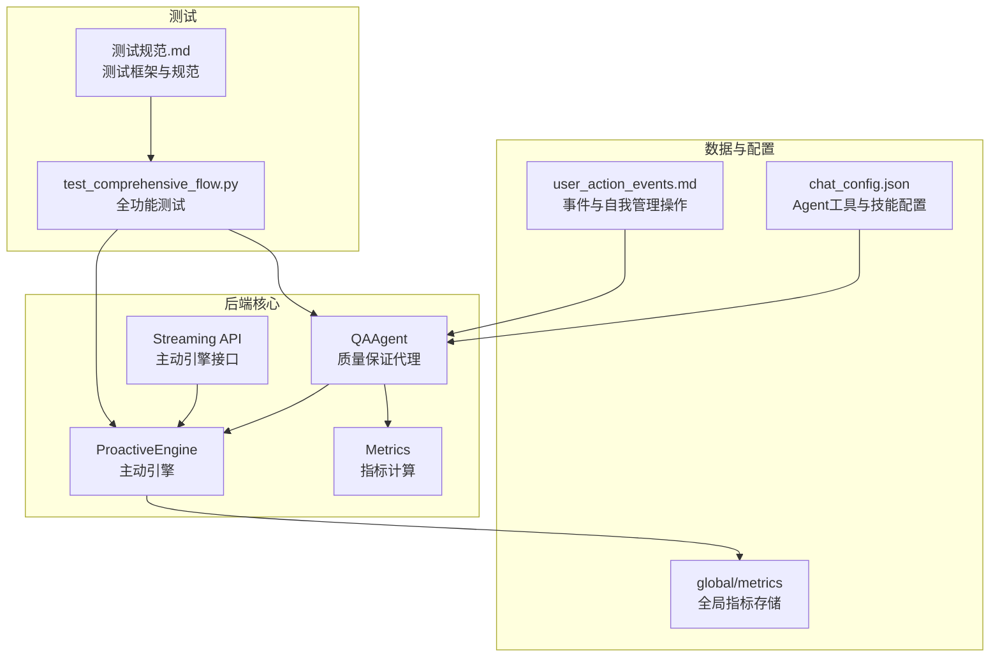
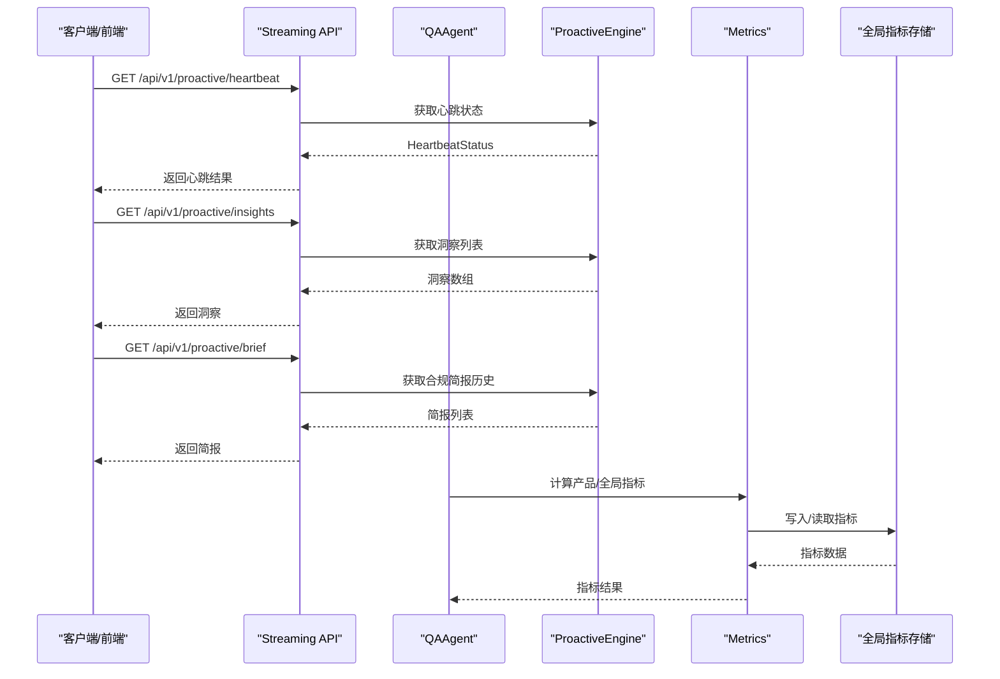
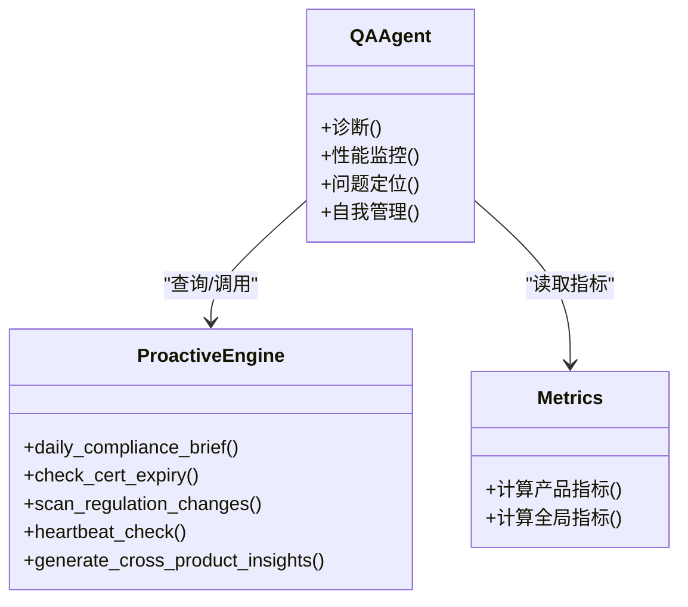
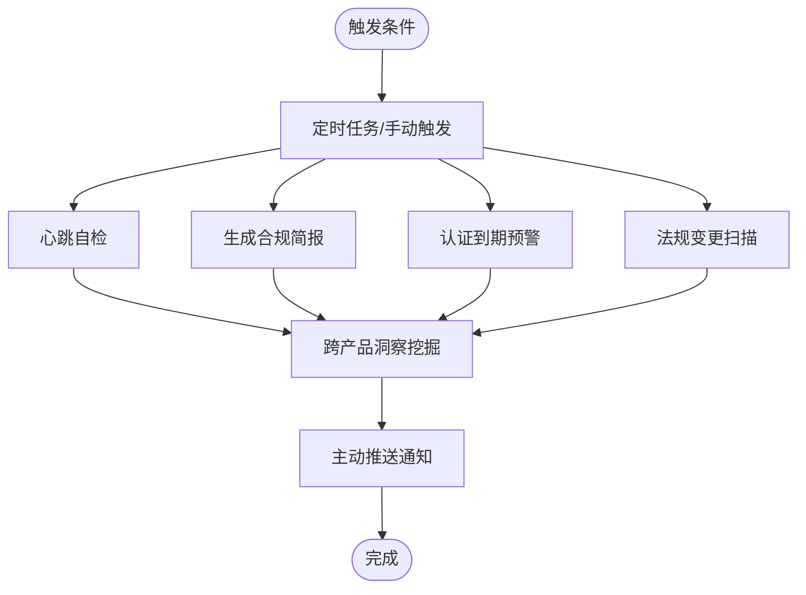
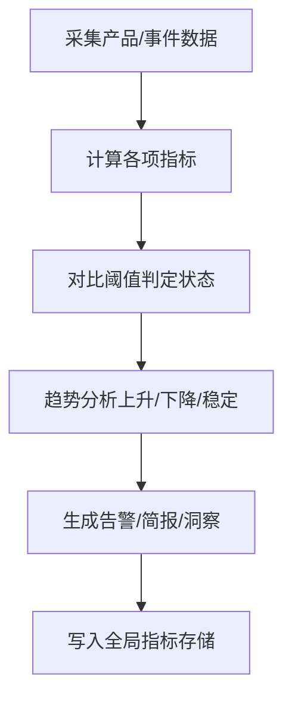
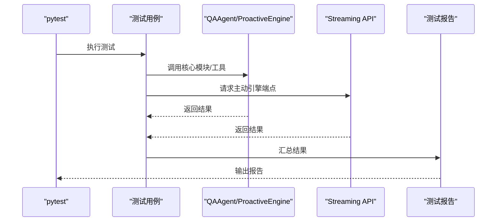
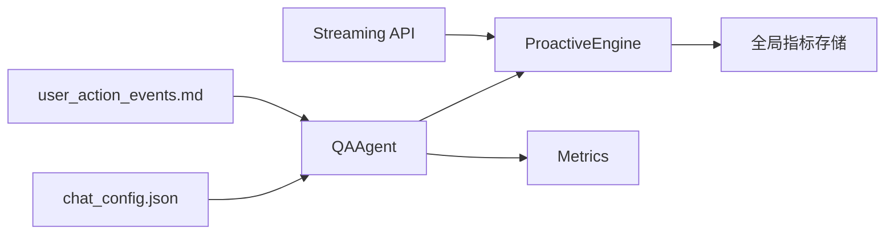

# QA质量保证系统

<cite>
**本文引用的文件**   
- [backend/app/core/qa_agent.py](file://backend/app/core/qa_agent.py)
- [backend/app/core/proactive_engine.py](file://backend/app/core/proactive_engine.py)
- [backend/app/api/streaming.py](file://backend/app/api/streaming.py)
- [backend/app/core/metrics.py](file://backend/app/core/metrics.py)
- [backend/data/chat_config.json](file://backend/data/chat_config.json)
- [backend/data/config/events/user_action_events.md](file://backend/data/config/events/user_action_events.md)
- [backend/tests/test_comprehensive_flow.py](file://backend/tests/test_comprehensive_flow.py)
- [backend/tests/测试规范.md](file://backend/tests/测试规范.md)
</cite>

## 目录
1. [简介](#简介)
2. [项目结构](#项目结构)
3. [核心组件](#核心组件)
4. [架构总览](#架构总览)
5. [详细组件分析](#详细组件分析)
6. [依赖关系分析](#依赖关系分析)
7. [性能考虑](#性能考虑)
8. [故障排查指南](#故障排查指南)
9. [结论](#结论)
10. [附录](#附录)

## 简介
本文件面向避风港平台的QA质量保证系统，系统以“QAAgent”为核心，结合“主动引擎（ProactiveEngine）”实现预防性监控、趋势分析与风险预警；通过指标体系对响应时间、成功率、错误率与用户体验进行量化评估；配合自动化测试与验证流程保障回归、性能与兼容性质量；并提供问题追踪与修复机制，涵盖错误分类、根因分析与修复建议。同时给出配置与使用指南，包括监控规则设置、告警配置与报告生成。

## 项目结构
- 后端核心模块位于 backend/app/core，包含QA Agent、主动引擎、指标计算等。
- API路由位于 backend/app/api，提供主动引擎相关接口。
- 数据与配置位于 backend/data，包含聊天配置、事件配置等。
- 测试位于 backend/tests，包含测试规范与全功能测试用例。

**图表来源**
- [backend/app/core/qa_agent.py](file://backend/app/core/qa_agent.py)
- [backend/app/core/proactive_engine.py](file://backend/app/core/proactive_engine.py)
- [backend/app/core/metrics.py](file://backend/app/core/metrics.py)
- [backend/app/api/streaming.py](file://backend/app/api/streaming.py)
- [backend/data/chat_config.json](file://backend/data/chat_config.json)
- [backend/data/config/events/user_action_events.md](file://backend/data/config/events/user_action_events.md)
- [backend/tests/test_comprehensive_flow.py](file://backend/tests/test_comprehensive_flow.py)
- [backend/tests/测试规范.md](file://backend/tests/测试规范.md)

**章节来源**
- [backend/app/core/qa_agent.py](file://backend/app/core/qa_agent.py)
- [backend/app/core/proactive_engine.py](file://backend/app/core/proactive_engine.py)
- [backend/app/core/metrics.py](file://backend/app/core/metrics.py)
- [backend/app/api/streaming.py](file://backend/app/api/streaming.py)
- [backend/data/chat_config.json](file://backend/data/chat_config.json)
- [backend/data/config/events/user_action_events.md](file://backend/data/config/events/user_action_events.md)
- [backend/tests/test_comprehensive_flow.py](file://backend/tests/test_comprehensive_flow.py)
- [backend/tests/测试规范.md](file://backend/tests/测试规范.md)

## 核心组件
- QAAgent：面向质量保证的智能代理，负责系统诊断、性能监控与问题定位，并可代表用户执行事件类型管理、Worker参数配置、通知渠道与阈值管理、系统健康检查与合规简报生成等操作。
- ProactiveEngine：定时任务、心跳自检、洞察挖掘与主动推送，支撑预防性监控与风险预警。
- 指标体系：健康度、认证到期密度、风险产品占比、三单一致率、平均检查响应时间、拒付率、退货率、DSAR响应时效等，支持实时/每日/小时刷新策略。
- 自动化测试：单元测试、集成测试、全业务流测试与Live系统测试，覆盖回归、性能与兼容性验证。
- 问题追踪与修复：通过测试用例与报告生成，实现错误分类、根因分析与修复建议闭环。

**章节来源**
- [backend/data/config/events/user_action_events.md](file://backend/data/config/events/user_action_events.md)
- [backend/app/core/qa_agent.py](file://backend/app/core/qa_agent.py)
- [backend/app/core/proactive_engine.py](file://backend/app/core/proactive_engine.py)
- [backend/app/core/metrics.py](file://backend/app/core/metrics.py)
- [backend/tests/test_comprehensive_flow.py](file://backend/tests/test_comprehensive_flow.py)

## 架构总览
下图展示QA系统的关键交互：QAAgent作为入口协调ProactiveEngine与指标计算；API提供心跳、洞察与合规简报等查询；测试用例驱动质量验证与报告生成。

**图表来源**
- [backend/app/api/streaming.py](file://backend/app/api/streaming.py)
- [backend/app/core/proactive_engine.py](file://backend/app/core/proactive_engine.py)
- [backend/app/core/metrics.py](file://backend/app/core/metrics.py)

## 详细组件分析

### QAAgent：质量保证代理
- 功能定位与职责范围
  - 系统诊断：通过工具与技能组合进行合规检查、认证监控、法规扫描与跟踪查询。
  - 性能监控：结合指标计算与API查询，评估响应时间、成功率与错误率等关键指标。
  - 问题定位：利用事件与产品数据，定位风险产品与异常趋势，输出修复建议。
  - 自我管理：支持事件类型定义/修改/删除、Worker参数与优先级配置、通知渠道与阈值管理、系统健康检查与合规简报生成。
- 工具与技能配置
  - Agent工具集与技能集由配置文件定义，支持合规检查、认证监控、HS编码查询、VAT查询、法规扫描与跟踪查询等能力。
- 与主动引擎协作
  - 通过API查询心跳、洞察与合规简报，形成“诊断—预警—简报”的闭环。

**图表来源**
- [backend/app/core/qa_agent.py](file://backend/app/core/qa_agent.py)
- [backend/app/core/proactive_engine.py](file://backend/app/core/proactive_engine.py)
- [backend/app/core/metrics.py](file://backend/app/core/metrics.py)

**章节来源**
- [backend/data/config/events/user_action_events.md](file://backend/data/config/events/user_action_events.md)
- [backend/data/chat_config.json](file://backend/data/chat_config.json)
- [backend/app/core/qa_agent.py](file://backend/app/core/qa_agent.py)

### ProactiveEngine：预防性监控与风险预警
- 职责
  - 定时任务：每日合规简报、认证到期预警、法规变更扫描。
  - 心跳自检：周期性检查系统组件健康状态，输出整体与组件级状态。
  - 洞察挖掘：从产品数据与事件中挖掘跨产品洞察，生成主动通知。
  - 主动推送：根据洞察结果生成主动通知，辅助决策与风险控制。
- 关键接口
  - GET /api/v1/proactive/heartbeat：获取心跳状态或触发自检。
  - GET /api/v1/proactive/insights：获取跨产品洞察列表。
  - GET /api/v1/proactive/brief：获取合规简报历史。
  - GET /api/v1/proactive/stats：获取引擎统计信息。
- 指标与阈值
  - 包含健康度、认证到期密度、风险产品占比、三单一致率、平均检查响应时间、拒付率、退货率、DSAR响应时效等指标及其阈值与刷新频率。

**图表来源**
- [backend/app/core/proactive_engine.py](file://backend/app/core/proactive_engine.py)
- [backend/app/api/streaming.py](file://backend/app/api/streaming.py)

**章节来源**
- [backend/app/core/proactive_engine.py](file://backend/app/core/proactive_engine.py)
- [backend/app/api/streaming.py](file://backend/app/api/streaming.py)

### 指标体系：质量评估与趋势分析
- 指标清单与阈值
  - 合规健康度：通过产品数/总产品数计算，阈值区分正常/警告/严重。
  - 认证到期密度：统计30天内到期的认证数量，阈值区分正常/警告/严重。
  - 风险产品占比：高风险产品/总在售产品，阈值区分正常/警告/严重。
  - 三单一致率：三单匹配订单/总订单，阈值区分正常/警告/严重。
  - 平均检查响应时间：合规检查平均耗时（ms），阈值区分正常/警告/严重。
  - 拒付率：拒付订单/总订单，阈值区分正常/警告/严重。
  - 退货率：阈值区分正常/警告/严重。
  - DSAR响应时效：阈值区分正常/警告/严重。
- 刷新策略
  - 实时（realtime）、每日（daily）、每小时（hourly）等不同刷新频率，满足不同指标的时效性需求。
- 趋势分析
  - 指标状态与趋势联动，支持上升/下降/稳定趋势判断，辅助风险预警与容量规划。

**图表来源**
- [backend/app/core/metrics.py](file://backend/app/core/metrics.py)

**章节来源**
- [backend/app/core/metrics.py](file://backend/app/core/metrics.py)

### 自动化测试与验证流程
- 测试框架
  - 基于pytest 8.x，支持异步测试与覆盖率统计；包含单元测试、集成测试、全业务流测试与Live系统测试。
- 测试分层
  - 单元测试：规则引擎等纯函数逻辑验证。
  - 集成测试：操作链/NLStore等多模块协同验证。
  - 全业务流测试：覆盖16 Phase的端到端流程。
  - Live系统测试：依赖真实后端服务，验证端点与工作流。
- 关键测试用例
  - 认证到期预警：验证扫描与预警数量、状态。
  - 系统心跳自检：验证组件健康状态与整体状态。
  - 跨产品洞察：验证洞察数量与风险建议。
  - 产品级指标：验证健康度与预警指标。
  - 自定义指标：验证创建与阈值配置。
- 报告生成
  - 统计各Phase通过情况，输出全功能测试报告。

**图表来源**
- [backend/tests/test_comprehensive_flow.py](file://backend/tests/test_comprehensive_flow.py)
- [backend/tests/测试规范.md](file://backend/tests/测试规范.md)
- [backend/app/api/streaming.py](file://backend/app/api/streaming.py)

**章节来源**
- [backend/tests/test_comprehensive_flow.py](file://backend/tests/test_comprehensive_flow.py)
- [backend/tests/测试规范.md](file://backend/tests/测试规范.md)

### 问题追踪与修复机制
- 错误分类
  - 基于指标状态（正常/警告/严重）与趋势进行初步分类。
- 根因分析
  - 结合产品数据、事件与跨产品洞察，定位风险产品与异常趋势。
- 修复建议
  - 主动引擎生成的建议（如批量续期、合规检查）指导修复。
- 可视化与报告
  - 通过测试报告与API返回结果，形成可追溯的质量闭环。

**章节来源**
- [backend/app/core/proactive_engine.py](file://backend/app/core/proactive_engine.py)
- [backend/tests/test_comprehensive_flow.py](file://backend/tests/test_comprehensive_flow.py)

## 依赖关系分析
- 组件耦合
  - QAAgent依赖ProactiveEngine与Metrics模块，通过API与指标存储进行交互。
  - ProactiveEngine依赖全局指标存储，定期产出洞察与简报。
  - Streaming API为外部提供统一查询入口，解耦前端与后端实现。
- 外部依赖
  - 配置文件（chat_config.json、user_action_events.md）定义工具与事件行为。
  - 测试规范与用例驱动系统质量验证。

**图表来源**
- [backend/app/core/qa_agent.py](file://backend/app/core/qa_agent.py)
- [backend/app/core/proactive_engine.py](file://backend/app/core/proactive_engine.py)
- [backend/app/core/metrics.py](file://backend/app/core/metrics.py)
- [backend/app/api/streaming.py](file://backend/app/api/streaming.py)
- [backend/data/chat_config.json](file://backend/data/chat_config.json)
- [backend/data/config/events/user_action_events.md](file://backend/data/config/events/user_action_events.md)

**章节来源**
- [backend/app/core/qa_agent.py](file://backend/app/core/qa_agent.py)
- [backend/app/core/proactive_engine.py](file://backend/app/core/proactive_engine.py)
- [backend/app/core/metrics.py](file://backend/app/core/metrics.py)
- [backend/app/api/streaming.py](file://backend/app/api/streaming.py)
- [backend/data/chat_config.json](file://backend/data/chat_config.json)
- [backend/data/config/events/user_action_events.md](file://backend/data/config/events/user_action_events.md)

## 性能考虑
- 指标计算
  - 对于大规模产品与事件数据，建议采用分页与增量计算策略，避免一次性全量扫描。
- 心跳自检
  - 控制检查频率与超时阈值，避免对生产环境造成额外压力。
- 主动引擎
  - 将洞察与简报生成任务异步化，结合队列或定时器降低峰值负载。
- API查询
  - 对高频查询增加缓存与限流策略，确保响应时间稳定。

## 故障排查指南
- 心跳状态异常
  - 通过GET /api/v1/proactive/heartbeat检查整体与组件状态，定位具体异常组件。
- 洞察为空
  - 检查数据源完整性与指标阈值配置，确认跨产品聚合逻辑是否正常。
- 指标异常
  - 核对指标阈值与刷新频率，检查全局指标存储是否写入成功。
- 测试失败
  - 参考测试规范与测试报告，定位失败用例并复现问题；必要时启用Live模式进行端到端验证。

**章节来源**
- [backend/app/api/streaming.py](file://backend/app/api/streaming.py)
- [backend/tests/测试规范.md](file://backend/tests/测试规范.md)
- [backend/tests/test_comprehensive_flow.py](file://backend/tests/test_comprehensive_flow.py)

## 结论
避风港平台的QA质量保证系统以QAAgent为核心，结合ProactiveEngine实现预防性监控与风险预警，通过完善的指标体系与自动化测试保障质量。系统具备清晰的职责边界、可扩展的配置与可观测的API，能够有效支撑合规与质量的持续改进。

## 附录

### 配置与使用指南
- 监控规则设置
  - 在指标模块中配置阈值与刷新频率，确保规则与业务目标一致。
- 告警配置
  - 基于指标状态与趋势，设置通知渠道与阈值，实现分级告警。
- 报告生成
  - 通过测试报告与主动引擎简报，形成质量评估与改进建议的闭环。

**章节来源**
- [backend/app/core/metrics.py](file://backend/app/core/metrics.py)
- [backend/app/core/proactive_engine.py](file://backend/app/core/proactive_engine.py)
- [backend/tests/test_comprehensive_flow.py](file://backend/tests/test_comprehensive_flow.py)