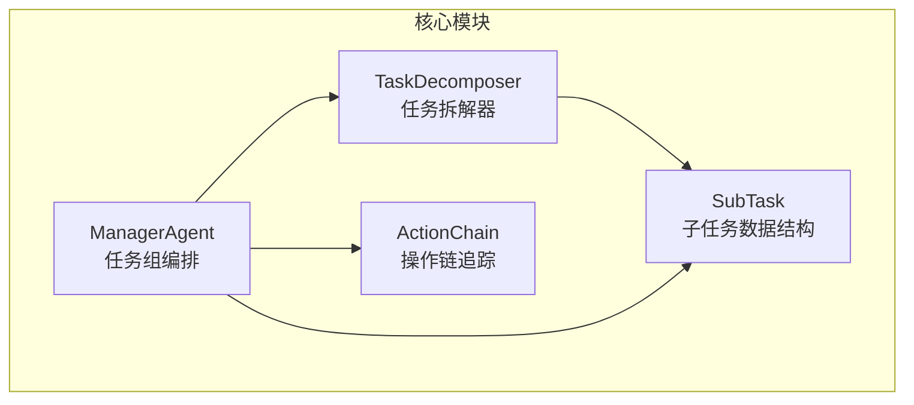
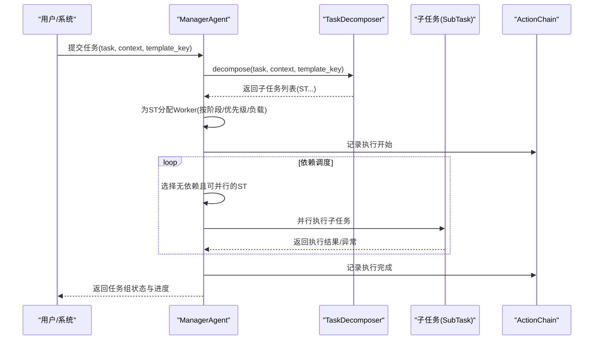
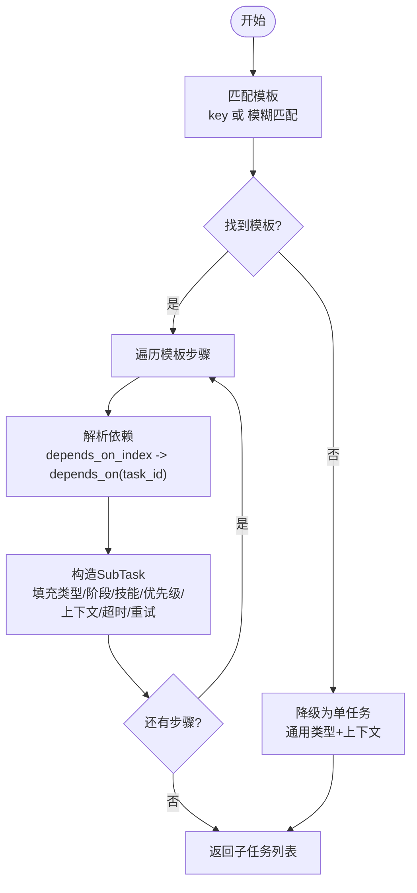
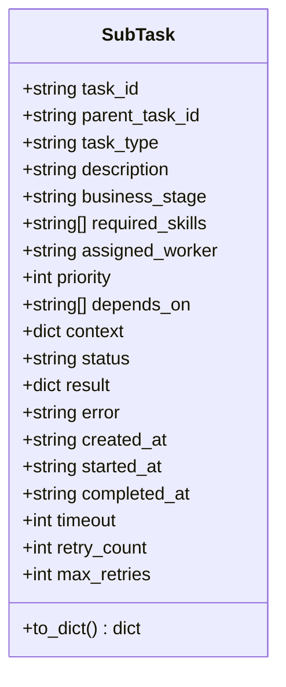
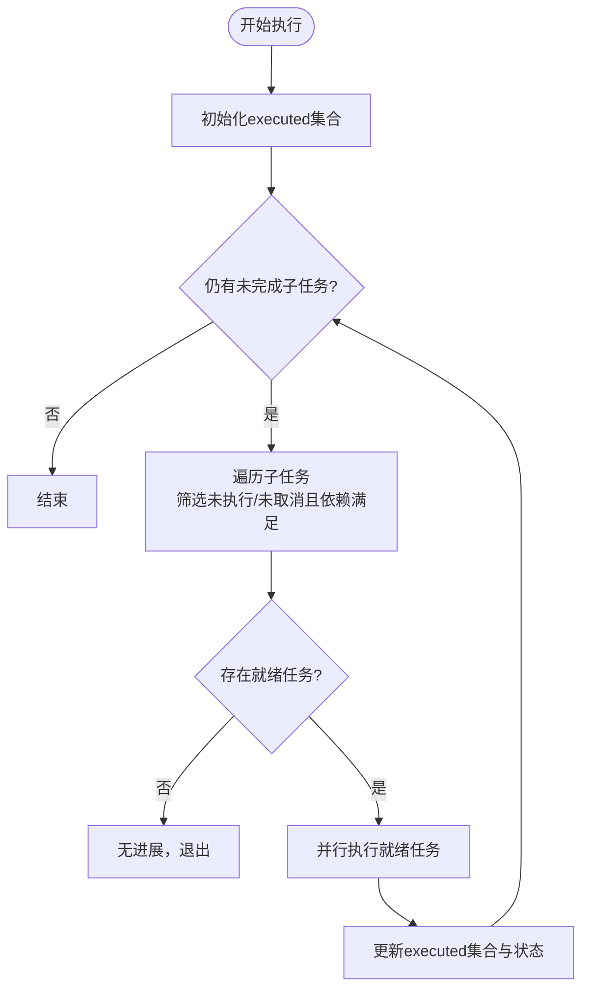
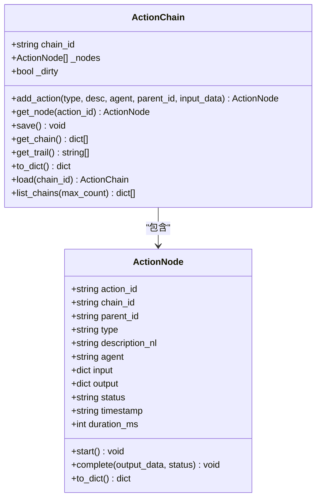
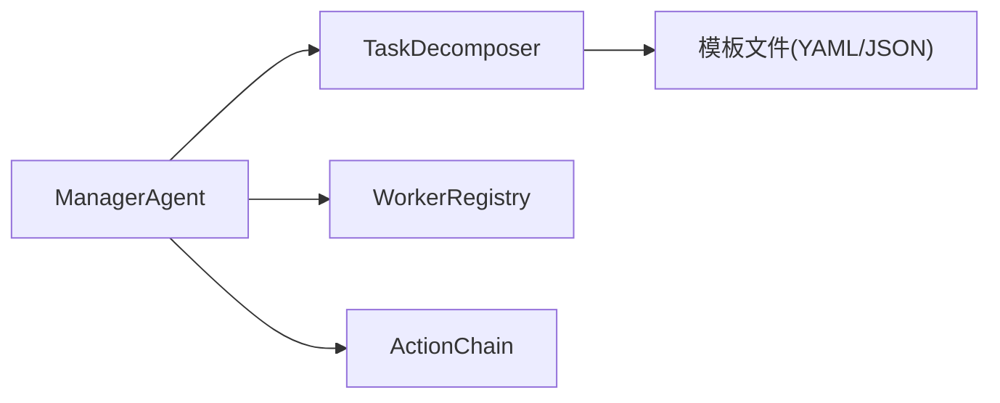

# 任务分解机制

<cite>
**本文引用的文件**
- [task_decomposer.py](file://backend/app/core/task_decomposer.py)
- [action_chain.py](file://backend/app/core/action_chain.py)
- [manager_agent.py](file://backend/app/core/manager_agent.py)
- [README.md](file://README.md)
</cite>

## 目录
1. [引言](#引言)
2. [项目结构](#项目结构)
3. [核心组件](#核心组件)
4. [架构总览](#架构总览)
5. [详细组件分析](#详细组件分析)
6. [依赖分析](#依赖分析)
7. [性能考虑](#性能考虑)
8. [故障排查指南](#故障排查指南)
9. [结论](#结论)
10. [附录](#附录)

## 引言
本文件围绕避风港平台的任务分解机制进行系统化说明，重点覆盖以下方面：
- TaskDecomposer 的工作原理：任务解析、子任务生成、依赖关系分析
- SubTask 数据结构与属性：任务类型、业务阶段、优先级、上下文与状态
- 任务模板系统：模板定义、参数绑定、动态生成与持久化
- 依赖关系图构建与解析：拓扑排序思想、执行顺序确定
- Action Chain 编排机制：动作序列、条件判断与异常处理
- 任务分解配置指南：模板编写、规则定义与性能优化建议

该机制以“模板驱动 + 依赖约束 + 并行执行”为核心，既保证确定性，又具备良好的扩展性。

## 项目结构
与任务分解直接相关的代码主要位于后端核心模块：
- backend/app/core/task_decomposer.py：任务拆解器与子任务模型
- backend/app/core/action_chain.py：操作链追踪与可视化
- backend/app/core/manager_agent.py：任务组编排、依赖调度与执行监控

图表来源
- [task_decomposer.py:311-522](file://backend/app/core/task_decomposer.py#L311-L522)
- [action_chain.py:77-236](file://backend/app/core/action_chain.py#L77-L236)
- [manager_agent.py:117-499](file://backend/app/core/manager_agent.py#L117-L499)

章节来源
- [task_decomposer.py:1-523](file://backend/app/core/task_decomposer.py#L1-L523)
- [action_chain.py:1-236](file://backend/app/core/action_chain.py#L1-L236)
- [manager_agent.py:1-200](file://backend/app/core/manager_agent.py#L1-L200)

## 核心组件
- 任务拆解器（TaskDecomposer）：负责根据模板生成子任务序列，解析依赖关系，支持内置模板与自定义模板。
- 子任务（SubTask）：承载任务标识、类型、业务阶段、技能需求、优先级、依赖、上下文、状态与重试控制。
- 操作链（ActionChain）：记录每次操作的自然语言描述、父子关系、输入输出与耗时，支持链路回溯与可视化。
- 任务组编排（ManagerAgent）：接收高层任务，委派拆解与分配，按依赖顺序并行执行，处理失败重试与结果汇总。

章节来源
- [task_decomposer.py:28-79](file://backend/app/core/task_decomposer.py#L28-L79)
- [task_decomposer.py:311-522](file://backend/app/core/task_decomposer.py#L311-L522)
- [action_chain.py:23-75](file://backend/app/core/action_chain.py#L23-L75)
- [action_chain.py:77-236](file://backend/app/core/action_chain.py#L77-L236)
- [manager_agent.py:63-115](file://backend/app/core/manager_agent.py#L63-L115)
- [manager_agent.py:117-499](file://backend/app/core/manager_agent.py#L117-L499)

## 架构总览
任务从高层描述进入，经由拆解器生成子任务序列；编排器根据业务阶段与优先级分配 Worker，并基于依赖关系进行拓扑式调度；执行过程中通过 ActionChain 追踪每一步操作，最终汇总结果并广播状态。

图表来源
- [manager_agent.py:166-371](file://backend/app/core/manager_agent.py#L166-L371)
- [task_decomposer.py:362-429](file://backend/app/core/task_decomposer.py#L362-L429)
- [action_chain.py:133-184](file://backend/app/core/action_chain.py#L133-L184)

## 详细组件分析

### 任务拆解器（TaskDecomposer）
- 职责
  - 将高层任务描述拆解为可执行的子任务列表
  - 基于模板键或模糊匹配选择模板
  - 支持内置模板与自定义模板（YAML/JSON）
  - 为子任务标注优先级、依赖关系、所需技能与超时/重试参数
- 关键流程
  - 模板匹配：精确匹配 → 模糊匹配 → 无法匹配时降级为单个通用子任务
  - 依赖解析：通过 depends_on_index 将相对索引映射为具体 task_id
  - 上下文注入：将传入 context 合并到每个子任务
  - 事件驱动：根据事件类型自动映射到对应模板
- 模板系统
  - 内置模板：覆盖合规检查流水线、新品上架、认证到期、订单履约、法规变更、GDPR DSAR 等场景
  - 自定义模板：支持注册与持久化（YAML 优先，不可用时回退 JSON）

图表来源
- [task_decomposer.py:362-429](file://backend/app/core/task_decomposer.py#L362-L429)
- [task_decomposer.py:431-467](file://backend/app/core/task_decomposer.py#L431-L467)

章节来源
- [task_decomposer.py:16-25](file://backend/app/core/task_decomposer.py#L16-L25)
- [task_decomposer.py:28-79](file://backend/app/core/task_decomposer.py#L28-L79)
- [task_decomposer.py:84-308](file://backend/app/core/task_decomposer.py#L84-L308)
- [task_decomposer.py:346-361](file://backend/app/core/task_decomposer.py#L346-L361)
- [task_decomposer.py:362-429](file://backend/app/core/task_decomposer.py#L362-L429)
- [task_decomposer.py:431-467](file://backend/app/core/task_decomposer.py#L431-L467)
- [task_decomposer.py:488-510](file://backend/app/core/task_decomposer.py#L488-L510)

### 子任务（SubTask）数据结构与属性
- 字段概览
  - 任务标识：task_id、parent_task_id
  - 任务描述：task_type、description
  - 业务阶段：business_stage
  - 技能需求：required_skills
  - 分配与状态：assigned_worker、status（pending/running/done/failed/cancelled）
  - 依赖与优先级：depends_on、priority
  - 上下文与时间戳：context、created_at/started_at/completed_at
  - 超时与重试：timeout、retry_count、max_retries
  - 结果与错误：result、error
- 设计要点
  - 自动生成 task_id 与创建时间
  - 便于序列化与持久化（to_dict）
  - 与模板中的 depends_on_index 一一对应

图表来源
- [task_decomposer.py:28-79](file://backend/app/core/task_decomposer.py#L28-L79)

章节来源
- [task_decomposer.py:28-79](file://backend/app/core/task_decomposer.py#L28-L79)

### 任务模板系统
- 模板定义
  - 内置模板：以字典形式集中定义，包含步骤数组，每步含 task_type、description、business_stage、required_skills、priority、depends_on_index 等
  - 自定义模板：通过 register_template 动态注册，并持久化到 data/config/workflows 下（YAML/JSON）
- 参数绑定与动态生成
  - 通过 context 注入产品、市场、业务阶段等上下文
  - 事件驱动模板：根据事件类型映射到特定模板键
- 模板加载
  - 启动时扫描自定义目录，合并内置模板

章节来源
- [task_decomposer.py:84-308](file://backend/app/core/task_decomposer.py#L84-L308)
- [task_decomposer.py:346-361](file://backend/app/core/task_decomposer.py#L346-L361)
- [task_decomposer.py:431-467](file://backend/app/core/task_decomposer.py#L431-L467)
- [task_decomposer.py:488-510](file://backend/app/core/task_decomposer.py#L488-L510)

### 依赖关系图构建与解析
- 构建
  - 模板中通过 depends_on_index 定义步骤间的相对依赖
  - 拆解时将相对索引转换为具体 task_id，形成子任务依赖边集
- 解析与执行顺序
  - 采用拓扑式调度：每次选取无依赖且未执行的子任务集合
  - 支持并行执行多个就绪子任务
  - 失败时按 max_retries 重试，不影响其他独立子任务
- 关键逻辑
  - 依赖满足检测：所有前置依赖必须已执行
  - 循环保护：设置最大迭代次数防止死循环
  - 结果汇总：根据子任务状态计算任务组整体状态

图表来源
- [manager_agent.py:292-371](file://backend/app/core/manager_agent.py#L292-L371)
- [task_decomposer.py:408-429](file://backend/app/core/task_decomposer.py#L408-L429)

章节来源
- [manager_agent.py:292-371](file://backend/app/core/manager_agent.py#L292-L371)
- [task_decomposer.py:408-429](file://backend/app/core/task_decomposer.py#L408-L429)

### Action Chain 编排机制
- 目标
  - 追踪系统每一步操作的完整链路，形成可追溯的决策链条
- 结构
  - ActionNode：单个操作节点，包含类型、描述、代理、输入输出、状态、时间戳与耗时
  - ActionChain：操作链容器，支持添加节点、保存/加载、查询链路与回溯展示
- 使用
  - 在任务执行前后记录关键操作，便于审计与问题定位
  - 提供自然语言描述链（trail），直观展示执行过程

图表来源
- [action_chain.py:23-75](file://backend/app/core/action_chain.py#L23-L75)
- [action_chain.py:77-236](file://backend/app/core/action_chain.py#L77-L236)

章节来源
- [action_chain.py:1-236](file://backend/app/core/action_chain.py#L1-L236)

### 任务组编排（ManagerAgent）
- 职责
  - 接收高层任务，委派 TaskDecomposer 拆解
  - 基于 Worker 注册表按业务阶段/优先级/负载分配 Worker
  - 按依赖顺序并行执行子任务，处理异常与重试
  - 记录消息与进度，广播执行状态
- 关键流程
  - 提交任务：拆解 → 分配 Worker → 创建任务组
  - 执行任务组：拓扑调度 → 并行执行 → 结果汇总
  - 异常处理：失败重试、消息记录、状态更新

章节来源
- [manager_agent.py:117-499](file://backend/app/core/manager_agent.py#L117-L499)

## 依赖分析
- 组件耦合
  - ManagerAgent 依赖 TaskDecomposer 与 WorkerRegistry，负责编排与调度
  - TaskDecomposer 依赖配置路径与模板目录，负责模板加载与子任务生成
  - ActionChain 作为独立追踪模块，被编排器用于记录执行轨迹
- 外部依赖
  - YAML/JSON 序列化（自定义模板持久化）
  - 异步并发（asyncio.gather 并行执行）

图表来源
- [manager_agent.py:27-29](file://backend/app/core/manager_agent.py#L27-L29)
- [task_decomposer.py:339-344](file://backend/app/core/task_decomposer.py#L339-L344)
- [action_chain.py:17-21](file://backend/app/core/action_chain.py#L17-L21)

章节来源
- [manager_agent.py:18-32](file://backend/app/core/manager_agent.py#L18-L32)
- [task_decomposer.py:16-25](file://backend/app/core/task_decomposer.py#L16-L25)
- [action_chain.py:10-21](file://backend/app/core/action_chain.py#L10-L21)

## 性能考虑
- 并行度控制
  - 仅在依赖满足时并行执行，避免资源争用与死锁
  - 通过 max_iterations 限制调度轮次，防止复杂依赖导致的无限循环
- 资源分配
  - 按业务阶段与优先级选择 Worker，并选择低负载实例，提升吞吐
- 模板与上下文
  - 合理设计 depends_on_index，减少不必要的串行
  - 控制 context 大小，避免传递冗余信息
- 异常与重试
  - 适度设置 max_retries 与 timeout，平衡可靠性与延迟
- I/O 与持久化
  - 自定义模板写盘采用异步之外的同步写入，建议在模板变更频率较低时使用；若频繁变更，可考虑批量写入或后台任务

## 故障排查指南
- 无法匹配模板
  - 确认模板键是否存在或是否可通过模糊匹配命中
  - 若无模板，系统将降级为单任务通用类型，检查上下文是否正确传入
- 依赖未满足
  - 检查 depends_on_index 是否指向有效步骤索引
  - 确认前置子任务是否成功执行
- 执行失败与重试
  - 查看子任务 error 字段与 ActionChain trail 中的耗时与状态
  - 根据 max_retries 判断是否已达到最大重试次数
- Worker 分配问题
  - 检查 Worker 注册表中是否存在目标业务阶段的 Worker
  - 确认 Worker 的优先级与当前负载情况

章节来源
- [task_decomposer.py:382-402](file://backend/app/core/task_decomposer.py#L382-L402)
- [manager_agent.py:321-352](file://backend/app/core/manager_agent.py#L321-L352)
- [action_chain.py:143-184](file://backend/app/core/action_chain.py#L143-L184)

## 结论
避风港平台的任务分解机制以模板驱动为核心，结合明确的依赖约束与并行调度策略，在保证确定性的同时提升了执行效率与可观测性。通过 SubTask 的丰富属性与 ActionChain 的全程追踪，系统实现了从高层任务到可执行子任务的清晰映射与可追溯执行。

## 附录

### 任务分解配置指南
- 模板编写
  - 在模板中定义步骤数组，每步包含 task_type、description、business_stage、required_skills、priority、depends_on_index 等字段
  - 事件驱动场景：确保事件类型映射到正确的模板键
- 规则定义
  - 依赖关系：使用 depends_on_index 表达步骤间的先后关系
  - 优先级：通过 priority 控制调度顺序
  - 技能需求：required_skills 用于 Worker 匹配
- 性能优化建议
  - 合理划分步骤，避免过度串行
  - 控制 context 体积，减少序列化与传输开销
  - 设置合理的 timeout 与 max_retries，兼顾稳定性与响应速度
  - 对频繁变更的模板采用批量写入或后台任务，降低主线程阻塞

章节来源
- [task_decomposer.py:84-308](file://backend/app/core/task_decomposer.py#L84-L308)
- [task_decomposer.py:431-467](file://backend/app/core/task_decomposer.py#L431-L467)
- [manager_agent.py:255-288](file://backend/app/core/manager_agent.py#L255-L288)