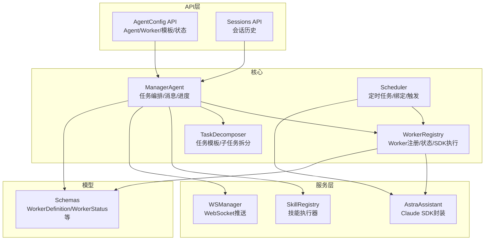
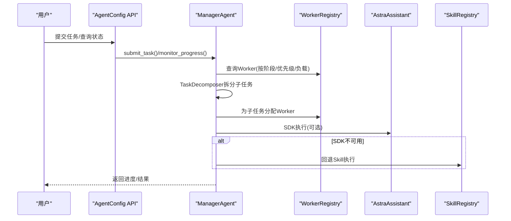
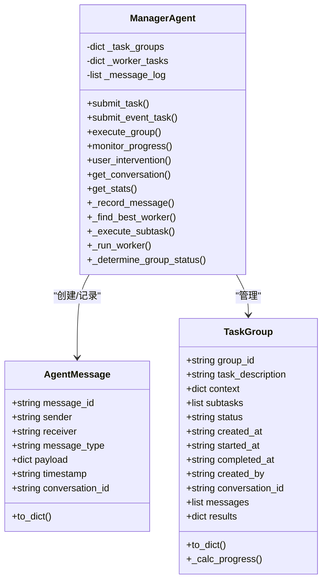
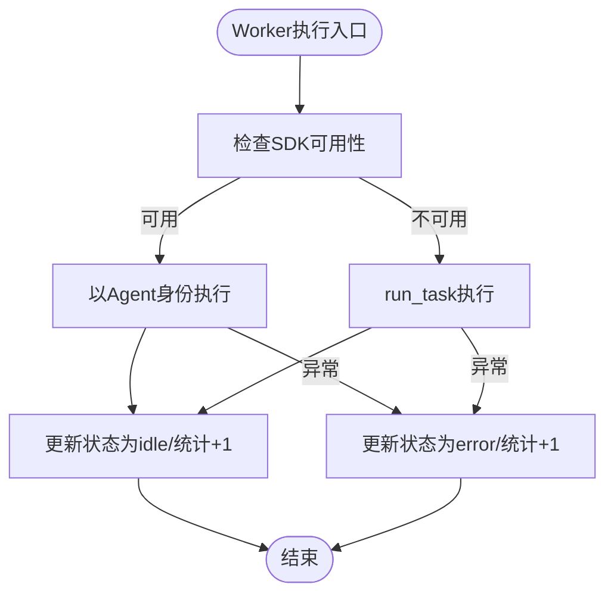
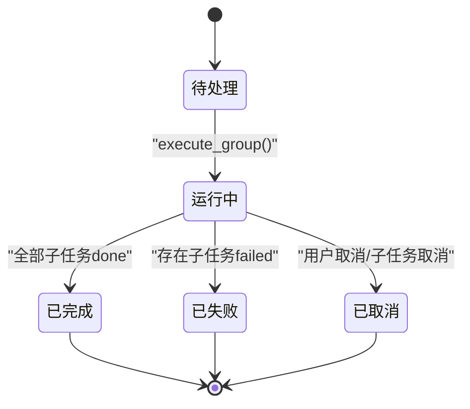
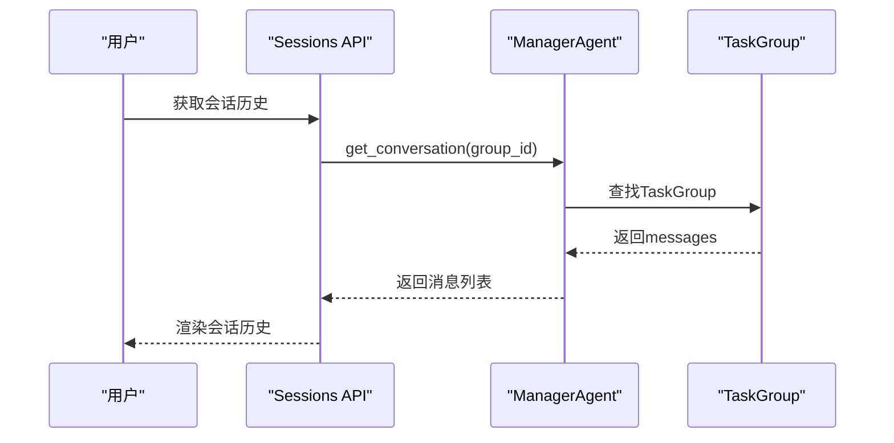
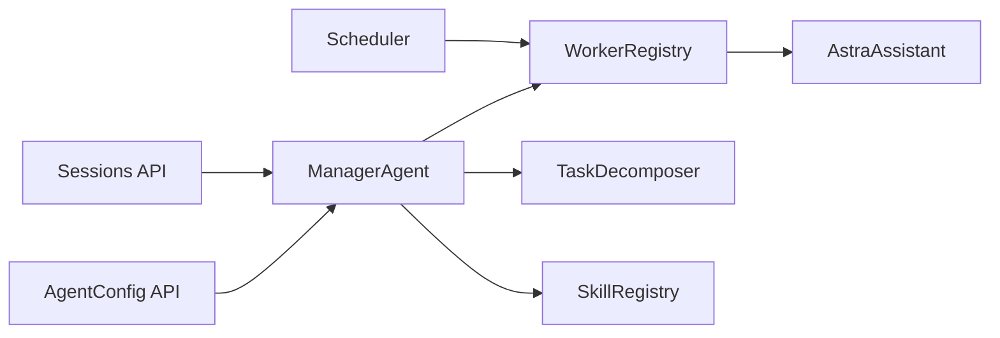

# 多Agent架构设计

<cite>
**本文引用的文件**
- [manager_agent.py](file://backend/app/core/manager_agent.py)
- [worker_registry.py](file://backend/app/core/worker_registry.py)
- [agent_config.py](file://backend/app/api/agent_config.py)
- [sessions.py](file://backend/app/api/sessions.py)
- [scheduler.py](file://backend/app/core/scheduler.py)
- [task_decomposer.py](file://backend/app/core/task_decomposer.py)
- [schemas.py](file://backend/app/models/schemas.py)
- [ws_manager.py](file://backend/app/services/ws_manager.py)
- [astra_assistant.py](file://backend/app/services/astra_assistant.py)
- [skill_registry.py](file://backend/app/core/skill_registry.py)
</cite>

## 目录
1. [引言](#引言)
2. [项目结构](#项目结构)
3. [核心组件](#核心组件)
4. [架构总览](#架构总览)
5. [详细组件分析](#详细组件分析)
6. [依赖关系分析](#依赖关系分析)
7. [性能考虑](#性能考虑)
8. [故障排查指南](#故障排查指南)
9. [结论](#结论)
10. [附录](#附录)

## 引言
本文件面向避风港平台的多Agent架构，系统化阐述Manager Agent与Worker Agent的职责分工、协作机制与通信协议；详解Agent消息格式（AgentMessage）、任务组（TaskGroup）的生命周期与状态转换；说明Worker注册与发现机制及群聊式调度与用户干预能力；并给出Agent配置与管理的最佳实践与故障处理策略。

## 项目结构
多Agent相关代码主要分布在后端模块：
- 核心调度与编排：backend/app/core/manager_agent.py、backend/app/core/worker_registry.py、backend/app/core/scheduler.py、backend/app/core/task_decomposer.py
- API入口与会话：backend/app/api/agent_config.py、backend/app/api/sessions.py
- 模型与服务：backend/app/models/schemas.py、backend/app/services/ws_manager.py、backend/app/services/astra_assistant.py、backend/app/core/skill_registry.py

图表来源
- [manager_agent.py:117-729](file://backend/app/core/manager_agent.py#L117-L729)
- [worker_registry.py:29-434](file://backend/app/core/worker_registry.py#L29-L434)
- [scheduler.py:26-602](file://backend/app/core/scheduler.py#L26-L602)
- [agent_config.py:1-423](file://backend/app/api/agent_config.py#L1-L423)
- [sessions.py:1-79](file://backend/app/api/sessions.py#L1-L79)
- [schemas.py:1-200](file://backend/app/models/schemas.py#L1-L200)
- [astra_assistant.py:1-200](file://backend/app/services/astra_assistant.py#L1-L200)
- [skill_registry.py:1-200](file://backend/app/core/skill_registry.py#L1-L200)
- [ws_manager.py:1-200](file://backend/app/services/ws_manager.py#L1-L200)

章节来源
- [manager_agent.py:1-729](file://backend/app/core/manager_agent.py#L1-L729)
- [worker_registry.py:1-434](file://backend/app/core/worker_registry.py#L1-L434)
- [agent_config.py:1-423](file://backend/app/api/agent_config.py#L1-L423)
- [sessions.py:1-79](file://backend/app/api/sessions.py#L1-L79)
- [scheduler.py:1-602](file://backend/app/core/scheduler.py#L1-L602)

## 核心组件
- Manager Agent：负责接收高层任务、拆解为子任务、分配Worker、协调执行顺序、监控进度、处理失败重试、支持群聊式调度与用户干预。
- Worker Registry：从配置文件加载Worker定义，支持按业务阶段查询、运行时状态追踪、动态注册/更新/删除Worker，以及通过Claude Agent SDK执行定时任务。
- Task Decomposer：提供任务模板与子任务拆分能力，支持事件型任务分解。
- Scheduler：基于APScheduler的后台调度器，将定时任务绑定到Worker，统一通过Worker执行，支持产品级任务注册。
- Agent Config API：提供Agent/Worker/模板/状态的查询与管理接口，支持管理员操作与用户只读访问。
- Sessions API：会话历史管理，支持用户查看与删除会话。
- Astra Assistant：对Claude Agent SDK的封装，提供以Agent身份执行与流式对话能力。
- Skill Registry：技能执行器，作为Worker执行的回退路径之一。

章节来源
- [manager_agent.py:117-729](file://backend/app/core/manager_agent.py#L117-L729)
- [worker_registry.py:29-434](file://backend/app/core/worker_registry.py#L29-L434)
- [scheduler.py:26-602](file://backend/app/core/scheduler.py#L26-L602)
- [agent_config.py:1-423](file://backend/app/api/agent_config.py#L1-L423)
- [sessions.py:1-79](file://backend/app/api/sessions.py#L1-L79)
- [astra_assistant.py:1-200](file://backend/app/services/astra_assistant.py#L1-L200)
- [skill_registry.py:1-200](file://backend/app/core/skill_registry.py#L1-L200)

## 架构总览
多Agent架构采用“Manager-Worker”两级协作：
- Manager负责任务编排与消息治理，Worker负责具体技能执行与SDK调用。
- 任务从模板/事件出发，经TaskDecomposer拆分为子任务，由Manager分配至Worker。
- Worker可通过Claude Agent SDK执行复杂任务，或回退到SkillRegistry执行。
- Scheduler将定时任务统一绑定到Worker，确保确定性执行与可观测性。
- 群聊式调度通过会话与消息历史实现，用户可随时干预任务状态。

图表来源
- [manager_agent.py:166-447](file://backend/app/core/manager_agent.py#L166-L447)
- [worker_registry.py:288-421](file://backend/app/core/worker_registry.py#L288-L421)
- [astra_assistant.py:1-200](file://backend/app/services/astra_assistant.py#L1-L200)
- [skill_registry.py:1-200](file://backend/app/core/skill_registry.py#L1-L200)
- [agent_config.py:72-106](file://backend/app/api/agent_config.py#L72-L106)

## 详细组件分析

### Manager Agent：任务编排与群聊式调度
- 职责与能力
  - 任务提交与拆解：接收高层任务，调用TaskDecomposer生成子任务。
  - Worker分配：按业务阶段、优先级与负载选择最佳Worker。
  - 执行编排：基于子任务依赖关系，支持并行执行与失败重试。
  - 群聊式调度：为每个任务组生成会话ID，记录消息历史，支持用户查看与干预。
  - 用户干预：支持取消任务组/子任务、暂停/恢复、重试失败子任务。
- 关键数据结构
  - AgentMessage：标准化消息格式，包含消息ID、发送方/接收方、消息类型、负载、时间戳、会话ID。
  - TaskGroup：顶层任务单元，包含子任务列表、状态、进度计算、消息历史与结果汇总。
- 执行流程
  - submit_task：拆解→分配→创建TaskGroup→广播创建消息。
  - execute_group：构建执行顺序→并行执行→汇总结果→广播完成消息。
  - _execute_subtask：注册Worker负载→发送任务分配消息→执行Worker→释放负载→记录结果/错误→必要时重试。
- 通信协议
  - 消息类型：task_created、execution_started、task_assign、task_result、error、execution_completed、user_intervention。
  - 会话管理：每个TaskGroup拥有独立conversation_id，贯穿消息历史。

图表来源
- [manager_agent.py:34-115](file://backend/app/core/manager_agent.py#L34-L115)
- [manager_agent.py:117-729](file://backend/app/core/manager_agent.py#L117-L729)

章节来源
- [manager_agent.py:34-115](file://backend/app/core/manager_agent.py#L34-L115)
- [manager_agent.py:117-729](file://backend/app/core/manager_agent.py#L117-L729)

### Worker Registry：Worker注册与发现
- 职责与能力
  - 配置驱动：从data/config/workers目录加载Worker定义（Markdown表格）。
  - 查询接口：按业务阶段查询Worker；获取运行时状态。
  - 管理接口：支持QAAgent注册/更新/删除Worker，写入配置并归档。
  - SDK执行：通过AstraAssistant以Agent身份或run_task执行任务，支持心跳与统计。
- 数据结构
  - WorkerDefinition：Worker编码、名称、业务阶段、描述、可用Skills、优先级、超时等。
  - WorkerStatus：运行时状态、忙碌任务、心跳、统计计数等。
- 执行策略
  - 优先使用SDK执行；若不可用则回退到SkillRegistry执行。
  - 更新Worker状态（busy/idle/error）并统计成功/失败次数。

图表来源
- [worker_registry.py:288-421](file://backend/app/core/worker_registry.py#L288-L421)
- [astra_assistant.py:1-200](file://backend/app/services/astra_assistant.py#L1-L200)

章节来源
- [worker_registry.py:29-434](file://backend/app/core/worker_registry.py#L29-L434)
- [schemas.py:1-200](file://backend/app/models/schemas.py#L1-L200)

### 任务组（TaskGroup）与生命周期管理
- 生命周期
  - 创建：submit_task生成TaskGroup，设置状态为pending，记录创建消息。
  - 执行：execute_group将状态置为running，按依赖关系并行执行子任务。
  - 结束：汇总子任务状态，决定group最终状态（done/failed/cancelled），记录完成消息。
- 进度跟踪
  - _calc_progress统计total/done/failed/running/pending百分比。
  - monitor_progress返回TaskGroup的完整状态与进度。
- 用户干预
  - cancel_group/cancel_subtask/pause/resume/retry改变任务状态并记录消息。

图表来源
- [manager_agent.py:690-700](file://backend/app/core/manager_agent.py#L690-L700)
- [manager_agent.py:292-371](file://backend/app/core/manager_agent.py#L292-L371)

章节来源
- [manager_agent.py:63-115](file://backend/app/core/manager_agent.py#L63-L115)
- [manager_agent.py:292-371](file://backend/app/core/manager_agent.py#L292-L371)

### 群聊式调度与会话管理
- 会话模型
  - 每个TaskGroup拥有独立conversation_id，贯穿消息历史。
  - AgentMessage包含conversation_id，ManagerAgent在记录消息时同时写入TaskGroup.messages。
- 用户干预
  - user_intervention记录用户意图与原因，支持暂停/恢复/重试/取消。
- 会话API
  - Sessions API提供会话列表、详情与删除，支持用户查看与管理员全量访问。

图表来源
- [sessions.py:17-79](file://backend/app/api/sessions.py#L17-L79)
- [manager_agent.py:681-687](file://backend/app/core/manager_agent.py#L681-L687)

章节来源
- [manager_agent.py:671-687](file://backend/app/core/manager_agent.py#L671-L687)
- [sessions.py:1-79](file://backend/app/api/sessions.py#L1-L79)

### Agent配置与管理最佳实践
- Agent生命周期管理
  - 通过AgentConfig API进行创建、更新、启用/禁用与删除（管理员权限）。
  - 支持查询Agent关联的Skills/Tools/OAuth连接，便于统一管理。
- Worker管理
  - Worker定义通过Markdown表格配置，支持动态注册/更新/删除与归档。
  - 按业务阶段与优先级选择Worker，结合负载均衡避免热点。
- 故障处理策略
  - 子任务失败自动重试（max_retries），重试后仍失败则记录error消息。
  - SDK不可用时自动回退到Skill执行，保证系统可用性。
  - 定时任务绑定Worker，出现异常时记录错误并回退到本地执行。

章节来源
- [agent_config.py:72-210](file://backend/app/api/agent_config.py#L72-L210)
- [worker_registry.py:225-287](file://backend/app/core/worker_registry.py#L225-L287)
- [manager_agent.py:417-447](file://backend/app/core/manager_agent.py#L417-L447)

## 依赖关系分析
- 组件耦合
  - ManagerAgent依赖WorkerRegistry与TaskDecomposer；通过AstraAssistant与SkillRegistry实现执行回退。
  - WorkerRegistry依赖AstraAssistant执行SDK任务，并维护Worker运行时状态。
  - Scheduler通过WorkerRegistry统一调度定时任务，支持产品级任务注册。
- 外部依赖
  - APScheduler用于异步调度；Claude Agent SDK用于高级执行能力。
  - WebSocket用于实时推送（与ManagerAgent消息协同）。

图表来源
- [manager_agent.py:149-156](file://backend/app/core/manager_agent.py#L149-L156)
- [worker_registry.py:335-421](file://backend/app/core/worker_registry.py#L335-L421)
- [scheduler.py:336-344](file://backend/app/core/scheduler.py#L336-L344)
- [agent_config.py:100-117](file://backend/app/api/agent_config.py#L100-L117)

章节来源
- [manager_agent.py:149-156](file://backend/app/core/manager_agent.py#L149-L156)
- [worker_registry.py:335-421](file://backend/app/core/worker_registry.py#L335-L421)
- [scheduler.py:336-344](file://backend/app/core/scheduler.py#L336-L344)
- [agent_config.py:100-117](file://backend/app/api/agent_config.py#L100-L117)

## 性能考虑
- 并行执行：execute_group基于子任务依赖关系并行执行，提升吞吐。
- 负载均衡：按Worker优先级与当前任务数选择最优Worker，避免热点。
- 超时与重试：Worker定义包含超时配置，子任务失败自动重试，减少人工干预。
- SDK回退：SDK不可用时自动回退Skill执行，保障稳定性。
- 定时任务：统一通过Worker执行，避免本地执行的不确定性与资源竞争。

## 故障排查指南
- 任务长时间未开始
  - 检查Worker注册与状态：通过AgentConfig API查询Worker状态。
  - 检查任务模板与依赖：确认TaskDecomposer模板是否存在且依赖满足。
- 子任务失败频繁
  - 查看AgentMessage中的error负载，定位失败原因。
  - 调整max_retries与Worker超时配置。
- SDK不可用
  - 确认claude-agent-sdk安装状态；查看WorkerRegistry执行结果中的sdk_unavailable提示。
- 会话历史缺失
  - 确认TaskGroup的conversation_id是否正确传递；检查ManagerAgent消息记录逻辑。

章节来源
- [worker_registry.py:335-421](file://backend/app/core/worker_registry.py#L335-L421)
- [manager_agent.py:417-447](file://backend/app/core/manager_agent.py#L417-L447)
- [agent_config.py:100-117](file://backend/app/api/agent_config.py#L100-L117)

## 结论
避风港平台的多Agent架构以ManagerAgent为核心，结合WorkerRegistry、TaskDecomposer与Scheduler，实现了任务的标准化拆分、智能分配与确定性执行。通过AgentMessage与TaskGroup，系统提供了清晰的群聊式调度与用户干预能力。配合AgentConfig与Sessions API，平台实现了可观察、可管理、可扩展的Agent生态。

## 附录
- 术语
  - Manager Agent：多Agent调度协调者。
  - Worker Agent：执行具体任务的执行者，可使用Claude Agent SDK或回退到Skill执行。
  - TaskGroup：Manager管理的顶层任务单元，包含子任务与会话历史。
  - AgentMessage：Agent间标准化消息格式，承载任务状态与用户干预信息。
- 建议
  - 为关键Worker配置较低优先级与较长超时，确保稳定性。
  - 定期审查Worker注册表，清理无效或低效Worker。
  - 在生产环境启用Scheduler并监控Worker执行统计，及时发现异常。