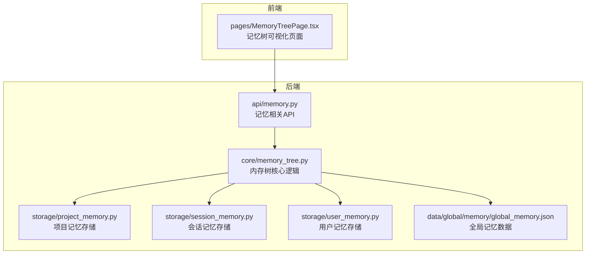
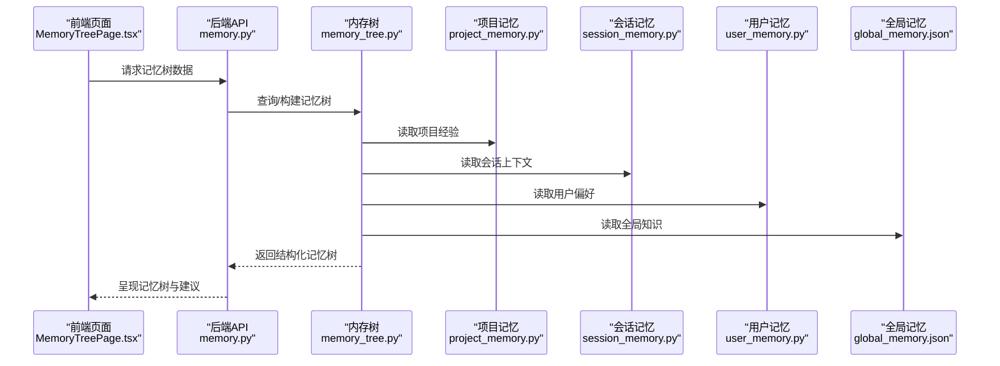
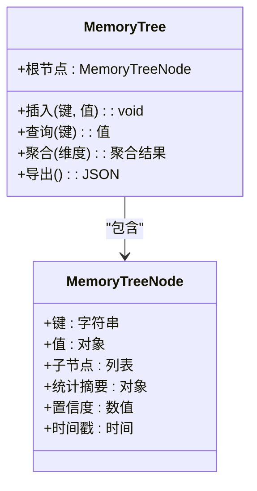
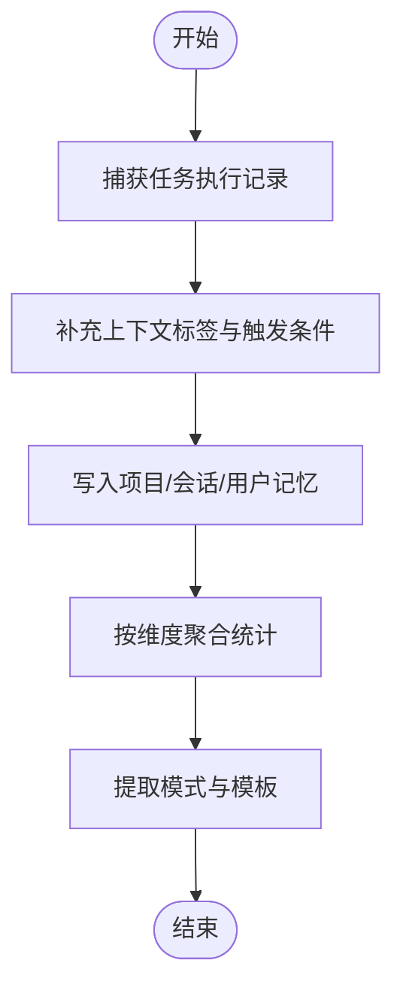
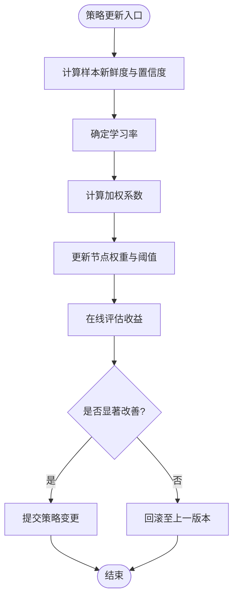
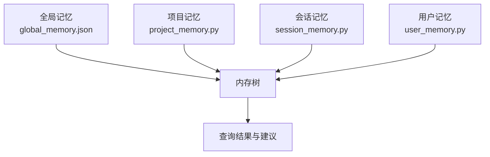
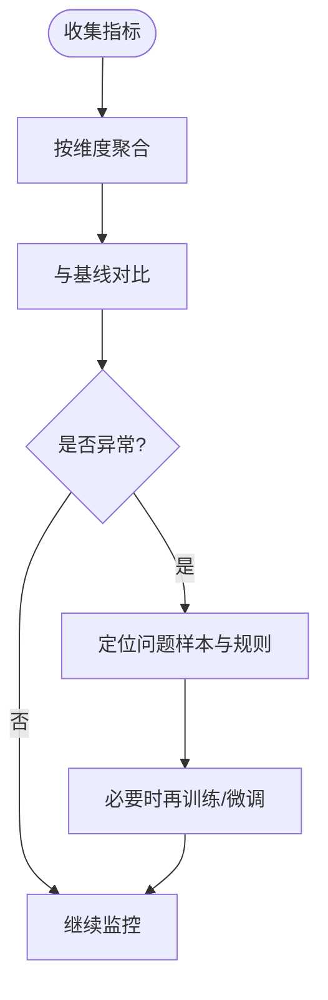
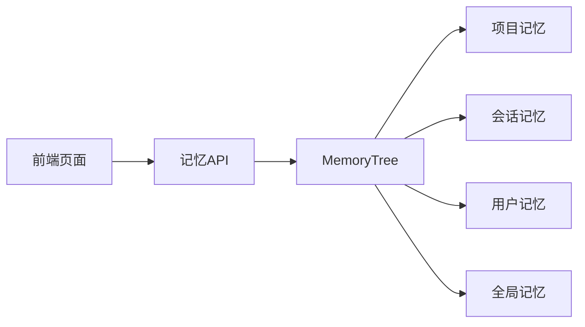

# 学习能力实现

<cite>
**本文引用的文件**
- [memory_tree.py](file://backend/app/core/memory_tree.py)
- [memory.py](file://backend/app/api/memory.py)
- [project_memory.py](file://backend/app/storage/project_memory.py)
- [session_memory.py](file://backend/app/storage/session_memory.py)
- [user_memory.py](file://backend/app/storage/user_memory.py)
- [global_memory.json](file://backend/data/global/memory/global_memory.json)
- [compliance.json（示例）](file://backend/data/project_memory/LED灯_德国_88d92e11/compliance.json)
- [MemoryTreePage.tsx](file://frontend/src/pages/MemoryTreePage.tsx)
</cite>

## 目录
1. [引言](#引言)
2. [项目结构](#项目结构)
3. [核心组件](#核心组件)
4. [架构总览](#架构总览)
5. [详细组件分析](#详细组件分析)
6. [依赖分析](#依赖分析)
7. [性能考虑](#性能考虑)
8. [故障排查指南](#故障排查指南)
9. [结论](#结论)
10. [附录](#附录)

## 引言
本文件面向避风港平台的学习能力实现，聚焦 MemoryTree 的架构设计与落地实践，系统阐述如下主题：
- MemoryTree 节点结构、层级关系与数据组织方式
- 经验积累机制：任务执行记录、结果存储与模式提取
- 自适应调整算法：学习率设置、权重更新与策略优化
- 项目级记忆系统：知识共享、经验复用与上下文关联
- 学习效果评估机制：性能指标、准确性测量与持续改进
- 学习能力配置与调优：参数设置、训练数据管理与效果监控

## 项目结构
学习能力相关代码主要分布在后端核心模块与前端页面层：
- 后端核心：内存树与记忆存储的核心逻辑位于 core 与 storage 层
- 后端接口：提供记忆查询与操作的 API
- 前端页面：展示 MemoryTree 的可视化界面与交互入口

**图表来源**
- [memory_tree.py](file://backend/app/core/memory_tree.py)
- [memory.py](file://backend/app/api/memory.py)
- [project_memory.py](file://backend/app/storage/project_memory.py)
- [session_memory.py](file://backend/app/storage/session_memory.py)
- [user_memory.py](file://backend/app/storage/user_memory.py)
- [global_memory.json](file://backend/data/global/memory/global_memory.json)
- [MemoryTreePage.tsx](file://frontend/src/pages/MemoryTreePage.tsx)

**章节来源**
- [memory_tree.py](file://backend/app/core/memory_tree.py)
- [memory.py](file://backend/app/api/memory.py)
- [project_memory.py](file://backend/app/storage/project_memory.py)
- [session_memory.py](file://backend/app/storage/session_memory.py)
- [user_memory.py](file://backend/app/storage/user_memory.py)
- [global_memory.json](file://backend/data/global/memory/global_memory.json)
- [MemoryTreePage.tsx](file://frontend/src/pages/MemoryTreePage.tsx)

## 核心组件
- MemoryTree（内存树）：以树形结构组织学习经验，支持按任务、上下文、规则等维度进行分层与聚合，便于检索与复用。
- 记忆存储层：按项目、会话、用户三个粒度持久化经验与上下文，支撑跨场景复用与全局共享。
- 记忆 API：提供查询、写入、更新与评估接口，作为前后端交互的桥梁。
- 全局记忆：提供跨项目、跨产品的通用知识与经验，作为初始学习基线。

**章节来源**
- [memory_tree.py](file://backend/app/core/memory_tree.py)
- [memory.py](file://backend/app/api/memory.py)
- [project_memory.py](file://backend/app/storage/project_memory.py)
- [session_memory.py](file://backend/app/storage/session_memory.py)
- [user_memory.py](file://backend/app/storage/user_memory.py)
- [global_memory.json](file://backend/data/global/memory/global_memory.json)

## 架构总览
学习能力的整体流程从“经验采集”到“模式提取”，再到“策略优化与复用”。MemoryTree 作为中枢，协调各存储层与 API 层，形成闭环。

**图表来源**
- [MemoryTreePage.tsx](file://frontend/src/pages/MemoryTreePage.tsx)
- [memory.py](file://backend/app/api/memory.py)
- [memory_tree.py](file://backend/app/core/memory_tree.py)
- [project_memory.py](file://backend/app/storage/project_memory.py)
- [session_memory.py](file://backend/app/storage/session_memory.py)
- [user_memory.py](file://backend/app/storage/user_memory.py)
- [global_memory.json](file://backend/data/global/memory/global_memory.json)

## 详细组件分析

### MemoryTree 架构设计
- 节点结构
  - 节点键：由任务类型、上下文标签、规则标识等构成，确保可检索性与去重
  - 节点值：包含经验样本、统计摘要、置信度、时间戳等元信息
  - 分支策略：按任务阶段、法规区域、产品类别等维度切分，形成多级索引
- 层级关系
  - 顶层：全局知识与通用规则
  - 中层：项目经验与合规模板
  - 底层：会话与用户行为片段
- 数据组织
  - 采用键值对与轻量 JSON 结构，便于序列化与快速检索
  - 支持增量更新与版本化，保障一致性与可追溯性

**图表来源**
- [memory_tree.py](file://backend/app/core/memory_tree.py)

**章节来源**
- [memory_tree.py](file://backend/app/core/memory_tree.py)

### 经验积累机制
- 任务执行记录
  - 在任务链与事件处理中捕获输入、中间态与输出，形成经验样本
  - 记录上下文标签（如区域、品类、法规）与触发条件
- 结果存储
  - 将成功/失败案例与评分写入对应存储（项目/会话/用户）
  - 使用标准化字段，保证跨粒度可比对
- 模式提取
  - 基于历史样本统计规则出现频率、成功率与耗时分布
  - 生成模板与阈值，指导后续决策

**图表来源**
- [memory_tree.py](file://backend/app/core/memory_tree.py)
- [project_memory.py](file://backend/app/storage/project_memory.py)
- [session_memory.py](file://backend/app/storage/session_memory.py)
- [user_memory.py](file://backend/app/storage/user_memory.py)

**章节来源**
- [memory_tree.py](file://backend/app/core/memory_tree.py)
- [project_memory.py](file://backend/app/storage/project_memory.py)
- [session_memory.py](file://backend/app/storage/session_memory.py)
- [user_memory.py](file://backend/app/storage/user_memory.py)

### 自适应调整算法
- 学习率设置
  - 基于样本新鲜度与置信度动态调整学习步长
  - 新样本优先级更高，衰减因子随时间与冲突次数调整
- 权重更新
  - 采用加权平均与滑动窗口结合的方式，平滑噪声波动
  - 对高风险或高价值场景提升权重敏感度
- 策略优化
  - 通过 A/B 实验对比不同策略的收益指标
  - 基于在线评估反馈迭代策略参数

**图表来源**
- [memory_tree.py](file://backend/app/core/memory_tree.py)

**章节来源**
- [memory_tree.py](file://backend/app/core/memory_tree.py)

### 项目级记忆系统
- 知识共享
  - 全局记忆提供跨项目的通用规则与模板，降低重复学习成本
  - 项目记忆作为局部强化，覆盖特定法规与流程差异
- 经验复用
  - 通过上下文匹配与相似度计算，推荐历史最佳实践
  - 支持“复制-粘贴”式经验迁移，并允许微调
- 上下文关联
  - 将任务、产品、区域、法规等多维标签映射到节点键
  - 提供多粒度检索：从全局到项目再到会话

**图表来源**
- [global_memory.json](file://backend/data/global/memory/global_memory.json)
- [memory_tree.py](file://backend/app/core/memory_tree.py)
- [project_memory.py](file://backend/app/storage/project_memory.py)
- [session_memory.py](file://backend/app/storage/session_memory.py)
- [user_memory.py](file://backend/app/storage/user_memory.py)

**章节来源**
- [global_memory.json](file://backend/data/global/memory/global_memory.json)
- [memory_tree.py](file://backend/app/core/memory_tree.py)
- [project_memory.py](file://backend/app/storage/project_memory.py)
- [session_memory.py](file://backend/app/storage/session_memory.py)
- [user_memory.py](file://backend/app/storage/user_memory.py)

### 学习效果评估机制
- 性能指标
  - 成功率、平均耗时、重试率、误判率等
  - 区域与品类细分指标，支持横向对比
- 准确性测量
  - 人工抽检与自动化规则校验相结合
  - 对关键节点建立回归基线，防止退化
- 持续改进
  - 定期评估与再训练：基于新数据重算统计与阈值
  - 异常检测与告警：对指标异常与模型漂移及时干预

**图表来源**
- [memory_tree.py](file://backend/app/core/memory_tree.py)

**章节来源**
- [memory_tree.py](file://backend/app/core/memory_tree.py)

### 配置与调优指南
- 参数设置
  - 学习率衰减：根据业务稳定性设定
  - 置信度阈值：区分“采纳建议”与“提示确认”
  - 聚合窗口：平衡实时性与稳定性
- 训练数据管理
  - 明确数据来源与标注规范，避免偏差
  - 定期清理过期与低质量样本
- 效果监控
  - 建立看板：成功率趋势、关键节点命中率、误判分析
  - 设定阈值与告警，确保异常可追踪

**章节来源**
- [memory_tree.py](file://backend/app/core/memory_tree.py)

## 依赖分析
- 组件耦合
  - MemoryTree 依赖存储层提供数据源；API 层负责编排与安全控制
  - 前端仅消费 API 输出，不直接访问存储细节
- 外部依赖
  - JSON 文件作为轻量持久化介质，便于导入导出与版本管理
- 潜在风险
  - 数据一致性：并发写入与版本冲突需有明确仲裁策略
  - 性能瓶颈：大规模树遍历与聚合需缓存与索引优化

**图表来源**
- [MemoryTreePage.tsx](file://frontend/src/pages/MemoryTreePage.tsx)
- [memory.py](file://backend/app/api/memory.py)
- [memory_tree.py](file://backend/app/core/memory_tree.py)
- [project_memory.py](file://backend/app/storage/project_memory.py)
- [session_memory.py](file://backend/app/storage/session_memory.py)
- [user_memory.py](file://backend/app/storage/user_memory.py)
- [global_memory.json](file://backend/data/global/memory/global_memory.json)

**章节来源**
- [memory_tree.py](file://backend/app/core/memory_tree.py)
- [memory.py](file://backend/app/api/memory.py)
- [project_memory.py](file://backend/app/storage/project_memory.py)
- [session_memory.py](file://backend/app/storage/session_memory.py)
- [user_memory.py](file://backend/app/storage/user_memory.py)
- [global_memory.json](file://backend/data/global/memory/global_memory.json)
- [MemoryTreePage.tsx](file://frontend/src/pages/MemoryTreePage.tsx)

## 性能考虑
- 索引与缓存
  - 为常用键建立倒排索引，减少全树扫描
  - 对热点节点与聚合结果进行缓存，降低重复计算
- 并发控制
  - 写入采用乐观锁或版本号，避免覆盖
  - 读写分离：热数据只读，冷数据后台合并
- 数据压缩
  - 对历史样本进行归档与压缩，保留关键字段
- 可观测性
  - 记录关键路径耗时与命中率，辅助容量规划

## 故障排查指南
- 常见问题
  - 记忆缺失：检查项目/会话/用户记忆是否正确初始化
  - 结果不准：核对全局与项目记忆的优先级与阈值
  - 性能下降：排查是否存在大量小粒度节点导致遍历开销过大
- 排查步骤
  - 通过 API 获取最小可复现请求，定位具体存储层
  - 对比历史快照，识别变更点
  - 查看日志与指标，确认是否触发了回滚或降级策略

**章节来源**
- [memory_tree.py](file://backend/app/core/memory_tree.py)
- [memory.py](file://backend/app/api/memory.py)
- [project_memory.py](file://backend/app/storage/project_memory.py)
- [session_memory.py](file://backend/app/storage/session_memory.py)
- [user_memory.py](file://backend/app/storage/user_memory.py)
- [global_memory.json](file://backend/data/global/memory/global_memory.json)

## 结论
MemoryTree 将避风港平台的学习能力以结构化方式落地，通过清晰的节点设计、多粒度记忆存储与自适应调整算法，实现了从经验采集到策略优化的闭环。配合全局知识与项目经验的协同，系统能够在复杂合规场景中持续提升准确性与效率。建议在实践中持续完善评估体系与监控告警，确保学习过程稳定可控。

## 附录
- 示例数据位置
  - 项目记忆样例：[compliance.json（示例）](file://backend/data/project_memory/LED灯_德国_88d92e11/compliance.json)
  - 全局记忆样例：[global_memory.json](file://backend/data/global/memory/global_memory.json)
- 前端入口
  - 记忆树页面：[MemoryTreePage.tsx](file://frontend/src/pages/MemoryTreePage.tsx)