# 智能代理系统

<cite>
**本文引用的文件**
- [后端变更路线图.md](file://后端变更路线图.md)
- [manager_agent.py](file://backend/app/core/manager_agent.py)
- [action_chain.py](file://backend/app/core/action_chain.py)
- [task_decomposer.py](file://backend/app/core/task_decomposer.py)
- [qa_agent.py](file://backend/app/core/qa_agent.py)
- [qa_tools.py](file://backend/app/core/qa_tools.py)
- [event_store.py](file://backend/app/storage/event_store.py)
- [chat_stream.py](file://backend/app/api/chat_stream.py)
- [skill_registry.py](file://backend/app/core/skill_registry.py)
- [skills.py](file://backend/app/api/skills.py)
- [ActionSuggestionCard.tsx](file://frontend/src/components/ActionSuggestionCard.tsx)
- [user_action_events.md](file://backend/data/config/events/user_action_events.md)
- [test_comprehensive_flow.py](file://backend/tests/test_comprehensive_flow.py)
- [nlu_fallback.yaml](file://backend/data/prompts/nlu_fallback.yaml)
- [_stage_matrix.yaml](file://backend/data/skills/_stage_matrix.yaml)
</cite>

## 更新摘要
**所做更改**
- 新增NLU系统整合到chat_stream API的详细说明
- 添加意图解析和技能推荐机制的技术实现
- 更新架构图以反映NLU组件的集成
- 增强技能推荐器的功能描述和使用指南
- 完善前端交互组件与NLU系统的集成说明

## 目录
1. [简介](#简介)
2. [项目结构](#项目结构)
3. [核心组件](#核心组件)
4. [架构总览](#架构总览)
5. [详细组件分析](#详细组件分析)
6. [NLU系统与技能推荐](#nlu系统与技能推荐)
7. [依赖分析](#依赖分析)
8. [性能考虑](#性能考虑)
9. [故障排查指南](#故障排查指南)
10. [结论](#结论)
11. [附录](#附录)

## 简介
本文件面向避风港平台的智能代理系统，围绕多Agent架构、任务分解与执行、学习与自适应、行动链编排、QA Agent质量保障、Agent配置与管理以及实际使用案例与最佳实践进行系统性说明。**更新版本**特别强调了NLU系统整合到chat_stream API中，以及新的意图解析和技能推荐机制的深度集成。文档以仓库中的核心代码与配置为依据，结合前端交互组件与测试用例，帮助读者从架构设计到落地实施全面理解系统。

## 项目结构
- 后端核心位于 backend/app，包含多Agent协调器、任务分解器、行动链、QA Agent、事件存储与工具集等模块。
- **新增** NLU系统集成到chat_stream API，提供智能意图解析和技能推荐功能。
- **新增** 技能注册表和技能推荐器，支持基于业务阶段和事件类型的动态技能推荐。
- 前端位于 frontend/src，提供与Agent交互的UI组件，如行动建议卡片等。
- 数据与配置位于 backend/data 与 data/config，涵盖事件类型、技能注册、工作器绑定等。
- 测试位于 backend/tests，覆盖端到端流程与指标验证。

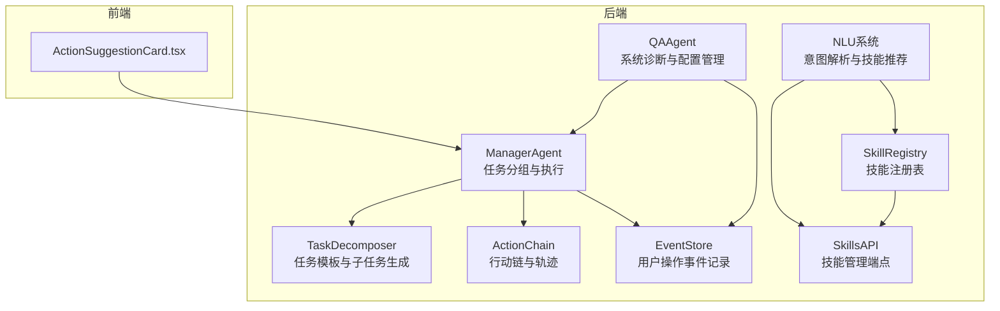

**图表来源**
- [chat_stream.py:128-202](file://backend/app/api/chat_stream.py#L128-L202)
- [skill_registry.py:697-786](file://backend/app/core/skill_registry.py#L697-L786)
- [skills.py:136-161](file://backend/app/api/skills.py#L136-L161)

**章节来源**
- [后端变更路线图.md:294-315](file://后端变更路线图.md#L294-L315)
- [后端变更路线图.md:771-790](file://后端变更路线图.md#L771-L790)
- [后端变更路线图.md:966-1029](file://后端变更路线图.md#L966-L1029)

## 核心组件
- ManagerAgent：多Agent协调器，负责任务拆解、子任务分配、执行编排与进度监控。
- TaskDecomposer：基于模板的任务分解器，支持事件驱动的自动模板选择与子任务生成。
- ActionChain：行动链记录器，维护每一步的执行状态、耗时与自然语言轨迹。
- QAAgent：系统自我管理智能体，承担配置问答、事件与Worker管理、系统诊断与流程串联。
- EventStore：用户操作事件持久化，支撑回溯与审计。
- **新增** NLU系统：集成到chat_stream API，提供智能意图解析、实体抽取和技能推荐功能。
- **新增** SkillRegistry：技能注册表，管理所有可用技能及其配置。
- **新增** SkillRecommender：技能推荐器，基于业务阶段和事件类型动态推荐技能组合。
- 前端ActionSuggestionCard：向用户呈现行动建议、风险等级与执行状态，支持确认/跳过。

**章节来源**
- [manager_agent.py:178-363](file://backend/app/core/manager_agent.py#L178-L363)
- [task_decomposer.py:423-455](file://backend/app/core/task_decomposer.py#L423-L455)
- [action_chain.py:143-185](file://backend/app/core/action_chain.py#L143-L185)
- [qa_agent.py:1-44](file://backend/app/core/qa_agent.py#L1-L44)
- [event_store.py:115-152](file://backend/app/storage/event_store.py#L115-L152)
- [chat_stream.py:128-202](file://backend/app/api/chat_stream.py#L128-L202)
- [skill_registry.py:697-786](file://backend/app/core/skill_registry.py#L697-L786)
- [ActionSuggestionCard.tsx:1-88](file://frontend/src/components/ActionSuggestionCard.tsx#L1-L88)

## 架构总览
多Agent系统以ManagerAgent为核心，通过TaskDecomposer将高层任务拆分为具备依赖关系的子任务，再由WorkerAgent池按业务阶段与优先级执行。**新增的NLU系统**在聊天入口处进行智能意图解析，提取产品、目标国家、业务阶段等关键信息，并推荐相应的技能组合。执行过程被ActionChain记录，QAAgent负责系统级配置与诊断，EventStore记录用户操作事件以便回溯。前端通过ActionSuggestionCard与用户交互，提供行动确认与状态反馈。

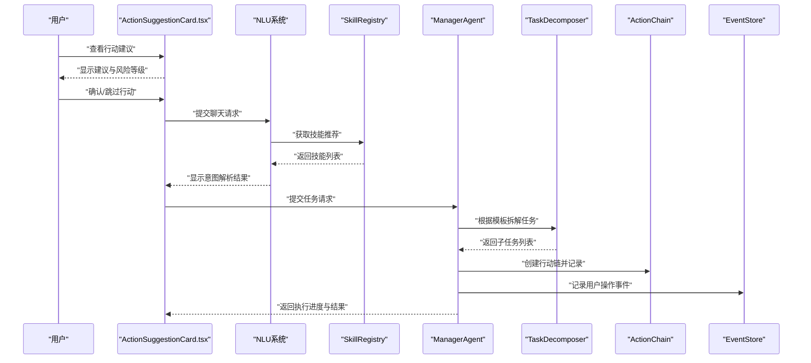

**图表来源**
- [chat_stream.py:128-202](file://backend/app/api/chat_stream.py#L128-L202)
- [skill_registry.py:697-786](file://backend/app/core/skill_registry.py#L697-L786)
- [manager_agent.py:178-363](file://backend/app/core/manager_agent.py#L178-L363)
- [task_decomposer.py:423-455](file://backend/app/core/task_decomposer.py#L423-L455)
- [action_chain.py:143-185](file://backend/app/core/action_chain.py#L143-L185)
- [event_store.py:115-152](file://backend/app/storage/event_store.py#L115-L152)
- [ActionSuggestionCard.tsx:1-88](file://frontend/src/components/ActionSuggestionCard.tsx#L1-L88)

## 详细组件分析

### ManagerAgent：多Agent协调与执行编排
- 任务拆解：根据输入任务与上下文，调用TaskDecomposer生成子任务集合。
- Worker分配：按业务阶段与优先级匹配Worker，支持通用Worker回退。
- 任务组管理：创建TaskGroup，记录创建消息与广播执行状态。
- 执行策略：按依赖关系顺序执行，支持并行与失败重试；汇总最终状态并记录完成消息。
- 状态监控：提供Worker状态查询与任务组状态判定。

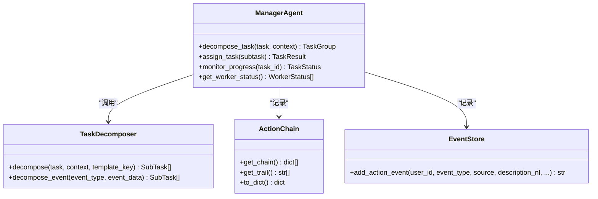

**图表来源**
- [manager_agent.py:178-363](file://backend/app/core/manager_agent.py#L178-L363)
- [task_decomposer.py:423-455](file://backend/app/core/task_decomposer.py#L423-L455)
- [action_chain.py:143-185](file://backend/app/core/action_chain.py#L143-L185)
- [event_store.py:115-152](file://backend/app/storage/event_store.py#L115-L152)

**章节来源**
- [manager_agent.py:178-363](file://backend/app/core/manager_agent.py#L178-L363)
- [后端变更路线图.md:771-790](file://后端变更路线图.md#L771-L790)
- [后端变更路线图.md:966-1029](file://后端变更路线图.md#L966-L1029)

### TaskDecomposer：任务解析与子任务生成
- 模板驱动：支持按任务模板键强制指定模板，或基于事件类型自动映射模板。
- 子任务属性：包含超时、重试次数、依赖关系等元信息，便于后续执行编排。
- 事件驱动：针对不同事件类型（如认证到期、合规检查、法规更新、订单处理、GDPR数据请求、商品上架）选择相应模板。

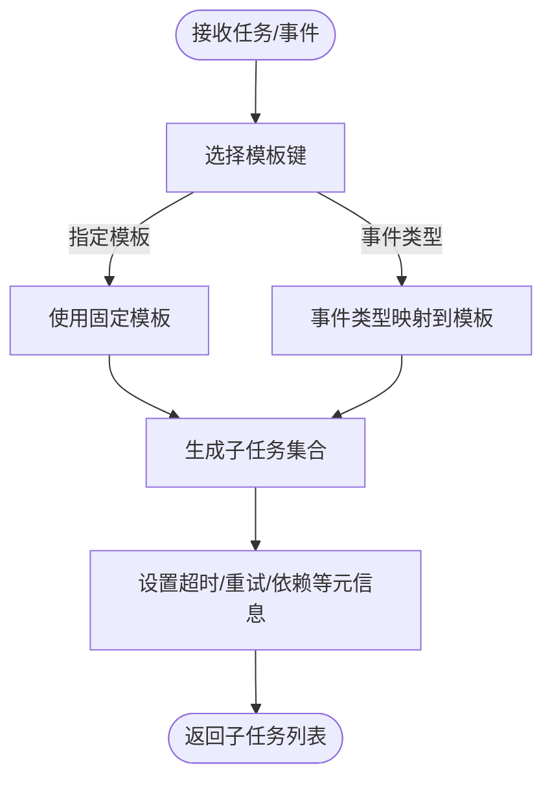

**图表来源**
- [task_decomposer.py:423-455](file://backend/app/core/task_decomposer.py#L423-L455)

**章节来源**
- [task_decomposer.py:423-455](file://backend/app/core/task_decomposer.py#L423-L455)

### ActionChain：行动链记录与轨迹展示
- 行动节点：记录每一步的Agent、描述、状态与耗时。
- 轨迹生成：输出自然语言形式的执行轨迹，便于回溯与审计。
- 状态计算：综合所有节点状态，得出整体链路状态（空/运行中/部分成功/完成/失败）。

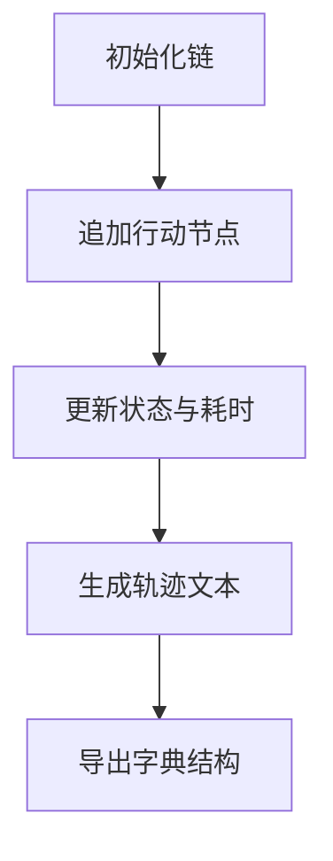

**图表来源**
- [action_chain.py:143-185](file://backend/app/core/action_chain.py#L143-L185)

**章节来源**
- [action_chain.py:143-185](file://backend/app/core/action_chain.py#L143-L185)

### QAAgent：系统诊断与配置管理
- 职责范围：配置问答、事件与Worker类型管理、系统健康检查、流程串联。
- 权限模型：safe（只读）、guarded（写操作需确认）、blocked（危险操作拒绝）。
- 工具集：读取/写入配置、注册/修改/删除事件、注册/修改/删除Worker、健康检查、生成合规简报等。

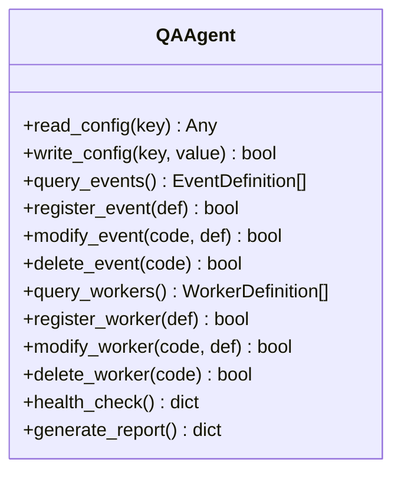

**图表来源**
- [qa_agent.py:1-44](file://backend/app/core/qa_agent.py#L1-L44)
- [qa_tools.py:255-281](file://backend/app/core/qa_tools.py#L255-L281)
- [user_action_events.md:24-32](file://backend/data/config/events/user_action_events.md#L24-L32)

**章节来源**
- [qa_agent.py:1-44](file://backend/app/core/qa_agent.py#L1-L44)
- [qa_tools.py:255-281](file://backend/app/core/qa_tools.py#L255-L281)
- [user_action_events.md:24-32](file://backend/data/config/events/user_action_events.md#L24-L32)

### EventStore：用户操作事件记录
- 事件类型：用户查询、规则检查、RAG检索、合规报告等。
- 数据流：用户操作触发各组件执行，随后写入事件记录，供回溯与审计。
- 关联维度：按用户维度聚合事件，维护总数与更新时间戳。

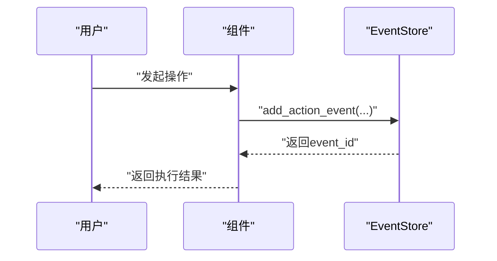

**图表来源**
- [event_store.py:115-152](file://backend/app/storage/event_store.py#L115-L152)

**章节来源**
- [event_store.py:115-152](file://backend/app/storage/event_store.py#L115-L152)

### 前端交互：ActionSuggestionCard
- 展示字段：标题、描述、风险等级、置信度、预期结果、当前状态。
- 用户操作：确认执行、跳过行动。
- 状态样式：根据状态映射显示不同标签与禁用逻辑。

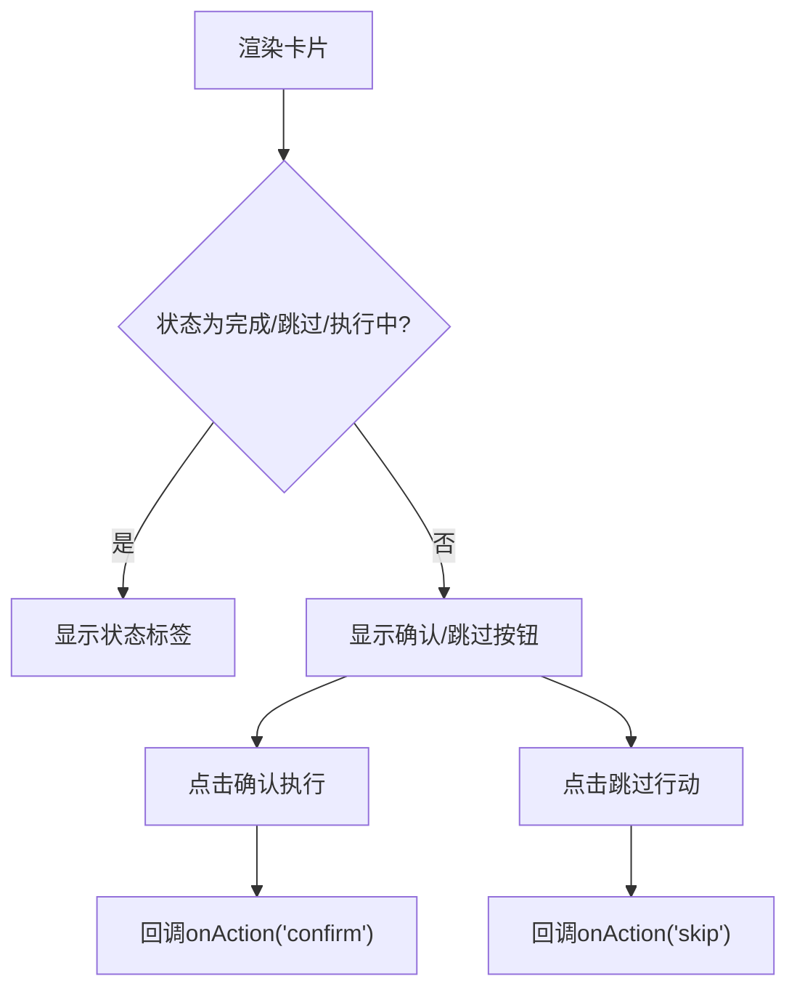

**图表来源**
- [ActionSuggestionCard.tsx:1-88](file://frontend/src/components/ActionSuggestionCard.tsx#L1-L88)

**章节来源**
- [ActionSuggestionCard.tsx:1-88](file://frontend/src/components/ActionSuggestionCard.tsx#L1-L88)

## NLU系统与技能推荐

### NLU系统集成到chat_stream API
**新增** NLU系统深度整合到chat_stream API中，提供智能聊天入口预处理功能：

- **意图解析**：从用户消息中提取结构化意图，包括action类型、产品名、目标国家、业务阶段映射、事件类型、推荐Skills、记忆树上下文提示。
- **安全检查**：内置危险模式检测，防止恶意输入和系统提示注入攻击。
- **实体抽取**：自动识别产品名称和目标国家信息。
- **历史增强**：基于多轮对话历史增强一般性查询的意图理解。
- **系统提示管理**：支持从Agent配置数据库、YAML文件和硬编码兆底获取system prompt。

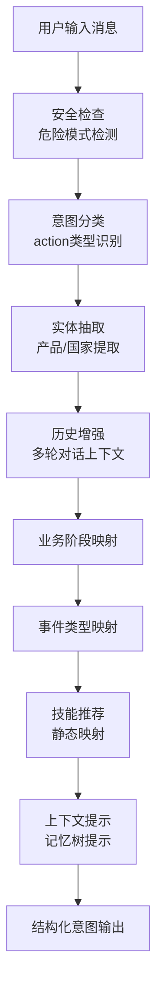

**图表来源**
- [chat_stream.py:128-202](file://backend/app/api/chat_stream.py#L128-L202)
- [chat_stream.py:222-260](file://backend/app/api/chat_stream.py#L222-L260)

**章节来源**
- [chat_stream.py:128-202](file://backend/app/api/chat_stream.py#L128-L202)
- [chat_stream.py:222-260](file://backend/app/api/chat_stream.py#L222-L260)

### 技能推荐机制
**新增** 基于业务阶段和事件类型的动态技能推荐系统：

- **SkillRegistry**：技能注册表，管理所有可用技能及其配置，支持CRUD操作和状态管理。
- **SkillRecommender**：技能推荐器，提供三种推荐策略：
  - 基于业务阶段的推荐（stage-based）
  - 基于事件类型的推荐（event-based）  
  - 综合上下文的推荐（context-aware）
- **技能矩阵**：从_yaml配置加载的业务阶段×技能映射矩阵，支持跨阶段通用技能。
- **事件动作推荐**：三层动作推荐（Skill/CLI/API），提供完整的执行路径。

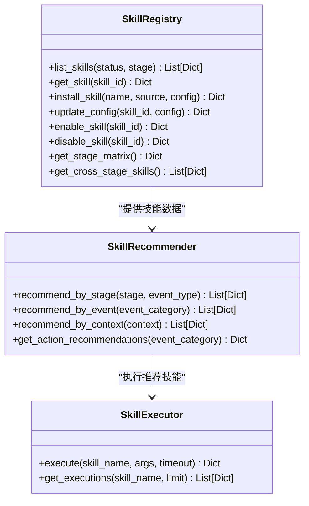

**图表来源**
- [skill_registry.py:262-465](file://backend/app/core/skill_registry.py#L262-L465)
- [skill_registry.py:697-786](file://backend/app/core/skill_registry.py#L697-L786)
- [skill_registry.py:452-465](file://backend/app/core/skill_registry.py#L452-L465)

**章节来源**
- [skill_registry.py:262-465](file://backend/app/core/skill_registry.py#L262-L465)
- [skill_registry.py:697-786](file://backend/app/core/skill_registry.py#L697-L786)
- [skills.py:136-161](file://backend/app/api/skills.py#L136-L161)

### Skills API端点
**新增** 完整的技能管理API端点：

- **技能列表**：获取所有技能的过滤和分页查询
- **安装技能**：支持从内置源或外部URL安装新技能
- **技能配置**：动态更新技能配置参数
- **技能执行**：异步执行技能并返回执行历史
- **技能矩阵**：获取业务阶段×技能映射矩阵
- **推荐系统**：基于上下文的智能技能推荐

**章节来源**
- [skills.py:42-161](file://backend/app/api/skills.py#L42-L161)

## 依赖分析
- ManagerAgent依赖TaskDecomposer生成子任务，依赖ActionChain记录执行轨迹，依赖EventStore记录用户操作事件。
- QAAgent作为系统管理员，与ManagerAgent协作进行配置与诊断，同时通过工具集对事件与Worker进行管理。
- 前端ActionSuggestionCard与ManagerAgent交互，接收任务执行状态并允许用户干预。
- **新增** NLU系统依赖SkillRegistry进行技能推荐，依赖EventBus发布意图事件。
- **新增** SkillRegistry与技能配置文件交互，维护技能的持久化状态。

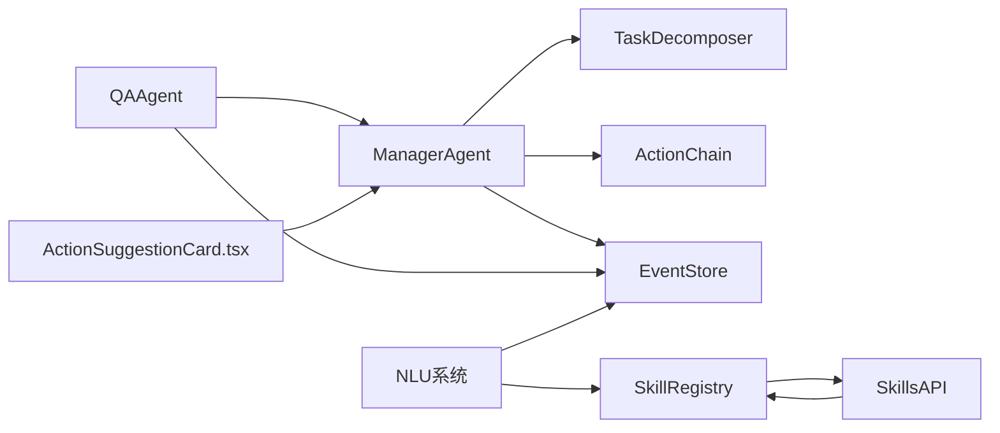

**图表来源**
- [manager_agent.py:178-363](file://backend/app/core/manager_agent.py#L178-L363)
- [task_decomposer.py:423-455](file://backend/app/core/task_decomposer.py#L423-L455)
- [action_chain.py:143-185](file://backend/app/core/action_chain.py#L143-L185)
- [qa_agent.py:1-44](file://backend/app/core/qa_agent.py#L1-L44)
- [event_store.py:115-152](file://backend/app/storage/event_store.py#L115-L152)
- [ActionSuggestionCard.tsx:1-88](file://frontend/src/components/ActionSuggestionCard.tsx#L1-L88)
- [chat_stream.py:128-202](file://backend/app/api/chat_stream.py#L128-L202)
- [skill_registry.py:697-786](file://backend/app/core/skill_registry.py#L697-L786)
- [skills.py:136-161](file://backend/app/api/skills.py#L136-L161)

**章节来源**
- [后端变更路线图.md:294-315](file://后端变更路线图.md#L294-L315)

## 性能考虑
- 并行执行：ManagerAgent在满足依赖的前提下并行执行子任务，提升吞吐。
- 重试与容错：子任务支持最大重试次数，避免单点故障阻塞整体流程。
- 状态聚合：ActionChain按节点状态快速计算整体状态，减少重复扫描。
- 前端交互：卡片组件仅渲染必要字段，降低UI层开销。
- **新增** NLU系统优化：意图解析采用缓存机制，危险模式检测使用正则表达式预编译，提升响应速度。
- **新增** 技能推荐优化：技能矩阵从文件系统缓存加载，推荐结果支持本地缓存，减少重复计算。

## 故障排查指南
- 任务未执行：检查子任务依赖是否满足、Worker是否正确分配、是否存在异常堆栈。
- 执行失败：查看ActionChain轨迹与EventStore事件，定位失败节点与错误原因。
- 配置问题：通过QAAgent工具集核对事件与Worker注册表，确认模板键与优先级设置。
- 健康检查：使用QAAgent的健康检查工具，获取事件总线、产品存储、注册表等组件的健康评分与诊断详情。
- **新增** NLU系统故障：检查意图解析日志、危险模式检测规则、技能推荐配置。
- **新增** 技能推荐故障：验证技能注册表状态、业务阶段矩阵配置、事件动作映射关系。

**章节来源**
- [manager_agent.py:293-363](file://backend/app/core/manager_agent.py#L293-L363)
- [action_chain.py:143-185](file://backend/app/core/action_chain.py#L143-L185)
- [event_store.py:115-152](file://backend/app/storage/event_store.py#L115-L152)
- [qa_tools.py:255-281](file://backend/app/core/qa_tools.py#L255-L281)

## 结论
避风港平台的智能代理系统通过ManagerAgent实现多Agent协调与执行编排，借助TaskDecomposer完成任务解析与子任务生成，以ActionChain与EventStore确保可观测与可回溯。**更新版本**引入了强大的NLU系统，实现了智能意图解析和动态技能推荐，显著提升了系统的自动化水平和用户体验。QAAgent提供系统级诊断与配置管理能力，前端ActionSuggestionCard增强人机交互体验。整体架构在可扩展性、可观测性与可运维性方面形成闭环，适合在复杂合规场景下稳定运行。

## 附录

### 实际使用案例与最佳实践
- 事件驱动的合规检查：当检测到法规更新或订单创建事件时，TaskDecomposer自动选择相应模板，ManagerAgent并行执行子任务，ActionChain记录全过程，QAAgent进行健康检查与报告生成。
- 用户干预与确认：前端ActionSuggestionCard展示行动建议与风险等级，用户可确认或跳过，确保人机协同。
- 配置与治理：通过QAAgent管理事件与Worker类型，遵循safe/guarded/blocked权限模型，保障系统安全可控。
- **新增** 智能聊天助手：用户通过自然语言查询合规信息，NLU系统自动解析意图并推荐相关技能，实现无缝的人机交互体验。
- **新增** 动态技能推荐：系统根据业务阶段和事件类型自动推荐最适合的技能组合，提高任务执行效率和成功率。

**章节来源**
- [后端变更路线图.md:771-790](file://后端变更路线图.md#L771-L790)
- [test_comprehensive_flow.py:224-232](file://backend/tests/test_comprehensive_flow.py#L224-L232)
- [chat_stream.py:128-202](file://backend/app/api/chat_stream.py#L128-L202)
- [skill_registry.py:697-786](file://backend/app/core/skill_registry.py#L697-L786)