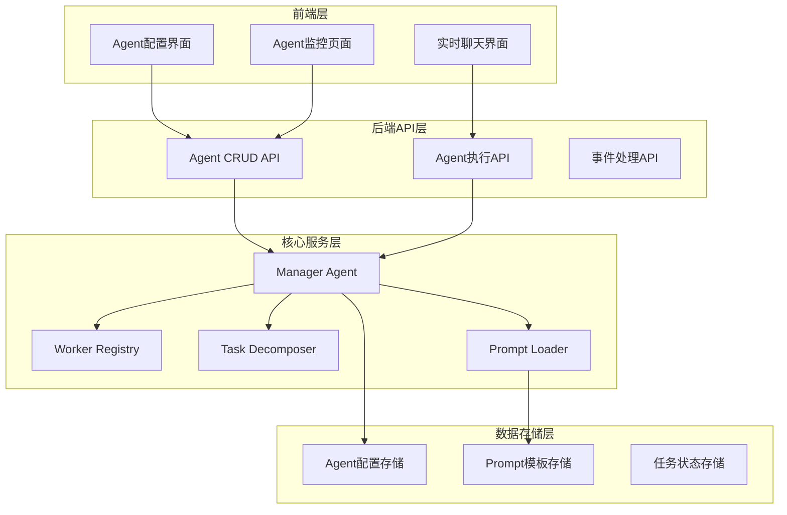
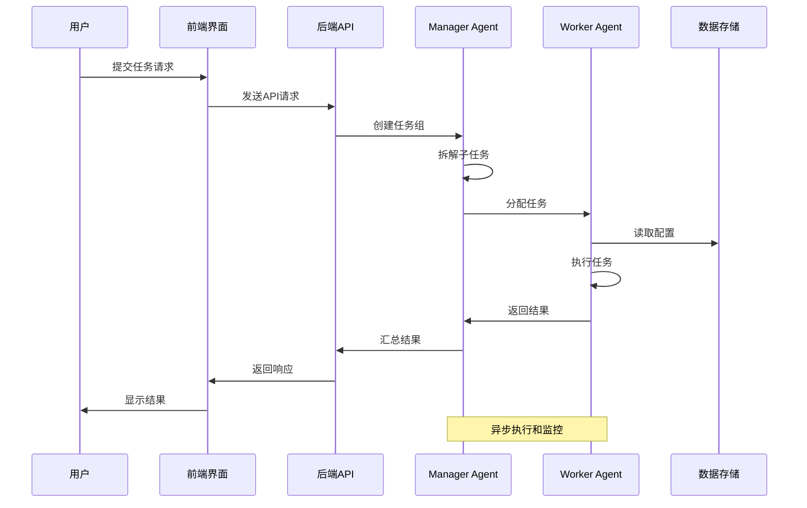
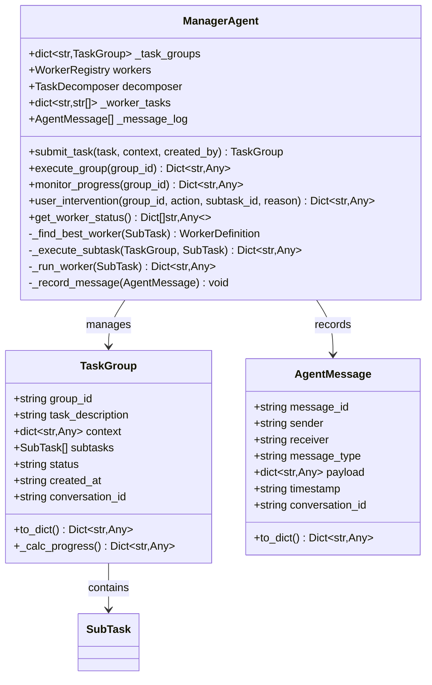
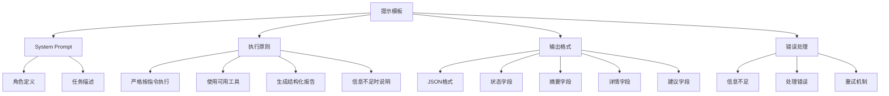
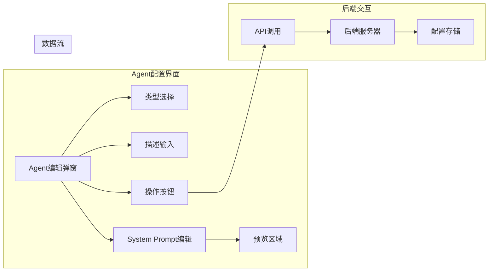
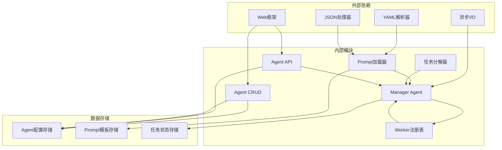

# 通用Manager提示模板

<cite>
**本文档引用的文件**
- [manager_generic.yaml](file://backend/data/prompts/manager_generic.yaml)
- [manager_agent.py](file://backend/app/core/manager_agent.py)
- [agent_config.py](file://backend/app/api/agent_config.py)
- [agent_crud.py](file://backend/app/api/agent_crud.py)
- [prompt_loader.py](file://backend/app/services/prompt_loader.py)
- [AgentEditModal.tsx](file://frontend/src/components/config/AgentEditModal.tsx)
- [AgentConfigCard.tsx](file://frontend/src/components/config/AgentConfigCard.tsx)
- [AgentMonitorPage.tsx](file://frontend/src/pages/AgentMonitorPage.tsx)
</cite>

## 目录
1. [简介](#简介)
2. [项目结构](#项目结构)
3. [核心组件](#核心组件)
4. [架构概览](#架构概览)
5. [详细组件分析](#详细组件分析)
6. [依赖关系分析](#依赖关系分析)
7. [性能考虑](#性能考虑)
8. [故障排除指南](#故障排除指南)
9. [结论](#结论)

## 简介

通用Manager提示模板是Astra合规智能体系统中的核心组件，负责为Manager Agent提供标准化的system prompt模板。该模板确保Manager Agent能够正确理解其职责、执行原则和输出格式要求，从而有效地协调多个Worker Agent完成复杂的合规任务。

系统采用分层架构设计，包含前端配置界面、后端API服务、Manager Agent协调器和Worker Agent执行器等组件。通用提示模板作为系统的基础配置之一，为整个智能体生态系统提供了统一的行为规范和输出标准。

## 项目结构

该项目采用前后端分离的架构设计，主要分为以下层次：

**图表来源**
- [manager_agent.py:120-150](file://backend/app/core/manager_agent.py#L120-L150)
- [agent_crud.py:13-28](file://backend/app/api/agent_crud.py#L13-L28)
- [agent_config.py:9-16](file://backend/app/api/agent_config.py#L9-L16)

**章节来源**
- [manager_agent.py:1-16](file://backend/app/core/manager_agent.py#L1-L16)
- [agent_crud.py:1-11](file://backend/app/api/agent_crud.py#L1-L11)
- [agent_config.py:1-7](file://backend/app/api/agent_config.py#L1-L7)

## 核心组件

### Manager Agent协调器

Manager Agent是多Agent系统的协调中心，负责接收高层任务、拆解子任务、分配Worker Agent并监控执行进度。其核心职责包括：

- **任务拆解**：将复杂任务分解为可执行的子任务
- **Worker分配**：根据业务阶段和优先级选择最适合的Worker
- **执行协调**：管理子任务的执行顺序和依赖关系
- **进度监控**：跟踪任务执行状态并提供用户干预能力

### 通用提示模板系统

通用提示模板系统提供了标准化的system prompt模板，确保所有Manager Agent具有统一的行为规范：

- **执行原则**：明确Agent的执行准则和约束条件
- **输出格式**：规定标准化的JSON输出格式
- **错误处理**：定义错误情况下的处理方式
- **上下文管理**：指导如何处理任务上下文信息

### 前端配置界面

前端提供了完整的Agent配置和管理系统，包括：

- **Agent编辑**：支持创建、修改和删除Agent配置
- **实时预览**：提供system prompt的实时预览功能
- **状态管理**：显示Agent的启用状态和执行统计
- **批量操作**：支持批量启用/禁用和排序调整

**章节来源**
- [manager_agent.py:120-150](file://backend/app/core/manager_agent.py#L120-L150)
- [manager_generic.yaml:1-24](file://backend/data/prompts/manager_generic.yaml#L1-L24)
- [AgentEditModal.tsx:105-134](file://frontend/src/components/config/AgentEditModal.tsx#L105-L134)

## 架构概览

系统采用事件驱动的异步架构，Manager Agent作为中央协调器连接各个组件：

**图表来源**
- [manager_agent.py:169-227](file://backend/app/core/manager_agent.py#L169-L227)
- [agent_crud.py:126-163](file://backend/app/api/agent_crud.py#L126-L163)

**章节来源**
- [manager_agent.py:309-397](file://backend/app/core/manager_agent.py#L309-L397)
- [agent_config.py:24-38](file://backend/app/api/agent_config.py#L24-L38)

## 详细组件分析

### Manager Agent类结构

**图表来源**
- [manager_agent.py:37-117](file://backend/app/core/manager_agent.py#L37-L117)
- [manager_agent.py:120-166](file://backend/app/core/manager_agent.py#L120-L166)

### 通用提示模板结构

通用提示模板采用YAML格式定义，包含以下关键要素：

**图表来源**
- [manager_generic.yaml:4-23](file://backend/data/prompts/manager_generic.yaml#L4-L23)

**章节来源**
- [manager_generic.yaml:1-24](file://backend/data/prompts/manager_generic.yaml#L1-L24)
- [manager_agent.py:475-594](file://backend/app/core/manager_agent.py#L475-L594)

### 前端Agent配置界面

前端提供了直观的Agent配置界面，支持实时编辑和预览：

**图表来源**
- [AgentEditModal.tsx:105-134](file://frontend/src/components/config/AgentEditModal.tsx#L105-L134)
- [AgentConfigCard.tsx:30-52](file://frontend/src/components/config/AgentConfigCard.tsx#L30-L52)

**章节来源**
- [AgentEditModal.tsx:105-134](file://frontend/src/components/config/AgentEditModal.tsx#L105-L134)
- [AgentConfigCard.tsx:30-52](file://frontend/src/components/config/AgentConfigCard.tsx#L30-L52)

## 依赖关系分析

系统各组件之间的依赖关系如下：

**图表来源**
- [prompt_loader.py:44-78](file://backend/app/services/prompt_loader.py#L44-L78)
- [manager_agent.py:27-31](file://backend/app/core/manager_agent.py#L27-L31)
- [agent_crud.py:18-26](file://backend/app/api/agent_crud.py#L18-L26)

**章节来源**
- [prompt_loader.py:44-78](file://backend/app/services/prompt_loader.py#L44-L78)
- [manager_agent.py:27-31](file://backend/app/core/manager_agent.py#L27-L31)

## 性能考虑

系统在设计时充分考虑了性能优化：

### 异步执行模型
- 使用asyncio实现非阻塞的并发执行
- 支持多个子任务的并行处理
- 异常处理不影响其他任务的执行

### 缓存机制
- Prompt模板采用内存缓存减少磁盘I/O
- Worker状态信息缓存提高查询效率
- 任务结果缓存支持快速检索

### 资源管理
- Worker负载均衡避免资源过载
- 任务超时控制防止资源泄露
- 连接池管理数据库连接

## 故障排除指南

### 常见问题及解决方案

**Manager Agent无法启动**
- 检查Worker注册表是否正常
- 验证任务分解器配置
- 确认数据库连接状态

**任务执行失败**
- 查看子任务错误日志
- 检查Worker可用性
- 验证工具和技能配置

**提示模板加载失败**
- 确认YAML文件语法正确
- 检查文件权限设置
- 验证模板路径配置

**前端配置界面异常**
- 检查API接口连通性
- 验证用户权限设置
- 确认浏览器兼容性

**章节来源**
- [manager_agent.py:444-473](file://backend/app/core/manager_agent.py#L444-L473)
- [prompt_loader.py:44-78](file://backend/app/services/prompt_loader.py#L44-L78)

## 结论

通用Manager提示模板系统为Astra合规智能体提供了标准化的配置框架，通过清晰的角色定义、严格的执行原则和规范的输出格式，确保了整个智能体生态系统的协调一致性和可维护性。

该系统的设计体现了现代AI应用的最佳实践：
- **模块化设计**：各组件职责明确，便于独立开发和测试
- **异步架构**：支持高并发和高性能的执行模式
- **配置驱动**：通过模板和配置实现灵活的功能扩展
- **可观测性**：完善的日志记录和状态监控机制

未来可以进一步优化的方向包括：
- 增强模板的动态渲染能力
- 扩展更多类型的提示模板
- 优化性能监控和告警机制
- 加强安全性和访问控制