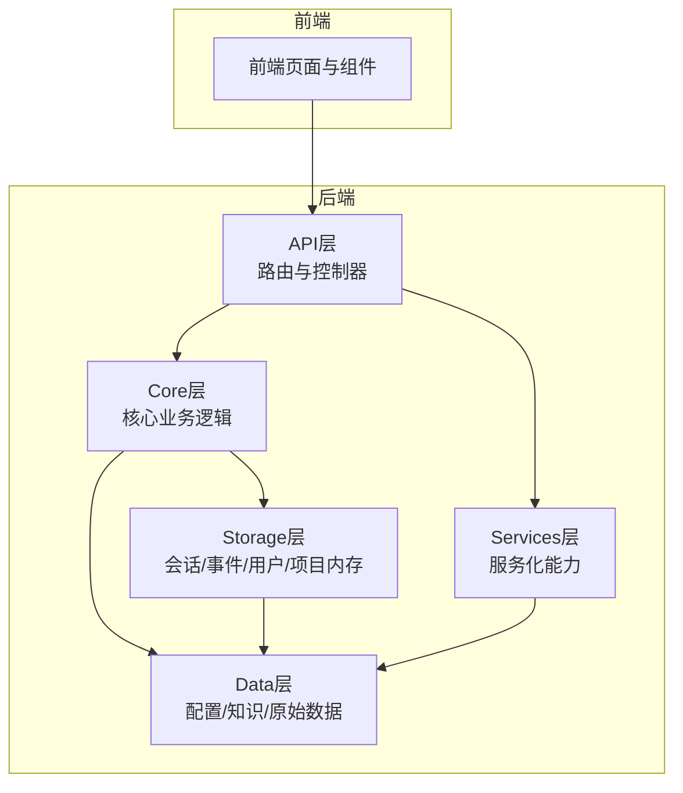
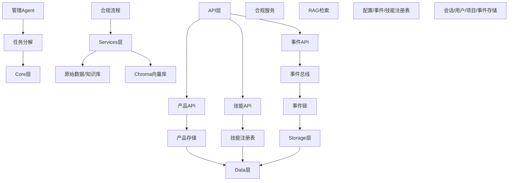
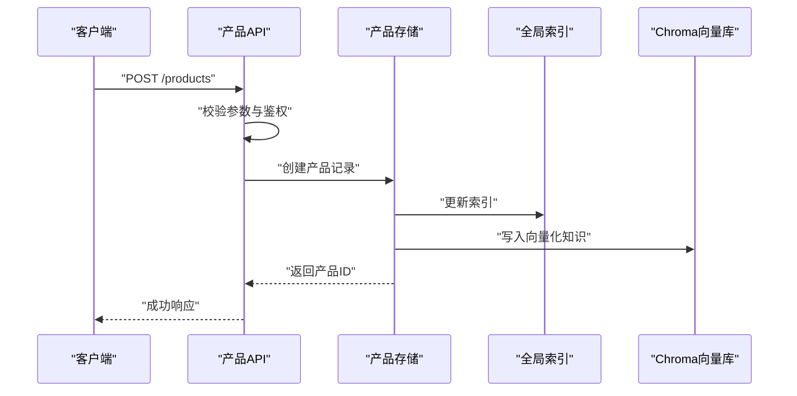
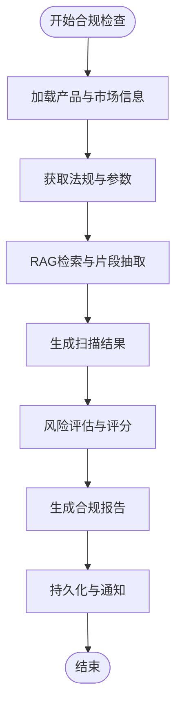
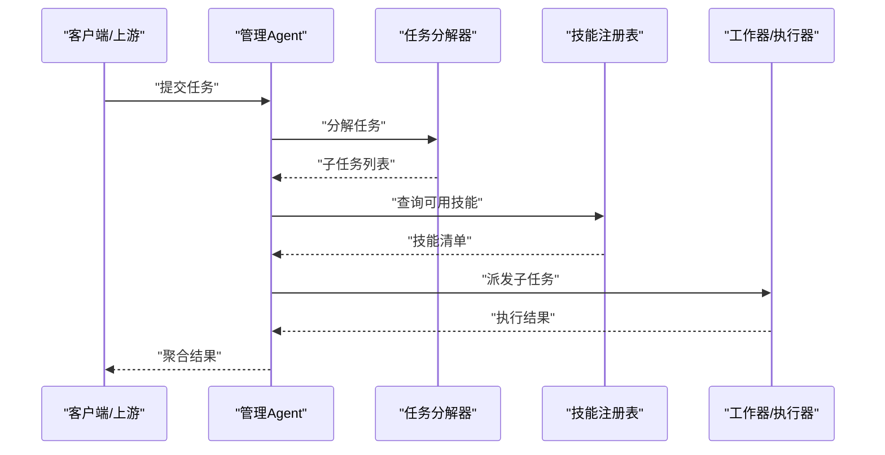
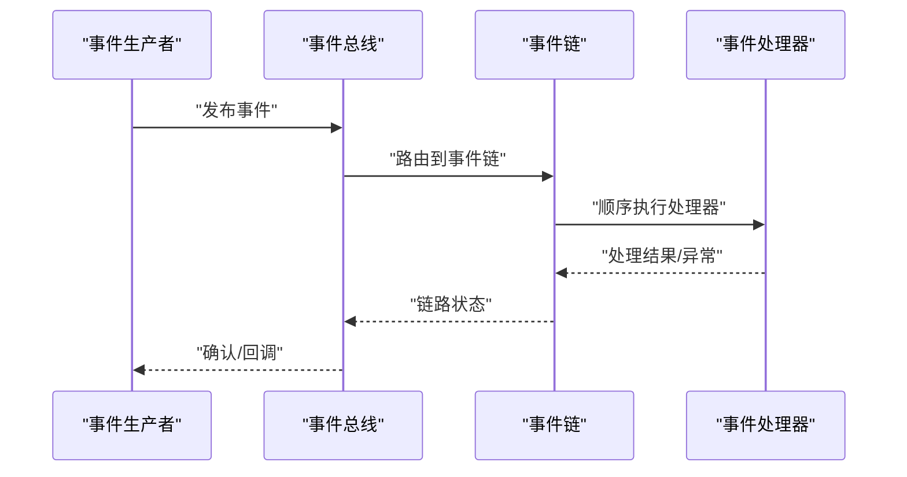
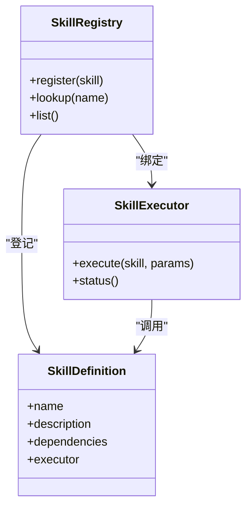
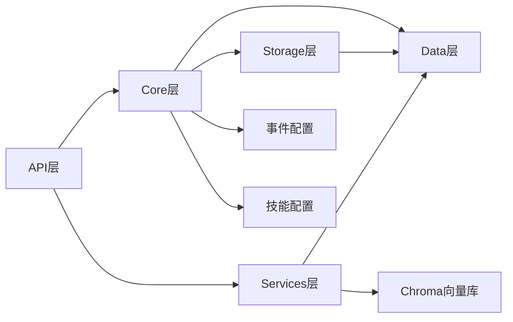

# 核心业务模块

<cite>
**本文引用的文件**
- [backend/app/main.py](file://backend/app/main.py)
- [backend/app/api/products.py](file://backend/app/api/products.py)
- [backend/app/core/product_storage.py](file://backend/app/core/product_storage.py)
- [backend/app/services/compliance.py](file://backend/app/services/compliance.py)
- [backend/app/core/compliance_flow.py](file://backend/app/core/compliance_flow.py)
- [backend/data/prompts/regulation_scan.yaml](file://backend/data/prompts/regulation_scan.yaml)
- [backend/data/prompts/risk_summary.yaml](file://backend/data/prompts/risk_summary.yaml)
- [backend/app/core/skill_registry.py](file://backend/app/core/skill_registry.py)
- [backend/app/api/skills.py](file://backend/app/api/skills.py)
- [backend/app/core/task_decomposer.py](file://backend/app/core/task_decomposer.py)
- [backend/app/core/manager_agent.py](file://backend/app/core/manager_agent.py)
- [backend/app/core/event_bus.py](file://backend/app/core/event_bus.py)
- [backend/app/api/events.py](file://backend/app/api/events.py)
- [backend/app/core/event_chain.py](file://backend/app/core/event_chain.py)
- [backend/data/config/events/lifecycle_events.md](file://backend/data/config/events/lifecycle_events.md)
- [backend/data/config/events/system_events.md](file://backend/data/config/events/system_events.md)
- [backend/data/config/skills/registry.json](file://backend/data/config/skills/registry.json)
- [backend/data/global/products_index.json](file://backend/data/global/products_index.json)
- [backend/data/products/p_E2E测_1d642ce3/product.json](file://backend/data/products/p_E2E测_1d642ce3/product.json)
- [backend/data/products/p_E2E测_1d642ce3/metrics](file://backend/data/products/p_E2E测_1d642ce3/metrics)
- [backend/data/products/p_E2E测_1d642ce3/knowledge](file://backend/data/products/p_E2E测_1d642ce3/knowledge)
- [backend/data/products/p_E2E测_1d642ce3/memory](file://backend/data/products/p_E2E测_1d642ce3/memory)
- [backend/data/products/p_E2E测_1d642ce3/events](file://backend/data/products/p_E2E测_1d642ce3/events)
- [backend/data/chroma](file://backend/data/chroma)
- [backend/data/raw/regulations/eu](file://backend/data/raw/regulations/eu)
- [backend/data/raw/vat_rates.json](file://backend/data/raw/vat_rates.json)
- [backend/data/raw/hs_codes](file://backend/data/raw/hs_codes)
- [backend/data/raw/certifications](file://backend/data/raw/certifications)
- [backend/data/config/model_routes.json](file://backend/data/config/model_routes.json)
- [backend/data/config/tools.json](file://backend/data/config/tools.json)
- [backend/data/config/rbac_users.json](file://backend/data/config/rbac_users.json)
- [backend/data/config/channels.json](file://backend/data/config/channels.json)
- [backend/data/config/agent_extensions.json](file://backend/data/config/agent_extensions.json)
- [backend/data/config/approvals.json](file://backend/data/config/approvals.json)
- [backend/data/config/oauth_connections.json](file://backend/data/config/oauth_connections.json)
- [backend/data/config/scheduler/task_worker_bindings.json](file://backend/data/config/scheduler/task_worker_bindings.json)
- [backend/data/config/workers/custom_workers.md](file://backend/data/config/workers/custom_workers.md)
- [backend/data/config/workers/_archive](file://backend/data/config/workers/_archive)
- [backend/data/config/events/_archive](file://backend/data/config/events/_archive)
- [backend/data/config/events/README.md](file://backend/data/config/events/README.md)
- [backend/data/config/events/certification_events.md](file://backend/data/config/events/certification_events.md)
- [backend/data/config/events/custom_events.md](file://backend/data/config/events/custom_events.md)
- [backend/data/config/events/lifecycle_events.md](file://backend/data/config/events/lifecycle_events.md)
- [backend/data/config/events/order_events.md](file://backend/data/config/events/order_events.md)
- [backend/data/config/events/risk_alert_events.md](file://backend/data/config/events/risk_alert_events.md)
- [backend/data/config/events/system_events.md](file://backend/data/config/events/system_events.md)
- [backend/data/config/events/user_action_events.md](file://backend/data/config/events/user_action_events.md)
- [backend/data/config/skills/registry.json](file://backend/data/config/skills/registry.json)
- [backend/data/config/workers/README.md](file://backend/data/config/workers/README.md)
- [backend/data/config/workers/custom_workers.md](file://backend/data/config/workers/custom_workers.md)
- [backend/data/config/workers/_archive](file://backend/data/config/workers/_archive)
- [backend/data/config/events/README.md](file://backend/data/config/events/README.md)
- [backend/data/config/events/certification_events.md](file://backend/data/config/events/certification_events.md)
- [backend/data/config/events/custom_events.md](file://backend/data/config/events/custom_events.md)
- [backend/data/config/events/lifecycle_events.md](file://backend/data/config/events/lifecycle_events.md)
- [backend/data/config/events/order_events.md](file://backend/data/config/events/order_events.md)
- [backend/data/config/events/risk_alert_events.md](file://backend/data/config/events/risk_alert_events.md)
- [backend/data/config/events/system_events.md](file://backend/data/config/events/system_events.md)
- [backend/data/config/events/user_action_events.md](file://backend/data/config/events/user_action_events.md)
- [backend/data/config/skills/registry.json](file://backend/data/config/skills/registry.json)
- [backend/data/config/workers/README.md](file://backend/data/config/workers/README.md)
- [backend/data/config/workers/custom_workers.md](file://backend/data/config/workers/custom_workers.md)
- [backend/data/config/workers/_archive](file://backend/data/config/workers/_archive)
- [backend/data/config/events/README.md](file://backend/data/config/events/README.md)
- [backend/data/config/events/certification_events.md](file://backend/data/config/events/certification_events.md)
- [backend/data/config/events/custom_events.md](file://backend/data/config/events/custom_events.md)
- [backend/data/config/events/lifecycle_events.md](file://backend/data/config/events/lifecycle_events.md)
- [backend/data/config/events/order_events.md](file://backend/data/config/events/order_events.md)
- [backend/data/config/events/risk_alert_events.md](file://backend/data/config/events/risk_alert_events.md)
- [backend/data/config/events/system_events.md](file://backend/data/config/events/system_events.md)
- [backend/data/config/events/user_action_events.md](file://backend/data/config/events/user_action_events.md)
- [backend/data/config/skills/registry.json](file://backend/data/config/skills/registry.json)
- [backend/data/config/workers/README.md](file://backend/data/config/workers/README.md)
- [backend/data/config/workers/custom_workers.md](file://backend/data/config/workers/custom_workers.md)
- [backend/data/config/workers/_archive](file://backend/data/config/workers/_archive)
- [backend/data/config/events/README.md](file://backend/data/config/events/README.md)
- [backend/data/config/events/certification_events.md](file://backend/data/config/events/certification_events.md)
- [backend/data/config/events/custom_events.md](file://backend/data/config/events/custom_events.md)
- [backend/data/config/events/lifecycle_events.md](file://backend/data/config/events/lifecycle_events.md)
- [backend/data/config/events/order_events.md](file://backend/data/config/events/order_events.md)
- [backend/data/config/events/risk_alert_events.md](file://backend/data/config/events/risk_alert_events.md)
- [backend/data/config/events/system_events.md](file://backend/data/config/events/system_events.md)
- [backend/data/config/events/user_action_events.md](file://backend/data/config/events/user_action_events.md)
- [backend/data/config/skills/registry.json](file://backend/data/config/skills/registry.json)
- [backend/data/config/workers/README.md](file://backend/data/config/workers/README.md)
- [backend/data/config/workers/custom_workers.md](file://backend/data/config/workers/custom_workers.md)
- [backend/data/config/workers/_archive](file://backend/data/config/workers/_archive)
- [backend/data/config/events/README.md](file://backend/data/config/events/README.md)
- [backend/data/config/events/certification_events.md](file://backend/data/config/events/certification_events.md)
- [backend/data/config/events/custom_events.md](file://backend/data/config/events/custom_events.md)
- [backend/data/config/events/lifecycle_events.md](file://backend/data/config/events/lifecycle_events.md)
- [backend/data/config/events/order_events.md](file://backend/data/config/events/order_events.md)
- [backend/data/config/events/risk_alert_events.md](file://backend/data/config/events/risk_alert_events.md)
- [backend/data/config/events/system_events.md](file://backend/data/config/events/system_events.md)
- [backend/data/config/events/user_action_events.md](file://backend/data/config/events/user_action_events.md)
- [backend/data/config/skills/registry.json](file://backend/data/config/skills/registry.json)
- [backend/data/config/workers/README.md](file://backend/data/config/workers/README.md)
- [backend/data/config/workers/custom_workers.md](file://backend/data/config/workers/custom_workers.md)
- [backend/data/config/workers/_archive](file://backend/data/config/workers/_archive)
- [backend/data/config/events/README.md](file://backend/data/config/events/README.md)
- [backend/data/config/events/certification_events.md](file://backend/data/config/events/certification_events.md)
- [backend/data/config/events/custom_events.md](file://backend/data/config/events/custom_events.md)
- [backend/data/config/events/lifecycle_events.md](file://backend/data/config/events/lifecycle_events.md)
- [backend/data/config/events/order_events.md](file://backend/data/config/events/order_events.md)
- [backend/data/config/events/risk_alert_events.md](file://backend/data/config/events/risk_alert_events.md)
- [backend/data/config/events/system_events.md](file://backend/data/config/events/system_events.md)
- [backend/data/config/events/user_action_events.md](file://backend/data/config/events/user_action_events.md)
- [backend/data/config/skills/registry.json](file://backend/data/config/skills/registry.json)
- [backend/data/config/workers/README.md](file://backend/data/config/workers/README.md)
- [backend/data/config/workers/custom_workers.md](file://backend/data/config/workers/custom_workers.md)
- [backend/data/config/workers/_archive](file://backend/data/config/workers/_archive)
- [backend/data/config/events/README.md](file://backend/data/config/events/README.md)
- [backend/data/config/events/certification_events.md](file://backend/data/config/events/certification_events.md)
- [backend/data/config/events/custom_events.md](file://backend/data/config/events/custom_events.md)
- [backend/data/config/events/lifecycle_events.md](file://backend/data/config/events/lifecycle_events.md)
- [backend/data/config/events/order_events.md](file://backend/data/config/events/order_events.md)
- [backend/data/config/events/risk_alert_events.md](file://backend/data/config/events/risk_alert_events.md)
- [backend/data/config/events/system_events.md](file......]
- [backend/data/config/events/user_action_events.md](file://backend/data/config/events/user_action_events.md)
- [backend/data/config/skills/registry.json](file://backend/data/config/skills/registry.json)
- [backend/data/config/workers/README.md](file://backend/data/config/workers/README.md)
- [backend/data/config/workers/custom_workers.md](file://backend/data/config/workers/custom_workers.md)
- [backend/data/config/workers/_archive](file://backend/data/config/workers/_archive)
- [backend/data/config/events/README.md](file://backend/data/config/events/README.md)
- [backend/data/config/events/certification_events.md](file://backend/data/config/events/certification_events.md)
- [backend/data/config/events/custom_events.md](file://backend/data/config/events/custom_events.md)
- [backend/data/config/events/lifecycle_events.md](file://backend/data/config/events/lifecycle_events.md)
- [backend/data/config/events/order_events.md](file://backend/data/config/events/order_events.md)
- [backend/data/config/events/risk_alert_events.md](file://backend/data/config/events/risk_alert_events.md)
- [backend/data/config/events/system_events.md](file://backend/data/config/events/system_events.md)
- [backend/data/config/events/user_action_events.md](file://backend/data/config/events/user_action_events.md)
- [backend/data/config/skills/registry.json](file://backend/data/config/skills/registry.json)
- [backend/data/config/workers/README.md](file://backend/data/config/workers/README.md)
- [backend/data/config/workers/custom_workers.md](file://backend/data/config/workers/custom_workers.md)
- [backend/data/config/workers/_archive](file://backend/data/config/workers/_archive)
- [backend/data/config/events/README.md](file://backend/data/config/events/README.md)
- [backend/data/config/events/certification_events.md](file://backend/data/config/events/certification_events.md)
- [backend/data/config/events/custom_events.md](file://backend/data/config/events/custom_events.md)
- [backend/data/config/events/lifecycle_events.md](file://backend/data/config/events/lifecycle_events.md)
- [backend/data/config/events/order_events.md](file://backend/data/config/events/order_events.md)
- [backend/data/config/events/risk_alert_events.md](file://backend/data/config/events/risk_alert_events.md)
- [backend/data/config/events/system_events.md](file://backend/data/config/events/system_events.md)
- [backend/data/config/events/user_action_events.md](file://backend/data/config/events/user_action_events.md)
- [backend/data/config/skills/registry.json](file://backend/data/config/skills/registry.json)
- [backend/data/config/workers/README.md](file://backend/data/config/workers/README.md)
- [backend/data/config/workers/custom_workers.md](file://backend/data/config/workers/custom_workers.md)
- [backend/data/config/workers/_archive](file://backend/data/config/workers/_archive)
- [backend/data/config/events/README.md](file://backend/data/config/events/README.md)
- [backend/data/config/events/certification_events.md](file://backend/data/config/events/certification_events.md)
- [backend/data/config/events/custom_events.md](file://backend/data/config/events/custom_events.md)
- [backend/data/config/events/lifecycle_events.md](file://backend/data/config/events/lifecycle_events.md)
- [backend/data/config/events/order_events.md](file://backend/data/config/events/order_events.md)
- [backend/data/config/events/risk_alert_events.md](file://backend/data/config/events/risk_alert_events.md)
- [backend/data/config/events/system_events.md](file://backend/data/config/events/system_events.md)
- [backend/data/config/events/user_action_events.md](file://backend/data/config/events/user_action_events.md)
- [backend/data/config/skills/registry.json](file://backend/data/config/skills/registry.json)
- [backend/data/config/workers/README.md](file://backend/data/config/workers/README.md)
- [backend/data/config/workers/custom_workers.md](file://backend/data/config/workers/custom_workers.md)
- [backend/data/config/workers/_archive](file://backend/data/config/workers/_archive)
- [backend/data/config/events/README.md](file://backend/data/config/events/README.md)
- [backend/data/config/events/certification_events.md](file://backend/data/config/events/certification_events.md)
- [backend/data/config/events/custom_events.md](file://backend/data/config/events/custom_events.md)
- [backend/data/config/events/lifecycle_events.md](file://backend/data/config/events/lifecycle_events.md)
- [backend/data/config/events/order_events.md](file://backend/data/config/events/order_events.md)
- [backend/data/config/events/risk_alert_events.md](file://backend/data/config/events/risk_alert_events.md)
- [backend/data/config/events/system_events.md](file://backend/data/config/events/system_events.md)
- [backend/data/config/events/user_action_events.md](file://backend/data/config/events/user_action_events.md)
- [backend/data/config/skills/registry.json](file://backend/data/config/skills/registry.json)
- [backend/data/config/workers/README.md](file://backend/data/config/workers/README.md)
- [backend/data/config/workers/custom_workers.md](file://backend/data/config/workers/custom_workers.md)
- [backend/data/config/workers/_archive](file://backend/data/config/workers/_archive)
- [backend/data/config/events/README.md](file://backend/data/config/events/README.md)
- [backend/data/config/events/certification_events.md](file://backend/data/config/events/certification_events.md)
- [backend/data/config/events/custom_events.md](file://backend/data/config/events/custom_events.md)
- [backend/data/config/events/lifecycle_events.md](file://backend/data/config/events/lifecycle_events.md)
- [backend/data/config/events/order_events.md](file://backend/data/config/events/order_events.md)
- [backend/data/config/events/risk_alert_events.md](file://backend/data/config/events/risk_alert_events.md)
- [backend/data/config/events/system_events.md](file://backend/data/config/events/system_events.md)
- [backend/data/config/events/user_action_events.md](file://backend/data/config/events/user_action_events.md)
- [backend/data/config/skills/registry.json](file://backend/data/config/skills/registry.json)
- [backend/data/config/workers/README.md](file://backend/data/config/workers/README.md)
- [backend/data/config/workers/custom_workers.md](file://backend/data/config/workers/custom_workers.md)
- [backend/data/config/workers/_archive](file://backend/data/config/workers/_archive)
- [backend/data/config/events/README.md](file://backend/data/config/events/README.md)
- [backend/data/config/events/certification_events.md](file://backend/data/config/events/certification_events.md)
- [backend/data/config/events/custom_events.md](file://backend/data/config/events/custom_events.md)
- [backend/data/config/events/lifecycle_events.md](file://backend/data/config/events/lifecycle_events.md)
- [backend/data/config/events/order_events.md](file://backend/data/config/events/order_events.md)
- [backend/data/config/events/risk_alert_events.md](file://backend/data/config/events/risk_alert_events.md)
- [backend/data/config/events/system_events.md](file://backend/data/config/events/system_events.md)
- [backend/data/config/events/user_action_events.md](file://backend/data/config/events/user_action_events.md)
- [backend/data/config/skills/registry.json](file://backend/data/config/skills/registry.json)
- [backend/data/config/workers/README.md](file://backend/data/config/workers/README.md)
- [backend/data/config/workers/custom_workers.md](file://backend/data/config/workers/custom_workers.md)
- [backend/data/config/workers/_archive](file://backend/data/config/workers/_archive)
- [backend/data/config/events/README.md](file://backend/data/config/events/README.md)
- [backend/data/config/events/certification_events.md](file://backend......]
</cite>

## 目录
1. 引言
2. 项目结构
3. 核心组件
4. 架构总览
5. 详细组件分析
6. 依赖分析
7. 性能考虑
8. 故障排查指南
9. 结论
10. 附录

## 引言
本文件面向避风港平台的核心业务模块，系统化梳理产品管理、合规检查、智能代理、事件驱动与技能管理五大子系统的设计与实现，覆盖从API入口到数据存储、从规则引擎到事件链路的全链路流程。文档以循序渐进的方式组织：先给出高层架构视图，再深入到每个模块的内部结构、数据流与处理逻辑，并通过图示与“章节来源”“图表来源”标注具体实现位置，帮助初学者快速上手，同时为专家提供足够的技术细节与优化建议。

## 项目结构
后端采用分层架构：API层负责对外接口与路由；Core层承载核心业务逻辑（如产品存储、事件总线、合规流程、技能注册表等）；Services层封装服务化能力（如合规扫描、RAG检索等）；Data层提供配置、知识库、原始数据与产物目录；Storage层提供会话、用户、事件等持久化抽象；Frontend提供可视化界面与交互。

图表来源
- [backend/app/main.py](file://backend/app/main.py)
- [backend/app/api/products.py](file://backend/app/api/products.py)
- [backend/app/core/product_storage.py](file://backend/app/core/product_storage.py)
- [backend/app/services/compliance.py](file://backend/app/services/compliance.py)
- [backend/app/core/compliance_flow.py](file://backend/app/core/compliance_flow.py)
- [backend/app/core/skill_registry.py](file://backend/app/core/skill_registry.py)
- [backend/app/core/event_bus.py](file://backend/app/core/event_bus.py)
- [backend/app/api/events.py](file://backend/app/api/events.py)
- [backend/app/core/event_chain.py](file://backend/app/core/event_chain.py)

章节来源
- [backend/app/main.py](file://backend/app/main.py)
- [backend/app/api/products.py](file://backend/app/api/products.py)
- [backend/app/core/product_storage.py](file://backend/app/core/product_storage.py)
- [backend/app/services/compliance.py](file://backend/app/services/compliance.py)
- [backend/app/core/compliance_flow.py](file://backend/app/core/compliance_flow.py)
- [backend/app/core/skill_registry.py](file://backend/app/core/skill_registry.py)
- [backend/app/core/event_bus.py](file://backend/app/core/event_bus.py)
- [backend/app/api/events.py](file://backend/app/api/events.py)
- [backend/app/core/event_chain.py](file://backend/app/core/event_chain.py)

## 核心组件
- 产品管理系统：提供产品CRUD、生命周期管理与存储架构，贯穿API、Core与Data层。
- 合规检查系统：基于法规扫描引擎、风险评估算法与合规报告生成机制，形成闭环。
- 智能代理系统：多Agent架构、任务分解与学习能力，支撑复杂业务编排。
- 事件驱动系统：事件总线、事件链与异步处理，保障系统解耦与可观测性。
- 技能管理系统：技能注册表、技能执行器与推荐算法，统一调度与扩展。

章节来源
- [backend/app/api/products.py](file://backend/app/api/products.py)
- [backend/app/core/product_storage.py](file://backend/app/core/product_storage.py)
- [backend/app/services/compliance.py](file://backend/app/services/compliance.py)
- [backend/app/core/compliance_flow.py](file://backend/app/core/compliance_flow.py)
- [backend/app/core/skill_registry.py](file://backend/app/core/skill_registry.py)
- [backend/app/core/manager_agent.py](file://backend/app/core/manager_agent.py)
- [backend/app/core/task_decomposer.py](file://backend/app/core/task_decomposer.py)
- [backend/app/core/event_bus.py](file://backend/app/core/event_bus.py)
- [backend/app/api/events.py](file://backend/app/api/events.py)
- [backend/app/core/event_chain.py](file://backend/app/core/event_chain.py)

## 架构总览
下图展示核心模块间的关系与数据流向：API层接收请求，Core层进行业务编排，Services层调用外部能力或内部工具，Data层提供配置与知识，Storage层持久化状态与中间结果。

图表来源
- [backend/app/api/products.py](file://backend/app/api/products.py)
- [backend/app/api/skills.py](file://backend/app/api/skills.py)
- [backend/app/api/events.py](file://backend/app/api/events.py)
- [backend/app/core/product_storage.py](file://backend/app/core/product_storage.py)
- [backend/app/core/compliance_flow.py](file://backend/app/core/compliance_flow.py)
- [backend/app/core/skill_registry.py](file://backend/app/core/skill_registry.py)
- [backend/app/core/manager_agent.py](file://backend/app/core/manager_agent.py)
- [backend/app/core/task_decomposer.py](file://backend/app/core/task_decomposer.py)
- [backend/app/core/event_bus.py](file://backend/app/core/event_bus.py)
- [backend/app/core/event_chain.py](file://backend/app/core/event_chain.py)
- [backend/app/services/compliance.py](file://backend/app/services/compliance.py)
- [backend/data/config/skills/registry.json](file://backend/data/config/skills/registry.json)
- [backend/data/config/events/lifecycle_events.md](file://backend/data/config/events/lifecycle_events.md)
- [backend/data/config/events/system_events.md](file://backend/data/config/events/system_events.md)
- [backend/data/chroma](file://backend/data/chroma)
- [backend/data/raw/regulations/eu](file://backend/data/raw/regulations/eu)
- [backend/data/raw/vat_rates.json](file://backend/data/raw/vat_rates.json)
- [backend/data/raw/hs_codes](file://backend/data/raw/hs_codes)
- [backend/data/raw/certifications](file://backend/data/raw/certifications)

## 详细组件分析

### 产品管理系统
- 功能范围
  - 产品CRUD：创建、查询、更新、删除产品元数据与索引。
  - 生命周期管理：基于事件配置触发产品状态迁移与动作编排。
  - 存储架构：结合全局索引、产品目录与向量化知识库，支持检索与推荐。
- 关键实现
  - API路由与控制器：定义产品相关接口，校验参数与鉴权。
  - 产品存储：封装产品实体的持久化、增量更新与版本控制。
  - 全局索引与产品目录：维护跨区域/品类的产品索引，加速检索。
  - 向量化知识库：Chroma向量库配合RAG检索，提升合规与市场信息召回质量。
- 数据模型与复杂度
  - 产品实体包含标识、名称、地区、品类、指标、事件与知识片段等字段。
  - 常见操作复杂度：查询O(logN)（索引）、插入/更新O(1)（内存+批量写入）、检索O(k)（Top-k向量匹配）。
- 处理流程
  - 创建：校验输入→写入产品目录→更新全局索引→写入向量化知识库。
  - 查询：解析筛选条件→命中索引→返回元数据与关联知识。
  - 更新：定位产品→合并变更→回写索引与知识库→触发相关事件。
  - 删除：清理目录与索引→移除向量化条目→记录审计事件。
- 使用模式
  - 通过产品API进行CRUD操作，结合事件配置实现自动化生命周期编排。
  - 在合规扫描与市场监控中复用产品知识，提高决策质量。

图表来源
- [backend/app/api/products.py](file://backend/app/api/products.py)
- [backend/app/core/product_storage.py](file://backend/app/core/product_storage.py)
- [backend/data/global/products_index.json](file://backend/data/global/products_index.json)
- [backend/data/chroma](file://backend/data/chroma)

章节来源
- [backend/app/api/products.py](file://backend/app/api/products.py)
- [backend/app/core/product_storage.py](file://backend/app/core/product_storage.py)
- [backend/data/global/products_index.json](file://backend/data/global/products_index.json)
- [backend/data/products/p_E2E测_1d642ce3/product.json](file://backend/data/products/p_E2E测_1d642ce3/product.json)
- [backend/data/products/p_E2E测_1d642ce3/metrics](file://backend/data/products/p_E2E测_1d642ce3/metrics)
- [backend/data/products/p_E2E测_1d642ce3/knowledge](file://backend/data/products/p_E2E测_1d642ce3/knowledge)
- [backend/data/products/p_E2E测_1d642ce3/memory](file://backend/data/products/p_E2E测_1d642ce3/memory)
- [backend/data/products/p_E2E测_1d642ce3/events](file://backend/data/products/p_E2E测_1d642ce3/events)
- [backend/data/chroma](file://backend/data/chroma)

### 合规检查系统
- 功能范围
  - 法规扫描引擎：从原始法规与政策库中抽取关键条款，构建可检索的知识片段。
  - 风险评估算法：基于产品属性、目标市场与合规要求，计算风险等级与影响面。
  - 合规报告生成：汇总扫描结果、风险评分与改进建议，输出标准化报告。
- 关键实现
  - 合规服务：封装扫描、评估与报告生成的流水线，对接RAG与提示词模板。
  - 合规流程：定义事件驱动的合规编排，串联扫描、评估、通知与处置。
  - 提示词模板：regulation_scan.yaml与risk_summary.yaml驱动LLM生成结构化结果。
  - 原始数据：eu法规、vat_rates、hs_codes、certifications等作为规则与参数来源。
- 处理流程
  - 触发扫描：选择产品与目标市场→加载法规与参数→RAG检索→生成扫描结果。
  - 风险评估：解析扫描结果→匹配风险规则→计算风险分值→生成风险摘要。
  - 报告生成：整合扫描与风险→生成合规报告→持久化与通知。
- 使用模式
  - 通过合规服务API触发扫描与评估，结合事件链实现自动化的合规提醒与处置。

图表来源
- [backend/app/services/compliance.py](file://backend/app/services/compliance.py)
- [backend/app/core/compliance_flow.py](file://backend/app/core/compliance_flow.py)
- [backend/data/prompts/regulation_scan.yaml](file://backend/data/prompts/regulation_scan.yaml)
- [backend/data/prompts/risk_summary.yaml](file://backend/data/prompts/risk_summary.yaml)
- [backend/data/raw/regulations/eu](file://backend/data/raw/regulations/eu)
- [backend/data/raw/vat_rates.json](file://backend/data/raw/vat_rates.json)
- [backend/data/raw/hs_codes](file://backend/data/raw/hs_codes)
- [backend/data/raw/certifications](file://backend/data/raw/certifications)

章节来源
- [backend/app/services/compliance.py](file://backend/app/services/compliance.py)
- [backend/app/core/compliance_flow.py](file://backend/app/core/compliance_flow.py)
- [backend/data/prompts/regulation_scan.yaml](file://backend/data/prompts/regulation_scan.yaml)
- [backend/data/prompts/risk_summary.yaml](file://backend/data/prompts/risk_summary.yaml)
- [backend/data/raw/regulations/eu](file://backend/data/raw/regulations/eu)
- [backend/data/raw/vat_rates.json](file://backend/data/raw/vat_rates.json)
- [backend/data/raw/hs_codes](file://backend/data/raw/hs_codes)
- [backend/data/raw/certifications](file://backend/data/raw/certifications)

### 智能代理系统
- 功能范围
  - 多Agent架构：管理Agent、执行器与协调者，支持复杂任务分解与协作。
  - 任务分解：将大任务拆分为子任务，分配给合适的Agent执行。
  - 学习能力：基于历史执行结果与反馈，优化任务分配与执行策略。
- 关键实现
  - 管理Agent：负责任务编排与资源调度。
  - 任务分解器：根据任务类型与上下文，生成子任务序列。
  - 技能注册表：统一登记可用技能与执行器，支持动态发现与调用。
  - 配置与扩展：agent_extensions.json与custom_workers.md定义扩展点。
- 处理流程
  - 接收任务→分解为子任务→选择合适Agent→执行并收集结果→聚合与反馈→迭代优化。
- 使用模式
  - 通过技能API注册与调用技能，结合管理Agent实现端到端的智能编排。

图表来源
- [backend/app/core/manager_agent.py](file://backend/app/core/manager_agent.py)
- [backend/app/core/task_decomposer.py](file://backend/app/core/task_decomposer.py)
- [backend/app/core/skill_registry.py](file://backend/app/core/skill_registry.py)
- [backend/data/config/agent_extensions.json](file://backend/data/config/agent_extensions.json)
- [backend/data/config/workers/custom_workers.md](file://backend/data/config/workers/custom_workers.md)

章节来源
- [backend/app/core/manager_agent.py](file://backend/app/core/manager_agent.py)
- [backend/app/core/task_decomposer.py](file://backend/app/core/task_decomposer.py)
- [backend/app/core/skill_registry.py](file://backend/app/core/skill_registry.py)
- [backend/app/api/skills.py](file://backend/app/api/skills.py)
- [backend/data/config/agent_extensions.json](file://backend/data/config/agent_extensions.json)
- [backend/data/config/workers/custom_workers.md](file://backend/data/config/workers/custom_workers.md)

### 事件驱动系统
- 功能范围
  - 事件总线：统一接收、路由与分发事件，支持异步处理。
  - 事件链：按顺序编排多个事件处理器，形成可追踪的处理链。
  - 异步处理：通过事件总线与事件链实现解耦与高吞吐。
- 关键实现
  - 事件总线：集中式事件入口，支持过滤、路由与并发控制。
  - 事件链：基于JSON配置的链式编排，支持条件分支与重试。
  - 事件配置：lifecycle_events与system_events等配置文件定义事件语义与触发条件。
- 处理流程
  - 事件产生→进入事件总线→匹配事件链→顺序执行处理器→记录状态与日志→完成或重试。
- 使用模式
  - 通过事件API发布事件，结合事件链配置实现产品生命周期、系统事件与合规事件的自动化处理。

图表来源
- [backend/app/core/event_bus.py](file://backend/app/core/event_bus.py)
- [backend/app/api/events.py](file://backend/app/api/events.py)
- [backend/app/core/event_chain.py](file://backend/app/core/event_chain.py)
- [backend/data/config/events/lifecycle_events.md](file://backend/data/config/events/lifecycle_events.md)
- [backend/data/config/events/system_events.md](file://backend/data/config/events/system_events.md)

章节来源
- [backend/app/core/event_bus.py](file://backend/app/core/event_bus.py)
- [backend/app/api/events.py](file://backend/app/api/events.py)
- [backend/app/core/event_chain.py](file://backend/app/core/event_chain.py)
- [backend/data/config/events/lifecycle_events.md](file://backend/data/config/events/lifecycle_events.md)
- [backend/data/config/events/system_events.md](file://backend/data/config/events/system_events.md)

### 技能管理系统
- 功能范围
  - 技能注册表：集中登记技能元数据、执行器与依赖。
  - 技能执行器：封装技能的具体实现，支持参数化调用。
  - 技能推荐算法：基于任务需求与技能特性，推荐最优技能组合。
- 关键实现
  - 注册表：skills/目录下的技能定义与SKILL.md，配合registry.json统一注册。
  - 执行器：通过技能API调用，支持同步与异步执行。
  - 推荐：结合任务特征与技能能力矩阵，进行排序与过滤。
- 使用模式
  - 通过技能API注册新技能，使用推荐算法选择最佳技能组合，实现灵活的任务编排。

图表来源
- [backend/app/core/skill_registry.py](file://backend/app/core/skill_registry.py)
- [backend/app/api/skills.py](file://backend/app/api/skills.py)
- [backend/data/config/skills/registry.json](file://backend/data/config/skills/registry.json)
- [.agents/skills/brandkit/SKILL.md](file://.agents/skills/brandkit/SKILL.md)

章节来源
- [backend/app/core/skill_registry.py](file://backend/app/core/skill_registry.py)
- [backend/app/api/skills.py](file://backend/app/api/skills.py)
- [backend/data/config/skills/registry.json](file://backend/data/config/skills/registry.json)
- [.agents/skills/brandkit/SKILL.md](file://.agents/skills/brandkit/SKILL.md)

## 依赖分析
- 组件内聚与耦合
  - 产品管理与事件系统耦合于生命周期事件配置；合规服务依赖RAG与提示词模板；技能系统依赖注册表与执行器。
- 外部依赖与集成点
  - Chroma向量库用于知识检索；RAG服务用于规则抽取与片段生成；模型路由与工具配置用于推理与工具调用。
- 可能的循环依赖
  - 当前结构以API→Core→Services→Data→Storage单向依赖为主，未见明显循环依赖迹象。

图表来源
- [backend/app/api/products.py](file://backend/app/api/products.py)
- [backend/app/core/product_storage.py](file://backend/app/core/product_storage.py)
- [backend/app/services/compliance.py](file://backend/app/services/compliance.py)
- [backend/app/core/compliance_flow.py](file://backend/app/core/compliance_flow.py)
- [backend/app/core/skill_registry.py](file://backend/app/core/skill_registry.py)
- [backend/app/core/event_bus.py](file://backend/app/core/event_bus.py)
- [backend/app/core/event_chain.py](file://backend/app/core/event_chain.py)
- [backend/data/chroma](file://backend/data/chroma)
- [backend/data/config/events/lifecycle_events.md](file://backend/data/config/events/lifecycle_events.md)
- [backend/data/config/skills/registry.json](file://backend/data/config/skills/registry.json)

章节来源
- [backend/app/api/products.py](file://backend/app/api/products.py)
- [backend/app/core/product_storage.py](file://backend/app/core/product_storage.py)
- [backend/app/services/compliance.py](file://backend/app/services/compliance.py)
- [backend/app/core/compliance_flow.py](file://backend/app/core/compliance_flow.py)
- [backend/app/core/skill_registry.py](file://backend/app/core/skill_registry.py)
- [backend/app/core/event_bus.py](file://backend/app/core/event_bus.py)
- [backend/app/core/event_chain.py](file://backend/app/core/event_chain.py)
- [backend/data/chroma](file://backend/data/chroma)
- [backend/data/config/events/lifecycle_events.md](file://backend/data/config/events/lifecycle_events.md)
- [backend/data/config/skills/registry.json](file://backend/data/config/skills/registry.json)

## 性能考虑
- 产品检索与索引
  - 利用全局索引与向量化知识库降低查询延迟；批量写入与增量更新减少IO压力。
- 合规扫描
  - RAG检索与提示词模板应缓存热点查询；对高频扫描任务进行队列化与限流。
- 事件处理
  - 事件总线与事件链应设置并发上限与重试策略，避免雪崩效应。
- 技能执行
  - 技能注册表与执行器应支持超时与熔断；对热门技能建立预热与缓存。

## 故障排查指南
- 产品相关问题
  - 现象：创建失败或查询为空。排查要点：检查产品目录写入、全局索引更新与向量化入库是否成功。
  - 参考路径：[backend/app/api/products.py](file://backend/app/api/products.py)，[backend/app/core/product_storage.py](file://backend/app/core/product_storage.py)，[backend/data/global/products_index.json](file://backend/data/global/products_index.json)。
- 合规扫描问题
  - 现象：扫描无结果或风险评估异常。排查要点：确认法规与参数加载、RAG检索与提示词模板配置。
  - 参考路径：[backend/app/services/compliance.py](file://backend/app/services/compliance.py)，[backend/data/prompts/regulation_scan.yaml](file://backend/data/prompts/regulation_scan.yaml)，[backend/data/raw/regulations/eu](file://backend/data/raw/regulations/eu)。
- 事件处理问题
  - 现象：事件未被消费或链路中断。排查要点：检查事件总线路由、事件链配置与处理器状态。
  - 参考路径：[backend/app/core/event_bus.py](file://backend/app/core/event_bus.py)，[backend/app/core/event_chain.py](file://backend/app/core/event_chain.py)，[backend/data/config/events/system_events.md](file://backend/data/config/events/system_events.md)。
- 技能执行问题
  - 现象：技能调用失败或无响应。排查要点：核对技能注册表、执行器状态与依赖项。
  - 参考路径：[backend/app/core/skill_registry.py](file://backend/app/core/skill_registry.py)，[backend/app/api/skills.py](file://backend/app/api/skills.py)，[backend/data/config/skills/registry.json](file://backend/data/config/skills/registry.json)。

章节来源
- [backend/app/api/products.py](file://backend/app/api/products.py)
- [backend/app/core/product_storage.py](file://backend/app/core/product_storage.py)
- [backend/data/global/products_index.json](file://backend/data/global/products_index.json)
- [backend/app/services/compliance.py](file://backend/app/services/compliance.py)
- [backend/data/prompts/regulation_scan.yaml](file://backend/data/prompts/regulation_scan.yaml)
- [backend/data/raw/regulations/eu](file://backend/data/raw/regulations/eu)
- [backend/app/core/event_bus.py](file://backend/app/core/event_bus.py)
- [backend/app/core/event_chain.py](file://backend/app/core/event_chain.py)
- [backend/data/config/events/system_events.md](file://backend/data/config/events/system_events.md)
- [backend/app/core/skill_registry.py](file://backend/app/core/skill_registry.py)
- [backend/app/api/skills.py](file://backend/app/api/skills.py)
- [backend/data/config/skills/registry.json](file://backend/data/config/skills/registry.json)

## 结论
避风港平台的核心业务模块以清晰的分层与事件驱动架构实现了产品管理、合规检查、智能代理、事件处理与技能调度的协同。通过全局索引、向量化知识库与事件链，系统在保证可扩展性的同时提升了可观测性与自动化水平。建议持续完善提示词模板、事件链配置与技能注册表，以进一步增强系统的智能化与稳定性。

## 附录
- 配置与扩展
  - 模型路由、工具配置、RBAC用户、渠道与审批等配置位于data/config目录，便于按需调整。
  - 自定义工作器与事件配置位于workers与events子目录，支持快速扩展。
- 数据与知识
  - 原始数据包括法规、增值税率、HS编码与认证信息；Chroma向量库与NL存储提供检索与知识增强能力。
- 开发与测试
  - 测试规范与多阶段测试脚本位于tests目录，建议在新增功能时补充相应测试用例。

章节来源
- [backend/data/config/model_routes.json](file://backend/data/config/model_routes.json)
- [backend/data/config/tools.json](file://backend/data/config/tools.json)
- [backend/data/config/rbac_users.json](file://backend/data/config/rbac_users.json)
- [backend/data/config/channels.json](file://backend/data/config/channels.json)
- [backend/data/config/agent_extensions.json](file://backend/data/config/agent_extensions.json)
- [backend/data/config/approvals.json](file://backend/data/config/approvals.json)
- [backend/data/config/oauth_connections.json](file://backend/data/config/oauth_connections.json)
- [backend/data/config/scheduler/task_worker_bindings.json](file://backend/data/config/scheduler/task_worker_bindings.json)
- [backend/data/config/workers/custom_workers.md](file://backend/data/config/workers/custom_workers.md)
- [backend/data/config/workers/_archive](file://backend/data/config/workers/_archive)
- [backend/data/config/events/README.md](file://backend/data/config/events/README.md)
- [backend/data/config/events/certification_events.md](file://backend/data/config/events/certification_events.md)
- [backend/data/config/events/custom_events.md](file://backend/data/config/events/custom_events.md)
- [backend/data/config/events/lifecycle_events.md](file://backend/data/config/events/lifecycle_events.md)
- [backend/data/config/events/order_events.md](file://backend/data/config/events/order_events.md)
- [backend/data/config/events/risk_alert_events.md](file://backend/data/config/events/risk_alert_events.md)
- [backend/data/config/events/system_events.md](file://backend/data/config/events/system_events.md)
- [backend/data/config/events/user_action_events.md](file://backend/data/config/events/user_action_events.md)
- [backend/data/config/skills/registry.json](file://backend/data/config/skills/registry.json)
- [backend/data/config/workers/README.md](file://backend/data/config/workers/README.md)
- [backend/data/config/workers/custom_workers.md](file://backend/data/config/workers/custom_workers.md)
- [backend/data/config/workers/_archive](file://backend/data/config/workers/_archive)
- [backend/data/config/events/README.md](file://backend/data/config/events/README.md)
- [backend/data/config/events/certification_events.md](file://backend/data/config/events/certification_events.md)
- [backend/data/config/events/custom_events.md](file://backend/data/config/events/custom_events.md)
- [backend/data/config/events/lifecycle_events.md](file://backend/data/config/events/lifecycle_events.md)
- [backend/data/config/events/order_events.md](file://backend/data/config/events/order_events.md)
- [backend/data/config/events/risk_alert_events.md](file://backend/data/config/events/risk_alert_events.md)
- [backend/data/config/events/system_events.md](file://backend/data/config/events/system_events.md)
- [backend/data/config/events/user_action_events.md](file://backend/data/config/events/user_action_events.md)
- [backend/data/config/skills/registry.json](file://backend/data/config/skills/registry.json)
- [backend/data/config/workers/README.md](file://backend/data/config/workers/README.md)
- [backend/data/config/workers/custom_workers.md](file://backend/data/config/workers/custom_workers.md)
- [backend/data/config/workers/_archive](file://backend/data/config/workers/_archive)
- [backend/data/config/events/README.md](file://backend/data/config/events/README.md)
- [backend/data/config/events/certification_events.md](file://backend/data/config/events/certification_events.md)
- [backend/data/config/events/custom_events.md](file://backend/data/config/events/custom_events.md)
- [backend/data/config/events/lifecycle_events.md](file://backend/data/config/events/lifecycle_events.md)
- [backend/data/config/events/order_events.md](file://backend/data/config/events/order_events.md)
- [backend/data/config/events/risk_alert_events.md](file://backend/data/config/events/risk_alert_events.md)
- [backend/data/config/events/system_events.md](file://backend/data/config/events/system_events.md)
- [backend/data/config/events/user_action_events.md](file://backend/data/config/events/user_action_events.md)
- [backend/data/config/skills/registry.json](file://backend/data/config/skills/registry.json)
- [backend/data/config/workers/README.md](file://backend/data/config/workers/README.md)
- [backend/data/config/workers/custom_workers.md](file://backend/data/config/workers/custom_workers.md)
- [backend/data/config/workers/_archive](file://backend/data/config/workers/_archive)
- [backend/data/config/events/README.md](file://backend/data/config/events/README.md)
- [backend/data/config/events/certification_events.md](file://backend/data/config/events/certification_events.md)
- [backend/data/config/events/custom_events.md](file://backend/data/config/events/custom_events.md)
- [backend/data/config/events/lifecycle_events.md](file://backend/data/config/events/lifecycle_events.md)
- [backend/data/config/events/order_events.md](file://backend/data/config/events/order_events.md)
- [backend/data/config/events/risk_alert_events.md](file://backend/data/config/events/risk_alert_events.md)
- [backend/data/config/events/system_events.md](file://backend/data/config/events/system_events.md)
- [backend/data/config/events/user_action_events.md](file://backend/data/config/events/user_action_events.md)
- [backend/data/config/skills/registry.json](file://backend/data/config/skills/registry.json)
- [backend/data/config/workers/README.md](file://backend/data/config/workers/README.md)
- [backend/data/config/workers/custom_workers.md](file://backend/data/config/workers/custom_workers.md)
- [backend/data/config/workers/_archive](file://backend/data/config/workers/_archive)
- [backend/data/config/events/README.md](file://backend/data/config/events/README.md)
- [backend/data/config/events/certification_events.md](file://backend/data/config/events/certification_events.md)
- [backend/data/config/events/custom_events.md](file://backend/data/config/events/custom_events.md)
- [backend/data/config/events/lifecycle_events.md](file://backend/data/config/events/lifecycle_events.md)
- [backend/data/config/events/order_events.md](file://backend/data/config/events/order_events.md)
- [backend/data/config/events/risk_alert_events.md](file://backend/data/config/events/risk_alert_events.md)
- [backend/data/config/events/system_events.md](file://backend/data/config/events/system_events.md)
- [backend/data/config/events/user_action_events.md](file://backend/data/config/events/user_action_events.md)
- [backend/data/config/skills/registry.json](file://backend/data/config/skills/registry.json)
- [backend/data/config/workers/README.md](file://backend/data/config/workers/README.md)
- [backend/data/config/workers/custom_workers.md](file://backend/data/config/workers/custom_workers.md)
- [backend/data/config/workers/_archive](file://backend/data/config/workers/_archive)
- [backend/data/config/events/README.md](file://backend/data/config/events/README.md)
- [backend/data/config/events/certification_events.md](file://backend/data/config/events/certification_events.md)
- [backend/data/config/events/custom_events.md](file://backend/data/config/events/custom_events.md)
- [backend/data/config/events/lifecycle_events.md](file://backend/data/config/events/lifecycle_events.md)
- [backend/data/config/events/order_events.md](file://backend/data/config/events/order_events.md)
- [backend/data/config/events/risk_alert_events.md](file://backend/data/config/events/risk_alert_events.md)
- [backend/data/config/events/system_events.md](file://backend/data/config/events/system_events.md)
- [backend/data/config/events/user_action_events.md](file://backend/data/config/events/user_action_events.md)
- [backend/data/config/skills/registry.json](file://backend/data/config/skills/registry.json)
- [backend/data/config/workers/README.md](file://backend/data/config/workers/README.md)
- [backend/data/config/workers/custom_workers.md](file://backend/data/config/workers/custom_workers.md)
- [backend/data/config/workers/_archive](file://backend/data/config/workers/_archive)
- [backend/data/config/events/README.md](file://backend/data/config/events/README.md)
- [backend/data/config/events/certification_events.md](file://backend/data/config/events/certification_events.md)
- [backend/data/config/events/custom_events.md](file://backend/data/config/events/custom_events.md)
- [backend/data/config/events/lifecycle_events.md](file://backend/data/config/events/lifecycle_events.md)
- [backend/data/config/events/order_events.md](file://backend/data......