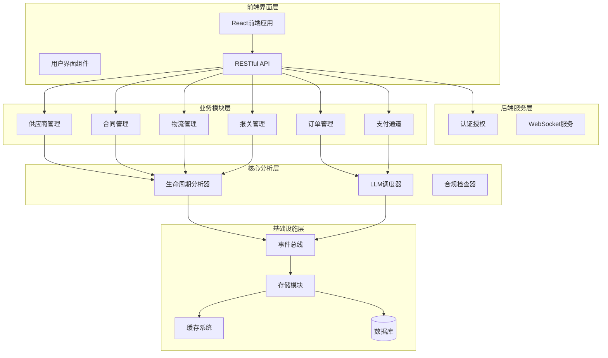
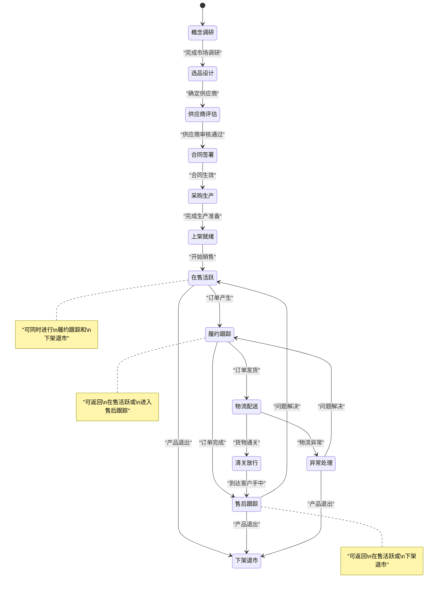
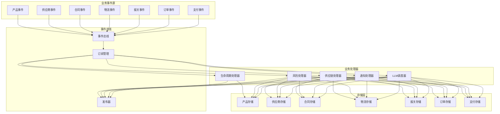
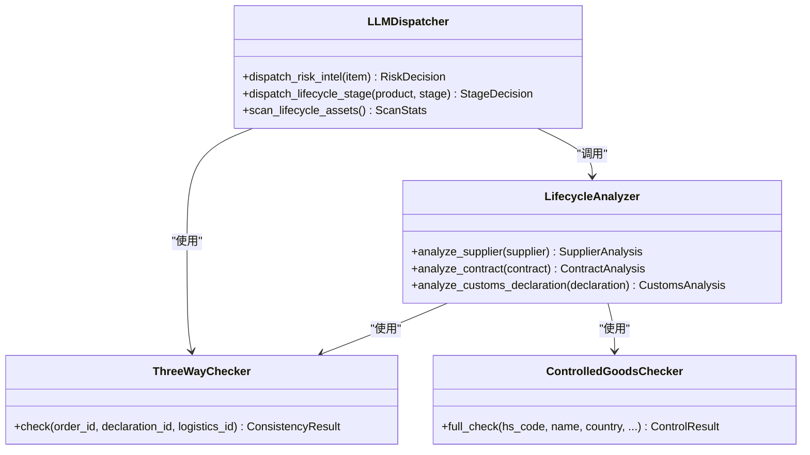
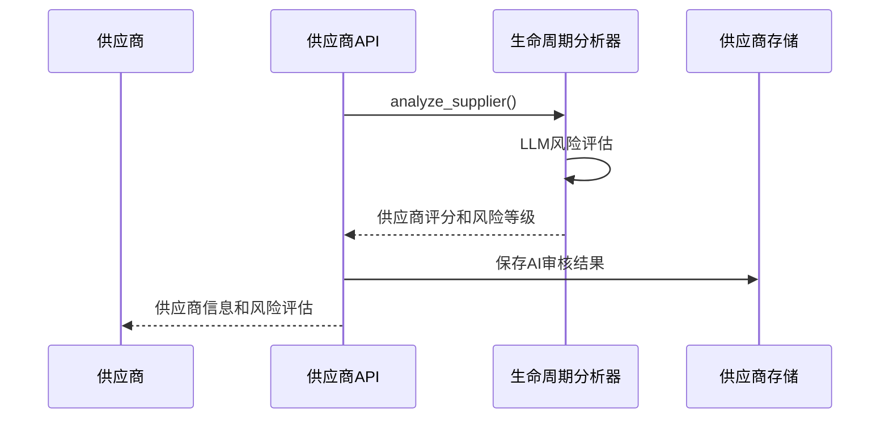
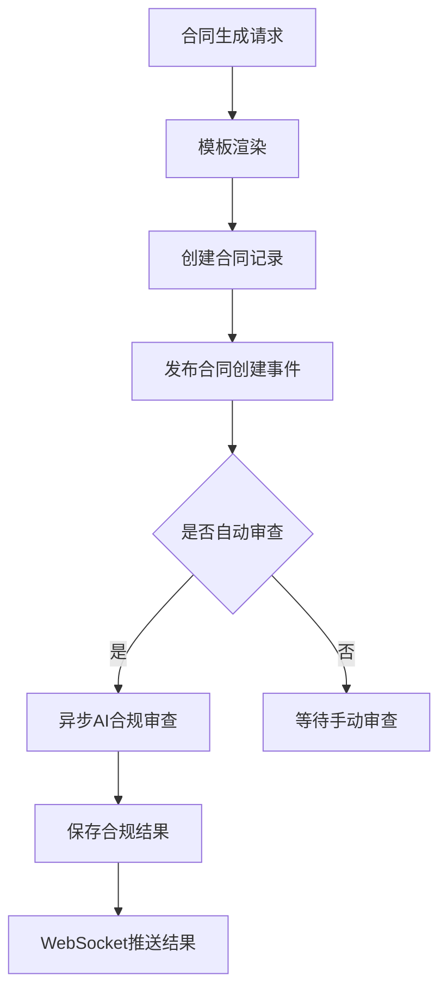
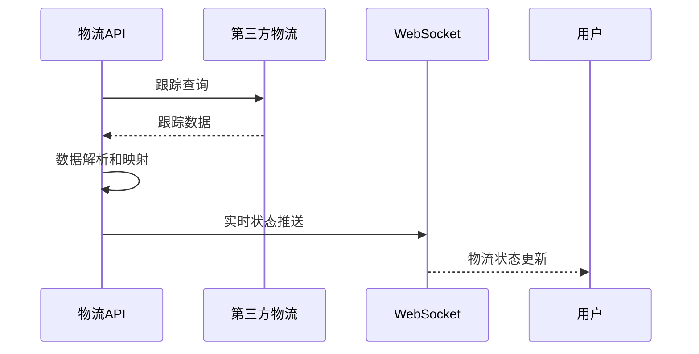
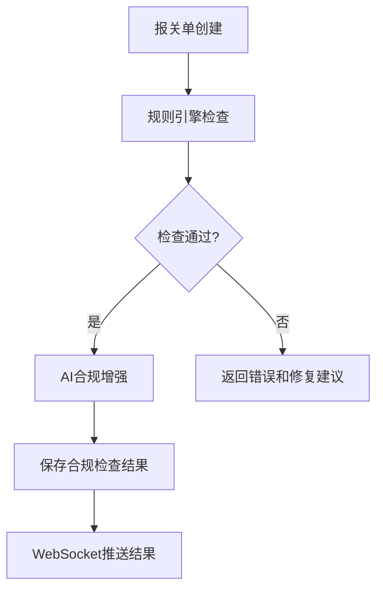
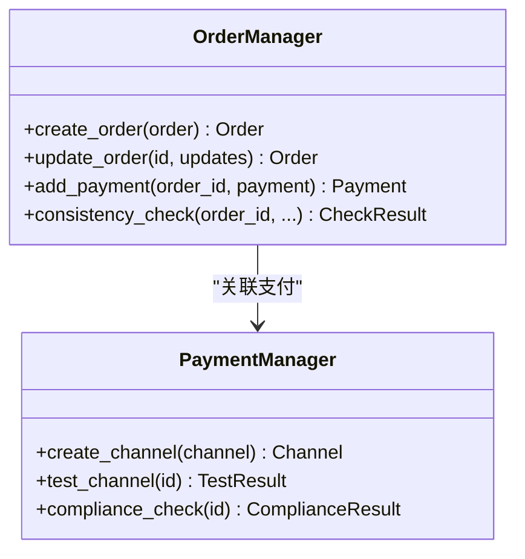
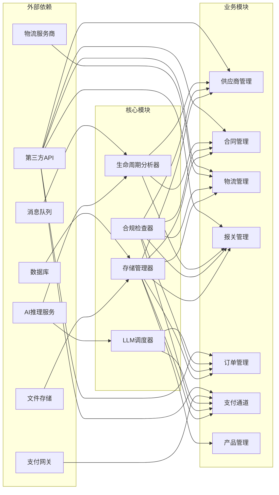

# 生命周期管理系统

<cite>
**本文档中引用的文件**
- [后端变更路线图.md](file://后端变更路线图.md)
- [lifecycle_analyzer.py](file://backend/app/core/lifecycle_analyzer.py)
- [llm_dispatcher.py](file://backend/app/core/llm_dispatcher.py)
- [contracts.py](file://backend/app/api/contracts.py)
- [suppliers.py](file://backend/app/api/suppliers.py)
- [logistics.py](file://backend/app/api/logistics.py)
- [customs.py](file://backend/app/api/customs.py)
- [orders.py](file://backend/app/api/orders.py)
- [payment_channels.py](file://backend/app/api/payment_channels.py)
- [test_lifecycle_knowledge.py](file://backend/tests/test_lifecycle_knowledge.py)
- [test_lifecycle_e2e.py](file://backend/tests/test_lifecycle_e2e.py)
- [products.py](file://backend/app/api/products.py)
- [product_storage.py](file://backend/app/core/product_storage.py)
- [analyze_products.py](file://backend/scripts/analyze_products.py)
- [lifecycle_events.md](file://backend/data/events/builtin/lifecycle_events.md)
- [stage_10_lifecycle.yaml](file://backend/data/stages/stage_10_lifecycle.yaml)
- [compliance_pipeline.yaml](file://backend/data/config/workflows/compliance_pipeline.yaml)
- [cert_expiry_handling.yaml](file://backend/data/config/workflows/cert_expiry_handling.yaml)
- [product_listing_compliance.yaml](file://backend/data/config/workflows/product_listing_compliance.yaml)
- [worker_check_cert_expiry.yaml](file://backend/data/prompts/worker_check_cert_expiry.yaml)
- [worker_compliance_enrichment.yaml](file://backend/data/prompts/worker_compliance_enrichment.yaml)
- [lifecycle.ts](file://frontend/src/lib/lifecycle.ts)
</cite>

## 更新摘要
**所做更改**
- 新增供应链管理模块（供应商、合同、支付通道）
- 新增物流管理模块（运输跟踪、第三方物流对接）
- 新增报关管理模块（报关单、关税计算、三单一致性检查）
- 新增销售订单管理模块
- 新增生命周期分析器和LLM调度器
- 扩展业务流程覆盖从概念到退市的完整生命周期

## 目录
1. [简介](#简介)
2. [项目结构](#项目结构)
3. [核心组件](#核心组件)
4. [架构概览](#架构概览)
5. [详细组件分析](#详细组件分析)
6. [新增业务模块](#新增业务模块)
7. [依赖关系分析](#依赖关系分析)
8. [性能考虑](#性能考虑)
9. [故障排除指南](#故障排除指南)
10. [结论](#结论)

## 简介

生命周期管理系统是一个基于事件驱动的智能产品生命周期管理平台，现已扩展为覆盖跨境电商业务全链条的综合管理系统。系统通过状态机模型、事件订阅机制和自动化工作流，实现了对产品从概念调研到退市的全生命周期智能化监控和管理。

**系统核心特点**：
- **状态机驱动**：基于明确的产品生命周期状态定义和转换规则
- **事件订阅机制**：支持精准、批量、全局和条件四种订阅方式
- **自动化工作流**：集成合规检查、证书管理、风险监控等自动化处理
- **多维度监控**：涵盖市场、合规、风险、运营等多个维度的实时监控
- **供应链一体化**：整合供应商管理、合同管理、物流跟踪、报关清关等功能
- **智能决策**：基于LLM的智能分析和风险处置调度

## 项目结构

系统采用分层架构设计，现已扩展为包含业务模块层、核心分析层和基础设施层的完整架构：

**图表来源**
- [后端变更路线图.md:1745-1785](file://后端变更路线图.md#L1745-L1785)
- [contracts.py](file://backend/app/api/contracts.py)
- [suppliers.py](file://backend/app/api/suppliers.py)
- [logistics.py](file://backend/app/api/logistics.py)
- [customs.py](file://backend/app/api/customs.py)
- [orders.py](file://backend/app/api/orders.py)
- [payment_channels.py](file://backend/app/api/payment_channels.py)

**章节来源**
- [后端变更路线图.md:1745-1785](file://后端变更路线图.md#L1745-L1785)

## 核心组件

### 产品生命周期状态机

系统定义了完整的产品生命周期状态机，现已扩展为包含供应链各环节的状态转换：

**图表来源**
- [后端变更路线图.md:1745-1785](file://后端变更路线图.md#L1745-L1785)

### 事件订阅机制

系统提供了灵活的事件订阅机制，支持四种不同的订阅模式：

| 订阅类型 | 描述 | 特点 |
|---------|------|------|
| 精准订阅 | 针对特定事件类型的精确监听 | 高效、低开销 |
| 批量订阅 | 同时订阅多个相关事件 | 简化处理逻辑 |
| 全局订阅 | 监听所有系统事件 | 完整性监控 |
| 条件订阅 | 基于预设条件的动态订阅 | 智能过滤

**章节来源**
- [后端变更路线图.md:1782-1785](file://后端变更路线图.md#L1782-L1785)

## 架构概览

系统采用事件驱动架构(Event-Driven Architecture)，现已扩展为包含多个业务模块的完整生态系统：

**图表来源**
- [lifecycle_analyzer.py](file://backend/app/core/lifecycle_analyzer.py)
- [llm_dispatcher.py](file://backend/app/core/llm_dispatcher.py)
- [contracts.py](file://backend/app/api/contracts.py)
- [suppliers.py](file://backend/app/api/suppliers.py)
- [logistics.py](file://backend/app/api/logistics.py)
- [customs.py](file://backend/app/api/customs.py)
- [orders.py](file://backend/app/api/orders.py)
- [payment_channels.py](file://backend/app/api/payment_channels.py)

## 详细组件分析

### 生命周期分析器

生命周期分析器是系统的核心AI组件，负责对供应链各环节进行智能分析：

**图表来源**
- [lifecycle_analyzer.py](file://backend/app/core/lifecycle_analyzer.py)
- [llm_dispatcher.py](file://backend/app/core/llm_dispatcher.py)

### 产品API接口

产品管理API提供了完整的生命周期管理接口，现已扩展为包含供应链管理：

| 接口 | 方法 | 功能描述 |
|------|------|----------|
| `/products` | GET | 获取产品列表 |
| `/products/{id}` | GET | 获取单个产品详情 |
| `/products` | POST | 创建新产品 |
| `/products/{id}` | PUT | 更新产品信息 |
| `/products/{id}/lifecycle` | GET | 获取产品生命周期状态 |
| `/products/{id}/lifecycle/transition` | POST | 触发生命周期状态转换 |
| `/products/{id}/events` | GET | 获取产品事件历史 |

**章节来源**
- [products.py](file://backend/app/api/products.py)
- [lifecycle_analyzer.py](file://backend/app/core/lifecycle_analyzer.py)

## 新增业务模块

### 供应商管理模块

供应商管理模块提供完整的供应商生命周期管理：

**图表来源**
- [suppliers.py](file://backend/app/api/suppliers.py)
- [lifecycle_analyzer.py](file://backend/app/core/lifecycle_analyzer.py)

### 合同管理模块

合同管理模块支持电子合同生成和合规审查：

**图表来源**
- [contracts.py](file://backend/app/api/contracts.py)
- [lifecycle_analyzer.py](file://backend/app/core/lifecycle_analyzer.py)

### 物流管理模块

物流管理模块集成多家物流服务商：

**图表来源**
- [logistics.py](file://backend/app/api/logistics.py)

### 报关管理模块

报关管理模块提供智能合规检查：

**图表来源**
- [customs.py](file://backend/app/api/customs.py)
- [lifecycle_analyzer.py](file://backend/app/core/lifecycle_analyzer.py)

### 订单管理模块

订单管理模块支持多平台订单集成：

**图表来源**
- [orders.py](file://backend/app/api/orders.py)
- [payment_channels.py](file://backend/app/api/payment_channels.py)

## 依赖关系分析

系统各组件间存在清晰的依赖关系，现已扩展为完整的供应链生态：

**图表来源**
- [product_storage.py](file://backend/app/core/product_storage.py)
- [lifecycle_events.md](file://backend/data/events/builtin/lifecycle_events.md)

**章节来源**
- [后端变更路线图.md:1745-1785](file://后端变更路线图.md#L1745-L1785)

## 性能考虑

系统在设计时充分考虑了性能优化，现已适应大规模供应链管理：

### 缓存策略
- **多级缓存**：本地缓存 + Redis缓存 + CDN缓存
- **智能过期**：基于访问频率的动态过期策略
- **预加载机制**：热点数据的预加载和预热

### 异步处理
- **事件异步化**：所有非关键操作异步执行
- **批处理优化**：大量相似操作的批处理处理
- **并发控制**：合理的并发度控制避免资源争用

### 数据优化
- **索引优化**：针对高频查询字段建立复合索引
- **分表分库**：大数据量场景下的水平分片
- **读写分离**：数据库读写分离提升吞吐量

## 故障排除指南

### 常见问题诊断

| 问题类型 | 症状 | 可能原因 | 解决方案 |
|----------|------|----------|----------|
| 状态转换失败 | 产品无法从一个状态切换到另一个状态 | 转换规则不匹配或前置条件未满足 | 检查转换规则配置和前置条件 |
| 事件订阅失效 | 订阅的事件没有触发回调 | 订阅配置错误或事件类型不匹配 | 验证订阅配置和事件类型映射 |
| 性能下降 | 系统响应时间增加 | 缓存命中率低或数据库查询慢 | 优化缓存策略和数据库索引 |
| 数据不一致 | 不同模块显示的数据不一致 | 并发更新冲突或事务处理异常 | 检查并发控制和事务边界 |
| LLM调用失败 | AI分析不可用 | 推理服务不可达或配置错误 | 检查AI服务配置和网络连接 |
| 供应链中断 | 供应商或物流异常 | 第三方服务故障或配置错误 | 验证第三方API配置和服务状态 |

### 调试工具

系统提供了完善的调试和监控工具：

- **日志分析工具**：实时查看系统运行日志
- **性能监控面板**：监控系统关键性能指标
- **事件追踪器**：追踪事件的完整生命周期
- **状态可视化**：直观展示产品状态变化
- **供应链监控**：实时监控供应商和物流状态

**章节来源**
- [test_lifecycle_knowledge.py](file://backend/tests/test_lifecycle_knowledge.py)
- [test_lifecycle_e2e.py](file://backend/tests/test_lifecycle_e2e.py)

## 结论

生命周期管理系统通过其先进的架构设计和丰富的功能特性，现已成为覆盖跨境电商业务全链条的综合管理平台。系统的重大扩展包括：

1. **完整性**：覆盖产品从概念到退市的全生命周期，以及供应链各环节
2. **智能化**：基于AI的智能分析和预测能力，包括供应商评估、合同审查、报关检查
3. **自动化**：高度自动化的合规检查和风险监控，支持LLM驱动的智能决策
4. **可扩展性**：模块化设计支持功能扩展和定制，现已支持6个核心业务模块
5. **可靠性**：完善的错误处理和故障恢复机制，支持大规模并发处理
6. **集成性**：深度集成第三方服务，包括物流、支付、AI推理等

该系统不仅满足了当前的业务需求，还为未来的功能扩展和技术演进奠定了坚实的基础。通过持续的优化和完善，系统将在跨境电商领域发挥越来越重要的作用，为企业提供从供应链到销售的全方位智能化管理解决方案。