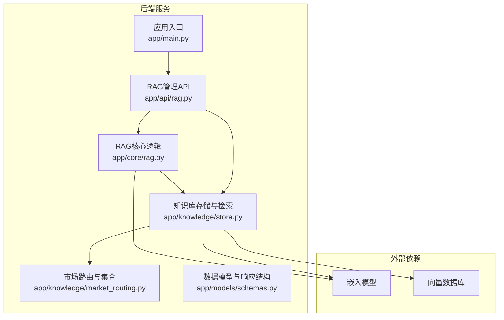
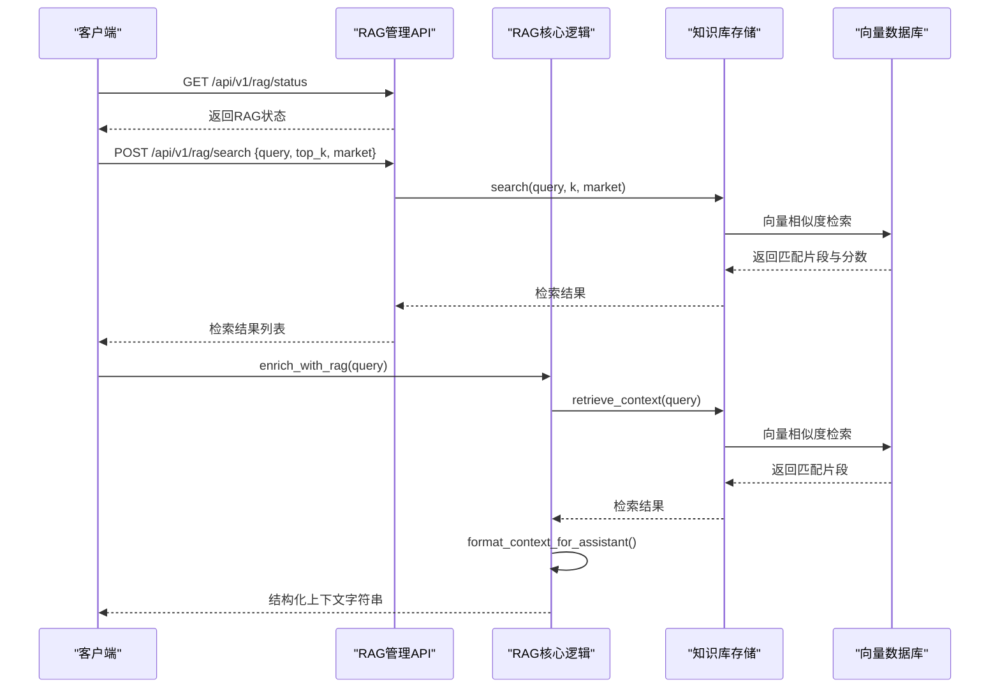
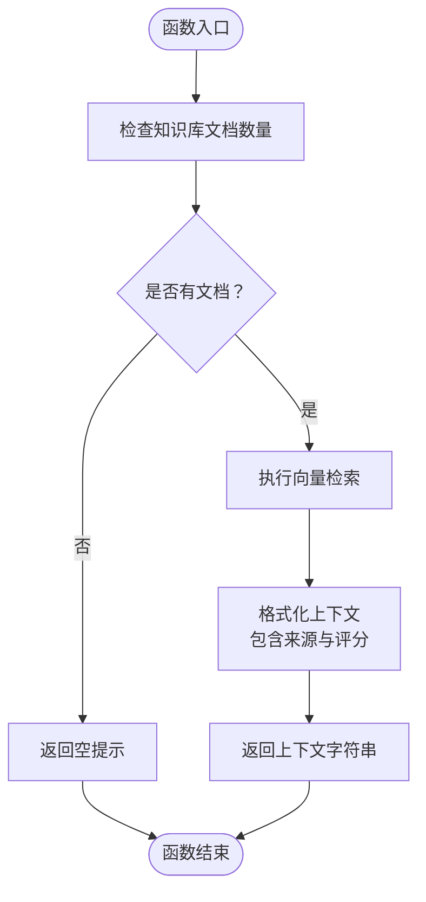
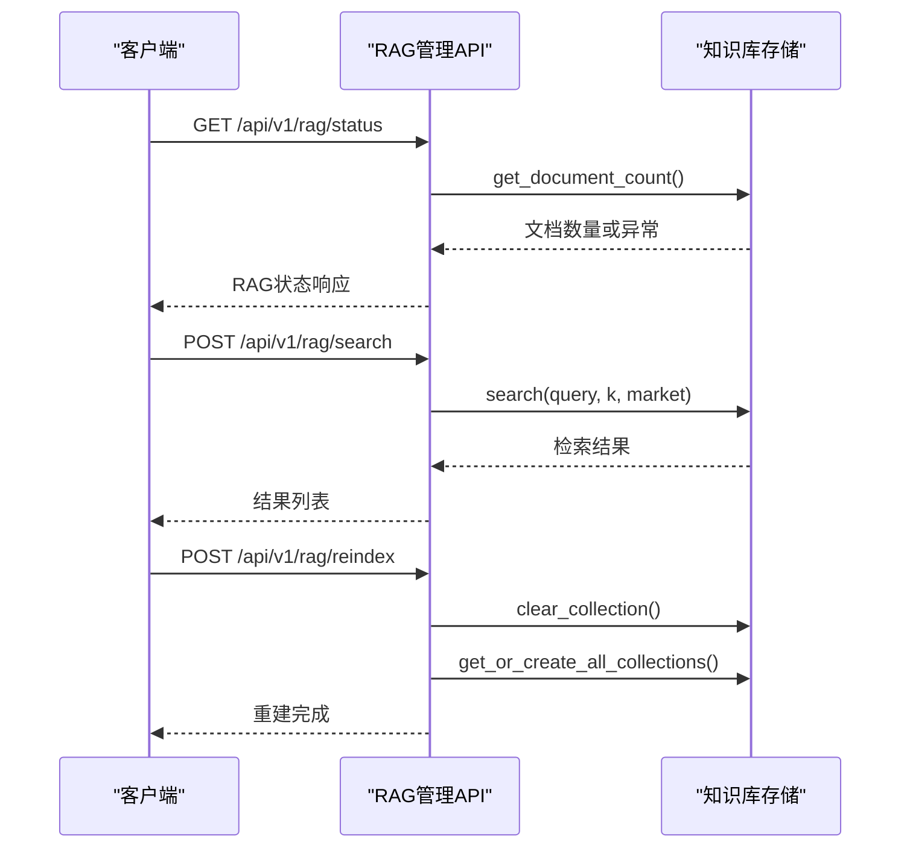
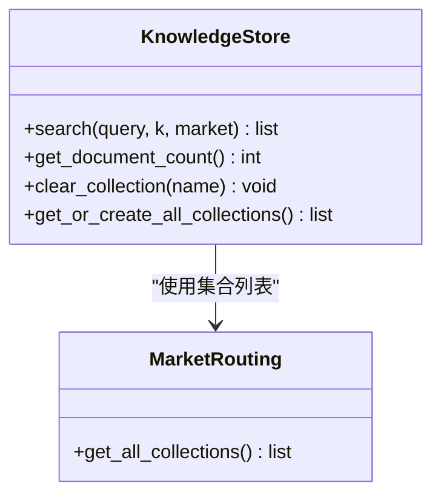
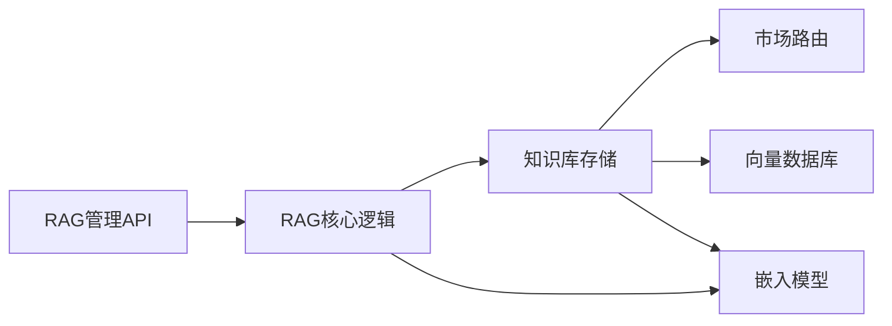

# RAG增强生成机制

<cite>
**本文引用的文件**
- [backend/app/core/rag.py](file://backend/app/core/rag.py)
- [backend/app/api/rag.py](file://backend/app/api/rag.py)
- [backend/app/knowledge/store.py](file://backend/app/knowledge/store.py)
- [backend/app/knowledge/market_routing.py](file://backend/app/knowledge/market_routing.py)
- [backend/app/models/schemas.py](file://backend/app/models/schemas.py)
- [backend/app/main.py](file://backend/app/main.py)
- [backend/requirements.txt](file://backend/requirements.txt)
- [README.md](file://README.md)
- [后端api.md](file://后端api.md)
</cite>

## 目录
1. [简介](#简介)
2. [项目结构](#项目结构)
3. [核心组件](#核心组件)
4. [架构总览](#架构总览)
5. [详细组件分析](#详细组件分析)
6. [依赖关系分析](#依赖关系分析)
7. [性能考虑](#性能考虑)
8. [故障排查指南](#故障排查指南)
9. [结论](#结论)
10. [附录](#附录)

## 简介
本文件面向避风港平台的RAG（检索增强生成）机制，系统性阐述从“查询理解、语义检索、上下文提取”到“生成控制”的完整工作流程；详解检索增强策略（相关性评分、上下文窗口与信息过滤）、提示工程最佳实践（系统提示设计、用户查询改写、响应格式化）、生成控制（温度、最大令牌数、输出质量控制）、性能优化（缓存、批量与并发）、监控与调试方法，以及完整的API接口文档与集成示例。

## 项目结构
RAG能力由后端核心模块与知识库子系统协同实现，前端通过API进行调用。关键目录与文件如下：
- 核心RAG逻辑：backend/app/core/rag.py
- RAG管理API：backend/app/api/rag.py
- 知识库存储与检索：backend/app/knowledge/store.py
- 市场路由与集合管理：backend/app/knowledge/market_routing.py
- 数据模型与响应结构：backend/app/models/schemas.py
- 应用入口与路由注册：backend/app/main.py
- 依赖与运行环境：backend/requirements.txt
- 项目说明与接口文档：README.md、后端api.md

**图表来源**
- [backend/app/main.py](file://backend/app/main.py)
- [backend/app/api/rag.py](file://backend/app/api/rag.py)
- [backend/app/core/rag.py](file://backend/app/core/rag.py)
- [backend/app/knowledge/store.py](file://backend/app/knowledge/store.py)
- [backend/app/knowledge/market_routing.py](file://backend/app/knowledge/market_routing.py)

**章节来源**
- [backend/app/main.py](file://backend/app/main.py)
- [backend/app/api/rag.py](file://backend/app/api/rag.py)
- [backend/app/core/rag.py](file://backend/app/core/rag.py)
- [backend/app/knowledge/store.py](file://backend/app/knowledge/store.py)
- [backend/app/knowledge/market_routing.py](file://backend/app/knowledge/market_routing.py)
- [backend/app/models/schemas.py](file://backend/app/models/schemas.py)
- [README.md](file://README.md)
- [后端api.md](file://后端api.md)

## 核心组件
- 查询理解与检索增强（retrieve_context、enrich_with_rag）：负责对输入查询进行向量检索，返回高相关度的法规文本块，并格式化为可注入给大模型的上下文字符串。
- 上下文格式化（format_context_for_assistant）：将检索结果按统一格式拼接，包含来源链接、生效日期等元信息，便于后续生成阶段引用。
- RAG管理API（/api/v1/rag/status、/api/v1/rag/search、/api/v1/rag/reindex）：提供状态查询、语义搜索与索引重建能力，支持按市场维度检索。
- 知识库存储与检索（search、get_document_count、clear_collection、get_or_create_all_collections）：封装向量检索与集合管理，支持多市场集合隔离与计数统计。
- 市场路由（get_all_collections）：提供可用集合列表，支撑按区域/市场的检索范围控制。
- 数据模型（RAGStatusResponse、RAGSearchRequest、RAGSearchResult）：定义API请求与响应结构，确保前后端契约一致。

**章节来源**
- [backend/app/core/rag.py](file://backend/app/core/rag.py)
- [backend/app/api/rag.py](file://backend/app/api/rag.py)
- [backend/app/knowledge/store.py](file://backend/app/knowledge/store.py)
- [backend/app/knowledge/market_routing.py](file://backend/app/knowledge/market_routing.py)
- [backend/app/models/schemas.py](file://backend/app/models/schemas.py)

## 架构总览
RAG系统采用“检索+格式化+注入”的流水线式架构。查询经由API进入，核心RAG模块调用知识库存储进行向量检索，随后格式化为结构化上下文，最终注入到下游生成流程（如合规检查、风险摘要等）。系统支持多市场集合隔离与索引重建，具备基础健康状态监控。

**图表来源**
- [backend/app/api/rag.py](file://backend/app/api/rag.py)
- [backend/app/core/rag.py](file://backend/app/core/rag.py)
- [backend/app/knowledge/store.py](file://backend/app/knowledge/store.py)

## 详细组件分析

### 组件A：RAG核心逻辑（查询理解与上下文格式化）
职责与流程：
- 输入：用户查询字符串
- 处理：调用检索函数获取top-k相关片段；若无文档则返回空提示；否则将片段格式化为带来源与评分的上下文块
- 输出：可用于注入到系统提示或直接返回的上下文字符串

关键点：
- 相关性评分：检索结果包含分数字段，用于排序与过滤
- 上下文窗口管理：通过top_k控制返回片段数量，避免超出上下文长度
- 信息过滤：优先保留含有效元信息（来源、生效日期）的片段，提升可信度

**图表来源**
- [backend/app/core/rag.py](file://backend/app/core/rag.py)

**章节来源**
- [backend/app/core/rag.py](file://backend/app/core/rag.py)

### 组件B：RAG管理API（状态、搜索、重建索引）
职责与流程：
- /api/v1/rag/status：查询RAG系统状态，包含集合列表、文档总数、嵌入模型、持久化路径与健康状态
- /api/v1/rag/search：语义搜索，支持指定市场与top_k，返回结构化结果列表
- /api/v1/rag/reindex：重建索引，清理并重新创建所有市场集合

关键点：
- 超时保护：文档计数获取带超时，避免embedding模型加载阻塞
- 市场维度：支持按市场过滤检索范围
- 错误处理：异常统一包装为HTTP 500错误

**图表来源**
- [backend/app/api/rag.py](file://backend/app/api/rag.py)
- [backend/app/knowledge/store.py](file://backend/app/knowledge/store.py)

**章节来源**
- [backend/app/api/rag.py](file://backend/app/api/rag.py)
- [backend/app/knowledge/store.py](file://backend/app/knowledge/store.py)

### 组件C：知识库存储与检索（向量检索与集合管理）
职责与流程：
- search(query, k, market)：执行向量相似度检索，返回包含内容、来源、市场、分数与元数据的结果
- get_document_count()：统计知识库文档总数
- clear_collection()：清空指定集合
- get_or_create_all_collections()：初始化所有市场集合

关键点：
- 多集合隔离：按市场维度组织集合，支持独立检索与索引
- 元数据保留：检索结果包含metadata，便于生成阶段引用

**图表来源**
- [backend/app/knowledge/store.py](file://backend/app/knowledge/store.py)
- [backend/app/knowledge/market_routing.py](file://backend/app/knowledge/market_routing.py)

**章节来源**
- [backend/app/knowledge/store.py](file://backend/app/knowledge/store.py)
- [backend/app/knowledge/market_routing.py](file://backend/app/knowledge/market_routing.py)

### 组件D：数据模型与响应结构
- RAGStatusResponse：系统状态响应，包含集合列表、文档总数、嵌入模型、持久化路径与状态
- RAGSearchRequest：搜索请求，包含查询、top_k与市场
- RAGSearchResult：搜索结果，包含内容、来源、市场、分数与元数据

**章节来源**
- [backend/app/models/schemas.py](file://backend/app/models/schemas.py)

## 依赖关系分析
- 组件耦合与内聚：
  - RAG核心逻辑与知识库存储强耦合，但通过统一的search接口保持内聚
  - API层仅负责编排与错误处理，不直接参与检索细节
- 外部依赖：
  - 嵌入模型：用于向量化与相似度计算
  - 向量数据库：Chroma持久化存储向量与元数据
- 接口契约：
  - API层与模型层通过Pydantic数据结构解耦，保证前后端一致性

**图表来源**
- [backend/app/api/rag.py](file://backend/app/api/rag.py)
- [backend/app/core/rag.py](file://backend/app/core/rag.py)
- [backend/app/knowledge/store.py](file://backend/app/knowledge/store.py)
- [backend/app/knowledge/market_routing.py](file://backend/app/knowledge/market_routing.py)

**章节来源**
- [backend/app/api/rag.py](file://backend/app/api/rag.py)
- [backend/app/core/rag.py](file://backend/app/core/rag.py)
- [backend/app/knowledge/store.py](file://backend/app/knowledge/store.py)
- [backend/app/knowledge/market_routing.py](file://backend/app/knowledge/market_routing.py)

## 性能考虑
- 缓存策略
  - 检索结果缓存：对高频查询结果进行短期缓存，减少重复向量检索开销
  - 嵌入模型预热：在启动阶段加载嵌入模型，避免首次请求延迟
- 批量处理
  - 批量检索：对多个查询进行批处理，提升吞吐
  - 批量索引：重建索引时分批写入，降低内存峰值
- 并发控制
  - 文档计数获取超时保护：防止阻塞主线程
  - 异步任务：将耗时操作（如索引重建）放入后台任务队列
- 上下文窗口管理
  - top_k动态调整：根据模型上下文长度与片段平均长度，动态选择合适的k值
  - 分段截断：对过长片段进行摘要或截断，确保总长度不超过阈值

[本节为通用性能建议，无需特定文件引用]

## 故障排查指南
- 状态查询异常
  - 现象：/api/v1/rag/status返回degraded或error
  - 排查：检查嵌入模型是否加载成功、Chroma持久化路径是否存在、集合是否正确初始化
- 检索无结果
  - 现象：/api/v1/rag/search返回空列表
  - 排查：确认知识库是否已导入文档、集合是否为空、查询是否包含有效关键词
- 索引重建失败
  - 现象：/api/v1/rag/reindex报错
  - 排查：检查磁盘空间、Chroma权限、集合名称合法性
- 生成阶段上下文过长
  - 现象：生成被截断或质量下降
  - 排查：降低top_k、精简片段、启用摘要策略

**章节来源**
- [backend/app/api/rag.py](file://backend/app/api/rag.py)
- [backend/app/knowledge/store.py](file://backend/app/knowledge/store.py)

## 结论
避风港平台的RAG机制以简洁稳定的架构实现了从查询到上下文注入的闭环：通过向量检索与结构化格式化，为生成阶段提供高质量、可溯源的参考信息；通过API层的状态监控与索引管理，保障系统可观测与可维护性。建议在生产环境中结合缓存、批量与并发策略进一步优化性能，并完善日志与指标体系以支撑持续改进。

[本节为总结性内容，无需特定文件引用]

## 附录

### API接口文档
- 获取RAG系统状态
  - 方法：GET
  - 路径：/api/v1/rag/status
  - 响应：RAGStatusResponse
- RAG语义搜索
  - 方法：POST
  - 路径：/api/v1/rag/search
  - 请求体：RAGSearchRequest
  - 响应：List[RAGSearchResult]
- 重建RAG索引
  - 方法：POST
  - 路径：/api/v1/rag/reindex
  - 响应：标准HTTP 200/500

**章节来源**
- [backend/app/api/rag.py](file://backend/app/api/rag.py)
- [backend/app/models/schemas.py](file://backend/app/models/schemas.py)
- [后端api.md](file://后端api.md)

### 集成示例（伪代码）
- 查询理解与上下文注入
  - 步骤：调用enrich_with_rag(query)获取上下文字符串，将其拼接到系统提示中，再触发生成流程
- 语义搜索集成
  - 步骤：构造RAGSearchRequest，调用POST /api/v1/rag/search，解析返回的RAGSearchResult列表
- 系统健康检查
  - 步骤：定时调用GET /api/v1/rag/status，记录状态与文档总数，异常时告警

**章节来源**
- [backend/app/core/rag.py](file://backend/app/core/rag.py)
- [backend/app/api/rag.py](file://backend/app/api/rag.py)

### 提示工程最佳实践
- 系统提示设计
  - 明确角色与约束：限定回答范围为“基于检索到的法规信息”，避免臆测
  - 引用格式：要求在结论后列出引用条目，格式与检索结果一致
- 用户查询改写
  - 将口语化表达转化为结构化关键词，提升向量检索命中率
- 响应格式化
  - 固定模板：先总结结论，再列出引用来源，最后标注相关度

[本节为通用实践建议，无需特定文件引用]

### 生成控制机制
- 温度调节：在生成阶段设置较低温度以提升事实准确性
- 最大令牌数限制：根据上下文长度与目标输出长度设定上限，避免截断
- 输出质量控制：引入后处理规则（如去重、摘要、引用校验）

[本节为通用实践建议，无需特定文件引用]