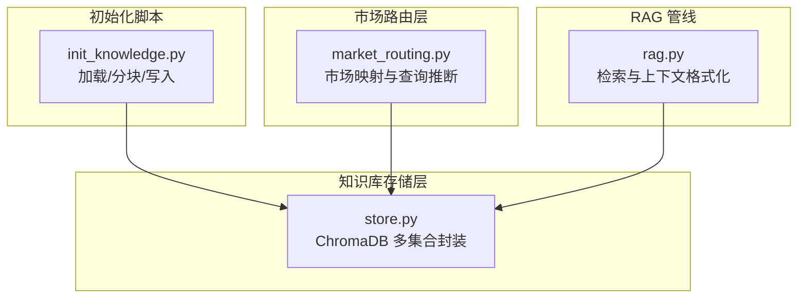
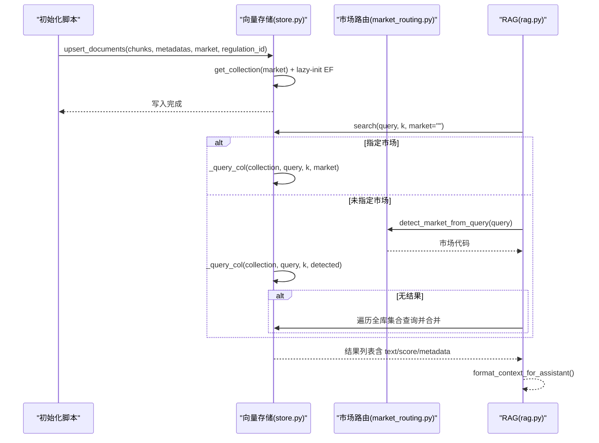
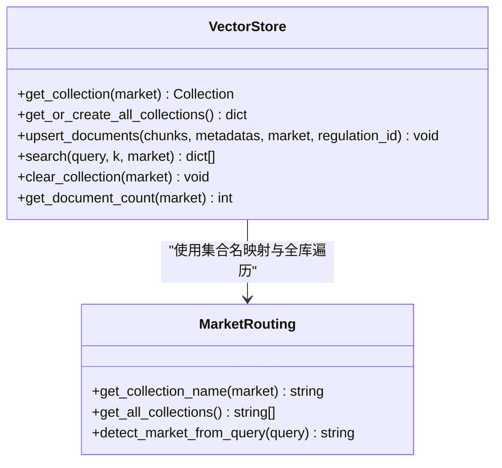
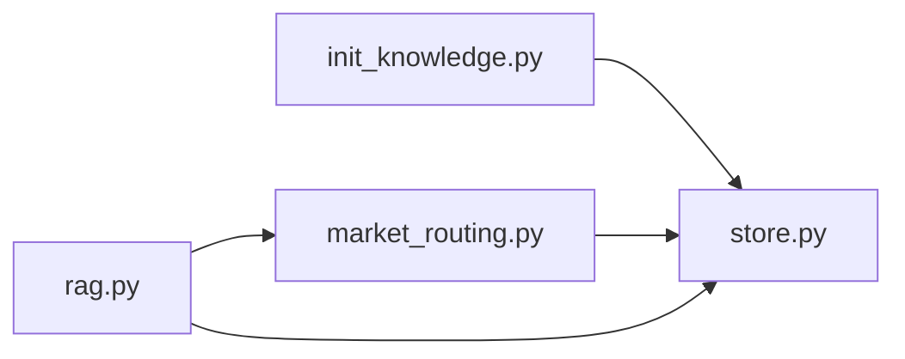

# 向量检索系统

<cite>
**本文引用的文件**
- [backend/app/knowledge/store.py](file://backend/app/knowledge/store.py)
- [backend/app/knowledge/market_routing.py](file://backend/app/knowledge/market_routing.py)
- [backend/app/core/rag.py](file://backend/app/core/rag.py)
- [backend/scripts/init_knowledge.py](file://backend/scripts/init_knowledge.py)
</cite>

## 目录
1. [简介](#简介)
2. [项目结构](#项目结构)
3. [核心组件](#核心组件)
4. [架构总览](#架构总览)
5. [详细组件分析](#详细组件分析)
6. [依赖关系分析](#依赖关系分析)
7. [性能考虑](#性能考虑)
8. [故障排查指南](#故障排查指南)
9. [结论](#结论)
10. [附录](#附录)

## 简介
本文件面向避风港平台的向量检索系统，聚焦基于 ChromaDB 的多集合（按市场划分）向量存储设计与实现，涵盖嵌入函数配置、索引优化、文档向量化流程、语义搜索算法、懒加载机制、性能优化策略以及 API 使用示例与最佳实践。系统以“多集合 + 本地嵌入”为核心，确保不同市场的法规知识相互隔离且高效检索。

## 项目结构
围绕向量检索的关键模块分布如下：
- 知识库存储层：ChromaDB 向量存储与按市场分集合的封装
- 市场路由层：市场代码到集合名的映射与查询市场推断
- RAG 管线：检索上下文生成与提示格式化
- 初始化脚本：法规文档加载、分块、写入向量库

图表来源
- [backend/app/knowledge/store.py:1-227](file://backend/app/knowledge/store.py#L1-L227)
- [backend/app/knowledge/market_routing.py:1-77](file://backend/app/knowledge/market_routing.py#L1-L77)
- [backend/app/core/rag.py:1-59](file://backend/app/core/rag.py#L1-L59)
- [backend/scripts/init_knowledge.py:1-129](file://backend/scripts/init_knowledge.py#L1-L129)

章节来源
- [backend/app/knowledge/store.py:1-227](file://backend/app/knowledge/store.py#L1-L227)
- [backend/app/knowledge/market_routing.py:1-77](file://backend/app/knowledge/market_routing.py#L1-L77)
- [backend/app/core/rag.py:1-59](file://backend/app/core/rag.py#L1-L59)
- [backend/scripts/init_knowledge.py:1-129](file://backend/scripts/init_knowledge.py#L1-L129)

## 核心组件
- ChromaDB 多集合向量存储：按市场划分集合，独立管理与查询，提升检索精度与隔离性
- 嵌入函数：paraphrase-multilingual-MiniLM-L12-v2，SentenceTransformer 封装，本地文件模式，避免网络依赖
- 市场路由：市场代码到集合名映射，查询文本市场推断
- RAG 检索管线：检索上下文、格式化引用与来源
- 初始化脚本：加载法规文档、分块、幂等 upsert 写入

章节来源
- [backend/app/knowledge/store.py:23-78](file://backend/app/knowledge/store.py#L23-L78)
- [backend/app/knowledge/market_routing.py:19-45](file://backend/app/knowledge/market_routing.py#L19-L45)
- [backend/app/core/rag.py:10-18](file://backend/app/core/rag.py#L10-L18)
- [backend/scripts/init_knowledge.py:28-67](file://backend/scripts/init_knowledge.py#L28-L67)

## 架构总览
系统采用“写入—存储—检索—格式化”的链路，核心要点：
- 写入：初始化脚本将法规文档分块并 upsert 到指定市场集合
- 存储：ChromaDB 持久化客户端，集合内嵌入由 SentenceTransformer 自动生成
- 检索：按市场或自动推断市场进行查询，必要时全库聚合排序
- 上下文：将检索结果格式化为带来源的提示上下文

图表来源
- [backend/scripts/init_knowledge.py:56-63](file://backend/scripts/init_knowledge.py#L56-L63)
- [backend/app/knowledge/store.py:81-104](file://backend/app/knowledge/store.py#L81-L104)
- [backend/app/knowledge/store.py:127-158](file://backend/app/knowledge/store.py#L127-L158)
- [backend/app/knowledge/market_routing.py:48-76](file://backend/app/knowledge/market_routing.py#L48-L76)
- [backend/app/core/rag.py:10-18](file://backend/app/core/rag.py#L10-L18)

## 详细组件分析

### 组件一：ChromaDB 多集合向量存储（store.py）
- 设计原则
  - 多集合架构：按市场划分集合，实现知识隔离与独立扩展
  - 懒加载：客户端与嵌入函数仅在首次使用时初始化，降低启动成本
  - 自动嵌入：集合创建时绑定 SentenceTransformer 嵌入函数，无需外部生成
  - 容错降级：查询异常返回空结果，不影响主流程
- 关键实现
  - 客户端懒初始化：PersistentClient + 禁用遥测
  - 集合懒创建：get_or_create_collection + metadata（HNSW cos 空间）
  - 文档写入：upsert_documents 幂等，ID 由 regulation_id 与索引组合
  - 语义搜索：search 支持指定市场或自动推断，必要时全库聚合
  - 结果转换：_query_col 将 distances 转换为相似度 score，并透传 metadata
- 性能与可靠性
  - 按需加载：集合与 EF 懒初始化，避免冷启动下载与连接
  - 异常安全：查询异常捕获并回退为空结果
  - 排序稳定：按 score 降序返回

图表来源
- [backend/app/knowledge/store.py:54-78](file://backend/app/knowledge/store.py#L54-L78)
- [backend/app/knowledge/store.py:81-104](file://backend/app/knowledge/store.py#L81-L104)
- [backend/app/knowledge/store.py:127-158](file://backend/app/knowledge/store.py#L127-L158)
- [backend/app/knowledge/market_routing.py:31-45](file://backend/app/knowledge/market_routing.py#L31-L45)

章节来源
- [backend/app/knowledge/store.py:43-78](file://backend/app/knowledge/store.py#L43-L78)
- [backend/app/knowledge/store.py:81-104](file://backend/app/knowledge/store.py#L81-L104)
- [backend/app/knowledge/store.py:127-192](file://backend/app/knowledge/store.py#L127-L192)

### 组件二：市场路由（market_routing.py）
- 功能概述
  - 市场代码到集合名映射，支持默认集合兼容旧数据
  - 查询文本市场推断，优先匹配特定关键词，其次通用关键词，最后回退 EU
- 实现要点
  - 映射表包含 EU/DE/US/JP/KR 五类集合
  - detect_market_from_query 对输入文本做关键词匹配，返回市场代码
- 使用场景
  - RAG 检索时若未显式指定市场，将依据查询文本自动选择集合

章节来源
- [backend/app/knowledge/market_routing.py:19-45](file://backend/app/knowledge/market_routing.py#L19-L45)
- [backend/app/knowledge/market_routing.py:48-76](file://backend/app/knowledge/market_routing.py#L48-L76)

### 组件三：RAG 检索管线（rag.py）
- 功能概述
  - retrieve_context：调用向量存储检索 top-k 相关块
  - format_context_for_assistant：将检索结果格式化为带来源与评分的提示上下文
  - enrich_with_rag：完整 RAG 流程封装
- 行为特性
  - 当知识库为空时直接返回空结果，避免无效检索
  - 输出包含法规名称、来源链接、生效日期与文本块

章节来源
- [backend/app/core/rag.py:10-18](file://backend/app/core/rag.py#L10-L18)
- [backend/app/core/rag.py:21-52](file://backend/app/core/rag.py#L21-L52)
- [backend/app/core/rag.py:55-58](file://backend/app/core/rag.py#L55-L58)

### 组件四：初始化脚本（init_knowledge.py）
- 功能概述
  - 加载指定市场下的法规文档，进行分块与元数据提取
  - 调用 upsert_documents 幂等写入向量库，支持重置与预览
- 关键流程
  - 解析参数：目标市场、是否重置、是否预览、是否先拉取文档
  - 遍历市场执行初始化，统计写入数量与全库总数
- 使用建议
  - 首次运行会自动下载本地嵌入模型（约 120MB）
  - 支持按市场增量初始化，避免全量重建

章节来源
- [backend/scripts/init_knowledge.py:70-124](file://backend/scripts/init_knowledge.py#L70-L124)

## 依赖关系分析
- store.py 依赖 market_routing.py 获取集合名与全库集合列表
- rag.py 依赖 store.py 的 search 与 get_document_count
- init_knowledge.py 依赖 loader（未在本节展开）与 store.py 的 upsert_documents/clear_collection/get_document_count

图表来源
- [backend/scripts/init_knowledge.py:23-25](file://backend/scripts/init_knowledge.py#L23-L25)
- [backend/app/knowledge/store.py:18-19](file://backend/app/knowledge/store.py#L18-L19)
- [backend/app/core/rag.py](file://backend/app/core/rag.py#L7)

章节来源
- [backend/scripts/init_knowledge.py:23-25](file://backend/scripts/init_knowledge.py#L23-L25)
- [backend/app/knowledge/store.py:18-19](file://backend/app/knowledge/store.py#L18-L19)
- [backend/app/core/rag.py](file://backend/app/core/rag.py#L7)

## 性能考虑
- 懒加载策略
  - 客户端与嵌入函数仅在首次使用时初始化，减少启动时延与资源占用
- 索引与距离度量
  - 集合元数据设置 HNSW cos 空间，适合余弦相似度检索
- 查询优化
  - 若集合为空，直接返回空结果，避免无效查询
  - 自动推断失败时回退全库查询，保证召回
- 结果排序
  - 将 ChromaDB 返回的欧氏距离转换为相似度 score，并按分数降序返回
- 批量写入
  - upsert_documents 以批处理方式写入，避免频繁 IO
- 缓存与降级
  - 查询异常返回空结果，不中断主流程，具备容错能力

章节来源
- [backend/app/knowledge/store.py:43-51](file://backend/app/knowledge/store.py#L43-L51)
- [backend/app/knowledge/store.py:59-63](file://backend/app/knowledge/store.py#L59-L63)
- [backend/app/knowledge/store.py:161-173](file://backend/app/knowledge/store.py#L161-L173)
- [backend/app/knowledge/store.py:182-184](file://backend/app/knowledge/store.py#L182-L184)

## 故障排查指南
- ChromaDB 查询异常
  - 现象：search 返回空结果
  - 排查：检查集合是否存在、集合内是否有文档、日志中是否有 warning
  - 处理：确认 init_knowledge 是否成功写入；必要时重置并重新初始化
- 嵌入模型加载失败
  - 现象：首次使用时模型下载或加载报错
  - 排查：确认 local_files_only 模式下本地缓存可用
  - 处理：确保网络代理或镜像配置允许本地文件访问
- 市场推断不准确
  - 现象：检索范围过大或过小
  - 排查：检查 detect_market_from_query 的关键词匹配逻辑
  - 处理：在查询中明确指定市场代码，或调整关键词规则
- 全库查询性能下降
  - 现象：未指定市场时全库聚合耗时较长
  - 排查：确认各集合文档数量与查询复杂度
  - 处理：优先提供市场参数；必要时拆分更细粒度集合

章节来源
- [backend/app/knowledge/store.py:161-173](file://backend/app/knowledge/store.py#L161-L173)
- [backend/app/knowledge/market_routing.py:48-76](file://backend/app/knowledge/market_routing.py#L48-L76)

## 结论
避风港平台的向量检索系统通过“多集合 + 本地嵌入 + 懒加载 + 容错降级”的设计，在保证检索准确性的同时兼顾了性能与稳定性。结合市场路由与 RAG 管线，系统能够高效地从多市场法规知识库中检索相关信息并格式化为可直接使用的提示上下文。

## 附录

### API 使用示例与最佳实践
- 写入知识库
  - 使用初始化脚本按市场批量写入，支持重置与预览
  - 关键路径：[backend/scripts/init_knowledge.py:56-63](file://backend/scripts/init_knowledge.py#L56-L63)
- 检索相关法规
  - 指定市场检索：search(query, k, market)
  - 自动推断检索：search(query, k) 由内部自动推断市场
  - 全库兜底：当推断无结果时，系统会遍历全库并按 score 排序
  - 关键路径：[backend/app/knowledge/store.py:127-158](file://backend/app/knowledge/store.py#L127-L158)
- 格式化上下文
  - retrieve_context + format_context_for_assistant 生成带来源与评分的提示块
  - 关键路径：[backend/app/core/rag.py:10-18](file://backend/app/core/rag.py#L10-L18), [backend/app/core/rag.py:21-52](file://backend/app/core/rag.py#L21-L52)
- 最佳实践
  - 首次运行前确保本地嵌入模型已就绪（init_knowledge 会在首次运行时下载）
  - 在查询中尽量提供明确的市场代码，以减少全库扫描
  - 定期清理与重建：使用 --reset 清空后重建，避免陈旧数据影响检索质量
  - 关键路径：[backend/scripts/init_knowledge.py:51-53](file://backend/scripts/init_knowledge.py#L51-L53), [backend/scripts/init_knowledge.py:117-124](file://backend/scripts/init_knowledge.py#L117-L124)