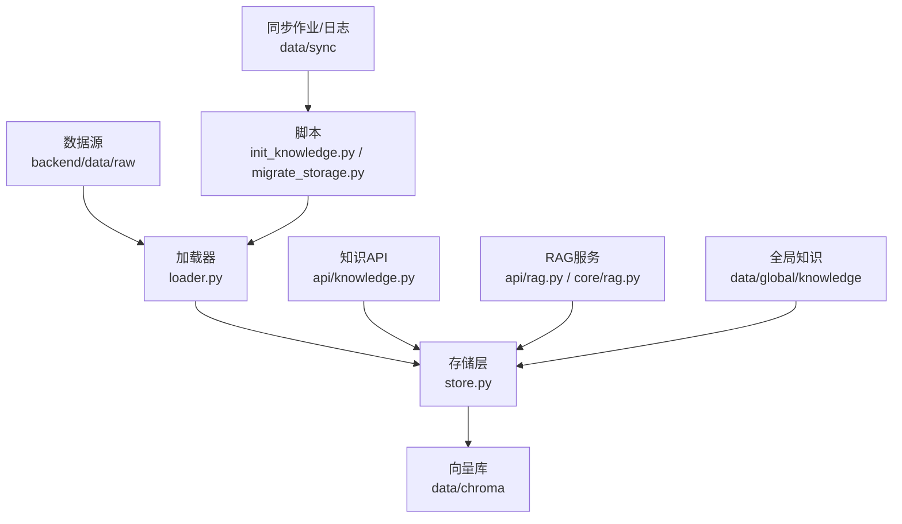
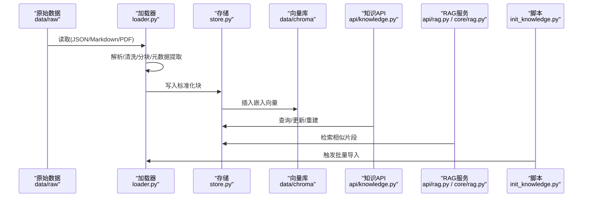
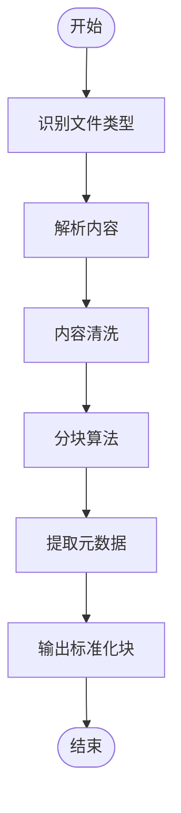
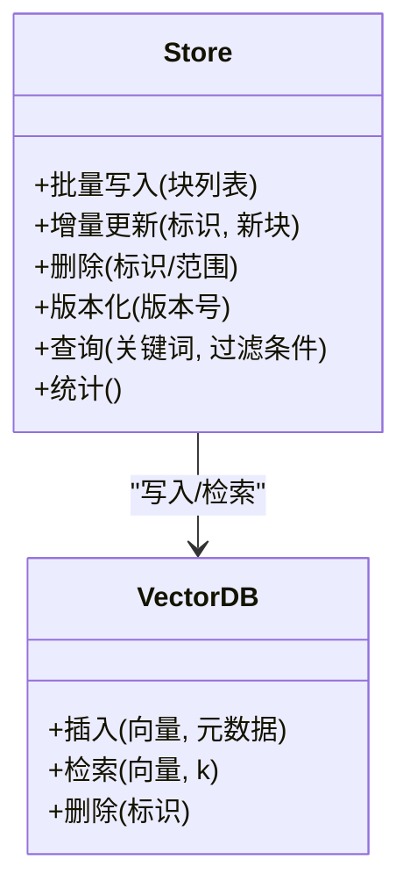
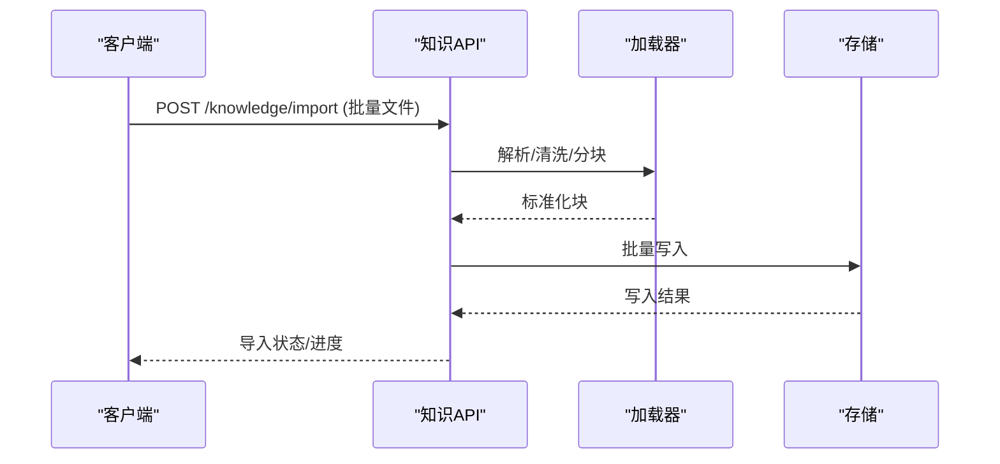
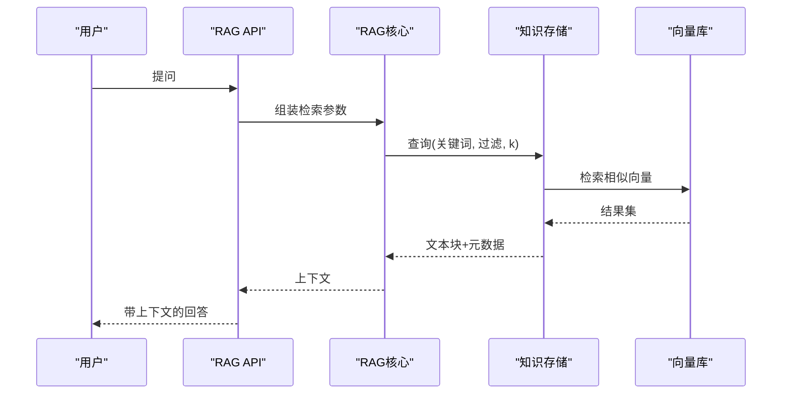
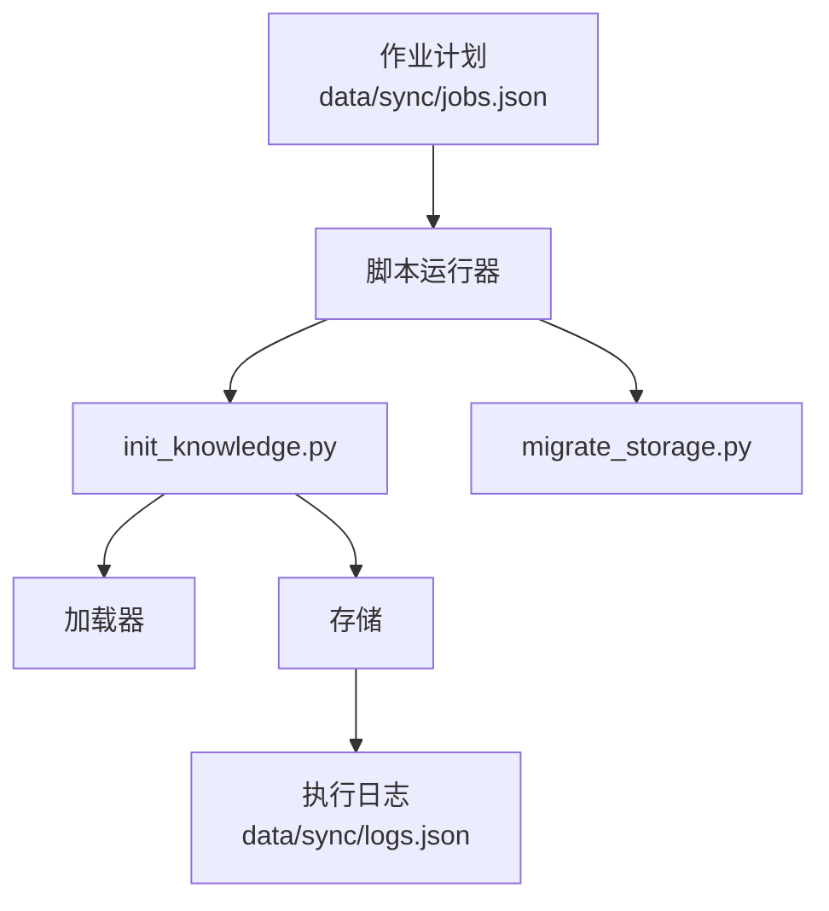
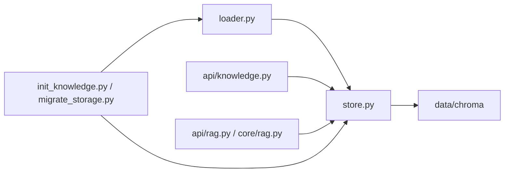

# 知识加载与更新

<cite>
**本文引用的文件**
- [backend/app/knowledge/loader.py](file://backend/app/knowledge/loader.py)
- [backend/app/knowledge/store.py](file://backend/app/knowledge/store.py)
- [backend/scripts/init_knowledge.py](file://backend/scripts/init_knowledge.py)
- [backend/app/api/knowledge.py](file://backend/app/api/knowledge.py)
- [backend/app/api/rag.py](file://backend/app/api/rag.py)
- [backend/app/core/rag.py](file://backend/app/core/rag.py)
- [backend/data/raw/regulations.md](file://backend/data/raw/regulations.md)
- [backend/data/chroma](file://backend/data/chroma)
- [backend/data/global/knowledge](file://backend/data/global/knowledge)
- [backend/data/sync/jobs.json](file://backend/data/sync/jobs.json)
- [backend/data/sync/logs.json](file://backend/data/sync/logs.json)
- [backend/scripts/migrate_storage.py](file://backend/scripts/migrate_storage.py)
- [backend/app/storage/raw_store.py](file://backend/app/storage/raw_store.py)
- [backend/app/storage/session_store.py](file://backend/app/storage/session_store.py)
- [backend/app/storage/user_store.py](file://backend/app/storage/user_store.py)
- [backend/app/storage/project_memory.py](file://backend/app/storage/project_memory.py)
- [backend/app/storage/session_memory.py](file://backend/app/storage/session_memory.py)
- [backend/app/storage/user_memory.py](file://backend/app/storage/user_memory.py)
- [backend/app/storage/agent_config_store.py](file://backend/app/storage/agent_config_store.py)
- [backend/app/storage/event_store.py](file://backend/app/storage/event_store.py)
- [backend/app/storage/session_store.py](file://backend/app/storage/session_store.py)
- [backend/app/storage/user_store.py](file://backend/app/storage/user_store.py)
- [backend/app/storage/project_memory.py](file://backend/app/storage/project_memory.py)
- [backend/app/storage/session_memory.py](file://backend/app/storage/session_memory.py)
- [backend/app/storage/user_memory.py](file://backend/app/storage/user_memory.py)
- [backend/app/storage/agent_config_store.py](file://backend/app/storage/agent_config_store.py)
- [backend/app/storage/event_store.py](file://backend/app/storage/event_store.py)
- [backend/app/storage/raw_store.py](file://backend/app/storage/raw_store.py)
</cite>

## 目录
1. [引言](#引言)
2. [项目结构](#项目结构)
3. [核心组件](#核心组件)
4. [架构总览](#架构总览)
5. [详细组件分析](#详细组件分析)
6. [依赖关系分析](#依赖关系分析)
7. [性能考量](#性能考量)
8. [故障排查指南](#故障排查指南)
9. [结论](#结论)
10. [附录](#附录)

## 引言
本文件面向避风港平台的知识加载与更新机制，系统性阐述批量知识导入流程（文档预处理、分块算法、元数据提取）、增量更新策略（差异检测、部分重载、版本管理）、知识库维护操作（新增、删除、修改、重建）、数据质量控制（格式验证、内容清洗、完整性检查）、自动化更新（定时任务、触发条件、批量策略）、迁移与备份恢复方案、加载脚本使用指南及错误处理策略，并覆盖原始数据格式（JSON、Markdown、PDF）的处理与转换规则。

## 项目结构
知识体系由“数据源—加载器—存储—API/服务—前端界面”构成，关键目录与职责如下：
- 数据源：backend/data/raw（法规、税号、认证等原始数据）
- 加载器：backend/app/knowledge/loader.py（解析、清洗、分块、元数据提取）
- 存储：backend/app/knowledge/store.py（向向量库写入/查询/版本化）
- API：backend/app/api/knowledge.py（对外暴露知识管理接口）
- 自动化：backend/scripts/init_knowledge.py（初始化/批量导入）、backend/scripts/migrate_storage.py（迁移）
- 向量库：backend/data/chroma（持久化嵌入）
- 全局知识：backend/data/global/knowledge（全局索引/版本）
- 同步与日志：backend/data/sync/jobs.json、logs.json（作业与日志）
- 原始存储与会话：backend/app/storage/*（原始数据、会话、用户、事件等）

**图表来源**
- [backend/app/knowledge/loader.py](file://backend/app/knowledge/loader.py)
- [backend/app/knowledge/store.py](file://backend/app/knowledge/store.py)
- [backend/app/api/knowledge.py](file://backend/app/api/knowledge.py)
- [backend/app/api/rag.py](file://backend/app/api/rag.py)
- [backend/app/core/rag.py](file://backend/app/core/rag.py)
- [backend/scripts/init_knowledge.py](file://backend/scripts/init_knowledge.py)
- [backend/scripts/migrate_storage.py](file://backend/scripts/migrate_storage.py)
- [backend/data/chroma](file://backend/data/chroma)
- [backend/data/global/knowledge](file://backend/data/global/knowledge)
- [backend/data/sync/jobs.json](file://backend/data/sync/jobs.json)
- [backend/data/sync/logs.json](file://backend/data/sync/logs.json)

**章节来源**
- [backend/app/knowledge/loader.py](file://backend/app/knowledge/loader.py)
- [backend/app/knowledge/store.py](file://backend/app/knowledge/store.py)
- [backend/app/api/knowledge.py](file://backend/app/api/knowledge.py)
- [backend/app/api/rag.py](file://backend/app/api/rag.py)
- [backend/app/core/rag.py](file://backend/app/core/rag.py)
- [backend/scripts/init_knowledge.py](file://backend/scripts/init_knowledge.py)
- [backend/scripts/migrate_storage.py](file://backend/scripts/migrate_storage.py)
- [backend/data/chroma](file://backend/data/chroma)
- [backend/data/global/knowledge](file://backend/data/global/knowledge)
- [backend/data/sync/jobs.json](file://backend/data/sync/jobs.json)
- [backend/data/sync/logs.json](file://backend/data/sync/logs.json)

## 核心组件
- 文档加载器（loader.py）：负责从多种原始格式读取、解析、清洗、分块与元数据抽取，输出标准化的文本块与元信息。
- 知识存储（store.py）：对接向量库，支持插入、更新、删除、版本化检索与一致性校验。
- 知识API（api/knowledge.py）：提供REST接口，支撑批量导入、增量更新、重建、查询与状态管理。
- RAG服务（api/rag.py、core/rag.py）：在检索增强生成中调用知识存储，进行检索与上下文拼接。
- 初始化与迁移脚本（scripts/init_knowledge.py、migrate_storage.py）：自动化批量导入与存储迁移。
- 同步与日志（data/sync）：记录作业状态与执行日志，便于追踪与回滚。
- 原始存储与会话（storage/*）：保障原始数据与会话/用户/事件等上下文的一致性与可追溯性。

**章节来源**
- [backend/app/knowledge/loader.py](file://backend/app/knowledge/loader.py)
- [backend/app/knowledge/store.py](file://backend/app/knowledge/store.py)
- [backend/app/api/knowledge.py](file://backend/app/api/knowledge.py)
- [backend/app/api/rag.py](file://backend/app/api/rag.py)
- [backend/app/core/rag.py](file://backend/app/core/rag.py)
- [backend/scripts/init_knowledge.py](file://backend/scripts/init_knowledge.py)
- [backend/scripts/migrate_storage.py](file://backend/scripts/migrate_storage.py)
- [backend/data/sync/jobs.json](file://backend/data/sync/jobs.json)
- [backend/data/sync/logs.json](file://backend/data/sync/logs.json)

## 架构总览
下图展示从数据源到向量库与API/RAG服务的整体流程，以及脚本驱动的自动化更新路径。

**图表来源**
- [backend/app/knowledge/loader.py](file://backend/app/knowledge/loader.py)
- [backend/app/knowledge/store.py](file://backend/app/knowledge/store.py)
- [backend/app/api/knowledge.py](file://backend/app/api/knowledge.py)
- [backend/app/api/rag.py](file://backend/app/api/rag.py)
- [backend/app/core/rag.py](file://backend/app/core/rag.py)
- [backend/scripts/init_knowledge.py](file://backend/scripts/init_knowledge.py)

## 详细组件分析

### 组件A：文档加载器（批量导入与预处理）
- 输入格式：JSON、Markdown、PDF
- 处理流程：
  - 解析：根据扩展名选择解析器（如Markdown解析器、PDF解析器、JSON结构化字段提取）
  - 清洗：去除噪声、空白、重复段落；统一编码与换行
  - 分块：基于语义边界与长度阈值进行滚动窗口或语义分割，确保块内语义完整
  - 元数据：抽取标题、来源、时间戳、标签、领域分类等
- 输出：标准化文本块序列与元数据字典，供存储层写入

**图表来源**
- [backend/app/knowledge/loader.py](file://backend/app/knowledge/loader.py)

**章节来源**
- [backend/app/knowledge/loader.py](file://backend/app/knowledge/loader.py)

### 组件B：知识存储（向量库写入与检索）
- 功能要点：
  - 插入：将文本块与元数据写入向量库，生成唯一标识
  - 更新：基于标识进行部分重载（替换/合并），保持向量一致性
  - 删除：按标识或范围删除，清理向量与元数据
  - 版本化：为每个文档/批次打上版本号，支持回溯与对比
  - 一致性：写入前后进行完整性检查与冲突检测
- 接口：提供批量写入、增量更新、版本切换、查询与统计

**图表来源**
- [backend/app/knowledge/store.py](file://backend/app/knowledge/store.py)
- [backend/data/chroma](file://backend/data/chroma)

**章节来源**
- [backend/app/knowledge/store.py](file://backend/app/knowledge/store.py)
- [backend/data/chroma](file://backend/data/chroma)

### 组件C：知识API（对外接口）
- 主要接口：
  - 导入：接收批量文件，触发加载器与存储写入
  - 增量：按文档ID或版本进行部分重载
  - 重建：清空并重新导入指定集合
  - 查询：关键词检索、过滤、排序与分页
  - 状态：查看导入进度、版本、统计信息
- 安全与鉴权：结合认证模块，限制敏感操作权限

**图表来源**
- [backend/app/api/knowledge.py](file://backend/app/api/knowledge.py)
- [backend/app/knowledge/loader.py](file://backend/app/knowledge/loader.py)
- [backend/app/knowledge/store.py](file://backend/app/knowledge/store.py)

**章节来源**
- [backend/app/api/knowledge.py](file://backend/app/api/knowledge.py)

### 组件D：RAG服务（检索增强生成）
- 调用链路：API请求 -> RAG服务 -> 知识存储 -> 向量库检索 -> 上下文拼接 -> 返回
- 关键点：过滤条件（版本、领域、时间）、相似度阈值、上下文截断与去重

**图表来源**
- [backend/app/api/rag.py](file://backend/app/api/rag.py)
- [backend/app/core/rag.py](file://backend/app/core/rag.py)
- [backend/app/knowledge/store.py](file://backend/app/knowledge/store.py)
- [backend/data/chroma](file://backend/data/chroma)

**章节来源**
- [backend/app/api/rag.py](file://backend/app/api/rag.py)
- [backend/app/core/rag.py](file://backend/app/core/rag.py)

### 组件E：自动化更新（脚本与调度）
- 初始化脚本：扫描数据源，调用加载器与存储，完成批量导入与版本标记
- 迁移脚本：在存储结构变化时，将旧数据迁移到新结构，保证向量与元数据一致
- 同步作业：通过jobs.json记录作业计划，logs.json记录执行日志，支持失败重试与回滚

**图表来源**
- [backend/scripts/init_knowledge.py](file://backend/scripts/init_knowledge.py)
- [backend/scripts/migrate_storage.py](file://backend/scripts/migrate_storage.py)
- [backend/data/sync/jobs.json](file://backend/data/sync/jobs.json)
- [backend/data/sync/logs.json](file://backend/data/sync/logs.json)

**章节来源**
- [backend/scripts/init_knowledge.py](file://backend/scripts/init_knowledge.py)
- [backend/scripts/migrate_storage.py](file://backend/scripts/migrate_storage.py)
- [backend/data/sync/jobs.json](file://backend/data/sync/jobs.json)
- [backend/data/sync/logs.json](file://backend/data/sync/logs.json)

## 依赖关系分析
- 组件耦合：
  - 加载器与存储：紧耦合（标准化输出直接驱动写入）
  - API与存储：中等耦合（通过接口抽象）
  - RAG服务与存储：中等耦合（检索接口）
  - 脚本与加载器/存储：松耦合（命令行入口）
- 外部依赖：
  - 向量库（Chroma）：作为持久化存储
  - 文件系统：原始数据与日志
- 潜在风险：
  - 数据格式不一致导致解析失败
  - 分块过长/过短影响检索质量
  - 版本冲突未及时发现

**图表来源**
- [backend/app/knowledge/loader.py](file://backend/app/knowledge/loader.py)
- [backend/app/knowledge/store.py](file://backend/app/knowledge/store.py)
- [backend/app/api/knowledge.py](file://backend/app/api/knowledge.py)
- [backend/app/api/rag.py](file://backend/app/api/rag.py)
- [backend/app/core/rag.py](file://backend/app/core/rag.py)
- [backend/scripts/init_knowledge.py](file://backend/scripts/init_knowledge.py)
- [backend/scripts/migrate_storage.py](file://backend/scripts/migrate_storage.py)
- [backend/data/chroma](file://backend/data/chroma)

**章节来源**
- [backend/app/knowledge/loader.py](file://backend/app/knowledge/loader.py)
- [backend/app/knowledge/store.py](file://backend/app/knowledge/store.py)
- [backend/app/api/knowledge.py](file://backend/app/api/knowledge.py)
- [backend/app/api/rag.py](file://backend/app/api/rag.py)
- [backend/app/core/rag.py](file://backend/app/core/rag.py)
- [backend/scripts/init_knowledge.py](file://backend/scripts/init_knowledge.py)
- [backend/scripts/migrate_storage.py](file://backend/scripts/migrate_storage.py)
- [backend/data/chroma](file://backend/data/chroma)

## 性能考量
- 分块策略：平衡语义完整性与向量检索效率，避免单块过大导致检索开销高
- 向量维度与索引：合理设置维度与索引参数，提升检索速度
- 批量写入：采用批量提交减少IO往返
- 缓存与去重：对重复内容进行去重与缓存，降低重复计算
- 并发与限流：在高并发场景下控制写入速率，避免向量库压力峰值

## 故障排查指南
- 常见问题与处理：
  - 解析失败：检查文件编码与格式，必要时转为UTF-8或标准Markdown/PDF
  - 分块异常：调整分块长度阈值与语义边界，确保块内逻辑连贯
  - 写入失败：核对向量维度与嵌入模型，检查磁盘空间与权限
  - 版本冲突：通过版本号比对与差异检测定位冲突，回滚至稳定版本
  - 日志定位：查看data/sync/logs.json中的错误堆栈与时间戳
- 错误处理策略：
  - 重试与退避：对临时性错误（网络/IO）自动重试
  - 回滚与补偿：失败时回滚到上一版本或补偿式重做
  - 告警与通知：异常达到阈值时触发告警

**章节来源**
- [backend/data/sync/logs.json](file://backend/data/sync/logs.json)

## 结论
避风港平台的知识加载与更新机制以“标准化的文档加载器+版本化的存储+可扩展的API/RAG服务+脚本驱动的自动化”为核心，形成从原始数据到向量检索的完整闭环。通过严格的分块与元数据策略、增量更新与版本管理、质量控制与日志监控，能够高效、可靠地支撑知识库的持续演进与业务应用。

## 附录

### 原始数据格式处理与转换规则
- JSON：提取结构化字段，合并为可检索文本，保留关键元数据（如时间、来源、标签）
- Markdown：解析标题、段落、列表、表格，清洗多余空白，按语义段落分块
- PDF：OCR与文本提取结合，去除页眉页脚与水印，按章节与段落分块

**章节来源**
- [backend/app/knowledge/loader.py](file://backend/app/knowledge/loader.py)

### 知识库维护操作清单
- 新增：通过API或脚本导入新文档，写入向量库并打上版本号
- 删除：按标识删除，同时清理向量与元数据
- 修改：部分重载（保留其他块不变），更新受影响块
- 重建：清空目标集合后重新导入，适用于重大结构变更

**章节来源**
- [backend/app/api/knowledge.py](file://backend/app/api/knowledge.py)
- [backend/app/knowledge/store.py](file://backend/app/knowledge/store.py)

### 数据质量控制机制
- 格式验证：检查文件扩展名与头部签名，拒绝异常格式
- 内容清洗：统一编码、去除噪声、规范化标点与换行
- 完整性检查：写入前后比对块数量与哈希，确保无丢失与篡改

**章节来源**
- [backend/app/knowledge/loader.py](file://backend/app/knowledge/loader.py)
- [backend/app/knowledge/store.py](file://backend/app/knowledge/store.py)

### 自动化更新流程
- 定时任务：通过调度器定期扫描数据源，触发初始化脚本
- 触发条件：文件变更、版本号更新、手动触发
- 批量策略：分批导入、限速写入、失败重试与补偿

**章节来源**
- [backend/scripts/init_knowledge.py](file://backend/scripts/init_knowledge.py)
- [backend/data/sync/jobs.json](file://backend/data/sync/jobs.json)

### 知识库迁移与备份恢复
- 迁移：使用迁移脚本将旧结构数据转换为新结构，确保向量与元数据一致
- 备份：定期导出向量库快照与元数据，保存至安全位置
- 恢复：在新环境中重建向量库并导入快照，验证一致性

**章节来源**
- [backend/scripts/migrate_storage.py](file://backend/scripts/migrate_storage.py)
- [backend/data/chroma](file://backend/data/chroma)

### 加载脚本使用指南
- 初始化导入：执行初始化脚本，扫描数据源并批量写入
- 参数与选项：支持指定数据源目录、目标集合、版本号、是否覆盖
- 输出与日志：查看日志文件定位问题，确认导入进度与统计

**章节来源**
- [backend/scripts/init_knowledge.py](file://backend/scripts/init_knowledge.py)
- [backend/data/sync/logs.json](file://backend/data/sync/logs.json)