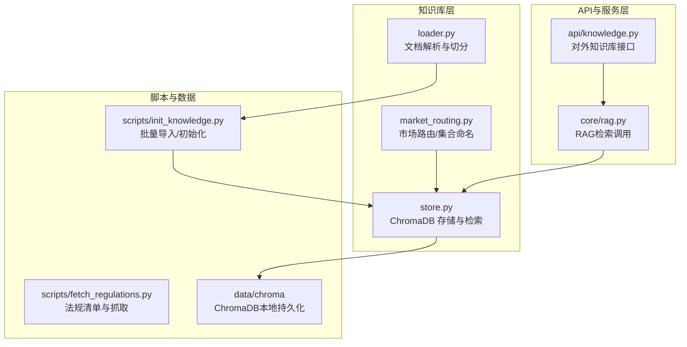
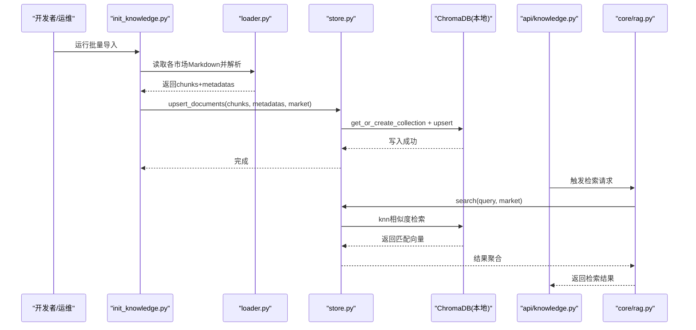
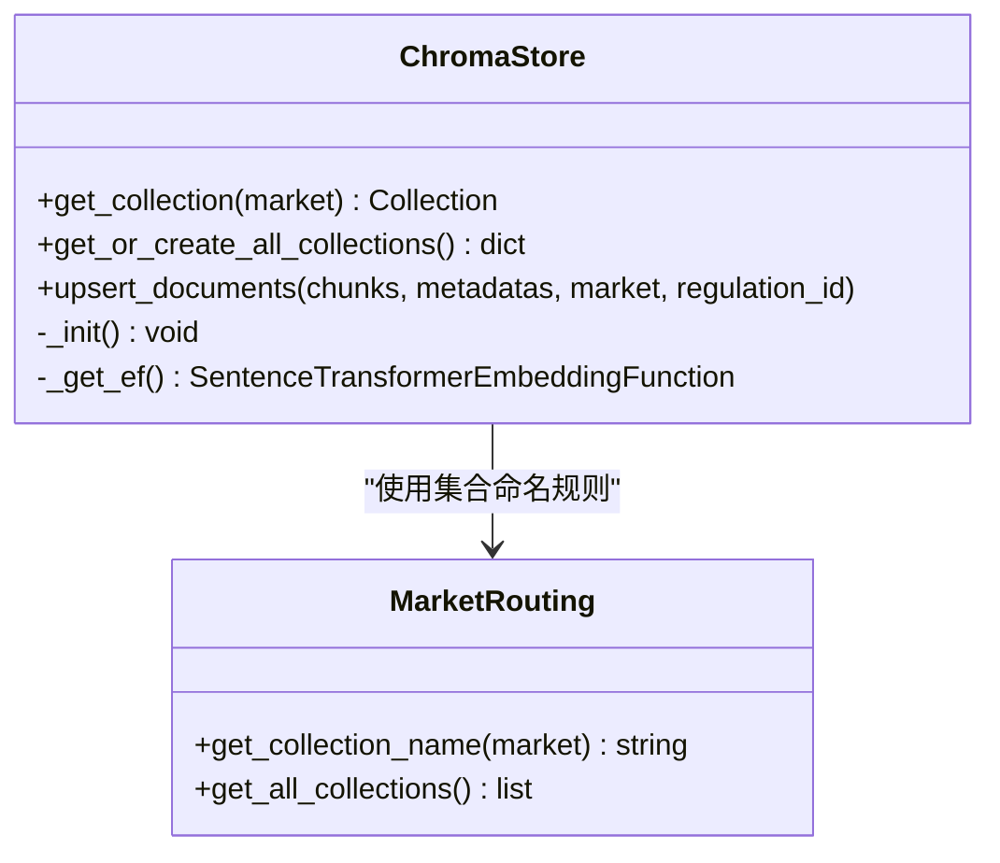
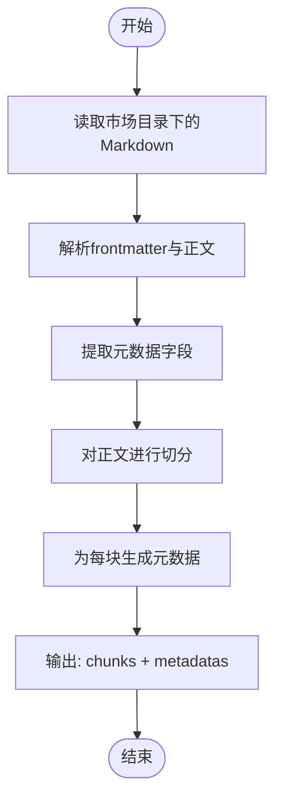
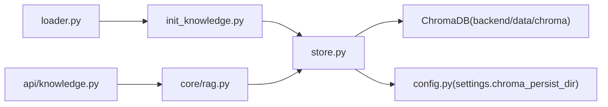

# 知识库架构

<cite>
**本文引用的文件**
- [store.py](file://backend/app/knowledge/store.py)
- [loader.py](file://backend/app/knowledge/loader.py)
- [market_routing.py](file://backend/app/knowledge/market_routing.py)
- [knowledge.py](file://backend/app/api/knowledge.py)
- [rag.py](file://backend/app/core/rag.py)
- [init_knowledge.py](file://backend/scripts/init_knowledge.py)
- [fetch_regulations.py](file://backend/scripts/fetch_regulations.py)
- [chroma 目录](file://backend/data/chroma)
- [config.py](file://backend/app/config.py)
</cite>

## 目录
1. [简介](#简介)
2. [项目结构](#项目结构)
3. [核心组件](#核心组件)
4. [架构总览](#架构总览)
5. [详细组件分析](#详细组件分析)
6. [依赖关系分析](#依赖关系分析)
7. [性能考虑](#性能考虑)
8. [故障排除指南](#故障排除指南)
9. [结论](#结论)
10. [附录：配置参数与部署建议](#附录配置参数与部署建议)

## 简介
本文件面向避风港平台的知识库架构，聚焦多市场（EU、US、JP、KR）分层设计、ChromaDB本地持久化与向量化检索、知识库初始化与维护流程、元数据管理与查询、性能监控与故障排除，并提供可落地的配置参数与部署建议。目标是帮助技术与非技术读者理解从“数据采集/导入”到“检索服务”的完整链路。

## 项目结构
知识库相关代码主要位于后端模块的 app/knowledge 与 scripts 目录中，配合 API 层与 RAG 核心模块协同工作；持久化存储位于 backend/data/chroma 目录下。

**图表来源**
- [store.py:1-120](file://backend/app/knowledge/store.py#L1-L120)
- [loader.py:1-160](file://backend/app/knowledge/loader.py#L1-L160)
- [market_routing.py:1-80](file://backend/app/knowledge/market_routing.py#L1-L80)
- [knowledge.py:1-200](file://backend/app/api/knowledge.py#L1-L200)
- [rag.py:1-200](file://backend/app/core/rag.py#L1-L200)
- [init_knowledge.py:1-200](file://backend/scripts/init_knowledge.py#L1-L200)
- [fetch_regulations.py:1-220](file://backend/scripts/fetch_regulations.py#L1-L220)
- [chroma 目录](file://backend/data/chroma)

**章节来源**
- [store.py:1-120](file://backend/app/knowledge/store.py#L1-L120)
- [loader.py:1-160](file://backend/app/knowledge/loader.py#L1-L160)
- [market_routing.py:1-80](file://backend/app/knowledge/market_routing.py#L1-L80)
- [knowledge.py:1-200](file://backend/app/api/knowledge.py#L1-L200)
- [rag.py:1-200](file://backend/app/core/rag.py#L1-L200)
- [init_knowledge.py:1-200](file://backend/scripts/init_knowledge.py#L1-L200)
- [fetch_regulations.py:1-220](file://backend/scripts/fetch_regulations.py#L1-L220)
- [chroma 目录](file://backend/data/chroma)

## 核心组件
- 多市场集合管理：按 EU、US、JP、KR 分别建立独立 collection，实现地理/法规隔离与独立扩展。
- 向量化与检索：基于 sentence-transformers 的本地嵌入模型，ChromaDB 作为向量数据库，支持 cosine 相似度检索。
- 文档导入管线：前端/脚本准备原始 Markdown，经解析、切分、元数据注入后批量 upsert 到对应市场集合。
- 元数据模型：包含法规 ID、名称、来源 URL、生效日期、标签、市场、分片索引等字段，支撑精确检索与过滤。
- 初始化与维护：提供批量导入脚本与增量维护能力，结合备份与恢复策略保障稳定性。

**章节来源**
- [store.py:1-120](file://backend/app/knowledge/store.py#L1-L120)
- [loader.py:80-121](file://backend/app/knowledge/loader.py#L80-L121)
- [market_routing.py:1-80](file://backend/app/knowledge/market_routing.py#L1-L80)
- [init_knowledge.py:1-200](file://backend/scripts/init_knowledge.py#L1-L200)

## 架构总览
下图展示从“知识库初始化”到“RAG检索”的端到端流程，以及与 ChromaDB 的交互。

**图表来源**
- [init_knowledge.py:1-200](file://backend/scripts/init_knowledge.py#L1-L200)
- [loader.py:80-121](file://backend/app/knowledge/loader.py#L80-L121)
- [store.py:80-120](file://backend/app/knowledge/store.py#L80-L120)
- [chroma 目录](file://backend/data/chroma)
- [knowledge.py:1-200](file://backend/app/api/knowledge.py#L1-L200)
- [rag.py:1-200](file://backend/app/core/rag.py#L1-L200)

## 详细组件分析

### 组件A：ChromaDB 存储与集合管理（store.py）
- 多集合设计：按市场生成集合名（如 eu_knowledge），每个集合绑定特定嵌入函数与元数据（如 hnsw:space、market）。
- 懒加载客户端：首次访问时初始化 PersistentClient，避免启动即下载模型或连接数据库。
- 幂等写入：upsert_documents 支持重复导入而不产生重复记录。
- 降级策略：当 ChromaDB 不可用时返回空结果，不影响主流程。

**图表来源**
- [store.py:43-120](file://backend/app/knowledge/store.py#L43-L120)
- [market_routing.py:1-80](file://backend/app/knowledge/market_routing.py#L1-L80)

**章节来源**
- [store.py:43-120](file://backend/app/knowledge/store.py#L43-L120)

### 组件B：文档加载与元数据注入（loader.py）
- 输入：各市场目录下的 Markdown 文件，采用 frontmatter 注入元信息。
- 解析：提取 regulation_id、name、source_url、effective_date、tags 等字段。
- 切分：按段落/句子切分为多个文本块，为向量化做准备。
- 输出：返回每个法规的 chunks 与对应的 metadatas（包含 market、chunk_index 等）。

**图表来源**
- [loader.py:80-121](file://backend/app/knowledge/loader.py#L80-L121)

**章节来源**
- [loader.py:80-121](file://backend/app/knowledge/loader.py#L80-L121)

### 组件C：市场路由与集合命名（market_routing.py）
- 提供 get_collection_name 将市场代码映射为集合名（如 eu -> eu_knowledge）。
- 提供 get_all_collections 返回全部集合名列表，便于批量初始化。

**章节来源**
- [market_routing.py:1-80](file://backend/app/knowledge/market_routing.py#L1-L80)

### 组件D：API 接口与检索调用（api/knowledge.py 与 core/rag.py）
- API 层：对外暴露知识库查询接口，接收用户问题与市场参数。
- RAG 层：调用 store.search 执行向量检索，聚合上下文并返回结果。
- 错误处理：当底层存储不可用时返回空结果，保证服务可用性。

**章节来源**
- [knowledge.py:1-200](file://backend/app/api/knowledge.py#L1-L200)
- [rag.py:1-200](file://backend/app/core/rag.py#L1-L200)

### 组件E：知识库初始化与维护（scripts/init_knowledge.py 与 scripts/fetch_regulations.py）
- 初始化：读取 loader 解析后的 chunks 与 metadatas，调用 store.upsert_documents 写入指定市场集合。
- 维护：支持增量更新（通过幂等 upsert）、删除（可扩展为删除标记或重新导入）、容量管理（按市场拆分集合，独立扩容）。
- 数据来源：fetch_regulations.py 提供法规清单与抓取策略，辅助自动化导入。

**章节来源**
- [init_knowledge.py:1-200](file://backend/scripts/init_knowledge.py#L1-L200)
- [fetch_regulations.py:150-190](file://backend/scripts/fetch_regulations.py#L150-L190)

## 依赖关系分析
- store.py 依赖 market_routing.py 获取集合名，并通过 config.settings 访问 chroma_persist_dir。
- loader.py 依赖 split 策略与 frontmatter 解析，输出结构化数据供初始化脚本使用。
- API 与 RAG 依赖 store 的检索接口，形成“查询—检索—返回”的闭环。
- ChromaDB 作为外部持久化存储，位于 backend/data/chroma 目录。

**图表来源**
- [store.py:18-51](file://backend/app/knowledge/store.py#L18-L51)
- [loader.py:80-121](file://backend/app/knowledge/loader.py#L80-L121)
- [init_knowledge.py:1-200](file://backend/scripts/init_knowledge.py#L1-L200)
- [knowledge.py:1-200](file://backend/app/api/knowledge.py#L1-L200)
- [rag.py:1-200](file://backend/app/core/rag.py#L1-L200)
- [chroma 目录](file://backend/data/chroma)
- [config.py](file://backend/app/config.py)

**章节来源**
- [store.py:18-51](file://backend/app/knowledge/store.py#L18-L51)
- [config.py](file://backend/app/config.py)

## 性能考虑
- 向量模型与检索
  - 使用本地 sentence-transformers 模型，避免网络依赖，降低冷启动成本。
  - 集合元数据设置 hnsw:space 为 cosine，提升相似度检索效率。
- 批量导入
  - init_knowledge.py 以 chunks 为单位批量 upsert，减少 IO 次数。
- 查询路径
  - RAG 层统一走 store.search，避免跨模块重复逻辑。
- 可观测性
  - 建议在 store 与 RAG 层增加计时与日志埋点，统计向量化耗时、检索耗时、命中率等指标。

[本节为通用性能讨论，无需列出具体文件来源]

## 故障排除指南
- ChromaDB 不可用
  - 现象：检索返回空结果。
  - 处理：检查 chroma_persist_dir 是否可写、磁盘空间是否充足；确认 PersistentClient 初始化是否成功。
  - 参考：store._init 与 get_collection 的错误降级行为。
- 向量模型加载失败
  - 现象：首次使用报模型下载或缓存错误。
  - 处理：确保 local_files_only=True 生效，离线环境提前准备好模型缓存目录。
- 导入后检索不到
  - 现象：导入完成但查询无结果。
  - 处理：确认 market 参数与集合名一致；核对 chunks 是否为空；检查 metadatas 字段是否正确写入。
- 数据不一致
  - 现象：重复导入导致重复记录或版本错乱。
  - 处理：利用 upsert 的幂等特性；必要时重建集合或清理无效数据。

**章节来源**
- [store.py:43-78](file://backend/app/knowledge/store.py#L43-L78)
- [init_knowledge.py:1-200](file://backend/scripts/init_knowledge.py#L1-L200)

## 结论
该知识库架构以“多市场集合 + 本地向量存储 + 结构化元数据”为核心，实现了法规类知识的高可用、可扩展与可维护。通过脚本化的初始化与维护流程、完善的降级策略与可观测性埋点，平台可在复杂合规场景下稳定运行。

[本节为总结性内容，无需列出具体文件来源]

## 附录：配置参数与部署建议

### 关键配置项
- chroma_persist_dir
  - 类型：字符串（路径）
  - 作用：ChromaDB 本地持久化目录
  - 默认值：来自 config.settings
  - 参考：store._init 使用该路径初始化 PersistentClient
- embedding_model
  - 类型：字符串
  - 作用：向量模型名称（本地）
  - 默认值：paraphrase-multilingual-MiniLM-L12-v2
  - 参考：_get_ef 中的模型名与 local_files_only 设置
- hnsw:space
  - 类型：字符串
  - 作用：向量距离度量（cosine）
  - 默认值：cosine
  - 参考：集合创建时的 metadata

**章节来源**
- [store.py:48-63](file://backend/app/knowledge/store.py#L48-L63)
- [config.py](file://backend/app/config.py)

### 部署建议
- 存储与备份
  - 将 backend/data/chroma 纳入定期备份计划；建议每日全量 + 增量备份策略。
  - 在灾难恢复演练中验证备份恢复流程，确保集合与向量数据一致性。
- 扩容与隔离
  - 按市场独立集合，便于独立扩容与容量管理；新增市场时通过 get_all_collections 自动创建。
- 安全与合规
  - 限制对 chroma_persist_dir 的访问权限；敏感数据需脱敏或加密存储。
- 监控与告警
  - 对导入耗时、检索延迟、集合大小、磁盘使用率等指标建立监控；异常时自动告警。

[本节为通用建议，无需列出具体文件来源]