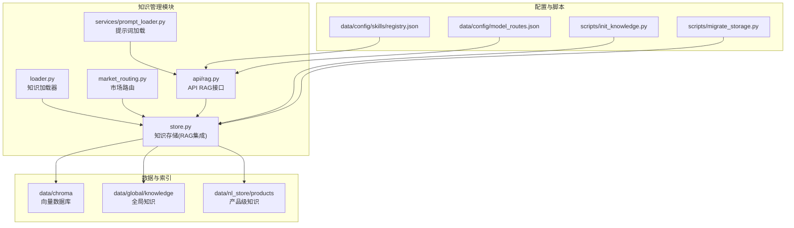
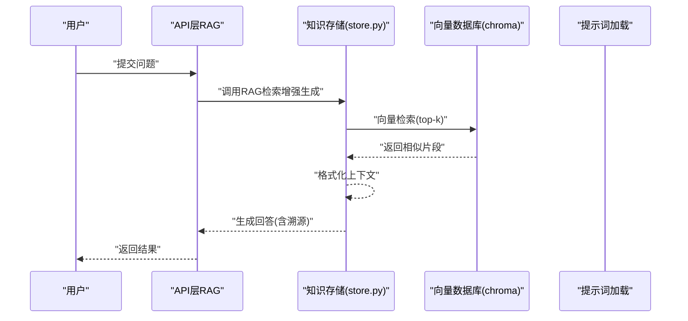
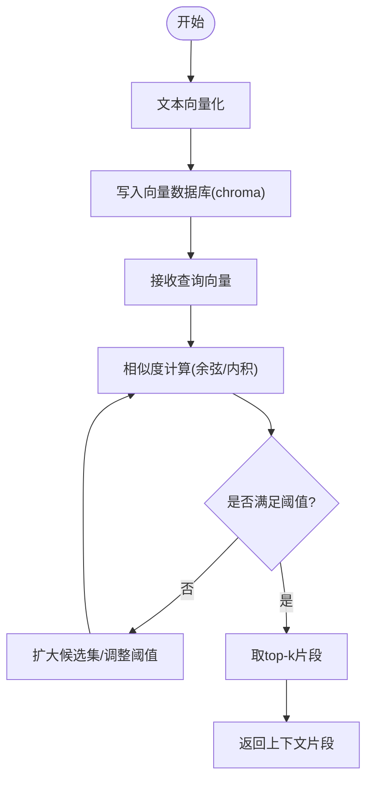
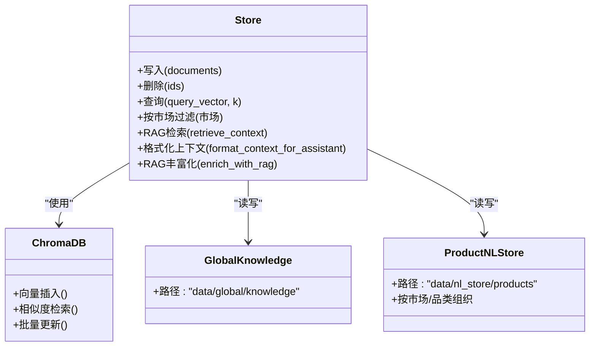
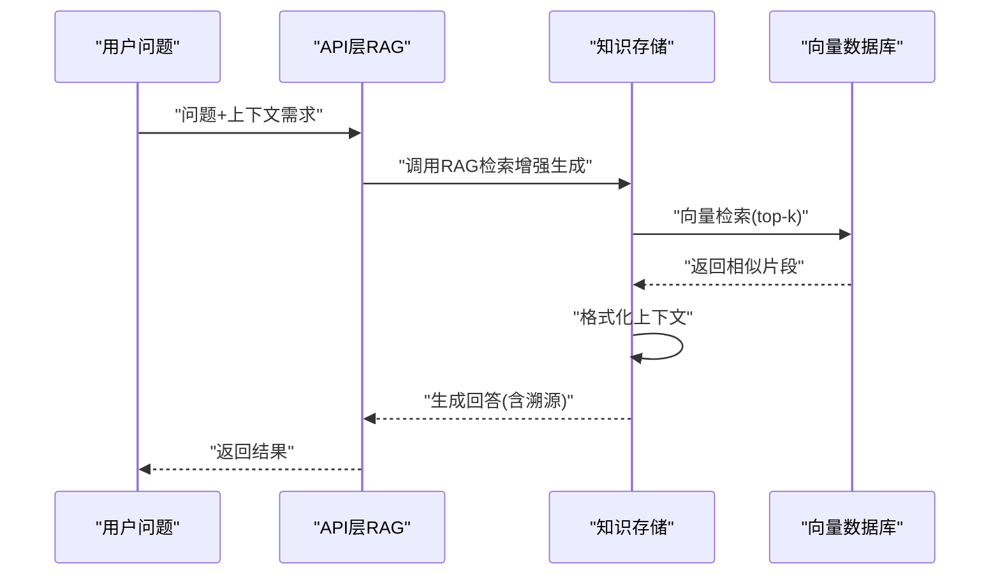
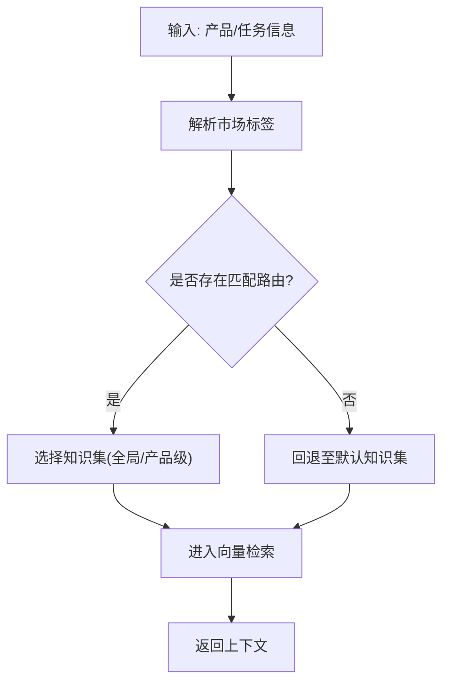
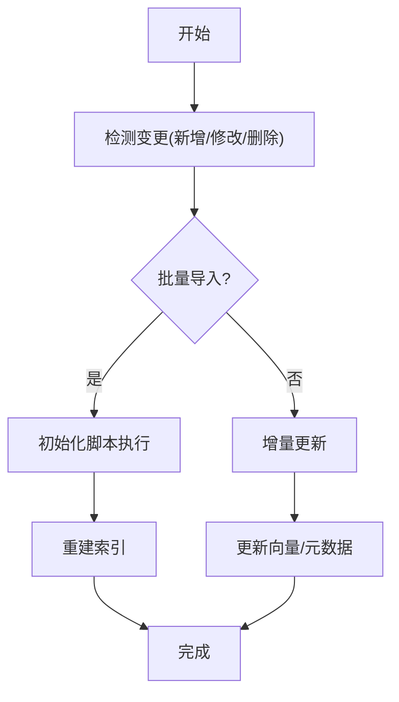
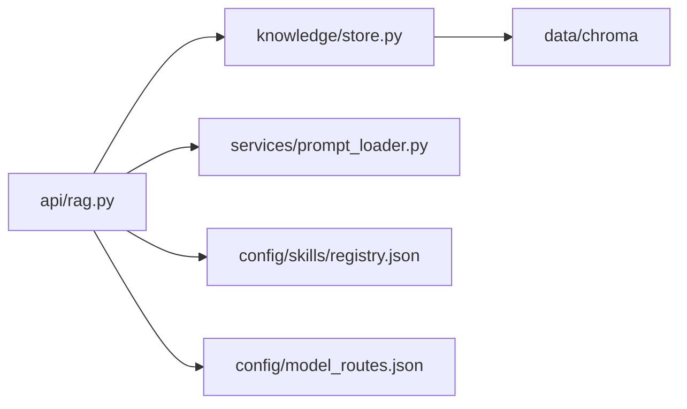

# 知识管理系统

<cite>
**本文引用的文件**
- [backend/app/knowledge/loader.py](file://backend/app/knowledge/loader.py)
- [backend/app/knowledge/market_routing.py](file://backend/app/knowledge/market_routing.py)
- [backend/app/knowledge/store.py](file://backend/app/knowledge/store.py)
- [backend/app/api/rag.py](file://backend/app/api/rag.py)
- [backend/app/services/prompt_loader.py](file://backend/app/services/prompt_loader.py)
- [backend/data/chroma](file://backend/data/chroma)
- [backend/scripts/init_knowledge.py](file://backend/scripts/init_knowledge.py)
- [backend/scripts/migrate_storage.py](file://backend/scripts/migrate_storage.py)
- [backend/data/prompts/chat_compliance.yaml](file://backend/data/prompts/chat_compliance.yaml)
- [backend/data/prompts/market_monitor.yaml](file://backend/data/prompts/market_monitor.yaml)
- [backend/data/prompts/regulation_scan.yaml](file://backend/data/prompts/regulation_scan.yaml)
- [backend/data/config/skills/registry.json](file://backend/data/config/skills/registry.json)
- [backend/data/config/model_routes.json](file://backend/data/config/model_routes.json)
- [backend/data/global/knowledge](file://backend/data/global/knowledge)
- [backend/data/nl_store/products/_all.json](file://backend/data/nl_store/products/_all.json)
- [backend/data/nl_store/products/玩具_欧盟.json](file://backend/data/nl_store/products/玩具_欧盟.json)
- [backend/data/nl_store/products/电子产品_德国.json](file://backend/data/nl_store/products/电子产品_德国.json)
- [后端api.md](file://后端api.md)
- [前后端api交互.md](file://前后端api交互.md)
- [后端变更路线图.md](file://后端变更路线图.md)
- [数据流转.md](file://数据流转.md)
</cite>

## 更新摘要
**所做更改**
- 更新了RAG模块架构，反映core/rag.py已迁移到knowledge/store.py的现状
- 修订了核心组件分析，强调RAG功能现已成为知识存储架构的统一组成部分
- 更新了架构总览图，体现新的模块组织结构
- 完善了依赖关系分析，反映API层与存储层的直接集成
- 更新了故障排查指南，针对新的架构布局提供相应指导

## 目录
1. [简介](#简介)
2. [项目结构](#项目结构)
3. [核心组件](#核心组件)
4. [架构总览](#架构总览)
5. [详细组件分析](#详细组件分析)
6. [依赖关系分析](#依赖关系分析)
7. [性能考虑](#性能考虑)
8. [故障排查指南](#故障排查指南)
9. [结论](#结论)
10. [附录](#附录)

## 简介
本文件面向避风港平台的知识管理系统，围绕向量检索、知识库架构、RAG（检索增强生成）、知识路由与动态策略、知识加载与更新、以及最佳实践与API使用进行系统化说明。文档以仓库中实际代码与数据为依据，提供可操作的架构视图、流程图与参考路径，帮助开发者与产品人员快速理解并扩展知识管理能力。

**重要更新**：RAG模块已从独立的核心组件迁移到知识存储架构中，成为统一的知识库系统的一部分，实现了更紧密的模块集成和更好的架构一致性。

## 项目结构
知识管理相关模块主要分布在后端应用的以下位置：
- 知识加载与存储：backend/app/knowledge/
- API层RAG接口：backend/app/api/rag.py
- 提示词加载：backend/app/services/prompt_loader.py
- 数据与索引：backend/data/chroma、backend/data/global/knowledge、backend/data/nl_store/products
- 初始化与迁移脚本：backend/scripts/init_knowledge.py、backend/scripts/migrate_storage.py
- 配置与技能注册：backend/data/config/skills/registry.json、backend/data/config/model_routes.json
- 提示词模板：backend/data/prompts/*.yaml

**图表来源**
- [backend/app/knowledge/store.py](file://backend/app/knowledge/store.py)
- [backend/app/api/rag.py](file://backend/app/api/rag.py)
- [backend/app/knowledge/market_routing.py](file://backend/app/knowledge/market_routing.py)
- [backend/app/knowledge/loader.py](file://backend/app/knowledge/loader.py)
- [backend/app/services/prompt_loader.py](file://backend/app/services/prompt_loader.py)

**章节来源**
- [backend/app/knowledge/store.py](file://backend/app/knowledge/store.py)
- [backend/app/api/rag.py](file://backend/app/api/rag.py)
- [backend/app/knowledge/market_routing.py](file://backend/app/knowledge/market_routing.py)
- [backend/app/knowledge/loader.py](file://backend/app/knowledge/loader.py)
- [backend/app/services/prompt_loader.py](file://backend/app/services/prompt_loader.py)

## 核心组件
- 知识加载器（loader.py）：负责从多种数据源（如原始法规、HS编码、vat税率等）解析并标准化为可检索条目，支持批量与增量处理。
- 市场路由（market_routing.py）：根据产品或任务所属市场（如欧盟、德国），选择对应的知识集合与规则，实现市场特定知识管理。
- 知识存储（store.py）：封装向量数据库（Chroma）与本地JSON存储，提供索引构建、写入、删除与查询接口；维护全局知识与产品级知识目录。**重要更新**：现已集成RAG检索增强生成功能，包括上下文提取、格式化和丰富化。
- API RAG（api/rag.py）：对外暴露的REST接口，接收用户问题、调用存储层的RAG功能并返回结果。**重要更新**：底层实现已完全迁移到知识存储模块。
- 提示词加载（services/prompt_loader.py）：按场景加载YAML中的提示词模板，支持合规检查、市场监控、法规扫描等。
- 初始化与迁移（scripts/init_knowledge.py、scripts/migrate_storage.py）：提供知识库初始化、索引重建与存储迁移能力。
- 配置与注册（data/config/skills/registry.json、data/config/model_routes.json）：定义可用技能与模型路由策略，影响RAG的上下文与生成路径。

**章节来源**
- [backend/app/knowledge/store.py](file://backend/app/knowledge/store.py)
- [backend/app/api/rag.py](file://backend/app/api/rag.py)
- [backend/app/knowledge/market_routing.py](file://backend/app/knowledge/market_routing.py)
- [backend/app/knowledge/loader.py](file://backend/app/knowledge/loader.py)
- [backend/app/services/prompt_loader.py](file://backend/app/services/prompt_loader.py)

## 架构总览
下图展示知识管理从"加载→存储→检索→生成"的全链路，体现了RAG功能与存储层的深度集成：

**图表来源**
- [backend/app/api/rag.py](file://backend/app/api/rag.py)
- [backend/app/knowledge/store.py](file://backend/app/knowledge/store.py)
- [backend/data/chroma](file://backend/data/chroma)
- [backend/app/services/prompt_loader.py](file://backend/app/services/prompt_loader.py)

## 详细组件分析

### 向量检索系统设计
- 向量化模型
  - 使用嵌入模型对文本进行向量化，作为后续相似度检索的基础。
  - 云端嵌入函数通过懒加载方式初始化，支持OpenAI兼容的API。
- 相似度计算
  - 采用向量空间相似度（余弦相似度）在Chroma中进行检索。
  - 支持阈值过滤与top-k返回，确保召回质量与性能平衡。
- 检索优化
  - 利用分页/游标式检索与缓存策略降低重复计算。
  - 对高频查询进行预检索与结果缓存，减少延迟。

**图表来源**
- [backend/app/knowledge/store.py](file://backend/app/knowledge/store.py)
- [backend/data/chroma](file://backend/data/chroma)

**章节来源**
- [backend/app/knowledge/store.py](file://backend/app/knowledge/store.py)
- [backend/data/chroma](file://backend/data/chroma)

### 知识库架构
- 文档存储
  - 全局知识：backend/data/global/knowledge，存放跨产品/市场的通用知识。
  - 产品级知识：backend/data/nl_store/products，按市场与品类划分，便于路由与隔离。
- 索引构建
  - 加载器将原始数据转换为结构化条目，写入Chroma并建立索引。
  - 支持增量更新：仅对变更条目重建索引，避免全量重索引。
- 查询接口
  - 存储层提供统一查询入口，结合市场路由与元数据过滤，返回高相关性片段。

**图表来源**
- [backend/app/knowledge/store.py](file://backend/app/knowledge/store.py)
- [backend/data/chroma](file://backend/data/chroma)
- [backend/data/global/knowledge](file://backend/data/global/knowledge)
- [backend/data/nl_store/products/_all.json](file://backend/data/nl_store/products/_all.json)

**章节来源**
- [backend/app/knowledge/store.py](file://backend/app/knowledge/store.py)
- [backend/data/global/knowledge](file://backend/data/global/knowledge)
- [backend/data/nl_store/products/_all.json](file://backend/data/nl_store/products/_all.json)

### RAG（检索增强生成）机制
**重要更新**：RAG功能已完全集成到知识存储模块中，成为统一架构的一部分。

- 上下文提取
  - 基于市场路由选择知识集，通过向量检索返回top-k片段，形成上下文窗口。
  - 新增`retrieve_context`方法，专门负责RAG检索增强生成。
- 提示工程
  - 通过提示词加载器按场景加载模板，注入上下文与用户问题，形成最终提示。
- 生成控制
  - 结合模型路由策略与技能注册表，控制输出格式、长度与风格，确保合规与一致性。
- 上下文格式化
  - 新增`format_context_for_assistant`方法，将检索到的片段格式化为带溯源的上下文字符串。
- RAG丰富化
  - 新增`enrich_with_rag`方法，提供完整的RAG检索增强生成流程。

**图表来源**
- [backend/app/api/rag.py](file://backend/app/api/rag.py)
- [backend/app/knowledge/store.py](file://backend/app/knowledge/store.py)
- [backend/data/chroma](file://backend/data/chroma)
- [backend/app/services/prompt_loader.py](file://backend/app/services/prompt_loader.py)

**章节来源**
- [backend/app/api/rag.py](file://backend/app/api/rag.py)
- [backend/app/knowledge/store.py](file://backend/app/knowledge/store.py)
- [backend/app/services/prompt_loader.py](file://backend/app/services/prompt_loader.py)

### 知识路由系统
- 市场特定知识管理
  - 通过市场路由模块，将产品或任务映射到对应的知识集合（如"玩具_欧盟"、"电子产品_德国"）。
- 动态路由策略
  - 路由策略可基于产品属性、目标市场、时间窗口等动态调整，确保检索上下文的时效性与准确性。

**图表来源**
- [backend/app/knowledge/market_routing.py](file://backend/app/knowledge/market_routing.py)
- [backend/data/nl_store/products/玩具_欧盟.json](file://backend/data/nl_store/products/玩具_欧盟.json)
- [backend/data/nl_store/products/电子产品_德国.json](file://backend/data/nl_store/products/电子产品_德国.json)

**章节来源**
- [backend/app/knowledge/market_routing.py](file://backend/app/knowledge/market_routing.py)
- [backend/data/nl_store/products/玩具_欧盟.json](file://backend/data/nl_store/products/玩具_欧盟.json)
- [backend/data/nl_store/products/电子产品_德国.json](file://backend/data/nl_store/products/电子产品_德国.json)

### 知识加载与更新机制
- 批量导入
  - 初始化脚本负责首次构建知识库与索引，支持从多源数据批量写入。
- 增量更新
  - 存储层提供增量写入与删除接口，配合加载器的差异检测，仅更新变更内容。
- 版本管理
  - 通过迁移脚本与版本化目录，确保索引与数据结构演进时的平滑过渡。

**图表来源**
- [backend/scripts/init_knowledge.py](file://backend/scripts/init_knowledge.py)
- [backend/scripts/migrate_storage.py](file://backend/scripts/migrate_storage.py)
- [backend/app/knowledge/loader.py](file://backend/app/knowledge/loader.py)
- [backend/app/knowledge/store.py](file://backend/app/knowledge/store.py)

**章节来源**
- [backend/scripts/init_knowledge.py](file://backend/scripts/init_knowledge.py)
- [backend/scripts/migrate_storage.py](file://backend/scripts/migrate_storage.py)
- [backend/app/knowledge/loader.py](file://backend/app/knowledge/loader.py)
- [backend/app/knowledge/store.py](file://backend/app/knowledge/store.py)

### 最佳实践
- 文档组织
  - 按市场与品类划分知识目录，便于路由与权限控制。
- 元数据标注
  - 为每条知识条目添加市场、品类、生效日期、失效日期等元数据，提升检索精度。
- 质量控制
  - 引入阈值与top-k裁剪，定期评估检索命中率与人工评分，持续优化模型与提示词。
- 维护策略
  - 使用迁移脚本进行平滑升级，保留历史索引与回滚路径。

## 依赖关系分析
**重要更新**：RAG功能已完全集成到知识存储模块，API层直接依赖存储层。

- 组件耦合
  - API层直接依赖知识存储模块；存储模块依赖向量数据库与本地JSON目录。
- 外部依赖
  - Chroma向量数据库、YAML提示词模板、技能与模型路由配置。
- 可能的循环依赖
  - 当前模块间通过清晰职责边界避免循环依赖：API→Store→VectorDB；PromptLoader独立注入。

**图表来源**
- [backend/app/api/rag.py](file://backend/app/api/rag.py)
- [backend/app/knowledge/store.py](file://backend/app/knowledge/store.py)
- [backend/app/services/prompt_loader.py](file://backend/app/services/prompt_loader.py)
- [backend/data/config/skills/registry.json](file://backend/data/config/skills/registry.json)
- [backend/data/config/model_routes.json](file://backend/data/config/model_routes.json)
- [backend/data/chroma](file://backend/data/chroma)

**章节来源**
- [backend/app/api/rag.py](file://backend/app/api/rag.py)
- [backend/app/knowledge/store.py](file://backend/app/knowledge/store.py)
- [backend/app/services/prompt_loader.py](file://backend/app/services/prompt_loader.py)
- [backend/data/config/skills/registry.json](file://backend/data/config/skills/registry.json)
- [backend/data/config/model_routes.json](file://backend/data/config/model_routes.json)
- [backend/data/chroma](file://backend/data/chroma)

## 性能考虑
- 向量检索
  - 控制top-k与阈值，避免过度召回导致的延迟上升。
  - 对热点知识集进行预热与缓存，缩短首屏响应时间。
- 索引维护
  - 增量更新优先，批量重建仅在必要时触发。
  - 合理设置批处理大小与并发度，平衡吞吐与资源占用。
- 提示词与生成
  - 模板复用与变量最小化，减少上下文长度。
  - 根据路由策略选择合适模型，兼顾速度与质量。

## 故障排查指南
**重要更新**：针对新的架构布局提供相应的故障排查指导。

- 向量检索无结果
  - 检查Chroma索引是否为空或损坏；确认加载器是否成功写入；核对阈值与top-k设置。
- RAG功能异常
  - 检查API层是否正确调用存储层的RAG功能；确认RAG检索增强生成流程是否正常执行。
- 路由错误
  - 校验市场标签与路由配置；确认产品级知识目录是否存在对应键值。
- 提示词异常
  - 检查提示词模板文件是否存在且格式正确；确认场景与变量映射。
- 初始化失败
  - 查看初始化脚本日志；确认数据源可访问与权限；必要时执行迁移脚本。

**章节来源**
- [backend/app/knowledge/store.py](file://backend/app/knowledge/store.py)
- [backend/app/api/rag.py](file://backend/app/api/rag.py)
- [backend/app/knowledge/market_routing.py](file://backend/app/knowledge/market_routing.py)
- [backend/app/services/prompt_loader.py](file://backend/app/services/prompt_loader.py)
- [backend/scripts/init_knowledge.py](file://backend/scripts/init_knowledge.py)
- [backend/scripts/migrate_storage.py](file://backend/scripts/migrate_storage.py)

## 结论
本知识管理系统以"加载—存储—检索—生成"为主线，结合市场路由与提示工程，实现了可扩展、可维护的知识服务。**重要更新**：RAG功能已完全集成到知识存储架构中，形成了更加统一和高效的系统设计。通过向量检索与结构化存储的协同，系统在保证召回质量的同时兼顾性能；通过配置化的提示词与模型路由，确保输出的一致性与合规性。建议在生产环境中持续优化阈值与top-k、完善元数据标注，并建立完善的版本与回滚机制。

## 附录

### 知识API文档与使用示例
- API概览
  - RAG问答接口：接收用户问题，返回带溯源的生成结果。
  - 路由查询接口：查询当前市场路由策略与可用知识集。
  - 索引管理接口：支持重建索引、批量导入与增量更新。
- 使用示例
  - 通过前端页面或SDK调用RAG接口，传入问题与上下文需求。
  - 在后台配置中调整提示词模板与模型路由策略，观察效果变化。
- 参考路径
  - 接口定义与示例：[后端api.md](file://后端api.md)
  - 前后端交互约定：[前后端api交互.md](file://前后端api交互.md)

**章节来源**
- [后端api.md](file://后端api.md)
- [前后端api交互.md](file://前后端api交互.md)