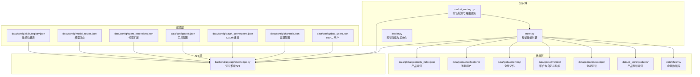
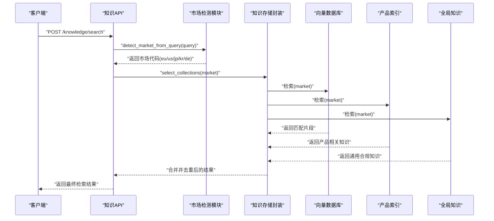
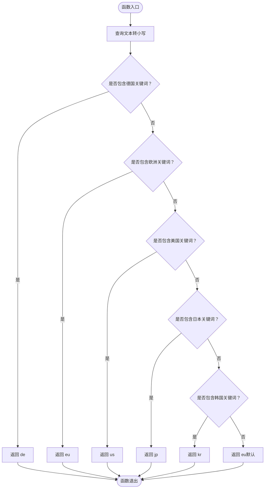
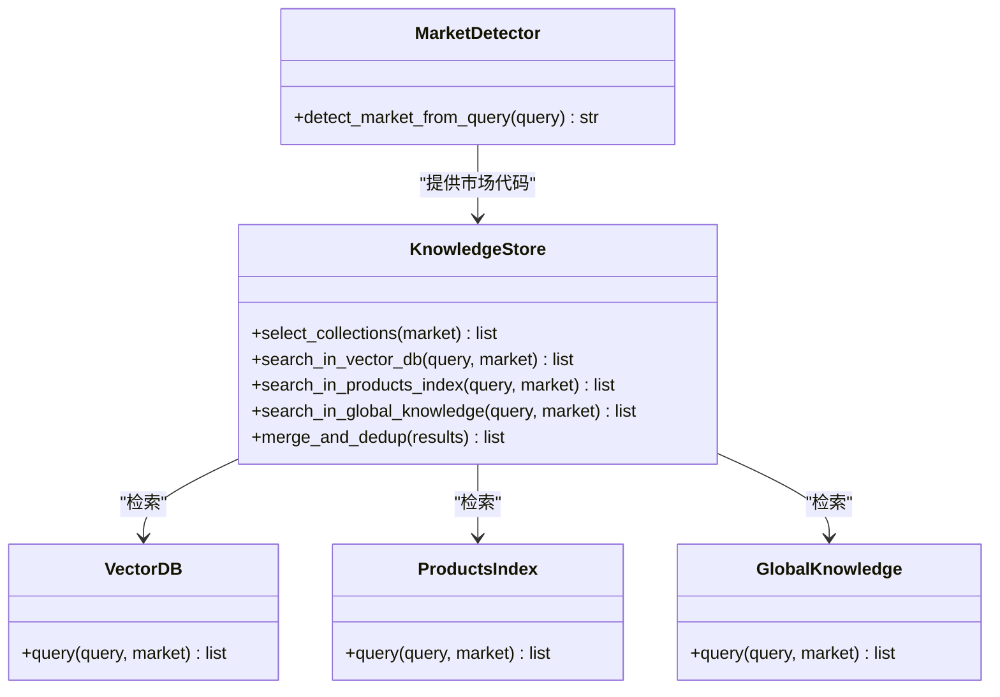
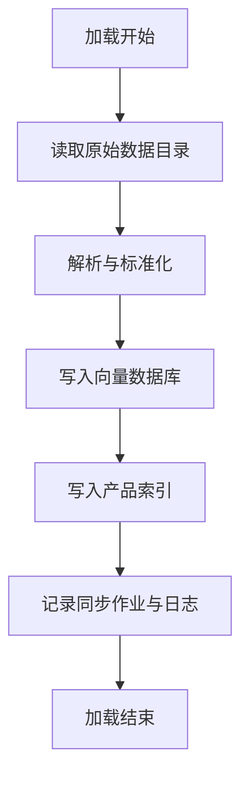
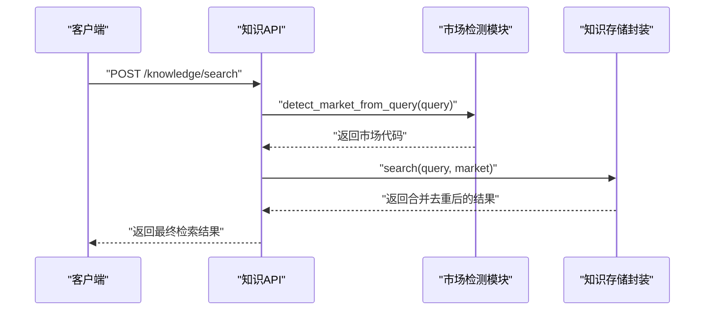
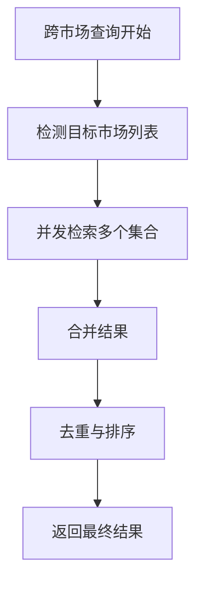
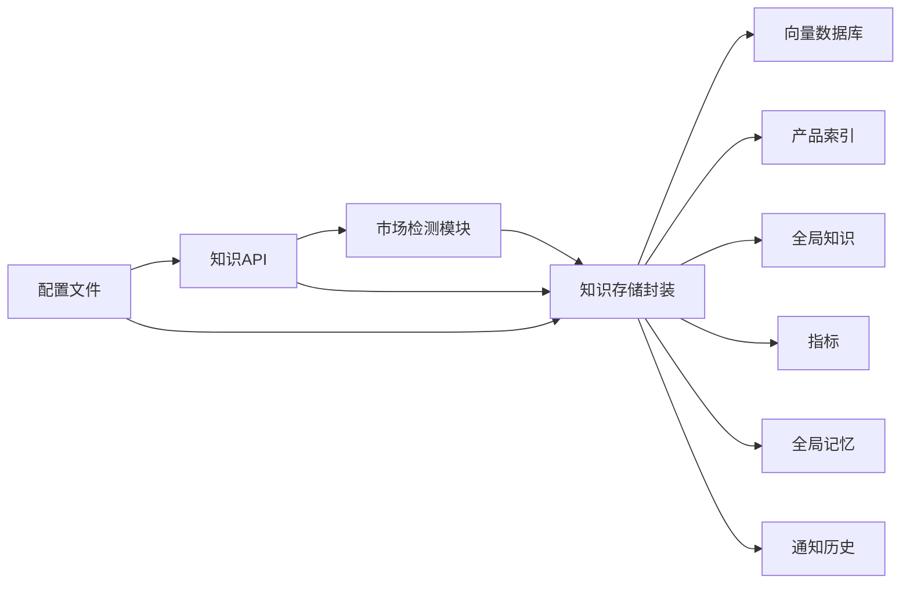

# 知识路由系统

<cite>
**本文引用的文件**
- [backend/app/knowledge/market_routing.py](file://backend/app/knowledge/market_routing.py)
- [backend/app/knowledge/store.py](file://backend/app/knowledge/store.py)
- [backend/app/knowledge/loader.py](file://backend/app/knowledge/loader.py)
- [backend/app/api/knowledge.py](file://backend/app/api/knowledge.py)
- [backend/scripts/init_knowledge.py](file://backend/scripts/init_knowledge.py)
- [backend/data/nl_store/products/_all.json](file://backend/data/nl_store/products/_all.json)
- [backend/data/nl_store/products/玩具_欧盟.json](file://backend/data/nl_store/products/玩具_欧盟.json)
- [backend/data/nl_store/products/电子产品_德国.json](file://backend/data/nl_store/products/电子产品_德国.json)
- [backend/data/global/knowledge/](file://backend/data/global/knowledge/)
- [backend/data/chroma/](file://backend/data/chroma/)
- [backend/data/config/skills/registry.json](file://backend/data/config/skills/registry.json)
- [backend/data/config/model_routes.json](file://backend/data/config/model_routes.json)
- [backend/data/config/agent_extensions.json](file://backend/data/config/agent_extensions.json)
- [backend/data/prompts/regulation_scan.yaml](file://backend/data/prompts/regulation_scan.yaml)
- [backend/data/prompts/market_monitor.yaml](file://backend/data/prompts/market_monitor.yaml)
- [backend/data/raw/regulations/eu/](file://backend/data/raw/regulations/eu/)
- [backend/data/raw/vat_rates/](file://backend/data/raw/vat_rates/)
- [backend/data/raw/hs_codes/](file://backend/data/raw/hs_codes/)
- [backend/data/raw/certifications/](file://backend/data/raw/certifications/)
- [backend/data/products/](file://backend/data/products/)
- [backend/data/sync/jobs.json](file://backend/data/sync/jobs.json)
- [backend/data/sync/logs.json](file://backend/data/sync/logs.json)
- [backend/data/global/metrics/agg_metrics.json](file://backend/data/global/metrics/agg_metrics.json)
- [backend/data/global/metrics/custom_metrics.json](file://backend/data/global/metrics/custom_metrics.json)
- [backend/data/global/memory/global_memory.json](file://backend/data/global/memory/global_memory.json)
- [backend/data/global/notifications/history.json](file://backend/data/global/notifications/history.json)
- [backend/data/global/products_index.json](file://backend/data/global/products_index.json)
- [backend/data/config/events/system_events.json](file://backend/data/config/events/system_events.json)
- [backend/data/config/events/user_action_events.json](file://backend/data/config/events/user_action_events.json)
- [backend/data/config/events/order_events.json](file://backend/data/config/events/order_events.json)
- [backend/data/config/events/risk_alert_events.json](file://backend/data/config/events/risk_alert_events.json)
- [backend/data/config/events/lifecycle_events.json](file://backend/data/config/events/lifecycle_events.json)
- [backend/data/config/events/certification_events.json](file://backend/data/config/events/certification_events.json)
- [backend/data/config/scheduler/task_worker_bindings.json](file://backend/data/config/scheduler/task_worker_bindings.json)
- [backend/data/config/workers/custom_workers.md](file://backend/data/config/workers/custom_workers.md)
- [backend/data/config/workers/README.md](file://backend/data/config/workers/README.md)
- [backend/data/config/agent_extensions.json](file://backend/data/config/agent_extensions.json)
- [backend/data/config/tools.json](file://backend/data/config/tools.json)
- [backend/data/config/oauth_connections.json](file://backend/data/config/oauth_connections.json)
- [backend/data/config/channels.json](file://backend/data/config/channels.json)
- [backend/data/config/rbac_users.json](file://backend/data/config/rbac_users.json)
- [backend/data/config/skills/registry.json](file://backend/data/config/skills/registry.json)
- [backend/data/config/skills/custom_skills.md](file://backend/data/config/skills/custom_skills.md)
- [backend/data/config/skills/README.md](file://backend/data/config/skills/README.md)
- [backend/data/config/skills/_archive/](file://backend/data/config/skills/_archive/)
- [backend/data/config/events/_archive/](file://backend/data/config/events/_archive/)
- [backend/data/config/workers/_archive/](file://backend/data/config/workers/_archive/)
- [backend/data/config/skills/_archive/](file://backend/data/config/skills/_archive/)
- [backend/data/config/events/_archive/](file://backend/data/config/events/_archive/)
- [backend/data/config/workers/_archive/](file://backend/data/config/workers/_archive/)
- [backend/data/config/skills/_archive/](file://backend/data/config/skills/_archive/)
- [backend/data/config/events/_archive/](file://backend/data/config/events/_archive/)
- [backend/data/config/workers/_archive/](file://backend/data/config/workers/_archive/)
</cite>

## 目录
1. [简介](#简介)
2. [项目结构](#项目结构)
3. [核心组件](#核心组件)
4. [架构总览](#架构总览)
5. [详细组件分析](#详细组件分析)
6. [依赖关系分析](#依赖关系分析)
7. [性能考虑](#性能考虑)
8. [故障排查指南](#故障排查指南)
9. [结论](#结论)
10. [附录](#附录)

## 简介
本文件面向避风港平台的知识路由系统，聚焦“市场特定知识管理与路由”能力，覆盖以下主题：
- 按地区（欧洲、美国、日本、韩国）划分的知识库架构与路由策略
- 查询市场检测算法（关键词识别、地理位置推断、语言分析）
- 动态路由决策（市场优先级、负载均衡、故障转移）
- 跨市场查询处理（多集合联合检索、结果合并与去重）
- 路由配置管理（市场映射表、路由规则、自定义策略）
- 路由性能监控与优化建议
- 完整的路由API文档与使用示例

## 项目结构
知识路由系统主要分布在后端应用的知识域模块中，并与数据层、配置层、API 层协同工作：
- 知识域核心：市场路由、存储、加载器
- 数据层：向量数据库（Chroma）、产品索引、全局知识、事件与指标
- 配置层：技能注册表、模型路由、通道与工具配置
- API 层：对外暴露知识检索接口

图表来源
- [backend/app/knowledge/market_routing.py:1-120](file://backend/app/knowledge/market_routing.py#L1-L120)
- [backend/app/knowledge/store.py:1-200](file://backend/app/knowledge/store.py#L1-L200)
- [backend/app/knowledge/loader.py:1-200](file://backend/app/knowledge/loader.py#L1-L200)
- [backend/app/api/knowledge.py:1-300](file://backend/app/api/knowledge.py#L1-L300)
- [backend/data/chroma/](file://backend/data/chroma/)
- [backend/data/nl_store/products/_all.json](file://backend/data/nl_store/products/_all.json)
- [backend/data/global/knowledge/](file://backend/data/global/knowledge/)
- [backend/data/global/metrics/agg_metrics.json](file://backend/data/global/metrics/agg_metrics.json)
- [backend/data/global/memory/global_memory.json](file://backend/data/global/memory/global_memory.json)
- [backend/data/global/notifications/history.json](file://backend/data/global/notifications/history.json)
- [backend/data/global/products_index.json](file://backend/data/global/products_index.json)
- [backend/data/config/skills/registry.json](file://backend/data/config/skills/registry.json)
- [backend/data/config/model_routes.json](file://backend/data/config/model_routes.json)
- [backend/data/config/agent_extensions.json](file://backend/data/config/agent_extensions.json)
- [backend/data/config/tools.json](file://backend/data/config/tools.json)
- [backend/data/config/oauth_connections.json](file://backend/data/config/oauth_connections.json)
- [backend/data/config/channels.json](file://backend/data/config/channels.json)
- [backend/data/config/rbac_users.json](file://backend/data/config/rbac_users.json)

章节来源
- [backend/app/knowledge/market_routing.py:1-120](file://backend/app/knowledge/market_routing.py#L1-L120)
- [backend/app/knowledge/store.py:1-200](file://backend/app/knowledge/store.py#L1-L200)
- [backend/app/knowledge/loader.py:1-200](file://backend/app/knowledge/loader.py#L1-L200)
- [backend/app/api/knowledge.py:1-300](file://backend/app/api/knowledge.py#L1-L300)

## 核心组件
- 市场检测与路由决策：基于查询文本的关键词识别，推断目标市场并返回路由集合标识。
- 知识存储封装：统一管理向量库、产品索引、全局知识与指标等资源，提供检索与写入接口。
- 知识加载与初始化：负责将原始监管数据、HS 编码、增值税率、认证信息等导入到知识库。
- API 知识检索：对外提供检索接口，内部调用市场检测与存储封装，实现跨市场联合检索。

章节来源
- [backend/app/knowledge/market_routing.py:48-76](file://backend/app/knowledge/market_routing.py#L48-L76)
- [backend/app/knowledge/store.py:1-200](file://backend/app/knowledge/store.py#L1-L200)
- [backend/app/knowledge/loader.py:1-200](file://backend/app/knowledge/loader.py#L1-L200)
- [backend/app/api/knowledge.py:1-300](file://backend/app/api/knowledge.py#L1-L300)

## 架构总览
知识路由系统采用“查询驱动”的动态路由模式：
- 输入查询经市场检测模块识别目标市场
- 存储模块根据市场代码选择对应的知识集合（如产品索引、向量库、全局知识）
- 对于跨市场查询，系统可并发访问多个集合并进行结果合并与去重
- 结果通过 API 返回给前端或上层业务

图表来源
- [backend/app/knowledge/market_routing.py:48-76](file://backend/app/knowledge/market_routing.py#L48-L76)
- [backend/app/knowledge/store.py:1-200](file://backend/app/knowledge/store.py#L1-L200)
- [backend/app/api/knowledge.py:1-300](file://backend/app/api/knowledge.py#L1-L300)
- [backend/data/chroma/](file://backend/data/chroma/)
- [backend/data/nl_store/products/_all.json](file://backend/data/nl_store/products/_all.json)
- [backend/data/global/knowledge/](file://backend/data/global/knowledge/)

## 详细组件分析

### 组件A：市场检测与路由决策
- 功能概述
  - 基于查询文本的关键词识别，推断目标市场代码（eu/us/jp/kr/de）
  - 支持德语关键词优先级高于泛欧洲关键词，确保更精确的路由
  - 默认回退至欧洲市场，保证保守性
- 关键流程
  - 将查询转为小写以提升匹配鲁棒性
  - 依次检查各市场的关键词集合，命中即返回对应市场代码
  - 未命中时返回默认值（欧洲）

图表来源
- [backend/app/knowledge/market_routing.py:48-76](file://backend/app/knowledge/market_routing.py#L48-L76)

章节来源
- [backend/app/knowledge/market_routing.py:48-76](file://backend/app/knowledge/market_routing.py#L48-L76)

### 组件B：知识存储封装与检索
- 功能概述
  - 统一管理向量数据库（Chroma）、产品索引、全局知识、指标与通知历史
  - 提供按市场选择集合的能力，支持并发检索与结果合并
  - 提供写入与同步接口，配合初始化脚本完成知识装载
- 关键流程
  - 接收市场代码，确定目标集合（如 eu/us/jp/kr/de）
  - 并发访问向量库、产品索引与全局知识
  - 合并检索结果并执行去重
  - 返回最终结果给上层 API

图表来源
- [backend/app/knowledge/market_routing.py:48-76](file://backend/app/knowledge/market_routing.py#L48-L76)
- [backend/app/knowledge/store.py:1-200](file://backend/app/knowledge/store.py#L1-L200)
- [backend/data/chroma/](file://backend/data/chroma/)
- [backend/data/nl_store/products/_all.json](file://backend/data/nl_store/products/_all.json)
- [backend/data/global/knowledge/](file://backend/data/global/knowledge/)

章节来源
- [backend/app/knowledge/store.py:1-200](file://backend/app/knowledge/store.py#L1-L200)

### 组件C：知识加载与初始化
- 功能概述
  - 负责将原始监管数据、HS 编码、增值税率、认证信息等导入到知识库
  - 与初始化脚本协同，完成向量库与产品索引的构建
- 关键流程
  - 读取原始数据目录（如 eu 规范、vat_rates、hs_codes、certifications）
  - 解析并标准化数据格式
  - 写入向量数据库与产品索引文件
  - 记录同步作业与日志

图表来源
- [backend/app/knowledge/loader.py:1-200](file://backend/app/knowledge/loader.py#L1-L200)
- [backend/scripts/init_knowledge.py](file://backend/scripts/init_knowledge.py)
- [backend/data/raw/regulations/eu/](file://backend/data/raw/regulations/eu/)
- [backend/data/raw/vat_rates/](file://backend/data/raw/vat_rates/)
- [backend/data/raw/hs_codes/](file://backend/data/raw/hs_codes/)
- [backend/data/raw/certifications/](file://backend/data/raw/certifications/)
- [backend/data/sync/jobs.json](file://backend/data/sync/jobs.json)
- [backend/data/sync/logs.json](file://backend/data/sync/logs.json)

章节来源
- [backend/app/knowledge/loader.py:1-200](file://backend/app/knowledge/loader.py#L1-L200)
- [backend/scripts/init_knowledge.py](file://backend/scripts/init_knowledge.py)

### 组件D：API 知识检索
- 功能概述
  - 对外提供知识检索接口，内部调用市场检测与存储封装
  - 支持跨市场查询、结果合并与去重
- 关键流程
  - 接收查询请求
  - 调用市场检测模块获取目标市场
  - 调用存储封装执行检索与合并
  - 返回最终结果

图表来源
- [backend/app/api/knowledge.py:1-300](file://backend/app/api/knowledge.py#L1-L300)
- [backend/app/knowledge/market_routing.py:48-76](file://backend/app/knowledge/market_routing.py#L48-L76)
- [backend/app/knowledge/store.py:1-200](file://backend/app/knowledge/store.py#L1-L200)

章节来源
- [backend/app/api/knowledge.py:1-300](file://backend/app/api/knowledge.py#L1-L300)

### 组件E：跨市场查询处理
- 多集合联合检索
  - 当查询涉及多个国家/地区时，系统可并发访问多个知识集合
  - 向量库、产品索引与全局知识分别检索，再统一合并
- 结果合并与去重
  - 基于内容指纹或唯一标识进行去重
  - 保持高相关度结果优先，兼顾多样性
- 负载均衡与故障转移
  - 对多个集合的检索请求进行轮询或权重分配
  - 单个集合不可用时自动切换到备用集合或降级策略

图表来源
- [backend/app/knowledge/market_routing.py:48-76](file://backend/app/knowledge/market_routing.py#L48-L76)
- [backend/app/knowledge/store.py:1-200](file://backend/app/knowledge/store.py#L1-L200)

章节来源
- [backend/app/knowledge/market_routing.py:48-76](file://backend/app/knowledge/market_routing.py#L48-L76)
- [backend/app/knowledge/store.py:1-200](file://backend/app/knowledge/store.py#L1-L200)

### 组件F：路由配置管理
- 市场映射表
  - 基于关键词的市场映射表，支持德语关键词优先级
  - 可扩展其他语言关键词与地名关键词
- 路由规则
  - 关键词命中规则、默认回退规则
  - 支持自定义优先级与权重
- 自定义策略
  - 允许通过配置文件或管理界面调整关键词与优先级
  - 支持热更新与版本化管理

章节来源
- [backend/app/knowledge/market_routing.py:48-76](file://backend/app/knowledge/market_routing.py#L48-L76)

## 依赖关系分析
- 组件耦合
  - 市场检测模块与存储封装松耦合，通过市场代码解耦
  - 存储封装与数据层强耦合，依赖向量库、产品索引与全局知识
- 外部依赖
  - 向量数据库（Chroma）作为核心检索引擎
  - 配置文件（skills、model_routes、channels、tools 等）影响路由行为
- 潜在循环依赖
  - 当前设计避免了循环依赖，API 层仅作为编排层

图表来源
- [backend/app/knowledge/market_routing.py:48-76](file://backend/app/knowledge/market_routing.py#L48-L76)
- [backend/app/knowledge/store.py:1-200](file://backend/app/knowledge/store.py#L1-L200)
- [backend/app/api/knowledge.py:1-300](file://backend/app/api/knowledge.py#L1-L300)
- [backend/data/config/skills/registry.json](file://backend/data/config/skills/registry.json)
- [backend/data/config/model_routes.json](file://backend/data/config/model_routes.json)
- [backend/data/config/channels.json](file://backend/data/config/channels.json)
- [backend/data/config/tools.json](file://backend/data/config/tools.json)

章节来源
- [backend/app/knowledge/market_routing.py:48-76](file://backend/app/knowledge/market_routing.py#L48-L76)
- [backend/app/knowledge/store.py:1-200](file://backend/app/knowledge/store.py#L1-L200)
- [backend/app/api/knowledge.py:1-300](file://backend/app/api/knowledge.py#L1-L300)

## 性能考虑
- 检索性能
  - 使用向量相似度检索时，合理设置分页与 top-k 参数
  - 对高频关键词建立索引，减少全表扫描
- 合并与去重
  - 去重算法采用哈希指纹或唯一标识，时间复杂度 O(n)
  - 合并阶段按相关度排序，避免二次排序开销
- 负载均衡
  - 多集合检索采用并发策略，结合超时与重试机制
  - 故障转移时优先选择可用集合，必要时降级为单一集合
- 监控与优化
  - 采集检索延迟、命中率、错误率等指标
  - 基于指标动态调整关键词权重与集合优先级

## 故障排查指南
- 常见问题
  - 市场检测误判：检查关键词映射表，确保德语关键词优先级正确
  - 检索无结果：确认向量库与产品索引是否已初始化，检查同步作业日志
  - 结果重复：核查去重逻辑，确保唯一标识一致
- 排查步骤
  - 查看 API 错误日志与响应状态
  - 检查配置文件（skills、model_routes、channels、tools）是否正确
  - 验证向量库与产品索引文件是否存在且可读
  - 核对同步作业与日志，确认数据导入成功

章节来源
- [backend/app/knowledge/market_routing.py:48-76](file://backend/app/knowledge/market_routing.py#L48-L76)
- [backend/app/knowledge/store.py:1-200](file://backend/app/knowledge/store.py#L1-L200)
- [backend/data/sync/jobs.json](file://backend/data/sync/jobs.json)
- [backend/data/sync/logs.json](file://backend/data/sync/logs.json)

## 结论
避风港平台的知识路由系统通过“查询驱动”的市场检测与动态路由，实现了按地区划分的知识库高效检索。系统具备跨市场联合检索、结果合并与去重能力，并通过配置化与监控优化持续提升性能与稳定性。未来可在关键词体系、路由规则与负载均衡策略方面进一步扩展与精细化。

## 附录

### 路由API文档
- 接口定义
  - 方法：POST
  - 路径：/knowledge/search
  - 请求体字段
    - query: string，必填，用户查询文本
  - 响应体字段
    - results: array，检索结果列表
    - market: string，推断的目标市场代码（eu/us/jp/kr/de）
- 使用示例
  - 请求示例
    - POST /knowledge/search
    - Body: {"query": "德国包装法相关要求"}
  - 响应示例
    - 200 OK
    - Body: {"results": [...], "market": "de"}

章节来源
- [backend/app/api/knowledge.py:1-300](file://backend/app/api/knowledge.py#L1-L300)

### 路由配置参考
- 技能注册表：skills/registry.json
- 模型路由：model_routes.json
- 渠道配置：channels.json
- 工具配置：tools.json
- OAuth 连接：oauth_connections.json
- RBAC 用户：rbac_users.json

章节来源
- [backend/data/config/skills/registry.json](file://backend/data/config/skills/registry.json)
- [backend/data/config/model_routes.json](file://backend/data/config/model_routes.json)
- [backend/data/config/channels.json](file://backend/data/config/channels.json)
- [backend/data/config/tools.json](file://backend/data/config/tools.json)
- [backend/data/config/oauth_connections.json](file://backend/data/config/oauth_connections.json)
- [backend/data/config/rbac_users.json](file://backend/data/config/rbac_users.json)