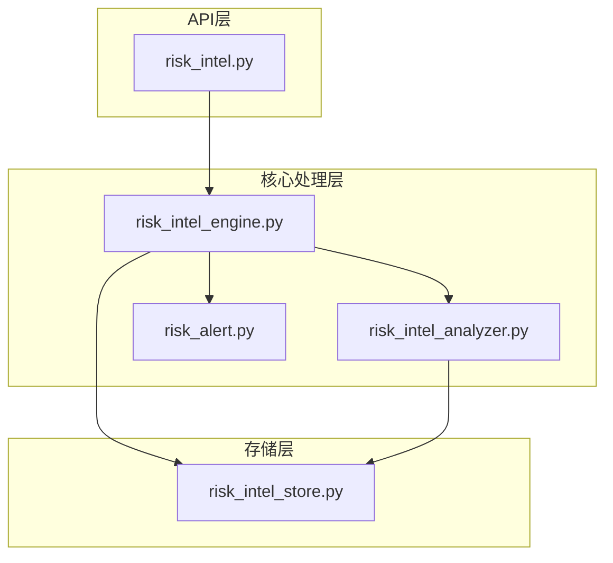
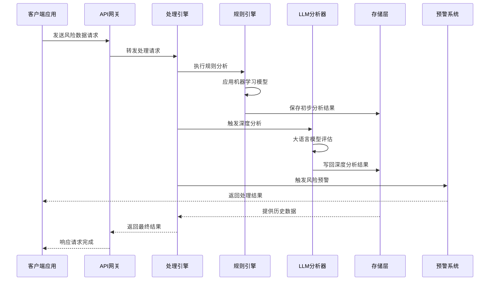
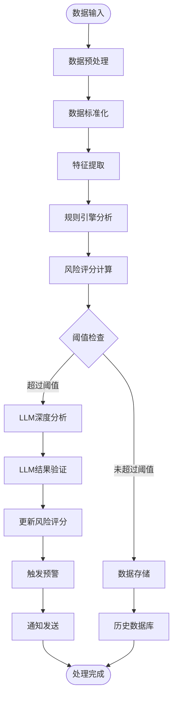
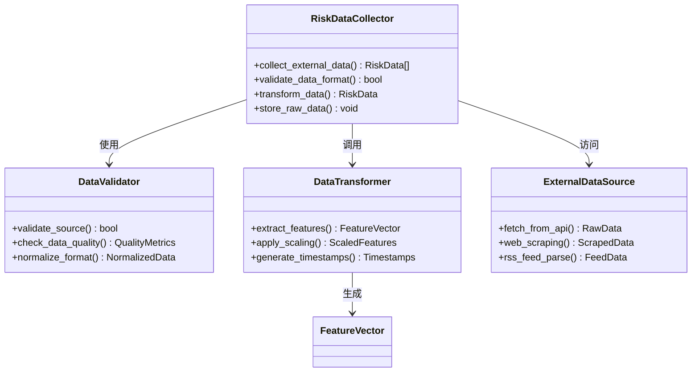
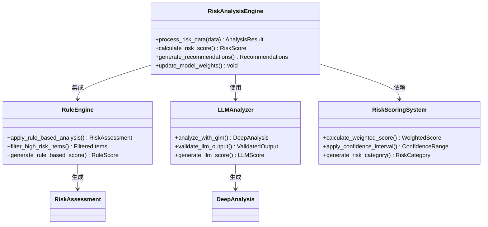
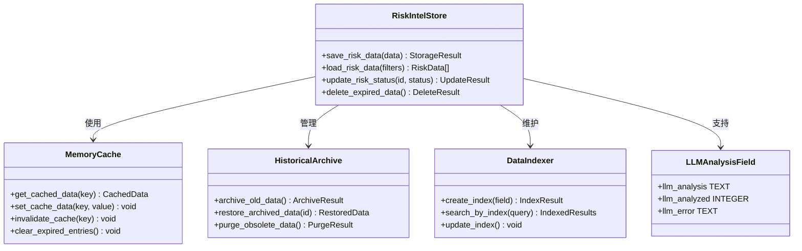
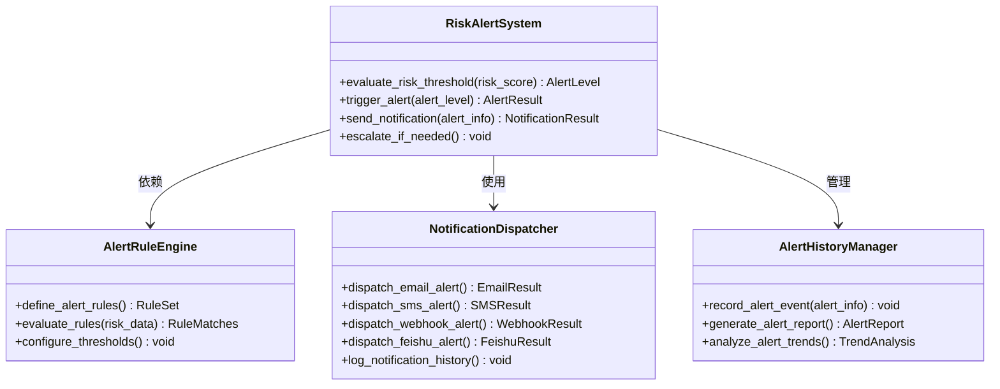
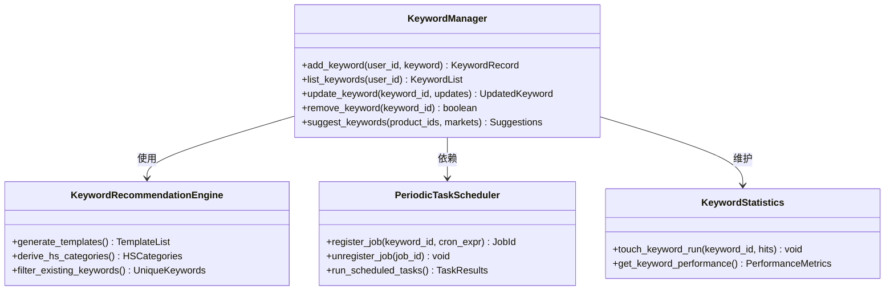
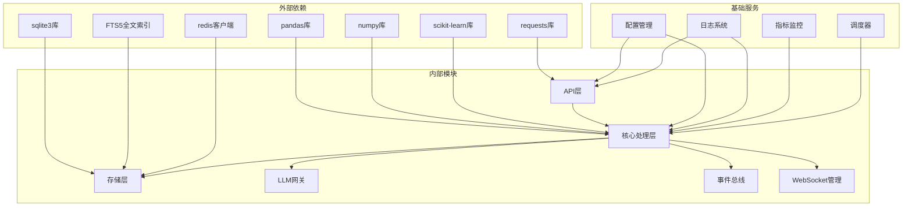

# 风险情报引擎

<cite>
**本文档引用的文件**
- [risk_intel.py](file://backend/app/api/risk_intel.py)
- [risk_intel_engine.py](file://backend/app/core/risk_intel_engine.py)
- [risk_intel_analyzer.py](file://backend/app/core/risk_intel_analyzer.py)
- [risk_intel_store.py](file://backend/app/storage/risk_intel_store.py)
- [risk_alert.py](file://backend/app/core/risk_alert.py)
- [main.py](file://backend/app/main.py)
- [config.py](file://backend/app/config.py)
- [README.md](file://README.md)
</cite>

## 更新摘要
**所做更改**
- 新增风险情报监控系统的完整功能模块分析
- 更新架构概览以反映新的双阶段分析流程
- 添加LLM分析器和规则引擎的详细说明
- 更新存储层架构以包含新的LLM分析字段
- 增强预警系统和通知机制的描述
- 完善关键词管理和自动推荐功能

## 目录
1. [简介](#简介)
2. [项目结构](#项目结构)
3. [核心组件](#核心组件)
4. [架构概览](#架构概览)
5. [详细组件分析](#详细组件分析)
6. [依赖关系分析](#依赖关系分析)
7. [性能考虑](#性能考虑)
8. [故障排除指南](#故障排除指南)
9. [结论](#结论)

## 简介

风险情报引擎是Astra平台的核心安全组件，负责收集、分析和处理各种商业风险信息。该系统通过多源数据采集、智能分析算法和实时预警机制，为用户提供全面的风险评估和决策支持。

系统采用模块化设计，包含数据采集层、分析处理层、存储管理层和应用接口层，形成了完整的风险情报处理流水线。最新的架构引入了双阶段分析机制，先通过规则引擎进行快速筛选，再通过LLM进行深度分析，大大提高了分析的准确性和效率。

## 项目结构

风险情报引擎位于后端应用的专门模块中，主要文件组织如下：

**图表来源**
- [risk_intel.py](file://backend/app/api/risk_intel.py)
- [risk_intel_engine.py](file://backend/app/core/risk_intel_engine.py)
- [risk_intel_store.py](file://backend/app/storage/risk_intel_store.py)

**章节来源**
- [risk_intel.py](file://backend/app/api/risk_intel.py)
- [risk_intel_engine.py](file://backend/app/core/risk_intel_engine.py)
- [risk_intel_store.py](file://backend/app/storage/risk_intel_store.py)

## 核心组件

### API接口层

风险情报引擎提供RESTful API接口，支持多种操作模式：

- **数据采集接口**：处理外部数据源的接入和验证
- **分析查询接口**：提供风险分析结果的查询和过滤功能
- **配置管理接口**：支持风险参数的动态配置和调整
- **实时监控接口**：提供流式数据传输和实时状态更新
- **LLM分析接口**：支持批量和单条LLM深度分析
- **关键词管理接口**：提供关键词的增删改查和推荐功能

### 核心处理引擎

引擎采用双阶段处理架构，每个阶段都有明确的职责分工：

- **数据预处理器**：负责原始数据的清洗、格式化和标准化
- **规则引擎分析器**：运用机器学习算法进行深度分析和模式识别
- **LLM深度分析器**：基于大语言模型进行精细化风险评估
- **风险评估器**：基于历史数据和当前趋势进行风险评分
- **预警触发器**：根据预设阈值自动触发相应的告警机制

### 存储管理层

系统采用多层存储策略，确保数据的安全性和可访问性：

- **内存缓存层**：提供高频访问数据的快速响应
- **持久化存储层**：保证数据的长期保存和备份
- **索引优化层**：支持复杂查询和快速检索
- **版本控制层**：维护数据变更历史和审计追踪
- **全文检索层**：基于FTS5实现高效的中文全文搜索

**章节来源**
- [risk_intel_engine.py](file://backend/app/core/risk_intel_engine.py)
- [risk_intel_analyzer.py](file://backend/app/core/risk_intel_analyzer.py)
- [risk_alert.py](file://backend/app/core/risk_alert.py)

## 架构概览

风险情报引擎采用事件驱动的微服务架构，实现了高度解耦和可扩展的设计：

**图表来源**
- [risk_intel.py](file://backend/app/api/risk_intel.py)
- [risk_intel_engine.py](file://backend/app/core/risk_intel_engine.py)
- [risk_alert.py](file://backend/app/core/risk_alert.py)

### 数据流架构

系统内部的数据流转遵循严格的处理流程：

**图表来源**
- [risk_intel_engine.py](file://backend/app/core/risk_intel_engine.py)
- [risk_intel_analyzer.py](file://backend/app/core/risk_intel_analyzer.py)
- [risk_alert.py](file://backend/app/core/risk_alert.py)

## 详细组件分析

### 风险数据采集组件

#### 采集器架构

#### 采集流程

数据采集过程包含多个验证和转换步骤：

1. **数据源验证**：确认外部数据源的合法性和可靠性
2. **格式标准化**：将不同格式的数据统一转换为标准结构
3. **质量检查**：评估数据的完整性和准确性
4. **特征工程**：提取对风险分析有意义的特征变量

**章节来源**
- [risk_intel_engine.py](file://backend/app/core/risk_intel_engine.py)

### 风险分析处理组件

#### 分析引擎架构

#### 分析算法实现

系统采用双阶段分析算法的组合：

- **规则引擎算法**：使用预定义规则和机器学习模型进行快速风险评估
- **LLM深度分析**：使用大语言模型进行精细化的风险分析和影响评估
- **混合评分算法**：结合规则引擎和LLM的结果生成最终风险评分
- **置信度评估**：为每个分析结果提供置信度评分

**章节来源**
- [risk_intel_engine.py](file://backend/app/core/risk_intel_engine.py)
- [risk_intel_analyzer.py](file://backend/app/core/risk_intel_analyzer.py)

### 风险存储组件

#### 存储架构设计

#### 存储策略

系统采用分层存储策略：

- **热数据存储**：最近30天的活跃数据存储在内存中
- **温数据存储**：1-12个月的历史数据存储在SSD中
- **冷数据存储**：超过一年的数据存储在传统硬盘中
- **归档数据管理**：定期清理过期数据，释放存储空间
- **全文检索支持**：基于FTS5实现高效的中文全文搜索

**章节来源**
- [risk_intel_store.py](file://backend/app/storage/risk_intel_store.py)

### 预警通知组件

#### 预警系统架构

#### 预警级别定义

系统定义了多级预警机制：

- **低风险**：正常范围内的波动，无需特别关注
- **中风险**：需要持续监控，准备应对措施
- **高风险**：需要立即采取行动，启动应急预案
- **严重风险**：紧急状态，需要最高级别的响应

**章节来源**
- [risk_alert.py](file://backend/app/core/risk_alert.py)

### 关键词管理系统

#### 关键词管理架构

#### 关键词推荐机制

系统提供智能关键词推荐功能：

- **基于产品HS编码的推荐**：根据产品类别推荐相关关键词
- **基于市场的推荐**：针对目标市场生成特定关键词
- **基于领域的推荐**：根据不同风险领域生成专业关键词
- **去重和排序**：确保推荐结果的独特性和相关性

**章节来源**
- [risk_intel_engine.py](file://backend/app/core/risk_intel_engine.py)

## 依赖关系分析

风险情报引擎的依赖关系呈现清晰的层次结构：

### 关键依赖特性

- **数据处理依赖**：大量使用pandas和numpy进行数据处理
- **机器学习依赖**：集成scikit-learn进行预测建模
- **缓存依赖**：使用Redis提高数据访问性能
- **网络依赖**：通过requests库访问外部API
- **全文检索依赖**：基于SQLite FTS5实现高效的中文搜索

**章节来源**
- [main.py](file://backend/app/main.py)
- [config.py](file://backend/app/config.py)

## 性能考虑

### 性能优化策略

风险情报引擎采用了多层次的性能优化措施：

#### 内存管理优化
- **分页加载**：大数据集采用分页方式加载，避免内存溢出
- **缓存策略**：智能缓存热点数据，减少重复计算
- **垃圾回收**：定期清理无用对象，保持内存清洁

#### 并行处理优化
- **多线程处理**：利用多核CPU并行处理分析任务
- **异步I/O**：非阻塞网络请求，提高系统吞吐量
- **批处理机制**：批量处理相似任务，减少系统开销
- **LLM并发分析**：支持多条情报的并发深度分析

#### 算法优化
- **特征选择**：只保留最有价值的特征变量
- **模型压缩**：减小机器学习模型的复杂度
- **索引优化**：建立高效的数据索引结构
- **全文检索优化**：基于FTS5实现高效的中文全文搜索

### 性能监控指标

系统监控以下关键性能指标：
- **响应时间**：单次请求的平均处理时间
- **吞吐量**：每秒处理的请求数量
- **内存使用率**：系统内存的使用情况
- **CPU利用率**：处理器资源的占用比例
- **并发连接数**：同时处理的用户连接数量
- **LLM分析队列长度**：待处理的深度分析任务数量

## 故障排除指南

### 常见问题诊断

#### 数据采集问题
- **症状**：无法从外部数据源获取数据
- **原因**：网络连接问题、API限制、认证失败
- **解决方案**：检查网络连接、验证API密钥、查看限流设置

#### 分析处理问题
- **症状**：分析结果不准确或延迟
- **原因**：模型过时、特征工程错误、数据质量问题
- **解决方案**：重新训练模型、检查特征提取逻辑、清理数据

#### 存储访问问题
- **症状**：数据读写失败或性能下降
- **原因**：存储空间不足、索引损坏、权限问题
- **解决方案**：清理存储空间、重建索引、检查权限设置

#### LLM分析问题
- **症状**：LLM分析失败或响应缓慢
- **原因**：LLM网关不可用、模型调用超时、API配额限制
- **解决方案**：检查LLM网关状态、调整超时设置、增加配额

### 调试工具和方法

系统提供了完善的调试和监控工具：

- **日志分析**：详细的日志记录和分析工具
- **性能剖析**：代码执行时间和资源消耗分析
- **内存检测**：内存泄漏检测和优化建议
- **网络监控**：外部API调用的监控和统计
- **LLM分析监控**：深度分析任务的状态跟踪

**章节来源**
- [risk_intel_engine.py](file://backend/app/core/risk_intel_engine.py)
- [risk_intel_store.py](file://backend/app/storage/risk_intel_store.py)

## 结论

风险情报引擎是一个功能完善、架构合理的安全分析系统。其设计特点包括：

### 技术优势
- **模块化设计**：清晰的分层架构便于维护和扩展
- **高性能处理**：多层优化确保系统的高效运行
- **智能化分析**：结合规则引擎和LLM提供准确的风险评估
- **实时响应**：快速的数据处理和预警机制
- **双阶段分析**：先规则后LLM的混合分析模式提高准确性

### 应用价值
- **风险防控**：帮助用户及时发现和应对各种商业风险
- **决策支持**：提供数据驱动的决策依据
- **合规保障**：满足监管要求和内部合规需要
- **成本优化**：通过预防性措施降低潜在损失
- **智能推荐**：基于产品和市场的关键词智能推荐

该系统为现代企业提供了强大的风险管理和智能分析能力，是构建数字化安全防护体系的重要组成部分。通过引入LLM深度分析和双阶段处理机制，系统在保证处理速度的同时显著提升了分析的准确性和实用性。