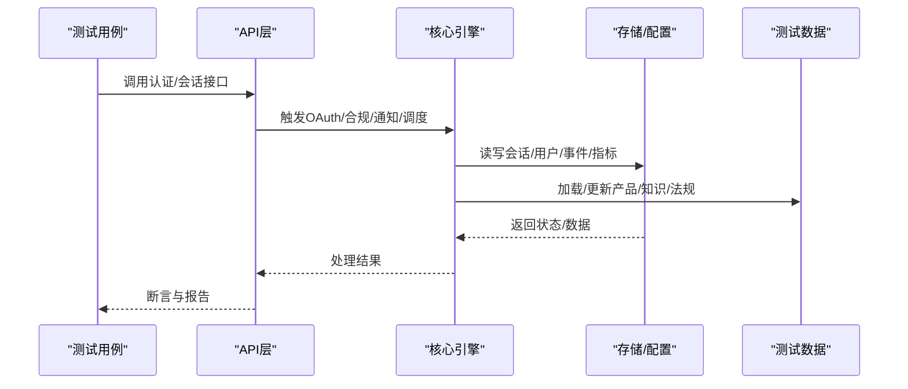
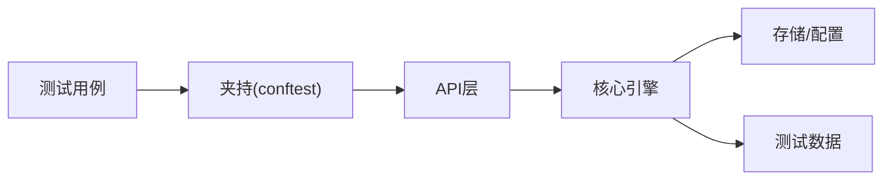

# 全业务流集成测试

<cite>
**本文引用的文件**
- [backend/tests/test_all_phases.py](file://backend/tests/test_all_phases.py)
- [backend/tests/test_full_business_flow.py](file://backend/tests/test_full_business_flow.py)
- [backend/tests/test_comprehensive_flow.py](file://backend/tests/test_comprehensive_flow.py)
- [backend/tests/conftest.py](file://backend/tests/conftest.py)
- [backend/tests/测试规范.md](file://backend/tests/测试规范.md)
- [backend/app/main.py](file://backend/app/main.py)
- [backend/app/api/auth.py](file://backend/app/api/auth.py)
- [backend/app/api/shopify.py](file://backend/app/api/shopify.py)
- [backend/app/api/products.py](file://backend/app/api/products.py)
- [backend/app/api/skills.py](file://backend/app/api/skills.py)
- [backend/app/api/tools.py](file://backend/app/api/tools.py)
- [backend/app/api/knowledge.py](file://backend/app/api/knowledge.py)
- [backend/app/api/memory.py](file://backend/app/api/memory.py)
- [backend/app/api/risk.py](file://backend/app/api/risk.py)
- [backend/app/api/notifications.py](file://backend/app/api/notifications.py)
- [backend/app/api/metrics.py](file://backend/app/api/metrics.py)
- [backend/app/api/cli.py](file://backend/app/api/cli.py)
- [backend/app/api/streaming.py](file://backend/app/api/streaming.py)
- [backend/app/api/pipeline.py](file://backend/app/api/pipeline.py)
- [backend/app/api/sessions.py](file://backend/app/api/sessions.py)
- [backend/app/api/admin.py](file://backend/app/api/admin.py)
- [backend/app/api/users.py](file://backend/app/api/users.py)
- [backend/app/api/event_config.py](file://backend/app/api/event_config.py)
- [backend/app/api/scheduler_config.py](file://backend/app/api/scheduler_config.py)
- [backend/app/api/worker_config.py](file://backend/app/api/worker_config.py)
- [backend/app/core/oauth_manager.py](file://backend/app/core/oauth_manager.py)
- [backend/app/core/compliance_flow.py](file://backend/app/core/compliance_flow.py)
- [backend/app/core/notification_engine.py](file://backend/app/core/notification_engine.py)
- [backend/app/core/proactive_engine.py](file://backend/app/core/proactive_engine.py)
- [backend/app/core/risk_alert.py](file://backend/app/core/risk_alert.py)
- [backend/app/core/scheduler.py](file://backend/app/core/scheduler.py)
- [backend/app/storage/session_store.py](file://backend/app/storage/session_store.py)
- [backend/app/storage/user_store.py](file://backend/app/storage/user_store.py)
- [backend/data/config/oauth_connections.json](file://backend/data/config/oauth_connections.json)
- [backend/data/config/rbac_users.json](file://backend/data/config/rbac_users.json)
- [backend/data/config/tools.json](file://backend/data/config/tools.json)
- [backend/data/config/skills/registry.json](file://backend/data/config/skills/registry.json)
- [backend/data/global/events/bus.json](file://backend/data/global/events/bus.json)
- [backend/data/global/notifications/history.json](file://backend/data/global/notifications/history.json)
- [backend/data/global/metrics/custom_metrics.json](file://backend/data/global/metrics/custom_metrics.json)
- [backend/data/global/products_index.json](file://backend/data/global/products_index.json)
- [backend/data/chroma](file://backend/data/chroma)
- [backend/data/nl_store/products](file://backend/data/nl_store/products)
- [backend/data/products](file://backend/data/products)
- [backend/data/raw/regulations/eu](file://backend/data/raw/regulations/eu)
- [backend/data/raw/vat_rates](file://backend/data/raw/vat_rates)
- [backend/data/raw/hs_codes](file://backend/data/raw/hs_codes)
- [backend/data/raw/certifications](file://backend/data/raw/certifications)
- [backend/scripts/init_knowledge.py](file://backend/scripts/init_knowledge.py)
- [backend/scripts/fetch_regulations.py](file://backend/scripts/fetch_regulations.py)
- [backend/scripts/migrate_storage.py](file://backend/scripts/migrate_storage.py)
- [backend/pytest.ini](file://backend/pytest.ini)
- [README.md](file://README.md)
</cite>

## 目录
1. [简介](#简介)
2. [项目结构](#项目结构)
3. [核心组件](#核心组件)
4. [架构总览](#架构总览)
5. [详细组件分析](#详细组件分析)
6. [依赖关系分析](#依赖关系分析)
7. [性能考虑](#性能考虑)
8. [故障排查指南](#故障排查指南)
9. [结论](#结论)
10. [附录](#附录)

## 简介
本文件面向避风港平台的全业务流集成测试，围绕16个Phase的完整业务场景进行测试设计与实现方法说明，涵盖基础健康认证、Shopify OAuth集成、产品管理、Agent配置、Skills管理、Tools管理、OAuth集成、合规流水线、CLI命令、SSE流式对话、风险预警通知、指标监控主动引擎、记忆知识库、定时任务、权限管理、端到端场景等。文档同时介绍TestReport质量收集器的使用与业务流程验证方法，提供测试执行策略、性能监控与问题排查建议，并给出测试数据准备与具体业务流测试代码示例的定位路径。

## 项目结构
后端采用Python FastAPI框架，测试位于backend/tests目录，核心API在backend/app/api下，核心业务逻辑在backend/app/core中，测试数据与配置在backend/data目录中。前端位于frontend/src，通过API与后端交互。

```mermaid
graph TB
subgraph "测试层"
T1["test_all_phases.py"]
T2["test_full_business_flow.py"]
T3["test_comprehensive_flow.py"]
T4["conftest.py"]
T5["测试规范.md"]
end
subgraph "后端API"
A1["auth.py"]
A2["shopify.py"]
A3["products.py"]
A4["skills.py"]
A5["tools.py"]
A6["knowledge.py"]
A7["memory.py"]
A8["risk.py"]
A9["notifications.py"]
A10["metrics.py"]
A11["cli.py"]
A12["streaming.py"]
A13["pipeline.py"]
A14["sessions.py"]
A15["admin.py"]
A16["users.py"]
A17["event_config.py"]
A18["scheduler_config.py"]
A19["worker_config.py"]
end
subgraph "核心引擎"
C1["oauth_manager.py"]
C2["compliance_flow.py"]
C3["notification_engine.py"]
C4["proactive_engine.py"]
C5["risk_alert.py"]
C6["scheduler.py"]
end
subgraph "存储与数据"
S1["session_store.py"]
S2["user_store.py"]
D1["data/config/oauth_connections.json"]
D2["data/config/rbac_users.json"]
D3["data/config/tools.json"]
D4["data/global/*"]
D5["data/products/*"]
D6["data/raw/*"]
end
T1 --> A1
T2 --> A2
T3 --> A3
T4 --> A4
T5 --> A5
A1 --> C1
A2 --> C2
A3 --> C3
A4 --> C4
A5 --> C5
A6 --> C6
A7 --> S1
A8 --> S2
A9 --> D1
A10 --> D2
A11 --> D3
A12 --> D4
A13 --> D5
A14 --> D6
```

**图表来源**
- [backend/tests/test_all_phases.py](file://backend/tests/test_all_phases.py)
- [backend/app/api/auth.py](file://backend/app/api/auth.py)
- [backend/app/api/shopify.py](file://backend/app/api/shopify.py)
- [backend/app/api/products.py](file://backend/app/api/products.py)
- [backend/app/api/skills.py](file://backend/app/api/skills.py)
- [backend/app/api/tools.py](file://backend/app/api/tools.py)
- [backend/app/api/knowledge.py](file://backend/app/api/knowledge.py)
- [backend/app/api/memory.py](file://backend/app/api/memory.py)
- [backend/app/api/risk.py](file://backend/app/api/risk.py)
- [backend/app/api/notifications.py](file://backend/app/api/notifications.py)
- [backend/app/api/metrics.py](file://backend/app/api/metrics.py)
- [backend/app/api/cli.py](file://backend/app/api/cli.py)
- [backend/app/api/streaming.py](file://backend/app/api/streaming.py)
- [backend/app/api/pipeline.py](file://backend/app/api/pipeline.py)
- [backend/app/api/sessions.py](file://backend/app/api/sessions.py)
- [backend/app/api/admin.py](file://backend/app/api/admin.py)
- [backend/app/api/users.py](file://backend/app/api/users.py)
- [backend/app/api/event_config.py](file://backend/app/api/event_config.py)
- [backend/app/api/scheduler_config.py](file://backend/app/api/scheduler_config.py)
- [backend/app/api/worker_config.py](file://backend/app/api/worker_config.py)
- [backend/app/core/oauth_manager.py](file://backend/app/core/oauth_manager.py)
- [backend/app/core/compliance_flow.py](file://backend/app/core/compliance_flow.py)
- [backend/app/core/notification_engine.py](file://backend/app/core/notification_engine.py)
- [backend/app/core/proactive_engine.py](file://backend/app/core/proactive_engine.py)
- [backend/app/core/risk_alert.py](file://backend/app/core/risk_alert.py)
- [backend/app/core/scheduler.py](file://backend/app/core/scheduler.py)
- [backend/app/storage/session_store.py](file://backend/app/storage/session_store.py)
- [backend/app/storage/user_store.py](file://backend/app/storage/user_store.py)
- [backend/data/config/oauth_connections.json](file://backend/data/config/oauth_connections.json)
- [backend/data/config/rbac_users.json](file://backend/data/config/rbac_users.json)
- [backend/data/config/tools.json](file://backend/data/config/tools.json)
- [backend/data/global/*](file://backend/data/global/)
- [backend/data/products/*](file://backend/data/products/)
- [backend/data/raw/*](file://backend/data/raw/)

**章节来源**
- [backend/tests/test_all_phases.py](file://backend/tests/test_all_phases.py)
- [backend/tests/test_full_business_flow.py](file://backend/tests/test_full_business_flow.py)
- [backend/tests/test_comprehensive_flow.py](file://backend/tests/test_comprehensive_flow.py)
- [backend/tests/conftest.py](file://backend/tests/conftest.py)
- [backend/tests/测试规范.md](file://backend/tests/测试规范.md)

## 核心组件
- 测试框架与夹持：pytest + conftest.py提供全局fixture（数据库、用户、会话、OAuth连接等），确保各Phase独立且可重复执行。
- API层：认证、Shopify集成、产品、Skills、Tools、知识库、记忆、风险、通知、指标、CLI、SSE、合规流水线、会话、管理员、用户、事件配置、调度器配置、Worker配置等。
- 核心引擎：OAuth管理、合规流水线、通知引擎、主动监控引擎、风险预警、调度器。
- 存储与数据：会话存储、用户存储；配置文件（OAuth连接、RBAC用户、Tools、Skills注册表）；全局事件总线、通知历史、指标、产品索引；产品数据、原始法规/税号/证书等。

**章节来源**
- [backend/tests/conftest.py](file://backend/tests/conftest.py)
- [backend/app/api/auth.py](file://backend/app/api/auth.py)
- [backend/app/api/shopify.py](file://backend/app/api/shopify.py)
- [backend/app/api/products.py](file://backend/app/api/products.py)
- [backend/app/api/skills.py](file://backend/app/api/skills.py)
- [backend/app/api/tools.py](file://backend/app/api/tools.py)
- [backend/app/api/knowledge.py](file://backend/app/api/knowledge.py)
- [backend/app/api/memory.py](file://backend/app/api/memory.py)
- [backend/app/api/risk.py](file://backend/app/api/risk.py)
- [backend/app/api/notifications.py](file://backend/app/api/notifications.py)
- [backend/app/api/metrics.py](file://backend/app/api/metrics.py)
- [backend/app/api/cli.py](file://backend/app/api/cli.py)
- [backend/app/api/streaming.py](file://backend/app/api/streaming.py)
- [backend/app/api/pipeline.py](file://backend/app/api/pipeline.py)
- [backend/app/api/sessions.py](file://backend/app/api/sessions.py)
- [backend/app/api/admin.py](file://backend/app/api/admin.py)
- [backend/app/api/users.py](file://backend/app/api/users.py)
- [backend/app/api/event_config.py](file://backend/app/api/event_config.py)
- [backend/app/api/scheduler_config.py](file://backend/app/api/scheduler_config.py)
- [backend/app/api/worker_config.py](file://backend/app/api/worker_config.py)
- [backend/app/core/oauth_manager.py](file://backend/app/core/oauth_manager.py)
- [backend/app/core/compliance_flow.py](file://backend/app/core/compliance_flow.py)
- [backend/app/core/notification_engine.py](file://backend/app/core/notification_engine.py)
- [backend/app/core/proactive_engine.py](file://backend/app/core/proactive_engine.py)
- [backend/app/core/risk_alert.py](file://backend/app/core/risk_alert.py)
- [backend/app/core/scheduler.py](file://backend/app/core/scheduler.py)
- [backend/app/storage/session_store.py](file://backend/app/storage/session_store.py)
- [backend/app/storage/user_store.py](file://backend/app/storage/user_store.py)
- [backend/data/config/oauth_connections.json](file://backend/data/config/oauth_connections.json)
- [backend/data/config/rbac_users.json](file://backend/data/config/rbac_users.json)
- [backend/data/config/tools.json](file://backend/data/config/tools.json)
- [backend/data/config/skills/registry.json](file://backend/data/config/skills/registry.json)
- [backend/data/global/events/bus.json](file://backend/data/global/events/bus.json)
- [backend/data/global/notifications/history.json](file://backend/data/global/notifications/history.json)
- [backend/data/global/metrics/custom_metrics.json](file://backend/data/global/metrics/custom_metrics.json)
- [backend/data/global/products_index.json](file://backend/data/global/products_index.json)

## 架构总览
测试架构以Phase为单位串联各模块，通过API层调用核心引擎，核心引擎与存储/数据配置交互，最终形成端到端业务闭环。测试夹持负责环境初始化与清理，确保每个Phase独立可控。

**图表来源**
- [backend/tests/test_all_phases.py](file://backend/tests/test_all_phases.py)
- [backend/app/api/auth.py](file://backend/app/api/auth.py)
- [backend/app/core/oauth_manager.py](file://backend/app/core/oauth_manager.py)
- [backend/app/core/compliance_flow.py](file://backend/app/core/compliance_flow.py)
- [backend/app/core/notification_engine.py](file://backend/app/core/notification_engine.py)
- [backend/app/core/scheduler.py](file://backend/app/core/scheduler.py)
- [backend/app/storage/session_store.py](file://backend/app/storage/session_store.py)
- [backend/data/global/*](file://backend/data/global/)

## 详细组件分析

### Phase 1：基础健康认证
- 目标：验证服务可用性与认证流程。
- 关键API：认证接口、会话管理。
- 断言点：返回码、Token有效性、会话持久化。
- 数据准备：用户凭据、会话存储。
- 示例定位：
  - [backend/tests/test_all_phases.py](file://backend/tests/test_all_phases.py)
  - [backend/app/api/auth.py](file://backend/app/api/auth.py)
  - [backend/app/api/sessions.py](file://backend/app/api/sessions.py)
  - [backend/app/storage/session_store.py](file://backend/app/storage/session_store.py)

**章节来源**
- [backend/tests/test_all_phases.py](file://backend/tests/test_all_phases.py)
- [backend/app/api/auth.py](file://backend/app/api/auth.py)
- [backend/app/api/sessions.py](file://backend/app/api/sessions.py)
- [backend/app/storage/session_store.py](file://backend/app/storage/session_store.py)

### Phase 2：Shopify OAuth集成
- 目标：验证Shopify OAuth授权、回调与数据同步。
- 关键API：Shopify集成接口、OAuth管理。
- 断言点：授权URL生成、回调参数校验、商品数据同步。
- 数据准备：OAuth连接配置、Webhook日志。
- 示例定位：
  - [backend/tests/test_full_business_flow.py](file://backend/tests/test_full_business_flow.py)
  - [backend/app/api/shopify.py](file://backend/app/api/shopify.py)
  - [backend/app/core/oauth_manager.py](file://backend/app/core/oauth_manager.py)
  - [backend/data/config/oauth_connections.json](file://backend/data/config/oauth_connections.json)
  - [backend/data/shopify/webhooks/unknown.jsonl](file://backend/data/shopify/webhooks/unknown.jsonl)

**章节来源**
- [backend/tests/test_full_business_flow.py](file://backend/tests/test_full_business_flow.py)
- [backend/app/api/shopify.py](file://backend/app/api/shopify.py)
- [backend/app/core/oauth_manager.py](file://backend/app/core/oauth_manager.py)
- [backend/data/config/oauth_connections.json](file://backend/data/config/oauth_connections.json)
- [backend/data/shopify/webhooks/unknown.jsonl](file://backend/data/shopify/webhooks/unknown.jsonl)

### Phase 3：产品管理
- 目标：验证产品增删改查、索引与事件链。
- 关键API：产品接口、事件配置。
- 断言点：产品存在性、索引一致性、事件链触发。
- 数据准备：产品JSON、事件链文件、全局产品索引。
- 示例定位：
  - [backend/tests/test_comprehensive_flow.py](file://backend/tests/test_comprehensive_flow.py)
  - [backend/app/api/products.py](file://backend/app/api/products.py)
  - [backend/app/api/event_config.py](file://backend/app/api/event_config.py)
  - [backend/data/global/products_index.json](file://backend/data/global/products_index.json)
  - [backend/data/products/p_E2E测_*/product.json](file://backend/data/products/)

**章节来源**
- [backend/tests/test_comprehensive_flow.py](file://backend/tests/test_comprehensive_flow.py)
- [backend/app/api/products.py](file://backend/app/api/products.py)
- [backend/app/api/event_config.py](file://backend/app/api/event_config.py)
- [backend/data/global/products_index.json](file://backend/data/global/products_index.json)
- [backend/data/products/p_E2E测_*/product.json](file://backend/data/products/)

### Phase 4：Agent配置
- 目标：验证Agent扩展、Worker绑定与自定义配置。
- 关键API：Worker配置、事件配置。
- 断言点：配置加载、Worker绑定、事件路由。
- 数据准备：Agent扩展配置、Worker绑定映射。
- 示例定位：
  - [backend/tests/test_all_phases.py](file://backend/tests/test_all_phases.py)
  - [backend/app/api/worker_config.py](file://backend/app/api/worker_config.py)
  - [backend/app/api/event_config.py](file://backend/app/api/event_config.py)
  - [backend/data/config/agent_extensions.json](file://backend/data/config/agent_extensions.json)
  - [backend/data/config/workers/custom_workers.md](file://backend/data/config/workers/)

**章节来源**
- [backend/tests/test_all_phases.py](file://backend/tests/test_all_phases.py)
- [backend/app/api/worker_config.py](file://backend/app/api/worker_config.py)
- [backend/app/api/event_config.py](file://backend/app/api/event_config.py)
- [backend/data/config/agent_extensions.json](file://backend/data/config/agent_extensions.json)
- [backend/data/config/workers/custom_workers.md](file://backend/data/config/workers/)

### Phase 5：Skills管理
- 目标：验证Skill注册、加载与执行。
- 关键API：Skills接口、技能注册表。
- 断言点：技能可见性、执行结果、注册表一致性。
- 数据准备：技能目录、注册表JSON。
- 示例定位：
  - [backend/tests/test_all_phases.py](file://backend/tests/test_all_phases.py)
  - [backend/app/api/skills.py](file://backend/app/api/skills.py)
  - [backend/data/config/skills/registry.json](file://backend/data/config/skills/registry.json)
  - [.agents/skills/*/SKILL.md](file://.agents/skills/)

**章节来源**
- [backend/tests/test_all_phases.py](file://backend/tests/test_all_phases.py)
- [backend/app/api/skills.py](file://backend/app/api/skills.py)
- [backend/data/config/skills/registry.json](file://backend/data/config/skills/registry.json)
- [.agents/skills/*/SKILL.md](file://.agents/skills/)

### Phase 6：Tools管理
- 目标：验证工具注册、可用性与执行。
- 关键API：Tools接口、工具配置。
- 断言点：工具列表、执行结果、配置生效。
- 数据准备：工具配置JSON。
- 示例定位：
  - [backend/tests/test_all_phases.py](file://backend/tests/test_all_phases.py)
  - [backend/app/api/tools.py](file://backend/app/api/tools.py)
  - [backend/data/config/tools.json](file://backend/data/config/tools.json)

**章节来源**
- [backend/tests/test_all_phases.py](file://backend/tests/test_all_phases.py)
- [backend/app/api/tools.py](file://backend/app/api/tools.py)
- [backend/data/config/tools.json](file://backend/data/config/tools.json)

### Phase 7：OAuth集成
- 目标：验证通用OAuth连接与令牌管理。
- 关键API：OAuth管理、连接配置。
- 断言点：连接建立、令牌刷新、错误处理。
- 数据准备：OAuth连接配置。
- 示例定位：
  - [backend/tests/test_all_phases.py](file://backend/tests/test_all_phases.py)
  - [backend/app/core/oauth_manager.py](file://backend/app/core/oauth_manager.py)
  - [backend/data/config/oauth_connections.json](file://backend/data/config/oauth_connections.json)

**章节来源**
- [backend/tests/test_all_phases.py](file://backend/tests/test_all_phases.py)
- [backend/app/core/oauth_manager.py](file://backend/app/core/oauth_manager.py)
- [backend/data/config/oauth_connections.json](file://backend/data/config/oauth_connections.json)

### Phase 8：合规流水线
- 目标：验证法规扫描、合规检查与事件链。
- 关键API：合规流水线、事件链。
- 断言点：法规匹配、合规状态、事件触发。
- 数据准备：法规数据、事件链文件。
- 示例定位：
  - [backend/tests/test_comprehensive_flow.py](file://backend/tests/test_comprehensive_flow.py)
  - [backend/app/core/compliance_flow.py](file://backend/app/core/compliance_flow.py)
  - [backend/data/raw/regulations/eu](file://backend/data/raw/regulations/eu)
  - [backend/data/chains/events/*.json](file://backend/data/chains/events/)

**章节来源**
- [backend/tests/test_comprehensive_flow.py](file://backend/tests/test_comprehensive_flow.py)
- [backend/app/core/compliance_flow.py](file://backend/app/core/compliance_flow.py)
- [backend/data/raw/regulations/eu](file://backend/data/raw/regulations/eu)
- [backend/data/chains/events/*.json](file://backend/data/chains/events/)

### Phase 9：CLI命令
- 目标：验证CLI命令执行与输出。
- 关键API：CLI接口。
- 断言点：命令解析、执行结果、错误码。
- 数据准备：命令输入与期望输出。
- 示例定位：
  - [backend/tests/test_all_phases.py](file://backend/tests/test_all_phases.py)
  - [backend/app/api/cli.py](file://backend/app/api/cli.py)

**章节来源**
- [backend/tests/test_all_phases.py](file://backend/tests/test_all_phases.py)
- [backend/app/api/cli.py](file://backend/app/api/cli.py)

### Phase 10：SSE流式对话
- 目标：验证SSE实时流式对话。
- 关键API：SSE接口、会话管理。
- 断言点：流式数据分片、会话状态、异常恢复。
- 数据准备：会话数据、流式消息。
- 示例定位：
  - [backend/tests/test_all_phases.py](file://backend/tests/test_all_phases.py)
  - [backend/app/api/streaming.py](file://backend/app/api/streaming.py)
  - [backend/app/api/sessions.py](file://backend/app/api/sessions.py)

**章节来源**
- [backend/tests/test_all_phases.py](file://backend/tests/test_all_phases.py)
- [backend/app/api/streaming.py](file://backend/app/api/streaming.py)
- [backend/app/api/sessions.py](file://backend/app/api/sessions.py)

### Phase 11：风险预警通知
- 目标：验证风险检测与通知发送。
- 关键API：风险接口、通知引擎。
- 断言点：风险事件识别、通知发送、历史记录。
- 数据准备：风险规则、通知历史。
- 示例定位：
  - [backend/tests/test_comprehensive_flow.py](file://backend/tests/test_comprehensive_flow.py)
  - [backend/app/api/risk.py](file://backend/app/api/risk.py)
  - [backend/app/core/risk_alert.py](file://backend/app/core/risk_alert.py)
  - [backend/app/core/notification_engine.py](file://backend/app/core/notification_engine.py)
  - [backend/data/global/notifications/history.json](file://backend/data/global/notifications/history.json)

**章节来源**
- [backend/tests/test_comprehensive_flow.py](file://backend/tests/test_comprehensive_flow.py)
- [backend/app/api/risk.py](file://backend/app/api/risk.py)
- [backend/app/core/risk_alert.py](file://backend/app/core/risk_alert.py)
- [backend/app/core/notification_engine.py](file://backend/app/core/notification_engine.py)
- [backend/data/global/notifications/history.json](file://backend/data/global/notifications/history.json)

### Phase 12：指标监控主动引擎
- 目标：验证指标采集与主动监控。
- 关键API：指标接口、主动引擎。
- 断言点：指标聚合、阈值告警、报告生成。
- 数据准备：自定义指标、聚合配置。
- 示例定位：
  - [backend/tests/test_comprehensive_flow.py](file://backend/tests/test_comprehensive_flow.py)
  - [backend/app/api/metrics.py](file://backend/app/api/metrics.py)
  - [backend/app/core/proactive_engine.py](file://backend/app/core/proactive_engine.py)
  - [backend/data/global/metrics/custom_metrics.json](file://backend/data/global/metrics/custom_metrics.json)

**章节来源**
- [backend/tests/test_comprehensive_flow.py](file://backend/tests/test_comprehensive_flow.py)
- [backend/app/api/metrics.py](file://backend/app/api/metrics.py)
- [backend/app/core/proactive_engine.py](file://backend/app/core/proactive_engine.py)
- [backend/data/global/metrics/custom_metrics.json](file://backend/data/global/metrics/custom_metrics.json)

### Phase 13：记忆知识库
- 目标：验证记忆树、用户/会话/项目记忆。
- 关键API：记忆接口、知识库。
- 断言点：记忆读写、检索结果、上下文保留。
- 数据准备：记忆JSON、知识库数据。
- 示例定位：
  - [backend/tests/test_all_phases.py](file://backend/tests/test_all_phases.py)
  - [backend/app/api/memory.py](file://backend/app/api/memory.py)
  - [backend/app/api/knowledge.py](file://backend/app/api/knowledge.py)
  - [backend/data/global/memory/global_memory.json](file://backend/data/global/memory/global_memory.json)

**章节来源**
- [backend/tests/test_all_phases.py](file://backend/tests/test_all_phases.py)
- [backend/app/api/memory.py](file://backend/app/api/memory.py)
- [backend/app/api/knowledge.py](file://backend/app/api/knowledge.py)
- [backend/data/global/memory/global_memory.json](file://backend/data/global/memory/global_memory.json)

### Phase 14：定时任务
- 目标：验证定时任务调度与执行。
- 关键API：调度器配置、调度器。
- 断议点：任务绑定、执行时间、失败重试。
- 数据准备：任务绑定映射、调度配置。
- 示例定位：
  - [backend/tests/test_all_phases.py](file://backend/tests/test_all_phases.py)
  - [backend/app/api/scheduler_config.py](file://backend/app/api/scheduler_config.py)
  - [backend/app/core/scheduler.py](file://backend/app/core/scheduler.py)
  - [backend/data/config/scheduler/task_worker_bindings.json](file://backend/data/config/scheduler/task_worker_bindings.json)

**章节来源**
- [backend/tests/test_all_phases.py](file://backend/tests/test_all_phases.py)
- [backend/app/api/scheduler_config.py](file://backend/app/api/scheduler_config.py)
- [backend/app/core/scheduler.py](file://backend/app/core/scheduler.py)
- [backend/data/config/scheduler/task_worker_bindings.json](file://backend/data/config/scheduler/task_worker_bindings.json)

### Phase 15：权限管理
- 目标：验证RBAC用户权限与访问控制。
- 关键API：管理员接口、用户接口。
- 断言点：角色分配、权限校验、操作审计。
- 数据准备：RBAC用户配置。
- 示例定位：
  - [backend/tests/test_all_phases.py](file://backend/tests/test_all_phases.py)
  - [backend/app/api/admin.py](file://backend/app/api/admin.py)
  - [backend/app/api/users.py](file://backend/app/api/users.py)
  - [backend/data/config/rbac_users.json](file://backend/data/config/rbac_users.json)

**章节来源**
- [backend/tests/test_all_phases.py](file://backend/tests/test_all_phases.py)
- [backend/app/api/admin.py](file://backend/app/api/admin.py)
- [backend/app/api/users.py](file://backend/app/api/users.py)
- [backend/data/config/rbac_users.json](file://backend/data/config/rbac_users.json)

### Phase 16：端到端场景
- 目标：整合1-15项能力，验证完整业务闭环。
- 关键API：多模块组合调用。
- 断言点：跨模块一致性、事件链完整性、最终状态。
- 数据准备：综合测试数据集。
- 示例定位：
  - [backend/tests/test_full_business_flow.py](file://backend/tests/test_full_business_flow.py)
  - [backend/tests/test_comprehensive_flow.py](file://backend/tests/test_comprehensive_flow.py)

**章节来源**
- [backend/tests/test_full_business_flow.py](file://backend/tests/test_full_business_flow.py)
- [backend/tests/test_comprehensive_flow.py](file://backend/tests/test_comprehensive_flow.py)

## 依赖关系分析
测试用例通过夹持注入依赖，API层依赖核心引擎，核心引擎依赖存储与配置，形成清晰的单向依赖链。

**图表来源**
- [backend/tests/conftest.py](file://backend/tests/conftest.py)
- [backend/app/api/*](file://backend/app/api/)
- [backend/app/core/*](file://backend/app/core/)
- [backend/app/storage/*](file://backend/app/storage/)
- [backend/data/*](file://backend/data/)

**章节来源**
- [backend/tests/conftest.py](file://backend/tests/conftest.py)
- [backend/app/api/*](file://backend/app/api/)
- [backend/app/core/*](file://backend/app/core/)
- [backend/app/storage/*](file://backend/app/storage/)
- [backend/data/*](file://backend/data/)

## 性能考虑
- 并发与超时：为长流程（如合规扫描、SSE流式）设置合理超时与并发限制，避免阻塞。
- 缓存与预热：对频繁访问的配置与知识库进行缓存，减少I/O开销。
- 数据分页：产品与事件列表采用分页查询，降低单次响应体积。
- 监控指标：启用关键路径计数器与延迟指标，结合主动引擎进行告警。

## 故障排查指南
- 认证失败：检查Token有效期与会话存储状态。
- OAuth异常：核对回调参数与连接配置，查看Webhook日志。
- 产品不一致：比对产品JSON与事件链，确认索引更新。
- 合规未触发：检查法规数据完整性与事件链绑定。
- SSE中断：验证会话状态与网络稳定性。
- 风险未通知：核对风险规则与通知历史。
- 指标异常：检查自定义指标聚合与阈值配置。
- 定时任务未执行：确认任务绑定与调度器状态。
- 权限拒绝：核对RBAC用户角色与资源权限。
- 端到端失败：逐Phase回溯，定位首个失败点。

**章节来源**
- [backend/app/api/auth.py](file://backend/app/api/auth.py)
- [backend/app/api/shopify.py](file://backend/app/api/shopify.py)
- [backend/app/api/products.py](file://backend/app/api/products.py)
- [backend/app/core/compliance_flow.py](file://backend/app/core/compliance_flow.py)
- [backend/app/api/streaming.py](file://backend/app/api/streaming.py)
- [backend/app/api/risk.py](file://backend/app/api/risk.py)
- [backend/app/api/metrics.py](file://backend/app/api/metrics.py)
- [backend/app/core/scheduler.py](file://backend/app/core/scheduler.py)
- [backend/app/api/users.py](file://backend/app/api/users.py)

## 结论
本测试体系以Phase为单位覆盖避风港平台全业务流，结合API层、核心引擎、存储与配置的协同，形成可重复、可观测、可扩展的集成测试方案。通过夹持统一环境、断言明确目标、数据完备准备，能够有效保障系统稳定性与业务正确性。

## 附录
- 测试执行策略：优先运行独立Phase，再进行端到端整合；失败用例隔离重试，记录TestReport质量收集器结果。
- 性能监控：关注关键路径延迟与吞吐，结合主动引擎告警优化瓶颈。
- 问题排查：按模块分层定位，利用事件链与通知历史回溯问题根因。