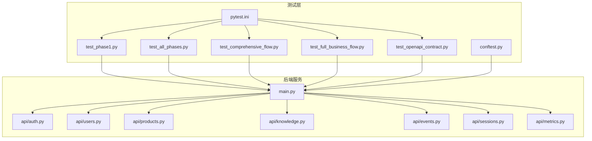
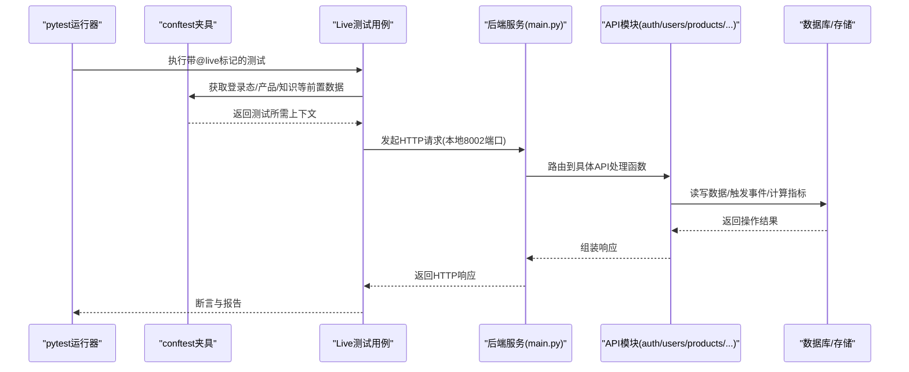
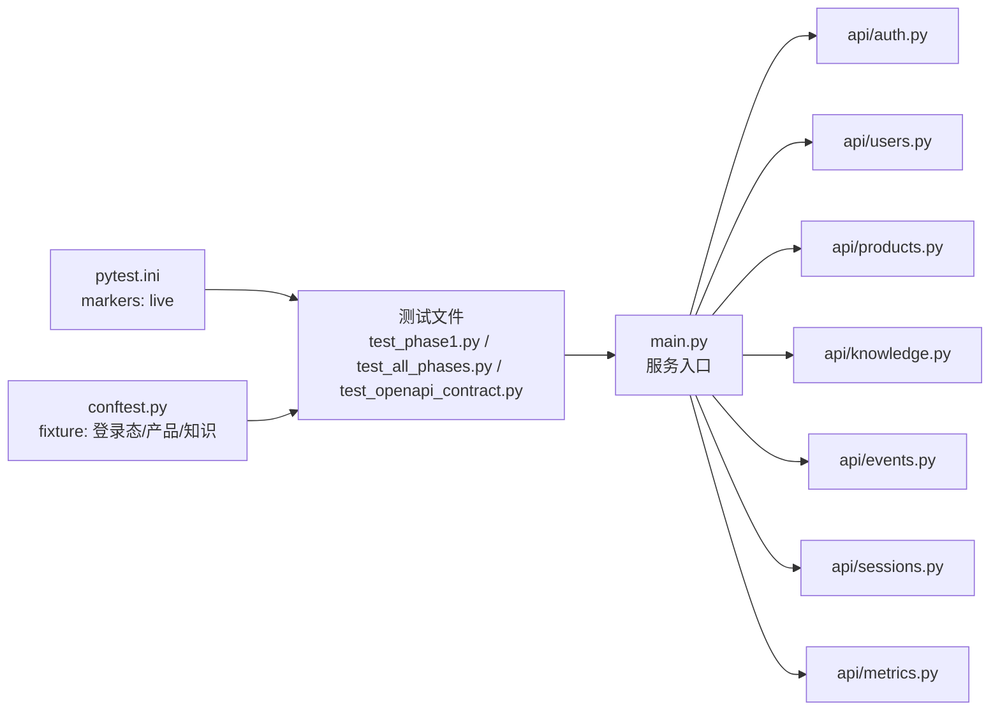

# 全流程系统测试

<cite>
**本文引用的文件**
- [pytest.ini](file://backend/pytest.ini)
- [conftest.py](file://backend/tests/conftest.py)
- [test_phase1.py](file://backend/tests/test_phase1.py)
- [test_all_phases.py](file://backend/tests/test_all_phases.py)
- [test_comprehensive_flow.py](file://backend/tests/test_comprehensive_flow.py)
- [test_full_business_flow.py](file://backend/tests/test_full_business_flow.py)
- [test_openapi_contract.py](file://backend/tests/test_openapi_contract.py)
- [main.py](file://backend/app/main.py)
- [auth.py](file://backend/app/api/auth.py)
- [users.py](file://backend/app/api/users.py)
- [products.py](file://backend/app/api/products.py)
- [knowledge.py](file://backend/app/api/knowledge.py)
- [events.py](file://backend/app/api/events.py)
- [sessions.py](file://backend/app/api/sessions.py)
- [metrics.py](file://backend/app/api/metrics.py)
- [requirements.txt](file://backend/requirements.txt)
- [README.md](file://README.md)
</cite>

## 目录
1. [引言](#引言)
2. [项目结构](#项目结构)
3. [核心组件](#核心组件)
4. [架构总览](#架构总览)
5. [详细组件分析](#详细组件分析)
6. [依赖关系分析](#依赖关系分析)
7. [性能考虑](#性能考虑)
8. [故障排除指南](#故障排除指南)
9. [结论](#结论)
10. [附录](#附录)

## 引言
本文件面向避风港平台的全流程系统测试，聚焦于后端服务器实际运行的Live测试设计与实现方法，涵盖Phase 1专项测试、Phase 1-4全阶段综合测试以及核心模块直调测试。文档详细说明了@ pytest.mark.live标记的使用方式、本地8002端口访问配置、测试运行命令（pytest -m live）、服务器启动要求，并提供Live测试代码示例路径与系统集成验证方法。同时包含测试数据准备、环境配置与故障排除技巧，以及Live测试中的常见问题与性能优化建议。

## 项目结构
后端测试位于backend/tests目录下，包含多个独立测试文件，分别覆盖不同测试阶段与业务场景。测试框架通过pytest.ini与conftest.py进行全局配置与fixture管理。后端服务入口在backend/app/main.py中定义，API路由分布在app/api子模块中，如认证、用户、产品、知识、事件、会话、指标等模块。

**图表来源**
- [pytest.ini](file://backend/pytest.ini)
- [conftest.py](file://backend/tests/conftest.py)
- [test_phase1.py](file://backend/tests/test_phase1.py)
- [test_all_phases.py](file://backend/tests/test_all_phases.py)
- [test_comprehensive_flow.py](file://backend/tests/test_comprehensive_flow.py)
- [test_full_business_flow.py](file://backend/tests/test_full_business_flow.py)
- [test_openapi_contract.py](file://backend/tests/test_openapi_contract.py)
- [main.py](file://backend/app/main.py)
- [auth.py](file://backend/app/api/auth.py)
- [users.py](file://backend/app/api/users.py)
- [products.py](file://backend/app/api/products.py)
- [knowledge.py](file://backend/app/api/knowledge.py)
- [events.py](file://backend/app/api/events.py)
- [sessions.py](file://backend/app/api/sessions.py)
- [metrics.py](file://backend/app/api/metrics.py)

**章节来源**
- [pytest.ini](file://backend/pytest.ini)
- [conftest.py](file://backend/tests/conftest.py)
- [main.py](file://backend/app/main.py)

## 核心组件
- 测试标记与运行控制：通过pytest.ini配置markers，使用@ pytest.mark.live标记标识Live测试；运行时以pytest -m live筛选执行。
- 服务器启动与端口：后端服务默认监听本地8002端口，测试通过该端点发起HTTP请求进行集成验证。
- 测试夹具与共享状态：conftest.py提供测试前置条件（如登录态、产品数据、知识库初始化等），确保各测试用例具备一致的运行环境。
- API模块化：认证、用户、产品、知识、事件、会话、指标等API模块分别承担不同职责，测试围绕这些模块进行直调与链路验证。

**章节来源**
- [pytest.ini](file://backend/pytest.ini)
- [conftest.py](file://backend/tests/conftest.py)
- [main.py](file://backend/app/main.py)

## 架构总览
Live测试的整体架构由“测试驱动层—HTTP客户端—后端服务—业务模块”构成。测试通过pytest标记筛选，结合conftest提供的fixture，向本地8002端口发送HTTP请求，验证后端API的行为与数据一致性。

**图表来源**
- [pytest.ini](file://backend/pytest.ini)
- [conftest.py](file://backend/tests/conftest.py)
- [test_phase1.py](file://backend/tests/test_phase1.py)
- [main.py](file://backend/app/main.py)
- [auth.py](file://backend/app/api/auth.py)
- [users.py](file://backend/app/api/users.py)
- [products.py](file://backend/app/api/products.py)
- [knowledge.py](file://backend/app/api/knowledge.py)
- [events.py](file://backend/app/api/events.py)
- [sessions.py](file://backend/app/api/sessions.py)
- [metrics.py](file://backend/app/api/metrics.py)

## 详细组件分析

### Phase 1专项测试
目标：验证避风港平台在Phase 1阶段的核心能力，包括用户认证、产品检索、基础合规检查与事件记录等关键路径。

- 测试设计要点
  - 使用@ pytest.mark.live标记标识Live测试。
  - 通过conftest提供的fixture获取有效用户令牌与产品数据。
  - 对认证接口进行登录/鉴权校验，对产品接口进行查询与详情获取，对事件接口进行创建与查询。
- 运行方式
  - 在后端服务已启动（本地8002端口）的前提下，执行pytest -m live筛选并运行Phase 1相关测试。
- 关键断言
  - HTTP状态码正确性、响应体字段完整性、事件时间线与指标更新一致性。

**章节来源**
- [test_phase1.py](file://backend/tests/test_phase1.py)
- [pytest.ini](file://backend/pytest.ini)
- [conftest.py](file://backend/tests/conftest.py)
- [auth.py](file://backend/app/api/auth.py)
- [users.py](file://backend/app/api/users.py)
- [products.py](file://backend/app/api/products.py)
- [events.py](file://backend/app/api/events.py)

### Phase 1-4全阶段综合测试
目标：覆盖从Phase 1到Phase 4的完整业务闭环，包括多轮对话、规则引擎触发、风险告警、指标聚合与知识检索等。

- 测试设计要点
  - 串联多个API模块，模拟真实业务流（如：用户提问→知识检索→合规分析→事件生成→指标更新）。
  - 利用conftest准备多阶段数据，确保跨阶段状态一致性。
  - 对关键节点设置断言，如事件链是否完整、指标是否按规则更新、风险告警是否触发。
- 运行方式
  - 保持后端服务运行，使用pytest -m live一次性执行全阶段测试。
- 性能关注
  - 关注链路耗时与并发下的稳定性，必要时拆分测试或增加重试策略。

**章节来源**
- [test_all_phases.py](file://backend/tests/test_all_phases.py)
- [test_comprehensive_flow.py](file://backend/tests/test_comprehensive_flow.py)
- [conftest.py](file://backend/tests/conftest.py)
- [knowledge.py](file://backend/app/api/knowledge.py)
- [events.py](file://backend/app/api/events.py)
- [metrics.py](file://backend/app/api/metrics.py)

### 核心模块直调测试
目标：针对认证、用户、产品、知识、事件、会话、指标等核心模块进行独立直调验证，确保每个模块的接口行为符合预期。

- 测试设计要点
  - 单模块直调：构造最小化请求，验证单个API的输入输出与错误处理。
  - 边界与异常：覆盖空参数、非法格式、权限不足等边界场景。
  - 数据一致性：验证写入后读取的一致性与事务性。
- 运行方式
  - 使用pytest -m live执行直调测试套件，确保每个模块均被覆盖。
- 示例路径参考
  - 认证模块直调测试：[auth直调测试示例路径](file://backend/tests/test_openapi_contract.py)
  - 用户模块直调测试：[users直调测试示例路径](file://backend/tests/test_openapi_contract.py)
  - 产品模块直调测试：[products直调测试示例路径](file://backend/tests/test_openapi_contract.py)
  - 知识模块直调测试：[knowledge直调测试示例路径](file://backend/tests/test_openapi_contract.py)
  - 事件模块直调测试：[events直调测试示例路径](file://backend/tests/test_openapi_contract.py)
  - 会话模块直调测试：[sessions直调测试示例路径](file://backend/tests/test_openapi_contract.py)
  - 指标模块直调测试：[metrics直调测试示例路径](file://backend/tests/test_openapi_contract.py)

**章节来源**
- [test_openapi_contract.py](file://backend/tests/test_openapi_contract.py)
- [auth.py](file://backend/app/api/auth.py)
- [users.py](file://backend/app/api/users.py)
- [products.py](file://backend/app/api/products.py)
- [knowledge.py](file://backend/app/api/knowledge.py)
- [events.py](file://backend/app/api/events.py)
- [sessions.py](file://backend/app/api/sessions.py)
- [metrics.py](file://backend/app/api/metrics.py)

### @pytest.mark.live标记与本地8002端口配置
- 标记使用
  - 在测试文件中为Live测试添加@ pytest.mark.live标记，便于通过pytest -m live统一筛选与执行。
- 端口配置
  - 后端服务默认监听本地8002端口，测试脚本通过该端点发起HTTP请求。
- 运行要求
  - 必须先启动后端服务，确保8002端口可用且可访问。
  - 若端口冲突，需调整后端服务监听端口或停止占用进程。

**章节来源**
- [pytest.ini](file://backend/pytest.ini)
- [main.py](file://backend/app/main.py)

### Live测试代码示例与系统集成验证
- 示例路径
  - Phase 1专项测试示例：[test_phase1.py](file://backend/tests/test_phase1.py)
  - 全阶段综合测试示例：[test_all_phases.py](file://backend/tests/test_all_phases.py)
  - 核心模块直调测试示例：[test_openapi_contract.py](file://backend/tests/test_openapi_contract.py)
- 集成验证方法
  - 通过断言HTTP状态码与响应体字段，验证业务逻辑正确性。
  - 通过事件与指标模块验证系统行为的可观测性与一致性。
  - 使用conftest提供的fixture准备测试数据，确保每次运行的确定性。

**章节来源**
- [test_phase1.py](file://backend/tests/test_phase1.py)
- [test_all_phases.py](file://backend/tests/test_all_phases.py)
- [test_openapi_contract.py](file://backend/tests/test_openapi_contract.py)
- [conftest.py](file://backend/tests/conftest.py)

## 依赖关系分析
测试与后端服务之间的依赖关系如下：

**图表来源**
- [pytest.ini](file://backend/pytest.ini)
- [conftest.py](file://backend/tests/conftest.py)
- [test_phase1.py](file://backend/tests/test_phase1.py)
- [test_all_phases.py](file://backend/tests/test_all_phases.py)
- [test_openapi_contract.py](file://backend/tests/test_openapi_contract.py)
- [main.py](file://backend/app/main.py)
- [auth.py](file://backend/app/api/auth.py)
- [users.py](file://backend/app/api/users.py)
- [products.py](file://backend/app/api/products.py)
- [knowledge.py](file://backend/app/api/knowledge.py)
- [events.py](file://backend/app/api/events.py)
- [sessions.py](file://backend/app/api/sessions.py)
- [metrics.py](file://backend/app/api/metrics.py)

**章节来源**
- [pytest.ini](file://backend/pytest.ini)
- [conftest.py](file://backend/tests/conftest.py)
- [main.py](file://backend/app/main.py)

## 性能考虑
- 并发与限流
  - 在高并发场景下，建议对测试用例进行分批执行，避免瞬时压力导致服务抖动。
- 请求超时与重试
  - 为HTTP请求设置合理的超时与重试策略，提升测试稳定性。
- 数据隔离
  - 使用独立的测试数据集与临时资源，避免测试间相互干扰。
- 日志与监控
  - 在测试过程中开启必要的日志级别，便于定位性能瓶颈与异常。

## 故障排除指南
- 服务器未启动或端口不可用
  - 确认后端服务已在本地8002端口正常运行；若端口被占用，调整服务监听端口或释放端口。
- 认证失败或令牌过期
  - 检查conftest中登录态fixture是否正确生成并传递给测试；必要时重新登录或刷新令牌。
- 接口返回异常或状态码不匹配
  - 核对接口请求参数与响应断言；对照API文档与后端实现逐项排查。
- 事件与指标不一致
  - 检查事件链与指标计算逻辑，确认数据写入与读取的时序一致性。
- 依赖缺失或版本不兼容
  - 检查requirements.txt中的依赖版本，确保测试环境与生产环境一致。

**章节来源**
- [requirements.txt](file://backend/requirements.txt)
- [conftest.py](file://backend/tests/conftest.py)
- [main.py](file://backend/app/main.py)

## 结论
通过@ pytest.mark.live标记与pytest -m live运行方式，结合conftest提供的稳定fixture与本地8002端口访问，避风港平台实现了可重复、可扩展的全流程系统测试方案。Phase 1专项测试、Phase 1-4全阶段综合测试与核心模块直调测试共同构成了完整的测试矩阵，既能覆盖关键路径，又能深入验证各模块的独立行为与协作效果。配合性能优化与故障排除策略，可显著提升测试效率与系统稳定性。

## 附录
- 测试运行命令
  - 运行全部Live测试：pytest -m live
  - 运行指定测试文件：pytest -m live backend/tests/test_phase1.py
- 服务器启动要求
  - 后端服务需在本地8002端口可用的情况下运行，确保测试可访问。
- 参考文档
  - 项目整体说明与背景：[README.md](file://README.md)