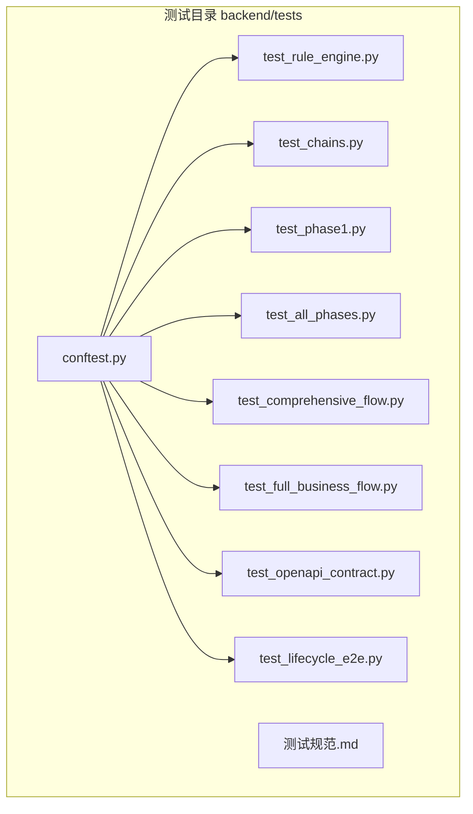
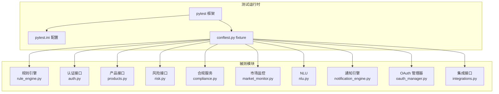
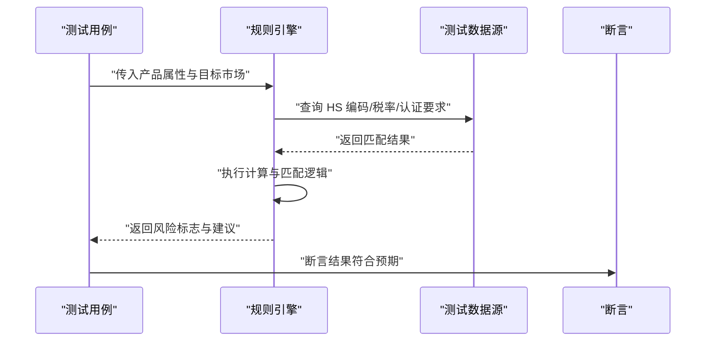
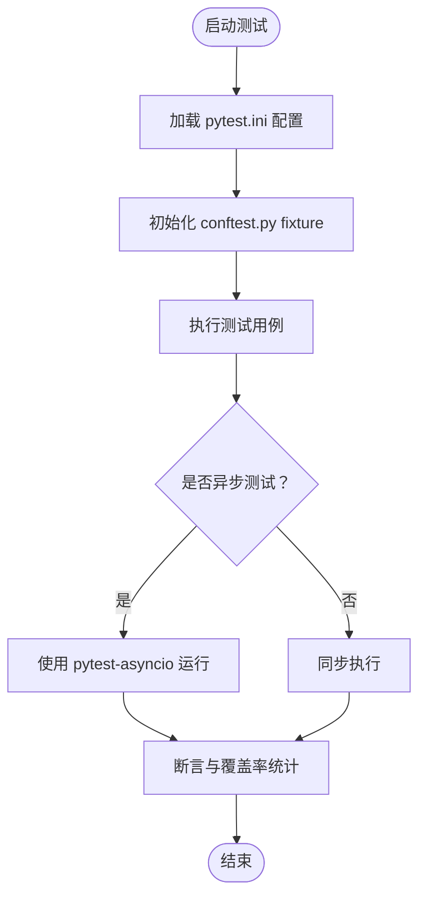
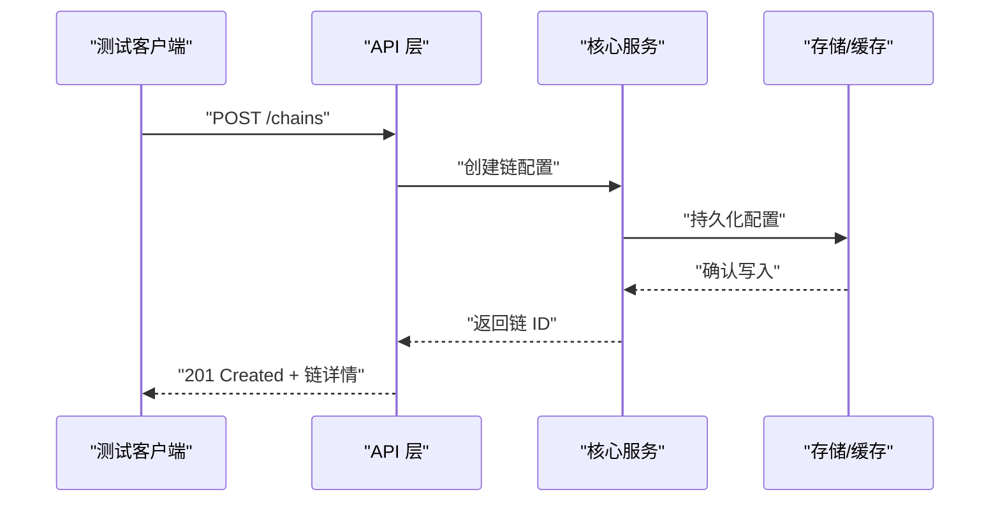
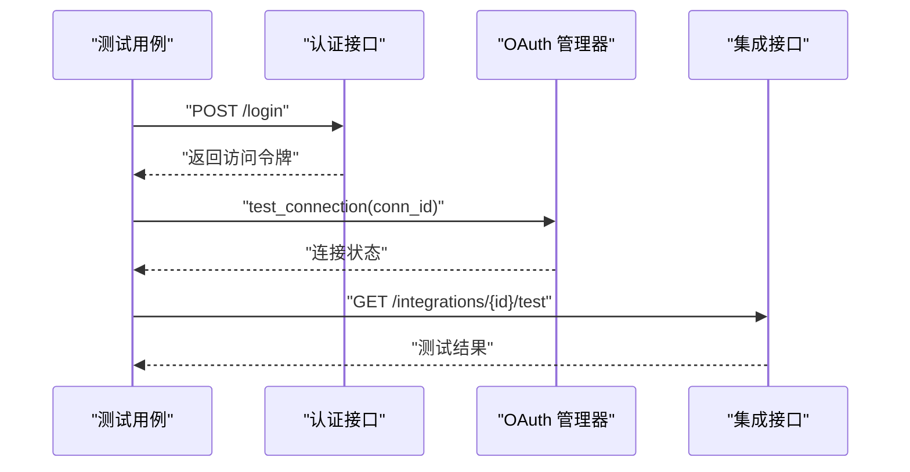
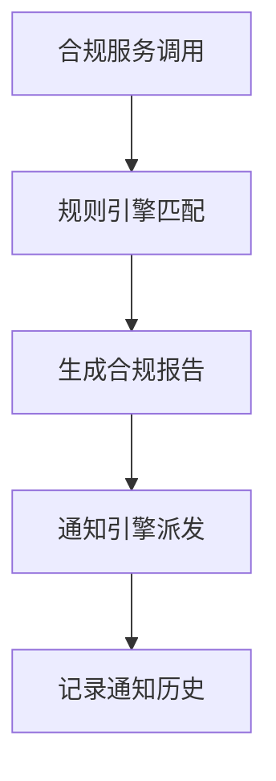
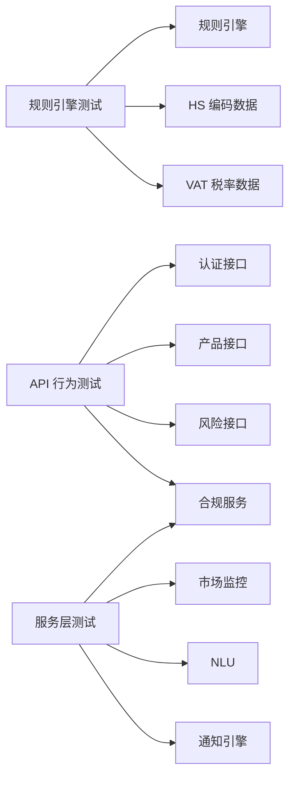

# 单元测试

<cite>
**本文引用的文件**
- [conftest.py](file://backend/tests/conftest.py)
- [test_rule_engine.py](file://backend/tests/test_rule_engine.py)
- [pytest.ini](file://backend/pytest.ini)
- [requirements.txt](file://backend/requirements.txt)
- [rule_engine.py](file://backend/app/core/rule_engine.py)
- [auth.py](file://backend/app/api/auth.py)
- [products.py](file://backend/app/api/products.py)
- [risk.py](file://backend/app/api/risk.py)
- [compliance.py](file://backend/app/services/compliance.py)
- [market_monitor.py](file://backend/app/core/market_monitor.py)
- [nlu.py](file://backend/app/core/nlu.py)
- [notification_engine.py](file://backend/app/core/notification_engine.py)
- [oauth_manager.py](file://backend/app/core/oauth_manager.py)
- [integrations.py](file://backend/app/api/integrations.py)
- [test_chains.py](file://backend/tests/test_chains.py)
- [test_all_phases.py](file://backend/tests/test_all_phases.py)
- [test_comprehensive_flow.py](file://backend/tests/test_comprehensive_flow.py)
- [test_full_business_flow.py](file://backend/tests/test_full_business_flow.py)
- [test_openapi_contract.py](file://backend/tests/test_openapi_contract.py)
- [test_phase1.py](file://backend/tests/test_phase1.py)
- [test_lifecycle_e2e.py](file://backend/tests/test_lifecycle_e2e.py)
- [hs_codes](file://backend/data/raw/hs_codes)
- [vat_rates.json](file://backend/data/vat_rates.json)
- [regulations.md](file://backend/regulations.md)
- [chat_compliance.yaml](file://backend/data/prompts/chat_compliance.yaml)
- [risk_alert_events.md](file://backend/data/config/events/risk_alert_events.md)
- [测试规范.md](file://backend/tests/测试规范.md)
</cite>

## 目录
1. [引言](#引言)
2. [项目结构](#项目结构)
3. [核心组件](#核心组件)
4. [架构总览](#架构总览)
5. [详细组件分析](#详细组件分析)
6. [依赖关系分析](#依赖关系分析)
7. [性能考虑](#性能考虑)
8. [故障排除指南](#故障排除指南)
9. [结论](#结论)
10. [附录](#附录)

## 引言
本文件面向避风港平台的单元测试体系，系统阐述测试设计原则与实现方法，重点覆盖纯函数测试、无 I/O 依赖的测试策略；深入解析规则引擎（HS 编码查询、VAT 计算、认证矩阵匹配、风险标志）的测试用例设计；详解 pytest 框架使用、fixture 配置与异步测试支持；提供高质量单元测试的编写范式、测试覆盖率要求、测试数据管理与执行最佳实践，并给出常见问题与调试技巧。

## 项目结构
避风港平台的测试位于 backend/tests 目录下，采用分层组织：基础 fixture、规则引擎专项测试、端到端流程测试、API 合同测试等。核心测试文件包括：
- 基础配置与 fixture：conftest.py
- 规则引擎测试：test_rule_engine.py
- API 行为测试：test_chains.py、test_all_phases.py、test_comprehensive_flow.py、test_full_business_flow.py、test_openapi_contract.py、test_phase1.py、test_lifecycle_e2e.py
- 测试规范文档：测试规范.md

**图表来源**
- [conftest.py](file://backend/tests/conftest.py)
- [test_rule_engine.py](file://backend/tests/test_rule_engine.py)
- [test_chains.py](file://backend/tests/test_chains.py)
- [test_all_phases.py](file://backend/tests/test_all_phases.py)
- [test_comprehensive_flow.py](file://backend/tests/test_comprehensive_flow.py)
- [test_full_business_flow.py](file://backend/tests/test_full_business_flow.py)
- [test_openapi_contract.py](file://backend/tests/test_openapi_contract.py)
- [test_phase1.py](file://backend/tests/test_phase1.py)
- [test_lifecycle_e2e.py](file://backend/tests/test_lifecycle_e2e.py)
- [测试规范.md](file://backend/tests/测试规范.md)

**章节来源**
- [conftest.py](file://backend/tests/conftest.py)
- [test_rule_engine.py](file://backend/tests/test_rule_engine.py)
- [测试规范.md](file://backend/tests/测试规范.md)

## 核心组件
- 规则引擎（Rule Engine）
  - 负责合规判定、HS 编码查询、VAT 计算、认证矩阵匹配、风险标志生成等核心逻辑
  - 关键实现文件：backend/app/core/rule_engine.py
- 认证与权限
  - 用户认证接口：backend/app/api/auth.py
  - 产品与风险接口：backend/app/api/products.py、backend/app/api/risk.py
- 服务层
  - 合规服务：backend/app/services/compliance.py
  - 市场监控：backend/app/core/market_monitor.py
  - NLU：backend/app/core/nlu.py
  - 通知引擎：backend/app/core/notification_engine.py
- 外部集成
  - OAuth 管理器：backend/app/core/oauth_manager.py
  - 集成配置：backend/app/api/integrations.py

**章节来源**
- [rule_engine.py](file://backend/app/core/rule_engine.py)
- [auth.py](file://backend/app/api/auth.py)
- [products.py](file://backend/app/api/products.py)
- [risk.py](file://backend/app/api/risk.py)
- [compliance.py](file://backend/app/services/compliance.py)
- [market_monitor.py](file://backend/app/core/market_monitor.py)
- [nlu.py](file://backend/app/core/nlu.py)
- [notification_engine.py](file://backend/app/core/notification_engine.py)
- [oauth_manager.py](file://backend/app/core/oauth_manager.py)
- [integrations.py](file://backend/app/api/integrations.py)

## 架构总览
单元测试围绕“无 I/O 纯函数 + 外部依赖注入 + 异步客户端”构建，通过 pytest 的 fixture 提供测试环境与模拟对象，确保测试可重复、可维护且高效。

**图表来源**
- [pytest.ini](file://backend/pytest.ini)
- [conftest.py](file://backend/tests/conftest.py)
- [rule_engine.py](file://backend/app/core/rule_engine.py)
- [auth.py](file://backend/app/api/auth.py)
- [products.py](file://backend/app/api/products.py)
- [risk.py](file://backend/app/api/risk.py)
- [compliance.py](file://backend/app/services/compliance.py)
- [market_monitor.py](file://backend/app/core/market_monitor.py)
- [nlu.py](file://backend/app/core/nlu.py)
- [notification_engine.py](file://backend/app/core/notification_engine.py)
- [oauth_manager.py](file://backend/app/core/oauth_manager.py)
- [integrations.py](file://backend/app/api/integrations.py)

## 详细组件分析

### 规则引擎测试（HS 编码查询、VAT 计算、认证矩阵匹配、风险标志）
规则引擎是合规系统的核心，测试应覆盖：
- HS 编码查询：输入产品属性，返回匹配的 HS 编码集合或默认值
- VAT 计算：根据国家/地区、产品类别、税率表计算含税价格
- 认证矩阵匹配：基于产品属性与目标市场的认证要求进行匹配
- 风险标志：根据匹配结果生成风险等级与提示信息

建议的测试策略：
- 纯函数测试：对规则引擎中的纯函数（如编码匹配、税率计算）进行参数化测试，覆盖边界值与异常路径
- 无 I/O 依赖：通过 pytest fixture 注入内存中的数据源（如 HS 编码、VAT 税率），避免文件/数据库访问
- 异步测试：若规则引擎涉及异步调用，使用 pytest-asyncio 运行异步测试

**图表来源**
- [test_rule_engine.py](file://backend/tests/test_rule_engine.py)
- [rule_engine.py](file://backend/app/core/rule_engine.py)
- [hs_codes](file://backend/data/raw/hs_codes)
- [vat_rates.json](file://backend/data/vat_rates.json)

**章节来源**
- [test_rule_engine.py](file://backend/tests/test_rule_engine.py)
- [rule_engine.py](file://backend/app/core/rule_engine.py)
- [hs_codes](file://backend/data/raw/hs_codes)
- [vat_rates.json](file://backend/data/vat_rates.json)

### pytest 框架使用、fixture 配置与异步测试支持
- 框架与配置
  - 使用 pytest.ini 配置插件、标记、覆盖率等选项
  - requirements.txt 中包含 pytest、pytest-asyncio、pytest-cov 等依赖
- fixture 设计
  - 在 conftest.py 中定义共享 fixture：数据库会话、测试客户端、用户上下文、规则引擎实例等
  - 将外部依赖（如文件系统、网络）替换为内存或模拟对象
- 异步测试
  - 对于异步接口（如链路管理、事件处理），使用 pytest.mark.asyncio 标记测试函数
  - 在测试中使用 asyncio.run 或直接 await 异步调用

**图表来源**
- [pytest.ini](file://backend/pytest.ini)
- [conftest.py](file://backend/tests/conftest.py)
- [requirements.txt](file://backend/requirements.txt)

**章节来源**
- [pytest.ini](file://backend/pytest.ini)
- [conftest.py](file://backend/tests/conftest.py)
- [requirements.txt](file://backend/requirements.txt)

### API 行为测试（链路与业务流程）
- 链路测试（test_chains.py）
  - 验证动作链与事件链的增删改查、过滤、搜索等行为
  - 使用异步客户端调用接口，断言状态码与响应结构
- 全流程测试（test_all_phases.py、test_comprehensive_flow.py、test_full_business_flow.py）
  - 覆盖从产品录入、合规检查、风险评估到通知告警的完整闭环
  - 包含阶段化测试，逐步验证各阶段输出
- OpenAPI 合同测试（test_openapi_contract.py）
  - 基于 OpenAPI 定义校验接口契约，确保实现与文档一致
- 生命周期端到端测试（test_lifecycle_e2e.py）
  - 模拟真实业务生命周期事件流，验证事件总线与处理链

**图表来源**
- [test_chains.py](file://backend/tests/test_chains.py)
- [test_all_phases.py](file://backend/tests/test_all_phases.py)
- [test_comprehensive_flow.py](file://backend/tests/test_comprehensive_flow.py)
- [test_full_business_flow.py](file://backend/tests/test_full_business_flow.py)
- [test_openapi_contract.py](file://backend/tests/test_openapi_contract.py)
- [test_lifecycle_e2e.py](file://backend/tests/test_lifecycle_e2e.py)

**章节来源**
- [test_chains.py](file://backend/tests/test_chains.py)
- [test_all_phases.py](file://backend/tests/test_all_phases.py)
- [test_comprehensive_flow.py](file://backend/tests/test_comprehensive_flow.py)
- [test_full_business_flow.py](file://backend/tests/test_full_business_flow.py)
- [test_openapi_contract.py](file://backend/tests/test_openapi_contract.py)
- [test_lifecycle_e2e.py](file://backend/tests/test_lifecycle_e2e.py)

### 认证与权限测试
- 用户认证接口（auth.py）
  - 测试登录、登出、令牌刷新、权限校验等场景
  - 使用 fixture 注入用户凭据与角色，断言响应与权限矩阵
- 集成与 OAuth（oauth_manager.py、integrations.py）
  - 测试连接测试、授权回调、令牌交换等流程
  - 使用模拟服务器与回调地址，避免真实网络请求

**图表来源**
- [auth.py](file://backend/app/api/auth.py)
- [oauth_manager.py](file://backend/app/core/oauth_manager.py)
- [integrations.py](file://backend/app/api/integrations.py)

**章节来源**
- [auth.py](file://backend/app/api/auth.py)
- [oauth_manager.py](file://backend/app/core/oauth_manager.py)
- [integrations.py](file://backend/app/api/integrations.py)

### 服务层与工具测试
- 合规服务（compliance.py）
  - 测试合规检查、规则匹配、报告生成等
- 市场监控（market_monitor.py）、NLU（nlu.py）
  - 测试市场规则扫描、语义理解与分类
- 通知引擎（notification_engine.py）
  - 测试通知模板渲染、渠道路由与发送

**图表来源**
- [compliance.py](file://backend/app/services/compliance.py)
- [market_monitor.py](file://backend/app/core/market_monitor.py)
- [nlu.py](file://backend/app/core/nlu.py)
- [notification_engine.py](file://backend/app/core/notification_engine.py)

**章节来源**
- [compliance.py](file://backend/app/services/compliance.py)
- [market_monitor.py](file://backend/app/core/market_monitor.py)
- [nlu.py](file://backend/app/core/nlu.py)
- [notification_engine.py](file://backend/app/core/notification_engine.py)

## 依赖关系分析
- 测试耦合与内聚
  - 通过 fixture 将测试与具体实现解耦，提升内聚性
  - 避免在测试中直接依赖外部系统，统一通过模拟或内存数据源
- 直接与间接依赖
  - 规则引擎是多个测试模块的共同依赖点，建议集中 mock 与参数化
  - API 层依赖服务层，服务层依赖核心模块，测试应按层次隔离
- 外部依赖与集成点
  - 文件系统（HS 编码、VAT 税率）、网络（OAuth 回调）、数据库（会话/存储）均需通过 fixture 控制

**图表来源**
- [test_rule_engine.py](file://backend/tests/test_rule_engine.py)
- [rule_engine.py](file://backend/app/core/rule_engine.py)
- [auth.py](file://backend/app/api/auth.py)
- [products.py](file://backend/app/api/products.py)
- [risk.py](file://backend/app/api/risk.py)
- [compliance.py](file://backend/app/services/compliance.py)
- [market_monitor.py](file://backend/app/core/market_monitor.py)
- [nlu.py](file://backend/app/core/nlu.py)
- [notification_engine.py](file://backend/app/core/notification_engine.py)

**章节来源**
- [test_rule_engine.py](file://backend/tests/test_rule_engine.py)
- [rule_engine.py](file://backend/app/core/rule_engine.py)
- [auth.py](file://backend/app/api/auth.py)
- [products.py](file://backend/app/api/products.py)
- [risk.py](file://backend/app/api/risk.py)
- [compliance.py](file://backend/app/services/compliance.py)
- [market_monitor.py](file://backend/app/core/market_monitor.py)
- [nlu.py](file://backend/app/core/nlu.py)
- [notification_engine.py](file://backend/app/core/notification_engine.py)

## 性能考虑
- 测试执行效率
  - 使用参数化测试减少重复用例
  - 将昂贵的 I/O 操作替换为内存模拟，避免文件/网络访问
- 覆盖率与回归
  - 通过 pytest-cov 统计覆盖率，确保关键路径与异常分支被覆盖
  - 对规则引擎与核心算法进行高覆盖率测试，保证稳定性
- 并行与隔离
  - 合理拆分测试模块，避免共享状态导致的竞态
  - 使用独立的测试数据库或内存存储，确保测试隔离

## 故障排除指南
- 常见问题
  - 异步测试未正确标记：使用 pytest.mark.asyncio，确保测试函数与被测函数均为异步
  - 外部依赖未模拟：在 fixture 中注入模拟对象或内存数据源
  - 断言不明确：针对每个分支与边界值添加明确断言，避免模糊期望
- 调试技巧
  - 使用 pytest --pdb 快速定位失败用例
  - 通过 pytest -v 输出详细日志，结合 fixture 日志定位问题
  - 对复杂流程使用分段断言，逐步缩小问题范围

## 结论
避风港平台的单元测试以 pytest 为核心，通过 fixture 实现依赖注入与环境隔离，结合纯函数测试与无 I/O 策略，确保规则引擎与 API 行为的稳定性与可维护性。建议持续完善覆盖率、优化测试数据管理，并在团队内推广测试规范与最佳实践。

## 附录

### 测试覆盖率要求
- 规则引擎与核心算法：≥ 80%
- API 行为：≥ 70%
- 服务层：≥ 60%
- 覆盖率统计：通过 pytest-cov 配置与 CI 集成

**章节来源**
- [pytest.ini](file://backend/pytest.ini)
- [requirements.txt](file://backend/requirements.txt)

### 测试数据管理
- 数据来源
  - HS 编码：backend/data/raw/hs_codes
  - VAT 税率：backend/data/vat_rates.json
  - 合规规则：backend/data/prompts/chat_compliance.yaml
  - 事件配置：backend/data/config/events/risk_alert_events.md
- 管理策略
  - 使用 fixture 加载最小化测试集，避免冗余数据
  - 对外部数据进行版本化管理，确保测试一致性

**章节来源**
- [hs_codes](file://backend/data/raw/hs_codes)
- [vat_rates.json](file://backend/data/vat_rates.json)
- [chat_compliance.yaml](file://backend/data/prompts/chat_compliance.yaml)
- [risk_alert_events.md](file://backend/data/config/events/risk_alert_events.md)

### 测试执行最佳实践
- 命令示例
  - 运行全部测试：pytest
  - 运行指定模块：pytest backend/tests/test_rule_engine.py
  - 生成覆盖率报告：pytest --cov=backend/app
  - 运行异步测试：pytest -m async
- 规范参考
  - 参考 backend/tests/测试规范.md

**章节来源**
- [测试规范.md](file://backend/tests/测试规范.md)