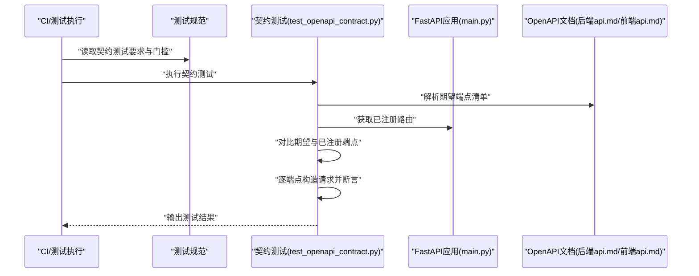
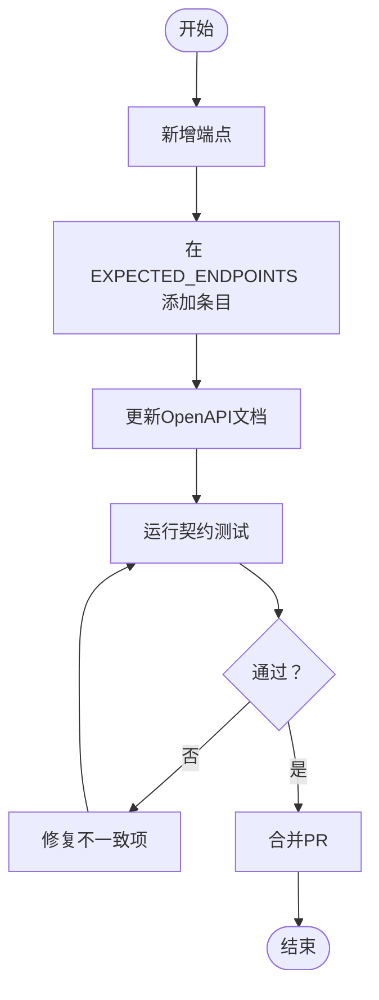
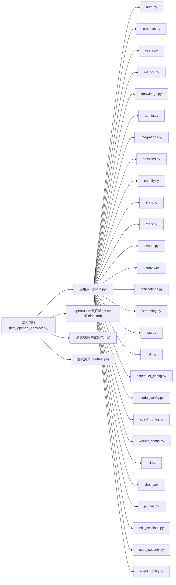

# 接口契约测试

<cite>
**本文引用的文件**
- [后端api.md](file://后端api.md)
- [前端api.md](file://前端api.md)
- [后端变更路线图.md](file://后端变更路线图.md)
- [测试规范.md](file://backend/tests/测试规范.md)
- [test_openapi_contract.py](file://backend/tests/test_openapi_contract.py)
- [conftest.py](file://backend/tests/conftest.py)
- [main.py](file://backend/app/main.py)
- [auth.py](file://backend/app/api/auth.py)
- [products.py](file://backend/app/api/products.py)
- [users.py](file://backend/app/api/users.py)
- [metrics.py](file://backend/app/api/metrics.py)
- [knowledge.py](file://backend/app/api/knowledge.py)
- [admin.py](file://backend/app/api/admin.py)
- [integrations.py](file://backend/app/api/integrations.py)
- [sessions.py](file://backend/app/api/sessions.py)
- [shopify.py](file://backend/app/api/shopify.py)
- [skills.py](file://backend/app/api/skills.py)
- [tools.py](file://backend/app/api/tools.py)
- [events.py](file://backend/app/api/events.py)
- [memory.py](file://backend/app/api/memory.py)
- [notifications.py](file://backend/app/api/notifications.py)
- [streaming.py](file://backend/app/api/streaming.py)
- [rag.py](file://backend/app/api/rag.py)
- [risk.py](file://backend/app/api/risk.py)
- [scheduler_config.py](file://backend/app/api/scheduler_config.py)
- [model_config.py](file://backend/app/api/model_config.py)
- [agent_config.py](file://backend/app/api/agent_config.py)
- [worker_config.py](file://backend/app/api/worker_config.py)
- [cli.py](file://backend/app/api/cli.py)
- [chains.py](file://backend/app/api/chains.py)
- [plugins.py](file://backend/app/api/plugins.py)
- [sdk_sessions.py](file://backend/app/api/sdk_sessions.py)
- [code_security.py](file://backend/app/api/code_security.py)
- [event_config.py](file://backend/app/api/event_config.py)
- [knowledge/store.py](file://backend/app/knowledge/store.py)
- [knowledge/loader.py](file://backend/app/knowledge/loader.py)
- [models/schemas.py](file://backend/app/models/schemas.py)
- [models/database.py](file://backend/app/models/database.py)
- [services/compliance.py](file://backend/app/services/compliance.py)
- [services/metaso_search.py](file://backend/app/services/metaso_search.py)
- [services/prompt_loader.py](file://backend/app/services/prompt_loader.py)
- [storage/user_store.py](file://backend/app/storage/user_store.py)
- [storage/session_store.py](file://backend/app/storage/session_store.py)
- [storage/project_memory.py](file://backend/app/storage/project_memory.py)
- [storage/user_memory.py](file://backend/app/storage/user_memory.py)
- [storage/session_memory.py](file://backend/app/storage/session_memory.py)
- [storage/agent_config_store.py](file://backend/app/storage/agent_config_store.py)
- [storage/event_store.py](file://backend/app/storage/event_store.py)
- [storage/raw_store.py](file://backend/app/storage/raw_store.py)
- [core/auth.py](file://backend/app/core/auth.py)
- [core/oauth_manager.py](file://backend/app/core/oauth_manager.py)
- [core/rule_engine.py](file://backend/app/core/rule_engine.py)
- [core/risk_alert.py](file://backend/app/core/risk_alert.py)
- [core/notification_engine.py](file://backend/app/core/notification_engine.py)
- [core/event_bus.py](file://backend/app/core/event_bus.py)
- [core/event_chain.py](file://backend/app/core/event_chain.py)
- [core/product_storage.py](file://backend/app/core/product_storage.py)
- [core/skill_registry.py](file://backend/app/core/skill_registry.py)
- [core/worker_registry.py](file://backend/app/core/worker_registry.py)
- [core/security_sandbox.py](file://backend/app/core/security_sandbox.py)
- [core/token_juice.py](file://backend/app/core/token_juice.py)
- [core/nlu.py](file://backend/app/core/nlu.py)
- [core/qa_agent.py](file://backend/app/core/qa_agent.py)
- [core/qa_tools.py](file://backend/app/core/qa_tools.py)
- [core/rag.py](file://backend/app/core/rag.py)
- [core/market_monitor.py](file://backend/app/core/market_monitor.py)
- [core/memory_tree.py](file://backend/app/core/memory_tree.py)
- [core/proactive_engine.py](file://backend/app/core/proactive_engine.py)
- [core/auto_pull_engine.py](file://backend/app/core/auto_pull_engine.py)
- [core/channel_adapter.py](file://backend/app/core/channel_adapter.py)
- [core/compliance_flow.py](file://backend/app/core/compliance_flow.py)
- [core/action_chain.py](file://backend/app/core/action_chain.py)
- [core/task_decomposer.py](file://backend/app/core/task_decomposer.py)
- [core/model_router.py](file://backend/app/core/model_router.py)
- [core/scheduler.py](file://backend/app/core/scheduler.py)
- [core/metrics.py](file://backend/app/core/metrics.py)
- [core/local_store.py](file://backend/app/core/local_store.py)
- [core/manager_agent.py](file://backend/app/core/manager_agent.py)
- [core/plugin_manager.py](file://backend/app/core/plugin_manager.py)
- [core/product_storage.py](file://backend/app/core/product_storage.py)
- [core/rbacs.py](file://backend/app/core/rbac.py)
</cite>

## 目录
1. [引言](#引言)
2. [项目结构](#项目结构)
3. [核心组件](#核心组件)
4. [架构总览](#架构总览)
5. [详细组件分析](#详细组件分析)
6. [依赖分析](#依赖分析)
7. [性能考虑](#性能考虑)
8. [故障排查指南](#故障排查指南)
9. [结论](#结论)
10. [附录](#附录)

## 引言
本文件面向避风港平台的接口契约测试，系统性阐述基于OpenAPI的契约测试实现原理与验证方法，覆盖端点注册完整性验证、参数校验测试与响应结构验证；明确 EXPECTED_ENDPOINTS 列表的维护方法与端点数量门槛要求；给出各模块（健康检查、认证、产品管理、用户、指标、知识、集成、会话、事件、通知、流式传输、RAG、风控、调度配置、模型配置、代理配置、工作器配置、CLI、链路、插件、SDK会话、代码安全、事件配置、知识存储、服务层、存储层、核心能力层）独立端点的功能验证策略；提供契约测试代码示例与断言方法指引，并说明新增端点时的测试要求与同步更新流程，以及常见问题与调试技巧。

## 项目结构
后端采用FastAPI应用入口，API路由集中在 app/api 下按领域拆分模块；测试位于 backend/tests，其中 test_openapi_contract.py 负责OpenAPI契约测试；契约文档由后端api.md与前端api.md提供；测试规范与变更路线图明确了契约测试在整体测试矩阵中的位置与维护要求。

```mermaid
graph TB
subgraph "后端应用"
MAIN["app/main.py"]
API_AUTH["app/api/auth.py"]
API_PRODUCTS["app/api/products.py"]
API_USERS["app/api/users.py"]
API_METRICS["app/api/metrics.py"]
API_KNOWLEDGE["app/api/knowledge.py"]
API_ADMIN["app/api/admin.py"]
API_INTEGRATIONS["app/api/integrations.py"]
API_SESSIONS["app/api/sessions.py"]
API_SHOPIFY["app/api/shopify.py"]
API_SKILLS["app/api/skills.py"]
API_TOOLS["app/api/tools.py"]
API_EVENTS["app/api/events.py"]
API_MEMORY["app/api/memory.py"]
API_NOTIFICATIONS["app/api/notifications.py"]
API_STREAMING["app/api/streaming.py"]
API_RAG["app/api/rag.py"]
API_RISK["app/api/risk.py"]
API_SCHEDULER["app/api/scheduler_config.py"]
API_MODEL["app/api/model_config.py"]
API_AGENT["app/api/agent_config.py"]
API_WORKER["app/api/worker_config.py"]
API_CLI["app/api/cli.py"]
API_CHAINS["app/api/chains.py"]
API_PLUGINS["app/api/plugins.py"]
API_SDK["app/api/sdk_sessions.py"]
API_CODESEC["app/api/code_security.py"]
API_EVENTCFG["app/api/event_config.py"]
end
subgraph "测试"
TEST_OPENAPI["tests/test_openapi_contract.py"]
TEST_CONFTEST["tests/conftest.py"]
TEST_SPEC["tests/测试规范.md"]
end
MAIN --> API_AUTH
MAIN --> API_PRODUCTS
MAIN --> API_USERS
MAIN --> API_METRICS
MAIN --> API_KNOWLEDGE
MAIN --> API_ADMIN
MAIN --> API_INTEGRATIONS
MAIN --> API_SESSIONS
MAIN --> API_SHOPIFY
MAIN --> API_SKILLS
MAIN --> API_TOOLS
MAIN --> API_EVENTS
MAIN --> API_MEMORY
MAIN --> API_NOTIFICATIONS
MAIN --> API_STREAMING
MAIN --> API_RAG
MAIN --> API_RISK
MAIN --> API_SCHEDULER
MAIN --> API_MODEL
MAIN --> API_AGENT
MAIN --> API_WORKER
MAIN --> API_CLI
MAIN --> API_CHAINS
MAIN --> API_PLUGINS
MAIN --> API_SDK
MAIN --> API_CODESEC
MAIN --> API_EVENTCFG
TEST_OPENAPI --> MAIN
TEST_OPENAPI --> TEST_CONFTEST
TEST_OPENAPI --> TEST_SPEC
```

**图表来源**
- [main.py](file://backend/app/main.py)
- [auth.py](file://backend/app/api/auth.py)
- [products.py](file://backend/app/api/products.py)
- [users.py](file://backend/app/api/users.py)
- [metrics.py](file://backend/app/api/metrics.py)
- [knowledge.py](file://backend/app/api/knowledge.py)
- [admin.py](file://backend/app/api/admin.py)
- [integrations.py](file://backend/app/api/integrations.py)
- [sessions.py](file://backend/app/api/sessions.py)
- [shopify.py](file://backend/app/api/shopify.py)
- [skills.py](file://backend/app/api/skills.py)
- [tools.py](file://backend/app/api/tools.py)
- [events.py](file://backend/app/api/events.py)
- [memory.py](file://backend/app/api/memory.py)
- [notifications.py](file://backend/app/api/notifications.py)
- [streaming.py](file://backend/app/api/streaming.py)
- [rag.py](file://backend/app/api/rag.py)
- [risk.py](file://backend/app/api/risk.py)
- [scheduler_config.py](file://backend/app/api/scheduler_config.py)
- [model_config.py](file://backend/app/api/model_config.py)
- [agent_config.py](file://backend/app/api/agent_config.py)
- [worker_config.py](file://backend/app/api/worker_config.py)
- [cli.py](file://backend/app/api/cli.py)
- [chains.py](file://backend/app/api/chains.py)
- [plugins.py](file://backend/app/api/plugins.py)
- [sdk_sessions.py](file://backend/app/api/sdk_sessions.py)
- [code_security.py](file://backend/app/api/code_security.py)
- [event_config.py](file://backend/app/api/event_config.py)
- [test_openapi_contract.py](file://backend/tests/test_openapi_contract.py)
- [conftest.py](file://backend/tests/conftest.py)
- [测试规范.md](file://backend/tests/测试规范.md)

**章节来源**
- [后端api.md](file://后端api.md)
- [前端api.md](file://前端api.md)
- [后端变更路线图.md](file://后端变更路线图.md)
- [测试规范.md](file://backend/tests/测试规范.md)

## 核心组件
- OpenAPI契约测试主文件：负责从OpenAPI文档加载端点清单，与运行时注册的路由进行比对，验证端点注册完整性；对每个端点执行参数校验与响应结构验证。
- 测试规范：定义 EXPECTED_ENDPOINTS 维护流程、端点数量门槛、新增端点测试要求与同步更新流程。
- FastAPI应用入口：集中注册所有API模块，是契约测试中“已注册端点”的来源。
- 各领域API模块：按功能域划分，如认证、产品、用户、指标、知识、集成、会话、事件、通知、流式传输、RAG、风控、调度配置、模型配置、代理配置、工作器配置、CLI、链路、插件、SDK会话、代码安全、事件配置等，构成被测试对象。
- 存储与服务层：为API提供数据与业务能力支撑，契约测试关注其对外暴露的HTTP接口契约。

**章节来源**
- [test_openapi_contract.py](file://backend/tests/test_openapi_contract.py)
- [测试规范.md](file://backend/tests/测试规范.md)
- [main.py](file://backend/app/main.py)

## 架构总览
契约测试通过以下流程实现：
- 从OpenAPI文档读取期望端点集合；
- 从运行时FastAPI应用获取已注册路由；
- 对比两者，识别缺失或多余端点；
- 针对每个端点构造请求，执行参数校验与响应结构验证；
- 输出报告并失败时阻断CI。

**图表来源**
- [test_openapi_contract.py](file://backend/tests/test_openapi_contract.py)
- [测试规范.md](file://backend/tests/测试规范.md)
- [main.py](file://backend/app/main.py)
- [后端api.md](file://后端api.md)
- [前端api.md](file://前端api.md)

## 详细组件分析

### EXPECTED_ENDPOINTS 维护与端点数量门槛
- 维护方法
  - 在契约测试文件中维护 EXPECTED_ENDPOINTS 列表，确保覆盖所有公开端点。
  - 新增端点时，需同步在 EXPECTED_ENDPOINTS 中添加对应条目，保证契约测试能发现遗漏。
  - 变更端点路径、方法或参数时，需同步更新 EXPECTED_ENDPOINTS 与OpenAPI文档。
- 端点数量门槛
  - 测试规范中明确了端点数量门槛，用于衡量契约测试覆盖率与稳定性阈值。当端点数量低于门槛时，测试应失败并触发审查。
- 同步更新流程
  - 新增端点：在 EXPECTED_ENDPOINTS 添加条目 → 更新OpenAPI文档 → 提交PR并运行契约测试 → 通过后合并。
  - 变更端点：更新OpenAPI文档 → 更新 EXPECTED_ENDPOINTS → 运行契约测试 → 通过后合并。

**图表来源**
- [测试规范.md](file://backend/tests/测试规范.md)
- [test_openapi_contract.py](file://backend/tests/test_openapi_contract.py)

**章节来源**
- [测试规范.md](file://backend/tests/测试规范.md)
- [后端变更路线图.md](file://后端变更路线图.md)

### 端点注册完整性验证
- 实现要点
  - 从运行时应用获取已注册路由集合；
  - 从OpenAPI文档解析期望端点集合；
  - 比较两者差异，输出缺失端点与多余端点；
  - 对缺失端点触发失败，确保所有公开端点均被注册。
- 断言建议
  - 使用集合差集断言，分别断言“期望但未注册”和“注册但不在期望中”。

**章节来源**
- [test_openapi_contract.py](file://backend/tests/test_openapi_contract.py)
- [main.py](file://backend/app/main.py)

### 参数校验测试
- 实现要点
  - 针对每个端点，构造最小可执行请求载荷；
  - 对必填参数、类型、格式、枚举值、长度范围等进行断言；
  - 对非法参数返回码与错误结构进行断言。
- 断言建议
  - 使用HTTP状态码断言；
  - 使用响应体字段存在性、类型与范围断言；
  - 对错误信息结构进行断言，确保错误提示一致。

**章节来源**
- [test_openapi_contract.py](file://backend/tests/test_openapi_contract.py)

### 响应结构验证
- 实现要点
  - 针对每个端点，断言响应体字段结构、类型、可选字段与默认值；
  - 对分页、嵌套对象、数组等复杂结构进行递归断言；
  - 对时间戳、ID等格式进行一致性断言。
- 断言建议
  - 使用JSON Schema或自定义断言函数；
  - 对关键字段进行白名单断言，避免响应结构漂移。

**章节来源**
- [test_openapi_contract.py](file://backend/tests/test_openapi_contract.py)

### 各模块独立端点功能验证策略
- 健康检查
  - 端点：GET /health
  - 验证：返回200与固定结构；无鉴权要求。
- 认证
  - 端点：POST /auth/login、POST /auth/logout、GET /auth/profile
  - 验证：登录成功返回令牌与用户信息；鉴权失败返回401；登出清理会话。
- 产品管理
  - 端点：GET /products、GET /products/{id}、POST /products、PUT /products/{id}、DELETE /products/{id}
  - 验证：查询分页与过滤；详情存在性；创建/更新字段校验；删除后不可见。
- 用户
  - 端点：GET /users、GET /users/{id}、POST /users、PUT /users/{id}、DELETE /users/{id}
  - 验证：用户唯一标识、角色与权限；更新字段校验。
- 指标
  - 端点：GET /metrics/system、GET /metrics/compliance
  - 验证：指标键名与数值类型；时间范围参数校验。
- 知识
  - 端点：GET /knowledge/search、POST /knowledge/load
  - 验证：检索关键词与结果结构；加载内容格式校验。
- 集成
  - 端点：GET /integrations、GET /integrations/{id}、POST /integrations、PUT /integrations/{id}
  - 验证：集成配置字段校验；回调URL与凭证格式。
- 会话
  - 端点：GET /sessions、GET /sessions/{id}、POST /sessions
  - 验证：会话生命周期与状态；续期与过期处理。
- Shopify
  - 端点：GET /shopify/webhooks
  - 验证：Webhook签名与事件结构。
- 技能
  - 端点：GET /skills、GET /skills/{id}
  - 验证：技能元数据与可用性。
- 工具
  - 端点：GET /tools、GET /tools/{id}
  - 验证：工具定义与参数Schema。
- 事件
  - 端点：GET /events、GET /events/{id}
  - 验证：事件类型与时间线。
- 内存
  - 端点：GET /memory、GET /memory/{id}
  - 验证：内存树结构与节点类型。
- 通知
  - 端点：GET /notifications、GET /notifications/{id}
  - 验证：通知状态与内容结构。
- 流式传输
  - 端点：GET /streaming/chat
  - 验证：SSE连接与消息格式。
- RAG
  - 端点：POST /rag/query
  - 验证：查询输入与引用片段结构。
- 风控
  - 端点：GET /risk/alerts、POST /risk/evaluate
  - 验证：风险评分与告警规则。
- 调度配置
  - 端点：GET /scheduler_config、PUT /scheduler_config
  - 验证：任务绑定与调度策略。
- 模型配置
  - 端点：GET /model_config、PUT /model_config
  - 验证：模型路由与参数。
- 代理配置
  - 端点：GET /agent_config、PUT /agent_config
  - 验证：代理行为与工具调用。
- 工作器配置
  - 端点：GET /worker_config、PUT /worker_config
  - 验证：工作器绑定与负载。
- CLI
  - 端点：POST /cli/run
  - 验证：命令执行与输出结构。
- 链路
  - 端点：GET /chains、GET /chains/{id}
  - 验证：链路步骤与状态。
- 插件
  - 端点：GET /plugins、GET /plugins/{id}
  - 验证：插件元数据与启用状态。
- SDK会话
  - 端点：GET /sdk_sessions、GET /sdk_sessions/{id}
  - 验证：SDK会话与令牌。
- 代码安全
  - 端点：POST /code_security/scan
  - 验证：扫描结果与规则匹配。
- 事件配置
  - 端点：GET /event_config、PUT /event_config
  - 验证：事件触发条件与动作。
- 知识存储
  - 端点：POST /knowledge/store、GET /knowledge/store/{id}
  - 验证：知识索引与检索。
- 服务层与存储层
  - 验证：服务层对外接口契约；存储层数据一致性与可见性。

**章节来源**
- [后端api.md](file://后端api.md)
- [前端api.md](file://前端api.md)
- [auth.py](file://backend/app/api/auth.py)
- [products.py](file://backend/app/api/products.py)
- [users.py](file://backend/app/api/users.py)
- [metrics.py](file://backend/app/api/metrics.py)
- [knowledge.py](file://backend/app/api/knowledge.py)
- [admin.py](file://backend/app/api/admin.py)
- [integrations.py](file://backend/app/api/integrations.py)
- [sessions.py](file://backend/app/api/sessions.py)
- [shopify.py](file://backend/app/api/shopify.py)
- [skills.py](file://backend/app/api/skills.py)
- [tools.py](file://backend/app/api/tools.py)
- [events.py](file://backend/app/api/events.py)
- [memory.py](file://backend/app/api/memory.py)
- [notifications.py](file://backend/app/api/notifications.py)
- [streaming.py](file://backend/app/api/streaming.py)
- [rag.py](file://backend/app/api/rag.py)
- [risk.py](file://backend/app/api/risk.py)
- [scheduler_config.py](file://backend/app/api/scheduler_config.py)
- [model_config.py](file://backend/app/api/model_config.py)
- [agent_config.py](file://backend/app/api/agent_config.py)
- [worker_config.py](file://backend/app/api/worker_config.py)
- [cli.py](file://backend/app/api/cli.py)
- [chains.py](file://backend/app/api/chains.py)
- [plugins.py](file://backend/app/api/plugins.py)
- [sdk_sessions.py](file://backend/app/api/sdk_sessions.py)
- [code_security.py](file://backend/app/api/code_security.py)
- [event_config.py](file://backend/app/api/event_config.py)
- [knowledge/store.py](file://backend/app/knowledge/store.py)
- [knowledge/loader.py](file://backend/app/knowledge/loader.py)
- [models/schemas.py](file://backend/app/models/schemas.py)
- [models/database.py](file://backend/app/models/database.py)
- [services/compliance.py](file://backend/app/services/compliance.py)
- [services/metaso_search.py](file://backend/app/services/metaso_search.py)
- [services/prompt_loader.py](file://backend/app/services/prompt_loader.py)
- [storage/user_store.py](file://backend/app/storage/user_store.py)
- [storage/session_store.py](file://backend/app/storage/session_store.py)
- [storage/project_memory.py](file://backend/app/storage/project_memory.py)
- [storage/user_memory.py](file://backend/app/storage/user_memory.py)
- [storage/session_memory.py](file://backend/app/storage/session_memory.py)
- [storage/agent_config_store.py](file://backend/app/storage/agent_config_store.py)
- [storage/event_store.py](file://backend/app/storage/event_store.py)
- [storage/raw_store.py](file://backend/app/storage/raw_store.py)

### 契约测试代码示例与断言方法
- 示例定位
  - 契约测试主逻辑与断言方法位于契约测试文件中，建议参考该文件以获取具体断言写法与组织方式。
  - 测试规范文件提供了 EXPECTED_ENDPOINTS 维护与端点数量门槛的具体要求。
- 断言方法
  - 端点注册完整性：集合差集断言；
  - 参数校验：状态码断言 + 响应体字段断言；
  - 响应结构：JSON Schema断言或自定义断言函数。

**章节来源**
- [test_openapi_contract.py](file://backend/tests/test_openapi_contract.py)
- [测试规范.md](file://backend/tests/测试规范.md)

## 依赖分析
契约测试对以下模块存在直接依赖：
- 应用入口：提供运行时路由注册信息；
- OpenAPI文档：提供期望端点清单；
- 各API模块：提供被测试的HTTP接口；
- 测试规范：提供维护与门槛要求；
- conftest：提供测试夹具与共享配置。

**图表来源**
- [test_openapi_contract.py](file://backend/tests/test_openapi_contract.py)
- [main.py](file://backend/app/main.py)
- [后端api.md](file://后端api.md)
- [前端api.md](file://前端api.md)
- [测试规范.md](file://backend/tests/测试规范.md)
- [conftest.py](file://backend/tests/conftest.py)
- [auth.py](file://backend/app/api/auth.py)
- [products.py](file://backend/app/api/products.py)
- [users.py](file://backend/app/api/users.py)
- [metrics.py](file://backend/app/api/metrics.py)
- [knowledge.py](file://backend/app/api/knowledge.py)
- [admin.py](file://backend/app/api/admin.py)
- [integrations.py](file://backend/app/api/integrations.py)
- [sessions.py](file://backend/app/api/sessions.py)
- [shopify.py](file://backend/app/api/shopify.py)
- [skills.py](file://backend/app/api/skills.py)
- [tools.py](file://backend/app/api/tools.py)
- [events.py](file://backend/app/api/events.py)
- [memory.py](file://backend/app/api/memory.py)
- [notifications.py](file://backend/app/api/notifications.py)
- [streaming.py](file://backend/app/api/streaming.py)
- [rag.py](file://backend/app/api/rag.py)
- [risk.py](file://backend/app/api/risk.py)
- [scheduler_config.py](file://backend/app/api/scheduler_config.py)
- [model_config.py](file://backend/app/api/model_config.py)
- [agent_config.py](file://backend/app/api/agent_config.py)
- [worker_config.py](file://backend/app/api/worker_config.py)
- [cli.py](file://backend/app/api/cli.py)
- [chains.py](file://backend/app/api/chains.py)
- [plugins.py](file://backend/app/api/plugins.py)
- [sdk_sessions.py](file://backend/app/api/sdk_sessions.py)
- [code_security.py](file://backend/app/api/code_security.py)
- [event_config.py](file://backend/app/api/event_config.py)

**章节来源**
- [test_openapi_contract.py](file://backend/tests/test_openapi_contract.py)
- [main.py](file://backend/app/main.py)
- [测试规范.md](file://backend/tests/测试规范.md)

## 性能考虑
- 契约测试应尽量并行化端点验证，减少串行等待；
- 对于大响应体或复杂结构，优先断言关键字段，避免过度解析；
- 将OpenAPI文档解析与路由收集缓存至测试夹具，避免重复开销；
- 对高频端点（如 /health、/metrics）可降低断言强度，保留关键验证。

## 故障排查指南
- 端点缺失
  - 现象：契约测试报告“期望但未注册”；
  - 处理：检查路由是否正确注册到应用入口；核对路径大小写与参数占位符；确认中间件未拦截。
- 端点多余
  - 现象：契约测试报告“注册但不在期望中”；
  - 处理：确认是否为内部或私有端点；若确需保留，更新 EXPECTED_ENDPOINTS 并说明原因。
- 参数校验失败
  - 现象：状态码非2xx或错误结构不符；
  - 处理：对照OpenAPI文档修正请求载荷；检查必填字段与类型；核对枚举与范围。
- 响应结构漂移
  - 现象：字段缺失、类型变化或新增未声明字段；
  - 处理：在OpenAPI文档与契约测试中同步更新；对新增字段进行向后兼容断言。
- CI失败阻断
  - 现象：端点数量低于门槛或断言失败；
  - 处理：根据测试规范修复；必要时临时放宽门槛并设置审查标签。

**章节来源**
- [测试规范.md](file://backend/tests/测试规范.md)
- [后端变更路线图.md](file://后端变更路线图.md)

## 结论
通过OpenAPI契约测试，能够系统性保障避风港平台接口的稳定性与一致性。结合 EXPECTED_ENDPOINTS 维护、端点数量门槛与模块化端点验证策略，可在开发早期发现接口偏差，降低回归风险。建议持续完善契约文档与测试用例，形成闭环的接口质量保障体系。

## 附录
- 快速检查清单
  - 是否在 EXPECTED_ENDPOINTS 中添加/更新端点？
  - OpenAPI文档是否与实现保持一致？
  - 契约测试是否通过且满足端点数量门槛？
  - 新增端点是否覆盖参数校验与响应结构验证？