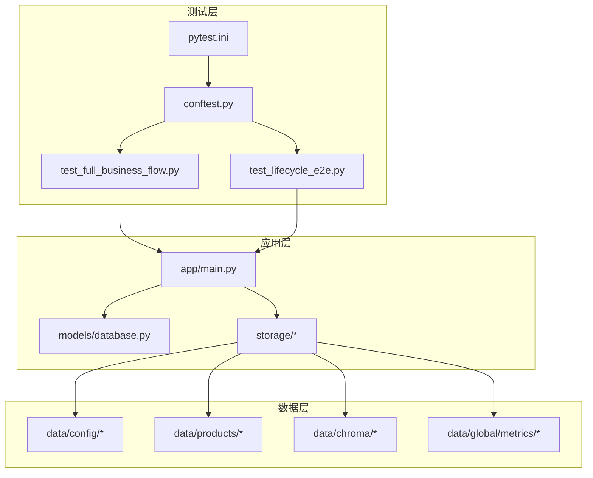
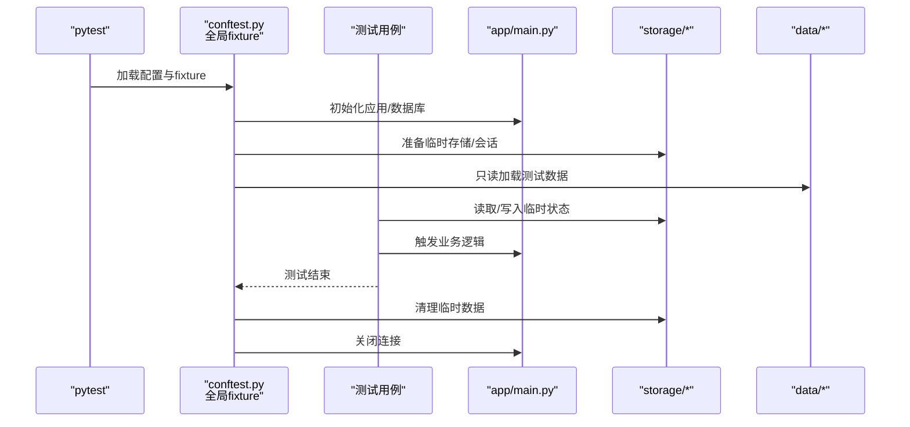
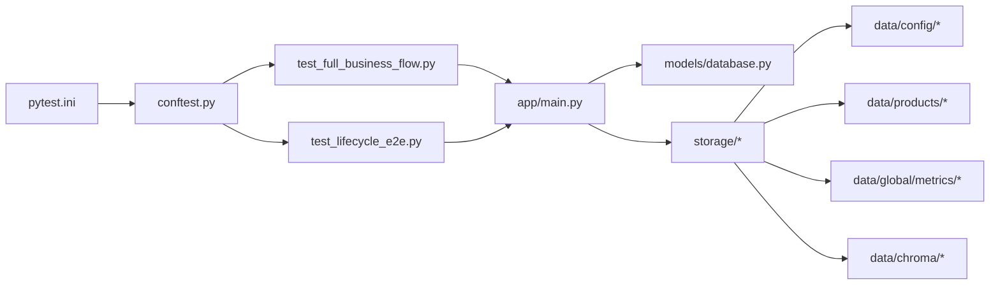

# 测试数据管理

<cite>
**本文引用的文件**
- [backend/pytest.ini](file://backend/pytest.ini)
- [backend/tests/conftest.py](file://backend/tests/conftest.py)
- [backend/tests/test_full_business_flow.py](file://backend/tests/test_full_business_flow.py)
- [backend/tests/test_lifecycle_e2e.py](file://backend/tests/test_lifecycle_e2e.py)
- [backend/app/main.py](file://backend/app/main.py)
- [backend/app/models/database.py](file://backend/app/models/database.py)
- [backend/app/storage/__init__.py](file://backend/app/storage/__init__.py)
- [backend/app/storage/session_store.py](file://backend/app/storage/session_store.py)
- [backend/app/storage/user_store.py](file://backend/app/storage/user_store.py)
- [backend/app/storage/project_memory.py](file://backend/app/storage/project_memory.py)
- [backend/data/config/skills/registry.json](file://backend/data/config/skills/registry.json)
- [backend/data/global/metrics/custom_metrics.json](file://backend/data/global/metrics/custom_metrics.json)
- [backend/data/products/p_E2E测_1d642ce3/product.json](file://backend/data/products/p_E2E测_1d642ce3/product.json)
- [backend/data/chroma/](file://backend/data/chroma/)
- [backend/scripts/init_knowledge.py](file://backend/scripts/init_knowledge.py)
</cite>

## 目录
1. [引言](#引言)
2. [项目结构](#项目结构)
3. [核心组件](#核心组件)
4. [架构总览](#架构总览)
5. [详细组件分析](#详细组件分析)
6. [依赖关系分析](#依赖关系分析)
7. [性能考量](#性能考量)
8. [故障排查指南](#故障排查指南)
9. [结论](#结论)
10. [附录](#附录)

## 引言
本文件面向避风港平台的测试数据管理，系统阐述测试数据的自包含、无外部状态依赖、不污染项目目录、幂等性、最小化以及不写入 tests/ 的原则，并结合现有代码库中的测试配置与数据组织方式，给出可操作的 fixture 使用方法、测试数据创建与清理策略、临时目录与路径管理、隔离与并发安全、生命周期管理与一致性保障，以及常见问题与性能优化建议。

## 项目结构
测试相关的关键位置与职责如下：
- 测试运行配置：backend/pytest.ini
- 全局测试夹具：backend/tests/conftest.py
- 端到端与业务流测试：backend/tests/test_full_business_flow.py、backend/tests/test_lifecycle_e2e.py
- 应用入口与模型：backend/app/main.py、backend/app/models/database.py
- 存储层：backend/app/storage/*（会话、用户、项目记忆等）
- 测试数据源：backend/data/ 下的配置、产品、全局指标、chroma 向量库等
- 初始化脚本：backend/scripts/init_knowledge.py

图表来源
- [backend/pytest.ini](file://backend/pytest.ini)
- [backend/tests/conftest.py](file://backend/tests/conftest.py)
- [backend/tests/test_full_business_flow.py](file://backend/tests/test_full_business_flow.py)
- [backend/tests/test_lifecycle_e2e.py](file://backend/tests/test_lifecycle_e2e.py)
- [backend/app/main.py](file://backend/app/main.py)
- [backend/app/models/database.py](file://backend/app/models/database.py)
- [backend/app/storage/__init__.py](file://backend/app/storage/__init__.py)
- [backend/data/config/skills/registry.json](file://backend/data/config/skills/registry.json)
- [backend/data/products/p_E2E测_1d642ce3/product.json](file://backend/data/products/p_E2E测_1d642ce3/product.json)
- [backend/data/chroma/](file://backend/data/chroma/)
- [backend/data/global/metrics/custom_metrics.json](file://backend/data/global/metrics/custom_metrics.json)

章节来源
- [backend/pytest.ini](file://backend/pytest.ini)
- [backend/tests/conftest.py](file://backend/tests/conftest.py)
- [backend/tests/test_full_business_flow.py](file://backend/tests/test_full_business_flow.py)
- [backend/tests/test_lifecycle_e2e.py](file://backend/tests/test_lifecycle_e2e.py)
- [backend/app/main.py](file://backend/app/main.py)
- [backend/app/models/database.py](file://backend/app/models/database.py)
- [backend/app/storage/__init__.py](file://backend/app/storage/__init__.py)

## 核心组件
- 测试运行器与默认行为：通过 pytest.ini 统一配置，确保测试在隔离环境中运行。
- 全局夹具：在 conftest.py 中定义 session/模块级 fixture，负责数据库初始化、临时目录准备、存储清理等。
- 业务流与生命周期测试：test_full_business_flow.py 与 test_lifecycle_e2e.py 展示了端到端场景下的数据准备与清理流程。
- 应用入口与数据访问：app/main.py 提供服务启动；models/database.py 负责数据库连接与事务；storage/* 提供会话、用户、项目记忆等持久化接口。
- 测试数据源：data/config、data/products、data/global/metrics、data/chroma 等目录作为只读测试数据源，避免写入 tests/。

章节来源
- [backend/pytest.ini](file://backend/pytest.ini)
- [backend/tests/conftest.py](file://backend/tests/conftest.py)
- [backend/tests/test_full_business_flow.py](file://backend/tests/test_full_business_flow.py)
- [backend/tests/test_lifecycle_e2e.py](file://backend/tests/test_lifecycle_e2e.py)
- [backend/app/main.py](file://backend/app/main.py)
- [backend/app/models/database.py](file://backend/app/models/database.py)
- [backend/app/storage/__init__.py](file://backend/app/storage/__init__.py)

## 架构总览
测试数据管理遵循“只读数据源 + 临时状态 + 显式清理”的模式，确保：
- 自包含：测试所需数据集中于 data/ 目录，配合 fixture 在测试过程中按需加载。
- 不依赖外部状态：数据库与向量库等外部资源通过临时目录或内存态模拟。
- 不污染项目目录：所有写入均限定在临时目录，测试结束后清理。
- 幂等性：每次测试前重置状态，避免跨用例干扰。
- 最小化：仅加载必要数据，避免冗余。
- 不写入 tests/：所有生成物放入临时目录，保持 tests/ 清洁。

图表来源
- [backend/tests/conftest.py](file://backend/tests/conftest.py)
- [backend/tests/test_full_business_flow.py](file://backend/tests/test_full_business_flow.py)
- [backend/tests/test_lifecycle_e2e.py](file://backend/tests/test_lifecycle_e2e.py)
- [backend/app/main.py](file://backend/app/main.py)
- [backend/app/storage/__init__.py](file://backend/app/storage/__init__.py)
- [backend/data/config/skills/registry.json](file://backend/data/config/skills/registry.json)

## 详细组件分析

### 测试运行配置（pytest.ini）
- 作用：统一测试运行参数，如根目录、插件、标记过滤等，确保测试在一致环境下执行。
- 建议：将缓存目录、临时输出目录等纳入统一配置，便于清理与隔离。

章节来源
- [backend/pytest.ini](file://backend/pytest.ini)

### 全局夹具（conftest.py）
- 作用：定义 session/模块级 fixture，负责应用初始化、数据库连接、临时目录准备、存储清理等。
- 关键点：
  - 使用 session 级别 fixture 进行一次性初始化，避免重复开销。
  - 使用 autouse fixture 实现自动清理，保证幂等性。
  - 将临时目录与测试隔离，避免污染项目目录。

章节来源
- [backend/tests/conftest.py](file://backend/tests/conftest.py)

### 端到端与业务流测试（test_full_business_flow.py）
- 作用：覆盖完整业务链路，验证从输入到输出的连贯性。
- 数据策略：
  - 通过 fixture 加载 data/products、data/config 等只读数据。
  - 在测试中对临时状态进行读写，确保测试结束后恢复。
- 幂等性：每个用例独立准备与清理，避免相互影响。

章节来源
- [backend/tests/test_full_business_flow.py](file://backend/tests/test_full_business_flow.py)
- [backend/data/products/p_E2E测_1d642ce3/product.json](file://backend/data/products/p_E2E测_1d642ce3/product.json)
- [backend/data/config/skills/registry.json](file://backend/data/config/skills/registry.json)

### 生命周期端到端测试（test_lifecycle_e2e.py）
- 作用：验证产品生命周期事件链路与状态迁移。
- 临时目录使用：通过 Python 标准库创建临时目录，限定测试产物范围。
- 路径管理：避免硬编码绝对路径，使用相对路径与临时目录组合。
- 网络依赖隔离：尽量使用本地数据与内存态模拟，减少对外部网络的依赖。

章节来源
- [backend/tests/test_lifecycle_e2e.py](file://backend/tests/test_lifecycle_e2e.py)

### 应用入口与数据访问（app/main.py、models/database.py）
- 作用：提供服务启动与数据库连接，支持测试环境下的连接池与事务控制。
- 建议：在测试中使用独立数据库实例或内存数据库，确保并发安全与隔离。

章节来源
- [backend/app/main.py](file://backend/app/main.py)
- [backend/app/models/database.py](file://backend/app/models/database.py)

### 存储层（storage/*）
- 作用：封装会话、用户、项目记忆等的读写接口，测试中通过临时目录隔离数据。
- 关键接口：
  - session_store：会话数据的增删改查。
  - user_store：用户数据的增删改查。
  - project_memory：项目记忆的持久化与清理。
- 建议：在 fixture 中显式调用清理函数，确保测试前后状态一致。

章节来源
- [backend/app/storage/session_store.py](file://backend/app/storage/session_store.py)
- [backend/app/storage/user_store.py](file://backend/app/storage/user_store.py)
- [backend/app/storage/project_memory.py](file://backend/app/storage/project_memory.py)

### 测试数据源（data/*）
- 作用：提供只读测试数据，避免写入 tests/，保持测试数据与源码分离。
- 数据类型：
  - 配置类：skills/registry.json、config/*.json
  - 产品类：products/p_E2E测_*/product.json
  - 指标类：global/metrics/custom_metrics.json
  - 向量库：data/chroma/*（用于 RAG/检索）
- 建议：将常用数据抽取为 fixture，按需加载，避免重复 IO。

章节来源
- [backend/data/config/skills/registry.json](file://backend/data/config/skills/registry.json)
- [backend/data/global/metrics/custom_metrics.json](file://backend/data/global/metrics/custom_metrics.json)
- [backend/data/products/p_E2E测_1d642ce3/product.json](file://backend/data/products/p_E2E测_1d642ce3/product.json)
- [backend/data/chroma/](file://backend/data/chroma/)

### 初始化脚本（scripts/init_knowledge.py）
- 作用：在测试前批量导入知识库数据，确保测试具备一致的数据基础。
- 建议：将初始化过程纳入 fixture，实现按需加载与幂等重建。

章节来源
- [backend/scripts/init_knowledge.py](file://backend/scripts/init_knowledge.py)

## 依赖关系分析
测试数据管理涉及的依赖关系如下：

图表来源
- [backend/pytest.ini](file://backend/pytest.ini)
- [backend/tests/conftest.py](file://backend/tests/conftest.py)
- [backend/tests/test_full_business_flow.py](file://backend/tests/test_full_business_flow.py)
- [backend/tests/test_lifecycle_e2e.py](file://backend/tests/test_lifecycle_e2e.py)
- [backend/app/main.py](file://backend/app/main.py)
- [backend/app/models/database.py](file://backend/app/models/database.py)
- [backend/app/storage/__init__.py](file://backend/app/storage/__init__.py)
- [backend/data/config/skills/registry.json](file://backend/data/config/skills/registry.json)
- [backend/data/products/p_E2E测_1d642ce3/product.json](file://backend/data/products/p_E2E测_1d642ce3/product.json)
- [backend/data/global/metrics/custom_metrics.json](file://backend/data/global/metrics/custom_metrics.json)
- [backend/data/chroma/](file://backend/data/chroma/)

章节来源
- [backend/pytest.ini](file://backend/pytest.ini)
- [backend/tests/conftest.py](file://backend/tests/conftest.py)
- [backend/tests/test_full_business_flow.py](file://backend/tests/test_full_business_flow.py)
- [backend/tests/test_lifecycle_e2e.py](file://backend/tests/test_lifecycle_e2e.py)
- [backend/app/main.py](file://backend/app/main.py)
- [backend/app/models/database.py](file://backend/app/models/database.py)
- [backend/app/storage/__init__.py](file://backend/app/storage/__init__.py)

## 性能考量
- 临时目录与路径管理
  - 使用标准库创建临时目录，限定测试产物范围，避免硬编码绝对路径。
  - 将临时目录与测试隔离，减少磁盘 IO 与锁竞争。
- 数据加载与缓存
  - 将常用测试数据抽取为 fixture，按需加载，避免重复 IO。
  - 对只读数据采用共享缓存，提升加载速度。
- 并发执行安全
  - 使用 session 级别 fixture 进行一次性初始化，模块级 autouse 清理。
  - 为每个测试用例分配独立的临时数据库/存储实例，避免并发冲突。
- 内存与向量库
  - 在测试中优先使用内存态或本地向量库，减少网络依赖与延迟。
  - 对向量库进行批量写入与索引重建时，采用事务或批处理以提升吞吐。
- 日志与诊断
  - 在测试失败时保留临时目录与日志，便于定位问题。
  - 使用轻量级日志记录关键步骤，避免过度输出影响性能。

## 故障排查指南
- 临时目录未清理
  - 现象：测试结束后残留临时文件或目录。
  - 处理：检查 autouse fixture 的清理逻辑，确保在异常情况下也能执行清理。
- 数据污染与状态泄漏
  - 现象：不同测试之间出现状态交叉。
  - 处理：确认每个测试用例都使用独立的临时数据源；在 fixture 中显式清理。
- 路径硬编码导致失败
  - 现象：在不同机器上测试失败。
  - 处理：统一使用临时目录与相对路径，避免绝对路径。
- 外部依赖不稳定
  - 现象：网络波动导致测试失败。
  - 处理：将外部依赖替换为本地数据或内存态模拟，减少对外部系统的依赖。
- 并发冲突
  - 现象：多进程/线程下测试不稳定。
  - 处理：为每个测试分配独立的数据库/存储实例；避免共享状态。

章节来源
- [backend/tests/conftest.py](file://backend/tests/conftest.py)
- [backend/tests/test_lifecycle_e2e.py](file://backend/tests/test_lifecycle_e2e.py)

## 结论
避风港平台的测试数据管理应坚持“只读数据源 + 临时状态 + 显式清理”的原则。通过 pytest.ini 统一配置、conftest.py 的全局 fixture、storage/* 的隔离持久化与 data/* 的只读数据源，可以有效实现自包含、幂等性与最小化目标。同时，借助临时目录与路径管理、并发安全设计与性能优化策略，能够显著提升测试稳定性与执行效率。

## 附录
- 最佳实践清单
  - 使用临时目录存放测试产物，避免写入 tests/。
  - 将只读测试数据集中于 data/ 目录，配合 fixture 按需加载。
  - 在 fixture 中实现自动初始化与清理，确保幂等性。
  - 为每个测试用例分配独立的临时数据库/存储实例，避免并发冲突。
  - 将外部依赖替换为本地数据或内存态模拟，减少网络依赖。
  - 在测试失败时保留临时目录与日志，便于定位问题。
- 相关文件路径参考
  - [backend/pytest.ini](file://backend/pytest.ini)
  - [backend/tests/conftest.py](file://backend/tests/conftest.py)
  - [backend/tests/test_full_business_flow.py](file://backend/tests/test_full_business_flow.py)
  - [backend/tests/test_lifecycle_e2e.py](file://backend/tests/test_lifecycle_e2e.py)
  - [backend/app/main.py](file://backend/app/main.py)
  - [backend/app/models/database.py](file://backend/app/models/database.py)
  - [backend/app/storage/session_store.py](file://backend/app/storage/session_store.py)
  - [backend/app/storage/user_store.py](file://backend/app/storage/user_store.py)
  - [backend/app/storage/project_memory.py](file://backend/app/storage/project_memory.py)
  - [backend/data/config/skills/registry.json](file://backend/data/config/skills/registry.json)
  - [backend/data/global/metrics/custom_metrics.json](file://backend/data/global/metrics/custom_metrics.json)
  - [backend/data/products/p_E2E测_1d642ce3/product.json](file://backend/data/products/p_E2E测_1d642ce3/product.json)
  - [backend/data/chroma/](file://backend/data/chroma/)
  - [backend/scripts/init_knowledge.py](file://backend/scripts/init_knowledge.py)