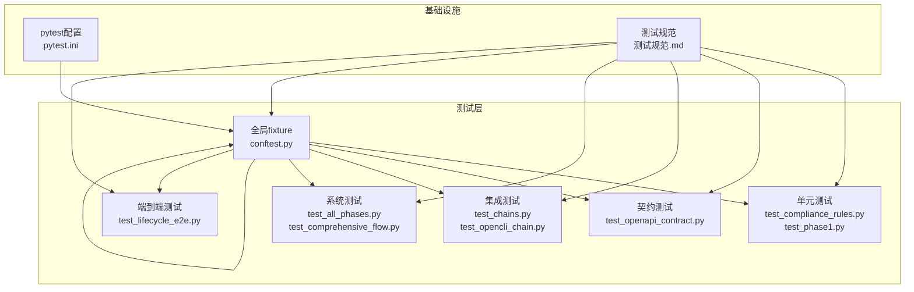
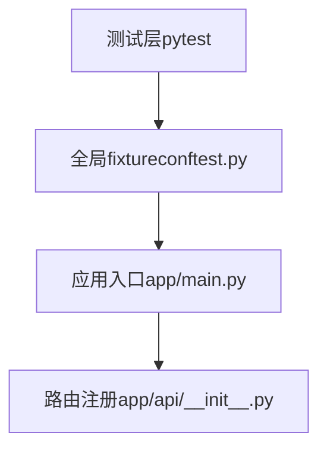
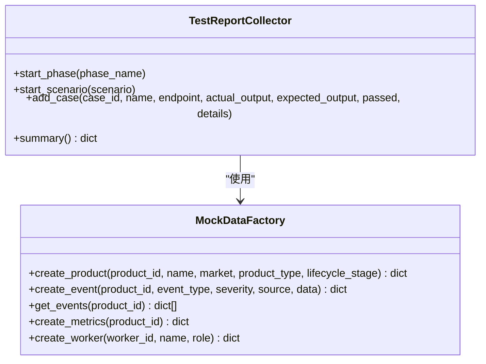
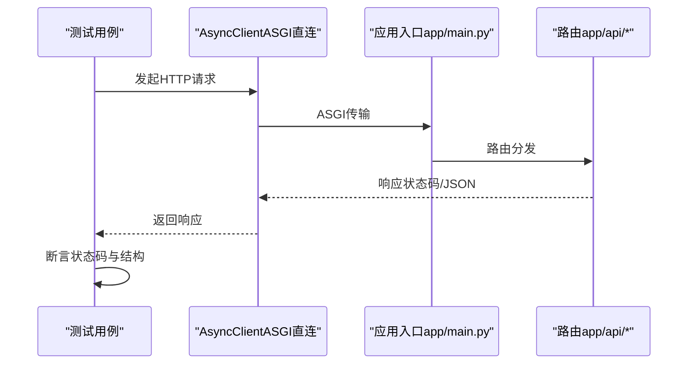
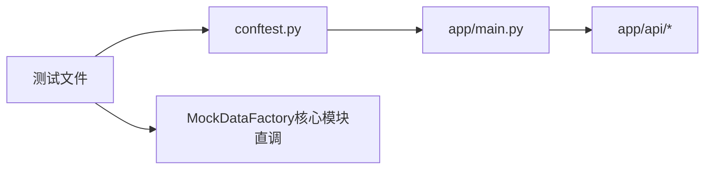

# 测试策略

<cite>
**本文引用的文件**
- [测试规范.md](file://backend/tests/测试规范.md)
- [conftest.py](file://backend/tests/conftest.py)
- [pytest.ini](file://backend/pytest.ini)
- [test_chains.py](file://backend/tests/test_chains.py)
- [test_comprehensive_flow.py](file://backend/tests/test_comprehensive_flow.py)
- [test_all_phases.py](file://backend/tests/test_all_phases.py)
- [test_full_business_flow.py](file://backend/tests/test_full_business_flow.py)
- [test_openapi_contract.py](file://backend/tests/test_openapi_contract.py)
- [test_compliance_rules.py](file://backend/tests/test_compliance_rules.py)
- [test_lifecycle_e2e.py](file://backend/tests/test_lifecycle_e2e.py)
- [test_opencli_chain.py](file://backend/tests/test_opencli_chain.py)
- [test_phase1.py](file://backend/tests/test_phase1.py)
- [app/main.py](file://backend/app/main.py)
- [app/api/__init__.py](file://backend/app/api/__init__.py)
</cite>

## 更新摘要
**所做更改**
- 更新测试文件清单以反映实际存在的测试文件
- 移除已删除测试文件（test_api.py, test_deep.py, test_frontend_api.py等）的相关引用
- 更新测试分层结构以符合当前实际状态
- 补充新增测试文件（test_compliance_rules.py, test_opencli_chain.py, test_phase1.py）的说明

## 目录
1. [引言](#引言)
2. [项目结构](#项目结构)
3. [核心组件](#核心组件)
4. [架构总览](#架构总览)
5. [详细组件分析](#详细组件分析)
6. [依赖分析](#依赖分析)
7. [性能考虑](#性能考虑)
8. [故障排查指南](#故障排查指南)
9. [结论](#结论)
10. [附录](#附录)

## 引言
本文件面向避风港平台，构建从单元测试到端到端测试的完整测试体系，明确测试分层、设计原则、用例编写与覆盖率要求、集成与端到端测试流程、测试规范与质量门禁、工具选择与持续集成配置，并提供可操作的最佳实践与常见问题排查建议。测试体系以 pytest 为核心，结合 httpx 异步客户端与 ASGI 直连方式，覆盖规则引擎、API 契约、操作链/事件链、全业务流、生命周期端到端以及核心模块直调等多层面。

## 项目结构
后端测试位于 backend/tests，采用分层与主题化组织：
- 全局 fixture：conftest.py 提供 ASGI 直连的 AsyncClient
- 分层测试文件：
  - 单元测试：test_compliance_rules.py（合规规则验证）、test_phase1.py（基础功能测试）
  - 契约与端点可达性：test_openapi_contract.py
  - 集成测试：test_chains.py（操作链/事件链/NLStore）、test_opencli_chain.py（CLI链测试）
  - 系统测试：test_all_phases.py（全阶段综合测试）、test_comprehensive_flow.py（核心模块直调）
  - 全流程测试：test_full_business_flow.py（16 Phase 全业务流）
  - 端到端测试：test_lifecycle_e2e.py（25+第三方集成）
- 测试规范：测试规范.md，统一框架、目录、分层、编写规范、运行方式、数据管理、CI/CD 与质量门禁

图表来源
- [conftest.py:11-16](file://backend/tests/conftest.py#L11-L16)
- [pytest.ini:1-6](file://backend/pytest.ini#L1-L6)
- [测试规范.md:30-47](file://backend/tests/测试规范.md#L30-L47)

章节来源
- [测试规范.md:30-47](file://backend/tests/测试规范.md#L30-L47)
- [conftest.py:11-16](file://backend/tests/conftest.py#L11-L16)
- [pytest.ini:1-6](file://backend/pytest.ini#L1-L6)

## 核心组件
- 测试框架与异步支持：pytest 8.x + pytest-asyncio（auto 模式）
- HTTP 客户端：httpx AsyncClient + ASGITransport（ASGI 直连，无需真实 HTTP 服务器）
- 覆盖率：pytest-cov
- 标记与运行：live（依赖运行中后端 localhost:8002）、slow（长耗时测试）

章节来源
- [测试规范.md:7-26](file://backend/tests/测试规范.md#L7-L26)

## 架构总览
测试运行架构由"测试层 → 基础设施 → 应用入口"构成。全局 fixture 通过 ASGI 直连应用入口，绕过真实网络栈，提升速度与稳定性；部分系统测试标记 live，需本地后端服务配合。

图表来源
- [conftest.py:8](file://backend/tests/conftest.py#L8)
- [app/main.py](file://backend/app/main.py)
- [app/api/__init__.py](file://backend/app/api/__init__.py)

章节来源
- [conftest.py:11-16](file://backend/tests/conftest.py#L11-L16)
- [app/main.py](file://backend/app/main.py)
- [app/api/__init__.py](file://backend/app/api/__init__.py)

## 详细组件分析

### 单元测试（合规规则与基础功能）
- 范围：合规规则验证、基础功能测试
- 原则：无 I/O 依赖、无外部服务调用、毫秒级执行
- 覆盖：合规检查核心能力、基础功能验证
- 示例参考：test_compliance_rules.py、test_phase1.py

章节来源
- [测试规范.md:53-66](file://backend/tests/测试规范.md#L53-L66)
- [test_compliance_rules.py](file://backend/tests/test_compliance_rules.py)
- [test_phase1.py](file://backend/tests/test_phase1.py)

### 契约与端点可达性测试
- 目标：OpenAPI 端点契约校验与基础功能验证
- 方法：维护 EXPECTED_ENDPOINTS 清单，新增端点时同步更新；为新模块添加至少一个端点可达性测试函数
- 示例参考：test_openapi_contract.py

章节来源
- [测试规范.md:163-168](file://backend/tests/测试规范.md#L163-L168)
- [test_openapi_contract.py](file://backend/tests/test_openapi_contract.py)

### 集成测试（操作链/事件链/NLStore 与 CLI链）
- 范围：操作链 CRUD、事件链管理、命名空间与记录、搜索过滤、事件时间线、CLI链测试
- 方法：使用 AsyncClient 发起请求，断言状态码与响应结构
- 示例参考：test_chains.py、test_opencli_chain.py

章节来源
- [测试规范.md:67-83](file://backend/tests/测试规范.md#L67-L83)
- [test_chains.py:17-185](file://backend/tests/test_chains.py#L17-L185)
- [test_opencli_chain.py](file://backend/tests/test_opencli_chain.py)

### 全业务流集成测试（16 Phase）
- 范围：产品管理、事件总线、记忆树、指标、Tools、SSE 对话、Agent 调度、RBAC、审批、报表等
- 方法：基于变更路线图分阶段验证，逐步推进至全业务闭环
- 示例参考：test_full_business_flow.py

章节来源
- [测试规范.md:84-107](file://backend/tests/测试规范.md#L84-L107)
- [test_full_business_flow.py:986-1009](file://backend/tests/test_full_business_flow.py#L986-L1009)

### 全流程系统测试（Live System）
- 标记：pytest.mark.live
- 运行方式：需先启动后端服务（localhost:8002），使用 httpx 同步客户端访问
- 文件：
  - test_all_phases.py（Phase 1-4 全阶段综合）
  - test_comprehensive_flow.py（核心模块直调，模拟虚拟数据）
- 示例参考：test_all_phases.py、test_comprehensive_flow.py

章节来源
- [测试规范.md:108-118](file://backend/tests/测试规范.md#L108-L118)
- [test_all_phases.py:10](file://backend/tests/test_all_phases.py#L10)
- [test_comprehensive_flow.py:1-1480](file://backend/tests/test_comprehensive_flow.py#L1-L1480)

### 生命周期端到端测试（25+ 第三方集成）
- 范围：覆盖多市场、多法规、多渠道、多系统的全生命周期合规与运营流程
- 方法：模拟用户场景，串联真实第三方集成点位
- 示例参考：test_lifecycle_e2e.py

章节来源
- [测试规范.md:39](file://backend/tests/测试规范.md#L39)
- [test_lifecycle_e2e.py](file://backend/tests/test_lifecycle_e2e.py)

### 测试报告与数据工厂（核心模块直调测试）
- 测试报告收集器：TestReportCollector，记录用例、阶段统计、失败详情
- 虚拟数据工厂：MockDataFactory，生成产品、事件、指标、Worker 等测试数据
- 报告输出：生成 JSON 报告并保存至指定路径

图表来源
- [test_comprehensive_flow.py:38-119](file://backend/tests/test_comprehensive_flow.py#L38-L119)
- [test_comprehensive_flow.py:125-207](file://backend/tests/test_comprehensive_flow.py#L125-L207)

章节来源
- [test_comprehensive_flow.py:38-119](file://backend/tests/test_comprehensive_flow.py#L38-L119)
- [test_comprehensive_flow.py:125-207](file://backend/tests/test_comprehensive_flow.py#L125-L207)

### API/服务组件调用序列（以典型端点为例）
以下序列展示测试如何通过 AsyncClient 调用后端 API 并断言结果，体现测试层到应用层的交互。

图表来源
- [conftest.py:11-16](file://backend/tests/conftest.py#L11-L16)
- [app/main.py](file://backend/app/main.py)
- [app/api/__init__.py](file://backend/app/api/__init__.py)

## 依赖分析
- 测试对应用的耦合：通过 ASGI 直连，避免对真实 HTTP 服务器的依赖，降低耦合度
- 测试对数据的依赖：核心模块直调测试通过 MockDataFactory 生成虚拟数据，减少对外部存储与历史状态的依赖
- 标记与隔离：live 标记用于区分需要真实后端的测试，便于 CI 中按需排除

图表来源
- [conftest.py:8](file://backend/tests/conftest.py#L8)
- [app/main.py](file://backend/app/main.py)
- [app/api/__init__.py](file://backend/app/api/__init__.py)
- [test_comprehensive_flow.py:125-207](file://backend/tests/test_comprehensive_flow.py#L125-L207)

章节来源
- [conftest.py:11-16](file://backend/tests/conftest.py#L11-L16)
- [test_comprehensive_flow.py:125-207](file://backend/tests/test_comprehensive_flow.py#L125-L207)

## 性能考虑
- 异步与直连：使用 httpx AsyncClient + ASGITransport，避免网络开销，提升测试执行效率
- 数据最小化：仅创建当前测试所需数据，避免冗余
- 并发与幂等：测试具备幂等性，可并行执行而不互相影响
- 标记过滤：通过 pytest 标记（如 slow、live）控制执行范围，优化 CI 时间

章节来源
- [测试规范.md:171-194](file://backend/tests/测试规范.md#L171-L194)
- [pytest.ini:1-6](file://backend/pytest.ini#L1-L6)

## 故障排查指南
- 无法连接后端（live 测试）：确认后端服务已启动并监听 localhost:8002
- 端点缺失或契约不一致：在契约测试中核对 EXPECTED_ENDPOINTS，确保与实际路由一致
- 数据污染或状态残留：遵循测试数据管理原则，不在 tests/ 写入产物，使用临时目录
- 异步测试标注：使用 @pytest.mark.asyncio 或启用 asyncio_mode = auto
- 报告与日志：核心模块直调测试会生成 JSON 报告，定位失败用例与期望/实际差异

章节来源
- [测试规范.md:171-194](file://backend/tests/测试规范.md#L171-L194)
- [测试规范.md:198-208](file://backend/tests/测试规范.md#L198-L208)
- [测试规范.md:253-261](file://backend/tests/测试规范.md#L253-L261)
- [test_comprehensive_flow.py:1459-1468](file://backend/tests/test_comprehensive_flow.py#L1459-L1468)

## 结论
避风港平台测试体系以 pytest 为核心，结合 ASGI 直连与标记化运行策略，形成从单元到端到端的完整覆盖。通过契约测试保证接口一致性，通过集成与全业务流测试验证跨模块协作，通过生命周期端到端测试覆盖真实第三方集成场景。配合严格的测试数据管理与质量门禁，确保测试可重复、可观测、可持续改进。

## 附录

### 测试分层与运行方式
- 分层：单元（test_compliance_rules.py、test_phase1.py）、契约（test_openapi_contract.py）、集成（test_chains.py、test_opencli_chain.py）、系统（test_all_phases.py、test_comprehensive_flow.py）、全流程（test_full_business_flow.py）、端到端（test_lifecycle_e2e.py）
- 运行：pytest 默认运行不带 live 标记的测试；可通过 -m live 运行全流程系统测试；支持覆盖率与 JUnit XML 输出

章节来源
- [测试规范.md:30-47](file://backend/tests/测试规范.md#L30-L47)
- [测试规范.md:171-194](file://backend/tests/测试规范.md#L171-L194)

### 测试规范与质量门禁
- 覆盖率：行覆盖率 ≥ 60%（核心模块 ≥ 80%），新增代码覆盖 ≥ 80%
- 端点数量：OpenAPI 端点注册 ≥ 150 个
- 运行策略：CI 默认运行不带 live 的测试；可按需全量或仅 live

章节来源
- [测试规范.md:227-249](file://backend/tests/测试规范.md#L227-L249)

### 测试工具与配置要点
- 框架：pytest 8.x
- 异步：pytest-asyncio（auto 模式）
- HTTP 客户端：httpx AsyncClient + ASGITransport
- 覆盖率：pytest-cov
- 配置：pytest.ini 指定 asyncio_mode、testpaths 与标记

章节来源
- [测试规范.md:7-26](file://backend/tests/测试规范.md#L7-L26)
- [pytest.ini:1-6](file://backend/pytest.ini#L1-L6)

### 当前测试文件清单
- 单元测试文件：
  - test_compliance_rules.py：合规规则验证
  - test_phase1.py：基础功能测试
- 集成测试文件：
  - test_chains.py：操作链/事件链/NLStore
  - test_opencli_chain.py：CLI链测试
- 系统测试文件：
  - test_all_phases.py：全阶段综合测试
  - test_comprehensive_flow.py：核心模块直调
- 全流程测试文件：
  - test_full_business_flow.py：16 Phase 全业务流
- 端到端测试文件：
  - test_lifecycle_e2e.py：生命周期端到端测试
- 契约测试文件：
  - test_openapi_contract.py：OpenAPI契约测试
- 工具文件：
  - conftest.py：全局fixture
  - 测试规范.md：测试规范文档
  - pytest.ini：pytest配置
  - archived/：归档测试文件

章节来源
- [test_compliance_rules.py](file://backend/tests/test_compliance_rules.py)
- [test_phase1.py](file://backend/tests/test_phase1.py)
- [test_chains.py](file://backend/tests/test_chains.py)
- [test_opencli_chain.py](file://backend/tests/test_opencli_chain.py)
- [test_all_phases.py](file://backend/tests/test_all_phases.py)
- [test_comprehensive_flow.py](file://backend/tests/test_comprehensive_flow.py)
- [test_full_business_flow.py](file://backend/tests/test_full_business_flow.py)
- [test_lifecycle_e2e.py](file://backend/tests/test_lifecycle_e2e.py)
- [test_openapi_contract.py](file://backend/tests/test_openapi_contract.py)
- [conftest.py](file://backend/tests/conftest.py)
- [测试规范.md](file://backend/tests/测试规范.md)
- [pytest.ini](file://backend/pytest.ini)