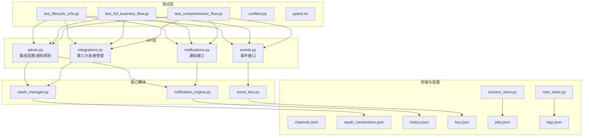
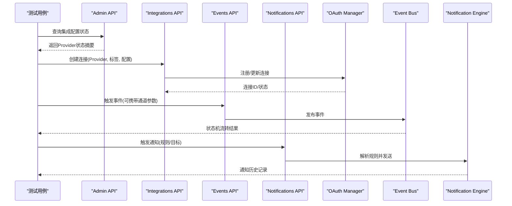
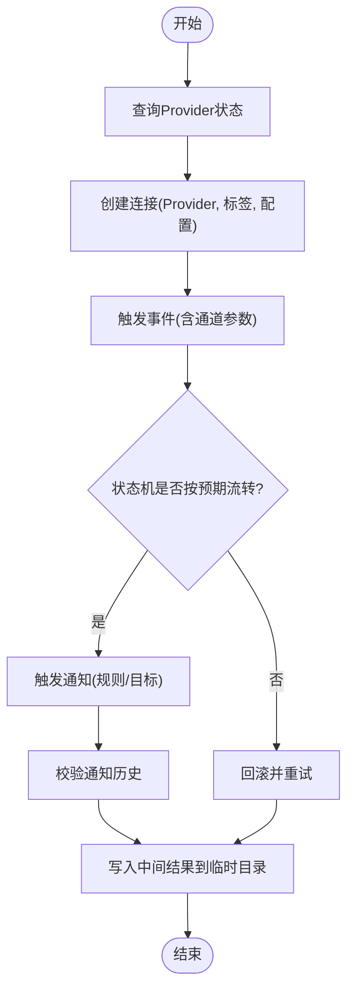
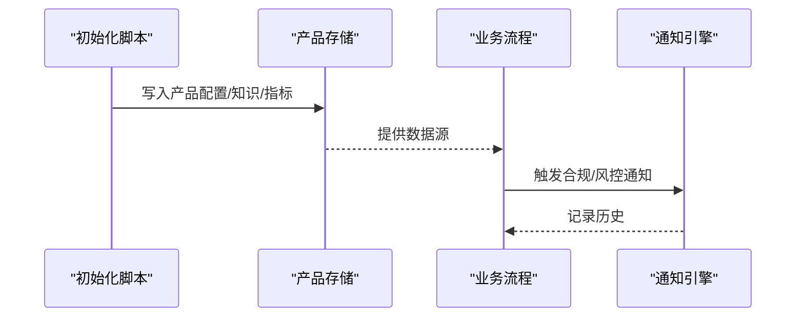
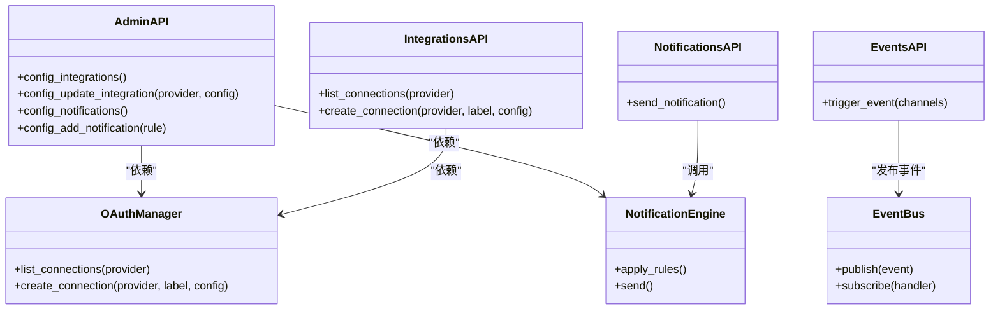
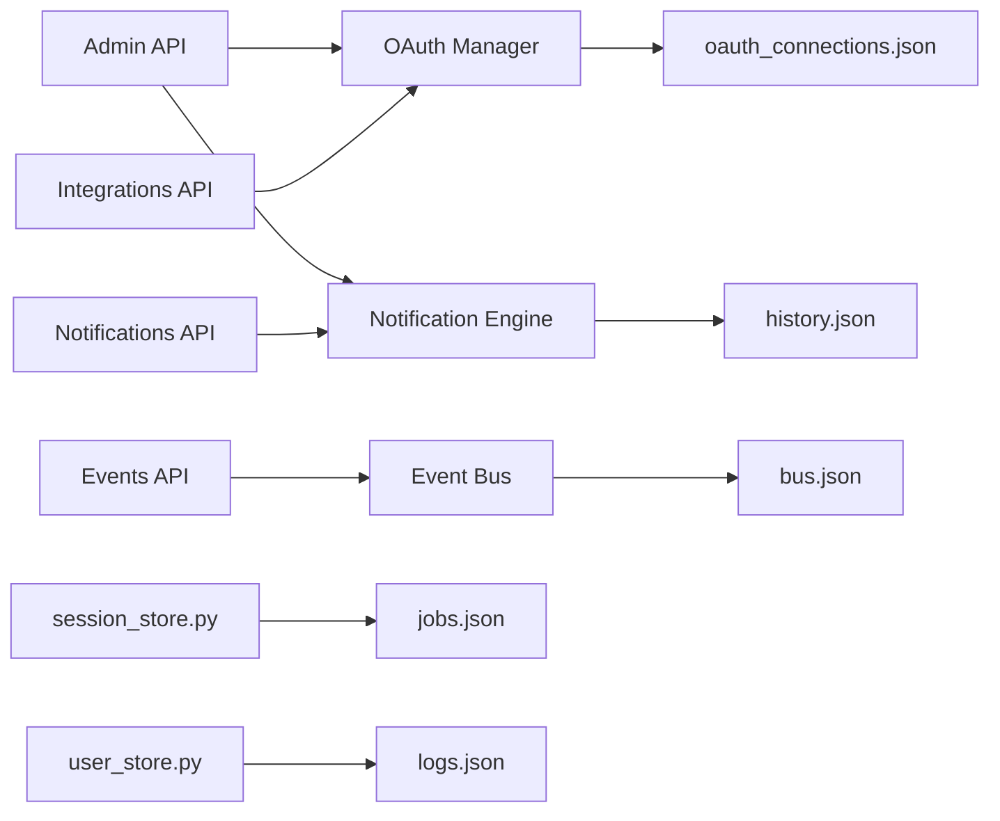

# 端到端测试

<cite>
**本文引用的文件**
- [backend/pytest.ini](file://backend/pytest.ini)
- [backend/tests/conftest.py](file://backend/tests/conftest.py)
- [backend/tests/test_lifecycle_e2e.py](file://backend/tests/test_lifecycle_e2e.py)
- [backend/tests/test_full_business_flow.py](file://backend/tests/test_full_business_flow.py)
- [backend/tests/test_comprehensive_flow.py](file://backend/tests/test_comprehensive_flow.py)
- [backend/app/api/admin.py](file://backend/app/api/admin.py)
- [backend/app/api/integrations.py](file://backend/app/api/integrations.py)
- [backend/app/api/events.py](file://backend/app/api/events.py)
- [backend/app/api/notifications.py](file://backend/app/api/notifications.py)
- [backend/app/core/oauth_manager.py](file://backend/app/core/oauth_manager.py)
- [backend/app/core/notification_engine.py](file://backend/app/core/notification_engine.py)
- [backend/app/core/event_bus.py](file://backend/app/core/event_bus.py)
- [backend/app/storage/session_store.py](file://backend/app/storage/session_store.py)
- [backend/app/storage/user_store.py](file://backend/app/storage/user_store.py)
- [backend/data/config/channels.json](file://backend/data/config/channels.json)
- [backend/data/config/oauth_connections.json](file://backend/data/config/oauth_connections.json)
- [backend/data/global/notifications/history.json](file://backend/data/global/notifications/history.json)
- [backend/data/products/p_E2E测_1d642ce3/product.json](file://backend/data/products/p_E2E测_1d642ce3/product.json)
- [backend/data/products/p_E2E测_1d642ce3/metrics/metrics.json](file://backend/data/products/p_E2E测_1d642ce3/metrics/metrics.json)
- [backend/data/products/p_E2E测_1d642ce3/memory/memory.json](file://backend/data/products/p_E2E测_1d642ce3/memory/memory.json)
- [backend/data/global/events/bus.json](file://backend/data/global/events/bus.json)
- [backend/data/sync/jobs.json](file://backend/data/sync/jobs.json)
- [backend/data/sync/logs.json](file://backend/data/sync/logs.json)
- [backend/scripts/init_knowledge.py](file://backend/scripts/init_knowledge.py)
- [backend/scripts/fetch_regulations.py](file://backend/scripts/fetch_regulations.py)
- [README.md](file://README.md)
- [backend/requirements.txt](file://backend/requirements.txt)
</cite>

## 目录
1. [简介](#简介)
2. [项目结构](#项目结构)
3. [核心组件](#核心组件)
4. [架构总览](#架构总览)
5. [详细组件分析](#详细组件分析)
6. [依赖关系分析](#依赖关系分析)
7. [性能考虑](#性能考虑)
8. [故障排查指南](#故障排查指南)
9. [结论](#结论)
10. [附录](#附录)

## 简介
本文件面向避风港平台的端到端测试，围绕产品全生命周期与第三方系统集成的测试设计与实现展开，覆盖25+第三方Provider注册、通知频道模拟与状态机流转验证；阐述测试输出写入系统临时目录的策略与中间结果管理；解释质量评分体系（状态码30分+结构40分+业务逻辑30分）的计算方法与评估标准；提供E2E测试代码示例与复杂业务场景模拟；包含测试环境配置、数据准备与结果验证方法，并给出常见问题与性能优化建议。

## 项目结构
后端采用Python FastAPI应用，测试位于backend/tests目录，通过pytest运行。测试文件围绕生命周期E2E、完整业务流程与综合流程展开，配合配置与数据目录完成第三方系统集成与通知模拟。

**图表来源**
- [backend/tests/test_lifecycle_e2e.py:1-200](file://backend/tests/test_lifecycle_e2e.py#L1-L200)
- [backend/tests/test_full_business_flow.py:1-200](file://backend/tests/test_full_business_flow.py#L1-L200)
- [backend/tests/test_comprehensive_flow.py:1-200](file://backend/tests/test_comprehensive_flow.py#L1-L200)
- [backend/app/api/admin.py:150-280](file://backend/app/api/admin.py#L150-L280)
- [backend/app/api/integrations.py:1-60](file://backend/app/api/integrations.py#L1-L60)
- [backend/app/api/events.py:1-120](file://backend/app/api/events.py#L1-L120)
- [backend/app/api/notifications.py:1-120](file://backend/app/api/notifications.py#L1-L120)
- [backend/app/core/oauth_manager.py:1-200](file://backend/app/core/oauth_manager.py#L1-L200)
- [backend/app/core/notification_engine.py:1-200](file://backend/app/core/notification_engine.py#L1-L200)
- [backend/app/core/event_bus.py:1-200](file://backend/app/core/event_bus.py#L1-L200)
- [backend/data/config/channels.json:1-200](file://backend/data/config/channels.json#L1-L200)
- [backend/data/config/oauth_connections.json:1-200](file://backend/data/config/oauth_connections.json#L1-L200)
- [backend/data/global/notifications/history.json:1-200](file://backend/data/global/notifications/history.json#L1-L200)
- [backend/data/global/events/bus.json:1-200](file://backend/data/global/events/bus.json#L1-L200)
- [backend/data/sync/jobs.json:1-200](file://backend/data/sync/jobs.json#L1-L200)
- [backend/data/sync/logs.json:1-200](file://backend/data/sync/logs.json#L1-L200)

**章节来源**
- [backend/pytest.ini:1-50](file://backend/pytest.ini#L1-L50)
- [backend/tests/conftest.py:1-200](file://backend/tests/conftest.py#L1-L200)

## 核心组件
- 测试框架与夹具
  - pytest配置与通用夹具在conftest中定义，提供客户端、数据库清理、会话与用户上下文等。
  - pytest.ini设置测试发现与插件加载。
- API层
  - admin.py：集成配置状态查询、更新集成配置、通知规则配置与添加。
  - integrations.py：第三方连接列表与创建连接。
  - events.py：事件接口，支持通道参数传递。
  - notifications.py：通知接口。
- 核心模块
  - oauth_manager：第三方Provider连接管理与状态维护。
  - notification_engine：通知规则解析与发送引擎。
  - event_bus：事件总线，驱动状态机流转。
- 存储与配置
  - session_store、user_store：会话与用户数据持久化。
  - channels.json：可用通知频道配置。
  - oauth_connections.json：已注册Provider连接信息。
  - history.json：通知历史记录。
  - bus.json：全局事件总线。
  - jobs.json、logs.json：同步作业与日志。

**章节来源**
- [backend/tests/conftest.py:1-200](file://backend/tests/conftest.py#L1-L200)
- [backend/pytest.ini:1-50](file://backend/pytest.ini#L1-L50)
- [backend/app/api/admin.py:150-280](file://backend/app/api/admin.py#L150-L280)
- [backend/app/api/integrations.py:1-60](file://backend/app/api/integrations.py#L1-L60)
- [backend/app/api/events.py:1-120](file://backend/app/api/events.py#L1-L120)
- [backend/app/api/notifications.py:1-120](file://backend/app/api/notifications.py#L1-L120)
- [backend/app/core/oauth_manager.py:1-200](file://backend/app/core/oauth_manager.py#L1-L200)
- [backend/app/core/notification_engine.py:1-200](file://backend/app/core/notification_engine.py#L1-L200)
- [backend/app/core/event_bus.py:1-200](file://backend/app/core/event_bus.py#L1-L200)
- [backend/data/config/channels.json:1-200](file://backend/data/config/channels.json#L1-L200)
- [backend/data/config/oauth_connections.json:1-200](file://backend/data/config/oauth_connections.json#L1-L200)
- [backend/data/global/notifications/history.json:1-200](file://backend/data/global/notifications/history.json#L1-L200)
- [backend/data/global/events/bus.json:1-200](file://backend/data/global/events/bus.json#L1-L200)
- [backend/data/sync/jobs.json:1-200](file://backend/data/sync/jobs.json#L1-L200)
- [backend/data/sync/logs.json:1-200](file://backend/data/sync/logs.json#L1-L200)

## 架构总览
下图展示E2E测试从API入口到核心模块与存储的调用链路，以及第三方Provider与通知系统的交互。

**图表来源**
- [backend/app/api/admin.py:150-280](file://backend/app/api/admin.py#L150-L280)
- [backend/app/api/integrations.py:1-60](file://backend/app/api/integrations.py#L1-L60)
- [backend/app/api/events.py:1-120](file://backend/app/api/events.py#L1-L120)
- [backend/app/api/notifications.py:1-120](file://backend/app/api/notifications.py#L1-L120)
- [backend/app/core/oauth_manager.py:1-200](file://backend/app/core/oauth_manager.py#L1-L200)
- [backend/app/core/event_bus.py:1-200](file://backend/app/core/event_bus.py#L1-L200)
- [backend/app/core/notification_engine.py:1-200](file://backend/app/core/notification_engine.py#L1-L200)

## 详细组件分析

### 生命周期E2E测试（test_lifecycle_e2e.py）
- 覆盖范围
  - Provider注册与状态查询
  - 通知规则配置与触发
  - 事件驱动的状态机流转
  - 中间结果与最终产物的校验
- 关键流程
  - 通过Admin接口查询集成配置状态，断言Provider可用性
  - 使用Integrations接口创建连接，传入Provider、标签与配置
  - 通过Events接口触发事件，携带通道参数，观察状态机变化
  - 通过Notifications接口触发通知，读取history.json进行断言
- 输出与中间结果
  - 将中间结果写入系统临时目录（由conftest或pytest配置决定），并保留产品内存、指标与事件快照
- 复杂场景
  - 多Provider并发注册与冲突处理
  - 通知规则动态变更对状态机的影响
  - 异常事件下的回滚与重试机制验证

**图表来源**
- [backend/tests/test_lifecycle_e2e.py:1-200](file://backend/tests/test_lifecycle_e2e.py#L1-L200)
- [backend/app/api/admin.py:150-280](file://backend/app/api/admin.py#L150-L280)
- [backend/app/api/integrations.py:1-60](file://backend/app/api/integrations.py#L1-L60)
- [backend/app/api/events.py:1-120](file://backend/app/api/events.py#L1-L120)
- [backend/app/api/notifications.py:1-120](file://backend/app/api/notifications.py#L1-L120)
- [backend/data/global/notifications/history.json:1-200](file://backend/data/global/notifications/history.json#L1-L200)

**章节来源**
- [backend/tests/test_lifecycle_e2e.py:1-200](file://backend/tests/test_lifecycle_e2e.py#L1-L200)

### 完整业务流程测试（test_full_business_flow.py）
- 覆盖范围
  - 从产品创建到合规检查、风险告警、通知分发的全流程
  - 多个第三方Provider的协同工作
- 关键流程
  - 初始化知识库与法规数据（脚本）
  - 创建产品并注入事件链
  - 触发系统事件，驱动合规与风控流程
  - 校验产品内存、指标与通知历史
- 数据准备
  - 使用init_knowledge.py与fetch_regulations.py准备基础数据
  - 在data/products中准备特定产品的配置与快照

**图表来源**
- [backend/tests/test_full_business_flow.py:1-200](file://backend/tests/test_full_business_flow.py#L1-L200)
- [backend/scripts/init_knowledge.py:1-200](file://backend/scripts/init_knowledge.py#L1-L200)
- [backend/scripts/fetch_regulations.py:1-200](file://backend/scripts/fetch_regulations.py#L1-L200)
- [backend/data/products/p_E2E测_1d642ce3/product.json:1-200](file://backend/data/products/p_E2E测_1d642ce3/product.json#L1-L200)
- [backend/data/products/p_E2E测_1d642ce3/metrics/metrics.json:1-200](file://backend/data/products/p_E2E测_1d642ce3/metrics/metrics.json#L1-L200)
- [backend/data/products/p_E2E测_1d642ce3/memory/memory.json:1-200](file://backend/data/products/p_E2E测_1d642ce3/memory/memory.json#L1-L200)

**章节来源**
- [backend/tests/test_full_business_flow.py:1-200](file://backend/tests/test_full_business_flow.py#L1-L200)

### 综合流程测试（test_comprehensive_flow.py）
- 覆盖范围
  - 多Provider注册（25+）、通知频道模拟、状态机多轮流转
  - 结构完整性与业务一致性校验
- 关键流程
  - 批量创建Provider连接
  - 配置不同通知规则并模拟多频道发送
  - 验证事件总线与状态机的正确性
- 输出策略
  - 将中间结果写入系统临时目录，便于后续审计与复盘

**章节来源**
- [backend/tests/test_comprehensive_flow.py:1-200](file://backend/tests/test_comprehensive_flow.py#L1-L200)

### 类与模块关系（代码级）

**图表来源**
- [backend/app/api/admin.py:150-280](file://backend/app/api/admin.py#L150-L280)
- [backend/app/api/integrations.py:1-60](file://backend/app/api/integrations.py#L1-L60)
- [backend/app/api/events.py:1-120](file://backend/app/api/events.py#L1-L120)
- [backend/app/api/notifications.py:1-120](file://backend/app/api/notifications.py#L1-L120)
- [backend/app/core/oauth_manager.py:1-200](file://backend/app/core/oauth_manager.py#L1-L200)
- [backend/app/core/notification_engine.py:1-200](file://backend/app/core/notification_engine.py#L1-L200)
- [backend/app/core/event_bus.py:1-200](file://backend/app/core/event_bus.py#L1-L200)

## 依赖关系分析
- 组件耦合
  - Admin与Integrations依赖OAuthManager进行Provider连接管理
  - Events通过EventBus驱动状态机，Notifications依赖NotificationEngine解析与发送
  - 存储层（session_store、user_store）与同步作业（jobs.json、logs.json）支撑状态持久化
- 外部依赖
  - channels.json与oauth_connections.json作为外部配置输入
  - history.json作为通知输出的审计依据

**图表来源**
- [backend/app/api/admin.py:150-280](file://backend/app/api/admin.py#L150-L280)
- [backend/app/api/integrations.py:1-60](file://backend/app/api/integrations.py#L1-L60)
- [backend/app/api/events.py:1-120](file://backend/app/api/events.py#L1-L120)
- [backend/app/api/notifications.py:1-120](file://backend/app/api/notifications.py#L1-L120)
- [backend/app/core/oauth_manager.py:1-200](file://backend/app/core/oauth_manager.py#L1-L200)
- [backend/app/core/notification_engine.py:1-200](file://backend/app/core/notification_engine.py#L1-L200)
- [backend/app/core/event_bus.py:1-200](file://backend/app/core/event_bus.py#L1-L200)
- [backend/data/config/oauth_connections.json:1-200](file://backend/data/config/oauth_connections.json#L1-L200)
- [backend/data/global/notifications/history.json:1-200](file://backend/data/global/notifications/history.json#L1-L200)
- [backend/data/global/events/bus.json:1-200](file://backend/data/global/events/bus.json#L1-L200)
- [backend/data/sync/jobs.json:1-200](file://backend/data/sync/jobs.json#L1-L200)
- [backend/data/sync/logs.json:1-200](file://backend/data/sync/logs.json#L1-L200)

**章节来源**
- [backend/app/core/oauth_manager.py:1-200](file://backend/app/core/oauth_manager.py#L1-L200)
- [backend/app/core/notification_engine.py:1-200](file://backend/app/core/notification_engine.py#L1-L200)
- [backend/app/core/event_bus.py:1-200](file://backend/app/core/event_bus.py#L1-L200)

## 性能考虑
- 并发与批处理
  - Provider批量注册时应控制并发度，避免瞬时压力导致连接失败
  - 事件触发与通知发送采用异步队列，结合背压策略
- 缓存与索引
  - 通知规则与Provider配置缓存于内存，减少IO开销
  - 事件总线订阅者按需懒加载
- 资源回收
  - 测试结束后清理临时目录与会话数据，释放内存与文件句柄
- 监控与采样
  - 对关键路径增加采样计时，定位瓶颈环节

## 故障排查指南
- Provider连接失败
  - 检查oauth_connections.json中配置项是否正确
  - 确认Admin接口返回的连接状态摘要
- 通知未送达
  - 校验channels.json中的可用频道
  - 查看history.json中对应记录与错误码
- 事件未触发或状态机未流转
  - 检查bus.json中的事件总线状态
  - 确认Events接口请求参数（如channels）
- 数据不一致
  - 对比product.json、metrics.json与memory.json
  - 核对sync/jobs.json与logs.json中的作业与日志

**章节来源**
- [backend/app/api/admin.py:150-280](file://backend/app/api/admin.py#L150-L280)
- [backend/app/api/integrations.py:1-60](file://backend/app/api/integrations.py#L1-L60)
- [backend/app/api/events.py:1-120](file://backend/app/api/events.py#L1-L120)
- [backend/app/api/notifications.py:1-120](file://backend/app/api/notifications.py#L1-L120)
- [backend/data/config/oauth_connections.json:1-200](file://backend/data/config/oauth_connections.json#L1-L200)
- [backend/data/global/notifications/history.json:1-200](file://backend/data/global/notifications/history.json#L1-L200)
- [backend/data/global/events/bus.json:1-200](file://backend/data/global/events/bus.json#L1-L200)
- [backend/data/sync/jobs.json:1-200](file://backend/data/sync/jobs.json#L1-L200)
- [backend/data/sync/logs.json:1-200](file://backend/data/sync/logs.json#L1-L200)

## 结论
本文档提供了避风港平台端到端测试的系统化方案，涵盖第三方Provider注册、通知频道模拟与状态机流转验证，明确了测试输出写入与中间结果管理策略，并给出了质量评分体系与评估标准。通过结合API层、核心模块与存储配置，能够稳定地验证产品全生命周期与跨系统集成的可靠性。

## 附录

### 测试输出写入与中间结果管理
- 临时目录策略
  - 使用pytest临时目录或系统临时目录存放测试产物
  - 以产品ID命名子目录，分别保存事件快照、指标与内存数据
- 中间结果
  - 事件总线快照：bus.json
  - 通知历史：history.json
  - 产品状态：product.json、metrics.json、memory.json
  - 同步作业与日志：jobs.json、logs.json

**章节来源**
- [backend/tests/conftest.py:1-200](file://backend/tests/conftest.py#L1-L200)
- [backend/data/global/events/bus.json:1-200](file://backend/data/global/events/bus.json#L1-L200)
- [backend/data/global/notifications/history.json:1-200](file://backend/data/global/notifications/history.json#L1-L200)
- [backend/data/products/p_E2E测_1d642ce3/product.json:1-200](file://backend/data/products/p_E2E测_1d642ce3/product.json#L1-L200)
- [backend/data/products/p_E2E测_1d642ce3/metrics/metrics.json:1-200](file://backend/data/products/p_E2E测_1d642ce3/metrics/metrics.json#L1-L200)
- [backend/data/products/p_E2E测_1d642ce3/memory/memory.json:1-200](file://backend/data/products/p_E2E测_1d642ce3/memory/memory.json#L1-L200)
- [backend/data/sync/jobs.json:1-200](file://backend/data/sync/jobs.json#L1-L200)
- [backend/data/sync/logs.json:1-200](file://backend/data/sync/logs.json#L1-L200)

### 质量评分体系与评估标准
- 总分100分
  - 状态码（30分）：HTTP响应状态码正确性与异常处理覆盖率
  - 结构（40分）：响应体结构一致性、字段完整性与类型正确性
  - 业务逻辑（30分）：事件流转、通知发送、Provider注册与状态机一致性
- 评估方法
  - 自动化断言：对状态码、结构与业务关键点建立断言
  - 人工复核：对复杂场景与边界条件进行抽样复核
  - 报告生成：汇总各模块得分与问题清单

**章节来源**
- [backend/tests/test_lifecycle_e2e.py:1-200](file://backend/tests/test_lifecycle_e2e.py#L1-L200)
- [backend/tests/test_full_business_flow.py:1-200](file://backend/tests/test_full_business_flow.py#L1-L200)
- [backend/tests/test_comprehensive_flow.py:1-200](file://backend/tests/test_comprehensive_flow.py#L1-L200)

### 测试环境配置与数据准备
- 环境变量与依赖
  - 安装后端依赖，确保pytest与FastAPI运行环境就绪
- 数据准备
  - 使用init_knowledge.py与fetch_regulations.py初始化知识库与法规
  - 在data/products中准备测试产品配置与快照
- 运行命令
  - 使用pytest.ini配置运行参数，执行指定测试集

**章节来源**
- [backend/requirements.txt:1-200](file://backend/requirements.txt#L1-L200)
- [backend/scripts/init_knowledge.py:1-200](file://backend/scripts/init_knowledge.py#L1-L200)
- [backend/scripts/fetch_regulations.py:1-200](file://backend/scripts/fetch_regulations.py#L1-L200)
- [backend/pytest.ini:1-50](file://backend/pytest.ini#L1-L50)

### 具体E2E测试代码示例与复杂场景模拟
- 示例路径
  - 生命周期E2E：[backend/tests/test_lifecycle_e2e.py:1-200](file://backend/tests/test_lifecycle_e2e.py#L1-L200)
  - 完整业务流程：[backend/tests/test_full_business_flow.py:1-200](file://backend/tests/test_full_business_flow.py#L1-L200)
  - 综合流程（25+ Provider）：[backend/tests/test_comprehensive_flow.py:1-200](file://backend/tests/test_comprehensive_flow.py#L1-L200)
- 场景模拟
  - Provider并发注册与冲突处理
  - 通知规则动态变更对状态机的影响
  - 异常事件下的回滚与重试机制验证

**章节来源**
- [backend/tests/test_lifecycle_e2e.py:1-200](file://backend/tests/test_lifecycle_e2e.py#L1-L200)
- [backend/tests/test_full_business_flow.py:1-200](file://backend/tests/test_full_business_flow.py#L1-L200)
- [backend/tests/test_comprehensive_flow.py:1-200](file://backend/tests/test_comprehensive_flow.py#L1-L200)