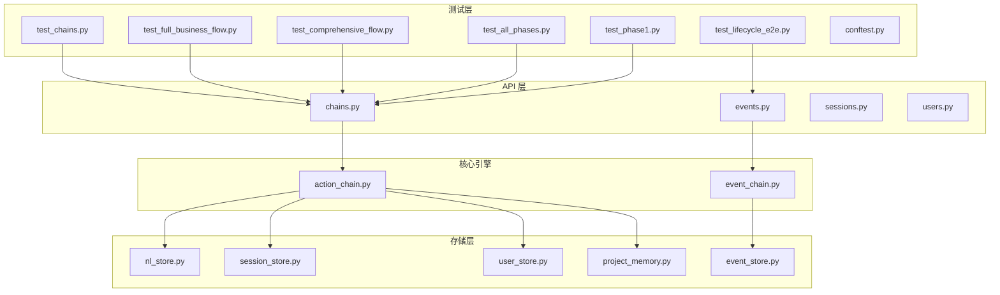
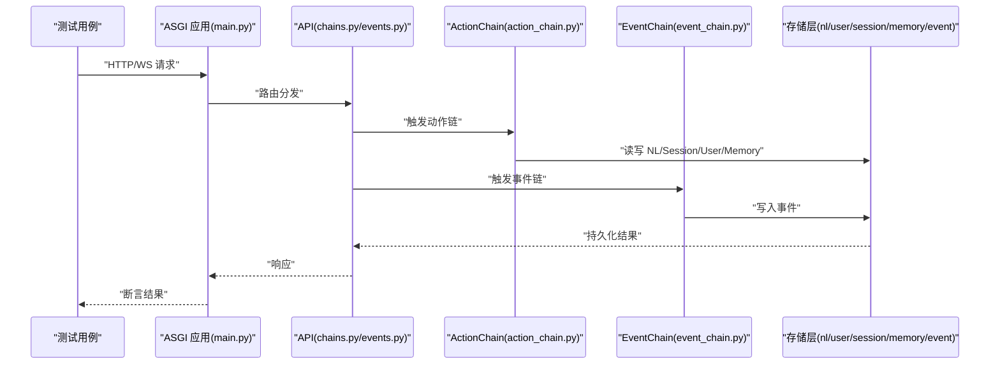
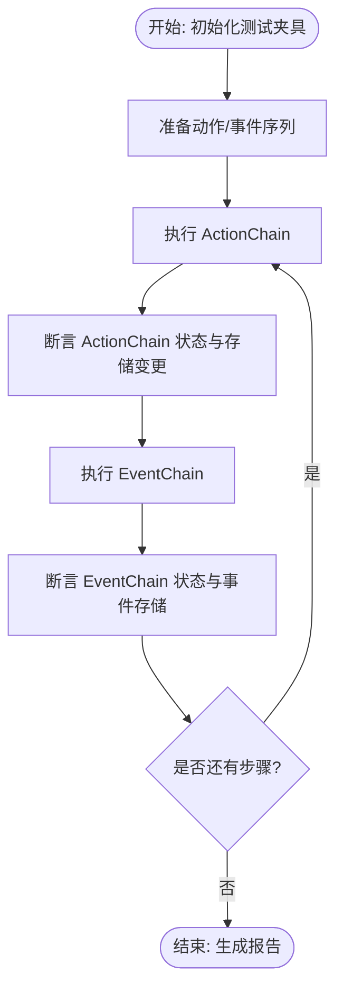
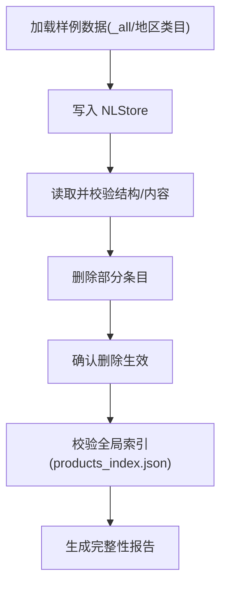
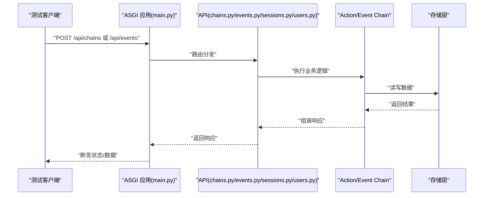
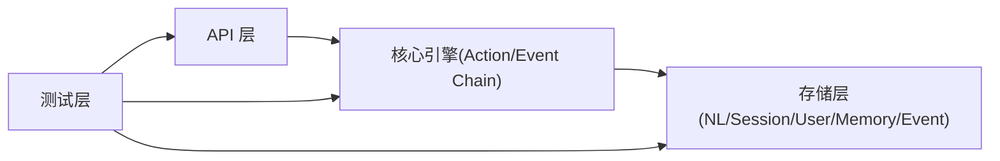

# 集成测试

<cite>
**本文引用的文件**
- [backend/app/core/action_chain.py](file://backend/app/core/action_chain.py)
- [backend/app/core/event_chain.py](file://backend/app/core/event_chain.py)
- [backend/app/storage/nl_store.py](file://backend/app/storage/nl_store.py)
- [backend/app/storage/session_store.py](file://backend/app/storage/session_store.py)
- [backend/app/storage/user_store.py](file://backend/app/storage/user_store.py)
- [backend/app/storage/project_memory.py](file://backend/app/storage/project_memory.py)
- [backend/app/storage/event_store.py](file://backend/app/storage/event_store.py)
- [backend/app/api/chains.py](file://backend/app/api/chains.py)
- [backend/app/api/events.py](file://backend/app/api/events.py)
- [backend/app/api/sessions.py](file://backend/app/api/sessions.py)
- [backend/app/api/users.py](file://backend/app/api/users.py)
- [backend/tests/test_chains.py](file://backend/tests/test_chains.py)
- [backend/tests/test_full_business_flow.py](file://backend/tests/test_full_business_flow.py)
- [backend/tests/test_comprehensive_flow.py](file://backend/tests/test_comprehensive_flow.py)
- [backend/tests/test_all_phases.py](file://backend/tests/test_all_phases.py)
- [backend/tests/test_phase1.py](file://backend/tests/test_phase1.py)
- [backend/tests/test_lifecycle_e2e.py](file://backend/tests/test_lifecycle_e2e.py)
- [backend/tests/conftest.py](file://backend/tests/conftest.py)
- [backend/pytest.ini](file://backend/pytest.ini)
- [backend/app/main.py](file://backend/app/main.py)
- [backend/data/nl_store/products/_all.json](file://backend/data/nl_store/products/_all.json)
- [backend/data/nl_store/products/玩具_欧盟.json](file://backend/data/nl_store/products/玩具_欧盟.json)
- [backend/data/nl_store/products/电子产品_德国.json](file://backend/data/nl_store/products/电子产品_德国.json)
- [backend/data/global/products_index.json](file://backend/data/global/products_index.json)
- [backend/data/chains/actions/chain_294bf6c842b6.json](file://backend/data/chains/actions/chain_294bf6c842b6.json)
- [backend/data/chains/actions/chain_2b1e9289634c.json](file://backend/data/chains/actions/chain_2b1e9289634c.json)
- [backend/data/chains/events/e2e_compliance_1780455088.json](file://backend/data/chains/events/e2e_compliance_1780455088.json)
- [backend/data/chains/events/e2e_compliance_1780455210.json](file://backend/data/chains/events/e2e_compliance_1780455210.json)
</cite>

## 目录
1. [引言](#引言)
2. [项目结构](#项目结构)
3. [核心组件](#核心组件)
4. [架构总览](#架构总览)
5. [详细组件分析](#详细组件分析)
6. [依赖分析](#依赖分析)
7. [性能考虑](#性能考虑)
8. [故障排查指南](#故障排查指南)
9. [结论](#结论)
10. [附录](#附录)

## 引言
本文件面向避风港平台的集成测试，系统性阐述多模块协作测试的设计原理与实现方法，重点覆盖：
- ActionChain/EventChain 状态流转测试策略
- NLStore CRUD 完整性验证方案
- ASGI 直连测试与完整请求链路验证
- 测试数据准备、模块依赖处理与测试环境配置
- 复杂业务流程的测试用例设计原则、错误处理与调试方法
- 常见问题与性能优化建议

## 项目结构
后端采用 Python/ASGI 架构，核心业务逻辑集中在 app/core 与 app/storage，API 层位于 app/api，测试位于 backend/tests。测试数据分布在 data 目录下的多处 JSON 文件中，便于快速初始化与验证。

图表来源
- [backend/tests/test_chains.py](file://backend/tests/test_chains.py)
- [backend/tests/test_full_business_flow.py](file://backend/tests/test_full_business_flow.py)
- [backend/tests/test_comprehensive_flow.py](file://backend/tests/test_comprehensive_flow.py)
- [backend/tests/test_all_phases.py](file://backend/tests/test_all_phases.py)
- [backend/tests/test_phase1.py](file://backend/tests/test_phase1.py)
- [backend/tests/test_lifecycle_e2e.py](file://backend/tests/test_lifecycle_e2e.py)
- [backend/app/api/chains.py](file://backend/app/api/chains.py)
- [backend/app/api/events.py](file://backend/app/api/events.py)
- [backend/app/core/action_chain.py](file://backend/app/core/action_chain.py)
- [backend/app/core/event_chain.py](file://backend/app/core/event_chain.py)
- [backend/app/storage/nl_store.py](file://backend/app/storage/nl_store.py)
- [backend/app/storage/session_store.py](file://backend/app/storage/session_store.py)
- [backend/app/storage/user_store.py](file://backend/app/storage/user_store.py)
- [backend/app/storage/project_memory.py](file://backend/app/storage/project_memory.py)
- [backend/app/storage/event_store.py](file://backend/app/storage/event_store.py)

章节来源
- [backend/tests/conftest.py](file://backend/tests/conftest.py)
- [backend/pytest.ini](file://backend/pytest.ini)

## 核心组件
- ActionChain：负责动作序列的状态推进与执行，贯穿会话、用户、项目记忆与 NLStore 的读写。
- EventChain：负责事件驱动的状态机推进，与全局事件总线协同，驱动合规与生命周期事件。
- NLStore：非结构化/自然语言存储，承载产品知识与检索增强的数据源。
- Session/User/Project/Event Store：会话、用户、项目记忆与事件持久化，支撑端到端状态一致性。

章节来源
- [backend/app/core/action_chain.py](file://backend/app/core/action_chain.py)
- [backend/app/core/event_chain.py](file://backend/app/core/event_chain.py)
- [backend/app/storage/nl_store.py](file://backend/app/storage/nl_store.py)
- [backend/app/storage/session_store.py](file://backend/app/storage/session_store.py)
- [backend/app/storage/user_store.py](file://backend/app/storage/user_store.py)
- [backend/app/storage/project_memory.py](file://backend/app/storage/project_memory.py)
- [backend/app/storage/event_store.py](file://backend/app/storage/event_store.py)

## 架构总览
下图展示了从测试发起到最终状态落库的关键路径，涵盖 ASGI 应用启动、API 调用、核心引擎处理与存储层写入。

图表来源
- [backend/app/main.py](file://backend/app/main.py)
- [backend/app/api/chains.py](file://backend/app/api/chains.py)
- [backend/app/api/events.py](file://backend/app/api/events.py)
- [backend/app/core/action_chain.py](file://backend/app/core/action_chain.py)
- [backend/app/core/event_chain.py](file://backend/app/core/event_chain.py)
- [backend/app/storage/nl_store.py](file://backend/app/storage/nl_store.py)
- [backend/app/storage/session_store.py](file://backend/app/storage/session_store.py)
- [backend/app/storage/user_store.py](file://backend/app/storage/user_store.py)
- [backend/app/storage/project_memory.py](file://backend/app/storage/project_memory.py)
- [backend/app/storage/event_store.py](file://backend/app/storage/event_store.py)

## 详细组件分析

### ActionChain/EventChain 状态流转测试
- 设计原则
  - 以最小可验证步骤拆分状态机推进，确保每一步都有明确的输入、处理与输出。
  - 使用测试夹具（fixture）注入真实存储实例，避免外部依赖。
  - 对关键节点进行断言：状态字段变化、存储写入、下游事件触发。
- 实现要点
  - 在测试中构造合法的动作序列与事件序列，逐步推进状态机，记录中间态与最终态。
  - 利用测试数据库快照或内存模式，保证可重复性与隔离性。
  - 对异常路径进行覆盖：非法输入、并发冲突、存储失败等。

图表来源
- [backend/tests/test_chains.py](file://backend/tests/test_chains.py)
- [backend/app/core/action_chain.py](file://backend/app/core/action_chain.py)
- [backend/app/core/event_chain.py](file://backend/app/core/event_chain.py)

章节来源
- [backend/tests/test_chains.py](file://backend/tests/test_chains.py)
- [backend/tests/test_full_business_flow.py](file://backend/tests/test_full_business_flow.py)
- [backend/tests/test_comprehensive_flow.py](file://backend/tests/test_comprehensive_flow.py)
- [backend/tests/test_all_phases.py](file://backend/tests/test_all_phases.py)
- [backend/tests/test_phase1.py](file://backend/tests/test_phase1.py)

### NLStore CRUD 完整性验证
- 设计原则
  - 以产品维度组织数据，覆盖不同地区/类目，确保跨区域一致性。
  - 读写一致性校验：写入后立即读取，比对结构与内容；删除后不可见。
  - 边界条件：空值、特殊字符、超长键名、重复键等。
- 数据准备
  - 使用 data/nl_store/products 下的样例 JSON 快速构建测试集。
  - 通过全局索引 products_index.json 校验产品清单完整性。
- 断言策略
  - 结构断言：字段存在性、类型匹配、枚举值约束。
  - 内容断言：关键字段值一致性、版本号递增、时间戳正确性。
  - 性能断言：批量导入/查询延迟阈值。

图表来源
- [backend/data/nl_store/products/_all.json](file://backend/data/nl_store/products/_all.json)
- [backend/data/nl_store/products/玩具_欧盟.json](file://backend/data/nl_store/products/玩具_欧盟.json)
- [backend/data/nl_store/products/电子产品_德国.json](file://backend/data/nl_store/products/电子产品_德国.json)
- [backend/data/global/products_index.json](file://backend/data/global/products_index.json)
- [backend/app/storage/nl_store.py](file://backend/app/storage/nl_store.py)

章节来源
- [backend/app/storage/nl_store.py](file://backend/app/storage/nl_store.py)
- [backend/data/nl_store/products/_all.json](file://backend/data/nl_store/products/_all.json)
- [backend/data/global/products_index.json](file://backend/data/global/products_index.json)

### ASGI 直连测试与完整请求链路验证
- 目标
  - 验证从客户端到存储层的完整链路，包括路由、认证、业务处理与持久化。
- 方法
  - 使用 pytest-asyncio 与 ASGI 测试客户端，直接向 app/main.py 发起请求。
  - 通过 conftest.py 注入应用实例与数据库/存储夹具，确保隔离与可重复。
  - 对关键 API（如动作链、事件链、会话、用户）进行端到端验证。
- 关键断言
  - HTTP/WS 状态码与响应体结构。
  - 存储层最终一致性：状态机推进后的数据落库与索引更新。
  - 并发场景：多请求并发时的锁与重试策略有效性。

图表来源
- [backend/app/main.py](file://backend/app/main.py)
- [backend/app/api/chains.py](file://backend/app/api/chains.py)
- [backend/app/api/events.py](file://backend/app/api/events.py)
- [backend/app/api/sessions.py](file://backend/app/api/sessions.py)
- [backend/app/api/users.py](file://backend/app/api/users.py)
- [backend/tests/conftest.py](file://backend/tests/conftest.py)

章节来源
- [backend/tests/test_lifecycle_e2e.py](file://backend/tests/test_lifecycle_e2e.py)
- [backend/tests/test_full_business_flow.py](file://backend/tests/test_full_business_flow.py)
- [backend/tests/conftest.py](file://backend/tests/conftest.py)

### 测试数据准备、模块依赖与环境配置
- 测试数据准备
  - 动作链样例：使用 data/chains/actions 下的 JSON 文件作为输入模板。
  - 事件链样例：使用 data/chains/events 下的 JSON 文件模拟生命周期与合规事件。
  - NLStore 样例：使用 data/nl_store/products 下的 JSON 文件初始化知识库。
- 模块依赖处理
  - 通过 conftest.py 统一管理应用实例、数据库连接、存储实例与认证上下文。
  - 在测试中按需注入 action_chain、event_chain、nl_store、session_store、user_store、event_store。
- 环境配置
  - 使用 pytest.ini 配置标记、插件与并发参数，确保测试稳定与可扩展。
  - 支持在 CI 中切换内存/临时数据库模式，提升执行效率。

章节来源
- [backend/data/chains/actions/chain_294bf6c842b6.json](file://backend/data/chains/actions/chain_294bf6c842b6.json)
- [backend/data/chains/actions/chain_2b1e9289634c.json](file://backend/data/chains/actions/chain_2b1e9289634c.json)
- [backend/data/chains/events/e2e_compliance_1780455088.json](file://backend/data/chains/events/e2e_compliance_1780455088.json)
- [backend/data/chains/events/e2e_compliance_1780455210.json](file://backend/data/chains/events/e2e_compliance_1780455210.json)
- [backend/tests/conftest.py](file://backend/tests/conftest.py)
- [backend/pytest.ini](file://backend/pytest.ini)

### 具体测试用例设计示例（路径指引）
- 动作链状态流转测试
  - 参考：[backend/tests/test_chains.py](file://backend/tests/test_chains.py)
- 端到端业务流程测试
  - 参考：[backend/tests/test_full_business_flow.py](file://backend/tests/test_full_business_flow.py)
- 综合流程与阶段测试
  - 参考：[backend/tests/test_comprehensive_flow.py](file://backend/tests/test_comprehensive_flow.py)
  - 参考：[backend/tests/test_all_phases.py](file://backend/tests/test_all_phases.py)
  - 参考：[backend/tests/test_phase1.py](file://backend/tests/test_phase1.py)
- 生命周期 E2E 测试
  - 参考：[backend/tests/test_lifecycle_e2e.py](file://backend/tests/test_lifecycle_e2e.py)

## 依赖分析
- 组件耦合
  - API 层仅依赖核心引擎接口，核心引擎依赖存储层抽象，降低耦合度。
  - 存储层通过统一接口暴露读写能力，便于替换与测试替身。
- 外部依赖
  - 测试期间可通过夹具替换真实外部服务，确保可重复性。
- 循环依赖
  - 通过清晰的接口契约与模块边界避免循环依赖风险。

图表来源
- [backend/app/api/chains.py](file://backend/app/api/chains.py)
- [backend/app/api/events.py](file://backend/app/api/events.py)
- [backend/app/core/action_chain.py](file://backend/app/core/action_chain.py)
- [backend/app/core/event_chain.py](file://backend/app/core/event_chain.py)
- [backend/app/storage/nl_store.py](file://backend/app/storage/nl_store.py)
- [backend/tests/test_chains.py](file://backend/tests/test_chains.py)

章节来源
- [backend/app/api/chains.py](file://backend/app/api/chains.py)
- [backend/app/api/events.py](file://backend/app/api/events.py)
- [backend/app/core/action_chain.py](file://backend/app/core/action_chain.py)
- [backend/app/core/event_chain.py](file://backend/app/core/event_chain.py)
- [backend/app/storage/nl_store.py](file://backend/app/storage/nl_store.py)

## 性能考虑
- 测试并发
  - 使用 pytest-xdist 分布式执行，结合 conftest 中的资源池化，减少冷启动开销。
- 存储优化
  - 在测试中优先使用内存数据库或临时文件系统，缩短 I/O 时间。
  - 对批量写入操作进行分批与事务合并，降低锁竞争。
- 链路优化
  - 将频繁调用的 API 进行缓存与预热，避免首请求延迟影响整体吞吐。
  - 对长链路请求设置合理超时与重试策略，提升稳定性。

## 故障排查指南
- 常见问题
  - 状态不一致：检查 ActionChain/EventChain 的幂等性与回滚逻辑。
  - 数据缺失：核对 NLStore 写入与索引更新顺序，确保最终一致性。
  - 并发冲突：引入重试与乐观锁，必要时降级为串行化处理。
- 调试方法
  - 使用 pytest 的 -s 与 --pdb 开启输出与断点调试。
  - 在 conftest 中启用详细日志，定位具体模块与调用栈。
  - 对关键断言增加上下文信息（如时间戳、版本号、状态码），便于复盘。

章节来源
- [backend/tests/conftest.py](file://backend/tests/conftest.py)
- [backend/app/core/action_chain.py](file://backend/app/core/action_chain.py)
- [backend/app/core/event_chain.py](file://backend/app/core/event_chain.py)
- [backend/app/storage/nl_store.py](file://backend/app/storage/nl_store.py)

## 结论
通过将 ActionChain/EventChain 的状态流转与 NLStore 的 CRUD 完整性验证相结合，并辅以 ASGI 直连测试与完善的测试数据准备，可以系统性覆盖避风港平台的核心业务流程。配合合理的依赖管理、环境配置与性能优化策略，能够显著提升集成测试的稳定性与可维护性。

## 附录
- 测试夹具与应用实例注入参考：[backend/tests/conftest.py](file://backend/tests/conftest.py)
- ASGI 应用入口参考：[backend/app/main.py](file://backend/app/main.py)
- 测试运行配置参考：[backend/pytest.ini](file://backend/pytest.ini)