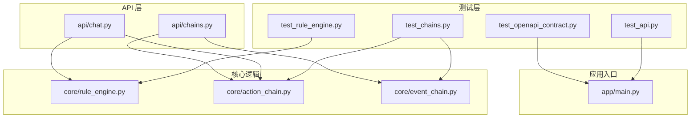
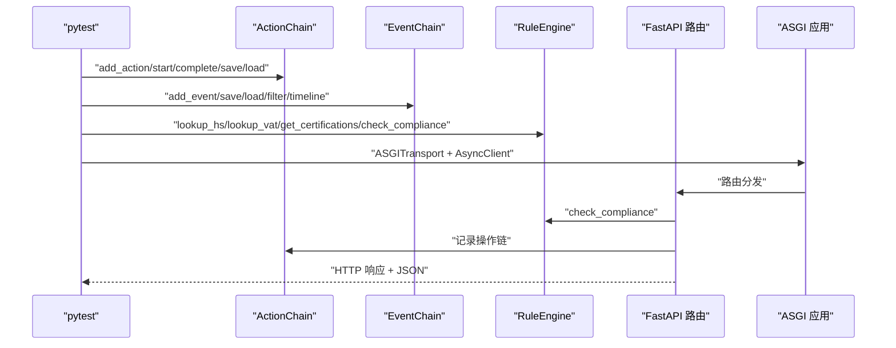
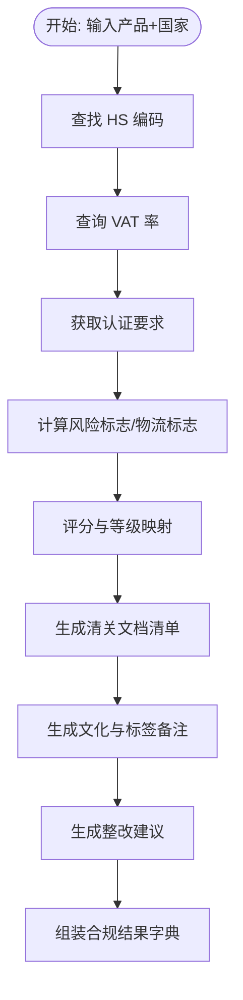
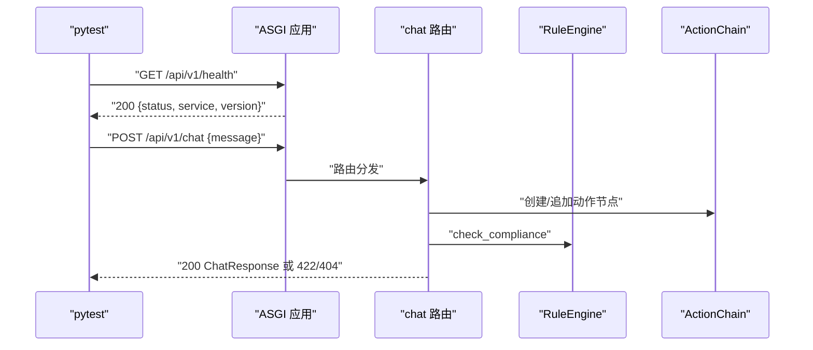
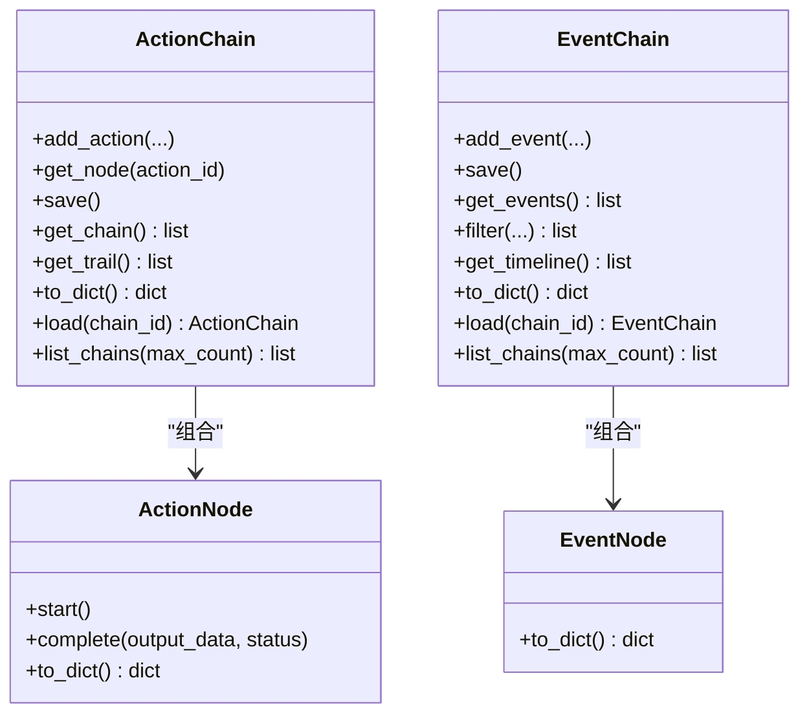
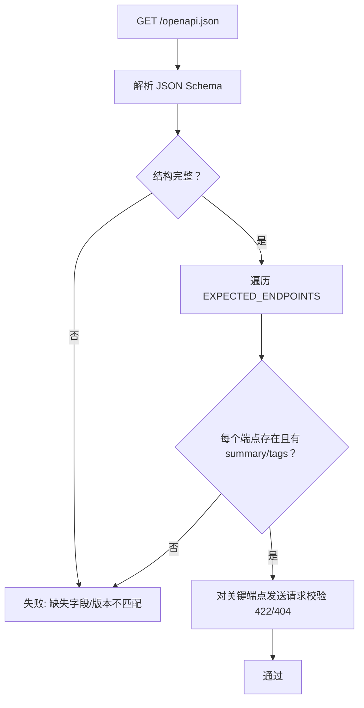
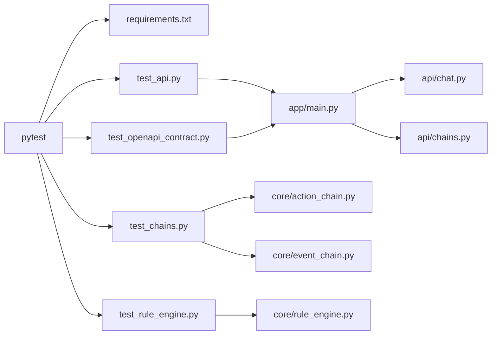

# 测试调试

<cite>
**本文档引用的文件**
- [backend/tests/test_api.py](file://backend/tests/test_api.py)
- [backend/tests/test_chains.py](file://backend/tests/test_chains.py)
- [backend/tests/test_rule_engine.py](file://backend/tests/test_rule_engine.py)
- [backend/tests/test_openapi_contract.py](file://backend/tests/test_openapi_contract.py)
- [backend/requirements.txt](file://backend/requirements.txt)
- [backend/app/main.py](file://backend/app/main.py)
- [backend/app/api/chat.py](file://backend/app/api/chat.py)
- [backend/app/api/chains.py](file://backend/app/api/chains.py)
- [backend/app/core/rule_engine.py](file://backend/app/core/rule_engine.py)
- [backend/app/core/action_chain.py](file://backend/app/core/action_chain.py)
- [backend/app/core/event_chain.py](file://backend/app/core/event_chain.py)
- [docker-compose.yml](file://docker-compose.yml)
</cite>

## 目录
1. [简介](#简介)
2. [项目结构](#项目结构)
3. [核心组件](#核心组件)
4. [架构总览](#架构总览)
5. [详细组件分析](#详细组件分析)
6. [依赖分析](#依赖分析)
7. [性能考虑](#性能考虑)
8. [故障排查指南](#故障排查指南)
9. [结论](#结论)
10. [附录](#附录)

## 简介
本指南聚焦于项目的测试与调试实践，涵盖测试策略、pytest 使用、用例设计原则，以及单元测试、集成测试、端到端测试的实施方法。同时，针对规则引擎、API、操作链与事件链、OpenAPI 契约测试给出具体实现要点；并提供断点调试、日志分析、性能分析、覆盖率与质量保障流程、持续集成与自动化测试配置建议，以及性能与压力测试方法。

## 项目结构
后端采用 FastAPI 应用，测试位于 backend/tests，核心业务逻辑分布在 app/core 与 app/api 中，数据与提示词位于 backend/data。

图表来源
- [backend/tests/test_api.py:1-30](file://backend/tests/test_api.py#L1-L30)
- [backend/tests/test_chains.py:1-99](file://backend/tests/test_chains.py#L1-L99)
- [backend/tests/test_rule_engine.py:1-112](file://backend/tests/test_rule_engine.py#L1-L112)
- [backend/tests/test_openapi_contract.py:1-175](file://backend/tests/test_openapi_contract.py#L1-L175)
- [backend/app/main.py:1-76](file://backend/app/main.py#L1-L76)
- [backend/app/api/chat.py:1-541](file://backend/app/api/chat.py#L1-L541)
- [backend/app/api/chains.py:1-282](file://backend/app/api/chains.py#L1-L282)
- [backend/app/core/rule_engine.py:1-247](file://backend/app/core/rule_engine.py#L1-L247)
- [backend/app/core/action_chain.py:1-236](file://backend/app/core/action_chain.py#L1-L236)
- [backend/app/core/event_chain.py:1-215](file://backend/app/core/event_chain.py#L1-L215)

章节来源
- [backend/tests/test_api.py:1-30](file://backend/tests/test_api.py#L1-L30)
- [backend/tests/test_chains.py:1-99](file://backend/tests/test_chains.py#L1-L99)
- [backend/tests/test_rule_engine.py:1-112](file://backend/tests/test_rule_engine.py#L1-L112)
- [backend/tests/test_openapi_contract.py:1-175](file://backend/tests/test_openapi_contract.py#L1-L175)
- [backend/app/main.py:1-76](file://backend/app/main.py#L1-L76)

## 核心组件
- 规则引擎：基于确定性规则的合规检查，提供 HS 编码查找、VAT 率查询、认证要求、风险标志、物流与清关文档建议等能力。
- 操作链：记录系统内各步骤的自然语言描述，支持追加、完成、保存、加载、回溯与可视化。
- 事件链：记录系统内外部重要事件，支持按来源/类型/严重度/标签筛选与时间线展示。
- API 路由：提供聊天、操作链、事件链、自然语言存储等接口；OpenAPI 文档自动生成。

章节来源
- [backend/app/core/rule_engine.py:1-247](file://backend/app/core/rule_engine.py#L1-L247)
- [backend/app/core/action_chain.py:1-236](file://backend/app/core/action_chain.py#L1-L236)
- [backend/app/core/event_chain.py:1-215](file://backend/app/core/event_chain.py#L1-L215)
- [backend/app/api/chat.py:1-541](file://backend/app/api/chat.py#L1-L541)
- [backend/app/api/chains.py:1-282](file://backend/app/api/chains.py#L1-L282)

## 架构总览
测试覆盖贯穿三层：单元测试（规则引擎）、集成测试（操作链/事件链/本地存储）、端到端测试（FastAPI 路由与 OpenAPI 契约）。

图表来源
- [backend/tests/test_chains.py:1-99](file://backend/tests/test_chains.py#L1-L99)
- [backend/tests/test_rule_engine.py:1-112](file://backend/tests/test_rule_engine.py#L1-L112)
- [backend/tests/test_api.py:1-30](file://backend/tests/test_api.py#L1-L30)
- [backend/app/main.py:1-76](file://backend/app/main.py#L1-L76)
- [backend/app/api/chat.py:1-541](file://backend/app/api/chat.py#L1-L541)
- [backend/app/core/rule_engine.py:1-247](file://backend/app/core/rule_engine.py#L1-L247)
- [backend/app/core/action_chain.py:1-236](file://backend/app/core/action_chain.py#L1-L236)
- [backend/app/core/event_chain.py:1-215](file://backend/app/core/event_chain.py#L1-L215)

## 详细组件分析

### 规则引擎测试
- 目标：验证 HS 编码匹配、VAT 率、认证要求、风险标志、合规检查主流程等。
- 方法：pytest 单元测试，使用类分组组织用例，覆盖精确匹配、部分匹配、未知产品/国家的降级行为。
- 关键断言：字段存在性、数值范围、列表长度、风险等级映射、整改建议生成。

图表来源
- [backend/tests/test_rule_engine.py:1-112](file://backend/tests/test_rule_engine.py#L1-L112)
- [backend/app/core/rule_engine.py:197-247](file://backend/app/core/rule_engine.py#L197-L247)

章节来源
- [backend/tests/test_rule_engine.py:1-112](file://backend/tests/test_rule_engine.py#L1-L112)
- [backend/app/core/rule_engine.py:1-247](file://backend/app/core/rule_engine.py#L1-L247)

### API 测试（端到端）
- 目标：验证健康检查、聊天端点参数校验、错误码（422/404）等。
- 方法：ASGITransport + AsyncClient 直接调用 /api/v1/* 路由，不依赖外部 LLM 时走关键词降级路径。
- 关键断言：状态码、响应结构、版本字段、错误详情。

图表来源
- [backend/tests/test_api.py:1-30](file://backend/tests/test_api.py#L1-L30)
- [backend/app/main.py:33-35](file://backend/app/main.py#L33-L35)
- [backend/app/api/chat.py:228-264](file://backend/app/api/chat.py#L228-L264)
- [backend/app/core/rule_engine.py:197-247](file://backend/app/core/rule_engine.py#L197-L247)
- [backend/app/core/action_chain.py:77-122](file://backend/app/core/action_chain.py#L77-L122)

章节来源
- [backend/tests/test_api.py:1-30](file://backend/tests/test_api.py#L1-L30)
- [backend/app/api/chat.py:1-541](file://backend/app/api/chat.py#L1-L541)
- [backend/app/core/rule_engine.py:197-247](file://backend/app/core/rule_engine.py#L197-L247)
- [backend/app/core/action_chain.py:1-236](file://backend/app/core/action_chain.py#L1-L236)

### 操作链与事件链测试（集成）
- 目标：验证链路的增删查改、持久化、加载、筛选与时间线展示。
- 方法：直接导入 ActionChain/EventChain/NLStore，构造最小工作集，断言保存/加载一致性、轨迹/时间线格式。
- 关键断言：链节点数量、状态聚合、轨迹/时间线格式、搜索命中数、记录 CRUD 行为。

图表来源
- [backend/tests/test_chains.py:1-99](file://backend/tests/test_chains.py#L1-L99)
- [backend/app/core/action_chain.py:23-122](file://backend/app/core/action_chain.py#L23-L122)
- [backend/app/core/event_chain.py:24-141](file://backend/app/core/event_chain.py#L24-L141)

章节来源
- [backend/tests/test_chains.py:1-99](file://backend/tests/test_chains.py#L1-L99)
- [backend/app/core/action_chain.py:1-236](file://backend/app/core/action_chain.py#L1-L236)
- [backend/app/core/event_chain.py:1-215](file://backend/app/core/event_chain.py#L1-L215)

### OpenAPI 契约测试
- 目标：验证 OpenAPI schema 结构完整性、端点注册、请求/响应模型、参数校验与关键端点响应类型。
- 方法：访问 /openapi.json，遍历 EXPECTED_ENDPOINTS，断言 summary/tags/path/method 存在与一致；对关键端点做请求校验。
- 关键断言：schema 版本、paths 完整性、端点存在性、422/404 错误码。

图表来源
- [backend/tests/test_openapi_contract.py:1-175](file://backend/tests/test_openapi_contract.py#L1-L175)
- [backend/app/main.py:7-11](file://backend/app/main.py#L7-L11)

章节来源
- [backend/tests/test_openapi_contract.py:1-175](file://backend/tests/test_openapi_contract.py#L1-L175)
- [backend/app/main.py:1-76](file://backend/app/main.py#L1-L76)

## 依赖分析
- 测试框架：pytest + pytest-asyncio，支持异步端点测试。
- HTTP 客户端：httpx ASGITransport，无需启动真实服务器即可测试 ASGI 应用。
- FastAPI：路由注册、OpenAPI 自动生成、响应模型校验。
- 核心模块：规则引擎、操作链、事件链、聊天路由、链式 API。

图表来源
- [backend/requirements.txt:14-18](file://backend/requirements.txt#L14-L18)
- [backend/tests/test_api.py:1-30](file://backend/tests/test_api.py#L1-L30)
- [backend/tests/test_chains.py:1-99](file://backend/tests/test_chains.py#L1-L99)
- [backend/tests/test_rule_engine.py:1-112](file://backend/tests/test_rule_engine.py#L1-L112)
- [backend/tests/test_openapi_contract.py:1-175](file://backend/tests/test_openapi_contract.py#L1-L175)
- [backend/app/main.py:1-76](file://backend/app/main.py#L1-L76)
- [backend/app/api/chat.py:1-541](file://backend/app/api/chat.py#L1-L541)
- [backend/app/api/chains.py:1-282](file://backend/app/api/chains.py#L1-L282)
- [backend/app/core/rule_engine.py:1-247](file://backend/app/core/rule_engine.py#L1-L247)
- [backend/app/core/action_chain.py:1-236](file://backend/app/core/action_chain.py#L1-L236)
- [backend/app/core/event_chain.py:1-215](file://backend/app/core/event_chain.py#L1-L215)

章节来源
- [backend/requirements.txt:1-27](file://backend/requirements.txt#L1-L27)

## 性能考虑
- 异步测试：pytest-asyncio 提升端到端测试并发效率。
- 本地存储：操作链/事件链/自然语言存储均使用本地 JSON 文件，测试时避免外部依赖，提升稳定性与速度。
- 覆盖率：建议结合 pytest-cov 在 CI 中统计覆盖率，关注规则引擎与聊天路由的关键路径。
- 日志：FastAPI 默认日志可满足开发期定位；生产建议接入结构化日志与采样追踪。
- 压力测试：可在 CI 中使用 httpx 异步客户端配合 pytest-asyncio 进行轻量压力验证（如并发请求数、超时阈值）。

## 故障排查指南
- 健康检查失败
  - 现象：/api/v1/health 返回非 200。
  - 排查：确认应用已启动、路由注册正确、CORS 配置允许来源。
  - 参考：[backend/app/main.py:33-35](file://backend/app/main.py#L33-L35)
- 参数校验错误
  - 现象：POST /api/v1/chat 返回 422。
  - 排查：检查请求体是否包含必需字段；无 LLM Key 时走关键词降级，仍应返回 200。
  - 参考：[backend/tests/test_api.py:24-30](file://backend/tests/test_api.py#L24-L30)
- 资源不存在
  - 现象：获取操作链/事件链/记录返回 404。
  - 排查：确认 chain_id/key 是否存在；检查持久化目录权限与文件格式。
  - 参考：[backend/tests/test_openapi_contract.py:131-134](file://backend/tests/test_openapi_contract.py#L131-L134)
- OpenAPI 契约不匹配
  - 现象：契约测试断言失败。
  - 排查：核对路由定义、response_model、tags/summary 是否齐全；确保 /openapi.json 可访问。
  - 参考：[backend/tests/test_openapi_contract.py:46-87](file://backend/tests/test_openapi_contract.py#L46-L87)

章节来源
- [backend/app/main.py:1-76](file://backend/app/main.py#L1-L76)
- [backend/tests/test_api.py:1-30](file://backend/tests/test_api.py#L1-L30)
- [backend/tests/test_openapi_contract.py:1-175](file://backend/tests/test_openapi_contract.py#L1-L175)

## 结论
本项目测试体系以 pytest 为核心，结合 ASGI 端到端测试与 OpenAPI 契约验证，覆盖规则引擎、操作链/事件链与聊天 API 的关键路径。通过清晰的用例设计与断言策略，能够有效保障接口稳定性与数据一致性。建议在 CI 中引入覆盖率统计与压力验证，持续优化测试效率与质量。

## 附录

### 测试策略与用例设计原则
- 单元测试：聚焦纯函数与规则逻辑，使用边界值与异常场景覆盖。
- 集成测试：验证组件协作与持久化一致性，关注链路完整性与格式规范。
- 端到端测试：通过 ASGITransport 直连路由，覆盖真实请求/响应与错误码。
- OpenAPI 契约测试：确保路由与 schema 一致性，防止接口漂移。

### 调试技巧与工具
- 断点调试：在 pytest 中使用 IDE 断点或 python -m pytest --pdb。
- 日志分析：开启 FastAPI uvicorn 日志，定位路由与异常堆栈。
- 性能分析：使用 cProfile 或 pytest-benchmark 对关键路径进行基准对比。
- 覆盖率：pytest --cov=backend/app --cov-report=term-missing。

### 测试数据准备与环境搭建
- 后端依赖：requirements.txt 已包含 pytest、pytest-asyncio、httpx、FastAPI。
- 环境变量：聊天端点在无 OPENROUTER_API_KEY 时走关键词降级路径，便于测试。
- Docker：可参考 docker-compose.yml 启动后端服务，再运行 pytest。

章节来源
- [backend/requirements.txt:1-27](file://backend/requirements.txt#L1-L27)
- [backend/tests/test_api.py:3-4](file://backend/tests/test_api.py#L3-L4)
- [docker-compose.yml](file://docker-compose.yml)

### 持续集成与自动化测试配置建议
- 触发：push/pr 触发测试矩阵（Python 版本、依赖版本）。
- 步骤：安装依赖 → 运行 pytest（含 --cov）→ 上传覆盖率报告 → 失败即中断。
- 并行：pytest-xdist 分布式执行，缩短 CI 时间。
- 缓存：缓存 pip/pytest 缓存目录，提升重复任务速度。

### 性能测试与压力测试方法
- 轻量压力：pytest + httpx 异步客户端并发请求，统计平均/95 分位延迟与错误率。
- 场景：聊天端点、操作链/事件链列表与详情接口。
- 基准：pytest-benchmark 为关键路径建立基线，防止回归。