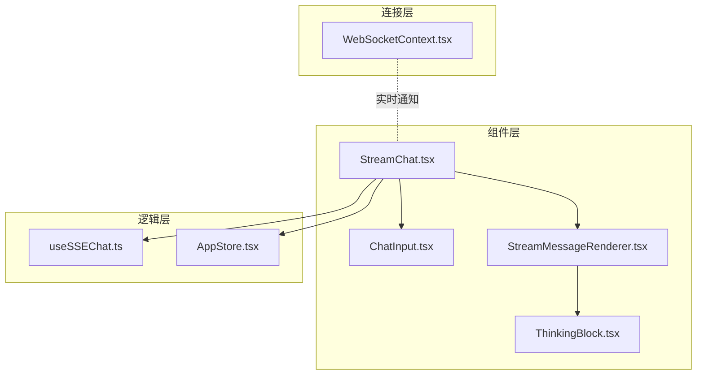
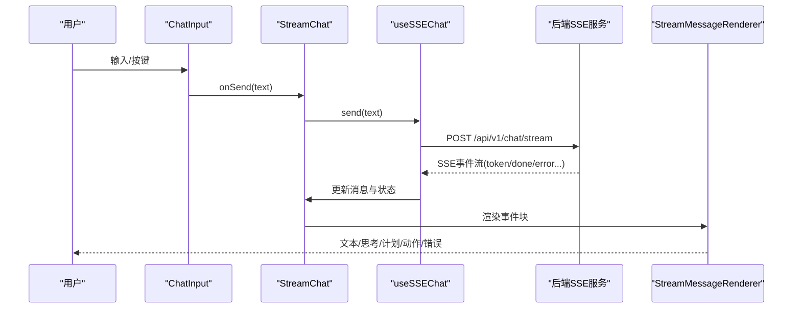
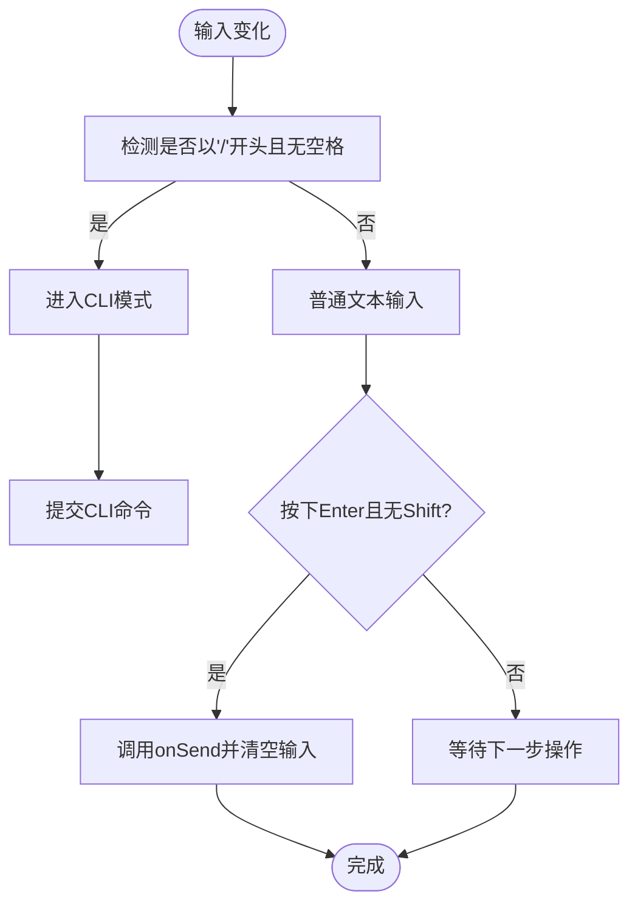
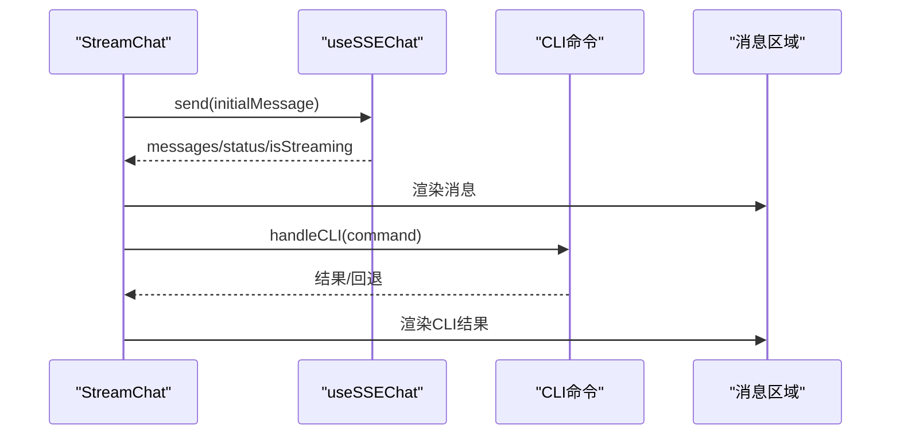
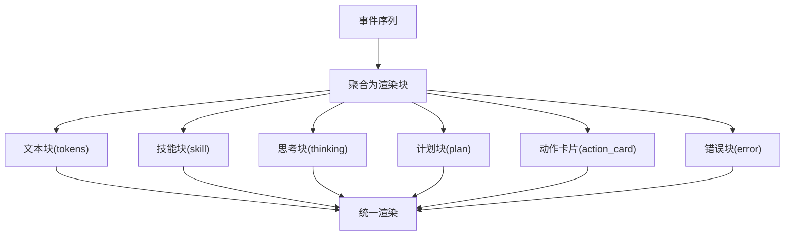
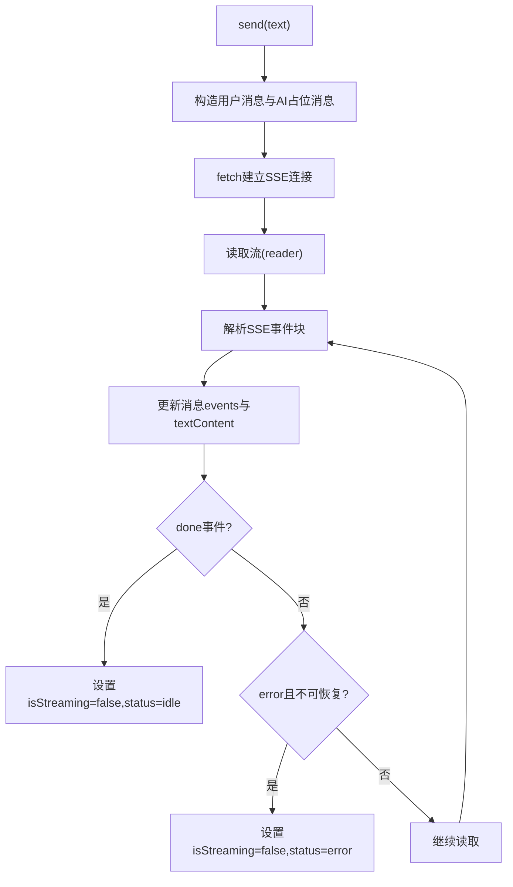
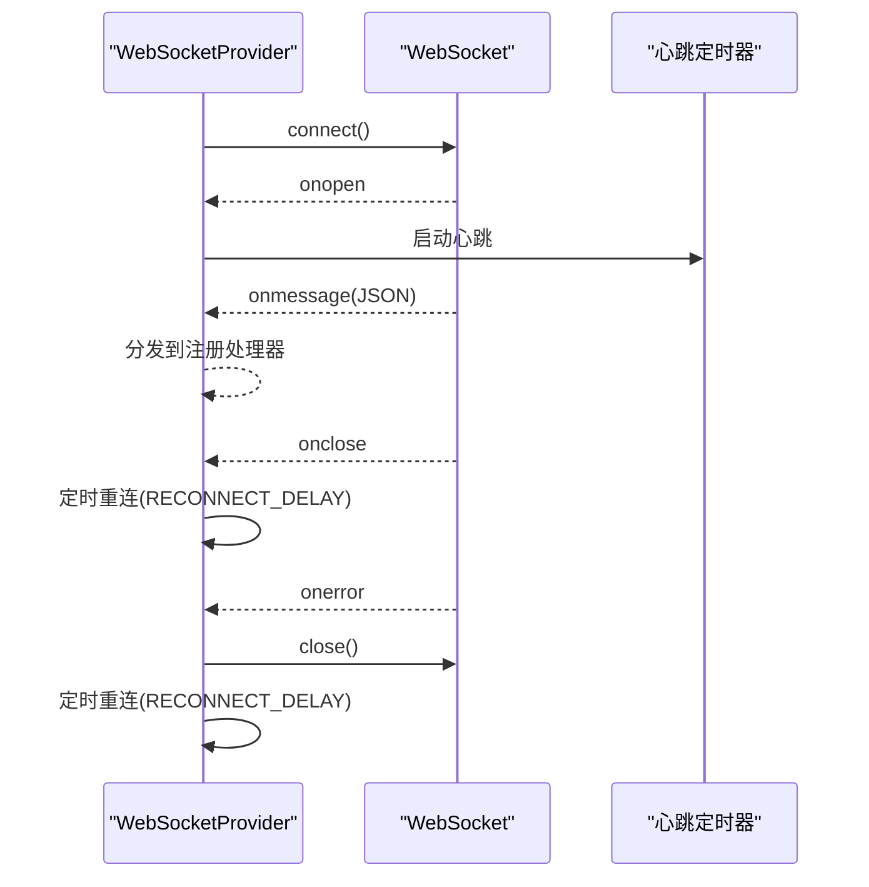
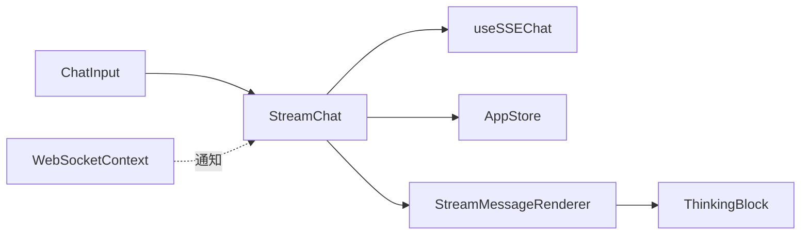

# 交互式组件

<cite>
**本文引用的文件**
- [ChatInput.tsx](file://frontend/src/components/ChatInput.tsx)
- [StreamChat.tsx](file://frontend/src/components/StreamChat.tsx)
- [ThinkingBlock.tsx](file://frontend/src/components/ThinkingBlock.tsx)
- [StreamMessageRenderer.tsx](file://frontend/src/components/StreamMessageRenderer.tsx)
- [useSSEChat.ts](file://frontend/src/hooks/useSSEChat.ts)
- [WebSocketContext.tsx](file://frontend/src/context/WebSocketContext.tsx)
- [AppStore.tsx](file://frontend/src/context/AppStore.tsx)
</cite>

## 目录
1. [简介](#简介)
2. [项目结构](#项目结构)
3. [核心组件](#核心组件)
4. [架构总览](#架构总览)
5. [详细组件分析](#详细组件分析)
6. [依赖关系分析](#依赖关系分析)
7. [性能考量](#性能考量)
8. [故障排查指南](#故障排查指南)
9. [结论](#结论)
10. [附录](#附录)

## 简介
本文件面向避风港平台的前端交互式组件，围绕以下目标展开：  
- 描述 ChatInput 聊天输入框、StreamChat 流式聊天组件、ThinkingBlock 思考过程展示的实现与协作方式  
- 记录实时消息发送、流式响应处理、思考过程可视化与用户输入验证  
- 说明 SSE 服务器推送连接、消息状态管理与错误重连机制  
- 提供消息历史记录、快捷回复与输入建议能力的实现路径  
- 解决长文本处理、消息去重与并发控制问题  
- 记录 WebSocket 连接管理与实时通信协议要点  

## 项目结构
前端交互式组件位于 frontend/src 下，采用按功能分层组织：  
- components：UI 组件层（ChatInput、StreamChat、ThinkingBlock、StreamMessageRenderer 等）  
- hooks：业务逻辑钩子（useSSEChat）  
- context：全局状态与连接管理（AppStore、WebSocketContext）  
- pages：页面级容器（如 ChatWorkspacePage.tsx），负责组合上述组件

图表来源
- [StreamChat.tsx:38-206](file://frontend/src/components/StreamChat.tsx#L38-L206)
- [ChatInput.tsx:13-118](file://frontend/src/components/ChatInput.tsx#L13-L118)
- [StreamMessageRenderer.tsx:22-53](file://frontend/src/components/StreamMessageRenderer.tsx#L22-L53)
- [ThinkingBlock.tsx:8-35](file://frontend/src/components/ThinkingBlock.tsx#L8-L35)
- [useSSEChat.ts:85-278](file://frontend/src/hooks/useSSEChat.ts#L85-L278)
- [AppStore.tsx:21-92](file://frontend/src/context/AppStore.tsx#L21-L92)
- [WebSocketContext.tsx:31-132](file://frontend/src/context/WebSocketContext.tsx#L31-L132)

章节来源
- [StreamChat.tsx:38-206](file://frontend/src/components/StreamChat.tsx#L38-L206)
- [ChatInput.tsx:13-118](file://frontend/src/components/ChatInput.tsx#L13-L118)
- [StreamMessageRenderer.tsx:22-53](file://frontend/src/components/StreamMessageRenderer.tsx#L22-L53)
- [ThinkingBlock.tsx:8-35](file://frontend/src/components/ThinkingBlock.tsx#L8-L35)
- [useSSEChat.ts:85-278](file://frontend/src/hooks/useSSEChat.ts#L85-L278)
- [AppStore.tsx:21-92](file://frontend/src/context/AppStore.tsx#L21-L92)
- [WebSocketContext.tsx:31-132](file://frontend/src/context/WebSocketContext.tsx#L31-L132)

## 核心组件
- ChatInput：提供多行文本输入、自动高度调整、Enter 发送/Shift+Enter 换行、/ 前缀进入 CLI 模式、流式中显示“停止”按钮等交互
- StreamChat：承载消息列表、状态指示、输入区与 CLI 结果展示；通过 useSSEChat 管理 SSE 连接与消息流
- StreamMessageRenderer：将 SSE 事件流聚合为 UI 块（文本、思考过程、计划、动作卡片、错误提示等）
- ThinkingBlock：折叠/展开的思考过程展示块，支持深度标记
- useSSEChat：封装 SSE 连接、事件解析、消息状态管理、中断与清理
- WebSocketContext：WebSocket 连接管理、心跳、重连与事件分发

章节来源
- [ChatInput.tsx:13-118](file://frontend/src/components/ChatInput.tsx#L13-L118)
- [StreamChat.tsx:38-206](file://frontend/src/components/StreamChat.tsx#L38-L206)
- [StreamMessageRenderer.tsx:22-53](file://frontend/src/components/StreamMessageRenderer.tsx#L22-L53)
- [ThinkingBlock.tsx:8-35](file://frontend/src/components/ThinkingBlock.tsx#L8-L35)
- [useSSEChat.ts:85-278](file://frontend/src/hooks/useSSEChat.ts#L85-L278)
- [WebSocketContext.tsx:31-132](file://frontend/src/context/WebSocketContext.tsx#L31-L132)

## 架构总览
整体交互链路如下：  
- 用户在 ChatInput 输入消息，触发 StreamChat 的 send（来自 useSSEChat）
- useSSEChat 通过 POST /api/v1/chat/stream 建立 SSE 连接，接收 token/done/error 等事件
- StreamMessageRenderer 将事件聚合为 UI 块，包括 ThinkingBlock、PlanBlock、ActionSuggestionCard 等
- StreamChat 负责消息渲染、滚动、CLI 命令执行与状态显示
- WebSocketContext 提供后台实时通知（非流式对话），用于系统状态、合规提醒等

图表来源
- [StreamChat.tsx:51-56](file://frontend/src/components/StreamChat.tsx#L51-L56)
- [useSSEChat.ts:102-261](file://frontend/src/hooks/useSSEChat.ts#L102-L261)
- [StreamMessageRenderer.tsx:22-53](file://frontend/src/components/StreamMessageRenderer.tsx#L22-L53)

## 详细组件分析

### ChatInput 组件
职责与特性：  
- 自动聚焦与高度自适应（最多 120px）
- Enter 发送、Shift+Enter 换行、/ 前缀进入 CLI 模式
- 流式中显示“停止”按钮，支持中断
- 输入验证：禁用状态下阻止发送，空输入忽略
- CLI 模式下委托 CLICommandInput 执行命令

图表来源
- [ChatInput.tsx:32-61](file://frontend/src/components/ChatInput.tsx#L32-L61)
- [ChatInput.tsx:43-55](file://frontend/src/components/ChatInput.tsx#L43-L55)

章节来源
- [ChatInput.tsx:13-118](file://frontend/src/components/ChatInput.tsx#L13-L118)

### StreamChat 组件
职责与特性：  
- 通过 useSSEChat 获取 messages、status、isStreaming，并提供 send/abort/clear
- 自动滚动至最新消息
- 支持 initialMessage 自动发送与消费回调
- CLI 命令执行：/clear、/help、/status、/config 等，失败时本地回退
- 状态标签与颜色映射，显示连接状态
- 消息渲染：用户消息右对齐，AI 消息左对齐，支持空状态提示

图表来源
- [StreamChat.tsx:68-75](file://frontend/src/components/StreamChat.tsx#L68-L75)
- [StreamChat.tsx:77-114](file://frontend/src/components/StreamChat.tsx#L77-L114)
- [StreamChat.tsx:155-175](file://frontend/src/components/StreamChat.tsx#L155-L175)

章节来源
- [StreamChat.tsx:38-206](file://frontend/src/components/StreamChat.tsx#L38-L206)

### StreamMessageRenderer 与 ThinkingBlock
职责与特性：  
- 将连续 token 事件合并为文本段落
- skill_start/skill_end 成对聚合为技能块
- thinking、plan、action_card、error 独立渲染
- ThinkingBlock 支持折叠/展开与深度标注
- 流式中显示“正在思考”动画与光标

图表来源
- [StreamMessageRenderer.tsx:65-146](file://frontend/src/components/StreamMessageRenderer.tsx#L65-L146)
- [ThinkingBlock.tsx:8-35](file://frontend/src/components/ThinkingBlock.tsx#L8-L35)

章节来源
- [StreamMessageRenderer.tsx:22-53](file://frontend/src/components/StreamMessageRenderer.tsx#L22-L53)
- [StreamMessageRenderer.tsx:65-146](file://frontend/src/components/StreamMessageRenderer.tsx#L65-L146)
- [ThinkingBlock.tsx:8-35](file://frontend/src/components/ThinkingBlock.tsx#L8-L35)

### useSSEChat 钩子（SSE 连接与消息管理）
职责与特性：  
- 建立与后端的 SSE 连接，解析事件块，提取 token 文本
- 管理消息状态：connecting/connected/reconnecting/disconnected/error/idle
- 空闲超时：60 秒无事件回到 idle
- 并发控制：同一时间仅允许一个流，中断上一个请求
- 错误处理：网络异常转为 error 事件，支持不可恢复错误终止
- 提供 send/abort/clear 三类操作

图表来源
- [useSSEChat.ts:102-261](file://frontend/src/hooks/useSSEChat.ts#L102-L261)
- [useSSEChat.ts:17-36](file://frontend/src/hooks/useSSEChat.ts#L17-L36)
- [useSSEChat.ts:48-53](file://frontend/src/hooks/useSSEChat.ts#L48-L53)

章节来源
- [useSSEChat.ts:85-278](file://frontend/src/hooks/useSSEChat.ts#L85-L278)

### WebSocketContext（实时通知与重连）
职责与特性：  
- 基于 ws://localhost:8000 建立连接，携带 user_id 查询参数
- 心跳：每 30 秒发送 ping
- 自动重连：断开后 5 秒重试
- 事件分发：支持按类型与通配符(*)注册监听器
- 提供 status/lastMessage/reconnect/on 接口

图表来源
- [WebSocketContext.tsx:39-92](file://frontend/src/context/WebSocketContext.tsx#L39-L92)
- [WebSocketContext.tsx:110-118](file://frontend/src/context/WebSocketContext.tsx#L110-L118)

章节来源
- [WebSocketContext.tsx:31-132](file://frontend/src/context/WebSocketContext.tsx#L31-L132)

## 依赖关系分析
- StreamChat 依赖 useSSEChat 提供的消息与状态，依赖 AppStore 获取 agent_id/skills，依赖 StreamMessageRenderer 渲染 AI 响应
- StreamMessageRenderer 依赖 ThinkingBlock、PlanBlock、ActionSuggestionCard 等子块组件
- ChatInput 作为输入入口，向 StreamChat 传递 onSend/onCLI/onAbort 回调
- WebSocketContext 与 StreamChat 解耦，StreamChat 通过状态标签与按钮提示用户连接状态

图表来源
- [StreamChat.tsx:51-56](file://frontend/src/components/StreamChat.tsx#L51-L56)
- [StreamMessageRenderer.tsx:22-53](file://frontend/src/components/StreamMessageRenderer.tsx#L22-L53)
- [WebSocketContext.tsx:31-132](file://frontend/src/context/WebSocketContext.tsx#L31-L132)

章节来源
- [StreamChat.tsx:38-206](file://frontend/src/components/StreamChat.tsx#L38-L206)
- [StreamMessageRenderer.tsx:22-53](file://frontend/src/components/StreamMessageRenderer.tsx#L22-L53)
- [WebSocketContext.tsx:31-132](file://frontend/src/context/WebSocketContext.tsx#L31-L132)

## 性能考量
- 流式渲染优化：仅在事件到达时增量更新，避免全量重绘
- 文本缓冲与去重：通过事件聚合减少中间态渲染次数
- 并发控制：AbortController 确保同一时刻只有一个流，防止竞态
- 空闲超时：60 秒无事件自动 idle，降低资源占用
- 长文本处理：textarea 自适应高度，消息内容使用预格式化与换行策略
- 滚动优化：仅在消息或 CLI 结果变化时滚动到底部

## 故障排查指南
常见问题与定位建议：  
- SSE 连接失败：检查后端是否运行在 http://localhost:8000；查看 status 与 error 事件；确认 /api/v1/chat/stream 可达
- 无法中断：确保 onAbort 已传入 ChatInput，且 isStreaming 为 true
- 消息重复：确认 useSSEChat 在 send 前已中断上一个流；检查消息 id 生成策略
- CLI 命令无效：/help 会触发本地回退；确认 /clear、/status、/config 命令分支
- WebSocket 断线：观察心跳与重连日志；确认用户 ID 参数正确

章节来源
- [useSSEChat.ts:221-258](file://frontend/src/hooks/useSSEChat.ts#L221-L258)
- [StreamChat.tsx:77-114](file://frontend/src/components/StreamChat.tsx#L77-L114)
- [WebSocketContext.tsx:39-92](file://frontend/src/context/WebSocketContext.tsx#L39-L92)

## 结论
该交互式组件体系以 StreamChat 为核心，结合 useSSEChat 的 SSE 连接管理与 StreamMessageRenderer 的事件聚合渲染，实现了流畅的跨合规智能体对话体验。ChatInput 提供简洁直观的输入交互，ThinkingBlock 有效可视化思考过程。WebSocketContext 为系统级实时通知提供稳定连接与重连保障。整体设计在并发控制、错误处理与性能优化方面具备良好实践。

## 附录
- 消息历史记录：由 useSSEChat 维护 messages 数组，支持 clear 清空
- 快捷回复与输入建议：通过 onAction 回调与 ActionSuggestionCard 协作实现
- 长文本处理：textarea 自适应高度与消息换行策略
- 并发控制：AbortController 与 isStreaming 状态协同
- 实时通信协议：SSE 事件流（token/done/error 等）与 WebSocket 心跳协议