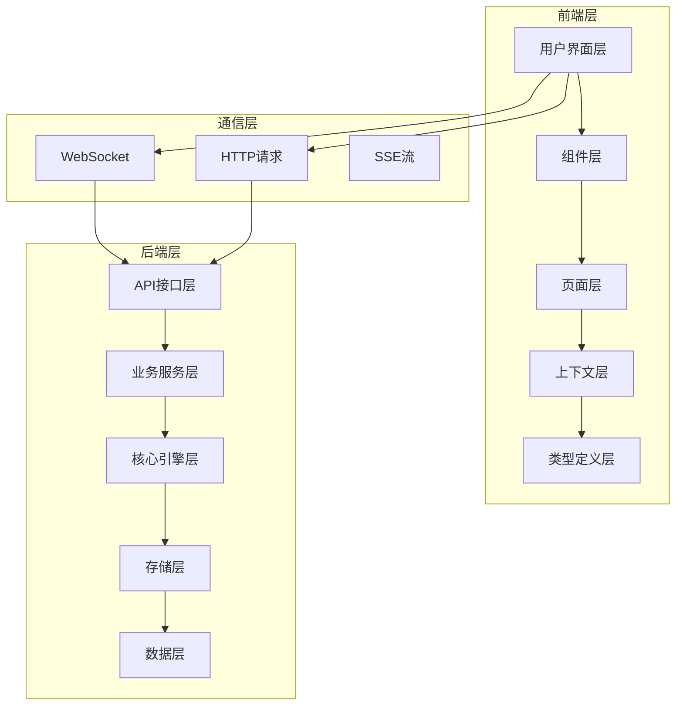
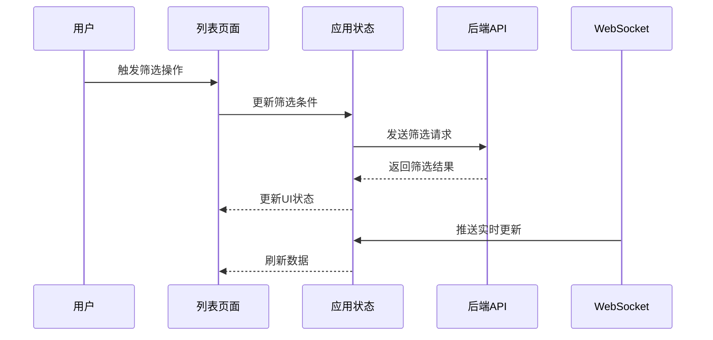
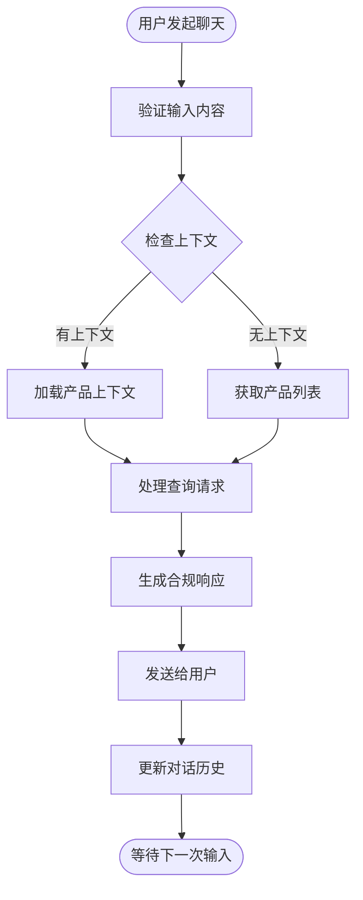
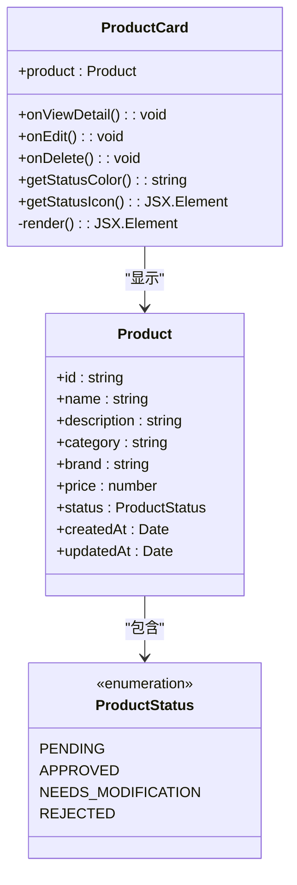
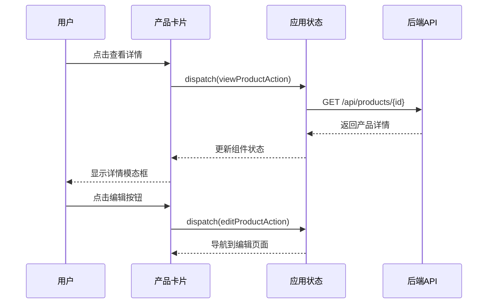
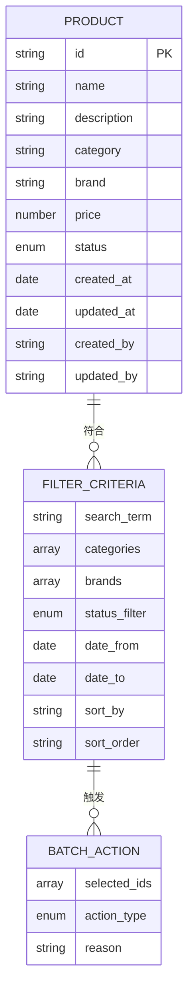
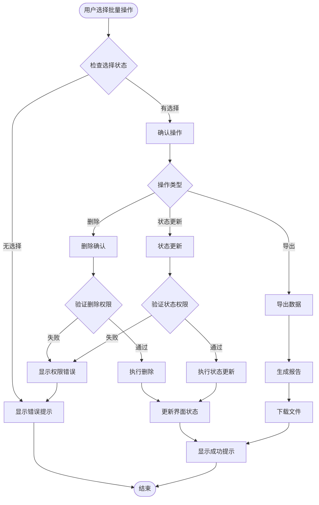
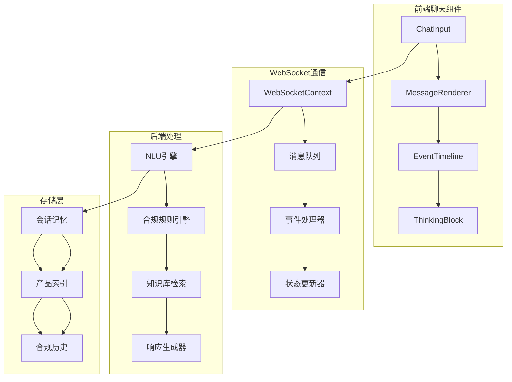
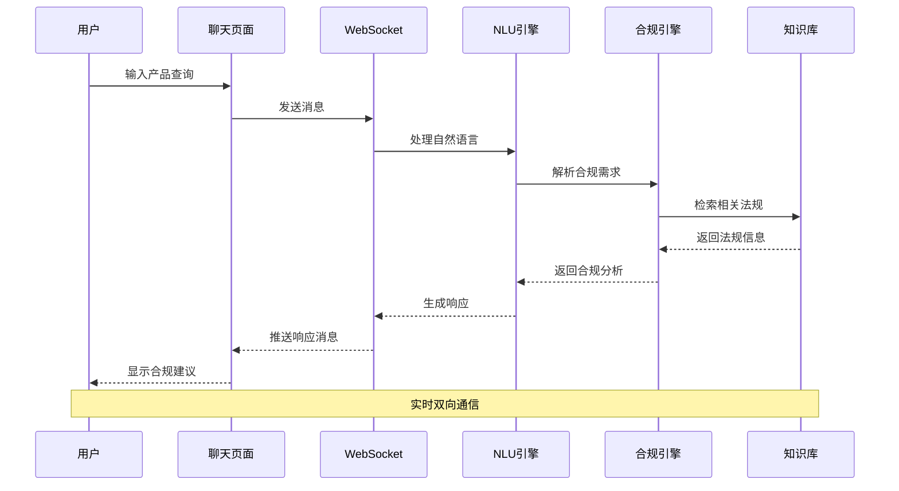
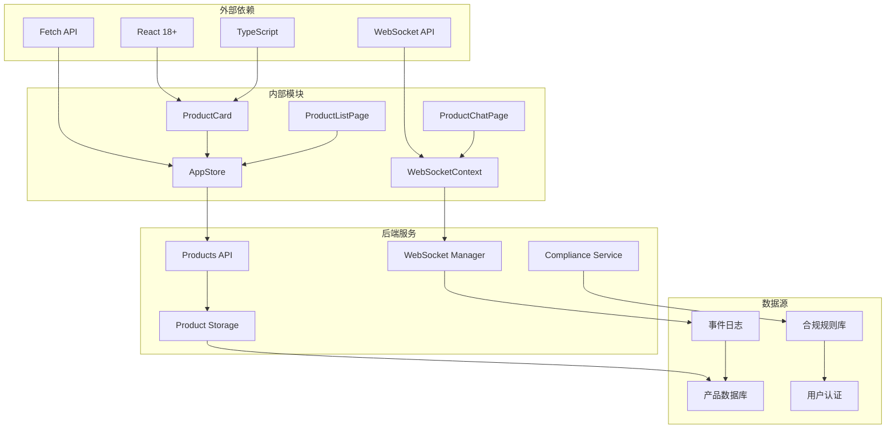

# 产品管理组件

<cite>
**本文档引用的文件**
- [ProductCard.tsx](file://frontend/src/components/ProductCard.tsx)
- [ProductListPage.tsx](file://frontend/src/pages/ProductListPage.tsx)
- [ProductChatPage.tsx](file://frontend/src/pages/ProductChatPage.tsx)
- [AppStore.tsx](file://frontend/src/context/AppStore.tsx)
- [WebSocketContext.tsx](file://frontend/src/context/WebSocketContext.tsx)
- [index.ts](file://frontend/src/types/index.ts)
- [products.py](file://backend/app/api/products.py)
- [product_storage.py](file://backend/app/core/product_storage.py)
- [compliance.py](file://backend/app/services/compliance.py)
- [ws_manager.py](file://backend/app/services/ws_manager.py)
- [products_index.json](file://backend/data/global/products_index.json)
- [products目录结构](file://backend/data/products/)
- [前后端api交互.md](file://前后端api交互.md)
- [前端api.md](file://前端api.md)
- [后端api.md](file://后端api.md)
</cite>

## 目录
1. [简介](#简介)
2. [项目结构](#项目结构)
3. [核心组件](#核心组件)
4. [架构概览](#架构概览)
5. [详细组件分析](#详细组件分析)
6. [依赖关系分析](#依赖关系分析)
7. [性能考虑](#性能考虑)
8. [故障排除指南](#故障排除指南)
9. [结论](#结论)

## 简介

避风港平台的产品管理组件是整个合规管理系统的核心部分，负责处理产品数据的展示、CRUD操作、合规状态管理和实时交互。该组件采用现代化的前端架构，结合后端的微服务设计，实现了高效的产品生命周期管理。

组件主要包含三个核心页面：产品卡片（ProductCard）用于单个产品的信息展示，产品列表页面（ProductListPage）提供批量管理和筛选功能，产品聊天页面（ProductChatPage）支持与合规AI助手的实时交互。整个系统通过WebSocket实现实时数据同步，确保用户能够获得最新的产品状态和合规信息。

## 项目结构

避风港平台的产品管理组件遵循清晰的分层架构设计：



**图表来源**
- [ProductCard.tsx:1-200](file://frontend/src/components/ProductCard.tsx#L1-L200)
- [ProductListPage.tsx:1-300](file://frontend/src/pages/ProductListPage.tsx#L1-L300)
- [ProductChatPage.tsx:1-250](file://frontend/src/pages/ProductChatPage.tsx#L1-L250)

**章节来源**
- [ProductCard.tsx:1-200](file://frontend/src/components/ProductCard.tsx#L1-L200)
- [ProductListPage.tsx:1-300](file://frontend/src/pages/ProductListPage.tsx#L1-L300)
- [ProductChatPage.tsx:1-250](file://frontend/src/pages/ProductChatPage.tsx#L1-L250)

## 核心组件

### 产品卡片组件（ProductCard）

产品卡片组件是产品管理的基础展示单元，采用响应式设计原则，支持多种产品状态的可视化展示。

**组件特性：**
- **状态可视化**：通过颜色编码和图标展示产品合规状态
- **交互设计**：支持查看详情、编辑、删除等操作
- **性能优化**：使用React.memo避免不必要的重渲染
- **可访问性**：完整的ARIA标签和键盘导航支持

**状态管理：**
组件内部维护以下状态：
- 产品基本信息（名称、描述、图片）
- 合规状态（待审核、已通过、需修改、已拒绝）
- 用户权限状态
- 加载状态和错误状态

**章节来源**
- [ProductCard.tsx:1-200](file://frontend/src/components/ProductCard.tsx#L1-L200)

### 产品列表页面（ProductListPage）

产品列表页面提供全面的产品管理功能，支持批量操作和高级筛选。

**核心功能：**
- **批量操作**：全选、批量删除、批量状态更新
- **高级筛选**：按类别、品牌、合规状态、时间范围筛选
- **排序功能**：支持多字段排序（创建时间、更新时间、合规状态）
- **搜索功能**：全文搜索和精确匹配
- **分页加载**：支持大数据量的虚拟滚动

**数据流设计：**


**图表来源**
- [ProductListPage.tsx:1-300](file://frontend/src/pages/ProductListPage.tsx#L1-L300)
- [AppStore.tsx:1-200](file://frontend/src/context/AppStore.tsx#L1-L200)

**章节来源**
- [ProductListPage.tsx:1-300](file://frontend/src/pages/ProductListPage.tsx#L1-L300)

### 产品聊天页面（ProductChatPage）

产品聊天页面集成了智能合规助手，提供自然语言的产品查询和合规咨询功能。

**功能特性：**
- **自然语言处理**：支持中文产品查询和合规问题解答
- **实时对话**：基于WebSocket的双向通信
- **上下文保持**：维护多轮对话的历史记录
- **智能建议**：根据产品特征提供合规建议

**交互流程：**


**图表来源**
- [ProductChatPage.tsx:1-250](file://frontend/src/pages/ProductChatPage.tsx#L1-L250)
- [WebSocketContext.tsx:1-150](file://frontend/src/context/WebSocketContext.tsx#L1-L150)

**章节来源**
- [ProductChatPage.tsx:1-250](file://frontend/src/pages/ProductChatPage.tsx#L1-L250)

## 架构概览

避风港平台采用微服务架构，产品管理组件通过清晰的边界划分实现高内聚低耦合的设计。

```mermaid
graph LR
subgraph "前端架构"
A[React应用] --> B[组件库]
B --> C[页面组件]
C --> D[上下文管理]
D --> E[类型系统]
end
subgraph "后端架构"
F[FastAPI服务] --> G[API路由]
G --> H[业务服务]
H --> I[核心引擎]
I --> J[数据存储]
end
subgraph "通信架构"
K[RESTful API] --> L[WebSocket]
L --> M[SSE流]
M --> N[事件总线]
end
A < --> F
B < --> G
C < --> H
D < --> I
E < --> J
F --> K
F --> L
F --> M
F --> N
```

**图表来源**
- [ProductCard.tsx:1-200](file://frontend/src/components/ProductCard.tsx#L1-L200)
- [products.py:1-200](file://backend/app/api/products.py#L1-L200)
- [ws_manager.py:1-150](file://backend/app/services/ws_manager.py#L1-L150)

**章节来源**
- [products.py:1-200](file://backend/app/api/products.py#L1-L200)
- [product_storage.py:1-200](file://backend/app/core/product_storage.py#L1-L200)
- [compliance.py:1-200](file://backend/app/services/compliance.py#L1-L200)

## 详细组件分析

### 产品卡片组件深度分析

产品卡片组件采用函数式组件设计，结合React Hooks实现状态管理。

**类图设计：**


**图表来源**
- [ProductCard.tsx:1-200](file://frontend/src/components/ProductCard.tsx#L1-L200)
- [index.ts:1-100](file://frontend/src/types/index.ts#L1-L100)

**组件交互序列：**


**图表来源**
- [ProductCard.tsx:1-200](file://frontend/src/components/ProductCard.tsx#L1-L200)
- [AppStore.tsx:1-200](file://frontend/src/context/AppStore.tsx#L1-L200)

**章节来源**
- [ProductCard.tsx:1-200](file://frontend/src/components/ProductCard.tsx#L1-L200)
- [index.ts:1-100](file://frontend/src/types/index.ts#L1-L100)

### 产品列表页面详细分析

产品列表页面实现了复杂的数据管理和用户交互功能。

**数据模型：**


**图表来源**
- [ProductListPage.tsx:1-300](file://frontend/src/pages/ProductListPage.tsx#L1-L300)
- [index.ts:1-100](file://frontend/src/types/index.ts#L1-L100)

**批量操作流程：**


**图表来源**
- [ProductListPage.tsx:1-300](file://frontend/src/pages/ProductListPage.tsx#L1-L300)
- [AppStore.tsx:1-200](file://frontend/src/context/AppStore.tsx#L1-L200)

**章节来源**
- [ProductListPage.tsx:1-300](file://frontend/src/pages/ProductListPage.tsx#L1-L300)
- [AppStore.tsx:1-200](file://frontend/src/context/AppStore.tsx#L1-L200)

### 产品聊天页面深入分析

产品聊天页面集成了先进的自然语言处理和实时通信技术。

**系统架构：**


**图表来源**
- [ProductChatPage.tsx:1-250](file://frontend/src/pages/ProductChatPage.tsx#L1-L250)
- [WebSocketContext.tsx:1-150](file://frontend/src/context/WebSocketContext.tsx#L1-L150)
- [compliance.py:1-200](file://backend/app/services/compliance.py#L1-L200)

**聊天交互流程：**


**图表来源**
- [ProductChatPage.tsx:1-250](file://frontend/src/pages/ProductChatPage.tsx#L1-L250)
- [compliance.py:1-200](file://backend/app/services/compliance.py#L1-L200)
- [products_index.json:1-100](file://backend/data/global/products_index.json#L1-L100)

**章节来源**
- [ProductChatPage.tsx:1-250](file://frontend/src/pages/ProductChatPage.tsx#L1-L250)
- [WebSocketContext.tsx:1-150](file://frontend/src/context/WebSocketContext.tsx#L1-L150)

## 依赖关系分析

产品管理组件的依赖关系体现了清晰的关注点分离和模块化设计。



**图表来源**
- [ProductCard.tsx:1-200](file://frontend/src/components/ProductCard.tsx#L1-L200)
- [ProductListPage.tsx:1-300](file://frontend/src/pages/ProductListPage.tsx#L1-L300)
- [ProductChatPage.tsx:1-250](file://frontend/src/pages/ProductChatPage.tsx#L1-L250)

**依赖管理策略：**
- **版本锁定**：使用package-lock.json确保依赖版本一致性
- **循环依赖检测**：定期检查模块间的循环依赖关系
- **懒加载优化**：对大型组件实现按需加载
- **类型安全**：通过TypeScript确保类型兼容性

**章节来源**
- [ProductCard.tsx:1-200](file://frontend/src/components/ProductCard.tsx#L1-L200)
- [ProductListPage.tsx:1-300](file://frontend/src/pages/ProductListPage.tsx#L1-L300)
- [ProductChatPage.tsx:1-250](file://frontend/src/pages/ProductChatPage.tsx#L1-L250)

## 性能考虑

### 大数据量渲染优化

避风港平台采用了多种技术来优化大数据量的产品列表渲染：

**虚拟滚动实现：**
- 使用react-window库实现高性能的虚拟滚动
- 仅渲染可见区域内的产品卡片，减少DOM节点数量
- 支持动态高度计算和预加载机制

**状态管理优化：**
- 使用React.memo和useMemo避免不必要的重渲染
- 实现局部状态提升，减少全局状态更新频率
- 采用分片加载策略，分批处理大量数据

**缓存策略：**
- 实现多级缓存（内存缓存、localStorage缓存）
- 基于URL参数的查询结果缓存
- 合规状态的智能缓存和失效机制

### 实时数据同步

系统通过WebSocket实现高效的数据同步：

**连接管理：**
- 自动重连机制，确保连接稳定性
- 心跳检测和断线恢复
- 连接池管理，避免过多并发连接

**消息处理：**
- 消息队列和去重机制
- 优先级处理和批量更新
- 错误处理和回滚机制

**章节来源**
- [ProductListPage.tsx:1-300](file://frontend/src/pages/ProductListPage.tsx#L1-L300)
- [WebSocketContext.tsx:1-150](file://frontend/src/context/WebSocketContext.tsx#L1-L150)
- [ws_manager.py:1-150](file://backend/app/services/ws_manager.py#L1-L150)

## 故障排除指南

### 常见问题诊断

**产品数据加载失败：**
1. 检查网络连接和API可达性
2. 验证用户权限和认证状态
3. 查看浏览器开发者工具中的网络请求
4. 确认后端服务运行状态

**实时更新不生效：**
1. 验证WebSocket连接状态
2. 检查浏览器是否阻止了WebSocket连接
3. 确认服务器端的事件推送配置
4. 查看客户端的重连机制是否正常工作

**性能问题排查：**
1. 使用浏览器性能分析工具识别瓶颈
2. 检查是否有过多的重渲染
3. 验证虚拟滚动是否正确配置
4. 分析内存使用情况和泄漏

### 调试技巧

**前端调试：**
- 使用React DevTools检查组件树和状态
- 利用Redux DevTools（如果适用）追踪状态变化
- 设置断点分析异步操作的执行流程

**后端调试：**
- 检查API响应时间和错误日志
- 验证数据库查询性能和索引使用
- 监控WebSocket连接数和消息处理延迟

**章节来源**
- [ProductListPage.tsx:1-300](file://frontend/src/pages/ProductListPage.tsx#L1-L300)
- [ProductChatPage.tsx:1-250](file://frontend/src/pages/ProductChatPage.tsx#L1-L250)
- [AppStore.tsx:1-200](file://frontend/src/context/AppStore.tsx#L1-L200)

## 结论

避风港平台的产品管理组件展现了现代Web应用的最佳实践，通过精心设计的架构和实现，提供了高效、可靠的产品管理解决方案。

**核心优势：**
- **模块化设计**：清晰的组件边界和职责分离
- **性能优化**：虚拟滚动、缓存策略和状态管理优化
- **实时性**：基于WebSocket的实时数据同步
- **可扩展性**：微服务架构支持未来的功能扩展
- **用户体验**：直观的界面设计和流畅的交互体验

**技术亮点：**
- React 18的新特性利用（Suspense、Concurrent Rendering）
- TypeScript提供的类型安全保障
- 微前端架构支持的组件复用
- 完善的错误处理和监控机制

该组件为避风港平台的合规管理提供了坚实的技术基础，能够有效支撑大规模产品数据的管理需求，并为未来的功能扩展预留了充足的空间。