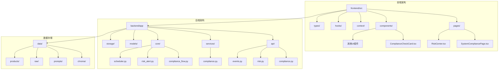
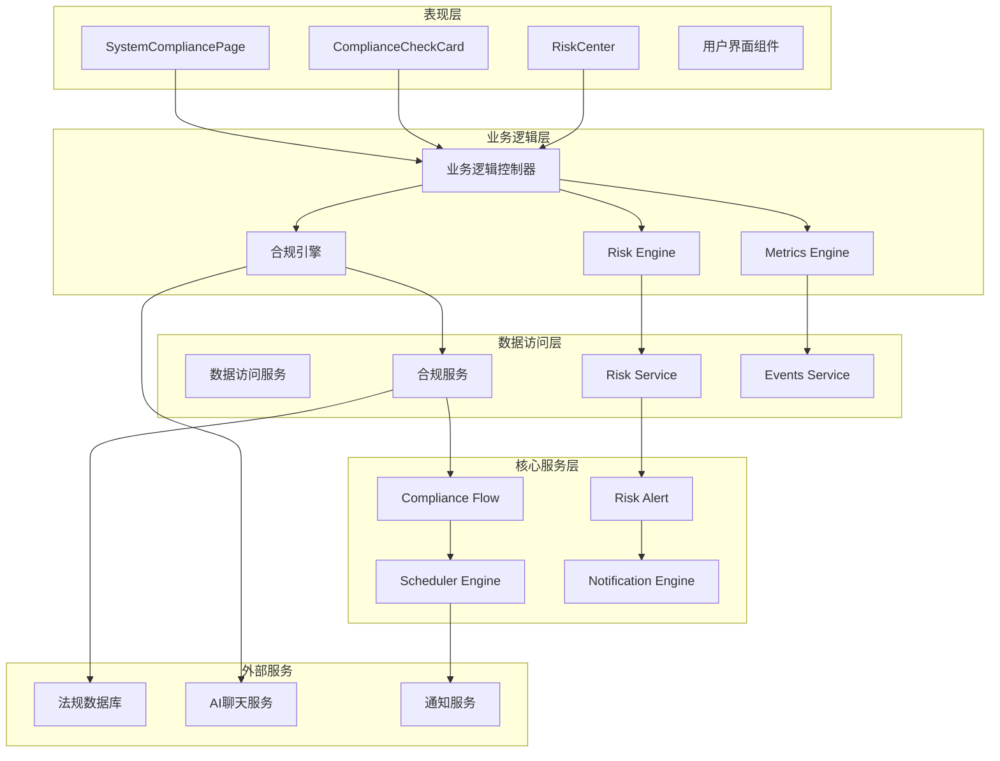
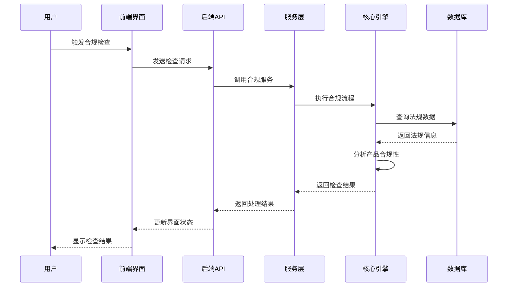
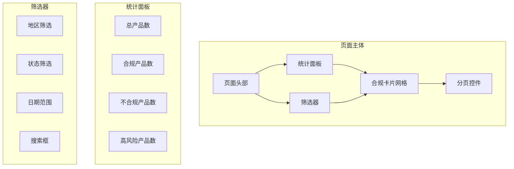
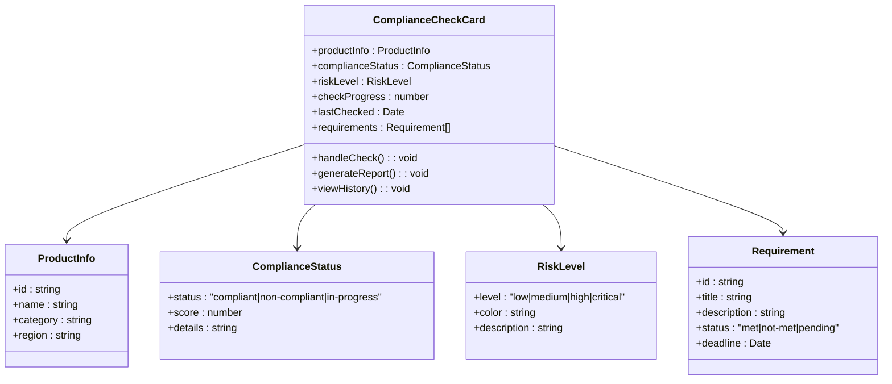
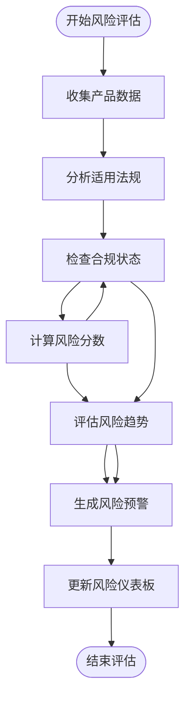
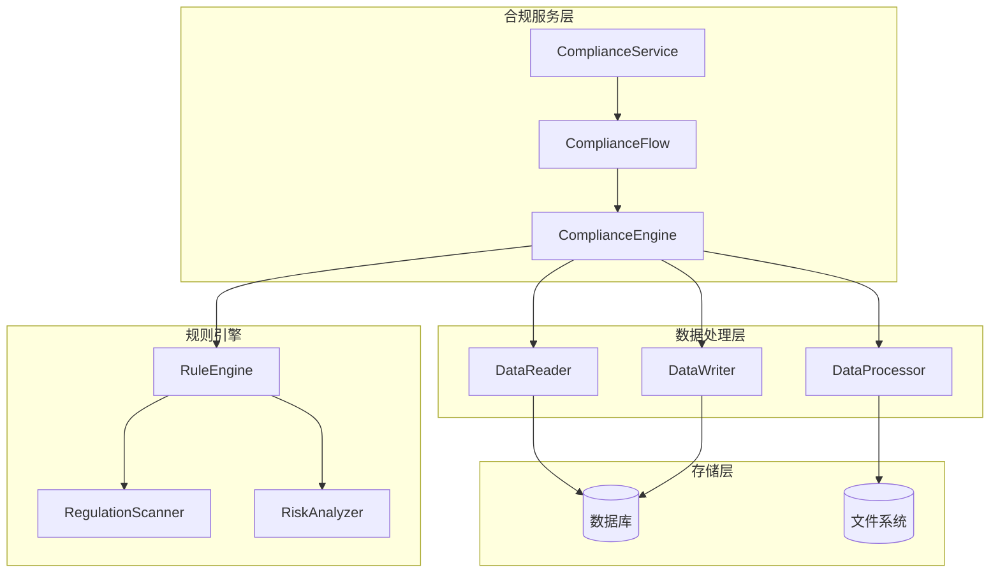
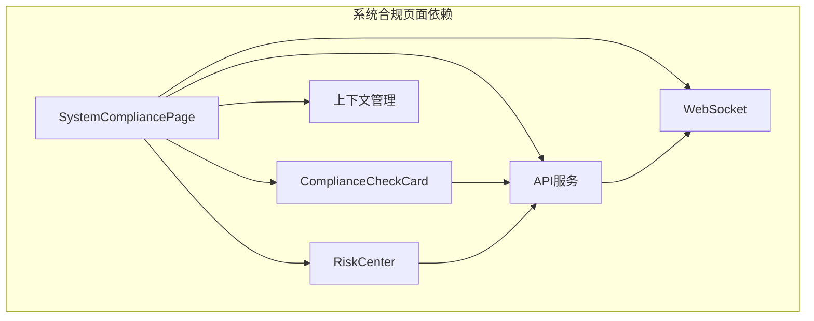
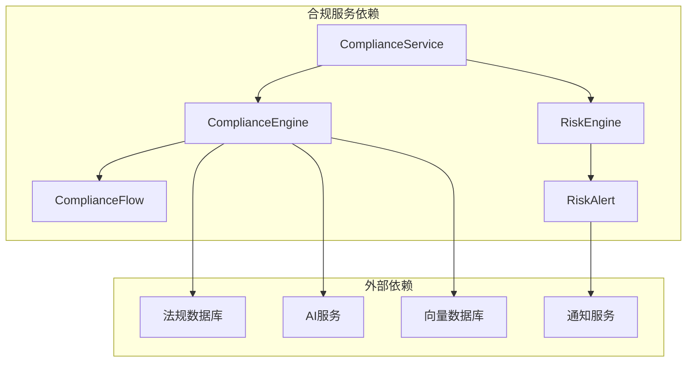
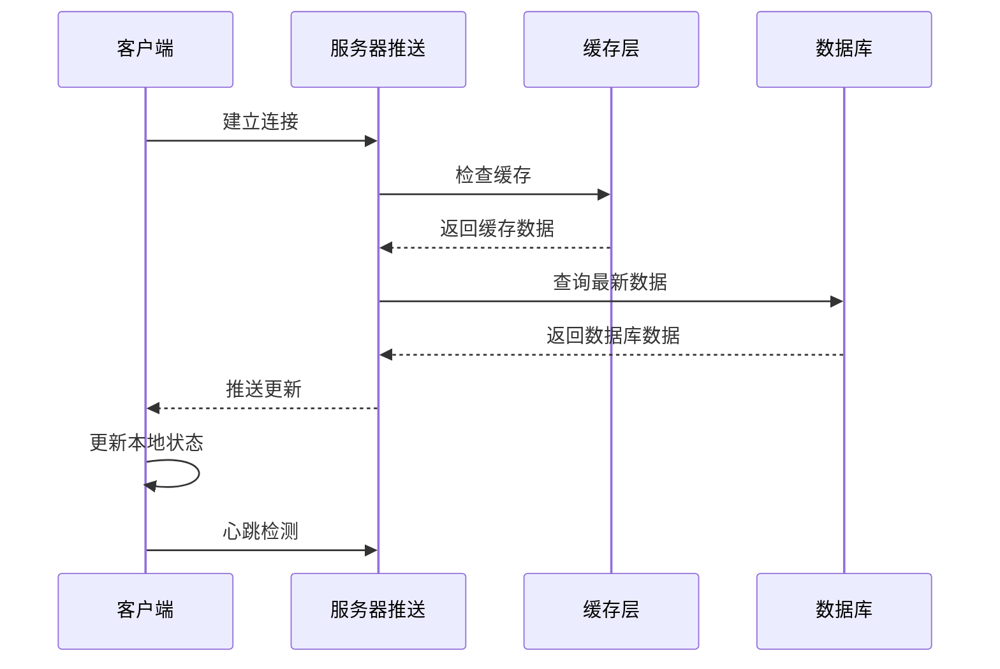

# 合规检查组件

<cite>
**本文档引用的文件**
- [SystemCompliancePage.tsx](file://frontend/src/pages/SystemCompliancePage.tsx)
- [ComplianceCheckCard.tsx](file://frontend/src/components/ComplianceCheckCard.tsx)
- [RiskCenter.tsx](file://frontend/src/pages/RiskCenter.tsx)
- [compliance.py](file://backend/app/services/compliance.py)
- [risk.py](file://backend/app/api/risk.py)
- [compliance_flow.py](file://backend/app/core/compliance_flow.py)
- [risk_alert.py](file://backend/app/core/risk_alert.py)
- [events.py](file://backend/app/api/events.py)
- [metrics.py](file://backend/app/core/metrics.py)
- [notification_engine.py](file://backend/app/core/notification_engine.py)
- [scheduler.py](file://backend/app/core/scheduler.py)
- [regulation_scan.yaml](file://backend/data/prompts/regulation_scan.yaml)
- [risk_summary.yaml](file://backend/data/prompts/risk_summary.yaml)
- [eu_regulations_2026.json](file://backend/data/chroma/eu_regulations_2026.json)
</cite>

## 目录
1. [简介](#简介)
2. [项目结构](#项目结构)
3. [核心组件](#核心组件)
4. [架构概览](#架构概览)
5. [详细组件分析](#详细组件分析)
6. [依赖关系分析](#依赖关系分析)
7. [性能考虑](#性能考虑)
8. [故障排除指南](#故障排除指南)
9. [结论](#结论)

## 简介

避风港平台的合规检查组件是一个综合性的合规管理解决方案，旨在帮助用户在复杂的国际贸易环境中确保产品符合目标市场的法规要求。该组件包括三个核心部分：合规检查卡片（ComplianceCheckCard）、系统合规页面（SystemCompliancePage）和风险中心（RiskCenter），它们协同工作以提供全面的合规状态可视化、风险等级展示、检查进度跟踪和结果分析界面。

该系统支持多地区法规检查、实时风险监控、合规报告生成、风险预警通知和历史记录查询等功能，为用户提供了一个完整的合规管理生态系统。

## 项目结构

避风港平台采用前后端分离的架构设计，前端使用React技术栈，后端基于Python构建RESTful API服务。

**图表来源**
- [SystemCompliancePage.tsx](file://frontend/src/pages/SystemCompliancePage.tsx)
- [ComplianceCheckCard.tsx](file://frontend/src/components/ComplianceCheckCard.tsx)
- [RiskCenter.tsx](file://frontend/src/pages/RiskCenter.tsx)
- [compliance.py](file://backend/app/services/compliance.py)
- [risk.py](file://backend/app/api/risk.py)
- [compliance_flow.py](file://backend/app/core/compliance_flow.py)

**章节来源**
- [SystemCompliancePage.tsx:1-200](file://frontend/src/pages/SystemCompliancePage.tsx#L1-L200)
- [ComplianceCheckCard.tsx:1-150](file://frontend/src/components/ComplianceCheckCard.tsx#L1-L150)
- [RiskCenter.tsx:1-250](file://frontend/src/pages/RiskCenter.tsx#L1-L250)

## 核心组件

### 系统合规页面（SystemCompliancePage）

系统合规页面是合规检查组件的核心界面，提供全局合规状态概览和管理功能。该页面集成了多个合规检查卡片，支持批量操作和统一的状态监控。

主要功能特性：
- 全局合规状态仪表板
- 多产品合规状态跟踪
- 合规检查进度可视化
- 风险等级汇总展示
- 合规报告生成入口
- 历史记录查询界面

### 合规检查卡片（ComplianceCheckCard）

合规检查卡片是单个产品的合规检查界面，提供详细的合规状态信息和检查进度跟踪。每个卡片代表一个特定产品在目标市场的合规状况。

关键功能：
- 实时合规状态显示
- 检查进度条展示
- 风险等级标识
- 合规要求对比
- 检查历史记录
- 手动触发检查功能

### 风险中心（RiskCenter）

风险中心专门负责风险监控和预警功能，提供实时的风险评估和通知机制。该模块集成了多种风险检测算法和预警策略。

核心能力：
- 多维度风险评估
- 实时风险监控
- 自动风险预警
- 风险趋势分析
- 历史风险记录
- 风险缓解建议

**章节来源**
- [SystemCompliancePage.tsx:1-200](file://frontend/src/pages/SystemCompliancePage.tsx#L1-L200)
- [ComplianceCheckCard.tsx:1-150](file://frontend/src/components/ComplianceCheckCard.tsx#L1-L150)
- [RiskCenter.tsx:1-250](file://frontend/src/pages/RiskCenter.tsx#L1-L250)

## 架构概览

避风港平台采用分层架构设计，确保系统的可扩展性和维护性。

**图表来源**
- [SystemCompliancePage.tsx:1-200](file://frontend/src/pages/SystemCompliancePage.tsx#L1-L200)
- [ComplianceCheckCard.tsx:1-150](file://frontend/src/components/ComplianceCheckCard.tsx#L1-L150)
- [RiskCenter.tsx:1-250](file://frontend/src/pages/RiskCenter.tsx#L1-L250)
- [compliance.py:1-300](file://backend/app/services/compliance.py#L1-L300)
- [risk.py:1-200](file://backend/app/api/risk.py#L1-L200)

### 数据流架构

**图表来源**
- [compliance.py:1-300](file://backend/app/services/compliance.py#L1-L300)
- [compliance_flow.py:1-200](file://backend/app/core/compliance_flow.py#L1-L200)
- [events.py:1-150](file://backend/app/api/events.py#L1-L150)

## 详细组件分析

### 系统合规页面（SystemCompliancePage）

系统合规页面作为整个合规检查系统的主要入口，提供了全面的合规状态管理和操作界面。

#### 页面布局设计

**图表来源**
- [SystemCompliancePage.tsx:1-200](file://frontend/src/pages/SystemCompliancePage.tsx#L1-L200)

#### 核心功能实现

系统合规页面的核心功能包括：

1. **全局状态概览**：通过统计面板展示整体合规状况
2. **批量操作支持**：支持对多个产品进行批量合规检查
3. **实时状态更新**：通过WebSocket实现实时状态同步
4. **高级筛选功能**：支持按地区、状态、时间等条件筛选
5. **响应式布局**：适配不同屏幕尺寸的设备

**章节来源**
- [SystemCompliancePage.tsx:1-200](file://frontend/src/pages/SystemCompliancePage.tsx#L1-L200)

### 合规检查卡片（ComplianceCheckCard）

合规检查卡片是单个产品合规状态的具体展示单元，提供了详细的产品合规信息和操作入口。

#### 卡片组件结构

**图表来源**
- [ComplianceCheckCard.tsx:1-150](file://frontend/src/components/ComplianceCheckCard.tsx#L1-L150)

#### 状态可视化设计

合规检查卡片采用了多层次的状态可视化设计：

1. **颜色编码系统**：使用绿色表示合规，黄色表示警告，红色表示不合规
2. **进度指示器**：圆形进度条显示检查完成度
3. **图标标识**：使用不同的图标表示不同类型的要求
4. **动态更新**：支持实时状态更新和动画效果

**章节来源**
- [ComplianceCheckCard.tsx:1-150](file://frontend/src/components/ComplianceCheckCard.tsx#L1-L150)

### 风险中心（RiskCenter）

风险中心是合规检查系统中的风险管理模块，专注于识别、评估和监控潜在的合规风险。

#### 风险评估模型

**图表来源**
- [RiskCenter.tsx:1-250](file://frontend/src/pages/RiskCenter.tsx#L1-L250)
- [risk_alert.py:1-200](file://backend/app/core/risk_alert.py#L1-L200)

#### 风险等级分类

风险中心采用四等级风险评估体系：

| 风险等级 | 分数值范围 | 颜色标识 | 描述 |
|---------|-----------|---------|------|
| 低风险 | 0-25 | 绿色 | 产品基本合规，风险较低 |
| 中等风险 | 26-50 | 黄色 | 存在轻微合规问题，需关注 |
| 高风险 | 51-75 | 橙色 | 有明显合规风险，需立即处理 |
| 极高风险 | 76-100 | 红色 | 严重违规风险，必须立即整改 |

**章节来源**
- [RiskCenter.tsx:1-250](file://frontend/src/pages/RiskCenter.tsx#L1-L250)
- [risk_alert.py:1-200](file://backend/app/core/risk_alert.py#L1-L200)

### 后端服务架构

#### 合规服务层

后端合规服务层提供了完整的合规检查和管理功能：

**图表来源**
- [compliance.py:1-300](file://backend/app/services/compliance.py#L1-L300)
- [compliance_flow.py:1-200](file://backend/app/core/compliance_flow.py#L1-L200)
- [regulation_scan.yaml:1-100](file://backend/data/prompts/regulation_scan.yaml#L1-L100)

#### API接口设计

系统提供了RESTful API接口供前端调用：

| 接口 | 方法 | 功能描述 | 请求参数 | 响应数据 |
|------|------|----------|----------|----------|
| /api/compliance/check | POST | 触发合规检查 | product_id, region | 检查结果 |
| /api/compliance/status | GET | 获取合规状态 | product_id | 状态信息 |
| /api/compliance/report | POST | 生成合规报告 | product_id, format | 报告文件 |
| /api/risk/alerts | GET | 获取风险预警 | region, level | 预警列表 |
| /api/risk/history | GET | 获取风险历史 | product_id, date_range | 历史记录 |

**章节来源**
- [compliance.py:1-300](file://backend/app/services/compliance.py#L1-L300)
- [risk.py:1-200](file://backend/app/api/risk.py#L1-L200)

## 依赖关系分析

### 前端组件依赖

**图表来源**
- [SystemCompliancePage.tsx:1-200](file://frontend/src/pages/SystemCompliancePage.tsx#L1-L200)
- [ComplianceCheckCard.tsx:1-150](file://frontend/src/components/ComplianceCheckCard.tsx#L1-L150)
- [RiskCenter.tsx:1-250](file://frontend/src/pages/RiskCenter.tsx#L1-L250)

### 后端服务依赖

**图表来源**
- [compliance.py:1-300](file://backend/app/services/compliance.py#L1-L300)
- [risk.py:1-200](file://backend/app/api/risk.py#L1-L200)
- [compliance_flow.py:1-200](file://backend/app/core/compliance_flow.py#L1-L200)

**章节来源**
- [SystemCompliancePage.tsx:1-200](file://frontend/src/pages/SystemCompliancePage.tsx#L1-L200)
- [compliance.py:1-300](file://backend/app/services/compliance.py#L1-L300)

## 性能考虑

### 前端性能优化

为了确保用户体验，系统采用了多项前端性能优化策略：

1. **虚拟滚动**：对于大量合规卡片的场景，使用虚拟滚动技术只渲染可见区域
2. **懒加载**：图片和大数据的异步加载，减少初始渲染时间
3. **缓存策略**：合理使用浏览器缓存和内存缓存，避免重复请求
4. **状态管理**：使用高效的React状态管理，减少不必要的重渲染
5. **代码分割**：按需加载组件，减小首屏包体积

### 后端性能优化

后端服务通过以下方式保证高性能：

1. **并发处理**：使用异步任务处理大量合规检查请求
2. **数据库优化**：合理的索引设计和查询优化
3. **缓存机制**：Redis缓存常用数据和计算结果
4. **负载均衡**：支持水平扩展，处理高并发请求
5. **资源池管理**：数据库连接池和线程池的合理配置

### 实时更新机制

系统实现了高效的实时状态更新机制：

**图表来源**
- [SystemCompliancePage.tsx:1-200](file://frontend/src/pages/SystemCompliancePage.tsx#L1-L200)
- [notification_engine.py:1-150](file://backend/app/core/notification_engine.py#L1-L150)

## 故障排除指南

### 常见问题及解决方案

#### 合规检查失败

**问题症状**：合规检查长时间无响应或返回错误

**可能原因**：
1. 法规数据库连接异常
2. AI服务调用超时
3. 网络连接不稳定
4. 产品数据格式错误

**解决方案**：
1. 检查数据库连接状态
2. 验证AI服务可用性
3. 确认网络连接稳定
4. 格式化产品数据

#### 风险预警延迟

**问题症状**：风险预警通知延迟或丢失

**可能原因**：
1. WebSocket连接断开
2. 通知服务故障
3. 风险阈值设置不当
4. 系统负载过高

**解决方案**：
1. 重新建立WebSocket连接
2. 检查通知服务状态
3. 调整风险阈值配置
4. 优化系统性能

#### 界面显示异常

**问题症状**：合规卡片显示不正确或状态更新失败

**可能原因**：
1. React状态管理错误
2. API响应格式变化
3. 浏览器兼容性问题
4. 缓存数据过期

**解决方案**：
1. 检查状态更新逻辑
2. 验证API响应格式
3. 测试浏览器兼容性
4. 清除并重建缓存

**章节来源**
- [SystemCompliancePage.tsx:1-200](file://frontend/src/pages/SystemCompliancePage.tsx#L1-L200)
- [ComplianceCheckCard.tsx:1-150](file://frontend/src/components/ComplianceCheckCard.tsx#L1-L150)
- [RiskCenter.tsx:1-250](file://frontend/src/pages/RiskCenter.tsx#L1-L250)

## 结论

避风港平台的合规检查组件通过精心设计的架构和丰富的功能特性，为用户提供了全面的合规管理解决方案。系统不仅能够有效处理复杂的合规检查需求，还提供了强大的风险监控和预警能力。

### 主要优势

1. **全面的合规覆盖**：支持多地区、多法规的合规检查
2. **实时状态监控**：提供实时的合规状态更新和风险预警
3. **友好的用户界面**：直观的可视化设计和交互体验
4. **高性能架构**：优化的前后端架构确保系统稳定性
5. **可扩展性设计**：模块化的架构便于功能扩展和维护

### 未来发展方向

1. **AI智能合规**：集成更先进的AI技术提升合规检查准确性
2. **自动化流程**：进一步减少人工干预，实现完全自动化的合规管理
3. **多语言支持**：扩展国际化支持，服务更多地区用户
4. **移动端适配**：开发移动应用，提供随时随地的合规管理能力
5. **深度分析功能**：增强数据分析和趋势预测能力

通过持续的技术创新和功能完善，避风港平台的合规检查组件将继续为用户提供卓越的合规管理体验。