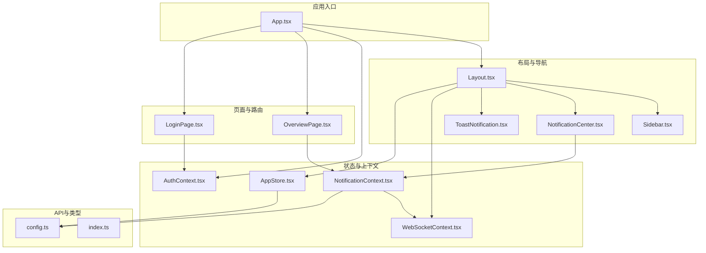
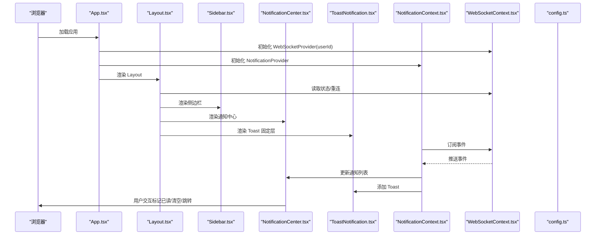
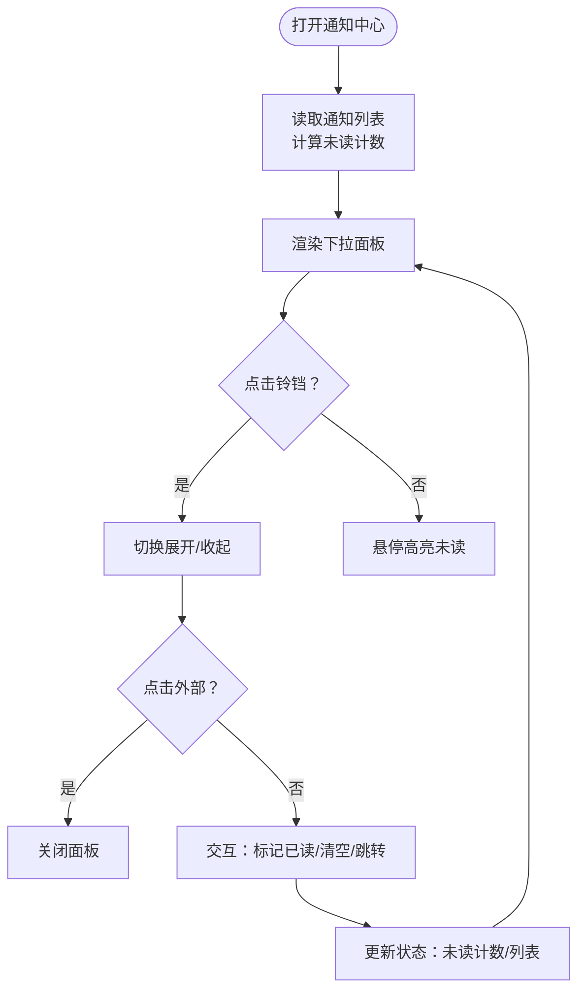
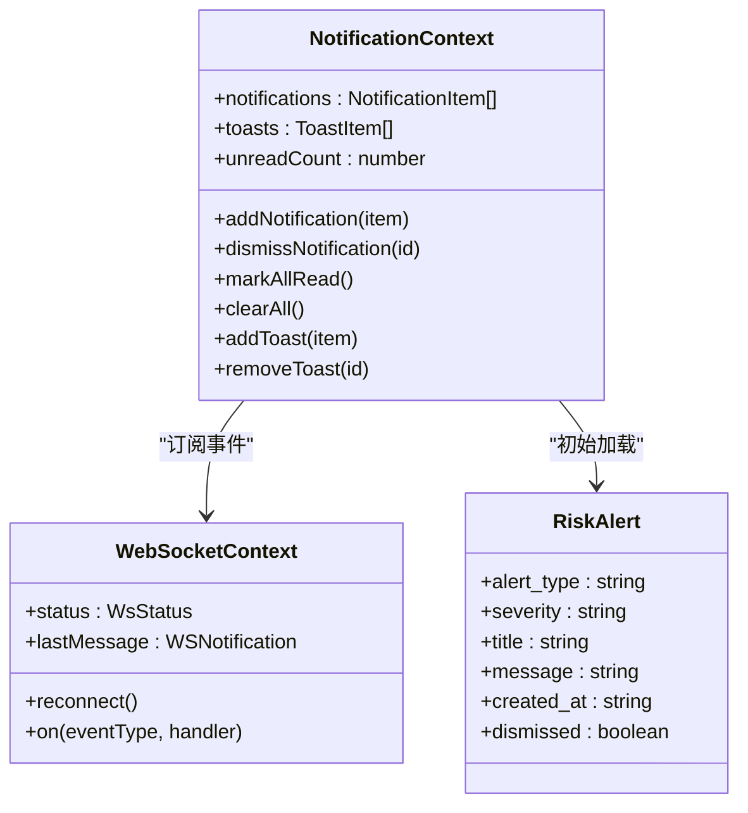
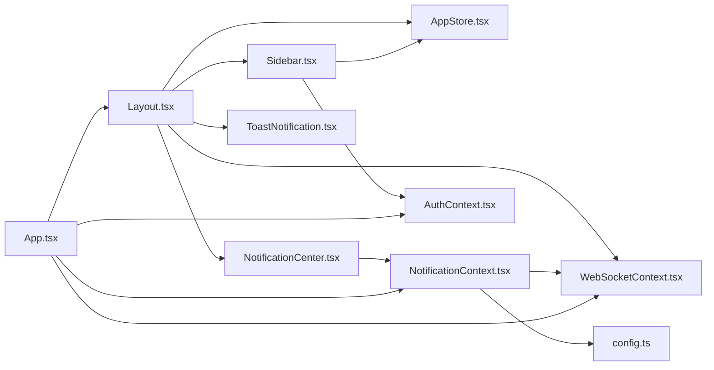

# 布局组件

<cite>
**本文引用的文件**
- [Layout.tsx](file://frontend/src/components/Layout.tsx)
- [Sidebar.tsx](file://frontend/src/components/Sidebar.tsx)
- [NotificationCenter.tsx](file://frontend/src/components/NotificationCenter.tsx)
- [ToastNotification.tsx](file://frontend/src/components/ToastNotification.tsx)
- [App.tsx](file://frontend/src/App.tsx)
- [WebSocketContext.tsx](file://frontend/src/context/WebSocketContext.tsx)
- [NotificationContext.tsx](file://frontend/src/context/NotificationContext.tsx)
- [AppStore.tsx](file://frontend/src/context/AppStore.tsx)
- [AuthContext.tsx](file://frontend/src/context/AuthContext.tsx)
- [OverviewPage.tsx](file://frontend/src/pages/OverviewPage.tsx)
- [LoginPage.tsx](file://frontend/src/pages/LoginPage.tsx)
- [config.ts](file://frontend/src/api/config.ts)
- [index.ts](file://frontend/src/types/index.ts)
</cite>

## 目录
1. [简介](#简介)
2. [项目结构](#项目结构)
3. [核心组件](#核心组件)
4. [架构总览](#架构总览)
5. [详细组件分析](#详细组件分析)
6. [依赖关系分析](#依赖关系分析)
7. [性能考量](#性能考量)
8. [故障排查指南](#故障排查指南)
9. [结论](#结论)
10. [附录](#附录)

## 简介
本文件面向避风港平台的布局组件，聚焦于主布局组件 Layout.tsx、侧边栏导航 Sidebar.tsx 与通知中心 NotificationCenter.tsx 的结构设计、状态管理、路由集成与交互机制。文档涵盖：
- 组件职责与接口定义
- 状态管理与上下文联动（Zustand、React Context）
- WebSocket 实时通知与 Toast 通知体系
- 响应式布局与移动端适配
- 主题切换与用户偏好设置
- 组件组合模式与布局定制选项
- 错误处理与状态同步策略

## 项目结构
避风港前端采用 React + Vite 架构，布局组件位于 frontend/src/components，状态与上下文位于 frontend/src/context，路由与页面位于 frontend/src/pages，API 客户端封装在 frontend/src/api，类型定义在 frontend/src/types。

图表来源
- [App.tsx:1-93](file://frontend/src/App.tsx#L1-L93)
- [Layout.tsx:1-60](file://frontend/src/components/Layout.tsx#L1-L60)
- [Sidebar.tsx:1-163](file://frontend/src/components/Sidebar.tsx#L1-L163)
- [NotificationCenter.tsx:1-119](file://frontend/src/components/NotificationCenter.tsx#L1-L119)
- [ToastNotification.tsx:1-53](file://frontend/src/components/ToastNotification.tsx#L1-L53)
- [WebSocketContext.tsx:1-132](file://frontend/src/context/WebSocketContext.tsx#L1-L132)
- [NotificationContext.tsx:1-187](file://frontend/src/context/NotificationContext.tsx#L1-L187)
- [AuthContext.tsx:1-106](file://frontend/src/context/AuthContext.tsx#L1-L106)
- [AppStore.tsx:1-107](file://frontend/src/context/AppStore.tsx#L1-L107)
- [OverviewPage.tsx:1-316](file://frontend/src/pages/OverviewPage.tsx#L1-L316)
- [LoginPage.tsx:1-90](file://frontend/src/pages/LoginPage.tsx#L1-L90)
- [config.ts:1-635](file://frontend/src/api/config.ts#L1-L635)
- [index.ts:1-477](file://frontend/src/types/index.ts#L1-L477)

章节来源
- [App.tsx:1-93](file://frontend/src/App.tsx#L1-L93)
- [Layout.tsx:1-60](file://frontend/src/components/Layout.tsx#L1-L60)

## 核心组件
- Layout.tsx：主布局容器，负责顶部状态栏、侧边栏、内容区域与 Toast 固定层的组织；集成 WebSocket 状态与侧边栏折叠状态。
- Sidebar.tsx：侧边栏导航，根据用户角色渲染不同菜单项，支持折叠/展开与登出。
- NotificationCenter.tsx：通知中心下拉面板，展示通知列表、未读计数、标记已读与清空；支持点击跳转。
- ToastNotification.tsx：全局固定层的 Toast 通知，基于通知上下文状态渲染，支持手动关闭与自动过期。
- NotificationContext.tsx：通知与 Toast 的集中状态管理，负责 WebSocket 事件分发、通知持久化与 Toast 生命周期。
- WebSocketContext.tsx：WebSocket 连接与事件分发，提供重连、心跳与事件订阅能力。
- AppStore.tsx：Zustand 状态，包含侧边栏折叠状态与 Agent 配置等。
- AuthContext.tsx：认证上下文，提供登录、登出与带 Token 的请求封装。
- OverviewPage.tsx：首页示例页面，演示通知与自动刷新逻辑。
- LoginPage.tsx：登录页面，使用 AuthContext 完成认证。

章节来源
- [Layout.tsx:15-60](file://frontend/src/components/Layout.tsx#L15-L60)
- [Sidebar.tsx:27-129](file://frontend/src/components/Sidebar.tsx#L27-L129)
- [NotificationCenter.tsx:30-119](file://frontend/src/components/NotificationCenter.tsx#L30-L119)
- [ToastNotification.tsx:10-53](file://frontend/src/components/ToastNotification.tsx#L10-L53)
- [NotificationContext.tsx:59-187](file://frontend/src/context/NotificationContext.tsx#L59-L187)
- [WebSocketContext.tsx:31-132](file://frontend/src/context/WebSocketContext.tsx#L31-L132)
- [AppStore.tsx:102-107](file://frontend/src/context/AppStore.tsx#L102-L107)
- [AuthContext.tsx:23-106](file://frontend/src/context/AuthContext.tsx#L23-L106)
- [OverviewPage.tsx:41-316](file://frontend/src/pages/OverviewPage.tsx#L41-L316)
- [LoginPage.tsx:4-90](file://frontend/src/pages/LoginPage.tsx#L4-L90)

## 架构总览
布局组件围绕“布局容器 + 侧边导航 + 通知中心 + 通知上下文 + WebSocket + 认证上下文”的架构组织，形成统一的状态与事件分发通道。

图表来源
- [App.tsx:35-82](file://frontend/src/App.tsx#L35-L82)
- [Layout.tsx:15-60](file://frontend/src/components/Layout.tsx#L15-L60)
- [Sidebar.tsx:27-129](file://frontend/src/components/Sidebar.tsx#L27-L129)
- [NotificationCenter.tsx:30-119](file://frontend/src/components/NotificationCenter.tsx#L30-L119)
- [ToastNotification.tsx:10-53](file://frontend/src/components/ToastNotification.tsx#L10-L53)
- [NotificationContext.tsx:59-187](file://frontend/src/context/NotificationContext.tsx#L59-L187)
- [WebSocketContext.tsx:31-132](file://frontend/src/context/WebSocketContext.tsx#L31-L132)
- [config.ts:1-635](file://frontend/src/api/config.ts#L1-L635)

## 详细组件分析

### Layout.tsx 主布局组件
- 结构设计
  - 外层容器采用 Flex 布局，左侧为 Sidebar，右侧为主内容区，底部固定 Toast 层。
  - 顶部状态栏包含侧边栏折叠按钮与通知中心入口，以及 WebSocket 连接状态指示与重连按钮。
- 状态与集成
  - 使用 WebSocket 上下文读取连接状态并映射为标签与颜色。
  - 使用 AppStore 中的侧边栏状态控制折叠按钮标题与图标。
  - 通过 react-router 的 Outlet 渲染当前路由页面。
- 响应式与主题
  - 通过 Tailwind 类控制宽度与间距，支持在折叠状态下仅显示图标。
  - 顶部状态栏与主容器背景色采用浅灰系，便于区分层级。
- 交互机制
  - 折叠按钮直接调用 AppStore 的 getState().toggle() 触发状态切换。
  - 通知中心按钮与 WebSocket 重连按钮分别触发通知中心弹层与重连逻辑。

章节来源
- [Layout.tsx:15-60](file://frontend/src/components/Layout.tsx#L15-L60)

### Sidebar.tsx 侧边栏导航
- 导航项
  - 主要导航项与管理员导航项按角色动态渲染。
  - 使用 NavLink 实现激活态样式与路由跳转。
- 用户信息
  - 显示当前用户头像与角色徽标，非折叠状态下展示用户名与角色标签。
- 折叠与登出
  - 折叠按钮调用 AppStore.toggle() 控制侧边栏宽度。
  - 登出按钮调用 AuthContext.logout() 并跳转至登录页。
- 响应式
  - 折叠时仅显示图标与箭头，非折叠时显示完整文本与版本号。

章节来源
- [Sidebar.tsx:27-129](file://frontend/src/components/Sidebar.tsx#L27-L129)
- [AuthContext.tsx:67-72](file://frontend/src/context/AuthContext.tsx#L67-L72)
- [AppStore.tsx:102-107](file://frontend/src/context/AppStore.tsx#L102-L107)

### NotificationCenter.tsx 通知中心
- 数据来源
  - 从 NotificationContext 获取通知列表、未读计数与操作方法。
  - 通过 WebSocketContext 接收实时事件并转换为通知与 Toast。
- UI 与交互
  - 下拉面板支持“全部已读”、“清空”、“点击跳转”。
  - 通知按时间倒序排列，未读项高亮。
  - 支持点击外部区域关闭面板。
- 通知类型与严重级别
  - 通过类型映射图标，严重级别映射点颜色。
  - 时间格式化为“刚刚/分钟前/小时前/天前”。

图表来源
- [NotificationCenter.tsx:30-119](file://frontend/src/components/NotificationCenter.tsx#L30-L119)
- [NotificationContext.tsx:59-187](file://frontend/src/context/NotificationContext.tsx#L59-L187)

章节来源
- [NotificationCenter.tsx:30-119](file://frontend/src/components/NotificationCenter.tsx#L30-L119)

### ToastNotification.tsx 全局 Toast
- 渲染策略
  - 固定在右上角，按严重级别应用不同的背景、边框与点色。
  - 支持手动关闭与自动过期（严重级别影响时长）。
- 与通知上下文联动
  - 从 NotificationContext 读取 toasts 列表并管理生命周期。

章节来源
- [ToastNotification.tsx:10-53](file://frontend/src/components/ToastNotification.tsx#L10-L53)
- [NotificationContext.tsx:141-161](file://frontend/src/context/NotificationContext.tsx#L141-L161)

### NotificationContext.tsx 通知与 Toast 状态管理
- 数据模型
  - 通知项包含类型、严重级别、标题、消息、时间戳、是否已读、分类、动作链接等。
  - Toast 项包含标题、消息、持续时间与可选动作。
- 事件处理
  - 通过 WebSocketContext.on('*') 订阅事件，解析 payload 并生成通知与 Toast。
  - 严重级别推断规则：包含特定关键词的类型映射到不同级别。
- 生命周期
  - 添加通知与 Toast、标记全部已读、清空通知、移除 Toast。
  - Toast 自动定时器清理，组件卸载时统一清理。

图表来源
- [NotificationContext.tsx:31-187](file://frontend/src/context/NotificationContext.tsx#L31-L187)
- [WebSocketContext.tsx:13-132](file://frontend/src/context/WebSocketContext.tsx#L13-L132)
- [config.ts:395-434](file://frontend/src/api/config.ts#L395-L434)

章节来源
- [NotificationContext.tsx:59-187](file://frontend/src/context/NotificationContext.tsx#L59-L187)

### WebSocketContext.tsx WebSocket 连接与事件分发
- 连接与重连
  - 基于用户 ID 建立 WebSocket 连接，心跳保活，断线自动重连。
- 事件分发
  - 提供 on(eventType, handler) 订阅，支持通配符 '*'。
  - 解析消息并分发给注册的处理器。
- 状态管理
  - 维护连接状态、最后消息与重连方法。

章节来源
- [WebSocketContext.tsx:31-132](file://frontend/src/context/WebSocketContext.tsx#L31-L132)

### AppStore.tsx Zustand 状态
- 侧边栏状态
  - collapsed、toggle、setCollapsed，用于控制 Sidebar 宽度与布局。
- Agent 配置状态
  - 与后端 API 协同，乐观更新与回滚策略。

章节来源
- [AppStore.tsx:94-107](file://frontend/src/context/AppStore.tsx#L94-L107)
- [AppStore.tsx:21-92](file://frontend/src/context/AppStore.tsx#L21-L92)

### AuthContext.tsx 认证上下文
- 登录/登出
  - 本地存储 Token 与用户信息，提供带 Authorization 的请求封装。
- 页面保护
  - AppRoutes 在未登录时渲染 LoginPage。

章节来源
- [AuthContext.tsx:23-106](file://frontend/src/context/AuthContext.tsx#L23-L106)
- [App.tsx:35-82](file://frontend/src/App.tsx#L35-L82)

### 路由集成与页面示例
- 路由结构
  - App.tsx 使用 BrowserRouter 与 Routes 包裹，Layout 作为嵌套路由根，内部包含多页面路由。
- 页面示例
  - OverviewPage.tsx 展示自动刷新、风险预警与 Toast 使用。
  - LoginPage.tsx 展示登录流程与错误提示。

章节来源
- [App.tsx:35-82](file://frontend/src/App.tsx#L35-L82)
- [OverviewPage.tsx:41-316](file://frontend/src/pages/OverviewPage.tsx#L41-L316)
- [LoginPage.tsx:4-90](file://frontend/src/pages/LoginPage.tsx#L4-L90)

## 依赖关系分析
- 组件耦合
  - Layout 依赖 Sidebar、NotificationCenter、ToastNotification、WebSocketContext、AppStore。
  - NotificationContext 依赖 WebSocketContext 与 API 客户端。
  - Sidebar 依赖 AuthContext 与 AppStore。
- 外部依赖
  - react-router-dom 负责路由与导航。
  - Tailwind CSS 提供样式与响应式类。
  - zustand 管理轻量状态。

图表来源
- [Layout.tsx:1-60](file://frontend/src/components/Layout.tsx#L1-L60)
- [Sidebar.tsx:1-163](file://frontend/src/components/Sidebar.tsx#L1-L163)
- [NotificationCenter.tsx:1-119](file://frontend/src/components/NotificationCenter.tsx#L1-L119)
- [ToastNotification.tsx:1-53](file://frontend/src/components/ToastNotification.tsx#L1-L53)
- [App.tsx:1-93](file://frontend/src/App.tsx#L1-L93)
- [WebSocketContext.tsx:1-132](file://frontend/src/context/WebSocketContext.tsx#L1-L132)
- [NotificationContext.tsx:1-187](file://frontend/src/context/NotificationContext.tsx#L1-L187)
- [AuthContext.tsx:1-106](file://frontend/src/context/AuthContext.tsx#L1-L106)
- [AppStore.tsx:1-107](file://frontend/src/context/AppStore.tsx#L1-L107)
- [config.ts:1-635](file://frontend/src/api/config.ts#L1-L635)

## 性能考量
- 状态粒度
  - 使用 Zustand 的局部选择器（如 useSidebarStore(s => s.collapsed)）避免无关重渲染。
- 通知列表优化
  - 通知中心对列表进行排序与截断，限制渲染数量以提升滚动性能。
- WebSocket 事件
  - 通配符事件分发减少重复订阅，心跳保活降低频繁重连成本。
- 自动刷新
  - OverviewPage 的定时器在组件卸载时清理，避免内存泄漏。

章节来源
- [Layout.tsx:17](file://frontend/src/components/Layout.tsx#L17)
- [NotificationCenter.tsx:44](file://frontend/src/components/NotificationCenter.tsx#L44)
- [WebSocketContext.tsx:94-101](file://frontend/src/context/WebSocketContext.tsx#L94-L101)
- [OverviewPage.tsx:83-100](file://frontend/src/pages/OverviewPage.tsx#L83-L100)

## 故障排查指南
- WebSocket 连接异常
  - 检查 WebSocketProvider 的 userId 是否正确传递。
  - 查看 status 与 lastMessage，确认断线/错误状态与重连策略。
- 通知不显示
  - 确认 NotificationProvider 已包裹应用根节点。
  - 检查 WebSocket 事件类型与 payload 字段是否符合预期。
- 侧边栏无法折叠
  - 确认 AppStore 的 toggle 方法被正确调用。
- 登录后仍跳转到登录页
  - 检查 AuthContext 的登录流程与本地存储是否成功写入。
- Toast 不消失
  - 检查 addToast 的 duration 参数与自动清理逻辑。

章节来源
- [WebSocketContext.tsx:31-132](file://frontend/src/context/WebSocketContext.tsx#L31-L132)
- [NotificationContext.tsx:59-187](file://frontend/src/context/NotificationContext.tsx#L59-L187)
- [AppStore.tsx:102-107](file://frontend/src/context/AppStore.tsx#L102-L107)
- [AuthContext.tsx:23-106](file://frontend/src/context/AuthContext.tsx#L23-L106)

## 结论
避风港平台的布局组件通过清晰的职责划分与上下文解耦，实现了稳定的导航、通知与状态管理。Sidebar 提供灵活的角色化导航，NotificationCenter 与 Toast 形成统一的实时反馈体系，Layout 作为容器协调各子组件。配合 WebSocket 事件驱动与 Zustand 轻量状态，整体具备良好的扩展性与维护性。

## 附录
- 布局定制选项
  - 侧边栏宽度与折叠状态：通过 AppStore 的 collapsed 控制。
  - 通知严重级别与样式：通过 NotificationContext 的严重级别映射。
  - WebSocket 重连策略：通过 WebSocketContext 的重连延迟与心跳周期配置。
- 移动端适配
  - 折叠模式下仅显示图标，减少横向占用；下拉面板宽度固定，确保在小屏设备上的可读性。
- 主题与偏好
  - 当前采用浅灰背景与深色文字的明暗对比方案；可通过 Tailwind 类调整颜色变量以适配主题切换需求。